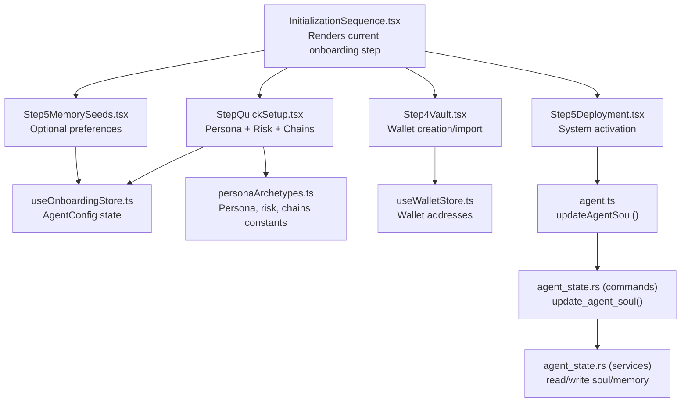
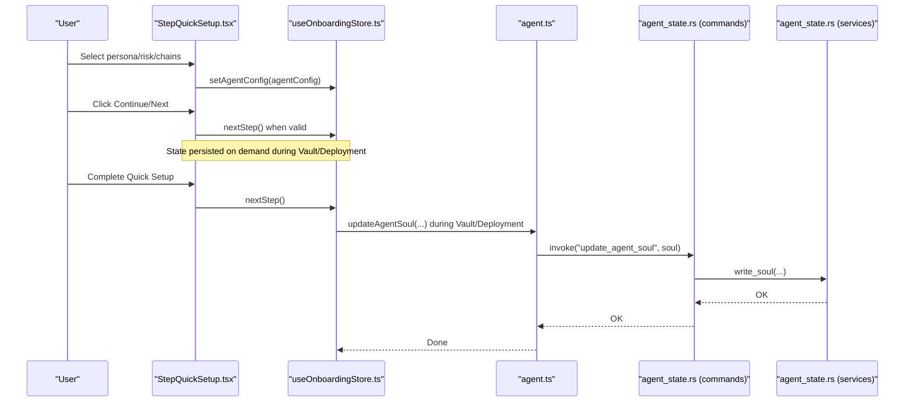
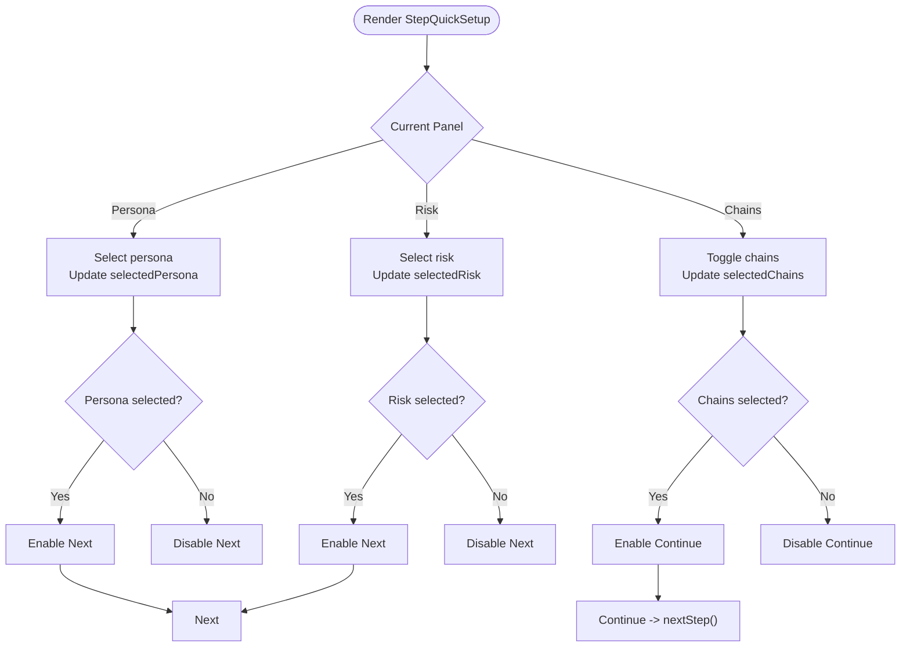
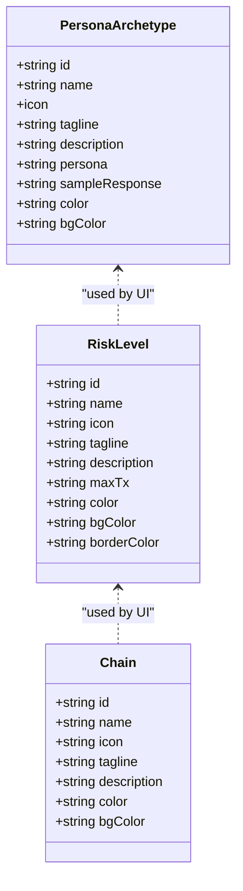
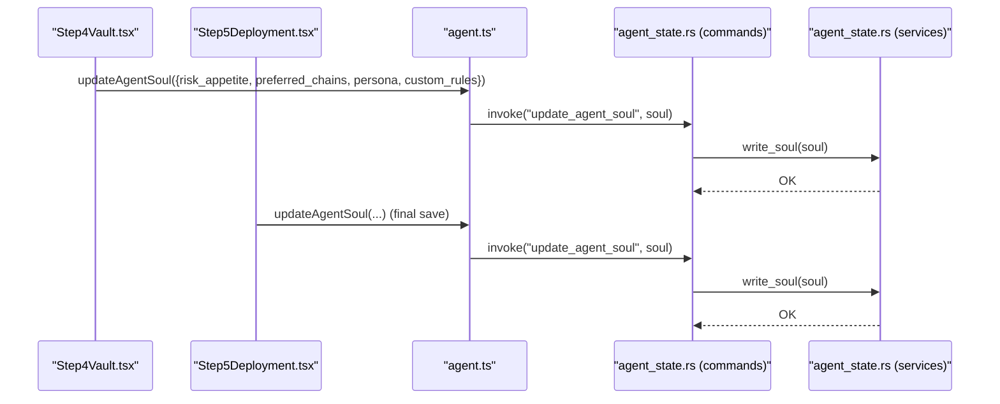
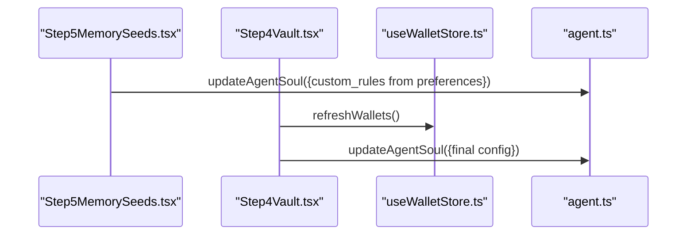
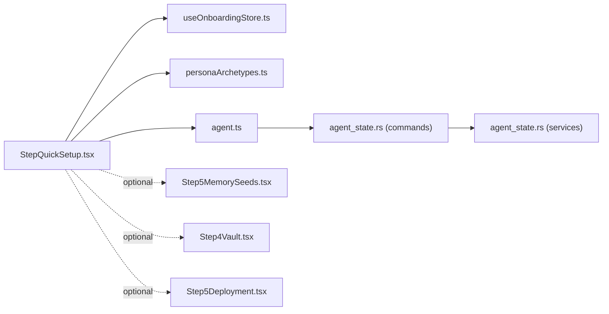
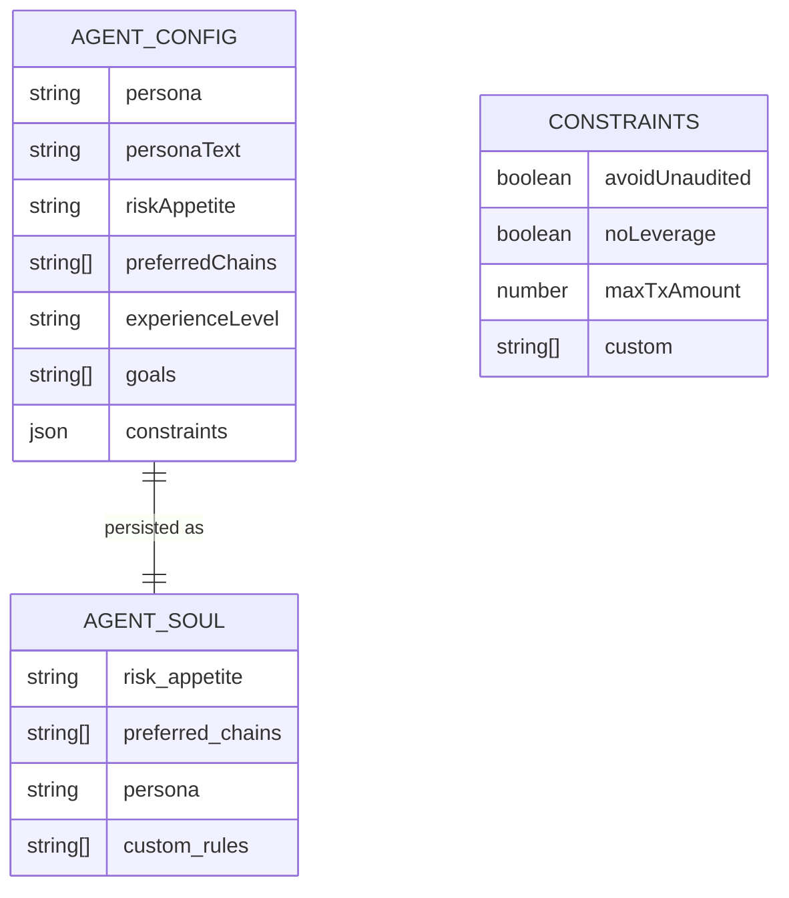

# Quick Setup Process

<cite>
**Referenced Files in This Document**
- [StepQuickSetup.tsx](file://src/components/onboarding/steps/StepQuickSetup.tsx)
- [personaArchetypes.ts](file://src/constants/personaArchetypes.ts)
- [useOnboardingStore.ts](file://src/store/useOnboardingStore.ts)
- [InitializationSequence.tsx](file://src/components/onboarding/InitializationSequence.tsx)
- [Step5MemorySeeds.tsx](file://src/components/onboarding/steps/Step5MemorySeeds.tsx)
- [Step4Vault.tsx](file://src/components/onboarding/steps/Step4Vault.tsx)
- [Step5Deployment.tsx](file://src/components/onboarding/steps/Step5Deployment.tsx)
- [agent.ts](file://src/lib/agent.ts)
- [useWalletStore.ts](file://src/store/useWalletStore.ts)
- [agent_state.rs](file://src-tauri/src/commands/agent_state.rs)
- [agent_state.rs](file://src-tauri/src/services/agent_state.rs)
- [agent_chat.rs](file://src-tauri/src/services/agent_chat.rs)
- [payload.rs](file://src-tauri/src/services/apps/payload.rs)
- [agent.ts](file://src/types/agent.ts)
</cite>

## Table of Contents
1. [Introduction](#introduction)
2. [Project Structure](#project-structure)
3. [Core Components](#core-components)
4. [Architecture Overview](#architecture-overview)
5. [Detailed Component Analysis](#detailed-component-analysis)
6. [Dependency Analysis](#dependency-analysis)
7. [Performance Considerations](#performance-considerations)
8. [Troubleshooting Guide](#troubleshooting-guide)
9. [Conclusion](#conclusion)
10. [Appendices](#appendices)

## Introduction
This document explains the Quick Setup process that combines persona selection, risk profile assessment, and blockchain chain preferences into a single efficient onboarding step. It documents the streamlined 5-step flow, the component architecture that unifies multiple configuration aspects, and the backend integration that immediately activates the system. It also covers UX design choices for rapid onboarding, validation and state management, error handling, and extension strategies for adding more configuration options while preserving simplicity.

## Project Structure
The Quick Setup is part of a larger onboarding sequence rendered in a modal overlay. The sequence coordinates multiple steps, with Quick Setup consolidating persona, risk, and chain preferences.

**Diagram sources**
- [InitializationSequence.tsx:11-52](file://src/components/onboarding/InitializationSequence.tsx#L11-L52)
- [StepQuickSetup.tsx:13-260](file://src/components/onboarding/steps/StepQuickSetup.tsx#L13-L260)
- [Step5MemorySeeds.tsx:8-73](file://src/components/onboarding/steps/Step5MemorySeeds.tsx#L8-L73)
- [Step4Vault.tsx:10-104](file://src/components/onboarding/steps/Step4Vault.tsx#L10-L104)
- [Step5Deployment.tsx:19-78](file://src/components/onboarding/steps/Step5Deployment.tsx#L19-L78)
- [useOnboardingStore.ts:54-105](file://src/store/useOnboardingStore.ts#L54-L105)
- [personaArchetypes.ts:16-150](file://src/constants/personaArchetypes.ts#L16-L150)
- [useWalletStore.ts:16-47](file://src/store/useWalletStore.ts#L16-L47)
- [agent.ts:71-73](file://src/lib/agent.ts#L71-L73)
- [agent_state.rs:14-19](file://src-tauri/src/commands/agent_state.rs#L14-L19)
- [agent_state.rs:46-76](file://src-tauri/src/services/agent_state.rs#L46-L76)

**Section sources**
- [InitializationSequence.tsx:11-52](file://src/components/onboarding/InitializationSequence.tsx#L11-L52)
- [StepQuickSetup.tsx:13-260](file://src/components/onboarding/steps/StepQuickSetup.tsx#L13-L260)
- [useOnboardingStore.ts:54-105](file://src/store/useOnboardingStore.ts#L54-L105)
- [personaArchetypes.ts:16-150](file://src/constants/personaArchetypes.ts#L16-L150)

## Core Components
- Quick Setup step: Consolidates persona selection, risk appetite, and chain preferences into a single 3-panel carousel with navigation and validation.
- Constants: Defines persona archetypes, risk levels, and chain options used by the Quick Setup and subsequent steps.
- Onboarding store: Centralized state for agent configuration and onboarding progression.
- Backend integration: Persists agent soul (personality, risk, chains, custom rules) and manages wallet lifecycle.

Key responsibilities:
- Persona selection: Renders archetypes with icons and metadata; updates agentConfig with persona id and persona text.
- Risk profile: Presents risk levels with descriptors and max transaction caps; updates riskAppetite.
- Chain preferences: Allows multi-select of chains; updates preferredChains.
- Validation: Enables Next/Continue only when selections are valid.
- Immediate activation: Persists agent soul and optionally seeds memories during vault and deployment steps.

**Section sources**
- [StepQuickSetup.tsx:13-260](file://src/components/onboarding/steps/StepQuickSetup.tsx#L13-L260)
- [personaArchetypes.ts:16-150](file://src/constants/personaArchetypes.ts#L16-L150)
- [useOnboardingStore.ts:4-52](file://src/store/useOnboardingStore.ts#L4-L52)
- [agent.ts:71-73](file://src/lib/agent.ts#L71-L73)

## Architecture Overview
The Quick Setup composes three distinct configuration domains (persona, risk, chains) into a unified UI while delegating persistence to the backend. The flow integrates frontend state management with Tauri commands that write to local state files.

**Diagram sources**
- [StepQuickSetup.tsx:105-113](file://src/components/onboarding/steps/StepQuickSetup.tsx#L105-L113)
- [useOnboardingStore.ts:65-68](file://src/store/useOnboardingStore.ts#L65-L68)
- [agent.ts:71-73](file://src/lib/agent.ts#L71-L73)
- [agent_state.rs:14-19](file://src-tauri/src/commands/agent_state.rs#L14-L19)
- [agent_state.rs:56-60](file://src-tauri/src/services/agent_state.rs#L56-L60)

## Detailed Component Analysis

### Quick Setup UI and State Management
The Quick Setup component orchestrates three panels:
- Persona panel: Grid of archetypes with icons and taglines.
- Risk panel: Cards representing risk levels with max transaction indicators.
- Chains panel: Multi-select grid of supported chains.

State and validation:
- Local state tracks selected values per category.
- Global onboarding store holds agentConfig and controls step progression.
- Validation enforces non-empty selections per step.

Navigation:
- Next/Back buttons move between persona → risk → chains → continue.
- Continue triggers nextStep() when chains are selected.

**Diagram sources**
- [StepQuickSetup.tsx:98-113](file://src/components/onboarding/steps/StepQuickSetup.tsx#L98-L113)
- [StepQuickSetup.tsx:115-219](file://src/components/onboarding/steps/StepQuickSetup.tsx#L115-L219)
- [useOnboardingStore.ts:65-68](file://src/store/useOnboardingStore.ts#L65-L68)

**Section sources**
- [StepQuickSetup.tsx:13-260](file://src/components/onboarding/steps/StepQuickSetup.tsx#L13-L260)
- [useOnboardingStore.ts:4-52](file://src/store/useOnboardingStore.ts#L4-L52)

### Persona Archetypes, Risk Levels, and Chain Options
These constants define the available choices for persona selection, risk appetite, and chain preferences. They are consumed by the Quick Setup UI and by downstream steps for optional preferences.

- Persona archetypes: id, name, icon, tagline, description, persona prompt, and colors.
- Risk levels: id, name, emoji, tagline, description, max transaction cap, and styling.
- Chains: id, name, emoji, tagline, description, and styling.

**Diagram sources**
- [personaArchetypes.ts:4-73](file://src/constants/personaArchetypes.ts#L4-L73)
- [personaArchetypes.ts:75-120](file://src/constants/personaArchetypes.ts#L75-L120)
- [personaArchetypes.ts:122-150](file://src/constants/personaArchetypes.ts#L122-L150)

**Section sources**
- [personaArchetypes.ts:16-150](file://src/constants/personaArchetypes.ts#L16-L150)

### Backend Integration and Immediate Activation
The system persists agent configuration to local state via Tauri commands. During Quick Setup, the primary effect is updating the in-memory agentConfig. Persistence occurs during the Vault and Deployment steps.

- Frontend: agent.updateAgentSoul(soul) invoked from Vault and Deployment steps.
- Backend: Tauri command update_agent_soul writes to soul.json and triggers snapshot upload.
- Optional: Custom rules from Step5MemorySeeds are added as memory facts.

**Diagram sources**
- [Step4Vault.tsx:79-99](file://src/components/onboarding/steps/Step4Vault.tsx#L79-L99)
- [Step5Deployment.tsx:34-50](file://src/components/onboarding/steps/Step5Deployment.tsx#L34-L50)
- [agent.ts:71-73](file://src/lib/agent.ts#L71-L73)
- [agent_state.rs:14-19](file://src-tauri/src/commands/agent_state.rs#L14-L19)
- [agent_state.rs:56-60](file://src-tauri/src/services/agent_state.rs#L56-L60)

**Section sources**
- [Step4Vault.tsx:79-99](file://src/components/onboarding/steps/Step4Vault.tsx#L79-L99)
- [Step5Deployment.tsx:34-50](file://src/components/onboarding/steps/Step5Deployment.tsx#L34-L50)
- [agent.ts:71-73](file://src/lib/agent.ts#L71-L73)
- [agent_state.rs:14-19](file://src-tauri/src/commands/agent_state.rs#L14-L19)
- [agent_state.rs:56-60](file://src-tauri/src/services/agent_state.rs#L56-L60)

### Optional Preferences and Wallet Integration
After Quick Setup, users can refine preferences (experience level, goals, custom rules) and configure a wallet. Wallet operations integrate with the wallet store and Tauri commands for listing, creating, and importing identities.

- Preferences: Step5MemorySeeds updates agentConfig.constraints.custom and experience/goals.
- Wallet: Step4Vault supports generating/importing identities and persists agent soul upon sealing.
- Final activation: Step5Deployment performs the last persistence and displays a welcome message.

**Diagram sources**
- [Step5MemorySeeds.tsx:45-73](file://src/components/onboarding/steps/Step5MemorySeeds.tsx#L45-L73)
- [Step4Vault.tsx:23-37](file://src/components/onboarding/steps/Step4Vault.tsx#L23-L37)
- [useWalletStore.ts:23-37](file://src/store/useWalletStore.ts#L23-L37)
- [agent.ts:71-73](file://src/lib/agent.ts#L71-L73)

**Section sources**
- [Step5MemorySeeds.tsx:8-203](file://src/components/onboarding/steps/Step5MemorySeeds.tsx#L8-L203)
- [Step4Vault.tsx:10-330](file://src/components/onboarding/steps/Step4Vault.tsx#L10-L330)
- [useWalletStore.ts:16-47](file://src/store/useWalletStore.ts#L16-L47)

## Dependency Analysis
The Quick Setup depends on:
- Constants for persona, risk, and chains.
- Onboarding store for state and navigation.
- Agent library for backend persistence.
- Tauri commands/services for writing agent soul and memory.

**Diagram sources**
- [StepQuickSetup.tsx:13-260](file://src/components/onboarding/steps/StepQuickSetup.tsx#L13-L260)
- [useOnboardingStore.ts:54-105](file://src/store/useOnboardingStore.ts#L54-L105)
- [personaArchetypes.ts:16-150](file://src/constants/personaArchetypes.ts#L16-L150)
- [agent.ts:71-73](file://src/lib/agent.ts#L71-L73)
- [agent_state.rs:14-19](file://src-tauri/src/commands/agent_state.rs#L14-L19)
- [agent_state.rs:46-76](file://src-tauri/src/services/agent_state.rs#L46-L76)

**Section sources**
- [StepQuickSetup.tsx:13-260](file://src/components/onboarding/steps/StepQuickSetup.tsx#L13-L260)
- [useOnboardingStore.ts:54-105](file://src/store/useOnboardingStore.ts#L54-L105)
- [agent.ts:71-73](file://src/lib/agent.ts#L71-L73)

## Performance Considerations
- Single-page transitions: Framer Motion animations are lightweight and optimized for UI transitions between panels.
- Minimal re-renders: Local state updates are scoped to the Quick Setup component; global store updates occur only on navigation or completion.
- Backend I/O: Persistence uses Tauri commands; batching saves is handled in Vault and Deployment steps to reduce redundant writes.
- Scalability: Adding new configuration categories should reuse the existing pattern: define constants, add UI handlers, update agentConfig, and persist in the appropriate step.

## Troubleshooting Guide
Common issues and remedies:
- Cannot continue: Ensure persona, risk, and at least one chain are selected; validation disables Next/Continue otherwise.
- Wallet errors: If wallet generation/import fails, a warning toast is shown; retry after correcting input or network conditions.
- Persistence failures: If saving agent soul fails during Deployment, a warning is shown but the user can still complete onboarding; retry later in Settings.
- Replay mode: When updating existing configurations, ensure the existing soul and memories are loaded into agentConfig before proceeding.

UX safeguards:
- Disabled buttons prevent invalid transitions.
- Clear messaging indicates current step and progress.
- Replay mode indicates “Updating configuration” to avoid confusion.

**Section sources**
- [StepQuickSetup.tsx:98-113](file://src/components/onboarding/steps/StepQuickSetup.tsx#L98-L113)
- [Step4Vault.tsx:47-52](file://src/components/onboarding/steps/Step4Vault.tsx#L47-L52)
- [Step5Deployment.tsx:45-49](file://src/components/onboarding/steps/Step5Deployment.tsx#L45-L49)

## Conclusion
The Quick Setup streamlines onboarding by combining persona, risk, and chain preferences into a single, validated step powered by a centralized onboarding store. Immediate system activation is achieved through backend persistence during Vault and Deployment steps, ensuring the agent’s personality, risk appetite, and preferences are applied promptly. The modular architecture supports easy extension with additional configuration options while maintaining a fast, frictionless user experience.

## Appendices

### Data Model for Agent Configuration
The agent configuration captured during onboarding maps directly to the backend agent soul.

**Diagram sources**
- [useOnboardingStore.ts:4-17](file://src/store/useOnboardingStore.ts#L4-L17)
- [agent.ts:168-173](file://src/types/agent.ts#L168-L173)

### Extension Guidance
To add new configuration options while keeping Quick Setup simple:
- Define constants for new options in personaArchetypes.ts.
- Add UI handlers in StepQuickSetup.tsx to update agentConfig.
- Persist in the appropriate step (Vault or Deployment) using agent.updateAgentSoul or addAgentMemory.
- Keep validation logic close to the UI to maintain clarity and responsiveness.

[No sources needed since this section provides general guidance]