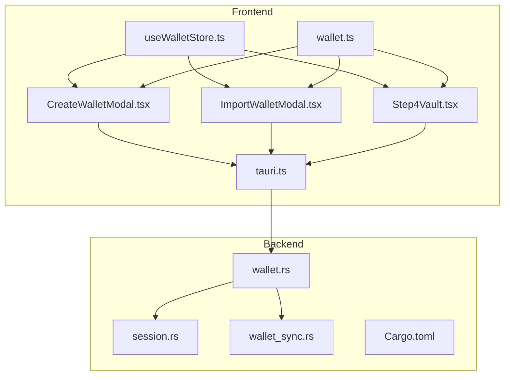
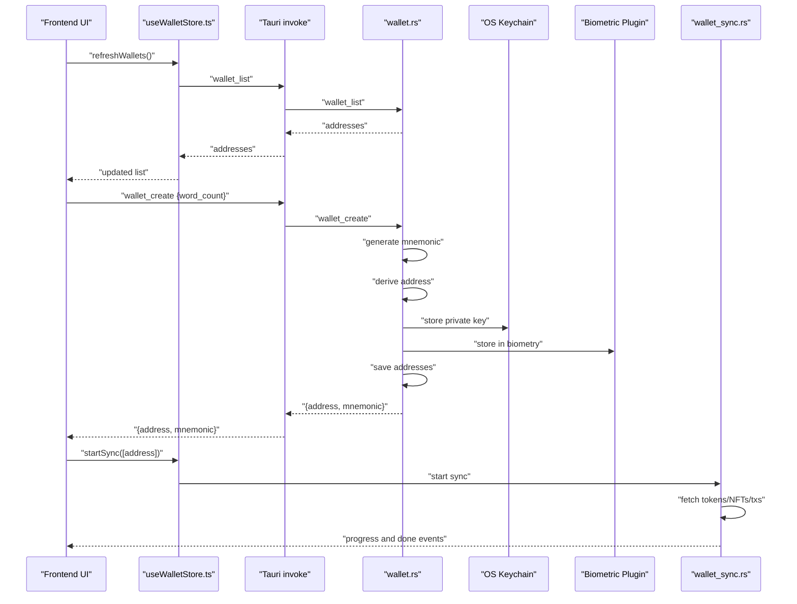
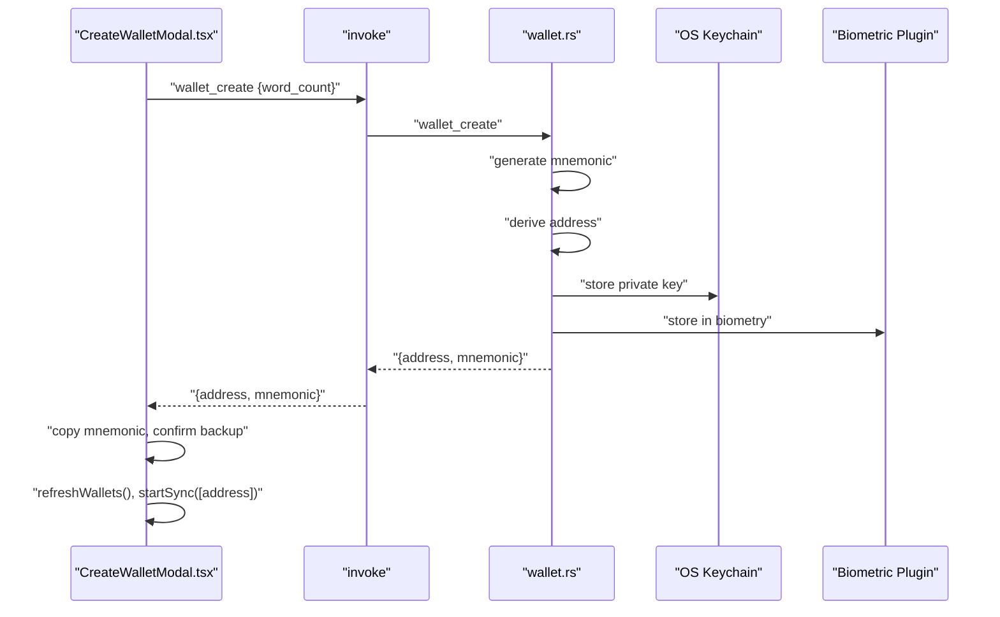
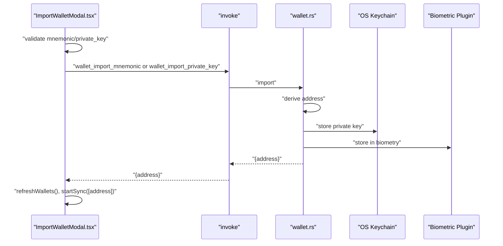
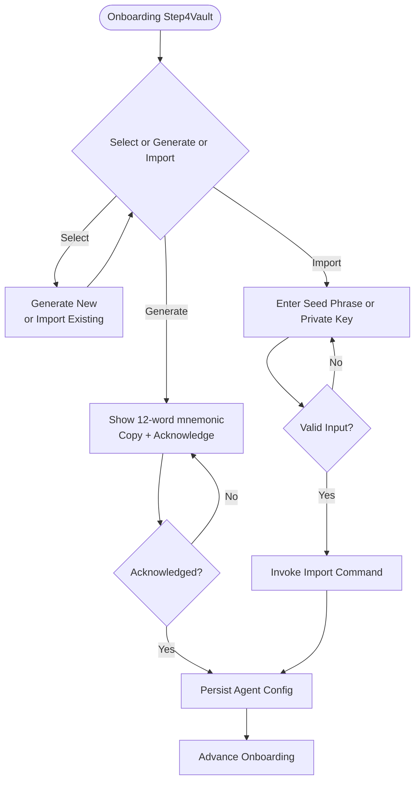
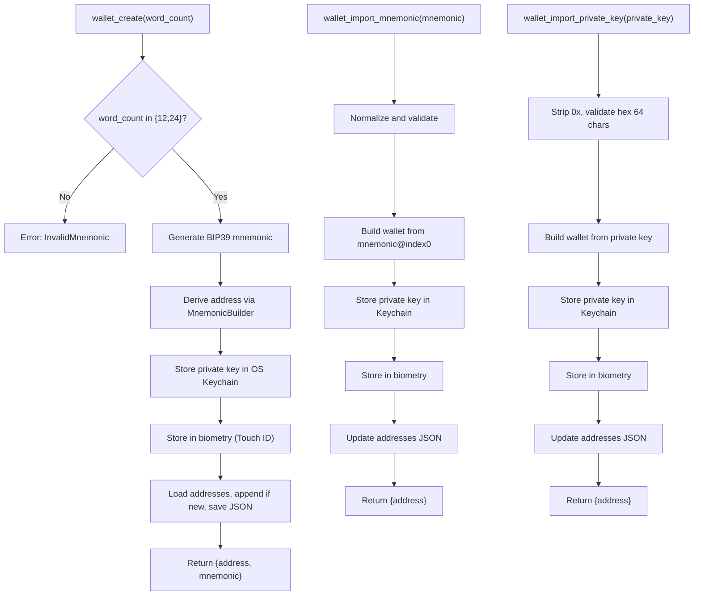
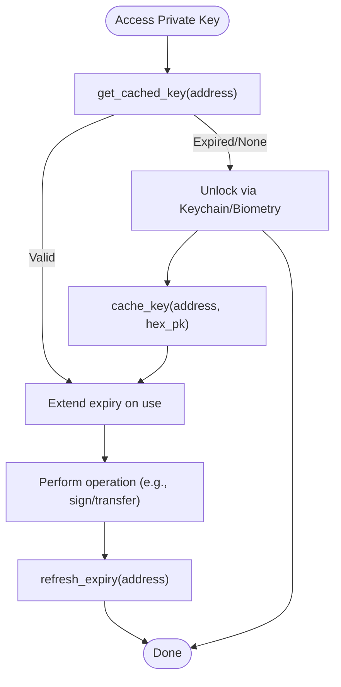
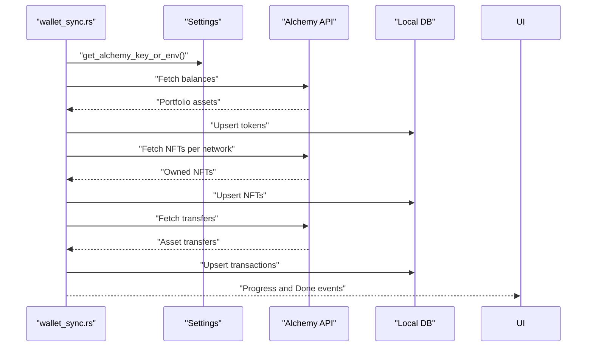
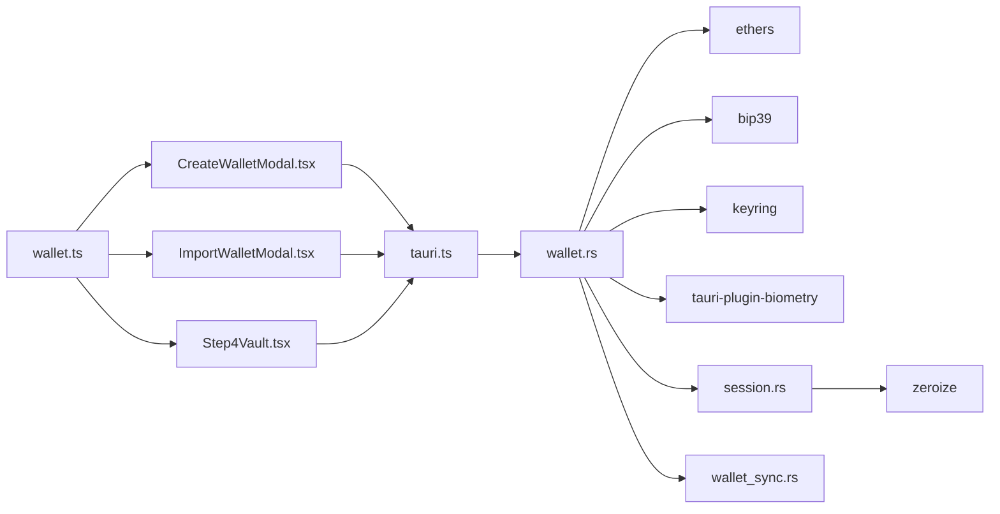

# Vault Creation & Security

<cite>
**Referenced Files in This Document**
- [CreateWalletModal.tsx](file://src/components/wallet/CreateWalletModal.tsx)
- [ImportWalletModal.tsx](file://src/components/wallet/ImportWalletModal.tsx)
- [Step4Vault.tsx](file://src/components/onboarding/steps/Step4Vault.tsx)
- [wallet.rs](file://src-tauri/src/commands/wallet.rs)
- [session.rs](file://src-tauri/src/session.rs)
- [wallet_sync.rs](file://src-tauri/src/services/wallet_sync.rs)
- [useWalletStore.ts](file://src/store/useWalletStore.ts)
- [wallet.ts](file://src/types/wallet.ts)
- [tauri.ts](file://src/lib/tauri.ts)
- [Cargo.toml](file://src-tauri/Cargo.toml)
- [README.md](file://README.md)
- [shadow-protocol.md](file://docs/shadow-protocol.md)
</cite>

## Table of Contents
1. [Introduction](#introduction)
2. [Project Structure](#project-structure)
3. [Core Components](#core-components)
4. [Architecture Overview](#architecture-overview)
5. [Detailed Component Analysis](#detailed-component-analysis)
6. [Dependency Analysis](#dependency-analysis)
7. [Performance Considerations](#performance-considerations)
8. [Troubleshooting Guide](#troubleshooting-guide)
9. [Conclusion](#conclusion)
10. [Appendices](#appendices)

## Introduction
This document explains the secure wallet creation and security configuration process in the application. It covers the vault setup workflow, key generation, cryptographic safeguards, and the integration between the frontend UI and the Rust backend. It also documents the CreateWalletModal and ImportWalletModal components, the onboarding Step4Vault flow, key derivation and storage, encryption and biometric protection, and the transition from onboarding to operational security. Guidance on best practices, compliance considerations, and extensibility is included.

## Project Structure
The vault creation and security stack spans three layers:
- Frontend UI components for wallet creation and import
- Frontend stores and typed types for wallet operations
- Rust backend commands for key generation, import, and secure storage
- Session management for temporary in-memory access to private keys
- Wallet synchronization service for post-onboarding portfolio data

**Diagram sources**
- [CreateWalletModal.tsx:1-169](file://src/components/wallet/CreateWalletModal.tsx#L1-L169)
- [ImportWalletModal.tsx:1-181](file://src/components/wallet/ImportWalletModal.tsx#L1-L181)
- [Step4Vault.tsx:1-330](file://src/components/onboarding/steps/Step4Vault.tsx#L1-L330)
- [useWalletStore.ts:1-48](file://src/store/useWalletStore.ts#L1-L48)
- [wallet.ts:1-59](file://src/types/wallet.ts#L1-L59)
- [tauri.ts:1-4](file://src/lib/tauri.ts#L1-L4)
- [wallet.rs:1-284](file://src-tauri/src/commands/wallet.rs#L1-L284)
- [session.rs:1-145](file://src-tauri/src/session.rs#L1-L145)
- [wallet_sync.rs:1-453](file://src-tauri/src/services/wallet_sync.rs#L1-L453)
- [Cargo.toml:1-44](file://src-tauri/Cargo.toml#L1-L44)

**Section sources**
- [README.md:173-189](file://README.md#L173-L189)
- [shadow-protocol.md:188-218](file://docs/shadow-protocol.md#L188-L218)

## Core Components
- CreateWalletModal: Generates a new EVM wallet, displays the mnemonic, and triggers wallet sync.
- ImportWalletModal: Imports an existing wallet via mnemonic or private key, validates inputs, and starts sync.
- Step4Vault (onboarding): Provides a guided flow to generate or import a wallet during onboarding, with copy and acknowledgment steps.
- Wallet backend commands: Create/import/list/remove wallets, store private keys in OS keychain, optionally protect with biometrics, and manage address lists.
- Session cache: Manages temporary in-memory access to decrypted private keys with expiration and secure wiping.
- Wallet sync service: Fetches tokens, NFTs, and transaction history for newly created/imported wallets.

**Section sources**
- [CreateWalletModal.tsx:24-168](file://src/components/wallet/CreateWalletModal.tsx#L24-L168)
- [ImportWalletModal.tsx:35-180](file://src/components/wallet/ImportWalletModal.tsx#L35-L180)
- [Step4Vault.tsx:10-330](file://src/components/onboarding/steps/Step4Vault.tsx#L10-L330)
- [wallet.rs:169-284](file://src-tauri/src/commands/wallet.rs#L169-L284)
- [session.rs:1-145](file://src-tauri/src/session.rs#L1-L145)
- [wallet_sync.rs:260-453](file://src-tauri/src/services/wallet_sync.rs#L260-L453)

## Architecture Overview
The security architecture centers on keeping sensitive operations in Rust while exposing a minimal IPC surface to the frontend. Private keys are stored in the OS keychain and optionally protected by biometric unlock. Unlocked keys are cached in memory only for a bounded session window and are securely wiped on lock or app exit.

**Diagram sources**
- [useWalletStore.ts:23-37](file://src/store/useWalletStore.ts#L23-L37)
- [wallet.rs:169-200](file://src-tauri/src/commands/wallet.rs#L169-L200)
- [wallet_sync.rs:260-453](file://src-tauri/src/services/wallet_sync.rs#L260-L453)

**Section sources**
- [README.md:98-104](file://README.md#L98-L104)
- [shadow-protocol.md:192-199](file://docs/shadow-protocol.md#L192-L199)

## Detailed Component Analysis

### CreateWalletModal
- Purpose: Securely generate a new EVM wallet, display the mnemonic, and initiate sync.
- Key behaviors:
  - Word count selection (12 or 24 words).
  - Calls backend wallet_create with chosen word count.
  - Displays the mnemonic and address after creation.
  - Copies mnemonic to clipboard and confirms backup.
  - Refreshes wallet list and starts sync for the new address.
- Security considerations:
  - Mnemonic is shown once and never re-displayed by the app.
  - Clipboard copy is acknowledged with a toast.
  - Backend generates the mnemonic and derives the address locally.

**Diagram sources**
- [CreateWalletModal.tsx:33-62](file://src/components/wallet/CreateWalletModal.tsx#L33-L62)
- [wallet.rs:169-200](file://src-tauri/src/commands/wallet.rs#L169-L200)

**Section sources**
- [CreateWalletModal.tsx:24-168](file://src/components/wallet/CreateWalletModal.tsx#L24-L168)
- [wallet.ts:3-6](file://src/types/wallet.ts#L3-L6)

### ImportWalletModal
- Purpose: Import an existing wallet via mnemonic or private key.
- Key behaviors:
  - Tabbed interface for mnemonic vs private key.
  - Input validation for mnemonic length and private key format.
  - Calls backend wallet_import_mnemonic or wallet_import_private_key.
  - Starts sync for the imported address.
- Security considerations:
  - Strict validation prevents malformed inputs.
  - Private key input is masked.
  - Errors are surfaced to the user with actionable messages.

**Diagram sources**
- [ImportWalletModal.tsx:51-94](file://src/components/wallet/ImportWalletModal.tsx#L51-L94)
- [wallet.rs:202-258](file://src-tauri/src/commands/wallet.rs#L202-L258)

**Section sources**
- [ImportWalletModal.tsx:35-180](file://src/components/wallet/ImportWalletModal.tsx#L35-L180)
- [wallet.ts:8-10](file://src/types/wallet.ts#L8-L10)

### Step4Vault (Onboarding)
- Purpose: Guided onboarding step for sealing the vault by generating or importing a wallet.
- Key behaviors:
  - Select mode: generate new or import existing.
  - Generate mode: displays mnemonic words, copy to clipboard, acknowledgment checkbox.
  - Import mode: accepts seed phrase or private key, auto-detects format.
  - After success, persists agent configuration and advances onboarding.
- Security considerations:
  - Emphasizes irreversible loss if mnemonic is lost.
  - Requires explicit acknowledgment before proceeding.

**Diagram sources**
- [Step4Vault.tsx:10-330](file://src/components/onboarding/steps/Step4Vault.tsx#L10-L330)

**Section sources**
- [Step4Vault.tsx:10-330](file://src/components/onboarding/steps/Step4Vault.tsx#L10-L330)

### Backend Wallet Commands (Key Generation, Import, Storage)
- Key generation:
  - Validates requested word count (12 or 24).
  - Generates mnemonic using BIP39.
  - Derives address using Ethers and a fixed index.
  - Stores private key in OS keychain and optionally in biometric-protected storage.
  - Persists address list in a JSON file separate from keychain.
- Import flows:
  - Mnemonic import: normalizes and validates, derives address, stores keys.
  - Private key import: validates hex format, strips 0x if present, derives address, stores keys.
- Listing and removal:
  - Lists addresses from JSON file.
  - Removes private key and biometric data, updates address list.

**Diagram sources**
- [wallet.rs:169-284](file://src-tauri/src/commands/wallet.rs#L169-L284)

**Section sources**
- [wallet.rs:1-284](file://src-tauri/src/commands/wallet.rs#L1-L284)
- [Cargo.toml:20-44](file://src-tauri/Cargo.toml#L20-L44)

### Session Management (Temporary In-Memory Access)
- Purpose: Cache decrypted private keys in memory for a bounded session window.
- Key behaviors:
  - Cache stores a single unlocked key with 30-minute inactivity expiry.
  - On access, expiry is extended; on successful operations, expiry is refreshed.
  - Keys are securely wiped using zeroization on clear or app exit.
  - Provides status queries for UI to gate sensitive actions.
- Security considerations:
  - No persistent disk storage of decrypted keys.
  - Clear-on-exit semantics prevent leakage across sessions.

**Diagram sources**
- [session.rs:31-75](file://src-tauri/src/session.rs#L31-L75)

**Section sources**
- [session.rs:1-145](file://src-tauri/src/session.rs#L1-L145)

### Wallet Synchronization (Post-Onboarding)
- Purpose: Populate local database with tokens, NFTs, and transactions for the new wallet.
- Key behaviors:
  - Emits progress events for tokens, NFTs, and transactions.
  - Queries Alchemy for balances and transfers.
  - Upserts data into local SQLite and captures portfolio snapshots.
  - Emits completion events with success or error details.
- Security considerations:
  - No secrets leave the backend; API keys are retrieved from settings.
  - Data remains local until explicitly synced.

**Diagram sources**
- [wallet_sync.rs:260-453](file://src-tauri/src/services/wallet_sync.rs#L260-L453)

**Section sources**
- [wallet_sync.rs:1-453](file://src-tauri/src/services/wallet_sync.rs#L1-L453)

## Dependency Analysis
- Frontend depends on typed wallet types and invokes backend commands via Tauri.
- Backend wallet commands depend on Ethers for key derivation, bip39 for mnemonic generation, keyring for OS keychain, and tauri-plugin-biometry for Touch ID.
- Session cache depends on zeroize for secure memory wiping.
- Wallet sync depends on Alchemy API keys and local database services.

**Diagram sources**
- [wallet.ts:1-59](file://src/types/wallet.ts#L1-L59)
- [CreateWalletModal.tsx:1-169](file://src/components/wallet/CreateWalletModal.tsx#L1-L169)
- [ImportWalletModal.tsx:1-181](file://src/components/wallet/ImportWalletModal.tsx#L1-L181)
- [Step4Vault.tsx:1-330](file://src/components/onboarding/steps/Step4Vault.tsx#L1-L330)
- [tauri.ts:1-4](file://src/lib/tauri.ts#L1-L4)
- [wallet.rs:1-284](file://src-tauri/src/commands/wallet.rs#L1-L284)
- [session.rs:1-145](file://src-tauri/src/session.rs#L1-L145)
- [wallet_sync.rs:1-453](file://src-tauri/src/services/wallet_sync.rs#L1-L453)
- [Cargo.toml:20-44](file://src-tauri/Cargo.toml#L20-L44)

**Section sources**
- [Cargo.toml:20-44](file://src-tauri/Cargo.toml#L20-L44)

## Performance Considerations
- Key generation and derivation are CPU-bound but fast in practice; avoid repeated generation in UI loops.
- Biometric storage may fall back to keychain password prompts on unsigned builds; plan for potential latency.
- Wallet sync is I/O bound and asynchronous; use progress events to keep UI responsive.
- Session cache reduces repeated OS prompts by storing decrypted keys in RAM for a bounded window.

## Troubleshooting Guide
- Wallet creation/import errors:
  - Invalid mnemonic or private key format: ensure 12/24 words or 64-character hex (with or without 0x).
  - OS keychain errors: verify OS keychain availability and permissions.
  - Biometric failures: on dev builds, biometric storage may silently fall back; rely on keychain unlock.
- Sync failures:
  - Missing API key: configure ALCHEMY_API_KEY in settings.
  - Network/API errors: retry after verifying connectivity and API limits.
- Session lock:
  - If the session appears locked, trigger unlock again; cached keys expire after inactivity.
- Recovery:
  - If you lose your mnemonic, recovery is not possible within the app; ensure you backed up the phrase securely.

**Section sources**
- [wallet.rs:18-37](file://src-tauri/src/commands/wallet.rs#L18-L37)
- [wallet_sync.rs:261-274](file://src-tauri/src/services/wallet_sync.rs#L261-L274)
- [session.rs:96-107](file://src-tauri/src/session.rs#L96-L107)

## Conclusion
The vault creation and security configuration process is designed around local-first, backend-owned sensitive operations. Private keys are stored in OS keychain and optionally protected by biometrics, with in-memory caching for a bounded session window. The frontend provides guided flows for generation and import, with strong validation and user acknowledgments. Post-onboarding, wallet sync populates local data safely and securely.

## Appendices

### Security Best Practices
- Always back up the mnemonic offline and never share it.
- Prefer biometric unlock when available; otherwise, use OS keychain with a strong system password.
- Keep the app updated and avoid unsigned builds for production use.
- Limit clipboard usage to copy mnemonics; avoid storing secrets in plaintext.

### Compliance Considerations
- Treat the repository as security-sensitive; follow documented conventions.
- Avoid describing flows as “live” if they stop at preview/approval.
- Clearly distinguish implemented features from roadmap items.

### Extensibility Guidance
- Hardware Security Module (HSM) support:
  - Integrate HSM-backed key derivation by extending the key storage abstraction in the backend.
  - Ensure the HSM plugin integrates with the existing keychain and biometric layers.
- Additional security features:
  - Multi-signature workflows: extend wallet commands to support threshold signatures.
  - Audit logging: augment session and wallet commands to record unlock/sign events.
  - Encrypted backups: implement encrypted export/import of wallet metadata alongside mnemonic protection.

**Section sources**
- [README.md:183-188](file://README.md#L183-L188)
- [shadow-protocol.md:392-401](file://docs/shadow-protocol.md#L392-L401)