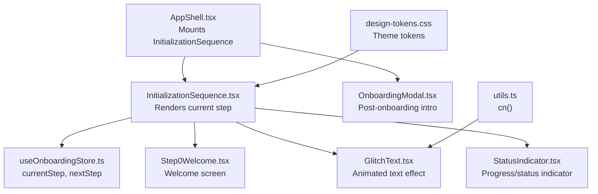
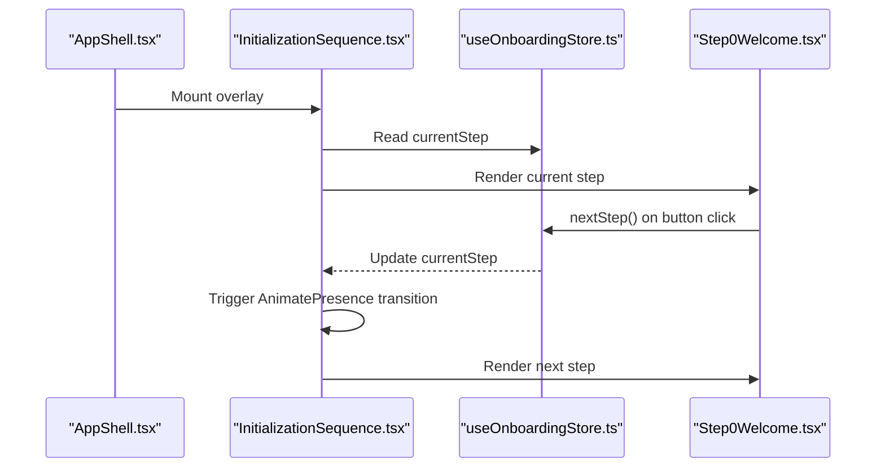
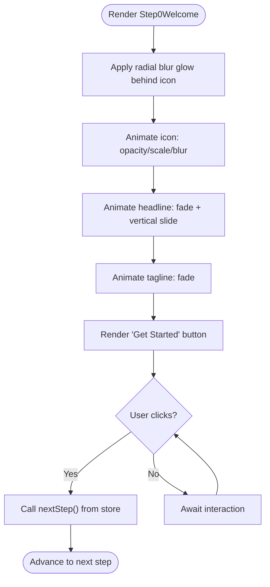
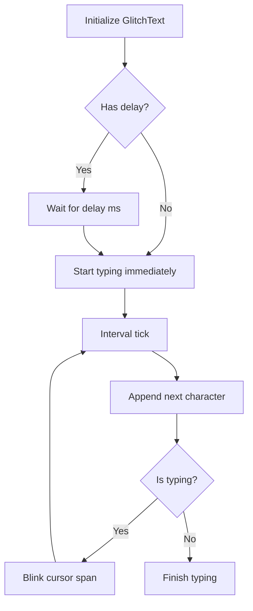
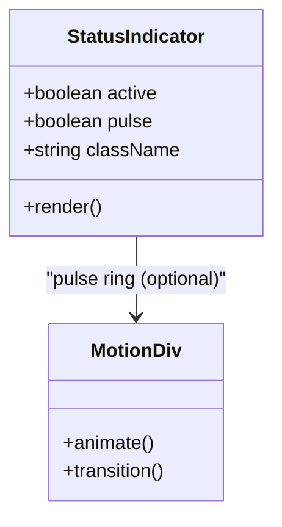
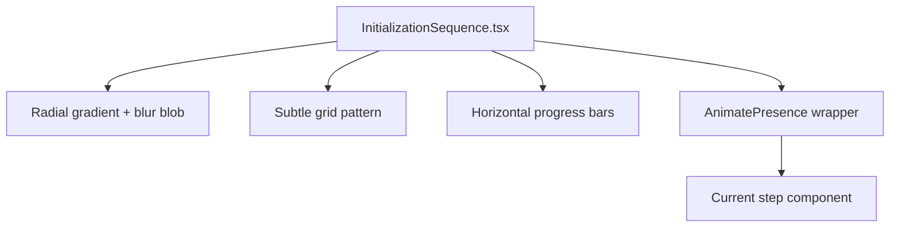
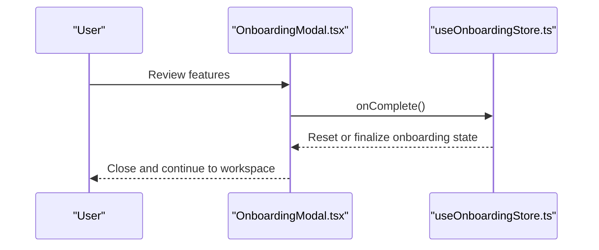
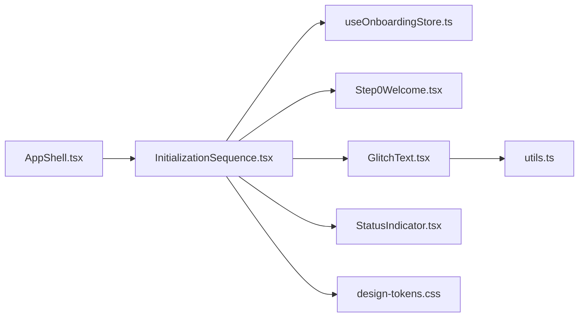

# Welcome & Introduction

<cite>
**Referenced Files in This Document**
- [Step0Welcome.tsx](file://src/components/onboarding/steps/Step0Welcome.tsx)
- [GlitchText.tsx](file://src/components/onboarding/ui/GlitchText.tsx)
- [StatusIndicator.tsx](file://src/components/onboarding/ui/StatusIndicator.tsx)
- [InitializationSequence.tsx](file://src/components/onboarding/InitializationSequence.tsx)
- [OnboardingModal.tsx](file://src/components/layout/OnboardingModal.tsx)
- [useOnboardingStore.ts](file://src/store/useOnboardingStore.ts)
- [AppShell.tsx](file://src/components/layout/AppShell.tsx)
- [design-tokens.css](file://src/styles/design-tokens.css)
- [utils.ts](file://src/lib/utils.ts)
</cite>

## Table of Contents
1. [Introduction](#introduction)
2. [Project Structure](#project-structure)
3. [Core Components](#core-components)
4. [Architecture Overview](#architecture-overview)
5. [Detailed Component Analysis](#detailed-component-analysis)
6. [Dependency Analysis](#dependency-analysis)
7. [Performance Considerations](#performance-considerations)
8. [Troubleshooting Guide](#troubleshooting-guide)
9. [Conclusion](#conclusion)
10. [Appendices](#appendices)

## Introduction
This document explains the Step0Welcome component and the initial user introduction process. It covers the welcoming experience design, animated entrance effects, progress indicators, and the onboarding flow positioning. It also documents the visual design elements such as radial gradients and grid patterns, the psychological impact of the onboarding initiation, responsive design considerations, accessibility features, transition mechanics to subsequent steps, and guidance for customizing the welcome experience while maintaining brand consistency.

## Project Structure
The onboarding experience is composed of:
- A global onboarding orchestration component that renders the current step with smooth transitions.
- A store that tracks onboarding state and step progression.
- Step-specific components for each stage.
- UI primitives for text effects and status indicators.
- A modal that introduces the product after the onboarding sequence completes.

**Diagram sources**
- [AppShell.tsx:257](file://src/components/layout/AppShell.tsx#L257)
- [InitializationSequence.tsx:11-52](file://src/components/onboarding/InitializationSequence.tsx#L11-L52)
- [useOnboardingStore.ts:54-70](file://src/store/useOnboardingStore.ts#L54-L70)
- [Step0Welcome.tsx:5-53](file://src/components/onboarding/steps/Step0Welcome.tsx#L5-L53)
- [GlitchText.tsx:13-73](file://src/components/onboarding/ui/GlitchText.tsx#L13-L73)
- [StatusIndicator.tsx:4-30](file://src/components/onboarding/ui/StatusIndicator.tsx#L4-L30)
- [OnboardingModal.tsx:18-69](file://src/components/layout/OnboardingModal.tsx#L18-L69)
- [design-tokens.css:1-46](file://src/styles/design-tokens.css#L1-L46)
- [utils.ts:4-6](file://src/lib/utils.ts#L4-L6)

**Section sources**
- [AppShell.tsx:257](file://src/components/layout/AppShell.tsx#L257)
- [InitializationSequence.tsx:11-52](file://src/components/onboarding/InitializationSequence.tsx#L11-L52)
- [useOnboardingStore.ts:54-70](file://src/store/useOnboardingStore.ts#L54-L70)
- [Step0Welcome.tsx:5-53](file://src/components/onboarding/steps/Step0Welcome.tsx#L5-L53)
- [GlitchText.tsx:13-73](file://src/components/onboarding/ui/GlitchText.tsx#L13-L73)
- [StatusIndicator.tsx:4-30](file://src/components/onboarding/ui/StatusIndicator.tsx#L4-L30)
- [OnboardingModal.tsx:18-69](file://src/components/layout/OnboardingModal.tsx#L18-L69)
- [design-tokens.css:1-46](file://src/styles/design-tokens.css#L1-L46)
- [utils.ts:4-6](file://src/lib/utils.ts#L4-L6)

## Core Components
- Step0Welcome: The first screen of the onboarding sequence. It renders the brand icon with a radial glow, animated title, and a prominent “Get Started” button that advances the onboarding flow.
- GlitchText: A reusable animated text primitive that simulates a digital typing/glitch effect with a blinking cursor.
- StatusIndicator: A small visual indicator that can optionally pulse to signal activity or readiness.
- InitializationSequence: The container that orchestrates step rendering, manages scroll locking, applies background visuals, and controls transitions between steps.
- OnboardingModal: A post-onboarding modal that introduces the product’s privacy-first stance and key capabilities.
- useOnboardingStore: The Zustand store that tracks current step, replay mode, and completion state.

**Section sources**
- [Step0Welcome.tsx:5-53](file://src/components/onboarding/steps/Step0Welcome.tsx#L5-L53)
- [GlitchText.tsx:13-73](file://src/components/onboarding/ui/GlitchText.tsx#L13-L73)
- [StatusIndicator.tsx:4-30](file://src/components/onboarding/ui/StatusIndicator.tsx#L4-L30)
- [InitializationSequence.tsx:11-114](file://src/components/onboarding/InitializationSequence.tsx#L11-L114)
- [OnboardingModal.tsx:18-69](file://src/components/layout/OnboardingModal.tsx#L18-L69)
- [useOnboardingStore.ts:54-105](file://src/store/useOnboardingStore.ts#L54-L105)

## Architecture Overview
The onboarding flow is rendered as a full-screen overlay above the main application shell. The InitializationSequence component:
- Locks page scrolling while onboarding is active.
- Renders a dynamic background with radial gradient and subtle grid pattern.
- Displays a horizontal progress indicator aligned to the current step.
- Uses Framer Motion to animate step transitions.
- Delegates step rendering to individual step components.

**Diagram sources**
- [AppShell.tsx:257](file://src/components/layout/AppShell.tsx#L257)
- [InitializationSequence.tsx:11-114](file://src/components/onboarding/InitializationSequence.tsx#L11-L114)
- [useOnboardingStore.ts:65-66](file://src/store/useOnboardingStore.ts#L65-L66)
- [Step0Welcome.tsx:6](file://src/components/onboarding/steps/Step0Welcome.tsx#L6)

**Section sources**
- [AppShell.tsx:257](file://src/components/layout/AppShell.tsx#L257)
- [InitializationSequence.tsx:16-26](file://src/components/onboarding/InitializationSequence.tsx#L16-L26)
- [InitializationSequence.tsx:54-114](file://src/components/onboarding/InitializationSequence.tsx#L54-L114)
- [useOnboardingStore.ts:65-66](file://src/store/useOnboardingStore.ts#L65-L66)
- [Step0Welcome.tsx:6](file://src/components/onboarding/steps/Step0Welcome.tsx#L6)

## Detailed Component Analysis

### Step0Welcome: Animated Entrance and Immersive First Impression
- Animated entrance: The brand area scales and fades in with blur transitioning to focus, creating a sense of arrival and emphasis.
- Visual centering: Flex layout centers content vertically and horizontally for a balanced composition.
- Branding: A central icon with a soft radial blur glow anchors the identity.
- Typography: Headline and subtitle use brand-friendly typography and color tokens.
- Call-to-action: A bordered, elevated button with hover animation and a trailing chevron conveys interactivity and forward momentum.

**Diagram sources**
- [Step0Welcome.tsx:10-22](file://src/components/onboarding/steps/Step0Welcome.tsx#L10-L22)
- [Step0Welcome.tsx:24-34](file://src/components/onboarding/steps/Step0Welcome.tsx#L24-L34)
- [Step0Welcome.tsx:41-50](file://src/components/onboarding/steps/Step0Welcome.tsx#L41-L50)
- [useOnboardingStore.ts:65-66](file://src/store/useOnboardingStore.ts#L65-L66)

**Section sources**
- [Step0Welcome.tsx:5-53](file://src/components/onboarding/steps/Step0Welcome.tsx#L5-L53)

### GlitchText: Digital Typing Effect and Cursor Animation
- Typewriter simulation: Characters are revealed incrementally at a configurable speed.
- Optional delay: A startup delay allows for staged reveals.
- Blinking cursor: A short vertical bar blinks to mimic a terminal-style cursor.
- Motion integration: Initial fade-in and transition timing are coordinated with the reveal.

**Diagram sources**
- [GlitchText.tsx:23-49](file://src/components/onboarding/ui/GlitchText.tsx#L23-L49)
- [GlitchText.tsx:64-70](file://src/components/onboarding/ui/GlitchText.tsx#L64-L70)

**Section sources**
- [GlitchText.tsx:13-73](file://src/components/onboarding/ui/GlitchText.tsx#L13-L73)

### StatusIndicator: Pulse and Static States
- Active state: A small dot with optional pulsing ring indicates readiness or ongoing activity.
- Transition: Smooth color transition communicates state changes without jarring animations.
- Accessibility: The indicator is small but visible; pair with textual labels for clarity.

**Diagram sources**
- [StatusIndicator.tsx:4-30](file://src/components/onboarding/ui/StatusIndicator.tsx#L4-L30)

**Section sources**
- [StatusIndicator.tsx:4-30](file://src/components/onboarding/ui/StatusIndicator.tsx#L4-L30)

### InitializationSequence: Background, Progress, and Transitions
- Scroll lock: Disables page scrolling while onboarding is active to keep focus on the overlay.
- Background visuals: Radial gradient and blurred blob provide depth and brand alignment.
- Grid pattern: Subtle grid overlay adds texture without distraction.
- Progress indicators: Horizontal bars reflect current step and completion history.
- Step transitions: AnimatePresence with crossfade and scale/blur effects ensure smooth step changes.

**Diagram sources**
- [InitializationSequence.tsx:54-114](file://src/components/onboarding/InitializationSequence.tsx#L54-L114)

**Section sources**
- [InitializationSequence.tsx:16-26](file://src/components/onboarding/InitializationSequence.tsx#L16-L26)
- [InitializationSequence.tsx:57-69](file://src/components/onboarding/InitializationSequence.tsx#L57-L69)
- [InitializationSequence.tsx:73-86](file://src/components/onboarding/InitializationSequence.tsx#L73-L86)
- [InitializationSequence.tsx:99-110](file://src/components/onboarding/InitializationSequence.tsx#L99-L110)

### OnboardingModal: Post-Onboarding Product Introduction
- Header: Clear, concise headline and description introduce the product philosophy.
- Feature cards: Three pillars (privacy-first, agent guidance, actionable flows) reinforce value.
- Footer: A primary action to enter the workspace and a note about revisiting preferences.

**Diagram sources**
- [OnboardingModal.tsx:63](file://src/components/layout/OnboardingModal.tsx#L63)
- [useOnboardingStore.ts:65](file://src/store/useOnboardingStore.ts#L65)

**Section sources**
- [OnboardingModal.tsx:18-69](file://src/components/layout/OnboardingModal.tsx#L18-L69)
- [useOnboardingStore.ts:65](file://src/store/useOnboardingStore.ts#L65)

## Dependency Analysis
- AppShell mounts InitializationSequence globally, ensuring the overlay is present for the entire onboarding lifecycle.
- InitializationSequence depends on useOnboardingStore for step state and transitions.
- Step0Welcome triggers nextStep, advancing the flow.
- GlitchText and StatusIndicator are reusable UI primitives used across steps.
- design-tokens.css provides theme tokens consumed by backgrounds and components.
- utils.cn composes Tailwind classes safely.

**Diagram sources**
- [AppShell.tsx:257](file://src/components/layout/AppShell.tsx#L257)
- [InitializationSequence.tsx:11-114](file://src/components/onboarding/InitializationSequence.tsx#L11-L114)
- [useOnboardingStore.ts:54-105](file://src/store/useOnboardingStore.ts#L54-L105)
- [Step0Welcome.tsx:5-53](file://src/components/onboarding/steps/Step0Welcome.tsx#L5-L53)
- [GlitchText.tsx:13-73](file://src/components/onboarding/ui/GlitchText.tsx#L13-L73)
- [StatusIndicator.tsx:4-30](file://src/components/onboarding/ui/StatusIndicator.tsx#L4-L30)
- [design-tokens.css:1-46](file://src/styles/design-tokens.css#L1-L46)
- [utils.ts:4-6](file://src/lib/utils.ts#L4-L6)

**Section sources**
- [AppShell.tsx:257](file://src/components/layout/AppShell.tsx#L257)
- [InitializationSequence.tsx:11-114](file://src/components/onboarding/InitializationSequence.tsx#L11-L114)
- [useOnboardingStore.ts:54-105](file://src/store/useOnboardingStore.ts#L54-L105)
- [Step0Welcome.tsx:5-53](file://src/components/onboarding/steps/Step0Welcome.tsx#L5-L53)
- [GlitchText.tsx:13-73](file://src/components/onboarding/ui/GlitchText.tsx#L13-L73)
- [StatusIndicator.tsx:4-30](file://src/components/onboarding/ui/StatusIndicator.tsx#L4-L30)
- [design-tokens.css:1-46](file://src/styles/design-tokens.css#L1-L46)
- [utils.ts:4-6](file://src/lib/utils.ts#L4-L6)

## Performance Considerations
- Animations: Framer Motion animations are GPU-accelerated where possible; keep blur radii and durations reasonable to avoid heavy composite costs.
- Background visuals: Radial gradients and low-opacity blur blobs are lightweight; ensure the grid pattern opacity remains minimal.
- Transitions: The AnimatePresence wrapper uses short-duration transitions; maintain simplicity to prevent jank on lower-end devices.
- Scroll locking: Applied only while onboarding is active to minimize side effects.

[No sources needed since this section provides general guidance]

## Troubleshooting Guide
- Onboarding does not advance: Verify that the “Get Started” button invokes nextStep and that the store updates currentStep.
- Animations stutter: Reduce blur radius or duration in the entrance animations; simplify background visuals if needed.
- Progress indicators not visible: Confirm the progress bar container is rendered and currentStep is within bounds.
- Modal not appearing after onboarding: Ensure the store’s completion action is called and that the modal is wired to the completion callback.

**Section sources**
- [Step0Welcome.tsx:6](file://src/components/onboarding/steps/Step0Welcome.tsx#L6)
- [useOnboardingStore.ts:65-66](file://src/store/useOnboardingStore.ts#L65-L66)
- [InitializationSequence.tsx:73-86](file://src/components/onboarding/InitializationSequence.tsx#L73-L86)

## Conclusion
The Step0Welcome component sets the tone for an immersive, brand-aligned onboarding experience. Through carefully orchestrated entrance animations, radial and grid background elements, and a clear progression mechanism, it establishes user engagement and confidence. The modular architecture supports easy customization while preserving the core UX and visual identity.

[No sources needed since this section summarizes without analyzing specific files]

## Appendices

### Responsive Design Considerations
- Centered flex layout ensures content remains centered across breakpoints.
- Relative sizing for the brand icon and typography adapts to various widths.
- Progress indicators and buttons remain usable on mobile touch targets.

**Section sources**
- [Step0Welcome.tsx:9](file://src/components/onboarding/steps/Step0Welcome.tsx#L9)
- [InitializationSequence.tsx:54-114](file://src/components/onboarding/InitializationSequence.tsx#L54-L114)

### Accessibility Features
- Focus management: Onboarding overlay locks scrolling; ensure keyboard navigation is considered for subsequent steps.
- Contrast and readability: Use theme tokens to maintain sufficient contrast for text and interactive elements.
- Motion preferences: Consider reducing motion where possible; the current animations are gentle and short.

**Section sources**
- [InitializationSequence.tsx:16-26](file://src/components/onboarding/InitializationSequence.tsx#L16-L26)
- [design-tokens.css:1-46](file://src/styles/design-tokens.css#L1-L46)

### Transition Mechanics to Subsequent Steps
- The store’s nextStep increments currentStep, which drives InitializationSequence to re-render the next step.
- AnimatePresence provides a seamless crossfade with subtle scale and blur adjustments.

**Section sources**
- [useOnboardingStore.ts:65-66](file://src/store/useOnboardingStore.ts#L65-L66)
- [InitializationSequence.tsx:99-110](file://src/components/onboarding/InitializationSequence.tsx#L99-L110)

### Customization Guidance
- Brand consistency: Adjust radial gradient colors and blur intensity via design tokens; keep the icon treatment consistent across steps.
- Text and typography: Modify headline and tagline sizes and weights to match evolving brand guidelines.
- Interactions: Keep button affordances similar—hover states, scaling, and chevrons—to preserve familiarity.
- Effects: Maintain the entrance timing and easing to preserve the intended pacing.

**Section sources**
- [design-tokens.css:1-46](file://src/styles/design-tokens.css#L1-L46)
- [Step0Welcome.tsx:10-13](file://src/components/onboarding/steps/Step0Welcome.tsx#L10-L13)
- [InitializationSequence.tsx:100-105](file://src/components/onboarding/InitializationSequence.tsx#L100-L105)