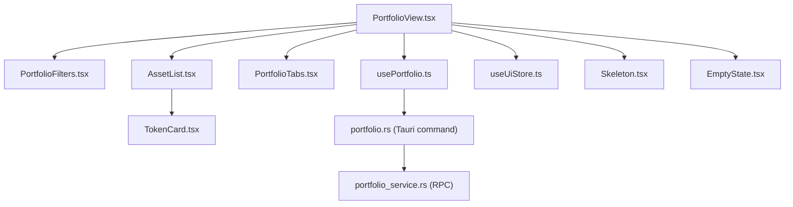
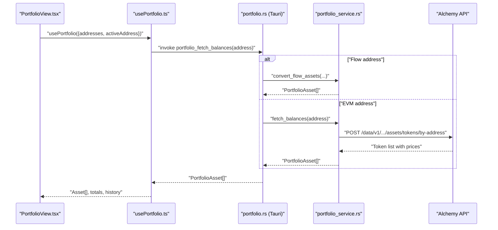
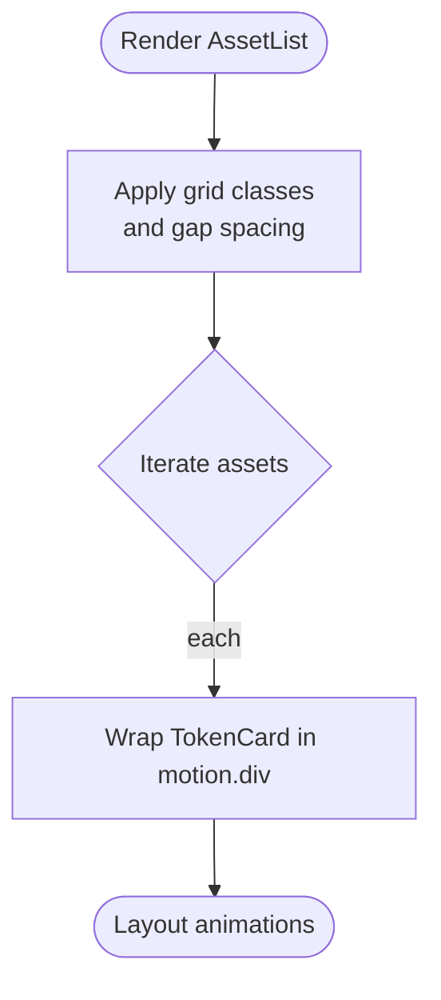
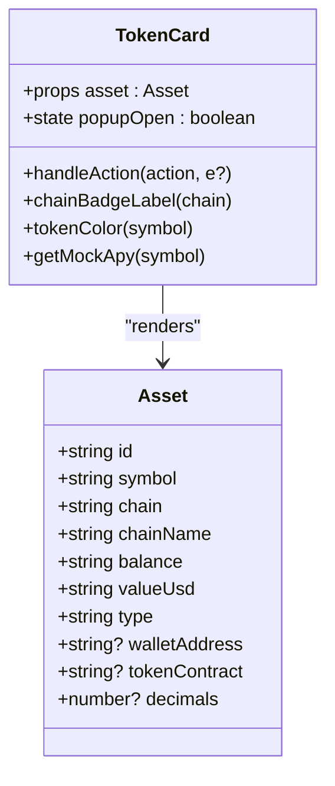
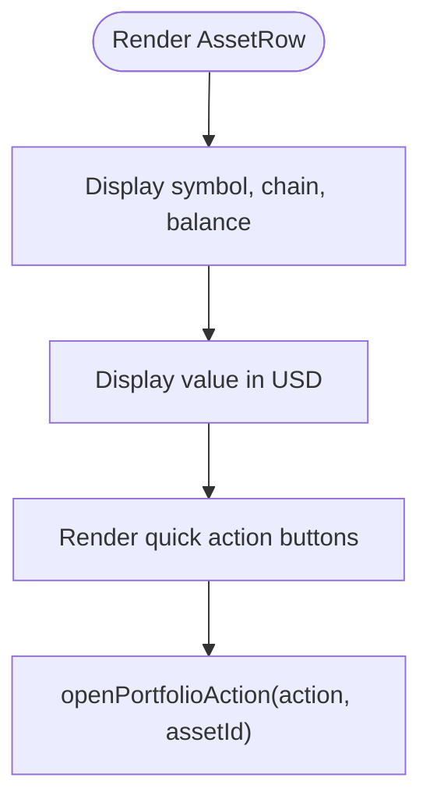
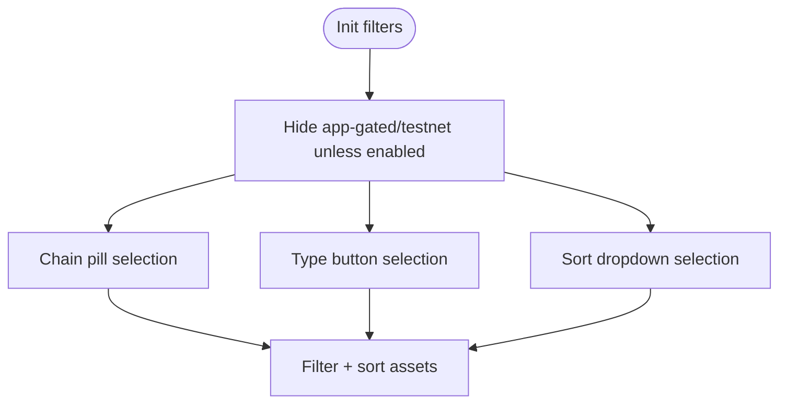
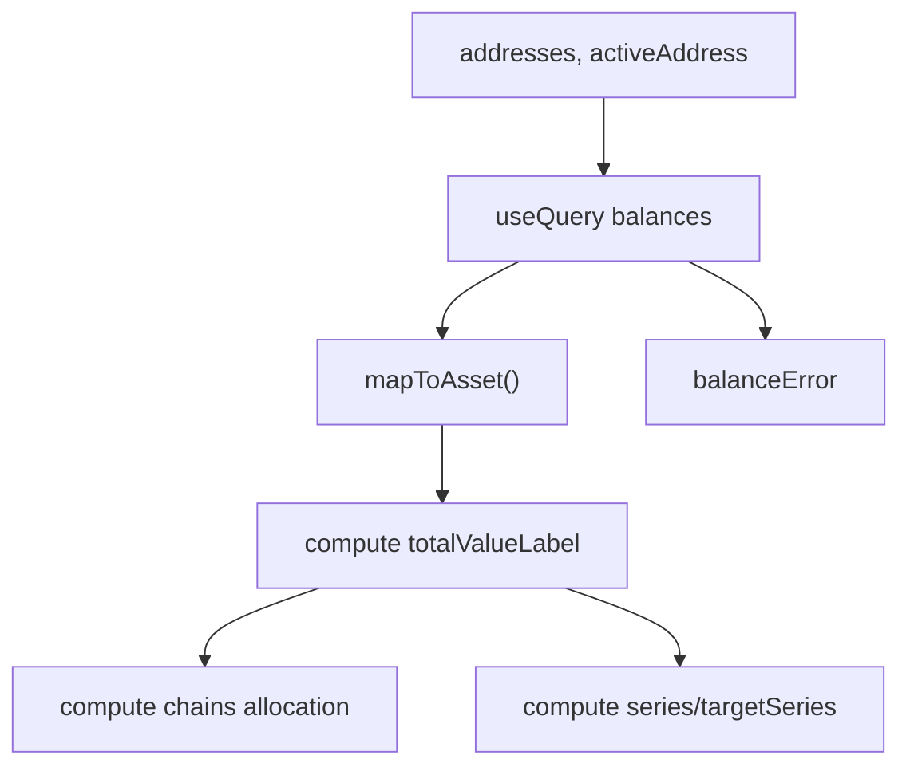
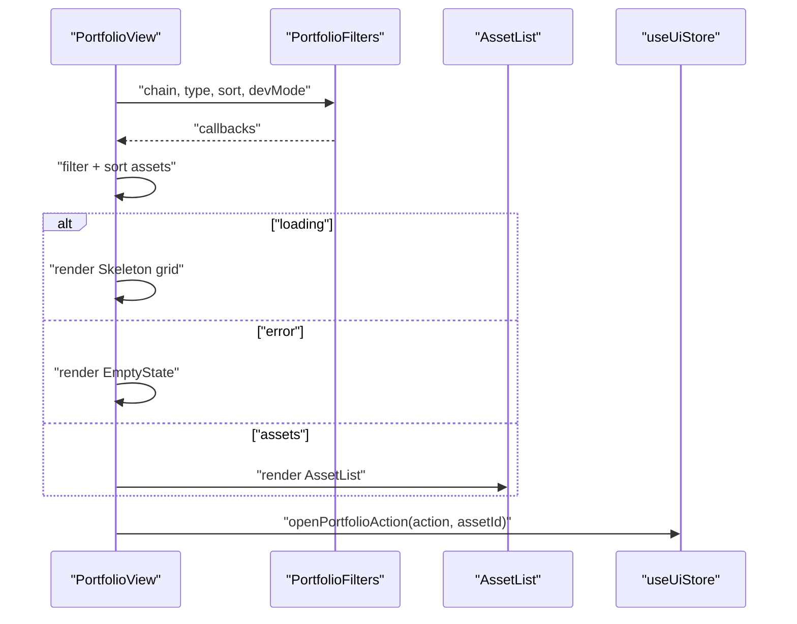
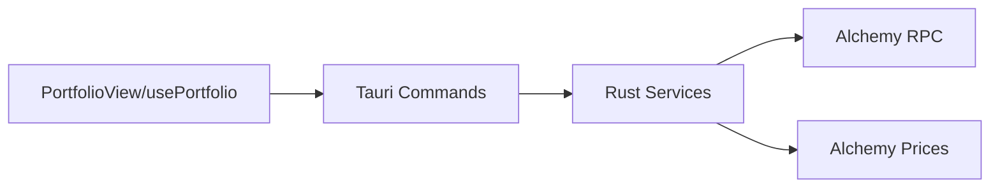

# Asset Management

<cite>
**Referenced Files in This Document**
- [AssetList.tsx](file://src/components/portfolio/AssetList.tsx)
- [AssetRow.tsx](file://src/components/portfolio/AssetRow.tsx)
- [TokenCard.tsx](file://src/components/portfolio/TokenCard.tsx)
- [PortfolioFilters.tsx](file://src/components/portfolio/PortfolioFilters.tsx)
- [PortfolioView.tsx](file://src/components/portfolio/PortfolioView.tsx)
- [PortfolioTabs.tsx](file://src/components/portfolio/PortfolioTabs.tsx)
- [usePortfolio.ts](file://src/hooks/usePortfolio.ts)
- [mock.ts](file://src/data/mock.ts)
- [wallet.ts](file://src/types/wallet.ts)
- [useUiStore.ts](file://src/store/useUiStore.ts)
- [Skeleton.tsx](file://src/components/shared/Skeleton.tsx)
- [EmptyState.tsx](file://src/components/shared/EmptyState.tsx)
- [portfolio_service.rs](file://src-tauri/src/services/portfolio_service.rs)
- [portfolio.rs](file://src-tauri/src/commands/portfolio.rs)
- [PortfolioCard.tsx](file://src/components/home/PortfolioCard.tsx)
</cite>

## Table of Contents
1. [Introduction](#introduction)
2. [Project Structure](#project-structure)
3. [Core Components](#core-components)
4. [Architecture Overview](#architecture-overview)
5. [Detailed Component Analysis](#detailed-component-analysis)
6. [Dependency Analysis](#dependency-analysis)
7. [Performance Considerations](#performance-considerations)
8. [Troubleshooting Guide](#troubleshooting-guide)
9. [Conclusion](#conclusion)

## Introduction
This document explains the asset management system for tracking individual token holdings and cross-chain assets. It covers the display components (AssetList, AssetRow, TokenCard), the filtering and sorting mechanisms, the asset data model, integration with blockchain RPC providers for real-time balance updates, token standard support (ERC-20 and native assets), price feeds, asset selection and quick actions, and UX states including skeleton loading, empty states, and error handling.

## Project Structure
The asset management UI is organized around portfolio views and supporting components:
- Portfolio display and controls: PortfolioView, PortfolioFilters, PortfolioTabs
- Asset presentation: AssetList, TokenCard, AssetRow
- Data and state: usePortfolio hook, mock and typed models, UI store
- Backend integration: Tauri commands and Rust services for RPC and price queries

**Diagram sources**
- [PortfolioView.tsx:33-301](file://src/components/portfolio/PortfolioView.tsx#L33-L301)
- [PortfolioFilters.tsx:43-121](file://src/components/portfolio/PortfolioFilters.tsx#L43-L121)
- [AssetList.tsx:23-40](file://src/components/portfolio/AssetList.tsx#L23-L40)
- [TokenCard.tsx:46-185](file://src/components/portfolio/TokenCard.tsx#L46-L185)
- [PortfolioTabs.tsx:15-55](file://src/components/portfolio/PortfolioTabs.tsx#L15-L55)
- [usePortfolio.ts:32-184](file://src/hooks/usePortfolio.ts#L32-L184)
- [portfolio.rs:43-150](file://src-tauri/src/commands/portfolio.rs#L43-L150)
- [portfolio_service.rs:146-293](file://src-tauri/src/services/portfolio_service.rs#L146-L293)
- [useUiStore.ts:87-162](file://src/store/useUiStore.ts#L87-L162)
- [Skeleton.tsx:7-15](file://src/components/shared/Skeleton.tsx#L7-L15)
- [EmptyState.tsx:13-37](file://src/components/shared/EmptyState.tsx#L13-L37)

**Section sources**
- [PortfolioView.tsx:33-301](file://src/components/portfolio/PortfolioView.tsx#L33-L301)
- [AssetList.tsx:23-40](file://src/components/portfolio/AssetList.tsx#L23-L40)
- [TokenCard.tsx:46-185](file://src/components/portfolio/TokenCard.tsx#L46-L185)
- [PortfolioFilters.tsx:43-121](file://src/components/portfolio/PortfolioFilters.tsx#L43-L121)
- [PortfolioTabs.tsx:15-55](file://src/components/portfolio/PortfolioTabs.tsx#L15-L55)
- [usePortfolio.ts:32-184](file://src/hooks/usePortfolio.ts#L32-L184)
- [portfolio.rs:43-150](file://src-tauri/src/commands/portfolio.rs#L43-L150)
- [portfolio_service.rs:146-293](file://src-tauri/src/services/portfolio_service.rs#L146-L293)
- [useUiStore.ts:87-162](file://src/store/useUiStore.ts#L87-L162)
- [Skeleton.tsx:7-15](file://src/components/shared/Skeleton.tsx#L7-L15)
- [EmptyState.tsx:13-37](file://src/components/shared/EmptyState.tsx#L13-L37)

## Core Components
- AssetList: Grid renderer for TokenCard instances, with animation variants for staggered entry.
- TokenCard: Interactive asset card with quick actions overlay, chain badges, and mock APY indicators.
- AssetRow: Compact row view for asset details and quick actions, used elsewhere in the app.
- PortfolioFilters: Chain/type filters, sorting selector, and developer mode toggling.
- usePortfolio: Centralized hook orchestrating balance fetching, history, totals, and derived analytics.

**Section sources**
- [AssetList.tsx:23-40](file://src/components/portfolio/AssetList.tsx#L23-L40)
- [TokenCard.tsx:46-185](file://src/components/portfolio/TokenCard.tsx#L46-L185)
- [AssetRow.tsx:9-63](file://src/components/portfolio/AssetRow.tsx#L9-L63)
- [PortfolioFilters.tsx:43-121](file://src/components/portfolio/PortfolioFilters.tsx#L43-L121)
- [usePortfolio.ts:32-184](file://src/hooks/usePortfolio.ts#L32-L184)

## Architecture Overview
The asset management pipeline integrates frontend UI with Tauri backend commands and Rust services that query blockchain RPCs and price feeds.

**Diagram sources**
- [PortfolioView.tsx:35-38](file://src/components/portfolio/PortfolioView.tsx#L35-L38)
- [usePortfolio.ts:44-60](file://src/hooks/usePortfolio.ts#L44-L60)
- [portfolio.rs:43-91](file://src-tauri/src/commands/portfolio.rs#L43-L91)
- [portfolio_service.rs:146-293](file://src-tauri/src/services/portfolio_service.rs#L146-L293)

## Detailed Component Analysis

### AssetList
Renders a responsive grid of TokenCard components with animation variants for staggered entrance. It receives a flat array of Asset objects and maps each to a card.

**Diagram sources**
- [AssetList.tsx:23-40](file://src/components/portfolio/AssetList.tsx#L23-L40)

**Section sources**
- [AssetList.tsx:23-40](file://src/components/portfolio/AssetList.tsx#L23-L40)

### TokenCard
Displays a single asset with:
- Symbol and chain badge
- USD value and formatted balance
- Mock APY badge for supported symbols
- Quick actions overlay (Send, Swap, Bridge)
- Popup modal with expanded details and actions

**Diagram sources**
- [TokenCard.tsx:46-185](file://src/components/portfolio/TokenCard.tsx#L46-L185)
- [mock.ts:114-127](file://src/data/mock.ts#L114-L127)

**Section sources**
- [TokenCard.tsx:46-185](file://src/components/portfolio/TokenCard.tsx#L46-L185)
- [mock.ts:114-127](file://src/data/mock.ts#L114-L127)

### AssetRow
Provides a compact row layout with:
- Symbol, chain pill, and balance
- Value display and quick action buttons (Send, Swap, Bridge)
- Uses UI store to dispatch portfolio actions

**Diagram sources**
- [AssetRow.tsx:9-63](file://src/components/portfolio/AssetRow.tsx#L9-L63)
- [useUiStore.ts:103-105](file://src/store/useUiStore.ts#L103-L105)

**Section sources**
- [AssetRow.tsx:9-63](file://src/components/portfolio/AssetRow.tsx#L9-L63)
- [useUiStore.ts:103-105](file://src/store/useUiStore.ts#L103-L105)

### PortfolioFilters
Implements:
- Chain filter: “All”, Ethereum, Base, Polygon, Flow, and testnets
- Type filter: “All Assets”, “Tokens”, “Stablecoins”
- Sorting: by Value, Chain, Symbol
- Developer mode toggle: reveals testnet chains and app-gated chains when installed

**Diagram sources**
- [PortfolioFilters.tsx:43-121](file://src/components/portfolio/PortfolioFilters.tsx#L43-L121)

**Section sources**
- [PortfolioFilters.tsx:43-121](file://src/components/portfolio/PortfolioFilters.tsx#L43-L121)

### usePortfolio Hook
Centralizes:
- Balance fetching via Tauri commands (single or multi-address)
- History and performance series computation
- Derived analytics: total value, chain breakdown, series, target series
- Error handling and loading states

**Diagram sources**
- [usePortfolio.ts:32-184](file://src/hooks/usePortfolio.ts#L32-L184)
- [wallet.ts:20-31](file://src/types/wallet.ts#L20-L31)

**Section sources**
- [usePortfolio.ts:32-184](file://src/hooks/usePortfolio.ts#L32-L184)
- [wallet.ts:20-31](file://src/types/wallet.ts#L20-L31)

### PortfolioView
Orchestrates:
- Wallets and portfolio data
- Filtering and sorting
- Loading, error, and empty states
- Action modals (Send, Swap, Bridge) via UI store
- Tabs: Tokens, NFTs, Transactions

**Diagram sources**
- [PortfolioView.tsx:67-91](file://src/components/portfolio/PortfolioView.tsx#L67-L91)
- [PortfolioView.tsx:209-235](file://src/components/portfolio/PortfolioView.tsx#L209-L235)
- [PortfolioView.tsx:260-297](file://src/components/portfolio/PortfolioView.tsx#L260-L297)
- [useUiStore.ts:103-105](file://src/store/useUiStore.ts#L103-L105)

**Section sources**
- [PortfolioView.tsx:33-301](file://src/components/portfolio/PortfolioView.tsx#L33-L301)
- [useUiStore.ts:103-105](file://src/store/useUiStore.ts#L103-L105)

## Dependency Analysis
- Frontend depends on Tauri commands for balance retrieval and history.
- Tauri commands delegate to Rust services that query Alchemy for token lists and prices.
- Token standards supported include native assets and ERC-20s via Alchemy metadata and balances.
- Price feeds are integrated via Alchemy Prices API for on-demand symbol pricing.

**Diagram sources**
- [portfolio.rs:43-91](file://src-tauri/src/commands/portfolio.rs#L43-L91)
- [portfolio_service.rs:146-293](file://src-tauri/src/services/portfolio_service.rs#L146-L293)
- [portfolio_service.rs:312-351](file://src-tauri/src/services/portfolio_service.rs#L312-L351)

**Section sources**
- [portfolio.rs:43-91](file://src-tauri/src/commands/portfolio.rs#L43-L91)
- [portfolio_service.rs:146-293](file://src-tauri/src/services/portfolio_service.rs#L146-L293)
- [portfolio_service.rs:312-351](file://src-tauri/src/services/portfolio_service.rs#L312-L351)

## Performance Considerations
- Stale-time caching: Balances and history are cached to reduce RPC calls.
- Multi-address aggregation: Combined results sorted by value for efficient rendering.
- Local DB fallback: Tauri commands first query local storage before hitting RPCs.
- Rendering optimizations: Animated grid layout and memoized computations minimize re-renders.

[No sources needed since this section provides general guidance]

## Troubleshooting Guide
Common scenarios and handling:
- No wallets configured: Show WalletEmptyState and provide Create/Import actions.
- Loading state: Render Skeleton grid while balances are being fetched.
- Filter mismatch: Show EmptyState with reset filters action.
- Balance fetch errors: Display error message via EmptyState and expose retry via refresh button.
- Action availability: Hero actions require a selected asset; otherwise prompt to select or ensure a balance.

**Section sources**
- [PortfolioView.tsx:152-157](file://src/components/portfolio/PortfolioView.tsx#L152-L157)
- [PortfolioView.tsx:209-235](file://src/components/portfolio/PortfolioView.tsx#L209-L235)
- [PortfolioView.tsx:215-221](file://src/components/portfolio/PortfolioView.tsx#L215-L221)
- [PortfolioView.tsx:122-129](file://src/components/portfolio/PortfolioView.tsx#L122-L129)
- [PortfolioView.tsx:100-110](file://src/components/portfolio/PortfolioView.tsx#L100-L110)

## Conclusion
The asset management system combines a flexible UI for viewing and interacting with token holdings across chains with robust backend integration for real-time balance updates and price feeds. The filtering, sorting, and developer mode toggles enable precise control over what is displayed, while skeleton loading, empty states, and error handling provide resilient UX. The usePortfolio hook centralizes data orchestration, and Tauri commands/Rust services ensure scalable and secure access to blockchain data.