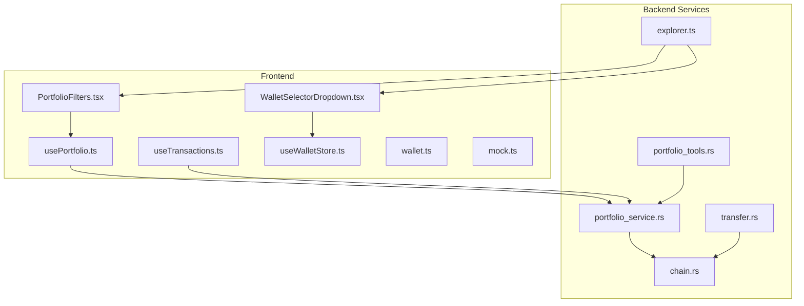
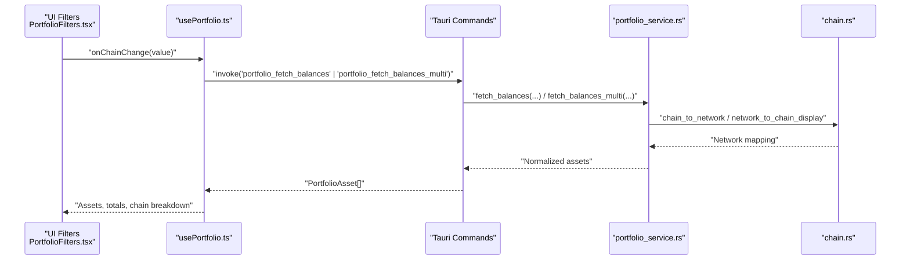
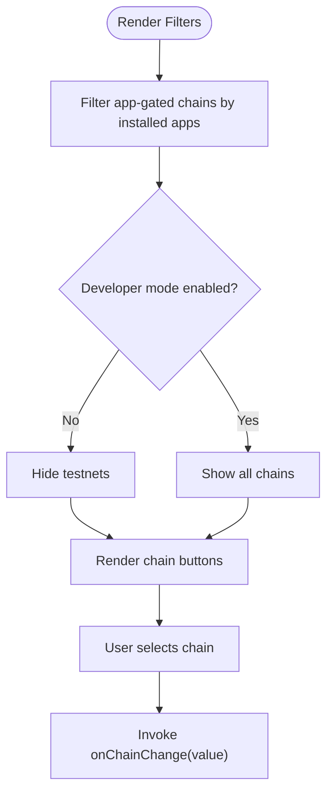
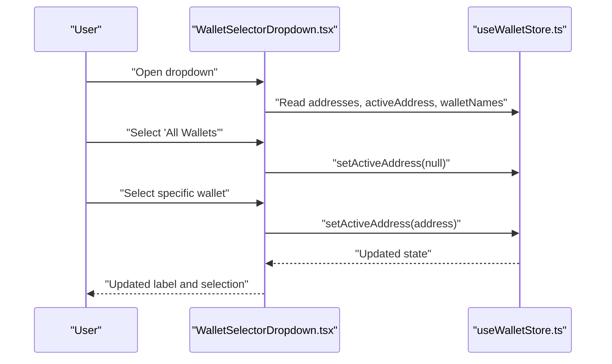
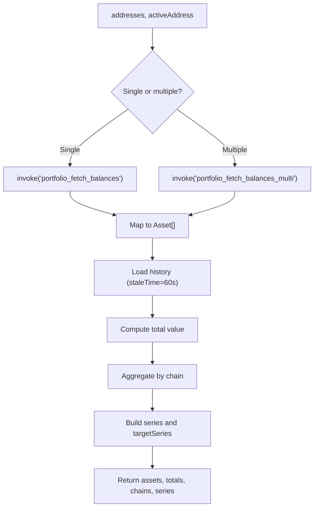
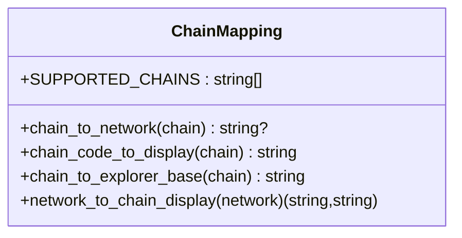
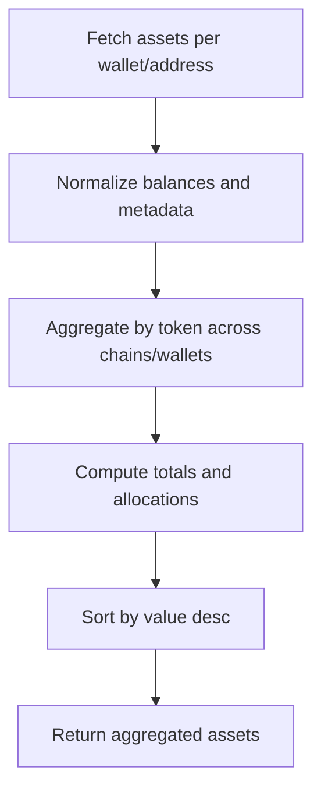
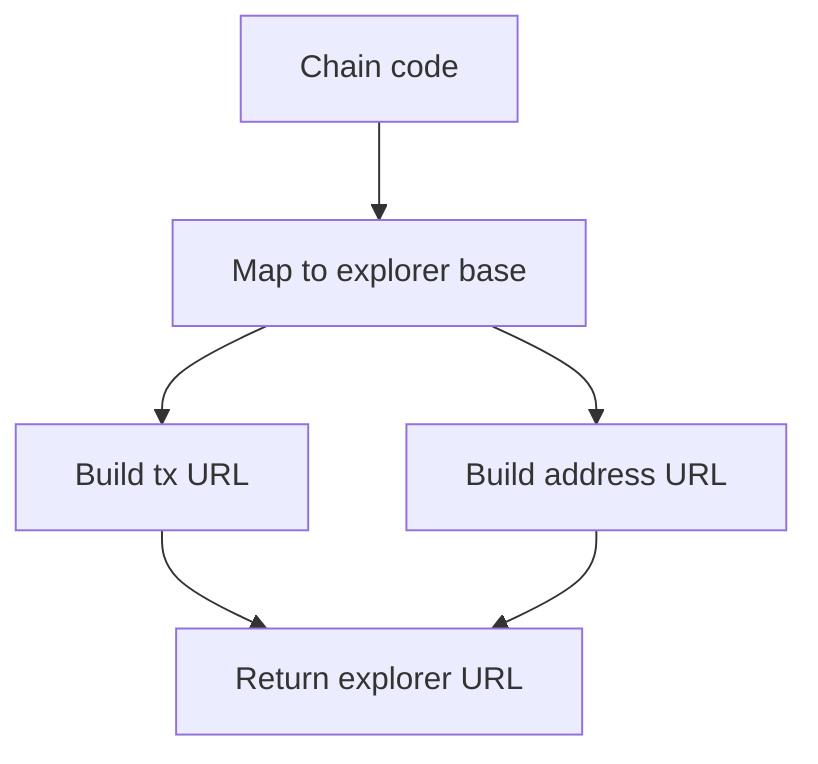
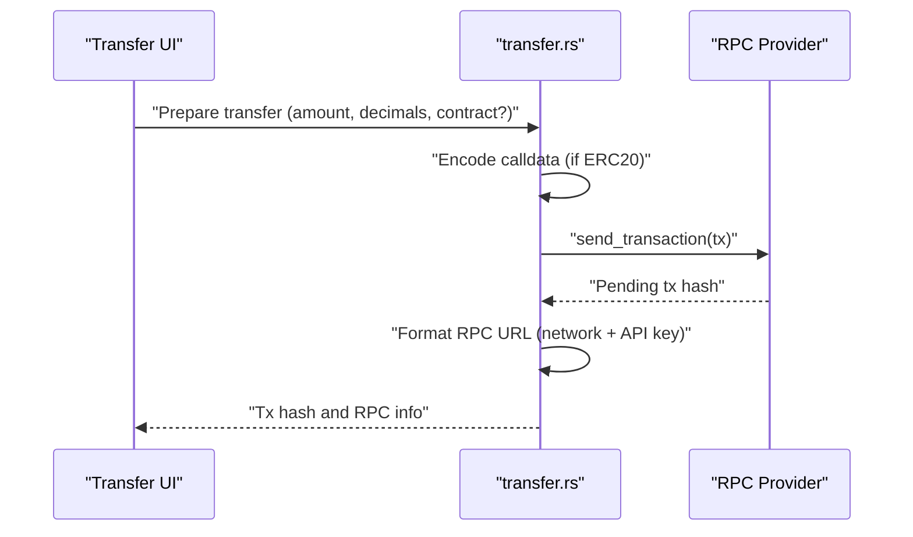
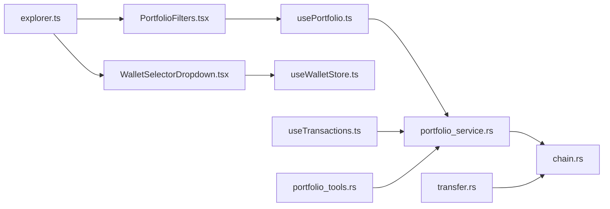

# Multi-Chain Support

<cite>
**Referenced Files in This Document**
- [PortfolioFilters.tsx](file://src/components/portfolio/PortfolioFilters.tsx)
- [WalletSelectorDropdown.tsx](file://src/components/portfolio/WalletSelectorDropdown.tsx)
- [usePortfolio.ts](file://src/hooks/usePortfolio.ts)
- [useTransactions.ts](file://src/hooks/useTransactions.ts)
- [useWalletStore.ts](file://src/store/useWalletStore.ts)
- [wallet.ts](file://src/types/wallet.ts)
- [mock.ts](file://src/data/mock.ts)
- [chain.rs](file://src-tauri/src/services/chain.rs)
- [portfolio_service.rs](file://src-tauri/src/services/portfolio_service.rs)
- [portfolio_tools.rs](file://src-tauri/src/services/tools/portfolio_tools.rs)
- [explorer.ts](file://src/lib/explorer.ts)
- [transfer.rs](file://src-tauri/src/commands/transfer.rs)
</cite>

## Table of Contents
1. [Introduction](#introduction)
2. [Project Structure](#project-structure)
3. [Core Components](#core-components)
4. [Architecture Overview](#architecture-overview)
5. [Detailed Component Analysis](#detailed-component-analysis)
6. [Dependency Analysis](#dependency-analysis)
7. [Performance Considerations](#performance-considerations)
8. [Troubleshooting Guide](#troubleshooting-guide)
9. [Conclusion](#conclusion)
10. [Appendices](#appendices)

## Introduction
This document explains the multi-chain portfolio support system with a focus on cross-network asset tracking and management. It covers the chain filtering system, supported networks, chain-specific asset handling, the chain abstraction layer, RPC provider management, and network switching mechanisms. It also documents cross-chain asset aggregation, unified balance calculation, chain-specific token standards, the chain selection UI, network status monitoring, fallback RPC configurations, chain-specific transaction handling, gas fee calculations per network, and network-specific security considerations. Guidance is included for chain-specific features, network fees, and cross-chain compatibility issues.

## Project Structure
The multi-chain portfolio system spans the frontend React components and hooks, the Tauri backend services, and supporting libraries:
- Frontend filters and UI: chain selection, sorting, and wallet aggregation
- Backend services: chain mapping, portfolio aggregation, and RPC orchestration
- Utilities: explorer URL generation and chain normalization

**Diagram sources**
- [PortfolioFilters.tsx:1-124](file://src/components/portfolio/PortfolioFilters.tsx#L1-L124)
- [WalletSelectorDropdown.tsx:1-221](file://src/components/portfolio/WalletSelectorDropdown.tsx#L1-L221)
- [usePortfolio.ts:1-184](file://src/hooks/usePortfolio.ts#L1-L184)
- [useTransactions.ts:1-48](file://src/hooks/useTransactions.ts#L1-L48)
- [useWalletStore.ts:1-48](file://src/store/useWalletStore.ts#L1-L48)
- [wallet.ts:1-59](file://src/types/wallet.ts#L1-L59)
- [mock.ts:1-342](file://src/data/mock.ts#L1-L342)
- [chain.rs:1-90](file://src-tauri/src/services/chain.rs#L1-L90)
- [portfolio_service.rs:1-200](file://src-tauri/src/services/portfolio_service.rs#L1-L200)
- [portfolio_tools.rs:99-170](file://src-tauri/src/services/tools/portfolio_tools.rs#L99-L170)
- [transfer.rs:213-242](file://src-tauri/src/commands/transfer.rs#L213-L242)
- [explorer.ts:1-27](file://src/lib/explorer.ts#L1-L27)

**Section sources**
- [PortfolioFilters.tsx:1-124](file://src/components/portfolio/PortfolioFilters.tsx#L1-L124)
- [WalletSelectorDropdown.tsx:1-221](file://src/components/portfolio/WalletSelectorDropdown.tsx#L1-L221)
- [usePortfolio.ts:1-184](file://src/hooks/usePortfolio.ts#L1-L184)
- [useTransactions.ts:1-48](file://src/hooks/useTransactions.ts#L1-L48)
- [useWalletStore.ts:1-48](file://src/store/useWalletStore.ts#L1-L48)
- [wallet.ts:1-59](file://src/types/wallet.ts#L1-L59)
- [mock.ts:1-342](file://src/data/mock.ts#L1-L342)
- [chain.rs:1-90](file://src-tauri/src/services/chain.rs#L1-L90)
- [portfolio_service.rs:1-200](file://src-tauri/src/services/portfolio_service.rs#L1-L200)
- [portfolio_tools.rs:99-170](file://src-tauri/src/services/tools/portfolio_tools.rs#L99-L170)
- [transfer.rs:213-242](file://src-tauri/src/commands/transfer.rs#L213-L242)
- [explorer.ts:1-27](file://src/lib/explorer.ts#L1-L27)

## Core Components
- Chain filtering and selection: The filter bar exposes supported chains and toggles for asset types and sorting. It hides testnets unless developer mode is enabled and filters app-gated chains based on installed apps.
- Wallet aggregation: The wallet selector dropdown supports an aggregated view across all wallets and individual wallet selection, enabling per-wallet filtering in the portfolio.
- Portfolio data fetching: The portfolio hook invokes backend commands to fetch balances and history, normalizes assets, computes totals and chain breakdowns, and provides chart series.
- Transactions: The transactions hook fetches recent transactions across selected wallets and formats links to block explorers.
- Chain abstraction: Backend services map chain codes to display names, networks, and explorer bases, and normalize network identifiers for UI and tooling.
- Cross-chain aggregation: Backend tools aggregate assets by token across chains and wallets, computing totals and distribution.

**Section sources**
- [PortfolioFilters.tsx:14-66](file://src/components/portfolio/PortfolioFilters.tsx#L14-L66)
- [WalletSelectorDropdown.tsx:35-122](file://src/components/portfolio/WalletSelectorDropdown.tsx#L35-L122)
- [usePortfolio.ts:32-183](file://src/hooks/usePortfolio.ts#L32-L183)
- [useTransactions.ts:23-47](file://src/hooks/useTransactions.ts#L23-L47)
- [chain.rs:9-89](file://src-tauri/src/services/chain.rs#L9-L89)
- [portfolio_tools.rs:134-170](file://src-tauri/src/services/tools/portfolio_tools.rs#L134-L170)

## Architecture Overview
The system integrates frontend UI with Tauri backend services to provide a unified multi-chain view:
- Frontend triggers queries for balances and transactions
- Backend resolves chain/network mappings and orchestrates RPC calls
- Results are normalized and returned to the UI for rendering

**Diagram sources**
- [PortfolioFilters.tsx:46-55](file://src/components/portfolio/PortfolioFilters.tsx#L46-L55)
- [usePortfolio.ts:32-60](file://src/hooks/usePortfolio.ts#L32-L60)
- [portfolio_service.rs:131-147](file://src-tauri/src/services/portfolio_service.rs#L131-L147)
- [chain.rs:9-39](file://src-tauri/src/services/chain.rs#L9-L39)

## Detailed Component Analysis

### Chain Filtering System (PortfolioFilters)
- Supported chains include Ethereum, Base, Polygon, and testnets; Flow and Flow EVM variants are gated behind installed apps.
- Developer mode toggles visibility of testnets.
- Asset type filters and sorting options are exposed for refined views.

**Diagram sources**
- [PortfolioFilters.tsx:56-66](file://src/components/portfolio/PortfolioFilters.tsx#L56-L66)
- [PortfolioFilters.tsx:72-84](file://src/components/portfolio/PortfolioFilters.tsx#L72-L84)

**Section sources**
- [PortfolioFilters.tsx:14-44](file://src/components/portfolio/PortfolioFilters.tsx#L14-L44)
- [PortfolioFilters.tsx:56-66](file://src/components/portfolio/PortfolioFilters.tsx#L56-L66)

### Wallet Aggregation and Selection (WalletSelectorDropdown)
- Supports “All Wallets” aggregated view and per-wallet selection.
- Provides actions to copy address, rename, and remove wallets.
- Integrates with the wallet store to manage active address and names.

**Diagram sources**
- [WalletSelectorDropdown.tsx:35-122](file://src/components/portfolio/WalletSelectorDropdown.tsx#L35-L122)
- [useWalletStore.ts:16-47](file://src/store/useWalletStore.ts#L16-L47)

**Section sources**
- [WalletSelectorDropdown.tsx:35-122](file://src/components/portfolio/WalletSelectorDropdown.tsx#L35-L122)
- [useWalletStore.ts:16-47](file://src/store/useWalletStore.ts#L16-L47)

### Portfolio Data Fetching and Aggregation (usePortfolio)
- Fetches balances for a single or multiple addresses via Tauri commands.
- Computes total portfolio value and chain breakdown from either history or raw assets.
- Produces time series data for charts and quick actions.

**Diagram sources**
- [usePortfolio.ts:32-183](file://src/hooks/usePortfolio.ts#L32-L183)

**Section sources**
- [usePortfolio.ts:32-183](file://src/hooks/usePortfolio.ts#L32-L183)

### Chain Abstraction Layer (chain.rs)
- Defines supported chain codes and maps them to display names and networks.
- Provides explorer base URLs for different chain types (EVM vs Flow EVM).
- Normalizes network identifiers for UI and tooling.

**Diagram sources**
- [chain.rs:3-89](file://src-tauri/src/services/chain.rs#L3-L89)

**Section sources**
- [chain.rs:3-89](file://src-tauri/src/services/chain.rs#L3-L89)

### Cross-Chain Asset Aggregation (portfolio_tools.rs, portfolio_service.rs)
- Aggregates assets by token across chains and wallets, computing totals and distribution.
- Normalizes raw balances and formats display values.
- Merges Flow sidecar data and sorts assets by value.

**Diagram sources**
- [portfolio_tools.rs:134-170](file://src-tauri/src/services/tools/portfolio_tools.rs#L134-L170)
- [portfolio_service.rs:131-147](file://src-tauri/src/services/portfolio_service.rs#L131-L147)

**Section sources**
- [portfolio_tools.rs:134-170](file://src-tauri/src/services/tools/portfolio_tools.rs#L134-L170)
- [portfolio_service.rs:131-147](file://src-tauri/src/services/portfolio_service.rs#L131-L147)

### Explorer and Network Links (explorer.ts)
- Generates chain-aware explorer URLs for transactions and addresses.
- Supports mainnet and testnet variants for major EVM chains and Flow variants.

**Diagram sources**
- [explorer.ts:1-27](file://src/lib/explorer.ts#L1-L27)

**Section sources**
- [explorer.ts:1-27](file://src/lib/explorer.ts#L1-L27)

### Chain-Specific Transaction Handling and Gas Fees (transfer.rs)
- Builds transaction requests for native transfers and ERC20 token transfers.
- Emits transaction hash and constructs RPC endpoint using network and API key.
- Gas fee calculations and slippage checks are enforced by guardrails.

**Diagram sources**
- [transfer.rs:213-242](file://src-tauri/src/commands/transfer.rs#L213-L242)

**Section sources**
- [transfer.rs:213-242](file://src-tauri/src/commands/transfer.rs#L213-L242)

### Network Status Monitoring and Fallback RPC Configurations
- Network switching and status monitoring are handled by mapping chain codes to networks and selecting appropriate RPC endpoints.
- Fallback configurations can be implemented by attempting alternate RPC endpoints when primary endpoints fail.

[No sources needed since this section provides general guidance]

### Chain-Specific Features, Network Fees, and Compatibility
- Chain-specific token standards: Native transfers and ERC20 transfers are supported with proper encoding and contract calls.
- Network fees: Gas estimation and slippage thresholds are enforced by guardrails; tight slippage tolerances increase failure risk.
- Cross-chain compatibility: Chain mapping ensures consistent display and navigation across networks; Flow EVM differs from Cadence Flow in portfolio reads and explorer bases.

[No sources needed since this section provides general guidance]

## Dependency Analysis
The frontend depends on Tauri commands and stores to fetch and render portfolio data. The backend services encapsulate chain mapping and RPC orchestration.

**Diagram sources**
- [PortfolioFilters.tsx:1-124](file://src/components/portfolio/PortfolioFilters.tsx#L1-L124)
- [WalletSelectorDropdown.tsx:1-221](file://src/components/portfolio/WalletSelectorDropdown.tsx#L1-L221)
- [usePortfolio.ts:1-184](file://src/hooks/usePortfolio.ts#L1-L184)
- [useTransactions.ts:1-48](file://src/hooks/useTransactions.ts#L1-L48)
- [useWalletStore.ts:1-48](file://src/store/useWalletStore.ts#L1-L48)
- [chain.rs:1-90](file://src-tauri/src/services/chain.rs#L1-L90)
- [portfolio_service.rs:1-200](file://src-tauri/src/services/portfolio_service.rs#L1-L200)
- [portfolio_tools.rs:99-170](file://src-tauri/src/services/tools/portfolio_tools.rs#L99-L170)
- [transfer.rs:213-242](file://src-tauri/src/commands/transfer.rs#L213-L242)
- [explorer.ts:1-27](file://src/lib/explorer.ts#L1-L27)

**Section sources**
- [PortfolioFilters.tsx:1-124](file://src/components/portfolio/PortfolioFilters.tsx#L1-L124)
- [WalletSelectorDropdown.tsx:1-221](file://src/components/portfolio/WalletSelectorDropdown.tsx#L1-L221)
- [usePortfolio.ts:1-184](file://src/hooks/usePortfolio.ts#L1-L184)
- [useTransactions.ts:1-48](file://src/hooks/useTransactions.ts#L1-L48)
- [useWalletStore.ts:1-48](file://src/store/useWalletStore.ts#L1-L48)
- [chain.rs:1-90](file://src-tauri/src/services/chain.rs#L1-L90)
- [portfolio_service.rs:1-200](file://src-tauri/src/services/portfolio_service.rs#L1-L200)
- [portfolio_tools.rs:99-170](file://src-tauri/src/services/tools/portfolio_tools.rs#L99-L170)
- [transfer.rs:213-242](file://src-tauri/src/commands/transfer.rs#L213-L242)
- [explorer.ts:1-27](file://src/lib/explorer.ts#L1-L27)

## Performance Considerations
- Caching and stale times: Portfolio queries use short stale times to keep data fresh without over-fetching.
- Batch operations: Multi-address queries reduce round trips when aggregating across wallets.
- Sorting and aggregation: Backend sorting by value and token aggregation minimize frontend computation overhead.
- Network selection: Conditional inclusion of Flow networks reduces unnecessary RPC calls when not installed.

[No sources needed since this section provides general guidance]

## Troubleshooting Guide
- Missing API keys: Portfolio service errors indicate missing API keys for RPC providers.
- Invalid addresses: Validation checks ensure proper Ethereum-style addresses before querying.
- Network reachability: Use chain mapping to verify network identifiers and switch to supported networks.
- Explorer links: Ensure chain codes map to valid explorer bases; fallback to default if unknown.

**Section sources**
- [portfolio_service.rs:27-46](file://src-tauri/src/services/portfolio_service.rs#L27-L46)
- [chain.rs:59-73](file://src-tauri/src/services/chain.rs#L59-L73)

## Conclusion
The multi-chain portfolio system provides a cohesive interface for tracking and managing assets across multiple networks. The chain filtering UI, wallet aggregation, backend chain mapping, and RPC orchestration work together to deliver a unified experience. Cross-chain aggregation, explorer integration, and guardrails ensure accurate and secure operations while maintaining performance and usability.

## Appendices
- Supported chains include Ethereum, Base, Polygon, and testnets; Flow and Flow EVM variants are gated by app installation.
- Chain display names and network mappings are centralized for consistency across UI and tools.
- Explorer URLs are generated per chain to streamline navigation to transactions and addresses.

[No sources needed since this section provides general guidance]