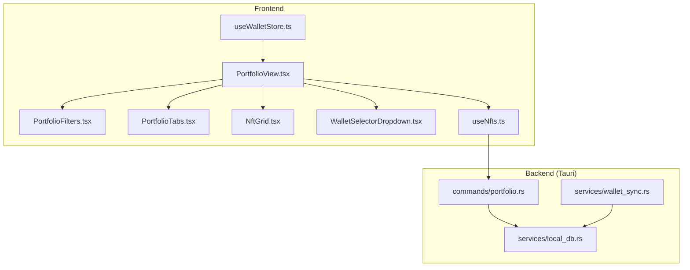
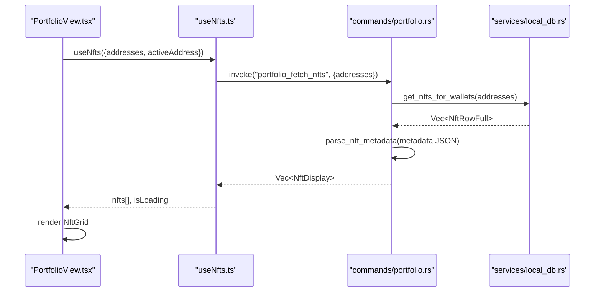
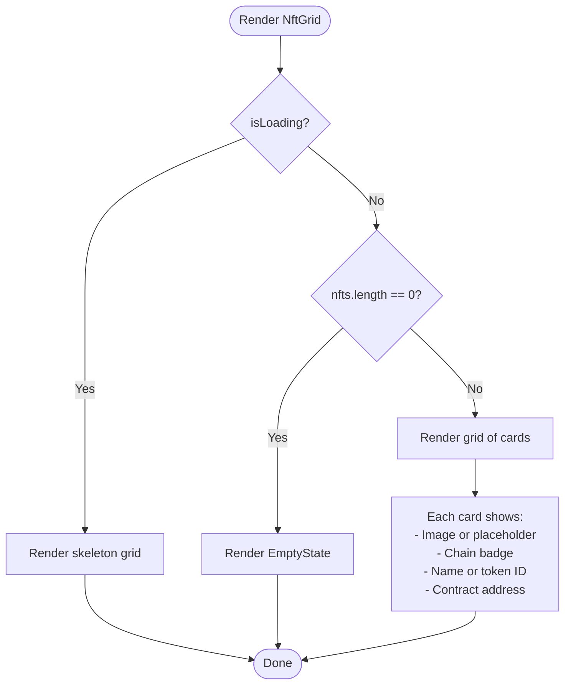
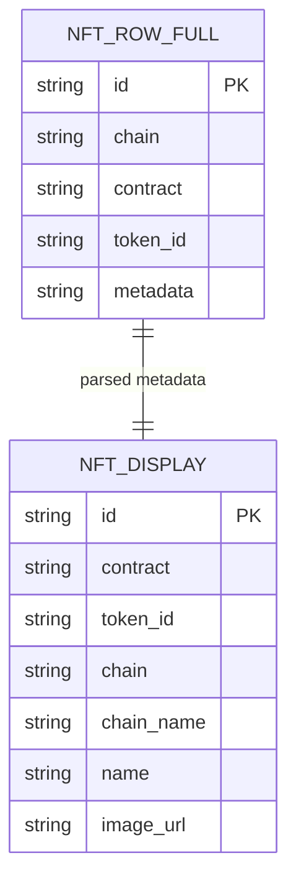
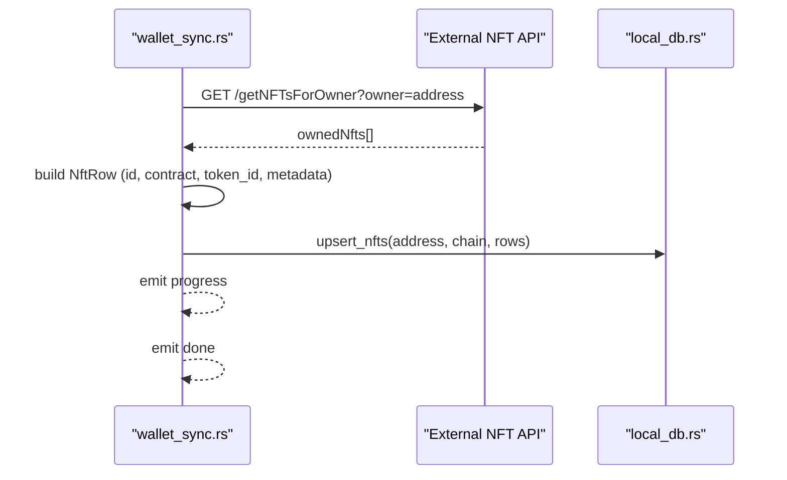
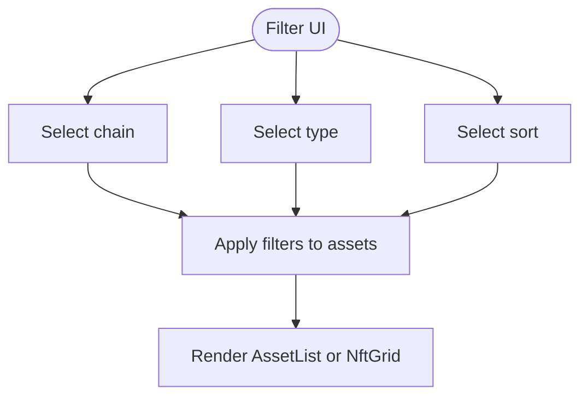
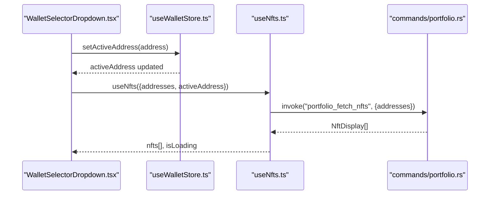
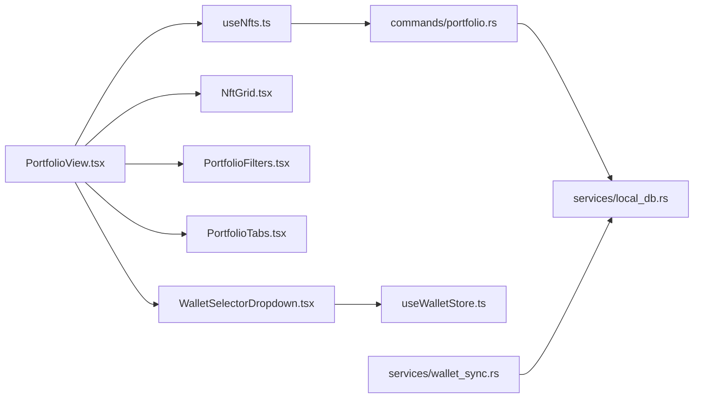

# NFT & Digital Assets

<cite>
**Referenced Files in This Document**
- [NftGrid.tsx](file://src/components/portfolio/NftGrid.tsx)
- [useNfts.ts](file://src/hooks/useNfts.ts)
- [PortfolioView.tsx](file://src/components/portfolio/PortfolioView.tsx)
- [PortfolioFilters.tsx](file://src/components/portfolio/PortfolioFilters.tsx)
- [PortfolioTabs.tsx](file://src/components/portfolio/PortfolioTabs.tsx)
- [TokenCard.tsx](file://src/components/portfolio/TokenCard.tsx)
- [AssetList.tsx](file://src/components/portfolio/AssetList.tsx)
- [wallet.ts](file://src/types/wallet.ts)
- [WalletSelectorDropdown.tsx](file://src/components/portfolio/WalletSelectorDropdown.tsx)
- [useWalletStore.ts](file://src/store/useWalletStore.ts)
- [portfolio.rs](file://src-tauri/src/commands/portfolio.rs)
- [wallet_sync.rs](file://src-tauri/src/services/wallet_sync.rs)
- [local_db.rs](file://src-tauri/src/services/local_db.rs)
</cite>

## Table of Contents
1. [Introduction](#introduction)
2. [Project Structure](#project-structure)
3. [Core Components](#core-components)
4. [Architecture Overview](#architecture-overview)
5. [Detailed Component Analysis](#detailed-component-analysis)
6. [Dependency Analysis](#dependency-analysis)
7. [Performance Considerations](#performance-considerations)
8. [Troubleshooting Guide](#troubleshooting-guide)
9. [Conclusion](#conclusion)
10. [Appendices](#appendices)

## Introduction
This document explains the NFT and digital asset management system with a focus on non-fungible token tracking and display. It covers the NftGrid gallery, NFT data model, metadata enrichment, wallet integration, background synchronization, filtering, and the viewing experience. It also outlines how the system integrates with on-chain APIs for NFT discovery and how it prepares the foundation for valuation tracking, collection performance metrics, and marketplace integration.

## Project Structure
The NFT feature spans frontend components and hooks, a wallet store, and backend Tauri commands and services:
- Frontend: Portfolio view, NFT grid, filters, tabs, and wallet selector
- Hooks: NFT data fetching and caching
- Backend: Tauri commands for NFT retrieval and metadata parsing, wallet sync service for background fetching, and local database for persistence

**Diagram sources**
- [PortfolioView.tsx:33-305](file://src/components/portfolio/PortfolioView.tsx#L33-L305)
- [PortfolioFilters.tsx:46-123](file://src/components/portfolio/PortfolioFilters.tsx#L46-L123)
- [PortfolioTabs.tsx:15-54](file://src/components/portfolio/PortfolioTabs.tsx#L15-L54)
- [NftGrid.tsx:23-84](file://src/components/portfolio/NftGrid.tsx#L23-L84)
- [WalletSelectorDropdown.tsx:35-220](file://src/components/portfolio/WalletSelectorDropdown.tsx#L35-L220)
- [useWalletStore.ts:16-47](file://src/store/useWalletStore.ts#L16-L47)
- [useNfts.ts:19-42](file://src/hooks/useNfts.ts#L19-L42)
- [portfolio.rs:150-173](file://src-tauri/src/commands/portfolio.rs#L150-L173)
- [wallet_sync.rs:260-452](file://src-tauri/src/services/wallet_sync.rs#L260-L452)
- [local_db.rs:1654-1680](file://src-tauri/src/services/local_db.rs#L1654-L1680)

**Section sources**
- [PortfolioView.tsx:33-305](file://src/components/portfolio/PortfolioView.tsx#L33-L305)
- [useNfts.ts:19-42](file://src/hooks/useNfts.ts#L19-L42)
- [portfolio.rs:150-173](file://src-tauri/src/commands/portfolio.rs#L150-L173)
- [wallet_sync.rs:260-452](file://src-tauri/src/services/wallet_sync.rs#L260-L452)
- [local_db.rs:1654-1680](file://src-tauri/src/services/local_db.rs#L1654-L1680)

## Core Components
- NftGrid: Renders a responsive grid of NFT thumbnails with chain badges, optional images, and compact metadata
- useNfts: React Query hook that invokes a Tauri command to fetch NFTs for selected wallet addresses
- PortfolioView: Orchestrates wallet selection, filters, tabs, and renders NFTs via NftGrid
- PortfolioFilters: Provides chain/type/sort controls for asset filtering
- WalletSelectorDropdown and useWalletStore: Manage wallet addresses, active selection, and persistence
- Backend commands and services: Parse metadata, fetch NFTs from external APIs, persist to local DB, and expose a typed NftDisplay model

**Section sources**
- [NftGrid.tsx:23-84](file://src/components/portfolio/NftGrid.tsx#L23-L84)
- [useNfts.ts:4-12](file://src/hooks/useNfts.ts#L4-L12)
- [PortfolioView.tsx:39-245](file://src/components/portfolio/PortfolioView.tsx#L39-L245)
- [PortfolioFilters.tsx:46-123](file://src/components/portfolio/PortfolioFilters.tsx#L46-L123)
- [WalletSelectorDropdown.tsx:35-220](file://src/components/portfolio/WalletSelectorDropdown.tsx#L35-L220)
- [useWalletStore.ts:16-47](file://src/store/useWalletStore.ts#L16-L47)
- [portfolio.rs:104-114](file://src-tauri/src/commands/portfolio.rs#L104-L114)
- [wallet_sync.rs:72-130](file://src-tauri/src/services/wallet_sync.rs#L72-L130)
- [local_db.rs:1644-1680](file://src-tauri/src/services/local_db.rs#L1644-L1680)

## Architecture Overview
The system follows a layered architecture:
- Frontend UI and hooks orchestrate user actions and render data
- Tauri commands bridge to backend services
- Services fetch on-chain data (via external APIs) and persist to a local SQLite database
- Queries read from the local database and enrich with metadata

**Diagram sources**
- [PortfolioView.tsx:39-245](file://src/components/portfolio/PortfolioView.tsx#L39-L245)
- [useNfts.ts:19-42](file://src/hooks/useNfts.ts#L19-L42)
- [portfolio.rs:150-173](file://src-tauri/src/commands/portfolio.rs#L150-L173)
- [portfolio.rs:175-196](file://src-tauri/src/commands/portfolio.rs#L175-L196)
- [local_db.rs:1654-1680](file://src-tauri/src/services/local_db.rs#L1654-L1680)

## Detailed Component Analysis

### NftGrid Component
NftGrid renders a responsive grid of NFT cards:
- Displays an image when available; otherwise shows a placeholder icon
- Shows chain badge derived from chain code
- Shows name or token ID and a truncated contract address
- Handles loading skeleton and empty states

**Diagram sources**
- [NftGrid.tsx:23-84](file://src/components/portfolio/NftGrid.tsx#L23-L84)

**Section sources**
- [NftGrid.tsx:23-84](file://src/components/portfolio/NftGrid.tsx#L23-L84)

### NFT Data Model and Metadata Enrichment
The backend defines a typed NftDisplay model returned to the frontend. Metadata enrichment occurs by parsing the stored metadata JSON:
- Extracts name from either title or name field
- Extracts image URL from media[].gateway/raw or image field
- Produces a normalized NftDisplay with id, contract, token_id, chain, chainName, name, image_url

**Diagram sources**
- [portfolio.rs:104-114](file://src-tauri/src/commands/portfolio.rs#L104-L114)
- [portfolio.rs:175-196](file://src-tauri/src/commands/portfolio.rs#L175-L196)
- [local_db.rs:1644-1652](file://src-tauri/src/services/local_db.rs#L1644-L1652)

**Section sources**
- [portfolio.rs:104-114](file://src-tauri/src/commands/portfolio.rs#L104-L114)
- [portfolio.rs:175-196](file://src-tauri/src/commands/portfolio.rs#L175-L196)
- [local_db.rs:1644-1652](file://src-tauri/src/services/local_db.rs#L1644-L1652)

### Integration with NFT APIs and Off-chain Data Processing
Background synchronization fetches NFTs from external APIs and stores them locally:
- Iterates over supported networks and calls the NFT endpoint per network
- Parses response to extract contract, token_id, and serializes raw metadata
- Upserts NFT rows per wallet and chain
- Emits progress events and completion signals

**Diagram sources**
- [wallet_sync.rs:72-130](file://src-tauri/src/services/wallet_sync.rs#L72-L130)
- [wallet_sync.rs:346-364](file://src-tauri/src/services/wallet_sync.rs#L346-L364)
- [local_db.rs:1515-1550](file://src-tauri/src/services/local_db.rs#L1515-L1550)

**Section sources**
- [wallet_sync.rs:72-130](file://src-tauri/src/services/wallet_sync.rs#L72-L130)
- [wallet_sync.rs:346-364](file://src-tauri/src/services/wallet_sync.rs#L346-L364)
- [local_db.rs:1515-1550](file://src-tauri/src/services/local_db.rs#L1515-L1550)

### NFT Filtering, Collection Grouping, and Search
PortfolioFilters provides:
- Chain filter: supports mainnets and testnets with developer mode toggle
- Type filter: tokens/native/stablecoins
- Sort options: Value, Chain, Symbol

PortfolioView applies filters and sorting to assets; similar patterns can be extended to NFTs by adding NFT-specific filters and grouping by collection or chain.

**Diagram sources**
- [PortfolioFilters.tsx:46-123](file://src/components/portfolio/PortfolioFilters.tsx#L46-L123)
- [PortfolioView.tsx:67-96](file://src/components/portfolio/PortfolioView.tsx#L67-L96)

**Section sources**
- [PortfolioFilters.tsx:46-123](file://src/components/portfolio/PortfolioFilters.tsx#L46-L123)
- [PortfolioView.tsx:67-96](file://src/components/portfolio/PortfolioView.tsx#L67-L96)

### NFT Viewing Experience and Detailed Modals
While the NFT gallery currently shows compact cards, the TokenCard pattern demonstrates how detailed modals can be integrated:
- Clicking a token opens a modal with symbol, chain badge, value, and actions
- This pattern can be adapted for NFTs to show attributes, traits, collection stats, and marketplace links

**Section sources**
- [TokenCard.tsx:46-184](file://src/components/portfolio/TokenCard.tsx#L46-L184)

### Wallet Integration and Batch Loading
- WalletSelectorDropdown manages multiple addresses and active selection
- useWalletStore persists wallet names and refreshes lists via Tauri commands
- useNfts builds the address list from props and enables queries only when addresses are present
- PortfolioView orchestrates refresh and tabbed views

**Diagram sources**
- [WalletSelectorDropdown.tsx:35-220](file://src/components/portfolio/WalletSelectorDropdown.tsx#L35-L220)
- [useWalletStore.ts:16-47](file://src/store/useWalletStore.ts#L16-L47)
- [useNfts.ts:19-42](file://src/hooks/useNfts.ts#L19-L42)
- [portfolio.rs:150-173](file://src-tauri/src/commands/portfolio.rs#L150-L173)

**Section sources**
- [WalletSelectorDropdown.tsx:35-220](file://src/components/portfolio/WalletSelectorDropdown.tsx#L35-L220)
- [useWalletStore.ts:16-47](file://src/store/useWalletStore.ts#L16-L47)
- [useNfts.ts:19-42](file://src/hooks/useNfts.ts#L19-L42)
- [portfolio.rs:150-173](file://src-tauri/src/commands/portfolio.rs#L150-L173)

### Lazy Loading and Large Collections
- NftGrid renders skeletons during loading and empty state when no NFTs are found
- For very large collections, consider pagination or virtualized grids to improve performance
- The current grid uses a responsive CSS grid suitable for moderate-sized galleries

**Section sources**
- [NftGrid.tsx:23-84](file://src/components/portfolio/NftGrid.tsx#L23-L84)

### Valuation Tracking, Collection Performance Metrics, and Marketplace Integration
- Current backend provides portfolio history, allocations, and performance summary for tokens; NFT valuation is not yet exposed
- To support NFT valuation:
  - Extend wallet sync to fetch floor prices or recent sale data per NFT
  - Add NFT-specific aggregation and snapshots
  - Expose NFT valuation endpoints analogous to portfolio_fetch_history
- Marketplace integration can be added by linking to external marketplaces using contract and token_id

[No sources needed since this section provides general guidance]

## Dependency Analysis
The frontend depends on Tauri commands and stores; the backend coordinates services and database access.

**Diagram sources**
- [useNfts.ts:19-42](file://src/hooks/useNfts.ts#L19-L42)
- [portfolio.rs:150-173](file://src-tauri/src/commands/portfolio.rs#L150-L173)
- [local_db.rs:1654-1680](file://src-tauri/src/services/local_db.rs#L1654-L1680)
- [PortfolioView.tsx:39-245](file://src/components/portfolio/PortfolioView.tsx#L39-L245)
- [NftGrid.tsx:23-84](file://src/components/portfolio/NftGrid.tsx#L23-L84)
- [PortfolioFilters.tsx:46-123](file://src/components/portfolio/PortfolioFilters.tsx#L46-L123)
- [PortfolioTabs.tsx:15-54](file://src/components/portfolio/PortfolioTabs.tsx#L15-L54)
- [WalletSelectorDropdown.tsx:35-220](file://src/components/portfolio/WalletSelectorDropdown.tsx#L35-L220)
- [useWalletStore.ts:16-47](file://src/store/useWalletStore.ts#L16-L47)
- [wallet_sync.rs:260-452](file://src-tauri/src/services/wallet_sync.rs#L260-L452)

**Section sources**
- [useNfts.ts:19-42](file://src/hooks/useNfts.ts#L19-L42)
- [portfolio.rs:150-173](file://src-tauri/src/commands/portfolio.rs#L150-L173)
- [local_db.rs:1654-1680](file://src-tauri/src/services/local_db.rs#L1654-L1680)
- [PortfolioView.tsx:39-245](file://src/components/portfolio/PortfolioView.tsx#L39-L245)
- [NftGrid.tsx:23-84](file://src/components/portfolio/NftGrid.tsx#L23-L84)
- [PortfolioFilters.tsx:46-123](file://src/components/portfolio/PortfolioFilters.tsx#L46-L123)
- [PortfolioTabs.tsx:15-54](file://src/components/portfolio/PortfolioTabs.tsx#L15-L54)
- [WalletSelectorDropdown.tsx:35-220](file://src/components/portfolio/WalletSelectorDropdown.tsx#L35-L220)
- [useWalletStore.ts:16-47](file://src/store/useWalletStore.ts#L16-L47)
- [wallet_sync.rs:260-452](file://src-tauri/src/services/wallet_sync.rs#L260-L452)

## Performance Considerations
- Stale-time caching: useNfts sets a stale time to avoid frequent re-fetches
- Local-first reads: backend queries local DB before external API calls
- Batch upserts: wallet sync upserts NFTs per chain to minimize writes
- Consider virtualization or pagination for large NFT collections to reduce DOM and memory footprint

**Section sources**
- [useNfts.ts:38-39](file://src/hooks/useNfts.ts#L38-L39)
- [portfolio.rs:46-52](file://src-tauri/src/commands/portfolio.rs#L46-L52)
- [wallet_sync.rs:346-364](file://src-tauri/src/services/wallet_sync.rs#L346-L364)

## Troubleshooting Guide
- Missing wallet addresses: ensure wallet_list returns addresses and activeAddress is set
- No NFTs displayed: check that wallet sync completed and local DB contains rows for the selected addresses
- Metadata parsing errors: verify metadata JSON shape and confirm parse_nft_metadata handles missing fields gracefully
- API errors: wallet_sync logs NFT API error statuses; ensure ALCHEMY_API_KEY is configured

**Section sources**
- [useWalletStore.ts:23-43](file://src/store/useWalletStore.ts#L23-L43)
- [wallet_sync.rs:93-95](file://src-tauri/src/services/wallet_sync.rs#L93-L95)
- [portfolio.rs:179-182](file://src-tauri/src/commands/portfolio.rs#L179-L182)

## Conclusion
The system provides a robust foundation for NFT tracking and display, with wallet-driven data fetching, background synchronization, and a responsive gallery. Extending it to support NFT valuation, collection analytics, and marketplace actions involves augmenting the backend with NFT-specific data sources and exposing enriched endpoints, while UI components can adopt modal patterns similar to TokenCard for detailed views.

## Appendices
- Data types for portfolio assets and performance summaries are defined for broader portfolio insights; NFT-specific equivalents can be introduced analogously.

**Section sources**
- [wallet.ts:20-59](file://src/types/wallet.ts#L20-L59)