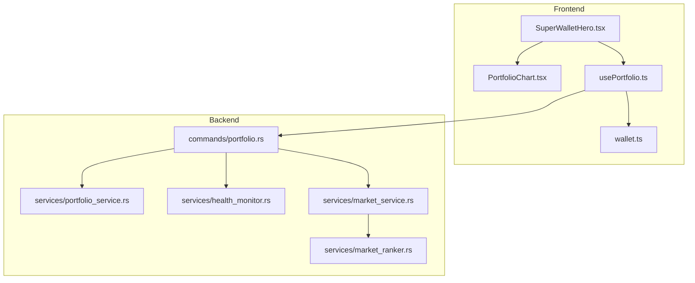
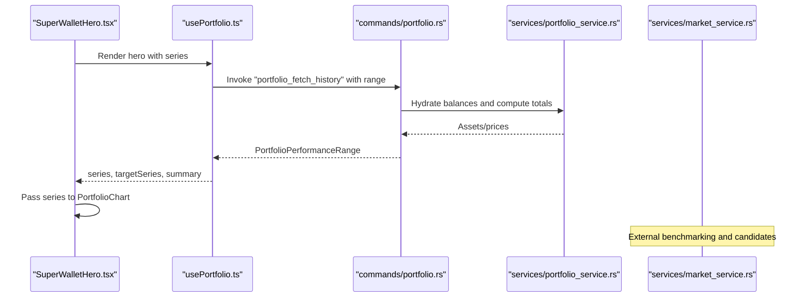
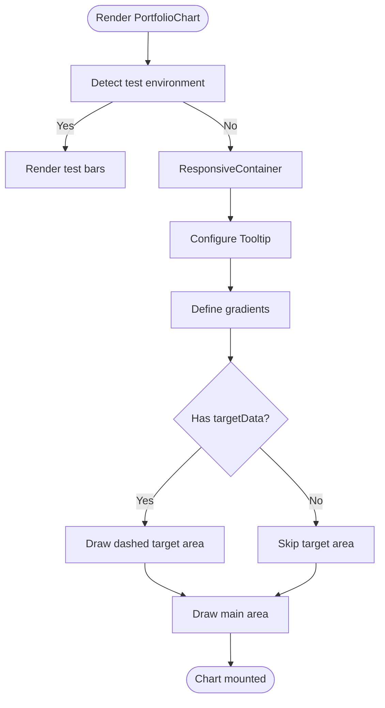
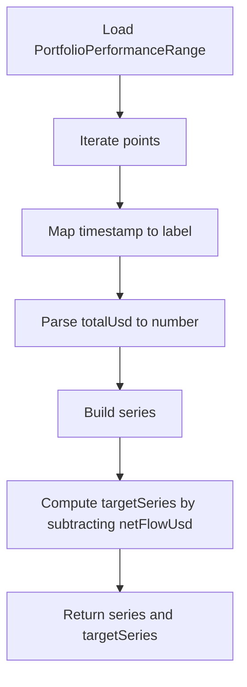
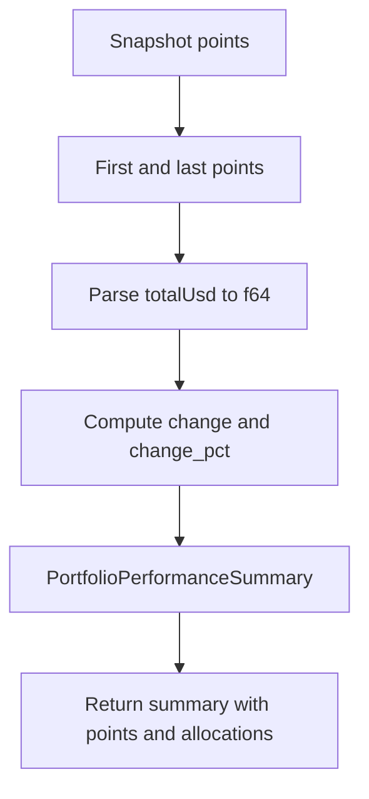
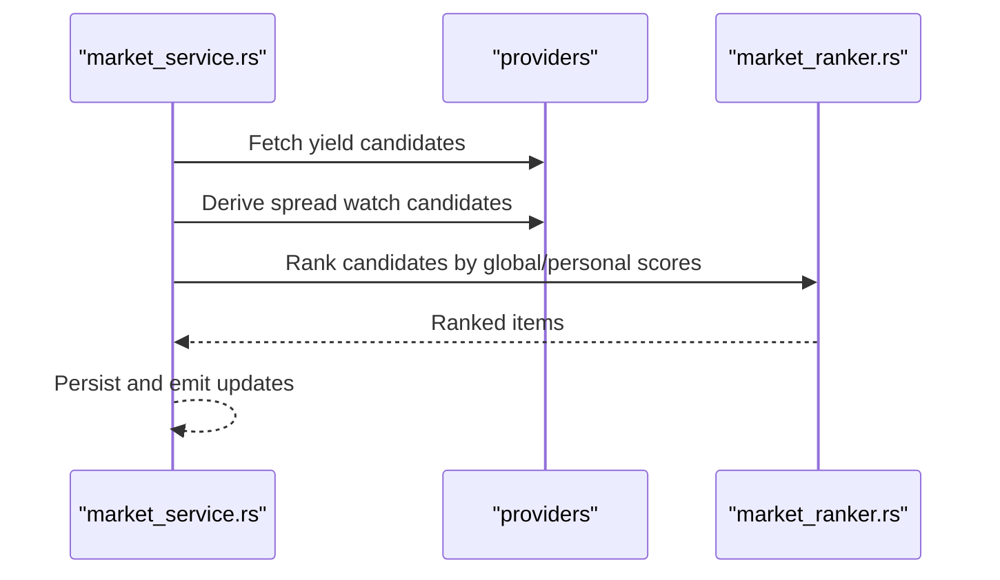
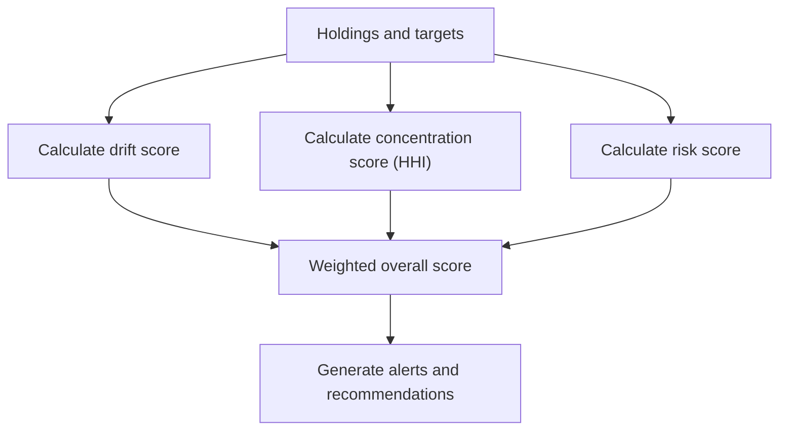
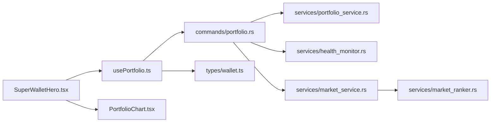
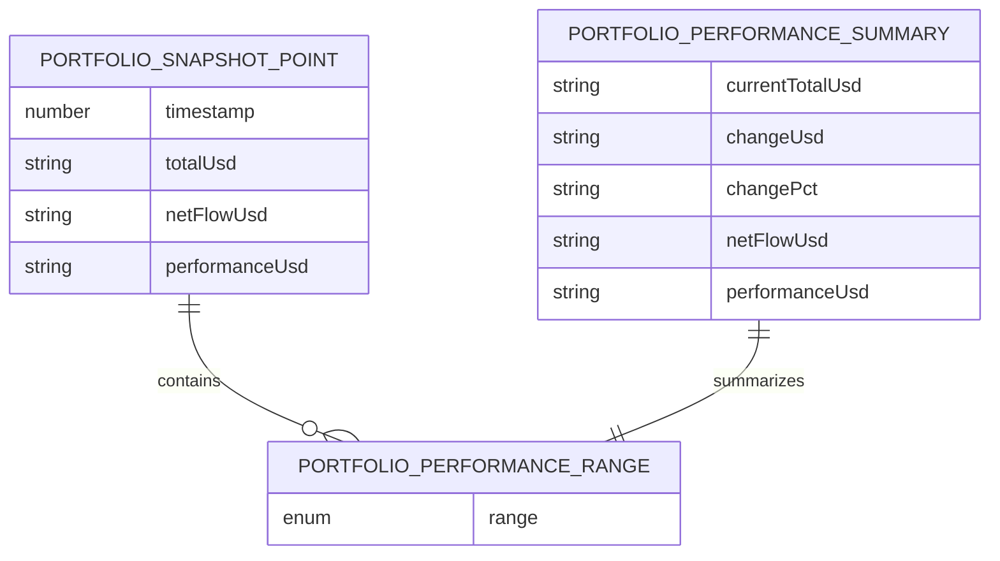

# Performance Analytics

<cite>
**Referenced Files in This Document**
- [PortfolioChart.tsx](file://src/components/shared/PortfolioChart.tsx)
- [mock.ts](file://src/data/mock.ts)
- [usePortfolio.ts](file://src/hooks/usePortfolio.ts)
- [SuperWalletHero.tsx](file://src/components/portfolio/SuperWalletHero.tsx)
- [PortfolioView.tsx](file://src/components/portfolio/PortfolioView.tsx)
- [wallet.ts](file://src/types/wallet.ts)
- [portfolio.rs](file://src-tauri/src/commands/portfolio.rs)
- [portfolio_service.rs](file://src-tauri/src/services/portfolio_service.rs)
- [health_monitor.rs](file://src-tauri/src/services/health_monitor.rs)
- [market_service.rs](file://src-tauri/src/services/market_service.rs)
- [market_ranker.rs](file://src-tauri/src/services/market_ranker.rs)
- [StrategyInspector.tsx](file://src/components/strategy/StrategyInspector.tsx)
</cite>

## Table of Contents
1. [Introduction](#introduction)
2. [Project Structure](#project-structure)
3. [Core Components](#core-components)
4. [Architecture Overview](#architecture-overview)
5. [Detailed Component Analysis](#detailed-component-analysis)
6. [Dependency Analysis](#dependency-analysis)
7. [Performance Considerations](#performance-considerations)
8. [Troubleshooting Guide](#troubleshooting-guide)
9. [Conclusion](#conclusion)
10. [Appendices](#appendices)

## Introduction
This document describes the portfolio performance analytics system with a focus on visualizing portfolio growth and tracking metrics. It explains the PortfolioChart component architecture, supported chart types, time range selectors, and how performance data is calculated and aggregated. It also covers customization options, theme integration, responsive design, historical data aggregation, rolling performance calculations, volatility metrics, interactivity (zoom, tooltips, highlighting), integration with portfolio valuation and external market data, benchmarking, performance attribution, risk metrics, and portfolio optimization insights.

## Project Structure
The performance analytics system spans frontend React components, TypeScript hooks, and backend Rust services:
- Frontend
  - PortfolioChart renders the area chart with optional target overlay.
  - usePortfolio orchestrates data fetching and transforms historical series for visualization.
  - SuperWalletHero composes the hero dashboard and embeds the chart.
  - Types define the shape of performance data returned by backend commands.
- Backend
  - Commands and services compute portfolio performance summaries, hydration of prices, and health metrics.
  - Market services and rankers provide external benchmarking and optimization candidates.

**Diagram sources**
- [SuperWalletHero.tsx:12-37](file://src/components/portfolio/SuperWalletHero.tsx#L12-L37)
- [PortfolioChart.tsx:5-8](file://src/components/shared/PortfolioChart.tsx#L5-L8)
- [usePortfolio.ts:32-67](file://src/hooks/usePortfolio.ts#L32-L67)
- [wallet.ts:33-58](file://src/types/wallet.ts#L33-L58)
- [portfolio.rs:348-360](file://src-tauri/src/commands/portfolio.rs#L348-L360)
- [portfolio_service.rs:131-147](file://src-tauri/src/services/portfolio_service.rs#L131-L147)
- [health_monitor.rs:106-127](file://src-tauri/src/services/health_monitor.rs#L106-L127)
- [market_service.rs:292-364](file://src-tauri/src/services/market_service.rs#L292-L364)
- [market_ranker.rs:296-318](file://src-tauri/src/services/market_ranker.rs#L296-L318)

**Section sources**
- [PortfolioChart.tsx:1-88](file://src/components/shared/PortfolioChart.tsx#L1-L88)
- [usePortfolio.ts:32-183](file://src/hooks/usePortfolio.ts#L32-L183)
- [wallet.ts:33-58](file://src/types/wallet.ts#L33-L58)
- [portfolio.rs:348-360](file://src-tauri/src/commands/portfolio.rs#L348-L360)
- [portfolio_service.rs:131-147](file://src-tauri/src/services/portfolio_service.rs#L131-L147)
- [health_monitor.rs:106-127](file://src-tauri/src/services/health_monitor.rs#L106-L127)
- [market_service.rs:292-364](file://src-tauri/src/services/market_service.rs#L292-L364)
- [market_ranker.rs:296-318](file://src-tauri/src/services/market_ranker.rs#L296-L318)

## Core Components
- PortfolioChart: Renders an area chart using recharts with a gradient fill and optional dashed target overlay. It formats tooltips and applies theme-aware styles via CSS variables.
- usePortfolio: Fetches portfolio balances and historical performance, computes series and target series, and exposes summary metrics and allocations.
- SuperWalletHero: Composes the hero section and passes series data to PortfolioChart.
- Types: Define the shape of performance data including snapshot points, summaries, and allocation arrays.

Key responsibilities:
- Rendering: PortfolioChart handles responsive container sizing, gradients, tooltip styling, and optional target overlay.
- Data orchestration: usePortfolio invokes backend commands, parses snapshots, and constructs series for visualization.
- Metrics: Backend commands compute performance summary (absolute change, percent change, flows, performance) and allocation/target arrays.

**Section sources**
- [PortfolioChart.tsx:10-87](file://src/components/shared/PortfolioChart.tsx#L10-L87)
- [usePortfolio.ts:62-155](file://src/hooks/usePortfolio.ts#L62-L155)
- [wallet.ts:33-58](file://src/types/wallet.ts#L33-L58)
- [portfolio.rs:348-360](file://src-tauri/src/commands/portfolio.rs#L348-L360)

## Architecture Overview
The system integrates frontend visualization with backend computation and external data:

**Diagram sources**
- [SuperWalletHero.tsx:12-37](file://src/components/portfolio/SuperWalletHero.tsx#L12-L37)
- [usePortfolio.ts:62-67](file://src/hooks/usePortfolio.ts#L62-L67)
- [portfolio.rs:348-360](file://src-tauri/src/commands/portfolio.rs#L348-L360)
- [portfolio_service.rs:131-147](file://src-tauri/src/services/portfolio_service.rs#L131-L147)
- [market_service.rs:292-364](file://src-tauri/src/services/market_service.rs#L292-L364)

## Detailed Component Analysis

### PortfolioChart Component
- Purpose: Visualize portfolio value over time with an area chart and optional target overlay.
- Chart types:
  - Area chart: Primary portfolio value curve with gradient fill.
  - Optional dashed area: Target curve derived from snapshot net flows.
- Interactivity:
  - Tooltip formatting for currency values.
  - Cursor styling and theme-aware content styles.
- Responsive design:
  - Uses ResponsiveContainer to adapt to parent width/height.
- Theming:
  - Uses CSS variables for border, background, and text colors.
- Test mode:
  - Renders a simplified bar chart during JSDOM tests.

**Diagram sources**
- [PortfolioChart.tsx:10-87](file://src/components/shared/PortfolioChart.tsx#L10-L87)

**Section sources**
- [PortfolioChart.tsx:10-87](file://src/components/shared/PortfolioChart.tsx#L10-L87)

### Historical Series Construction and Target Overlay
- Series construction:
  - usePortfolio builds series from snapshot points, converting timestamps to localized labels and parsing numeric values.
- Target series:
  - Derived by subtracting net flow from total value at each point, representing a hypothetical “without inflows/outflows” trajectory.
- Mock data:
  - PORTFOLIO_SERIES demonstrates the PortfolioPoint structure used by the chart.

**Diagram sources**
- [usePortfolio.ts:129-155](file://src/hooks/usePortfolio.ts#L129-L155)
- [mock.ts:168-176](file://src/data/mock.ts#L168-L176)

**Section sources**
- [usePortfolio.ts:129-155](file://src/hooks/usePortfolio.ts#L129-L155)
- [mock.ts:168-176](file://src/data/mock.ts#L168-L176)

### Performance Data Calculation
- Backend summary:
  - Computes absolute change and percent change between first and last points.
  - Returns current total, change, percent change, net flow, and performance.
- Allocation and attribution:
  - Exposes allocationActual and allocationTarget arrays for comparison.
  - Provides walletAttribution for multi-wallet breakdowns.
- Pricing and balances:
  - Hydrates token prices and aggregates values across EVM and Flow addresses.

**Diagram sources**
- [portfolio.rs:348-360](file://src-tauri/src/commands/portfolio.rs#L348-L360)
- [wallet.ts:43-58](file://src/types/wallet.ts#L43-L58)

**Section sources**
- [portfolio.rs:348-360](file://src-tauri/src/commands/portfolio.rs#L348-L360)
- [wallet.ts:43-58](file://src/types/wallet.ts#L43-L58)

### Chart Customization, Theme Integration, and Responsive Design
- Customization:
  - Linear gradients for glow effects.
  - Dashed stroke for target overlay.
  - Monotone interpolation for smooth curves.
- Theme integration:
  - Uses CSS variables for borders, backgrounds, and text to align with the app’s theme.
- Responsive design:
  - ResponsiveContainer ensures the chart scales to its container.

**Section sources**
- [PortfolioChart.tsx:40-87](file://src/components/shared/PortfolioChart.tsx#L40-L87)

### Interactivity: Zoom, Tooltips, and Highlighting
- Tooltips:
  - Currency formatter and theme-aware styling.
- Zoom and brushing:
  - Not implemented in the current chart; can be added via recharts Brush or custom controls.
- Highlighting:
  - activeDot disabled on target area; main area retains dot behavior.

**Section sources**
- [PortfolioChart.tsx:54-83](file://src/components/shared/PortfolioChart.tsx#L54-L83)

### Benchmarking and External Market Data
- Market opportunities:
  - Market service refreshes candidates (yield, spread watch, rebalance, research) and ranks them.
- Rebalance candidates:
  - Derived from portfolio allocation drift and stablecoin exposure.
- Ranking:
  - Weighted scoring considers drift, notional size, and freshness.

**Diagram sources**
- [market_service.rs:292-364](file://src-tauri/src/services/market_service.rs#L292-L364)
- [market_ranker.rs:296-318](file://src-tauri/src/services/market_ranker.rs#L296-L318)

**Section sources**
- [market_service.rs:292-364](file://src-tauri/src/services/market_service.rs#L292-L364)
- [market_ranker.rs:296-318](file://src-tauri/src/services/market_ranker.rs#L296-L318)

### Portfolio Health Metrics and Risk
- Health monitor:
  - Computes drift score, concentration score (HHI), performance score, and risk score.
  - Generates alerts and recommendations based on thresholds.
- Risk scoring:
  - Penalizes high stablecoin concentration and excessive exposure to single chains or assets.

**Diagram sources**
- [health_monitor.rs:106-127](file://src-tauri/src/services/health_monitor.rs#L106-L127)
- [health_monitor.rs:224-260](file://src-tauri/src/services/health_monitor.rs#L224-L260)
- [health_monitor.rs:262-296](file://src-tauri/src/services/health_monitor.rs#L262-L296)
- [health_monitor.rs:305-347](file://src-tauri/src/services/health_monitor.rs#L305-L347)

**Section sources**
- [health_monitor.rs:106-127](file://src-tauri/src/services/health_monitor.rs#L106-L127)
- [health_monitor.rs:224-260](file://src-tauri/src/services/health_monitor.rs#L224-L260)
- [health_monitor.rs:262-296](file://src-tauri/src/services/health_monitor.rs#L262-L296)
- [health_monitor.rs:305-347](file://src-tauri/src/services/health_monitor.rs#L305-L347)

### Time Range Selectors and Rolling Calculations
- Time range:
  - usePortfolio currently requests a fixed range ("30D"); can be extended to support 1D, 7D, 90D, 1Y, ALL.
- Rolling performance:
  - Snapshot points provide discrete time slices; rolling metrics can be computed client-side by windowing series values.
- Volatility:
  - Can be approximated as standard deviation of returns over a rolling window on series values.

**Section sources**
- [usePortfolio.ts:62-67](file://src/hooks/usePortfolio.ts#L62-L67)
- [wallet.ts:51-54](file://src/types/wallet.ts#L51-L54)

### Performance Attribution Analysis
- AllocationActual vs AllocationTarget:
  - Compare current weights to targets to attribute deviations.
- Drift analysis:
  - Quantifies overweight/underweight positions and suggests rebalancing actions.
- Wallet attribution:
  - Breakdown of value by wallet for granular attribution.

**Section sources**
- [wallet.ts:55-58](file://src/types/wallet.ts#L55-L58)
- [health_monitor.rs:429-477](file://src-tauri/src/services/health_monitor.rs#L429-L477)

### Portfolio Optimization Insights
- Rebalance candidates:
  - Derived from drift and stablecoin exposure; ranked by weighted scores.
- Strategy triggers:
  - Drift threshold triggers and portfolio value thresholds enable automated rebalancing strategies.

**Section sources**
- [market_service.rs:474-495](file://src-tauri/src/services/market_service.rs#L474-L495)
- [StrategyInspector.tsx:143-180](file://src/components/strategy/StrategyInspector.tsx#L143-L180)
- [StrategyInspector.tsx:182-208](file://src/components/strategy/StrategyInspector.tsx#L182-L208)

## Dependency Analysis
- Frontend-to-backend:
  - usePortfolio invokes Tauri commands to fetch balances and history.
  - PortfolioChart depends on data shapes defined in wallet.ts.
- Backend services:
  - commands/portfolio.rs orchestrates hydration and summary computation.
  - services/portfolio_service.rs handles multi-chain and Flow address fetching and price lookups.
  - services/health_monitor.rs computes health metrics and recommendations.
  - services/market_service.rs and services/market_ranker.rs produce optimization candidates.

**Diagram sources**
- [usePortfolio.ts:32-67](file://src/hooks/usePortfolio.ts#L32-L67)
- [portfolio.rs:348-360](file://src-tauri/src/commands/portfolio.rs#L348-L360)
- [portfolio_service.rs:131-147](file://src-tauri/src/services/portfolio_service.rs#L131-L147)
- [health_monitor.rs:106-127](file://src-tauri/src/services/health_monitor.rs#L106-L127)
- [market_service.rs:292-364](file://src-tauri/src/services/market_service.rs#L292-L364)
- [market_ranker.rs:296-318](file://src-tauri/src/services/market_ranker.rs#L296-L318)
- [wallet.ts:33-58](file://src/types/wallet.ts#L33-L58)
- [SuperWalletHero.tsx:12-37](file://src/components/portfolio/SuperWalletHero.tsx#L12-L37)
- [PortfolioChart.tsx:5-8](file://src/components/shared/PortfolioChart.tsx#L5-L8)

**Section sources**
- [usePortfolio.ts:32-67](file://src/hooks/usePortfolio.ts#L32-L67)
- [portfolio.rs:348-360](file://src-tauri/src/commands/portfolio.rs#L348-L360)
- [portfolio_service.rs:131-147](file://src-tauri/src/services/portfolio_service.rs#L131-L147)
- [health_monitor.rs:106-127](file://src-tauri/src/services/health_monitor.rs#L106-L127)
- [market_service.rs:292-364](file://src-tauri/src/services/market_service.rs#L292-L364)
- [market_ranker.rs:296-318](file://src-tauri/src/services/market_ranker.rs#L296-L318)
- [wallet.ts:33-58](file://src/types/wallet.ts#L33-L58)
- [SuperWalletHero.tsx:12-37](file://src/components/portfolio/SuperWalletHero.tsx#L12-L37)
- [PortfolioChart.tsx:5-8](file://src/components/shared/PortfolioChart.tsx#L5-L8)

## Performance Considerations
- Data volume:
  - Limit snapshot points to requested ranges to avoid rendering large datasets.
- Rendering cost:
  - Prefer monotone interpolation and disable unnecessary dots for smoother rendering.
- Network latency:
  - Cache results with appropriate staleTime and debounce rapid refetches.
- Backend scaling:
  - Batch requests for multi-address portfolios and parallelize price lookups.

[No sources needed since this section provides general guidance]

## Troubleshooting Guide
- Missing API keys:
  - Portfolio fetching requires a configured provider key; errors surface as missing key or request failures.
- Invalid addresses:
  - Address validation prevents malformed requests; ensure proper checksums for EVM addresses.
- Empty or stale data:
  - Verify backend runs and emits updates; check market service caching behavior and staleness logic.
- Chart not visible:
  - Confirm ResponsiveContainer has a defined height and that series arrays are populated.

**Section sources**
- [portfolio_service.rs:27-46](file://src-tauri/src/services/portfolio_service.rs#L27-L46)
- [portfolio_service.rs:271-275](file://src-tauri/src/services/portfolio_service.rs#L271-L275)
- [market_service.rs:561-593](file://src-tauri/src/services/market_service.rs#L561-L593)

## Conclusion
The performance analytics system combines a clean, theme-aware chart component with robust backend computation for portfolio valuation, allocation tracking, and health metrics. It integrates external market data to suggest optimization opportunities and provides a foundation for advanced analytics such as rolling performance, volatility, and attribution. Extending time range selectors, adding zoom controls, and implementing rolling metrics would further enhance the system’s analytical depth.

## Appendices

### Data Models Overview

**Diagram sources**
- [wallet.ts:33-58](file://src/types/wallet.ts#L33-L58)