# Portfolio Dashboard

<cite>
**Referenced Files in This Document**
- [PortfolioView.tsx](file://src/components/portfolio/PortfolioView.tsx)
- [SuperWalletHero.tsx](file://src/components/portfolio/SuperWalletHero.tsx)
- [PortfolioTabs.tsx](file://src/components/portfolio/PortfolioTabs.tsx)
- [usePortfolio.ts](file://src/hooks/usePortfolio.ts)
- [WalletSelectorDropdown.tsx](file://src/components/portfolio/WalletSelectorDropdown.tsx)
- [SmartOpportunities.tsx](file://src/components/portfolio/SmartOpportunities.tsx)
- [PortfolioChart.tsx](file://src/components/shared/PortfolioChart.tsx)
- [PortfolioFilters.tsx](file://src/components/portfolio/PortfolioFilters.tsx)
- [AssetList.tsx](file://src/components/portfolio/AssetList.tsx)
- [NftGrid.tsx](file://src/components/portfolio/NftGrid.tsx)
- [TransactionList.tsx](file://src/components/portfolio/TransactionList.tsx)
- [mock.ts](file://src/data/mock.ts)
- [useWalletStore.ts](file://src/store/useWalletStore.ts)
- [useUiStore.ts](file://src/store/useUiStore.ts)
- [wallet.ts](file://src/types/wallet.ts)
</cite>

## Table of Contents
1. [Introduction](#introduction)
2. [Project Structure](#project-structure)
3. [Core Components](#core-components)
4. [Architecture Overview](#architecture-overview)
5. [Detailed Component Analysis](#detailed-component-analysis)
6. [Dependency Analysis](#dependency-analysis)
7. [Performance Considerations](#performance-considerations)
8. [Troubleshooting Guide](#troubleshooting-guide)
9. [Conclusion](#conclusion)

## Introduction
This document explains the Portfolio Dashboard system with a focus on the main portfolio interface and overview components. It covers the PortfolioView component architecture, the SuperWalletHero for portfolio overview display, and the PortfolioTabs for organizing tokens, NFTs, and transactions views. It also documents hero dashboard metrics (total value, daily change, chain distribution, and performance charts), the tabbed interface, wallet selector dropdown functionality, smart opportunities display, action buttons, integration with portfolio hooks, loading/error states, responsive design patterns, hero action handlers for send, swap, bridge, and receive operations, developer mode filtering, testnet visibility controls, and portfolio optimization features.

## Project Structure
The Portfolio Dashboard is composed of:
- A top-level view that orchestrates data fetching, filters, tabs, and modals
- An overview hero displaying total value, daily change, chain distribution, and a performance chart
- A tabbed interface for tokens, NFTs, and transactions
- Supporting components for filters, lists, grids, and charts
- Stores for wallet and UI state
- Hooks for portfolio, NFTs, transactions, and market opportunities

```mermaid
graph TB
PV["PortfolioView<br/>src/components/portfolio/PortfolioView.tsx"]
SWH["SuperWalletHero<br/>src/components/portfolio/SuperWalletHero.tsx"]
PT["PortfolioTabs<br/>src/components/portfolio/PortfolioTabs.tsx"]
PF["PortfolioFilters<br/>src/components/portfolio/PortfolioFilters.tsx"]
AL["AssetList<br/>src/components/portfolio/AssetList.tsx"]
NG["NftGrid<br/>src/components/portfolio/NftGrid.tsx"]
TL["TransactionList<br/>src/components/portfolio/TransactionList.tsx"]
WC["WalletSelectorDropdown<br/>src/components/portfolio/WalletSelectorDropdown.tsx"]
SO["SmartOpportunities<br/>src/components/portfolio/SmartOpportunities.tsx"]
PC["PortfolioChart<br/>src/components/shared/PortfolioChart.tsx"]
UP["usePortfolio<br/>src/hooks/usePortfolio.ts"]
UWS["useWalletStore<br/>src/store/useWalletStore.ts"]
UIS["useUiStore<br/>src/store/useUiStore.ts"]
M["mock.ts<br/>src/data/mock.ts"]
WT["wallet.ts<br/>src/types/wallet.ts"]
PV --> SWH
PV --> PT
PV --> WC
PV --> SO
PV --> UP
PV --> UWS
PV --> UIS
PV --> PF
PV --> AL
PV --> NG
PV --> TL
SWH --> PC
AL --> M
PF --> M
UP --> WT
UP --> M
```

**Diagram sources**
- [PortfolioView.tsx:33-301](file://src/components/portfolio/PortfolioView.tsx#L33-L301)
- [SuperWalletHero.tsx:30-140](file://src/components/portfolio/SuperWalletHero.tsx#L30-L140)
- [PortfolioTabs.tsx:15-55](file://src/components/portfolio/PortfolioTabs.tsx#L15-L55)
- [PortfolioFilters.tsx:43-121](file://src/components/portfolio/PortfolioFilters.tsx#L43-L121)
- [AssetList.tsx:23-40](file://src/components/portfolio/AssetList.tsx#L23-L40)
- [NftGrid.tsx:23-86](file://src/components/portfolio/NftGrid.tsx#L23-L86)
- [TransactionList.tsx:39-170](file://src/components/portfolio/TransactionList.tsx#L39-L170)
- [WalletSelectorDropdown.tsx:35-221](file://src/components/portfolio/WalletSelectorDropdown.tsx#L35-L221)
- [SmartOpportunities.tsx:20-127](file://src/components/portfolio/SmartOpportunities.tsx#L20-L127)
- [PortfolioChart.tsx:10-89](file://src/components/shared/PortfolioChart.tsx#L10-L89)
- [usePortfolio.ts:32-184](file://src/hooks/usePortfolio.ts#L32-L184)
- [useWalletStore.ts:16-48](file://src/store/useWalletStore.ts#L16-L48)
- [useUiStore.ts:87-162](file://src/store/useUiStore.ts#L87-L162)
- [mock.ts:7-127](file://src/data/mock.ts#L7-L127)
- [wallet.ts:20-59](file://src/types/wallet.ts#L20-L59)

**Section sources**
- [PortfolioView.tsx:33-301](file://src/components/portfolio/PortfolioView.tsx#L33-L301)
- [usePortfolio.ts:32-184](file://src/hooks/usePortfolio.ts#L32-L184)

## Core Components
- PortfolioView: Central orchestrator that manages wallet state, portfolio data, tabs, filters, modals, and hero actions. Implements developer-mode filtering and testnet visibility controls.
- SuperWalletHero: Displays total value, daily change, chain distribution bar, and a performance chart with optional target overlay.
- PortfolioTabs: Provides a tabbed interface for tokens, NFTs, and transactions with content slots.
- usePortfolio: Fetches portfolio balances, history, computes derived metrics (total value, chains, series, targetSeries), and exposes loading/error states.
- WalletSelectorDropdown: Allows switching between aggregated and individual wallets, renaming, copying, and removing addresses.
- SmartOpportunities: Renders personalized DeFi opportunities with category icons and action labels.
- PortfolioChart: Renders an area chart for portfolio performance with optional target series and tooltips.
- PortfolioFilters: Filters assets by chain/type and sorts by value/chain/symbol; respects developer mode and app gating.
- AssetList/NftGrid/TransactionList: Render lists/grid of tokens, NFTs, and transactions with skeleton loaders and empty states.

**Section sources**
- [PortfolioView.tsx:33-301](file://src/components/portfolio/PortfolioView.tsx#L33-L301)
- [SuperWalletHero.tsx:30-140](file://src/components/portfolio/SuperWalletHero.tsx#L30-L140)
- [PortfolioTabs.tsx:15-55](file://src/components/portfolio/PortfolioTabs.tsx#L15-L55)
- [usePortfolio.ts:32-184](file://src/hooks/usePortfolio.ts#L32-L184)
- [WalletSelectorDropdown.tsx:35-221](file://src/components/portfolio/WalletSelectorDropdown.tsx#L35-L221)
- [SmartOpportunities.tsx:20-127](file://src/components/portfolio/SmartOpportunities.tsx#L20-L127)
- [PortfolioChart.tsx:10-89](file://src/components/shared/PortfolioChart.tsx#L10-L89)
- [PortfolioFilters.tsx:43-121](file://src/components/portfolio/PortfolioFilters.tsx#L43-L121)
- [AssetList.tsx:23-40](file://src/components/portfolio/AssetList.tsx#L23-L40)
- [NftGrid.tsx:23-86](file://src/components/portfolio/NftGrid.tsx#L23-L86)
- [TransactionList.tsx:39-170](file://src/components/portfolio/TransactionList.tsx#L39-L170)

## Architecture Overview
The Portfolio Dashboard follows a unidirectional data flow:
- PortfolioView reads wallet addresses and active address from useWalletStore and invokes usePortfolio to compute assets, chains, series, and targetSeries.
- SuperWalletHero receives computed metrics and renders the hero section with quick actions.
- PortfolioTabs organizes three content areas: tokens (with SmartOpportunities and filters), NFTs, and transactions.
- WalletSelectorDropdown updates activeAddress and supports per-address actions.
- Modals for send, swap, bridge, and receive are conditionally opened via useUiStore portfolioAction state and closed through closePortfolioAction.

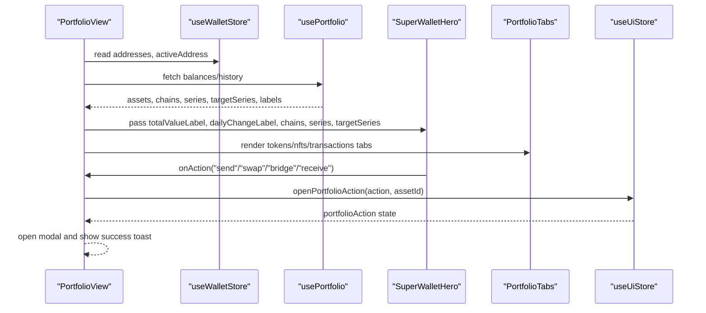

**Diagram sources**
- [PortfolioView.tsx:33-301](file://src/components/portfolio/PortfolioView.tsx#L33-L301)
- [useWalletStore.ts:16-48](file://src/store/useWalletStore.ts#L16-L48)
- [usePortfolio.ts:32-184](file://src/hooks/usePortfolio.ts#L32-L184)
- [SuperWalletHero.tsx:30-140](file://src/components/portfolio/SuperWalletHero.tsx#L30-L140)
- [PortfolioTabs.tsx:15-55](file://src/components/portfolio/PortfolioTabs.tsx#L15-L55)
- [useUiStore.ts:87-162](file://src/store/useUiStore.ts#L87-L162)

## Detailed Component Analysis

### PortfolioView
- Responsibilities:
  - Reads wallet addresses and active address from useWalletStore
  - Invokes usePortfolio to compute assets, chains, series, targetSeries, and labels
  - Manages developer mode filtering and testnet visibility
  - Handles hero action dispatch to open modals or prompt selection
  - Renders top header actions (refresh, create, import), wallet empty state, SuperWalletHero, wallet selector, SmartOpportunities, filters, and tabs
  - Opens and closes modals for receive, send, swap, and bridge
- Key behaviors:
  - Developer mode hides testnet assets unless enabled
  - Hero action handler opens ReceiveModal or delegates to openPortfolioAction
  - Filters assets by chain/type and sorts by Value/Chain/Symbol
  - Displays loading skeletons, empty states, and error messages appropriately

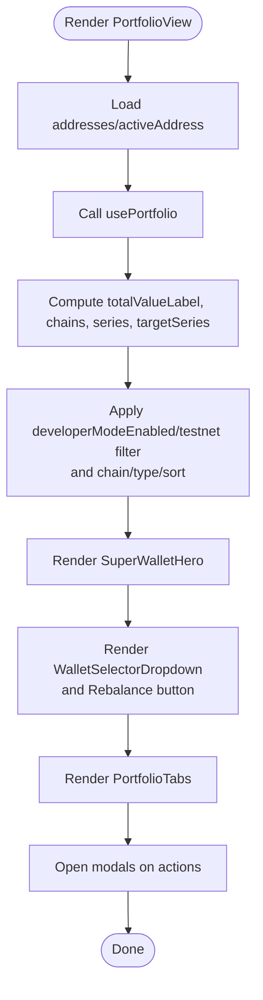

**Diagram sources**
- [PortfolioView.tsx:33-301](file://src/components/portfolio/PortfolioView.tsx#L33-L301)
- [usePortfolio.ts:32-184](file://src/hooks/usePortfolio.ts#L32-L184)
- [PortfolioFilters.tsx:43-121](file://src/components/portfolio/PortfolioFilters.tsx#L43-L121)

**Section sources**
- [PortfolioView.tsx:33-301](file://src/components/portfolio/PortfolioView.tsx#L33-L301)

### SuperWalletHero
- Displays:
  - Total net worth and daily change
  - Chain distribution bar with color-coded segments
  - Performance chart with optional target overlay
- Action buttons:
  - Receive, Send, Swap, Bridge, and Earn placeholders
- Integration:
  - Receives totalValueLabel, dailyChangeLabel, chains, series, targetSeries, and onAction callback from parent

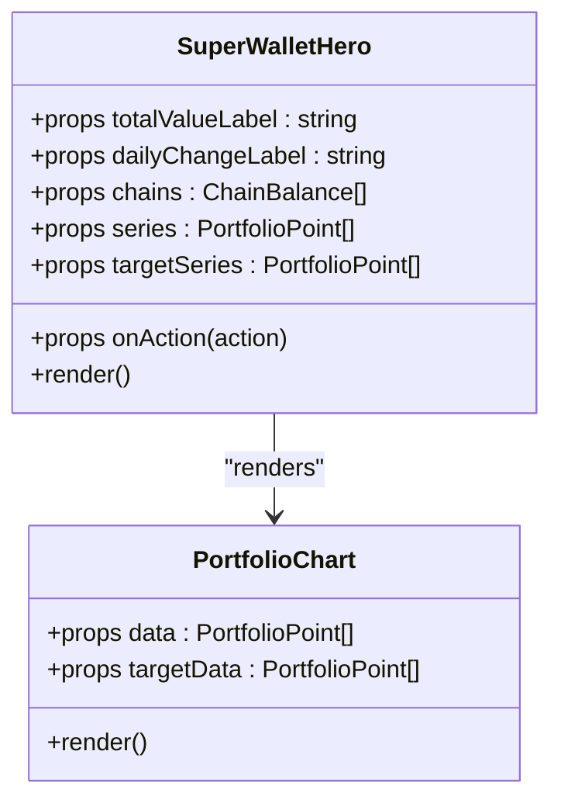

**Diagram sources**
- [SuperWalletHero.tsx:30-140](file://src/components/portfolio/SuperWalletHero.tsx#L30-L140)
- [PortfolioChart.tsx:10-89](file://src/components/shared/PortfolioChart.tsx#L10-L89)

**Section sources**
- [SuperWalletHero.tsx:30-140](file://src/components/portfolio/SuperWalletHero.tsx#L30-L140)

### PortfolioTabs
- Provides a tabbed interface with three content areas:
  - Tokens: SmartOpportunities, filters, AssetList
  - NFTs: NftGrid
  - Transactions: TransactionList
- Uses UI Tabs primitives and applies consistent styling

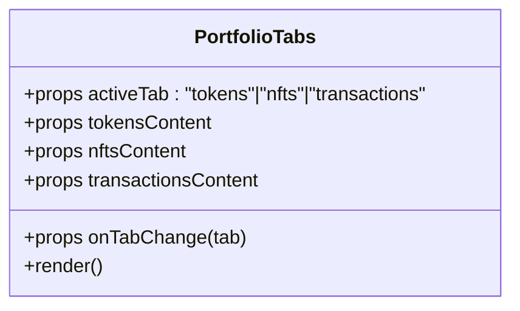

**Diagram sources**
- [PortfolioTabs.tsx:15-55](file://src/components/portfolio/PortfolioTabs.tsx#L15-L55)

**Section sources**
- [PortfolioTabs.tsx:15-55](file://src/components/portfolio/PortfolioTabs.tsx#L15-L55)

### usePortfolio Hook
- Fetches portfolio balances and history via Tauri invocations
- Computes:
  - totalValueLabel from history summary or computed sum
  - chains from history chainBreakdown or aggregated assets
  - series and targetSeries for charting
  - dailyChangeLabel from summary
- Exposes loading, fetching, refetch, and error states

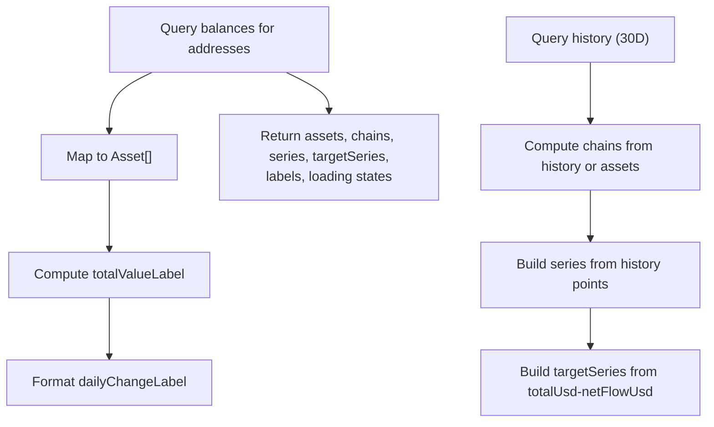

**Diagram sources**
- [usePortfolio.ts:32-184](file://src/hooks/usePortfolio.ts#L32-L184)
- [mock.ts:14-17](file://src/data/mock.ts#L14-L17)
- [wallet.ts:20-41](file://src/types/wallet.ts#L20-L41)

**Section sources**
- [usePortfolio.ts:32-184](file://src/hooks/usePortfolio.ts#L32-L184)

### WalletSelectorDropdown
- Displays aggregated view ("All Wallets") and individual wallets
- Supports:
  - Copy address
  - Rename wallet (opens dialog)
  - Remove wallet (invokes backend)
- Integrates with useWalletStore for state and refresh

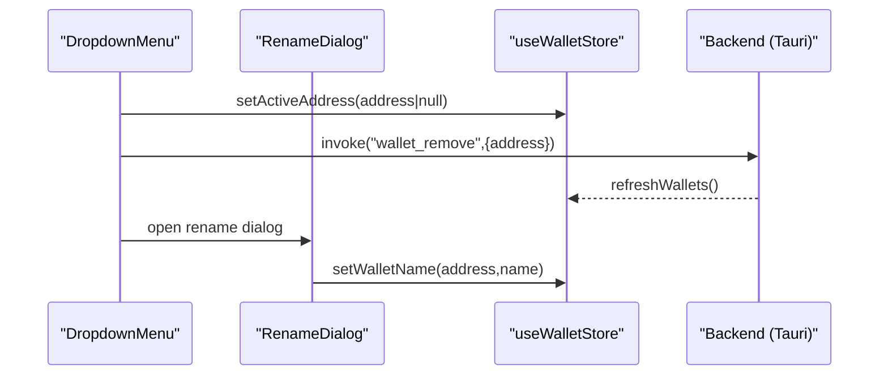

**Diagram sources**
- [WalletSelectorDropdown.tsx:35-221](file://src/components/portfolio/WalletSelectorDropdown.tsx#L35-L221)
- [useWalletStore.ts:16-48](file://src/store/useWalletStore.ts#L16-L48)

**Section sources**
- [WalletSelectorDropdown.tsx:35-221](file://src/components/portfolio/WalletSelectorDropdown.tsx#L35-L221)

### SmartOpportunities
- Renders up to three personalized opportunities with category icons and action labels
- Falls back to a connect-wallet message when no wallet context exists
- Uses market opportunities hook and wallet addresses

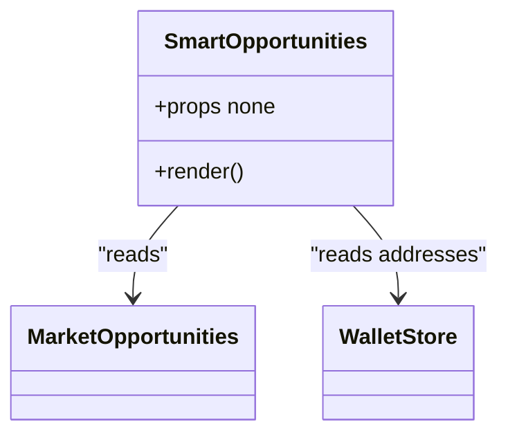

**Diagram sources**
- [SmartOpportunities.tsx:20-127](file://src/components/portfolio/SmartOpportunities.tsx#L20-L127)

**Section sources**
- [SmartOpportunities.tsx:20-127](file://src/components/portfolio/SmartOpportunities.tsx#L20-L127)

### PortfolioChart
- Renders an area chart using Recharts
- Supports target overlay series and tooltip formatting
- Includes a test-mode renderer for JSDOM environments

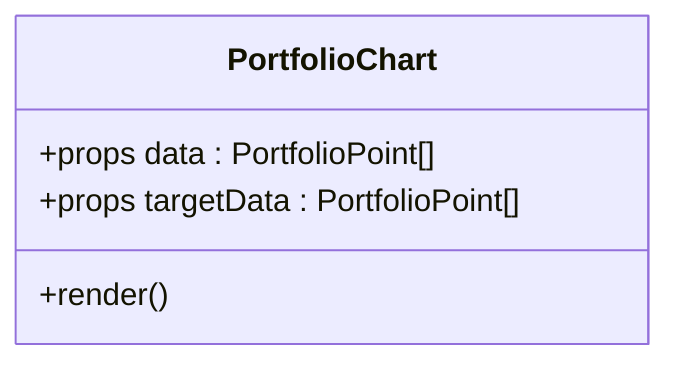

**Diagram sources**
- [PortfolioChart.tsx:10-89](file://src/components/shared/PortfolioChart.tsx#L10-L89)

**Section sources**
- [PortfolioChart.tsx:10-89](file://src/components/shared/PortfolioChart.tsx#L10-L89)

### PortfolioFilters
- Filters assets by chain/type and sorts by value/chain/symbol
- Respects developer mode to hide testnets and respects app gating for specific chains
- Integrates with installed app IDs to hide gated chains

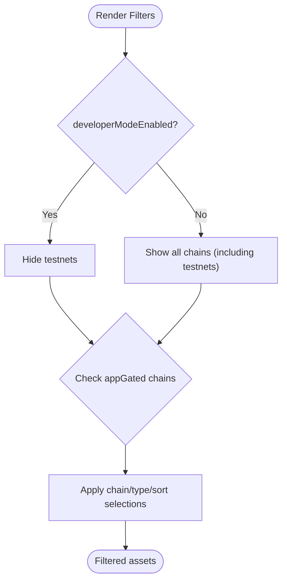

**Diagram sources**
- [PortfolioFilters.tsx:43-121](file://src/components/portfolio/PortfolioFilters.tsx#L43-L121)

**Section sources**
- [PortfolioFilters.tsx:43-121](file://src/components/portfolio/PortfolioFilters.tsx#L43-L121)

### AssetList, NftGrid, TransactionList
- AssetList: Grid of TokenCard with animation variants
- NftGrid: Grid of NFT cards with skeleton loader and empty state
- TransactionList: List with chain/category filters, timestamps, and block explorer links

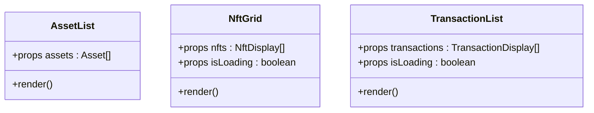

**Diagram sources**
- [AssetList.tsx:23-40](file://src/components/portfolio/AssetList.tsx#L23-L40)
- [NftGrid.tsx:23-86](file://src/components/portfolio/NftGrid.tsx#L23-L86)
- [TransactionList.tsx:39-170](file://src/components/portfolio/TransactionList.tsx#L39-L170)

**Section sources**
- [AssetList.tsx:23-40](file://src/components/portfolio/AssetList.tsx#L23-L40)
- [NftGrid.tsx:23-86](file://src/components/portfolio/NftGrid.tsx#L23-L86)
- [TransactionList.tsx:39-170](file://src/components/portfolio/TransactionList.tsx#L39-L170)

## Dependency Analysis
- PortfolioView depends on:
  - useWalletStore for addresses and activeAddress
  - usePortfolio for assets, chains, series, targetSeries, labels, and loading states
  - useUiStore for portfolioAction state and toggles
  - Local state for filters, tabs, and modals
- SuperWalletHero depends on:
  - PortfolioChart for rendering the performance chart
- PortfolioFilters depends on:
  - mock chain/type/sort definitions and installed app IDs
- usePortfolio depends on:
  - Tauri backend invocations for balances and history
  - Types from wallet.ts and mock data for typing and defaults

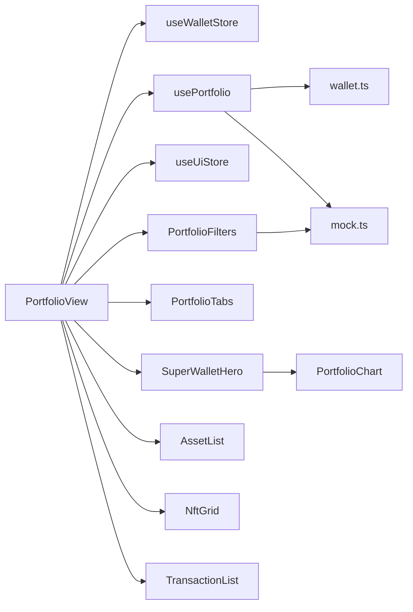

**Diagram sources**
- [PortfolioView.tsx:33-301](file://src/components/portfolio/PortfolioView.tsx#L33-L301)
- [useWalletStore.ts:16-48](file://src/store/useWalletStore.ts#L16-L48)
- [usePortfolio.ts:32-184](file://src/hooks/usePortfolio.ts#L32-L184)
- [useUiStore.ts:87-162](file://src/store/useUiStore.ts#L87-L162)
- [SuperWalletHero.tsx:30-140](file://src/components/portfolio/SuperWalletHero.tsx#L30-L140)
- [PortfolioTabs.tsx:15-55](file://src/components/portfolio/PortfolioTabs.tsx#L15-L55)
- [PortfolioFilters.tsx:43-121](file://src/components/portfolio/PortfolioFilters.tsx#L43-L121)
- [AssetList.tsx:23-40](file://src/components/portfolio/AssetList.tsx#L23-L40)
- [NftGrid.tsx:23-86](file://src/components/portfolio/NftGrid.tsx#L23-L86)
- [TransactionList.tsx:39-170](file://src/components/portfolio/TransactionList.tsx#L39-L170)
- [PortfolioChart.tsx:10-89](file://src/components/shared/PortfolioChart.tsx#L10-L89)
- [wallet.ts:20-59](file://src/types/wallet.ts#L20-L59)
- [mock.ts:14-17](file://src/data/mock.ts#L14-L17)

**Section sources**
- [PortfolioView.tsx:33-301](file://src/components/portfolio/PortfolioView.tsx#L33-L301)
- [usePortfolio.ts:32-184](file://src/hooks/usePortfolio.ts#L32-L184)

## Performance Considerations
- Memoization:
  - usePortfolio computes chains, series, targetSeries, and labels with useMemo to avoid unnecessary recalculation
  - PortfolioView memoizes filteredAssets and selectedAsset
- Loading states:
  - Skeleton loaders for asset grid and NFT grid improve perceived performance
  - Empty states guide users when no data matches filters
- Network efficiency:
  - useQuery with staleTime reduces redundant requests
  - Conditional query enabling avoids fetching when no addresses are present
- Rendering:
  - Framer Motion variants optimize list animations
  - Responsive grid layouts adapt to screen sizes

[No sources needed since this section provides general guidance]

## Troubleshooting Guide
- Balances fail to load:
  - Check usePortfolio balanceError and display appropriate EmptyState
  - Verify Tauri backend availability and wallet addresses
- Testnet assets hidden:
  - Toggle developerModeEnabled in useUiStore to reveal testnets
- No assets shown after filtering:
  - Reset filters to default values (All Chain, All Type, Value sort)
- Wallet actions blocked:
  - Ensure a wallet is selected; otherwise hero action handler prompts to select an asset or ensure a balance
- Toast feedback:
  - UseToast provides success notifications for send/swap/bridge previews

**Section sources**
- [PortfolioView.tsx:209-235](file://src/components/portfolio/PortfolioView.tsx#L209-L235)
- [usePortfolio.ts:175-182](file://src/hooks/usePortfolio.ts#L175-L182)
- [useUiStore.ts:87-162](file://src/store/useUiStore.ts#L87-L162)

## Conclusion
The Portfolio Dashboard integrates a robust data layer (usePortfolio), a visually rich hero overview (SuperWalletHero), and a flexible tabbed interface (PortfolioTabs) to deliver a comprehensive cross-chain portfolio experience. It supports wallet aggregation, developer-mode filtering, testnet visibility, and actionable workflows for send, swap, bridge, and receive. The modular component architecture, combined with memoization, skeleton loaders, and empty states, ensures a responsive and user-friendly interface.