# Portfolio Management

<cite>
**Referenced Files in This Document**
- [PortfolioView.tsx](file://src/components/portfolio/PortfolioView.tsx)
- [AssetList.tsx](file://src/components/portfolio/AssetList.tsx)
- [TransactionList.tsx](file://src/components/portfolio/TransactionList.tsx)
- [NftGrid.tsx](file://src/components/portfolio/NftGrid.tsx)
- [PortfolioChart.tsx](file://src/components/shared/PortfolioChart.tsx)
- [usePortfolio.ts](file://src/hooks/usePortfolio.ts)
- [useTransactions.ts](file://src/hooks/useTransactions.ts)
- [useNfts.ts](file://src/hooks/useNfts.ts)
- [useWalletStore.ts](file://src/store/useWalletStore.ts)
- [useWalletSyncStore.ts](file://src/store/useWalletSyncStore.ts)
- [portfolio_service.rs](file://src-tauri/src/services/portfolio_service.rs)
- [wallet.ts](file://src/types/wallet.ts)
- [mock.ts](file://src/data/mock.ts)
</cite>

## Table of Contents
1. [Introduction](#introduction)
2. [Project Structure](#project-structure)
3. [Core Components](#core-components)
4. [Architecture Overview](#architecture-overview)
5. [Detailed Component Analysis](#detailed-component-analysis)
6. [Dependency Analysis](#dependency-analysis)
7. [Performance Considerations](#performance-considerations)
8. [Troubleshooting Guide](#troubleshooting-guide)
9. [Conclusion](#conclusion)
10. [Appendices](#appendices)

## Introduction
This document explains the portfolio management system with a focus on multi-chain asset tracking and management. It covers the PortfolioView dashboard, AssetList for individual holdings, TransactionList for activity history, and NftGrid for digital assets. It also documents multi-chain support across Ethereum, Base, Arbitrum, and other networks, wallet synchronization processes, balance tracking mechanisms, visualization components, performance analytics, and reporting capabilities. Integration with blockchain RPC providers, token standard support (ERC-20, ERC-721, ERC-1155), and smart contract interactions are addressed alongside common portfolio operations such as transfers, swaps, bridging, and yield optimization. Security measures for portfolio data, transaction privacy, and asset protection are outlined, along with guidance for portfolio optimization strategies, tax reporting features, and performance benchmarking.

## Project Structure
The portfolio management system is organized around React components, TanStack Query hooks, Zustand stores, and Tauri backend services. The frontend components render dashboards and lists, while hooks orchestrate data fetching and caching. The backend service integrates with Alchemy RPC APIs to retrieve cross-chain balances, prices, and historical performance.

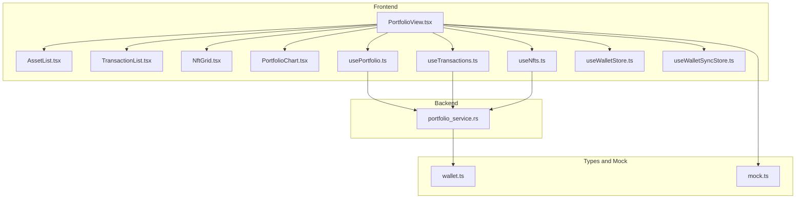

**Diagram sources**
- [PortfolioView.tsx:1-301](file://src/components/portfolio/PortfolioView.tsx#L1-L301)
- [AssetList.tsx:1-40](file://src/components/portfolio/AssetList.tsx#L1-L40)
- [TransactionList.tsx:1-170](file://src/components/portfolio/TransactionList.tsx#L1-L170)
- [NftGrid.tsx:1-86](file://src/components/portfolio/NftGrid.tsx#L1-L86)
- [PortfolioChart.tsx:1-89](file://src/components/shared/PortfolioChart.tsx#L1-L89)
- [usePortfolio.ts:1-184](file://src/hooks/usePortfolio.ts#L1-L184)
- [useTransactions.ts:1-48](file://src/hooks/useTransactions.ts#L1-L48)
- [useNfts.ts:1-43](file://src/hooks/useNfts.ts#L1-L43)
- [useWalletStore.ts:1-48](file://src/store/useWalletStore.ts#L1-L48)
- [useWalletSyncStore.ts:1-199](file://src/store/useWalletSyncStore.ts#L1-L199)
- [portfolio_service.rs:1-352](file://src-tauri/src/services/portfolio_service.rs#L1-L352)
- [wallet.ts:1-59](file://src/types/wallet.ts#L1-L59)
- [mock.ts:1-342](file://src/data/mock.ts#L1-L342)

**Section sources**
- [PortfolioView.tsx:1-301](file://src/components/portfolio/PortfolioView.tsx#L1-L301)
- [usePortfolio.ts:1-184](file://src/hooks/usePortfolio.ts#L1-L184)
- [useTransactions.ts:1-48](file://src/hooks/useTransactions.ts#L1-L48)
- [useNfts.ts:1-43](file://src/hooks/useNfts.ts#L1-L43)
- [useWalletStore.ts:1-48](file://src/store/useWalletStore.ts#L1-L48)
- [useWalletSyncStore.ts:1-199](file://src/store/useWalletSyncStore.ts#L1-L199)
- [portfolio_service.rs:1-352](file://src-tauri/src/services/portfolio_service.rs#L1-L352)
- [wallet.ts:1-59](file://src/types/wallet.ts#L1-L59)
- [mock.ts:1-342](file://src/data/mock.ts#L1-L342)

## Core Components
- PortfolioView: The main dashboard orchestrating hero metrics, asset lists, NFTs, transactions, and actions (send, swap, bridge, receive). It manages filters, sorting, and modal flows for operations.
- AssetList: Renders a responsive grid of TokenCard entries for each asset, with animated entry transitions.
- TransactionList: Displays recent transactions with chain and category filters, timestamps, and links to block explorers.
- NftGrid: Shows owned NFTs across chains with chain badges and minimal metadata.
- PortfolioChart: Visualizes portfolio value over time with optional target allocation overlay.
- Hooks: usePortfolio, useTransactions, useNfts coordinate data fetching, caching, and transformations.
- Stores: useWalletStore manages wallet addresses and active selection; useWalletSyncStore handles sync progress and notifications.

**Section sources**
- [PortfolioView.tsx:33-301](file://src/components/portfolio/PortfolioView.tsx#L33-L301)
- [AssetList.tsx:23-40](file://src/components/portfolio/AssetList.tsx#L23-L40)
- [TransactionList.tsx:39-170](file://src/components/portfolio/TransactionList.tsx#L39-L170)
- [NftGrid.tsx:23-86](file://src/components/portfolio/NftGrid.tsx#L23-L86)
- [PortfolioChart.tsx:10-89](file://src/components/shared/PortfolioChart.tsx#L10-L89)
- [usePortfolio.ts:32-184](file://src/hooks/usePortfolio.ts#L32-L184)
- [useTransactions.ts:23-48](file://src/hooks/useTransactions.ts#L23-L48)
- [useNfts.ts:19-43](file://src/hooks/useNfts.ts#L19-L43)
- [useWalletStore.ts:16-48](file://src/store/useWalletStore.ts#L16-L48)
- [useWalletSyncStore.ts:45-152](file://src/store/useWalletSyncStore.ts#L45-L152)

## Architecture Overview
The system follows a layered architecture:
- Frontend React components render views and collect user actions.
- TanStack Query hooks encapsulate data fetching and caching.
- Tauri backend services integrate with Alchemy to query balances, prices, and historical performance.
- Zustand stores manage UI state, wallet selection, and sync progress.
- Types define the shape of data exchanged between frontend and backend.

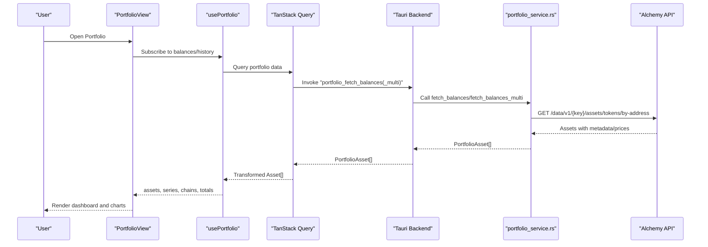

**Diagram sources**
- [PortfolioView.tsx:34-44](file://src/components/portfolio/PortfolioView.tsx#L34-L44)
- [usePortfolio.ts:44-67](file://src/hooks/usePortfolio.ts#L44-L67)
- [portfolio_service.rs:146-293](file://src-tauri/src/services/portfolio_service.rs#L146-L293)

**Section sources**
- [PortfolioView.tsx:34-65](file://src/components/portfolio/PortfolioView.tsx#L34-L65)
- [usePortfolio.ts:44-67](file://src/hooks/usePortfolio.ts#L44-L67)
- [portfolio_service.rs:146-293](file://src-tauri/src/services/portfolio_service.rs#L146-L293)

## Detailed Component Analysis

### PortfolioView Dashboard
PortfolioView composes the primary portfolio interface:
- Hero metrics: total value, daily change, chain breakdown, and chart overlay.
- Controls: wallet selector, quick rebalance action, and refresh.
- Tabs: Tokens, NFTs, Transactions.
- Modals: Send, Swap, Bridge, Receive, Create/Import Wallet.
- Filters and sorting for assets; empty and skeleton states; toast notifications.

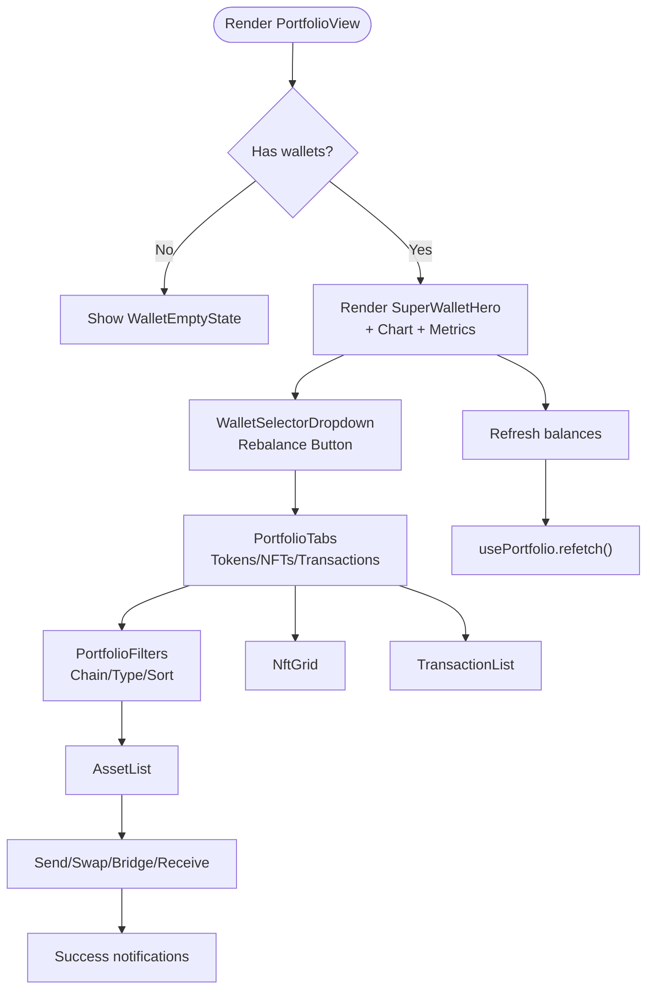

**Diagram sources**
- [PortfolioView.tsx:152-298](file://src/components/portfolio/PortfolioView.tsx#L152-L298)
- [PortfolioView.tsx:67-91](file://src/components/portfolio/PortfolioView.tsx#L67-L91)
- [PortfolioView.tsx:197-235](file://src/components/portfolio/PortfolioView.tsx#L197-L235)

**Section sources**
- [PortfolioView.tsx:33-301](file://src/components/portfolio/PortfolioView.tsx#L33-L301)
- [PortfolioView.tsx:67-91](file://src/components/portfolio/PortfolioView.tsx#L67-L91)
- [PortfolioView.tsx:197-235](file://src/components/portfolio/PortfolioView.tsx#L197-L235)

### AssetList and TokenCard
AssetList renders a responsive grid of TokenCard components. It uses animation variants to stagger card appearance and supports layout animations.

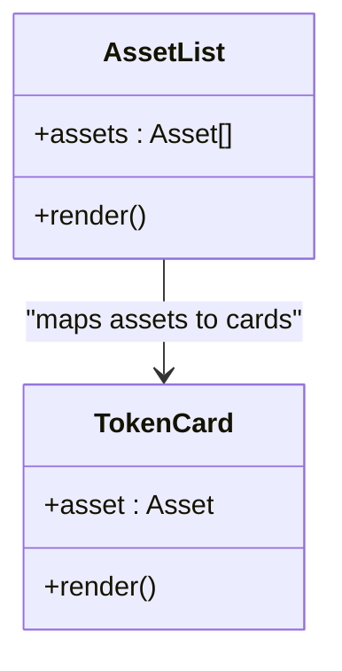

**Diagram sources**
- [AssetList.tsx:23-39](file://src/components/portfolio/AssetList.tsx#L23-L39)

**Section sources**
- [AssetList.tsx:23-40](file://src/components/portfolio/AssetList.tsx#L23-L40)

### TransactionList
TransactionList provides filtering by chain and category, displays timestamps, and links to block explorers. It adapts to loading and empty states.

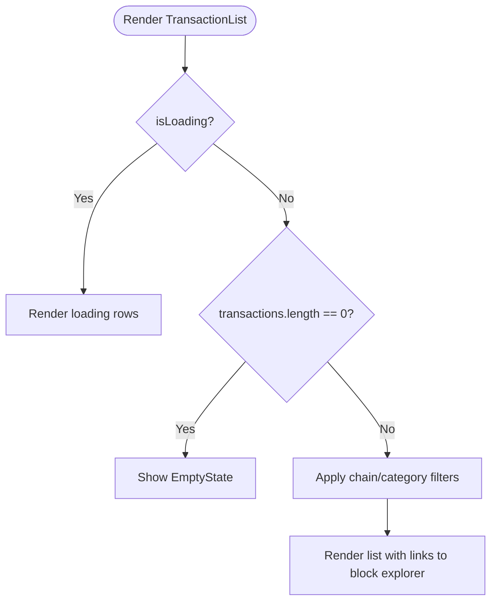

**Diagram sources**
- [TransactionList.tsx:39-170](file://src/components/portfolio/TransactionList.tsx#L39-L170)

**Section sources**
- [TransactionList.tsx:39-170](file://src/components/portfolio/TransactionList.tsx#L39-L170)

### NftGrid
NftGrid presents NFT collections with chain badges and minimal metadata. It handles loading and empty states.

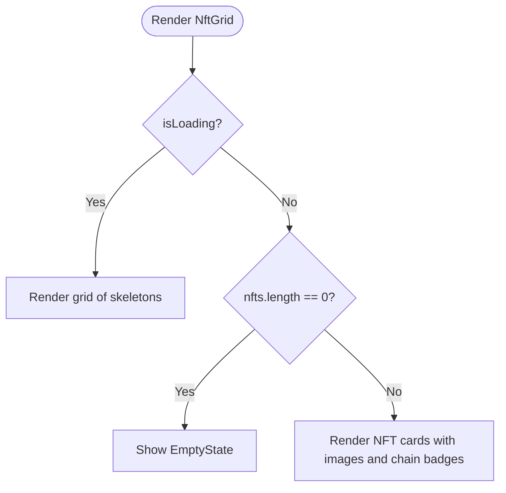

**Diagram sources**
- [NftGrid.tsx:23-86](file://src/components/portfolio/NftGrid.tsx#L23-L86)

**Section sources**
- [NftGrid.tsx:23-86](file://src/components/portfolio/NftGrid.tsx#L23-L86)

### PortfolioChart
PortfolioChart visualizes portfolio value over time using Recharts. It supports a dashed target overlay and custom tooltips.

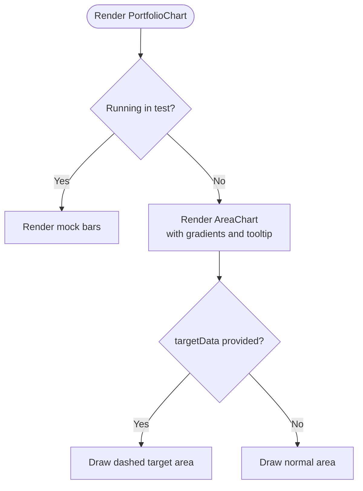

**Diagram sources**
- [PortfolioChart.tsx:10-89](file://src/components/shared/PortfolioChart.tsx#L10-L89)

**Section sources**
- [PortfolioChart.tsx:10-89](file://src/components/shared/PortfolioChart.tsx#L10-L89)

### Multi-chain Support and Balance Tracking
The backend service aggregates balances across supported networks and formats results for the frontend.

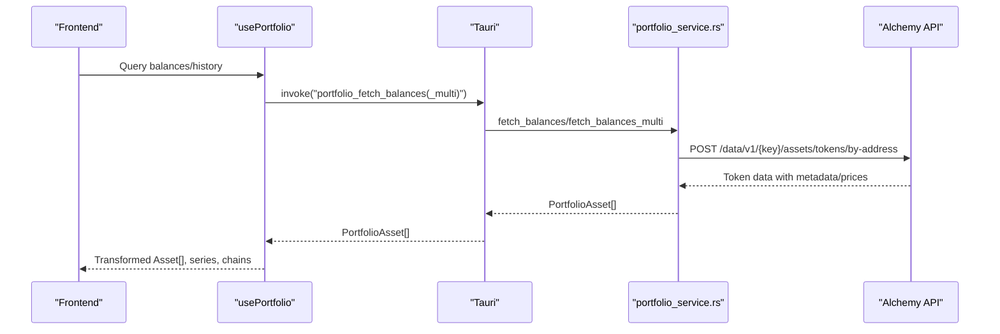

Supported networks include mainnets and testnets for Ethereum, Base, Polygon, and optionally Flow when the related tool app is ready. Native tokens, ERC-20 tokens, and metadata/prices are retrieved and normalized.

**Diagram sources**
- [usePortfolio.ts:44-67](file://src/hooks/usePortfolio.ts#L44-L67)
- [portfolio_service.rs:14-22](file://src-tauri/src/services/portfolio_service.rs#L14-L22)
- [portfolio_service.rs:146-293](file://src-tauri/src/services/portfolio_service.rs#L146-L293)

**Section sources**
- [portfolio_service.rs:8-22](file://src-tauri/src/services/portfolio_service.rs#L8-L22)
- [portfolio_service.rs:146-293](file://src-tauri/src/services/portfolio_service.rs#L146-L293)
- [wallet.ts:20-31](file://src/types/wallet.ts#L20-L31)

### Wallet Synchronization and Notifications
Wallet synchronization is managed via Tauri events and Zustand stores. Progress updates and completion notifications are surfaced to the UI.

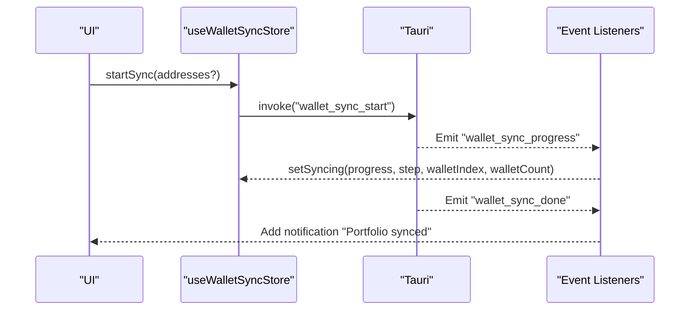

**Diagram sources**
- [useWalletSyncStore.ts:64-73](file://src/store/useWalletSyncStore.ts#L64-L73)
- [useWalletSyncStore.ts:116-151](file://src/store/useWalletSyncStore.ts#L116-L151)

**Section sources**
- [useWalletSyncStore.ts:45-152](file://src/store/useWalletSyncStore.ts#L45-L152)

### Performance Analytics and Reporting
usePortfolio computes derived metrics including total value, chain breakdown, series data, and target series for comparison. These drive the hero metrics and charts.

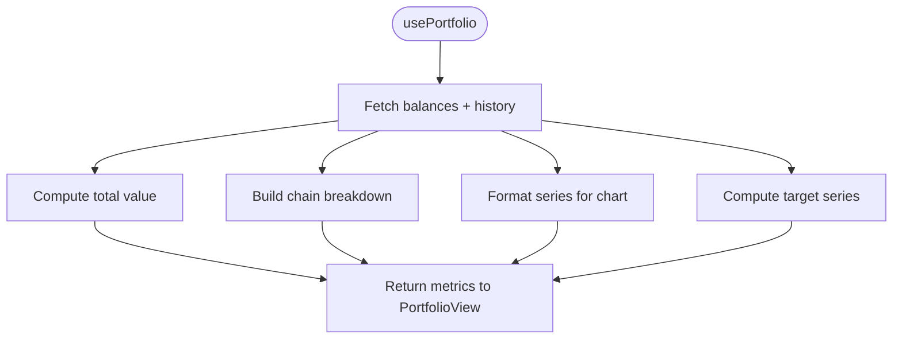

**Diagram sources**
- [usePortfolio.ts:62-155](file://src/hooks/usePortfolio.ts#L62-L155)

**Section sources**
- [usePortfolio.ts:62-155](file://src/hooks/usePortfolio.ts#L62-L155)
- [mock.ts:14-17](file://src/data/mock.ts#L14-L17)
- [mock.ts:161-176](file://src/data/mock.ts#L161-L176)

### Token Standard Support and Smart Contract Interactions
- ERC-20: Detected via metadata and prices; balances normalized by decimals.
- Native tokens: Identified by empty or null token address; symbol fallbacks per network.
- ERC-721/ERC-1155: Handled by NFT queries and display; category labeling distinguishes NFT activity.
- Smart contracts: Interactions are orchestrated by backend services and agent tools; direct contract calls are mediated through Tauri commands and event-driven notifications.

**Section sources**
- [portfolio_service.rs:200-234](file://src-tauri/src/services/portfolio_service.rs#L200-L234)
- [TransactionList.tsx:27-37](file://src/components/portfolio/TransactionList.tsx#L27-L37)
- [useWalletSyncStore.ts:171-198](file://src/store/useWalletSyncStore.ts#L171-L198)

### Common Portfolio Operations
- Transfers: Initiated via SendModal; backend emits confirmation events for success/failure.
- Swaps: Preview and routing handled by SwapModal; agent tools may propose optimal routes.
- Bridging: Preview and destination chain selection via BridgeModal.
- Yield optimization: Opportunities surfaced through market data and agent suggestions; strategies can be deployed via the builder.

**Section sources**
- [PortfolioView.tsx:260-297](file://src/components/portfolio/PortfolioView.tsx#L260-L297)
- [useWalletSyncStore.ts:78-108](file://src/store/useWalletSyncStore.ts#L78-L108)
- [mock.ts:269-306](file://src/data/mock.ts#L269-L306)

## Dependency Analysis
The frontend depends on TanStack Query for data fetching, Zustand for state, and Tauri for native integrations. The backend depends on Alchemy for blockchain data.

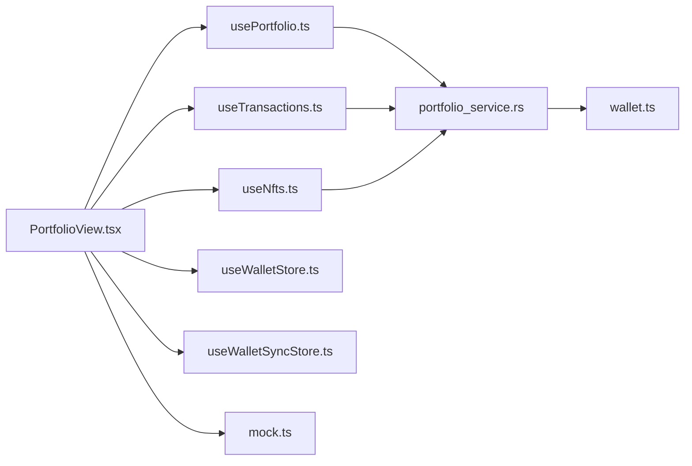

**Diagram sources**
- [PortfolioView.tsx:4-29](file://src/components/portfolio/PortfolioView.tsx#L4-L29)
- [usePortfolio.ts:1-15](file://src/hooks/usePortfolio.ts#L1-L15)
- [useTransactions.ts:1-4](file://src/hooks/useTransactions.ts#L1-L4)
- [useNfts.ts:1-4](file://src/hooks/useNfts.ts#L1-L4)
- [useWalletStore.ts:1-4](file://src/store/useWalletStore.ts#L1-L4)
- [useWalletSyncStore.ts:1-7](file://src/store/useWalletSyncStore.ts#L1-L7)
- [portfolio_service.rs:1-12](file://src-tauri/src/services/portfolio_service.rs#L1-L12)
- [wallet.ts:1-10](file://src/types/wallet.ts#L1-L10)
- [mock.ts:1-10](file://src/data/mock.ts#L1-L10)

**Section sources**
- [PortfolioView.tsx:4-29](file://src/components/portfolio/PortfolioView.tsx#L4-L29)
- [usePortfolio.ts:1-15](file://src/hooks/usePortfolio.ts#L1-L15)
- [useTransactions.ts:1-4](file://src/hooks/useTransactions.ts#L1-L4)
- [useNfts.ts:1-4](file://src/hooks/useNfts.ts#L1-L4)
- [useWalletStore.ts:1-4](file://src/store/useWalletStore.ts#L1-L4)
- [useWalletSyncStore.ts:1-7](file://src/store/useWalletSyncStore.ts#L1-L7)
- [portfolio_service.rs:1-12](file://src-tauri/src/services/portfolio_service.rs#L1-L12)
- [wallet.ts:1-10](file://src/types/wallet.ts#L1-L10)
- [mock.ts:1-10](file://src/data/mock.ts#L1-L10)

## Performance Considerations
- Caching and staleTime: Queries are cached with 60-second stale windows to reduce redundant network calls.
- Batch fetching: Multi-address balance retrieval consolidates requests per address.
- Sorting and filtering: Client-side filtering and sorting are optimized with memoization.
- Rendering: Animated grids and skeleton loaders improve perceived performance during data transitions.

[No sources needed since this section provides general guidance]

## Troubleshooting Guide
- Balances fail to load: usePortfolio exposes a balanceError field populated from query errors; verify API keys and network connectivity.
- No transactions/NFTs: Ensure wallet addresses are present and synced; use the refresh action and confirm sync notifications.
- Sync stuck: Monitor progress via useWalletSyncStore; re-run sync if idle; check for critical alerts.
- Transaction confirmations: Listen for tx_confirmation events to update UI on success or failure.

**Section sources**
- [usePortfolio.ts:175-182](file://src/hooks/usePortfolio.ts#L175-L182)
- [useWalletSyncStore.ts:116-151](file://src/store/useWalletSyncStore.ts#L116-L151)
- [useWalletSyncStore.ts:78-108](file://src/store/useWalletSyncStore.ts#L78-L108)

## Conclusion
The portfolio management system integrates a responsive dashboard, robust data fetching, and multi-chain balance aggregation to deliver a comprehensive asset tracking experience. With modular components, clear separation of concerns, and event-driven synchronization, it supports everyday operations like transfers, swaps, and bridging, while enabling advanced analytics and agent-assisted optimization.

[No sources needed since this section summarizes without analyzing specific files]

## Appendices

### Multi-chain Networks and Testnets
- Mainnets: Ethereum, Base, Polygon
- Testnets: Sepolia (Ethereum), Base Sepolia, Polygon Amoy
- Optional: Flow mainnet/testnet when the Flow tool app is installed

**Section sources**
- [portfolio_service.rs:8-22](file://src-tauri/src/services/portfolio_service.rs#L8-L22)

### Data Models Overview
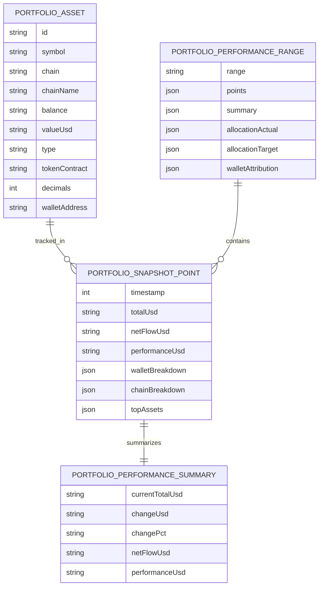

**Diagram sources**
- [wallet.ts:20-59](file://src/types/wallet.ts#L20-L59)