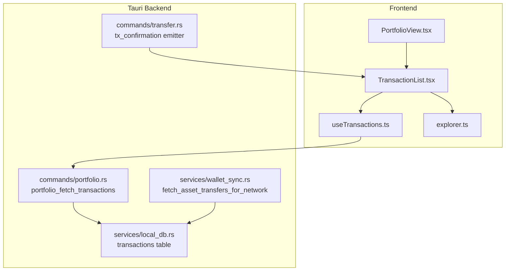
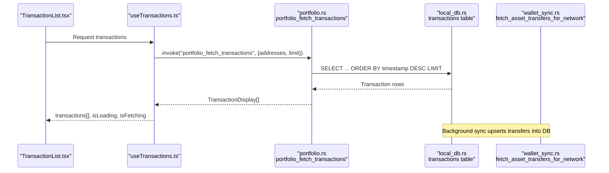
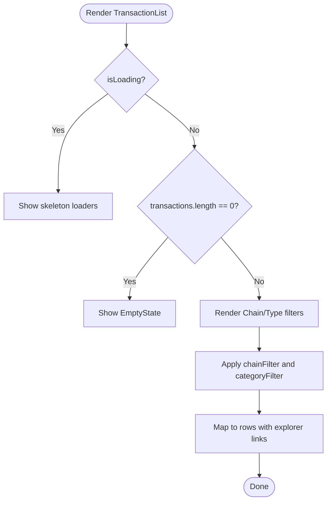
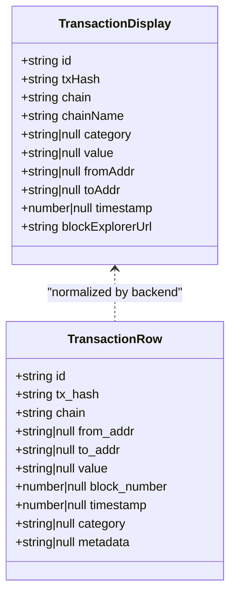
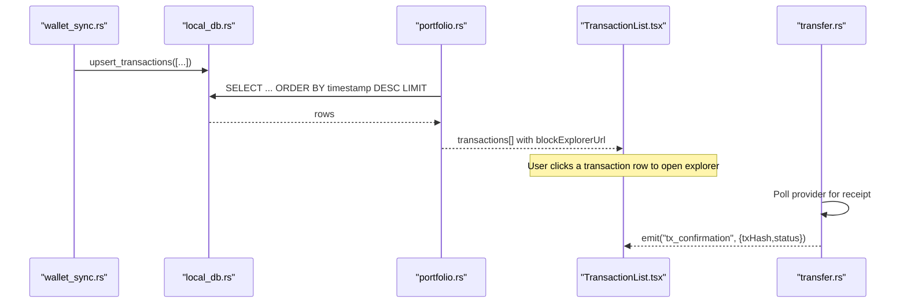
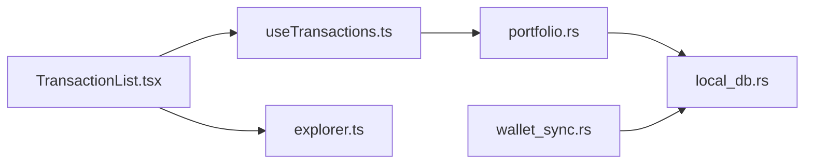

# Transaction History

<cite>
**Referenced Files in This Document**
- [TransactionList.tsx](file://src/components/portfolio/TransactionList.tsx)
- [useTransactions.ts](file://src/hooks/useTransactions.ts)
- [explorer.ts](file://src/lib/explorer.ts)
- [portfolio.rs](file://src-tauri/src/commands/portfolio.rs)
- [local_db.rs](file://src-tauri/src/services/local_db.rs)
- [wallet_sync.rs](file://src-tauri/src/services/wallet_sync.rs)
- [PortfolioView.tsx](file://src/components/portfolio/PortfolioView.tsx)
- [transfer.rs](file://src-tauri/src/commands/transfer.rs)
- [guardrails.rs](file://src-tauri/src/services/guardrails.rs)
- [AppShell.tsx](file://src/components/layout/AppShell.tsx)
- [ApprovalModal.tsx](file://src/components/shared/ApprovalModal.tsx)
</cite>

## Table of Contents
1. [Introduction](#introduction)
2. [Project Structure](#project-structure)
3. [Core Components](#core-components)
4. [Architecture Overview](#architecture-overview)
5. [Detailed Component Analysis](#detailed-component-analysis)
6. [Dependency Analysis](#dependency-analysis)
7. [Performance Considerations](#performance-considerations)
8. [Troubleshooting Guide](#troubleshooting-guide)
9. [Conclusion](#conclusion)

## Introduction
This document explains the transaction history system that tracks and displays portfolio activities across multiple chains. It covers the TransactionList component architecture, transaction categorization, filtering, data model, blockchain explorer integration, receipt processing, real-time updates, loading states, pagination, performance optimization, action links, and transaction details. It also outlines fee tracking, gas monitoring, tax reporting features, debugging, failed transaction handling, and pending transaction management.

## Project Structure
The transaction history spans frontend React components, a TanStack Query hook, and a Tauri backend service backed by a local SQLite database. The frontend composes a list view with filters and links to block explorers. The backend fetches and persists transaction data, builds explorer URLs, and emits real-time confirmations.

**Diagram sources**
- [TransactionList.tsx:1-170](file://src/components/portfolio/TransactionList.tsx#L1-L170)
- [useTransactions.ts:1-48](file://src/hooks/useTransactions.ts#L1-L48)
- [PortfolioView.tsx:1-301](file://src/components/portfolio/PortfolioView.tsx#L1-L301)
- [explorer.ts:1-24](file://src/lib/explorer.ts#L1-L24)
- [portfolio.rs:131-163](file://src-tauri/src/commands/portfolio.rs#L131-L163)
- [wallet_sync.rs:132-209](file://src-tauri/src/services/wallet_sync.rs#L132-L209)
- [local_db.rs:40-60](file://src-tauri/src/services/local_db.rs#L40-L60)
- [transfer.rs:244-279](file://src-tauri/src/commands/transfer.rs#L244-L279)

**Section sources**
- [TransactionList.tsx:1-170](file://src/components/portfolio/TransactionList.tsx#L1-L170)
- [useTransactions.ts:1-48](file://src/hooks/useTransactions.ts#L1-L48)
- [PortfolioView.tsx:1-301](file://src/components/portfolio/PortfolioView.tsx#L1-L301)
- [explorer.ts:1-24](file://src/lib/explorer.ts#L1-L24)
- [portfolio.rs:131-163](file://src-tauri/src/commands/portfolio.rs#L131-L163)
- [local_db.rs:40-60](file://src-tauri/src/services/local_db.rs#L40-L60)
- [wallet_sync.rs:132-209](file://src-tauri/src/services/wallet_sync.rs#L132-L209)
- [transfer.rs:244-279](file://src-tauri/src/commands/transfer.rs#L244-L279)

## Core Components
- TransactionList: Renders a paginated, filterable list of transactions with chain and category filters, explorer links, and relative timestamps.
- useTransactions: TanStack Query hook that invokes a Tauri command to fetch transactions for one or more wallet addresses.
- Explorer utilities: Builds chain-specific explorer URLs for transactions and addresses.
- Backend commands: portfolio_fetch_transactions returns normalized transaction records with explorer URLs.
- Local DB: Stores transactions with indices for fast retrieval and sorting by timestamp.
- Wallet sync: Fetches transfers from Alchemy and upserts into the local DB.
- Real-time confirmations: Emits tx_confirmation events for pending transactions.

**Section sources**
- [TransactionList.tsx:39-169](file://src/components/portfolio/TransactionList.tsx#L39-L169)
- [useTransactions.ts:23-47](file://src/hooks/useTransactions.ts#L23-L47)
- [explorer.ts:1-24](file://src/lib/explorer.ts#L1-L24)
- [portfolio.rs:131-163](file://src-tauri/src/commands/portfolio.rs#L131-L163)
- [local_db.rs:40-60](file://src-tauri/src/services/local_db.rs#L40-L60)
- [wallet_sync.rs:132-209](file://src-tauri/src/services/wallet_sync.rs#L132-L209)
- [transfer.rs:244-279](file://src-tauri/src/commands/transfer.rs#L244-L279)

## Architecture Overview
The system follows a layered architecture:
- Frontend: React components and TanStack Query manage UI state, loading, and caching.
- Backend: Tauri commands orchestrate data access and external API calls.
- Storage: Local SQLite persists tokens, NFTs, and transactions with appropriate indexes.
- External APIs: Alchemy for asset transfers; block explorers for transaction details.

**Diagram sources**
- [TransactionList.tsx:39-169](file://src/components/portfolio/TransactionList.tsx#L39-L169)
- [useTransactions.ts:23-47](file://src/hooks/useTransactions.ts#L23-L47)
- [portfolio.rs:131-163](file://src-tauri/src/commands/portfolio.rs#L131-L163)
- [local_db.rs:1599-1642](file://src-tauri/src/services/local_db.rs#L1599-L1642)
- [wallet_sync.rs:132-209](file://src-tauri/src/services/wallet_sync.rs#L132-L209)

## Detailed Component Analysis

### TransactionList Component
Responsibilities:
- Accepts a list of normalized transactions and an optional loading flag.
- Provides chain and category filters derived from the dataset.
- Renders each transaction as a clickable row linking to the block explorer.
- Displays value, relative timestamp, and chain label.
- Handles empty states and filter mismatch messaging.

Filtering logic:
- Chain filter: "All" or a specific chain code.
- Category filter: "All" or a normalized category label mapped from raw categories.

Rendering highlights:
- Relative timestamp computed from epoch seconds.
- Explorer URL built per-chain.
- Truncated transaction hash for readability.

**Diagram sources**
- [TransactionList.tsx:39-169](file://src/components/portfolio/TransactionList.tsx#L39-L169)

**Section sources**
- [TransactionList.tsx:1-170](file://src/components/portfolio/TransactionList.tsx#L1-L170)

### Transaction Data Model and Categorization
Frontend type:
- TransactionDisplay: id, txHash, chain, chainName, category, value, fromAddr, toAddr, timestamp, blockExplorerUrl.

Backend normalization:
- portfolio_fetch_transactions maps raw rows to TransactionDisplay and constructs blockExplorerUrl using chain-to-explorer base mapping.

Categorization:
- Raw categories include external/internal/erc20/erc721/erc1155.
- Normalized labels: Transfer, Internal, Token, NFT.

**Diagram sources**
- [useTransactions.ts:4-15](file://src/hooks/useTransactions.ts#L4-L15)
- [portfolio.rs:104-117](file://src-tauri/src/commands/portfolio.rs#L104-L117)
- [local_db.rs:1734-1745](file://src-tauri/src/services/local_db.rs#L1734-L1745)

**Section sources**
- [useTransactions.ts:4-15](file://src/hooks/useTransactions.ts#L4-L15)
- [portfolio.rs:104-117](file://src-tauri/src/commands/portfolio.rs#L104-L117)
- [local_db.rs:1734-1745](file://src-tauri/src/services/local_db.rs#L1734-L1745)

### Filtering Options
- Chain filter: Derived from unique chain codes in the dataset; supports "All".
- Category filter: Derived from non-null categories; supports "All"; normalized labels shown to the user.

Filtering behavior:
- Both filters are applied concurrently; rows matching both conditions are displayed.
- When no rows match, a message indicates no transactions match the selected filters.

**Section sources**
- [TransactionList.tsx:43-65](file://src/components/portfolio/TransactionList.tsx#L43-L65)

### Blockchain Explorer Integration
- Explorer base URLs are mapped per chain code.
- Transaction rows include a blockExplorerUrl constructed from the base and tx hash.
- The UI renders each transaction as a link to the explorer.

**Section sources**
- [explorer.ts:1-24](file://src/lib/explorer.ts#L1-L24)
- [portfolio.rs:147-159](file://src-tauri/src/commands/portfolio.rs#L147-L159)

### Transaction Receipt Processing and Real-Time Updates
- Background sync fetches transfers from Alchemy and upserts into the local DB.
- The backend command portfolio_fetch_transactions reads from the DB and returns explorer URLs.
- A separate command monitors pending transactions and emits tx_confirmation events with status.

**Diagram sources**
- [wallet_sync.rs:132-209](file://src-tauri/src/services/wallet_sync.rs#L132-L209)
- [local_db.rs:1552-1597](file://src-tauri/src/services/local_db.rs#L1552-L1597)
- [portfolio.rs:131-163](file://src-tauri/src/commands/portfolio.rs#L131-L163)
- [transfer.rs:244-279](file://src-tauri/src/commands/transfer.rs#L244-L279)

**Section sources**
- [wallet_sync.rs:132-209](file://src-tauri/src/services/wallet_sync.rs#L132-L209)
- [local_db.rs:1552-1597](file://src-tauri/src/services/local_db.rs#L1552-L1597)
- [portfolio.rs:131-163](file://src-tauri/src/commands/portfolio.rs#L131-L163)
- [transfer.rs:244-279](file://src-tauri/src/commands/transfer.rs#L244-L279)

### Transaction Loading States and Pagination
- useTransactions uses TanStack Query with a cache key including addresses and limit.
- enabled is true only when addressesToFetch is non-empty.
- staleTime is set to 60 seconds to avoid frequent refetches.
- PortfolioView passes isLoading and txLoading to TransactionList.

Pagination:
- Backend query applies LIMIT to cap results.
- Sorting is by timestamp descending.

**Section sources**
- [useTransactions.ts:23-47](file://src/hooks/useTransactions.ts#L23-L47)
- [portfolio.rs:139-141](file://src-tauri/src/commands/portfolio.rs#L139-L141)
- [local_db.rs:1604-1641](file://src-tauri/src/services/local_db.rs#L1604-L1641)
- [PortfolioView.tsx:40-43](file://src/components/portfolio/PortfolioView.tsx#L40-L43)

### Performance Optimization for Large Histories
- Local DB indexing on wallet_address and timestamp enables fast retrieval and sorting.
- LIMIT prevents unbounded memory usage.
- Stale-time caching reduces redundant network requests.
- Memoization of filters and derived sets avoids unnecessary re-renders.

**Section sources**
- [local_db.rs:58-59](file://src-tauri/src/services/local_db.rs#L58-L59)
- [useTransactions.ts:43-44](file://src/hooks/useTransactions.ts#L43-L44)
- [TransactionList.tsx:43-65](file://src/components/portfolio/TransactionList.tsx#L43-L65)

### Transaction Action Links, Explorer Integration, and Details Modal
- Each transaction row is a link to the block explorer.
- The explorer base URL is chain-aware.
- Approval and guardrails flows integrate with transaction actions and can surface gas and slippage details.

**Section sources**
- [TransactionList.tsx:127-157](file://src/components/portfolio/TransactionList.tsx#L127-L157)
- [explorer.ts:1-24](file://src/lib/explorer.ts#L1-L24)
- [AppShell.tsx:200-215](file://src/components/layout/AppShell.tsx#L200-L215)
- [ApprovalModal.tsx:60-79](file://src/components/shared/ApprovalModal.tsx#L60-L79)

### Fee Tracking, Gas Price Monitoring, and Tax Reporting Features
- Fee tracking: The transaction row includes value and timestamp; fee tracking can be inferred from gas usage and price where available in metadata.
- Gas monitoring: The approval modal displays gas estimates alongside slippage for human-in-the-loop decisions.
- Tax reporting: The system stores transactions locally; tax reporting can leverage timestamp, chain, category, and value fields to compute gains/losses and categorize activity.

Note: The current codebase exposes transaction fields suitable for downstream tax computations; explicit fee and gas fields are not present in the normalized display type. They can be added by extending the backend mapping and frontend display.

**Section sources**
- [useTransactions.ts:4-15](file://src/hooks/useTransactions.ts#L4-L15)
- [ApprovalModal.tsx:74-77](file://src/components/shared/ApprovalModal.tsx#L74-L77)
- [guardrails.rs:311-397](file://src-tauri/src/services/guardrails.rs#L311-L397)

## Dependency Analysis
- TransactionList depends on:
  - useTransactions for data and loading states.
  - explorer utilities for building URLs.
  - EmptyState for empty scenarios.
- useTransactions depends on:
  - TanStack Query for caching and refetching.
  - Tauri invoke to call portfolio_fetch_transactions.
- portfolio_fetch_transactions depends on:
  - local_db for retrieving and ordering transactions.
  - chain-to-explorer mapping for URLs.
- wallet_sync depends on:
  - Alchemy RPC for asset transfers.
  - local_db upsert for persistence.

**Diagram sources**
- [TransactionList.tsx:1-10](file://src/components/portfolio/TransactionList.tsx#L1-L10)
- [useTransactions.ts:1-2](file://src/hooks/useTransactions.ts#L1-L2)
- [portfolio.rs:131-163](file://src-tauri/src/commands/portfolio.rs#L131-L163)
- [local_db.rs:40-60](file://src-tauri/src/services/local_db.rs#L40-L60)
- [wallet_sync.rs:132-209](file://src-tauri/src/services/wallet_sync.rs#L132-L209)
- [explorer.ts:1-24](file://src/lib/explorer.ts#L1-L24)

**Section sources**
- [TransactionList.tsx:1-10](file://src/components/portfolio/TransactionList.tsx#L1-L10)
- [useTransactions.ts:1-2](file://src/hooks/useTransactions.ts#L1-L2)
- [portfolio.rs:131-163](file://src-tauri/src/commands/portfolio.rs#L131-L163)
- [local_db.rs:40-60](file://src-tauri/src/services/local_db.rs#L40-L60)
- [wallet_sync.rs:132-209](file://src-tauri/src/services/wallet_sync.rs#L132-L209)
- [explorer.ts:1-24](file://src/lib/explorer.ts#L1-L24)

## Performance Considerations
- Prefer filtering on the backend when datasets grow large; the current frontend filters are acceptable for moderate sizes.
- Keep staleTime tuned to balance freshness and performance.
- Ensure LIMIT remains appropriate; consider adaptive limits for very large histories.
- Use memoization for expensive computations in rendering.

[No sources needed since this section provides general guidance]

## Troubleshooting Guide
- No transactions displayed:
  - Verify addresses are populated and enabled in the query.
  - Confirm wallet sync has occurred and transactions exist in the DB.
- Filters hide all results:
  - Reset filters to "All" to confirm data presence.
- Explorer links open blank:
  - Confirm chain code is supported by the explorer mapping.
- Pending transaction not updating:
  - Ensure tx_confirmation events are emitted and received by the UI.
  - Check polling intervals and provider availability.

**Section sources**
- [useTransactions.ts:33-44](file://src/hooks/useTransactions.ts#L33-L44)
- [local_db.rs:1599-1642](file://src-tauri/src/services/local_db.rs#L1599-L1642)
- [explorer.ts:11-23](file://src/lib/explorer.ts#L11-L23)
- [transfer.rs:244-279](file://src-tauri/src/commands/transfer.rs#L244-L279)

## Conclusion
The transaction history system integrates a responsive frontend list with robust backend data access and local persistence. It supports chain-aware filtering, explorer navigation, and real-time confirmation updates. Extending fee and gas fields, adding pagination controls, and enriching tax reporting metadata will further strengthen the system for advanced users.