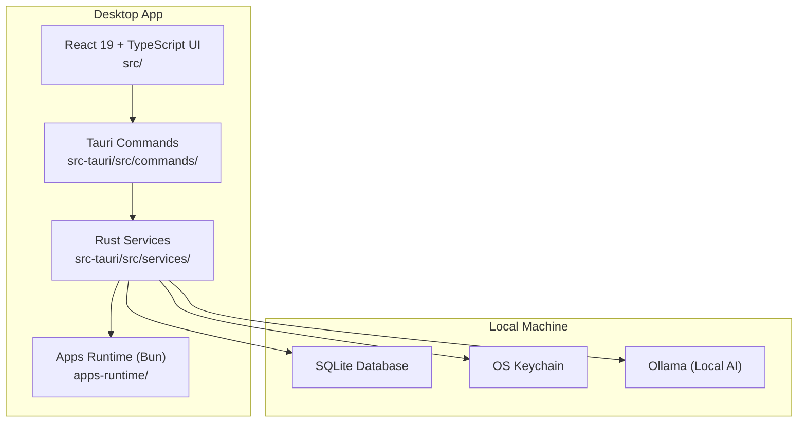
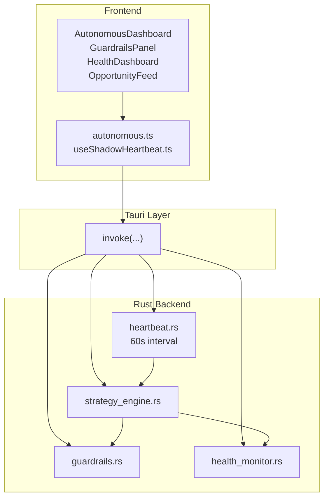
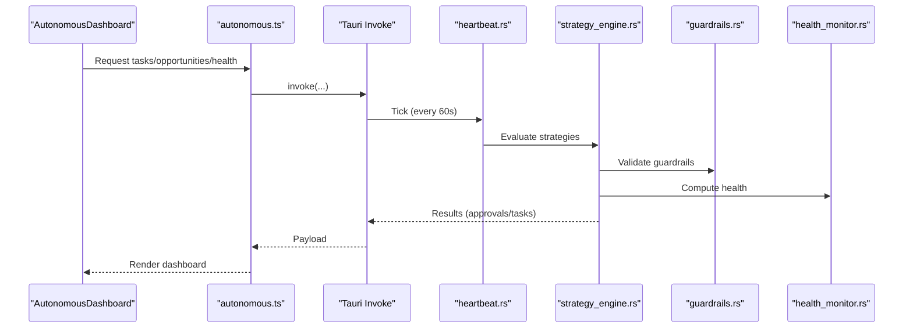
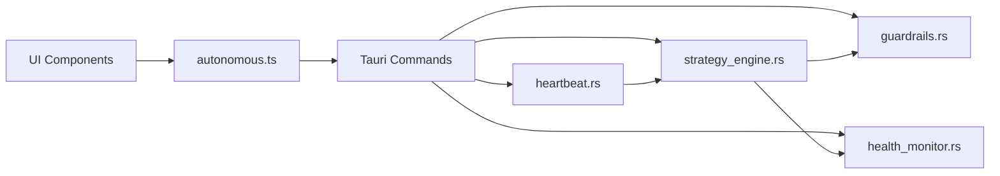

# Core Philosophy & Vision

<cite>
**Referenced Files in This Document**
- [README.md](file://README.md)
- [shadow-protocol.md](file://docs/shadow-protocol.md)
- [InitializationSequence.tsx](file://src/components/onboarding/InitializationSequence.tsx)
- [useShadowHeartbeat.ts](file://src/hooks/useShadowHeartbeat.ts)
- [AutonomousDashboard.tsx](file://src/components/autonomous/AutonomousDashboard.tsx)
- [GuardrailsPanel.tsx](file://src/components/autonomous/GuardrailsPanel.tsx)
- [HealthDashboard.tsx](file://src/components/autonomous/HealthDashboard.tsx)
- [OpportunityFeed.tsx](file://src/components/autonomous/OpportunityFeed.tsx)
- [autonomous.ts](file://src/lib/autonomous.ts)
- [heartbeat.rs](file://src-tauri/src/services/heartbeat.rs)
- [health_monitor.rs](file://src-tauri/src/services/health_monitor.rs)
- [guardrails.rs](file://src-tauri/src/services/guardrails.rs)
- [strategy_engine.rs](file://src-tauri/src/services/strategy_engine.rs)
- [main.rs](file://src-tauri/src/main.rs)
</cite>

## Table of Contents
1. [Introduction](#introduction)
2. [Project Structure](#project-structure)
3. [Core Components](#core-components)
4. [Architecture Overview](#architecture-overview)
5. [Detailed Component Analysis](#detailed-component-analysis)
6. [Dependency Analysis](#dependency-analysis)
7. [Performance Considerations](#performance-considerations)
8. [Troubleshooting Guide](#troubleshooting-guide)
9. [Conclusion](#conclusion)
10. [Appendices](#appendices)

## Introduction
SHADOW Protocol’s mission is to return control to users in a transparent blockchain era by placing sensitive state, approvals, and automation logic on the user’s local machine. The project envisions a privacy-first desktop workstation for DeFi operations that:
- Keeps sensitive operations local
- Makes agent behavior visible and reviewable
- Empowers users with sovereign guardrails and autonomous insight
- Delivers a desktop-native UX for richer control than browser popups

This document articulates SHADOW’s core philosophy and vision, grounded in the codebase’s architecture and feature set. It explains the four core pillars—Local AI Intelligence, Sovereign Security, Multi-Chain Command, and Background Autonomy—and how SHADOW solves the problems of transparent blockchains and cloud-dependent AI through hybrid edge computing.

## Project Structure
SHADOW is a Tauri 2 desktop application with a React 19 frontend, a Rust backend, and a Bun-based sidecar for integrations. The frontend communicates with the backend via typed Tauri invokes, while Rust handles security-critical operations, local persistence, and autonomous subsystems.

**Diagram sources**
- [shadow-protocol.md:109-126](file://docs/shadow-protocol.md#L109-L126)
- [main.rs:1-7](file://src-tauri/src/main.rs#L1-L7)

**Section sources**
- [README.md:23-37](file://README.md#L23-L37)
- [shadow-protocol.md:109-126](file://docs/shadow-protocol.md#L109-L126)
- [shadow-protocol.md:149-185](file://docs/shadow-protocol.md#L149-L185)

## Core Components
SHADOW’s philosophy is implemented through four pillars:

- Local AI Intelligence: Local-first AI workflows powered by Ollama, keeping sensitive context off hosted LLM APIs by default.
- Sovereign Security: Private keys in OS-backed secure storage, Rust-owned signing and session logic, bounded unlock windows, and explicit approvals.
- Multi-Chain Command: Unified control across chains with guardrails and execution policies; current strong support includes Ethereum, Base, Polygon, and select testnets.
- Background Autonomy: Continuous, heartbeat-driven evaluation of strategies, health monitoring, and opportunity scanning with human-in-the-loop approvals.

These pillars are reflected in the codebase’s architecture and feature surfaces:
- InitializationSequence establishes the user’s persona and deployment context.
- AutonomousDashboard centralizes tasks, health, opportunities, and guardrails.
- GuardrailsPanel exposes configurable safety nets.
- HealthDashboard computes and displays portfolio health scores and alerts.
- OpportunityFeed surfaces actionable opportunities with risk and match scoring.
- The Rust backend implements heartbeat scheduling, strategy evaluation, guardrails enforcement, and health analytics.

**Section sources**
- [README.md:14](file://README.md#L14)
- [README.md:173-182](file://README.md#L173-L182)
- [README.md:191-202](file://README.md#L191-L202)
- [InitializationSequence.tsx:1-115](file://src/components/onboarding/InitializationSequence.tsx#L1-L115)
- [AutonomousDashboard.tsx:1-84](file://src/components/autonomous/AutonomousDashboard.tsx#L1-L84)
- [GuardrailsPanel.tsx:1-327](file://src/components/autonomous/GuardrailsPanel.tsx#L1-L327)
- [HealthDashboard.tsx:1-199](file://src/components/autonomous/HealthDashboard.tsx#L1-L199)
- [OpportunityFeed.tsx:1-160](file://src/components/autonomous/OpportunityFeed.tsx#L1-L160)

## Architecture Overview
SHADOW’s architecture ensures user sovereignty by keeping sensitive logic and state local while enabling powerful automation and insight.

**Diagram sources**
- [AutonomousDashboard.tsx:1-84](file://src/components/autonomous/AutonomousDashboard.tsx#L1-L84)
- [autonomous.ts:1-478](file://src/lib/autonomous.ts#L1-L478)
- [useShadowHeartbeat.ts:1-41](file://src/hooks/useShadowHeartbeat.ts#L1-L41)
- [heartbeat.rs:1-75](file://src-tauri/src/services/heartbeat.rs#L1-L75)
- [strategy_engine.rs:1-726](file://src-tauri/src/services/strategy_engine.rs#L1-L726)
- [guardrails.rs:1-620](file://src-tauri/src/services/guardrails.rs#L1-L620)
- [health_monitor.rs:1-573](file://src-tauri/src/services/health_monitor.rs#L1-L573)

## Detailed Component Analysis

### Local AI Intelligence
SHADOW emphasizes local-first AI workflows to preserve financial privacy. The frontend integrates with Ollama for model selection and management, ensuring sensitive DeFi conversations and tool contexts remain on-device.

- Local AI posture keeps sensitive context off hosted LLM APIs by default.
- Ollama integration is surfaced in the UI and controlled via the backend.

Practical example:
- Users configure and manage local models through the UI; the backend validates readiness and coordinates model availability for agent workflows.

**Section sources**
- [README.md:14](file://README.md#L14)
- [README.md:181](file://README.md#L181)
- [shadow-protocol.md:265-288](file://docs/shadow-protocol.md#L265-L288)

### Sovereign Security
Security is foundational to SHADOW’s design. Private keys are stored in OS-backed secure storage, unlock flows are handled by Rust, and sensitive state remains in-memory only for bounded sessions.

- Private keys in OS keychain; addresses stored separately.
- Unlock handled by Rust; in-memory session cache with expiry and clear-on-exit.
- Explicit approvals for sensitive actions; audit logging for transparency.

Practical example:
- The kill switch in guardrails blocks all autonomous actions until manually deactivated, enforcing user control over execution.

**Section sources**
- [README.md:100-103](file://README.md#L100-L103)
- [README.md:175-181](file://README.md#L175-L181)
- [guardrails.rs:14-30](file://src-tauri/src/services/guardrails.rs#L14-L30)
- [GuardrailsPanel.tsx:56-71](file://src/components/autonomous/GuardrailsPanel.tsx#L56-L71)

### Multi-Chain Command
SHADOW provides unified control across supported chains with guardrails and execution policies. Current strong support includes Ethereum, Base, Polygon, and configured testnets.

- Strategy actions can target specific chains or be marked multi-chain.
- Allowed chains and other guardrails constrain execution to user-defined policies.
- Health and opportunities are computed with awareness of chain exposure.

Practical example:
- A rebalance strategy can specify allowed chains; if the computed action targets a non-allowed chain, the strategy is skipped and recorded.

**Section sources**
- [shadow-protocol.md:84-106](file://docs/shadow-protocol.md#L84-L106)
- [strategy_engine.rs:436-474](file://src-tauri/src/services/strategy_engine.rs#L436-L474)
- [guardrails.rs:277-426](file://src-tauri/src/services/guardrails.rs#L277-L426)

### Background Autonomy
SHADOW runs continuous, heartbeat-driven operations to evaluate strategies, maintain portfolio health, and surface opportunities. The frontend surfaces these insights in the Autonomous Dashboard, while the Rust backend executes the logic.

- Heartbeat ticks every 60 seconds to evaluate strategies and run scheduled jobs.
- Strategy evaluation considers triggers, conditions, and guardrails; approvals are created when required.
- Health monitor computes drift, concentration, performance, and risk scores; generates alerts and recommendations.
- Opportunity scanner surfaces actionable opportunities with risk levels and match scores.

**Diagram sources**
- [AutonomousDashboard.tsx:1-84](file://src/components/autonomous/AutonomousDashboard.tsx#L1-L84)
- [autonomous.ts:17-172](file://src/lib/autonomous.ts#L17-L172)
- [heartbeat.rs:10-75](file://src-tauri/src/services/heartbeat.rs#L10-L75)
- [strategy_engine.rs:343-725](file://src-tauri/src/services/strategy_engine.rs#L343-L725)
- [guardrails.rs:277-426](file://src-tauri/src/services/guardrails.rs#L277-L426)
- [health_monitor.rs:107-221](file://src-tauri/src/services/health_monitor.rs#L107-L221)

**Section sources**
- [heartbeat.rs:10-75](file://src-tauri/src/services/heartbeat.rs#L10-L75)
- [strategy_engine.rs:343-725](file://src-tauri/src/services/strategy_engine.rs#L343-L725)
- [health_monitor.rs:107-221](file://src-tauri/src/services/health_monitor.rs#L107-L221)
- [autonomous.ts:172-335](file://src/lib/autonomous.ts#L172-L335)

### Initialization Sequence and User Sovereignty
The InitializationSequence establishes the user’s persona, risk profile, and deployment context, anchoring SHADOW’s desktop-native autonomy from the outset.

- Streamlined 5-step onboarding guides users through persona, risk, chains, vault, and deployment.
- Prevents scrolling during onboarding and provides replay capability for updates.

Practical example:
- After completing onboarding, users gain access to the Autonomous Dashboard and can configure guardrails and start the heartbeat-driven automation.

**Section sources**
- [InitializationSequence.tsx:1-115](file://src/components/onboarding/InitializationSequence.tsx#L1-L115)

### Shadow Heartbeat and Notifications
The Shadow Brief mechanism delivers periodic updates from the backend to the frontend, keeping users informed about strategy evaluations, health checks, and opportunities without overwhelming the UI.

- The frontend listens for the “shadow_brief_ready” event and surfaces a notification.
- Heartbeat drives strategy evaluation and job scheduling.

Practical example:
- When a strategy evaluates and decides to emit an alert, the backend emits “shadow_brief_ready,” and the frontend shows a concise notification.

**Section sources**
- [useShadowHeartbeat.ts:11-40](file://src/hooks/useShadowHeartbeat.ts#L11-L40)
- [strategy_engine.rs:331-341](file://src-tauri/src/services/strategy_engine.rs#L331-L341)

### Autonomous Dashboard: Tasks, Health, Opportunities, Guardrails
The Autonomous Dashboard consolidates SHADOW’s autonomous capabilities:
- Tasks: Pending approvals and reasoning for actions.
- Health: Overall score, component scores, drift analysis, and active alerts.
- Opportunities: Personalized opportunities with risk, match score, and recommended actions.
- Guardrails: Configurable spending limits, blocked tokens/protocols, and kill switch.

Practical example:
- A user configures guardrails to block certain protocols and sets a kill switch for emergency pause; the backend enforces these constraints across all strategy actions.

**Section sources**
- [AutonomousDashboard.tsx:1-84](file://src/components/autonomous/AutonomousDashboard.tsx#L1-L84)
- [GuardrailsPanel.tsx:19-327](file://src/components/autonomous/GuardrailsPanel.tsx#L19-L327)
- [HealthDashboard.tsx:26-199](file://src/components/autonomous/HealthDashboard.tsx#L26-L199)
- [OpportunityFeed.tsx:39-160](file://src/components/autonomous/OpportunityFeed.tsx#L39-L160)
- [autonomous.ts:172-478](file://src/lib/autonomous.ts#L172-L478)

## Dependency Analysis
SHADOW’s architecture exhibits clear separation of concerns:
- Frontend depends on typed invoke helpers to communicate with Rust commands.
- Rust services encapsulate security-critical logic, persistence, and autonomous subsystems.
- Heartbeat orchestrates strategy evaluation and job scheduling.
- Guardrails enforce execution constraints; Health Monitor computes portfolio health; Strategy Engine evaluates triggers and conditions.

**Diagram sources**
- [autonomous.ts:1-478](file://src/lib/autonomous.ts#L1-L478)
- [heartbeat.rs:1-75](file://src-tauri/src/services/heartbeat.rs#L1-L75)
- [strategy_engine.rs:1-726](file://src-tauri/src/services/strategy_engine.rs#L1-L726)
- [guardrails.rs:1-620](file://src-tauri/src/services/guardrails.rs#L1-L620)
- [health_monitor.rs:1-573](file://src-tauri/src/services/health_monitor.rs#L1-L573)

**Section sources**
- [autonomous.ts:17-172](file://src/lib/autonomous.ts#L17-L172)
- [heartbeat.rs:10-75](file://src-tauri/src/services/heartbeat.rs#L10-L75)
- [strategy_engine.rs:343-725](file://src-tauri/src/services/strategy_engine.rs#L343-L725)
- [guardrails.rs:277-426](file://src-tauri/src/services/guardrails.rs#L277-L426)
- [health_monitor.rs:107-221](file://src-tauri/src/services/health_monitor.rs#L107-L221)

## Performance Considerations
- Heartbeat cadence: The 60-second interval balances responsiveness with resource efficiency for continuous strategy evaluation and job scheduling.
- Local computation: Health scoring and guardrail validation occur locally to minimize latency and avoid network-bound bottlenecks.
- UI updates: The frontend leverages event listeners for push-style updates, reducing polling overhead.

[No sources needed since this section provides general guidance]

## Troubleshooting Guide
Common issues and remedies grounded in the codebase:
- No health data: Ensure a health check is run; the backend computes and persists health records.
- Kill switch active: If autonomous actions are blocked, verify guardrails configuration and deactivate the kill switch.
- Stale portfolio snapshots: Strategies may skip evaluation if the latest portfolio snapshot is stale; refresh or wait for the next heartbeat.
- Approval flows: When strategies require approvals, ensure the approval request is reviewed and acted upon in the UI.

**Section sources**
- [HealthDashboard.tsx:33-60](file://src/components/autonomous/HealthDashboard.tsx#L33-L60)
- [GuardrailsPanel.tsx:56-71](file://src/components/autonomous/GuardrailsPanel.tsx#L56-L71)
- [strategy_engine.rs:135-139](file://src-tauri/src/services/strategy_engine.rs#L135-L139)
- [autonomous.ts:94-171](file://src/lib/autonomous.ts#L94-L171)

## Conclusion
SHADOW Protocol’s philosophy centers on user sovereignty, privacy-first operations, and transparent automation. Through Local AI Intelligence, Sovereign Security, Multi-Chain Command, and Background Autonomy, SHADOW delivers a desktop-native control center that keeps sensitive state local, makes agent behavior visible, and empowers users with robust guardrails and continuous insight. The codebase demonstrates these principles through its layered architecture, heartbeat-driven operations, and explicit approval flows.

[No sources needed since this section summarizes without analyzing specific files]

## Appendices

### Practical Examples Demonstrating User Sovereignty and Financial Privacy
- Local AI workflows: Configure Ollama locally; agent interactions remain on-device, preserving privacy.
- Kill switch enforcement: Emergency pause blocks all autonomous actions until manually deactivated.
- Guardrail constraints: Spending limits, allowed chains, and blocked tokens/protocols prevent unwanted trades.
- Health-driven decisions: Portfolio health scores and alerts guide rebalancing and risk mitigation.
- Opportunity scanning: Personalized opportunities with risk and match scoring inform user-driven actions.

**Section sources**
- [README.md:14](file://README.md#L14)
- [README.md:181](file://README.md#L181)
- [GuardrailsPanel.tsx:19-327](file://src/components/autonomous/GuardrailsPanel.tsx#L19-L327)
- [HealthDashboard.tsx:26-199](file://src/components/autonomous/HealthDashboard.tsx#L26-L199)
- [OpportunityFeed.tsx:39-160](file://src/components/autonomous/OpportunityFeed.tsx#L39-L160)
- [strategy_engine.rs:343-725](file://src-tauri/src/services/strategy_engine.rs#L343-L725)