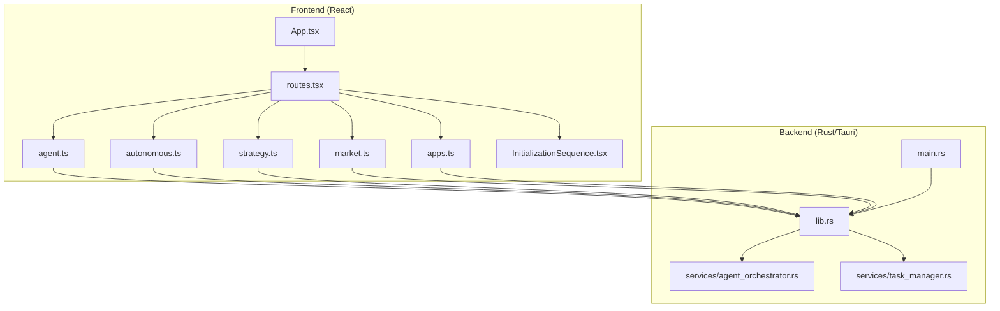
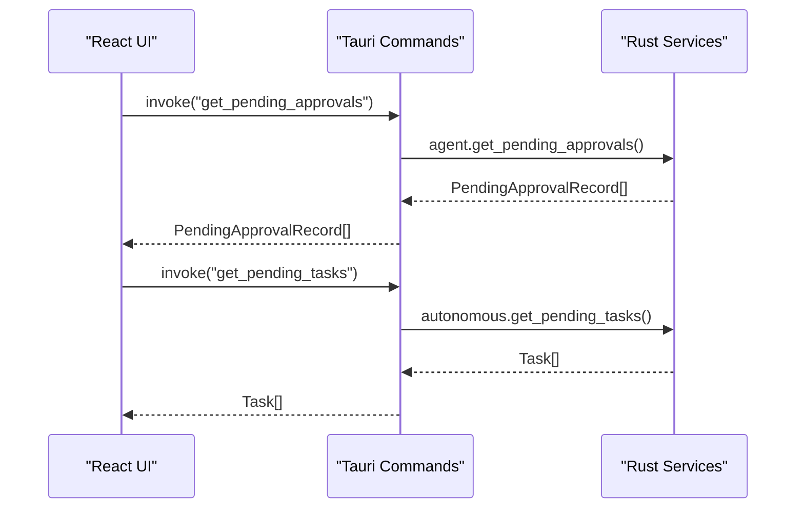
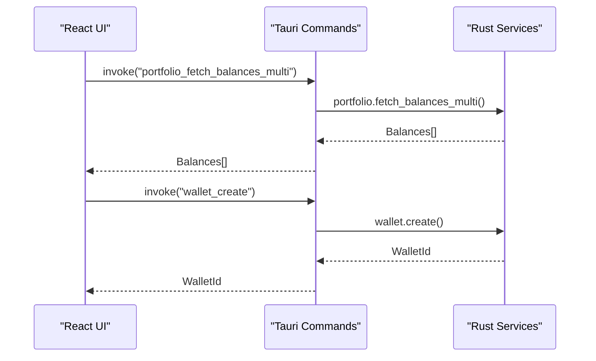
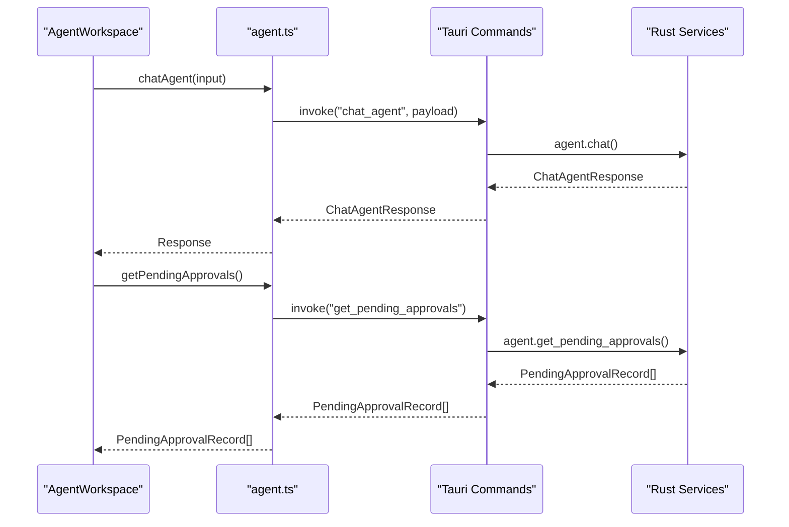
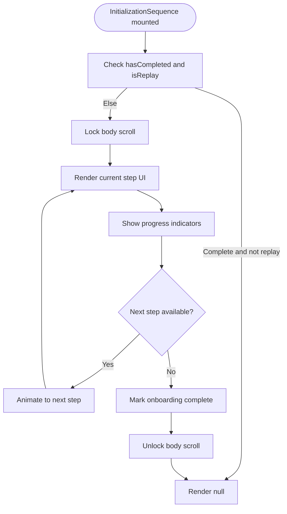
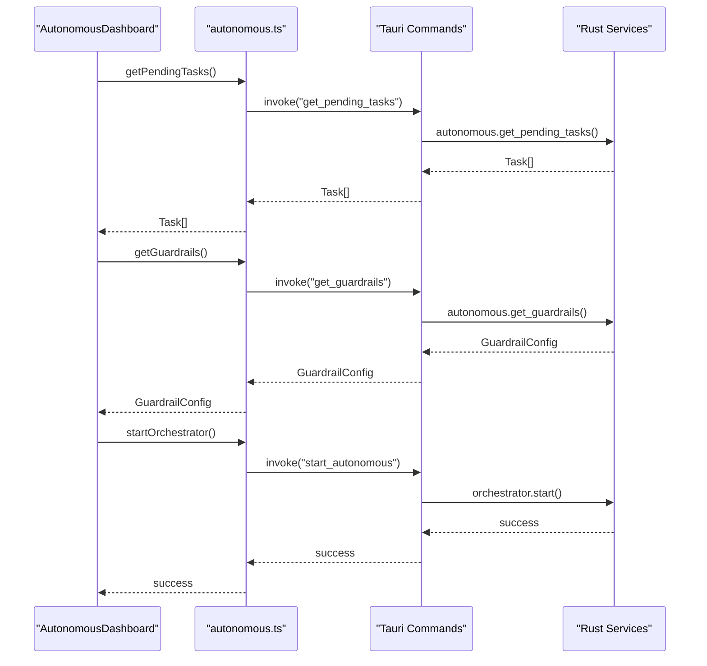
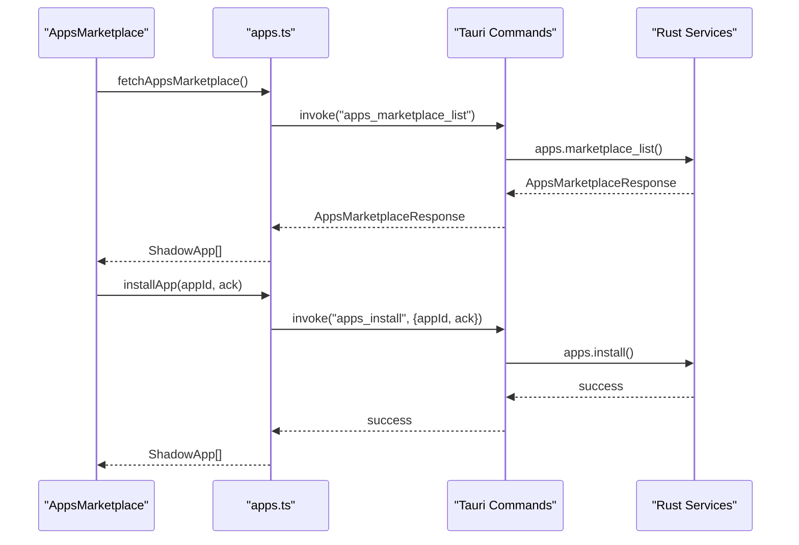
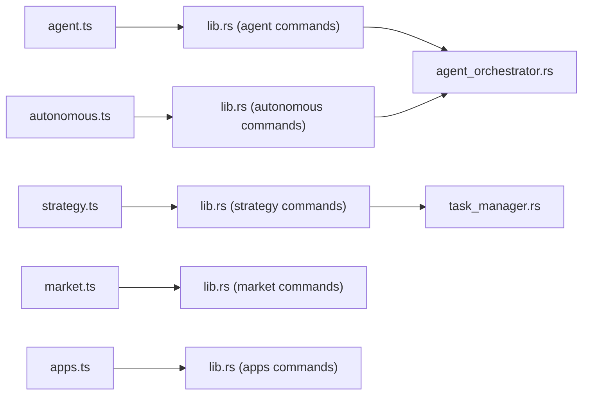

# Development Roadmap & Progress

<cite>
**Referenced Files in This Document**
- [README.md](file://README.md)
- [src/App.tsx](file://src/App.tsx)
- [src/routes.tsx](file://src/routes.tsx)
- [src/lib/agent.ts](file://src/lib/agent.ts)
- [src/lib/autonomous.ts](file://src/lib/autonomous.ts)
- [src/lib/apps.ts](file://src/lib/apps.ts)
- [src/lib/market.ts](file://src/lib/market.ts)
- [src/lib/strategy.ts](file://src/lib/strategy.ts)
- [src/lib/strategyPipeline.ts](file://src/lib/strategyPipeline.ts)
- [src/components/onboarding/InitializationSequence.tsx](file://src/components/onboarding/InitializationSequence.tsx)
- [src-tauri/tauri.conf.json](file://src-tauri/tauri.conf.json)
- [src-tauri/src/lib.rs](file://src-tauri/src/lib.rs)
- [src-tauri/src/main.rs](file://src-tauri/src/main.rs)
- [src-tauri/src/services/agent_orchestrator.rs](file://src-tauri/src/services/agent_orchestrator.rs)
- [src-tauri/src/services/task_manager.rs](file://src-tauri/src/services/task_manager.rs)
</cite>

## Table of Contents
1. [Introduction](#introduction)
2. [Project Structure](#project-structure)
3. [Core Components](#core-components)
4. [Architecture Overview](#architecture-overview)
5. [Detailed Component Analysis](#detailed-component-analysis)
6. [Dependency Analysis](#dependency-analysis)
7. [Performance Considerations](#performance-considerations)
8. [Troubleshooting Guide](#troubleshooting-guide)
9. [Conclusion](#conclusion)
10. [Appendices](#appendices)

## Introduction
This document presents SHADOW Protocol’s development roadmap and progress using the codebase’s own terminology and implementation markers. The project follows a phased approach:
- Phase 1: Genesis — multi-chain portfolio tracking and secure wallet management
- Phase 2: Intelligence — local AI agent integration
- Phase 3: Onboarding — immersive Eclipse initialization sequence
- Upcoming Phases:
  - Phase 4: Autonomy — background DCA and automated portfolio rebalancing
  - Phase 5: Ecosystem — strategy marketplace and Tauri-powered mobile support

The document provides conceptual overviews for newcomers and technical details for contributors, anchored to actual source files and runtime capabilities.

## Project Structure
SHADOW is a Tauri 2 desktop application with a React + TypeScript frontend and a Rust backend. The frontend exposes modular feature areas behind a single-page app router, while the Rust backend exposes Tauri commands that power services for wallets, portfolio, market, agent, strategy, apps, and autonomous orchestration.

**Diagram sources**
- [src/App.tsx:1-49](file://src/App.tsx#L1-L49)
- [src/routes.tsx:14-32](file://src/routes.tsx#L14-L32)
- [src/lib/agent.ts:14-86](file://src/lib/agent.ts#L14-L86)
- [src/lib/autonomous.ts:17-478](file://src/lib/autonomous.ts#L17-L478)
- [src/lib/strategy.ts:13-218](file://src/lib/strategy.ts#L13-L218)
- [src/lib/market.ts:16-48](file://src/lib/market.ts#L16-L48)
- [src/lib/apps.ts:17-307](file://src/lib/apps.ts#L17-L307)
- [src/components/onboarding/InitializationSequence.tsx:11-115](file://src/components/onboarding/InitializationSequence.tsx#L11-L115)
- [src-tauri/src/main.rs:4-6](file://src-tauri/src/main.rs#L4-L6)
- [src-tauri/src/lib.rs:34-198](file://src-tauri/src/lib.rs#L34-L198)
- [src-tauri/src/services/agent_orchestrator.rs:48-368](file://src-tauri/src/services/agent_orchestrator.rs#L48-L368)
- [src-tauri/src/services/task_manager.rs:177-205](file://src-tauri/src/services/task_manager.rs#L177-L205)

**Section sources**
- [README.md:25-310](file://README.md#L25-L310)
- [src-tauri/tauri.conf.json:1-60](file://src-tauri/tauri.conf.json#L1-L60)

## Core Components
- Wallet Security: OS-backed key storage, biometric unlock, in-memory session caching, and real EVM transfer flows.
- Portfolio Operations: Unified multi-wallet balances, history, allocations, NFTs, transactions, and sync progress.
- Agent Workspace: Conversational DeFi assistant with Ollama-backed models, tool routing, approvals, and execution logs.
- Strategy and Automation: Strategy builder with pipeline UX, simulation, execution history, and an autonomous dashboard for tasks, opportunities, health, and guardrails.
- Apps and Integrations: Marketplace-style app surface and sidecar runtime for Lit, Flow, and Filecoin adapters.

These capabilities are reflected in the current status and planned improvements documented in the repository.

**Section sources**
- [README.md:59-94](file://README.md#L59-L94)
- [README.md:96-132](file://README.md#L96-L132)

## Architecture Overview
The frontend invokes Tauri commands that route to Rust services. Services encapsulate domain logic for portfolio, market, strategy, agent orchestration, and apps. The desktop app is configured for a minimum window size and devtools availability.

**Diagram sources**
- [src/lib/agent.ts:53-57](file://src/lib/agent.ts#L53-L57)
- [src/lib/autonomous.ts:18-86](file://src/lib/autonomous.ts#L18-L86)
- [src-tauri/src/lib.rs:90-190](file://src-tauri/src/lib.rs#L90-L190)

**Section sources**
- [src-tauri/tauri.conf.json:13-31](file://src-tauri/tauri.conf.json#L13-L31)
- [src-tauri/src/lib.rs:34-198](file://src-tauri/src/lib.rs#L34-L198)

## Detailed Component Analysis

### Phase 1: Genesis (Multi-chain Portfolio Tracking and Secure Wallet Management)
- Portfolio tracking: balances, history, allocations, NFTs, transactions, and multi-wallet sync with progress events.
- Wallet management: creation, import, listing, removal; OS keychain storage; biometric unlock; in-memory session cache with expiry and clear-on-exit behavior.
- Real EVM transfer flow is implemented.

Practical examples:
- Portfolio fetch APIs are exposed via Tauri commands and consumed by the frontend.
- Wallet lifecycle commands are registered in the Tauri command handler.

**Diagram sources**
- [src-tauri/src/lib.rs:119-125](file://src-tauri/src/lib.rs#L119-L125)
- [src-tauri/src/lib.rs:99-104](file://src-tauri/src/lib.rs#L99-L104)

**Section sources**
- [README.md:63-78](file://README.md#L63-L78)
- [src-tauri/src/lib.rs:90-190](file://src-tauri/src/lib.rs#L90-L190)

### Phase 2: Intelligence (Local AI Agent Integration)
- Agent chat, tool routing, approvals, and execution logs are integrated via Tauri IPC.
- Ollama status checks, install/start flows, and model management are supported.
- Agent memory and soul persistence are exposed through typed IPC functions.

**Diagram sources**
- [src/lib/agent.ts:14-86](file://src/lib/agent.ts#L14-L86)
- [src-tauri/src/lib.rs:94-98](file://src-tauri/src/lib.rs#L94-L98)

**Section sources**
- [README.md:72-73](file://README.md#L72-L73)
- [src/lib/agent.ts:14-86](file://src/lib/agent.ts#L14-L86)

### Phase 3: Onboarding (Immersive Eclipse Initialization Sequence)
- The initialization sequence renders a 5-step onboarding flow with animated transitions and progress indicators.
- Stores and controls current step, completion state, and replay mode.
- The modal prevents body scroll during onboarding and hides itself when complete (unless replaying).

**Diagram sources**
- [src/components/onboarding/InitializationSequence.tsx:11-115](file://src/components/onboarding/InitializationSequence.tsx#L11-L115)

**Section sources**
- [src/components/onboarding/InitializationSequence.tsx:11-115](file://src/components/onboarding/InitializationSequence.tsx#L11-L115)

### Upcoming Phase 4: Autonomy (Background DCA and Automated Portfolio Rebalancing)
- The autonomous subsystem exposes task management, guardrails, health monitoring, and orchestrator controls.
- Strategies include templates for DCA buy and rebalance-to-target, with configurable guardrails and approval policies.
- The orchestrator loop periodically evaluates health, scans opportunities, and generates tasks subject to guardrails and limits.

**Diagram sources**
- [src/lib/autonomous.ts:18-478](file://src/lib/autonomous.ts#L18-L478)
- [src-tauri/src/lib.rs:174-189](file://src-tauri/src/lib.rs#L174-L189)
- [src-tauri/src/services/agent_orchestrator.rs:48-368](file://src-tauri/src/services/agent_orchestrator.rs#L48-L368)

**Section sources**
- [src/lib/strategy.ts:13-172](file://src/lib/strategy.ts#L13-L172)
- [src/lib/strategyPipeline.ts:8-39](file://src/lib/strategyPipeline.ts#L8-L39)
- [src-tauri/src/services/agent_orchestrator.rs:150-368](file://src-tauri/src/services/agent_orchestrator.rs#L150-L368)
- [src-tauri/src/services/task_manager.rs:177-205](file://src-tauri/src/services/task_manager.rs#L177-L205)

### Upcoming Phase 5: Ecosystem (Strategy Marketplace and Tauri-powered Mobile Support)
- Strategy marketplace APIs expose listing, installation, configuration, and backup operations for apps.
- Tauri configuration enables bundling resources and targeting multiple platforms, including mobile.

**Diagram sources**
- [src/lib/apps.ts:228-241](file://src/lib/apps.ts#L228-L241)
- [src-tauri/src/lib.rs:158-173](file://src-tauri/src/lib.rs#L158-L173)

**Section sources**
- [src/lib/apps.ts:17-307](file://src/lib/apps.ts#L17-L307)
- [src-tauri/tauri.conf.json:36-57](file://src-tauri/tauri.conf.json#L36-L57)

## Dependency Analysis
- Frontend-to-backend IPC: All feature areas invoke Tauri commands defined in the Rust command handler.
- Backend services: Portfolio, market, agent, strategy, apps, and autonomous orchestration are wired into the Tauri command set.
- Runtime and platform: Tauri 2 with Rust backend; mobile targets are declared in configuration.

**Diagram sources**
- [src-tauri/src/lib.rs:90-190](file://src-tauri/src/lib.rs#L90-L190)
- [src-tauri/src/services/agent_orchestrator.rs:48-368](file://src-tauri/src/services/agent_orchestrator.rs#L48-L368)
- [src-tauri/src/services/task_manager.rs:177-205](file://src-tauri/src/services/task_manager.rs#L177-L205)

**Section sources**
- [src-tauri/src/lib.rs:90-190](file://src-tauri/src/lib.rs#L90-L190)

## Performance Considerations
- Keep IPC calls coarse-grained and avoid excessive polling; leverage backend-driven intervals for periodic tasks.
- Cache frequently accessed data in the frontend stores and invalidate on backend events.
- Guardrails and orchestrator limits prevent overload; tune thresholds based on user profiles and portfolio size.

[No sources needed since this section provides general guidance]

## Troubleshooting Guide
- Devtools inspection: Right-click triggers a developer context menu when Tauri runtime is present and developer mode is enabled.
- Tauri configuration: CSP and resource bundling affect external connectivity and asset loading.
- Strategy and approval logic: Tighten validation and test coverage as outlined in the roadmap snapshot.

**Section sources**
- [src/App.tsx:13-32](file://src/App.tsx#L13-L32)
- [src-tauri/tauri.conf.json:32-34](file://src-tauri/tauri.conf.json#L32-L34)
- [README.md:297-304](file://README.md#L297-L304)

## Conclusion
SHADOW Protocol’s roadmap is grounded in working features: secure wallet management, portfolio tracking, local AI agent assistance, and an emerging autonomous orchestration layer. The upcoming phases focus on deepening end-to-end DeFi execution, expanding autonomous task execution and recovery, strengthening strategy validation, and introducing a marketplace and mobile support through Tauri.

[No sources needed since this section summarizes without analyzing specific files]

## Appendices

### Practical Milestones and Priorities
- Completed:
  - Real EVM transfer flow
  - Multi-wallet portfolio sync with progress events
  - Agent chat, tool routing, approvals, and execution logs
  - Ollama status checks and model management
  - Strategy drafting, validation, simulation, and management commands
  - Apps/integrations surfaces for Lit, Flow, and Filecoin adapters
  - Autonomous dashboard, guardrails, task queue, and orchestrator controls
- In Progress / Partial:
  - Swap and bridge flows
  - Autonomous execution after approval
  - Some health/orchestrator analysis paths
  - Strategy execution beyond approval-preview style flows
- Planned:
  - Deeper end-to-end DeFi execution support
  - More complete autonomous execution loops
  - Broader chain and integration coverage
  - Stronger production packaging and release workflows

**Section sources**
- [README.md:63-94](file://README.md#L63-L94)
- [README.md:297-304](file://README.md#L297-L304)