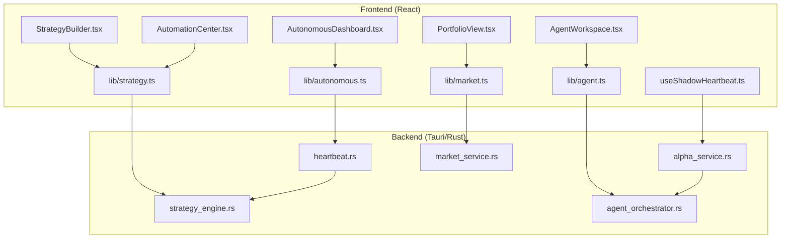
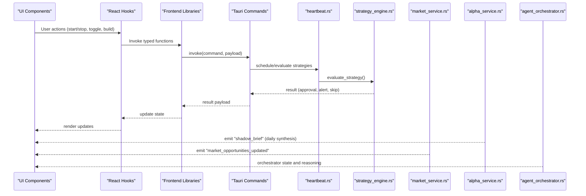
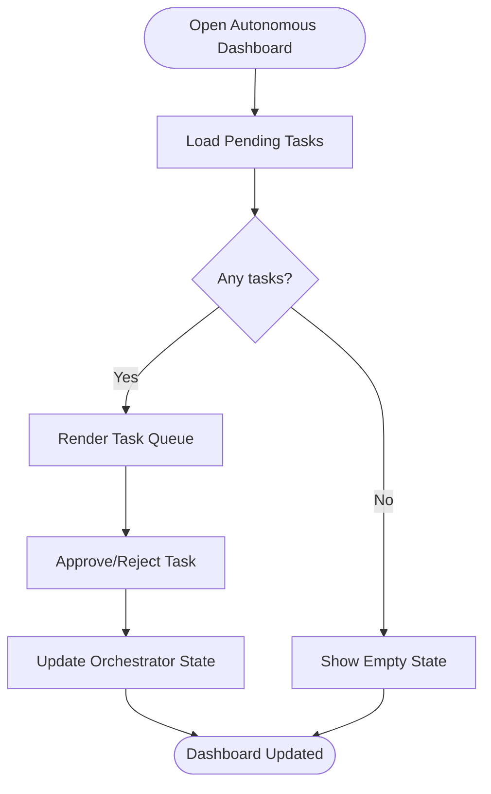
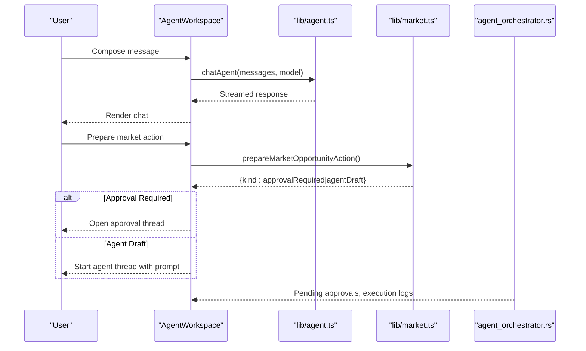
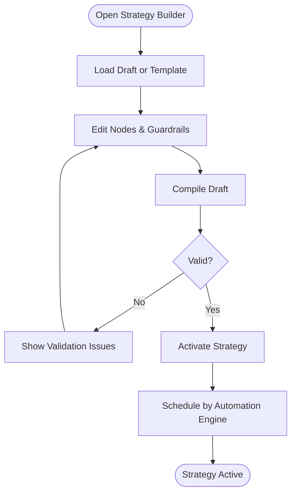
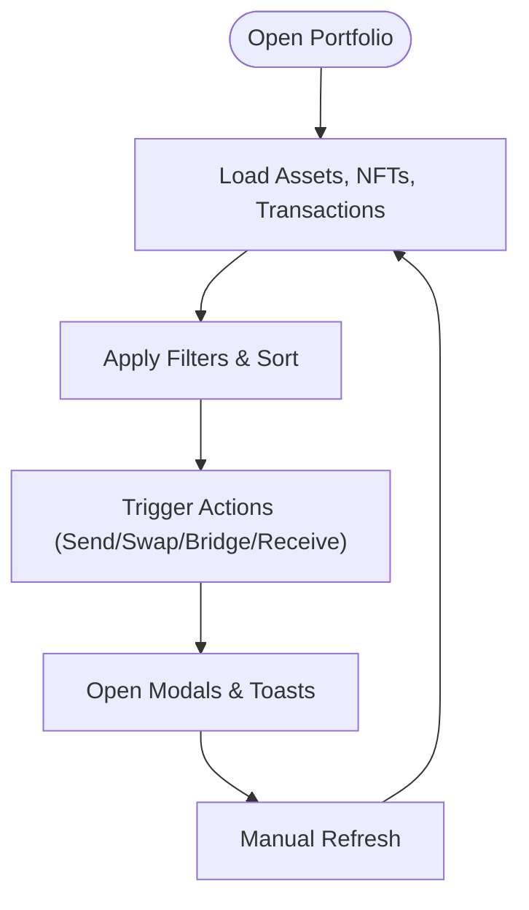
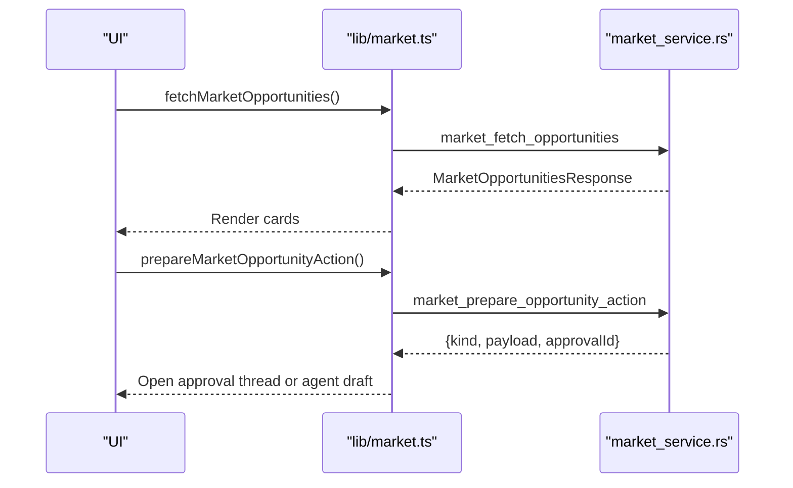
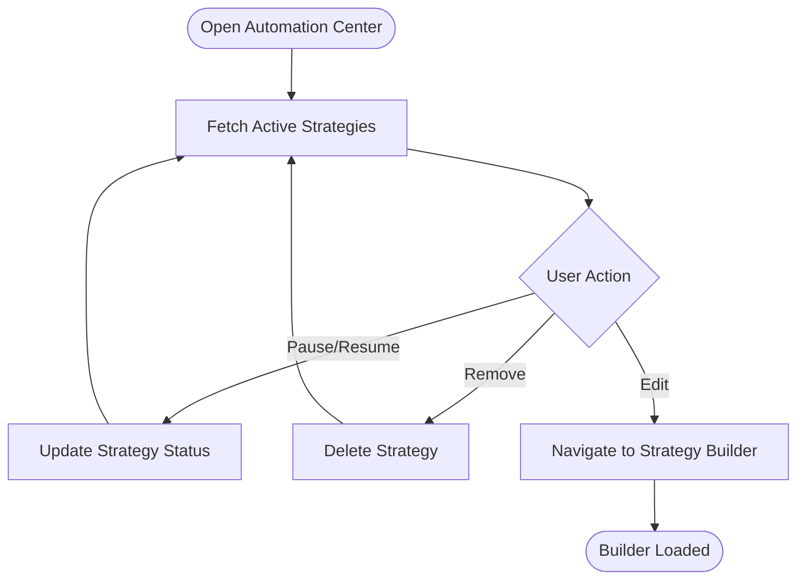
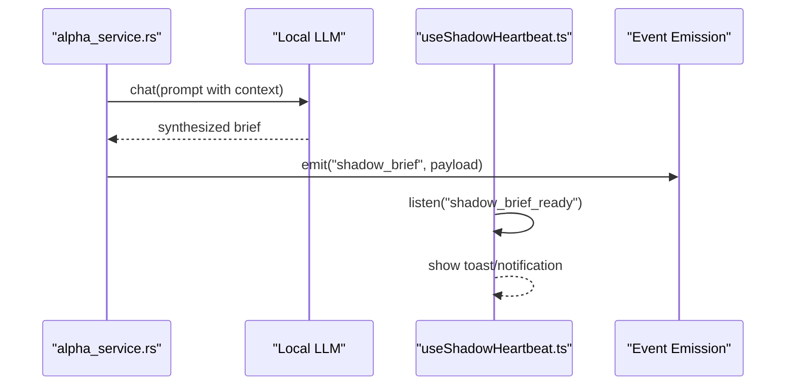
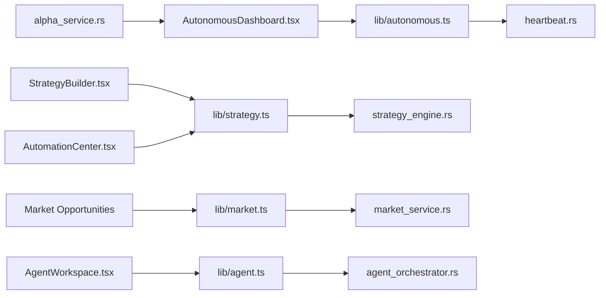

# Key Features & Capabilities

<cite>
**Referenced Files in This Document**
- [src/components/autonomous/AutonomousDashboard.tsx](file://src/components/autonomous/AutonomousDashboard.tsx)
- [src/components/agent/AgentWorkspace.tsx](file://src/components/agent/AgentWorkspace.tsx)
- [src/components/strategy/StrategyBuilder.tsx](file://src/components/strategy/StrategyBuilder.tsx)
- [src/components/portfolio/PortfolioView.tsx](file://src/components/portfolio/PortfolioView.tsx)
- [src/components/automation/AutomationCenter.tsx](file://src/components/automation/AutomationCenter.tsx)
- [src/hooks/useShadowHeartbeat.ts](file://src/hooks/useShadowHeartbeat.ts)
- [src/lib/autonomous.ts](file://src/lib/autonomous.ts)
- [src/lib/strategy.ts](file://src/lib/strategy.ts)
- [src/lib/market.ts](file://src/lib/market.ts)
- [src/lib/agent.ts](file://src/lib/agent.ts)
- [src-tauri/src/services/heartbeat.rs](file://src-tauri/src/services/heartbeat.rs)
- [src-tauri/src/services/alpha_service.rs](file://src-tauri/src/services/alpha_service.rs)
- [src-tauri/src/services/strategy_engine.rs](file://src-tauri/src/services/strategy_engine.rs)
- [src-tauri/src/services/market_service.rs](file://src-tauri/src/services/market_service.rs)
- [src-tauri/src/services/agent_orchestrator.rs](file://src-tauri/src/services/agent_orchestrator.rs)
</cite>

## Table of Contents
1. [Introduction](#introduction)
2. [Project Structure](#project-structure)
3. [Core Components](#core-components)
4. [Architecture Overview](#architecture-overview)
5. [Detailed Component Analysis](#detailed-component-analysis)
6. [Dependency Analysis](#dependency-analysis)
7. [Performance Considerations](#performance-considerations)
8. [Troubleshooting Guide](#troubleshooting-guide)
9. [Conclusion](#conclusion)

## Introduction
This document presents SHADOW Protocol’s key features and capabilities for both newcomers and experienced developers. It focuses on:
- Autonomous Dashboard for 24/7 background strategy execution
- AI Agent Workspace with thread-based conversations and approval workflows
- Visual Strategy Builder with drag-and-drop composition
- Multi-chain Portfolio Management with a unified interface
- Local AI Intelligence with privacy-first analysis
- Secure Wallet Management with OS-level key storage
- Market Opportunities Discovery
- Automation Center for background task scheduling

Each feature is explained with conceptual overviews, technical implementation details, and practical integration patterns aligned to the codebase.

## Project Structure
SHADOW Protocol is a React + Tauri application. The frontend exposes UI components and hooks, while the Rust backend implements long-running services for autonomous orchestration, market discovery, strategy execution, and agent coordination.

**Diagram sources**
- [src/components/autonomous/AutonomousDashboard.tsx:1-84](file://src/components/autonomous/AutonomousDashboard.tsx#L1-L84)
- [src/components/agent/AgentWorkspace.tsx:1-65](file://src/components/agent/AgentWorkspace.tsx#L1-L65)
- [src/components/strategy/StrategyBuilder.tsx:1-287](file://src/components/strategy/StrategyBuilder.tsx#L1-L287)
- [src/components/portfolio/PortfolioView.tsx:1-301](file://src/components/portfolio/PortfolioView.tsx#L1-L301)
- [src/components/automation/AutomationCenter.tsx:1-268](file://src/components/automation/AutomationCenter.tsx#L1-L268)
- [src/hooks/useShadowHeartbeat.ts:1-41](file://src/hooks/useShadowHeartbeat.ts#L1-L41)
- [src/lib/autonomous.ts:1-478](file://src/lib/autonomous.ts#L1-L478)
- [src/lib/strategy.ts:1-218](file://src/lib/strategy.ts#L1-L218)
- [src/lib/market.ts:1-135](file://src/lib/market.ts#L1-L135)
- [src/lib/agent.ts:1-86](file://src/lib/agent.ts#L1-L86)
- [src-tauri/src/services/heartbeat.rs:1-75](file://src-tauri/src/services/heartbeat.rs#L1-L75)
- [src-tauri/src/services/alpha_service.rs:1-143](file://src-tauri/src/services/alpha_service.rs#L1-L143)
- [src-tauri/src/services/strategy_engine.rs:1-726](file://src-tauri/src/services/strategy_engine.rs#L1-L726)
- [src-tauri/src/services/market_service.rs:1-745](file://src-tauri/src/services/market_service.rs#L1-L745)
- [src-tauri/src/services/agent_orchestrator.rs:1-571](file://src-tauri/src/services/agent_orchestrator.rs#L1-L571)

**Section sources**
- [src/components/autonomous/AutonomousDashboard.tsx:1-84](file://src/components/autonomous/AutonomousDashboard.tsx#L1-L84)
- [src/components/agent/AgentWorkspace.tsx:1-65](file://src/components/agent/AgentWorkspace.tsx#L1-L65)
- [src/components/strategy/StrategyBuilder.tsx:1-287](file://src/components/strategy/StrategyBuilder.tsx#L1-L287)
- [src/components/portfolio/PortfolioView.tsx:1-301](file://src/components/portfolio/PortfolioView.tsx#L1-L301)
- [src/components/automation/AutomationCenter.tsx:1-268](file://src/components/automation/AutomationCenter.tsx#L1-L268)
- [src/hooks/useShadowHeartbeat.ts:1-41](file://src/hooks/useShadowHeartbeat.ts#L1-L41)
- [src/lib/autonomous.ts:1-478](file://src/lib/autonomous.ts#L1-L478)
- [src/lib/strategy.ts:1-218](file://src/lib/strategy.ts#L1-L218)
- [src/lib/market.ts:1-135](file://src/lib/market.ts#L1-L135)
- [src/lib/agent.ts:1-86](file://src/lib/agent.ts#L1-L86)
- [src-tauri/src/services/heartbeat.rs:1-75](file://src-tauri/src/services/heartbeat.rs#L1-L75)
- [src-tauri/src/services/alpha_service.rs:1-143](file://src-tauri/src/services/alpha_service.rs#L1-L143)
- [src-tauri/src/services/strategy_engine.rs:1-726](file://src-tauri/src/services/strategy_engine.rs#L1-L726)
- [src-tauri/src/services/market_service.rs:1-745](file://src-tauri/src/services/market_service.rs#L1-L745)
- [src-tauri/src/services/agent_orchestrator.rs:1-571](file://src-tauri/src/services/agent_orchestrator.rs#L1-L571)

## Core Components
- Autonomous Dashboard: Central hub for tasks, health, opportunities, guardrails, and orchestrator control.
- AI Agent Workspace: Threaded chat with approval workflows and tool integrations.
- Strategy Builder: Visual, drag-and-drop builder for composing automation strategies with guardrails and preview.
- Portfolio View: Unified multi-chain portfolio with assets, NFTs, transactions, and smart opportunities.
- Market Opportunities: Discovery and preparation of actionable opportunities with agent-ready drafts and approval flows.
- Automation Center: Lifecycle management of active strategies, activity logs, and scheduling.
- Local AI Intelligence: Daily “Shadow Brief” synthesis and emissions via the Shadow Heartbeat.
- Secure Wallet Management: OS-backed key storage and session controls integrated with UI flows.

**Section sources**
- [src/components/autonomous/AutonomousDashboard.tsx:1-84](file://src/components/autonomous/AutonomousDashboard.tsx#L1-L84)
- [src/components/agent/AgentWorkspace.tsx:1-65](file://src/components/agent/AgentWorkspace.tsx#L1-L65)
- [src/components/strategy/StrategyBuilder.tsx:1-287](file://src/components/strategy/StrategyBuilder.tsx#L1-L287)
- [src/components/portfolio/PortfolioView.tsx:1-301](file://src/components/portfolio/PortfolioView.tsx#L1-L301)
- [src/components/automation/AutomationCenter.tsx:1-268](file://src/components/automation/AutomationCenter.tsx#L1-L268)
- [src/hooks/useShadowHeartbeat.ts:1-41](file://src/hooks/useShadowHeartbeat.ts#L1-L41)
- [src/lib/autonomous.ts:1-478](file://src/lib/autonomous.ts#L1-L478)
- [src/lib/strategy.ts:1-218](file://src/lib/strategy.ts#L1-L218)
- [src/lib/market.ts:1-135](file://src/lib/market.ts#L1-L135)
- [src/lib/agent.ts:1-86](file://src/lib/agent.ts#L1-L86)

## Architecture Overview
SHADOW Protocol’s runtime combines a React frontend with Tauri commands invoking Rust services. The backend runs continuous services for heartbeat scheduling, strategy evaluation, market discovery, and agent orchestration. The frontend consumes typed APIs and emits UI events.

**Diagram sources**
- [src/lib/autonomous.ts:1-478](file://src/lib/autonomous.ts#L1-L478)
- [src/lib/strategy.ts:1-218](file://src/lib/strategy.ts#L1-L218)
- [src/lib/market.ts:1-135](file://src/lib/market.ts#L1-L135)
- [src/lib/agent.ts:1-86](file://src/lib/agent.ts#L1-L86)
- [src-tauri/src/services/heartbeat.rs:1-75](file://src-tauri/src/services/heartbeat.rs#L1-L75)
- [src-tauri/src/services/strategy_engine.rs:1-726](file://src-tauri/src/services/strategy_engine.rs#L1-L726)
- [src-tauri/src/services/market_service.rs:1-745](file://src-tauri/src/services/market_service.rs#L1-L745)
- [src-tauri/src/services/alpha_service.rs:1-143](file://src-tauri/src/services/alpha_service.rs#L1-L143)
- [src-tauri/src/services/agent_orchestrator.rs:1-571](file://src-tauri/src/services/agent_orchestrator.rs#L1-L571)

## Detailed Component Analysis

### Autonomous Dashboard
- Purpose: 24/7 autonomous agent operations with task queue, health monitoring, opportunity feed, guardrails, and orchestrator control.
- Key UI areas:
  - Tasks tab: pending tasks with reasoning and suggested actions.
  - Health tab: portfolio health scores and alerts.
  - Opportunities tab: curated opportunities with match scores and recommended actions.
  - Guardrails tab: configure spend limits, slippage, and kill switches.
  - Control sidebar: start/stop orchestrator and inspect state.
- Backend integration:
  - Fetches tasks, health, opportunities, and orchestrator state via typed libraries.
  - Uses Shadow Heartbeat to surface “Shadow Brief” notifications.

**Diagram sources**
- [src/components/autonomous/AutonomousDashboard.tsx:1-84](file://src/components/autonomous/AutonomousDashboard.tsx#L1-L84)
- [src/lib/autonomous.ts:1-478](file://src/lib/autonomous.ts#L1-L478)
- [src/hooks/useShadowHeartbeat.ts:1-41](file://src/hooks/useShadowHeartbeat.ts#L1-L41)

**Section sources**
- [src/components/autonomous/AutonomousDashboard.tsx:1-84](file://src/components/autonomous/AutonomousDashboard.tsx#L1-L84)
- [src/lib/autonomous.ts:1-478](file://src/lib/autonomous.ts#L1-L478)
- [src/hooks/useShadowHeartbeat.ts:1-41](file://src/hooks/useShadowHeartbeat.ts#L1-L41)

### AI Agent Workspace
- Purpose: Threaded conversation with the agent, approval requests, and tool execution previews.
- Key UI areas:
  - Thread sidebar: list and manage conversations.
  - Chat area: send messages, receive agent responses, and see tool results.
  - Mobile drawer: responsive thread navigation.
- Backend integration:
  - Chat agent, approve/reject actions, and pending approvals are exposed via typed libraries.
  - Market preparation can open approval threads or agent drafts.

**Diagram sources**
- [src/components/agent/AgentWorkspace.tsx:1-65](file://src/components/agent/AgentWorkspace.tsx#L1-L65)
- [src/lib/agent.ts:1-86](file://src/lib/agent.ts#L1-L86)
- [src/lib/market.ts:1-135](file://src/lib/market.ts#L1-L135)
- [src-tauri/src/services/agent_orchestrator.rs:1-571](file://src-tauri/src/services/agent_orchestrator.rs#L1-L571)

**Section sources**
- [src/components/agent/AgentWorkspace.tsx:1-65](file://src/components/agent/AgentWorkspace.tsx#L1-L65)
- [src/lib/agent.ts:1-86](file://src/lib/agent.ts#L1-L86)
- [src/lib/market.ts:1-135](file://src/lib/market.ts#L1-L135)
- [src-tauri/src/services/agent_orchestrator.rs:1-571](file://src-tauri/src/services/agent_orchestrator.rs#L1-L571)

### Visual Strategy Builder
- Purpose: Drag-and-drop builder for composing triggers, conditions, and actions with guardrails and live preview.
- Key UI areas:
  - Canvas: nodes for triggers, conditions, actions; drag-and-drop repositioning.
  - Inspector: per-node editing and validation.
  - Safety panel: guardrails configuration and validation feedback.
  - Simulation strip: compile status and preview.
- Backend integration:
  - Draft creation, compilation, activation, and execution history retrieval via typed libraries.
  - Strategy templates and default guardrails preconfigured.

**Diagram sources**
- [src/components/strategy/StrategyBuilder.tsx:1-287](file://src/components/strategy/StrategyBuilder.tsx#L1-L287)
- [src/lib/strategy.ts:1-218](file://src/lib/strategy.ts#L1-L218)

**Section sources**
- [src/components/strategy/StrategyBuilder.tsx:1-287](file://src/components/strategy/StrategyBuilder.tsx#L1-L287)
- [src/lib/strategy.ts:1-218](file://src/lib/strategy.ts#L1-L218)

### Multi-chain Portfolio Management
- Purpose: Unified view across chains, assets, NFTs, and transactions with smart opportunities and actions.
- Key UI areas:
  - Hero summary: total value, daily change, chain distribution.
  - Filters: chain, type, sort; developer mode toggles testnet visibility.
  - Tabs: tokens, NFTs, transactions.
  - Action modals: send, swap, bridge, receive.
- Backend integration:
  - Portfolio aggregation, NFTs, transactions, and smart opportunities via hooks and stores.
  - Wallet selector and session unlock dialogs.

**Diagram sources**
- [src/components/portfolio/PortfolioView.tsx:1-301](file://src/components/portfolio/PortfolioView.tsx#L1-L301)

**Section sources**
- [src/components/portfolio/PortfolioView.tsx:1-301](file://src/components/portfolio/PortfolioView.tsx#L1-L301)

### Market Opportunities Discovery
- Purpose: Discover, rank, and act on yield, spread watch, rebalance, and catalyst opportunities.
- Key UI areas:
  - Opportunity cards with category, chain, risk, score, and actionability.
  - Detail sheet with sources, ranking breakdown, and guardrail notes.
  - Preparation pipeline: approval-required, agent-draft, or detail-only.
- Backend integration:
  - Fetch and refresh opportunities, get details, and prepare actions via typed libraries.
  - Continuous refresh cycles and caching with staleness checks.

**Diagram sources**
- [src/lib/market.ts:1-135](file://src/lib/market.ts#L1-L135)
- [src-tauri/src/services/market_service.rs:1-745](file://src-tauri/src/services/market_service.rs#L1-L745)

**Section sources**
- [src/lib/market.ts:1-135](file://src/lib/market.ts#L1-L135)
- [src-tauri/src/services/market_service.rs:1-745](file://src-tauri/src/services/market_service.rs#L1-L745)

### Automation Center
- Purpose: Manage active strategies, pause/resume, remove, and review recent runs.
- Key UI areas:
  - Strategies tab: cards with status, edit/remove, pause/resume.
  - Activity tab: recent execution history with timestamps and reasons.
  - Builder shortcut and create button.
- Backend integration:
  - Fetch strategies, update status, delete strategies, and read execution history via typed libraries.
  - Uses Tauri runtime detection for native features.

**Diagram sources**
- [src/components/automation/AutomationCenter.tsx:1-268](file://src/components/automation/AutomationCenter.tsx#L1-L268)
- [src/lib/strategy.ts:1-218](file://src/lib/strategy.ts#L1-L218)

**Section sources**
- [src/components/automation/AutomationCenter.tsx:1-268](file://src/components/automation/AutomationCenter.tsx#L1-L268)
- [src/lib/strategy.ts:1-218](file://src/lib/strategy.ts#L1-L218)

### Local AI Intelligence and Shadow Heartbeat
- Purpose: Daily synthesis of market alpha and opportunity highlights with privacy-first local processing.
- Key UI integration:
  - “Shadow Brief” notifications delivered via the Shadow Heartbeat hook.
- Backend services:
  - Alpha service runs a daily cycle, synthesizes with local LLM, and emits a structured brief.
  - Heartbeat service schedules periodic strategy evaluations and job runs.

**Diagram sources**
- [src-tauri/src/services/alpha_service.rs:1-143](file://src-tauri/src/services/alpha_service.rs#L1-L143)
- [src/hooks/useShadowHeartbeat.ts:1-41](file://src/hooks/useShadowHeartbeat.ts#L1-L41)

**Section sources**
- [src-tauri/src/services/alpha_service.rs:1-143](file://src-tauri/src/services/alpha_service.rs#L1-L143)
- [src/hooks/useShadowHeartbeat.ts:1-41](file://src/hooks/useShadowHeartbeat.ts#L1-L41)

### Secure Wallet Management
- Purpose: OS-level key storage and session controls for secure wallet operations.
- Integration patterns:
  - Wallet list, unlock dialog, and session indicators integrate with UI flows.
  - Portfolio actions (send, swap, bridge) gate on unlocked sessions and show success notifications.

**Section sources**
- [src/components/portfolio/PortfolioView.tsx:1-301](file://src/components/portfolio/PortfolioView.tsx#L1-L301)

## Dependency Analysis
The frontend depends on typed libraries that wrap Tauri commands. The backend services coordinate via events and shared state.

**Diagram sources**
- [src/components/autonomous/AutonomousDashboard.tsx:1-84](file://src/components/autonomous/AutonomousDashboard.tsx#L1-L84)
- [src/components/strategy/StrategyBuilder.tsx:1-287](file://src/components/strategy/StrategyBuilder.tsx#L1-L287)
- [src/components/automation/AutomationCenter.tsx:1-268](file://src/components/automation/AutomationCenter.tsx#L1-L268)
- [src/components/agent/AgentWorkspace.tsx:1-65](file://src/components/agent/AgentWorkspace.tsx#L1-L65)
- [src/lib/autonomous.ts:1-478](file://src/lib/autonomous.ts#L1-L478)
- [src/lib/strategy.ts:1-218](file://src/lib/strategy.ts#L1-L218)
- [src/lib/market.ts:1-135](file://src/lib/market.ts#L1-L135)
- [src/lib/agent.ts:1-86](file://src/lib/agent.ts#L1-L86)
- [src-tauri/src/services/heartbeat.rs:1-75](file://src-tauri/src/services/heartbeat.rs#L1-L75)
- [src-tauri/src/services/strategy_engine.rs:1-726](file://src-tauri/src/services/strategy_engine.rs#L1-L726)
- [src-tauri/src/services/market_service.rs:1-745](file://src-tauri/src/services/market_service.rs#L1-L745)
- [src-tauri/src/services/agent_orchestrator.rs:1-571](file://src-tauri/src/services/agent_orchestrator.rs#L1-L571)
- [src-tauri/src/services/alpha_service.rs:1-143](file://src-tauri/src/services/alpha_service.rs#L1-L143)

**Section sources**
- [src/lib/autonomous.ts:1-478](file://src/lib/autonomous.ts#L1-L478)
- [src/lib/strategy.ts:1-218](file://src/lib/strategy.ts#L1-L218)
- [src/lib/market.ts:1-135](file://src/lib/market.ts#L1-L135)
- [src/lib/agent.ts:1-86](file://src/lib/agent.ts#L1-L86)
- [src-tauri/src/services/heartbeat.rs:1-75](file://src-tauri/src/services/heartbeat.rs#L1-L75)
- [src-tauri/src/services/strategy_engine.rs:1-726](file://src-tauri/src/services/strategy_engine.rs#L1-L726)
- [src-tauri/src/services/market_service.rs:1-745](file://src-tauri/src/services/market_service.rs#L1-L745)
- [src-tauri/src/services/agent_orchestrator.rs:1-571](file://src-tauri/src/services/agent_orchestrator.rs#L1-L571)
- [src-tauri/src/services/alpha_service.rs:1-143](file://src-tauri/src/services/alpha_service.rs#L1-L143)

## Performance Considerations
- Frontend rendering:
  - Use skeleton loaders during async data fetches (strategy builder, portfolio).
  - Debounce filters and sorting to avoid excessive re-renders.
- Backend scheduling:
  - Heartbeat intervals and strategy evaluation windows prevent thrashing.
  - Staleness checks and cached results reduce redundant network calls.
- Local AI:
  - Alpha synthesis runs on a daily cadence; ensure model availability and minimal overhead.
- Guardrails:
  - Normalize and validate guardrails early to short-circuit expensive operations.

[No sources needed since this section provides general guidance]

## Troubleshooting Guide
- Strategy lifecycle:
  - If a strategy fails repeatedly, it auto-pauses with a recorded reason; resume after adjusting guardrails or templates.
  - Use the Automation Center to inspect recent runs and reasons.
- Approval flows:
  - Pending approvals surface in the agent workspace; ensure approvals are resolved or rejected to keep the pipeline moving.
- Market opportunities:
  - If opportunities appear stale, force-refresh; fallback to cached results is automatic.
- Notifications:
  - Shadow Brief relies on the alpha service and heartbeat; verify local LLM availability and event listeners.

**Section sources**
- [src-tauri/src/services/strategy_engine.rs:1-726](file://src-tauri/src/services/strategy_engine.rs#L1-L726)
- [src-tauri/src/services/heartbeat.rs:1-75](file://src-tauri/src/services/heartbeat.rs#L1-L75)
- [src-tauri/src/services/market_service.rs:1-745](file://src-tauri/src/services/market_service.rs#L1-L745)
- [src/hooks/useShadowHeartbeat.ts:1-41](file://src/hooks/useShadowHeartbeat.ts#L1-L41)

## Conclusion
SHADOW Protocol delivers a cohesive DeFi automation stack:
- Autonomous Dashboard orchestrates tasks, health, and opportunities with guardrails.
- AI Agent Workspace enables conversational automation with approval workflows.
- Strategy Builder makes composing and activating automations visual and safe.
- Portfolio View unifies multi-chain management with actionable insights.
- Market Opportunities discovery integrates with agent-ready flows.
- Automation Center provides lifecycle control for strategies.
- Local AI Intelligence and Shadow Heartbeat deliver privacy-first, on-device insights.
- Secure Wallet Management integrates with OS-level key storage and session controls.

These features combine to support both beginner-friendly automation and advanced developer customization, all grounded in robust backend services and typed frontend integrations.