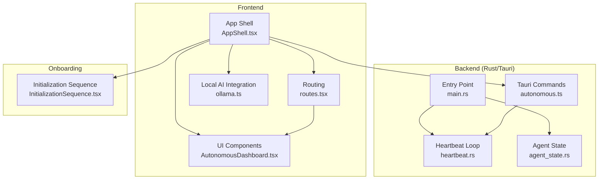
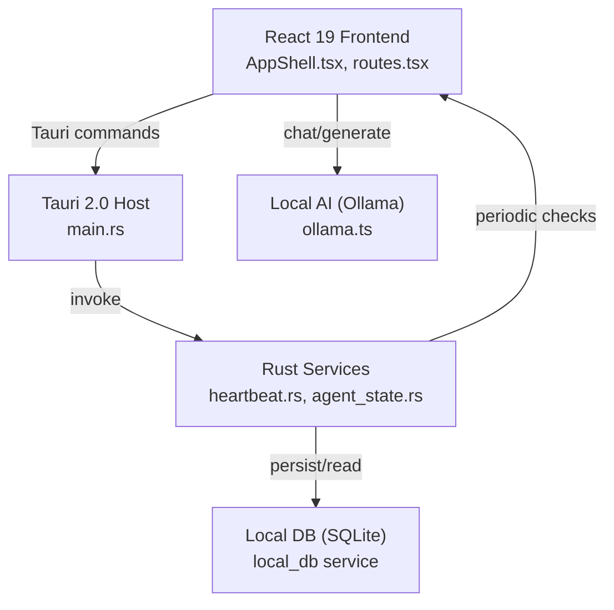
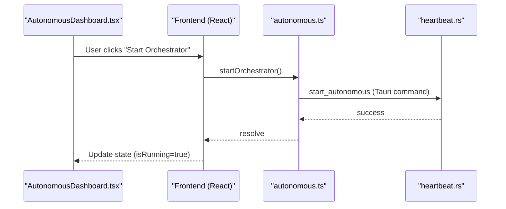
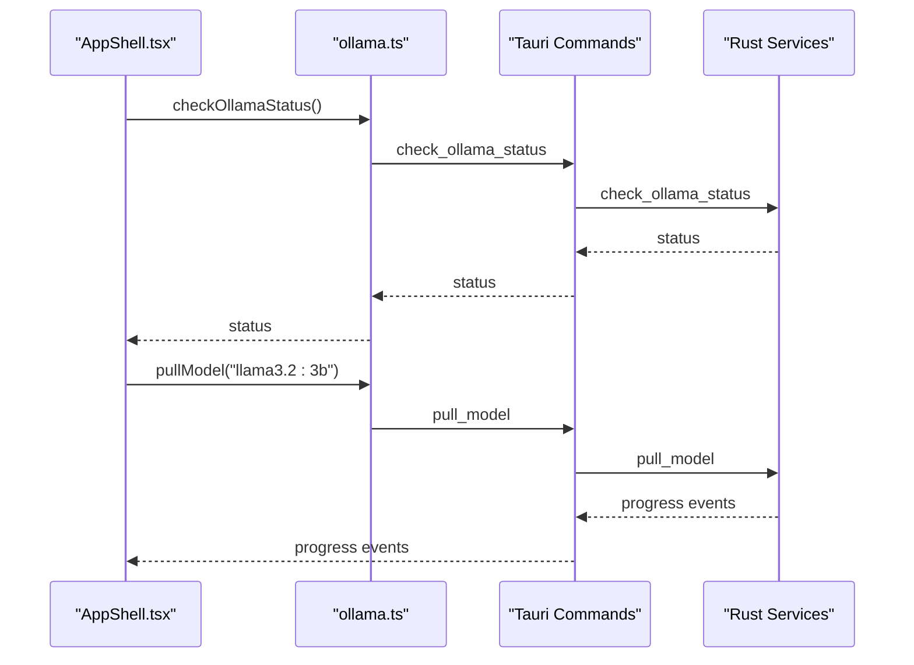
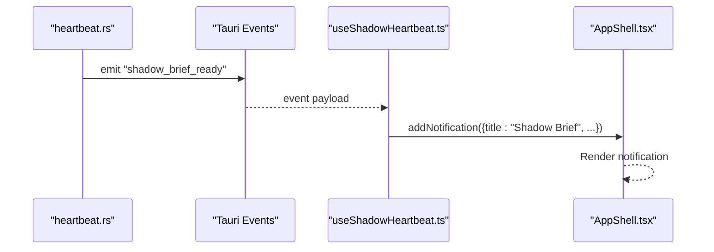
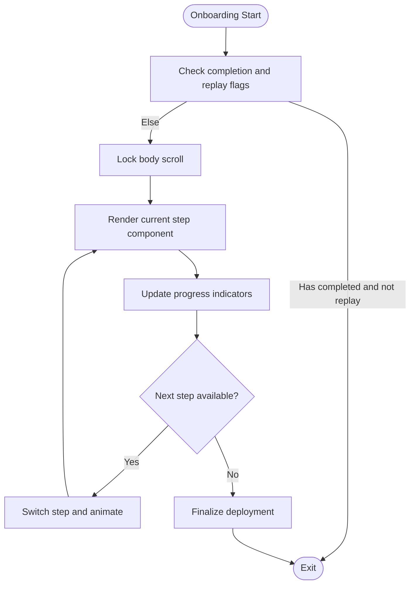
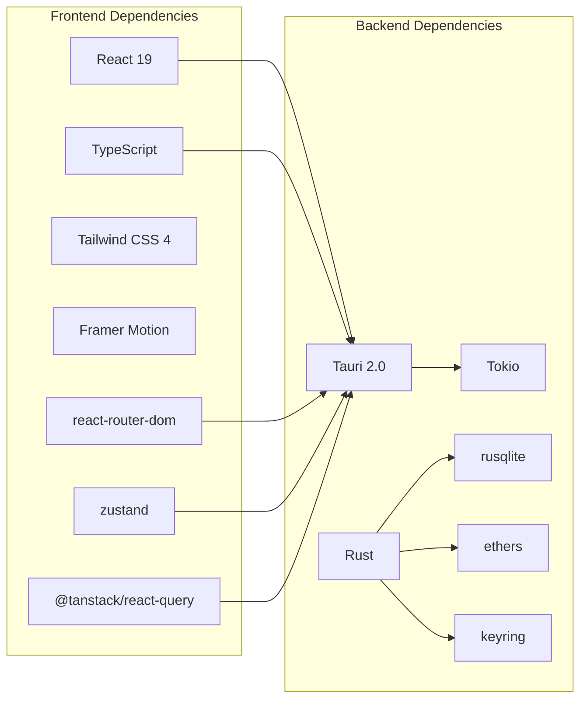

# Project Overview

<cite>
**Referenced Files in This Document**
- [README.md](file://README.md)
- [docs/shadow-protocol.md](file://docs/shadow-protocol.md)
- [package.json](file://package.json)
- [src-tauri/Cargo.toml](file://src-tauri/Cargo.toml)
- [src/App.tsx](file://src/App.tsx)
- [src/routes.tsx](file://src/routes.tsx)
- [src/components/layout/AppShell.tsx](file://src/components/layout/AppShell.tsx)
- [src/components/autonomous/AutonomousDashboard.tsx](file://src/components/autonomous/AutonomousDashboard.tsx)
- [src/hooks/useShadowHeartbeat.ts](file://src/hooks/useShadowHeartbeat.ts)
- [src/lib/autonomous.ts](file://src/lib/autonomous.ts)
- [src/lib/ollama.ts](file://src/lib/ollama.ts)
- [src-tauri/src/main.rs](file://src-tauri/src/main.rs)
- [src-tauri/src/services/heartbeat.rs](file://src-tauri/src/services/heartbeat.rs)
- [src-tauri/src/services/agent_state.rs](file://src-tauri/src/services/agent_state.rs)
- [src/components/onboarding/InitializationSequence.tsx](file://src/components/onboarding/InitializationSequence.tsx)
</cite>

## Table of Contents
1. [Introduction](#introduction)
2. [Project Structure](#project-structure)
3. [Core Components](#core-components)
4. [Architecture Overview](#architecture-overview)
5. [Detailed Component Analysis](#detailed-component-analysis)
6. [Dependency Analysis](#dependency-analysis)
7. [Performance Considerations](#performance-considerations)
8. [Troubleshooting Guide](#troubleshooting-guide)
9. [Conclusion](#conclusion)

## Introduction
SHADOW Protocol is a privacy-first, desktop-native DeFi operations workstation that brings autonomy and control back to users. In a transparent blockchain era, SHADOW ensures that private keys, AI analysis, and automation logic remain on-device, eliminating reliance on cloud services for sensitive operations. The platform’s hybrid edge computing architecture pairs a modern React 19 frontend with a Rust backend powered by Tauri 2.0, enabling secure, high-performance DeFi automation.

At its core, SHADOW is built around four pillars:
- Local AI Intelligence: Private, on-device AI for market analysis and strategy suggestions.
- Sovereign Security: OS-level key storage and privacy controls to keep users in control.
- Multi-Chain Command: Unified cross-chain operations across major networks.
- Background Autonomy: 24/7 background execution via Rust Tokio, even when the UI is closed.

Practical examples of the desktop-native approach include:
- Running autonomous strategies (e.g., DCA, rebalancing) from the system tray.
- Using the “Shadow Heartbeat” to receive periodic briefings without opening the app.
- Executing approvals and transactions with guardrails and minimal UI interaction.

**Section sources**
- [README.md:22-49](file://README.md#L22-L49)
- [docs/shadow-protocol.md:5-11](file://docs/shadow-protocol.md#L5-L11)

## Project Structure
The project follows a clear separation of concerns:
- Frontend (TypeScript/React 19): Provides the Glassmorphic UI, routing, and user interactions.
- Backend (Rust/Tauri 2.0): Implements secure key management, background orchestration, and multi-chain operations.
- Shared integrations: Local AI via Ollama, SQLite-backed persistence, and Tauri commands for native capabilities.

**Diagram sources**
- [src/App.tsx:9-46](file://src/App.tsx#L9-L46)
- [src/routes.tsx:14-32](file://src/routes.tsx#L14-L32)
- [src/components/layout/AppShell.tsx:31-276](file://src/components/layout/AppShell.tsx#L31-L276)
- [src/components/autonomous/AutonomousDashboard.tsx:9-83](file://src/components/autonomous/AutonomousDashboard.tsx#L9-L83)
- [src/lib/ollama.ts:17-40](file://src/lib/ollama.ts#L17-L40)
- [src-tauri/src/main.rs:4-6](file://src-tauri/src/main.rs#L4-L6)
- [src-tauri/src/services/heartbeat.rs:10-74](file://src-tauri/src/services/heartbeat.rs#L10-L74)
- [src-tauri/src/services/agent_state.rs:46-76](file://src-tauri/src/services/agent_state.rs#L46-L76)
- [src/lib/autonomous.ts:18-86](file://src/lib/autonomous.ts#L18-L86)
- [src/components/onboarding/InitializationSequence.tsx:11-52](file://src/components/onboarding/InitializationSequence.tsx#L11-L52)

**Section sources**
- [package.json:18-37](file://package.json#L18-L37)
- [src-tauri/Cargo.toml:20-44](file://src-tauri/Cargo.toml#L20-L44)
- [src/App.tsx:1-49](file://src/App.tsx#L1-L49)
- [src/routes.tsx:1-33](file://src/routes.tsx#L1-L33)
- [src/components/layout/AppShell.tsx:1-277](file://src/components/layout/AppShell.tsx#L1-L277)

## Core Components
- Hybrid Edge Computing: The desktop application leverages Tauri 2.0 to bridge a modern React UI with a Rust backend, ensuring privacy and performance.
- Local AI Intelligence: Ollama integration enables private, on-device inference for market analysis and strategy suggestions.
- Sovereign Security: OS keychain-backed key management and ephemeral signing reduce exposure surfaces.
- Multi-Chain Command: Unified cross-chain operations and portfolio views streamline complex DeFi workflows.
- Background Autonomy: Rust Tokio powers continuous background orchestration, complemented by a “Shadow Heartbeat” for periodic notifications.

**Section sources**
- [README.md:78-86](file://README.md#L78-L86)
- [docs/shadow-protocol.md:87-125](file://docs/shadow-protocol.md#L87-L125)
- [src/lib/ollama.ts:17-40](file://src/lib/ollama.ts#L17-L40)
- [src/lib/autonomous.ts:18-86](file://src/lib/autonomous.ts#L18-L86)
- [src/hooks/useShadowHeartbeat.ts:11-39](file://src/hooks/useShadowHeartbeat.ts#L11-L39)

## Architecture Overview
SHADOW’s architecture centers on a Tauri 2.0 host that exposes controlled commands to the React frontend while the Rust backend manages security-sensitive operations and background tasks.

**Diagram sources**
- [src-tauri/src/main.rs:4-6](file://src-tauri/src/main.rs#L4-L6)
- [src-tauri/src/services/heartbeat.rs:10-74](file://src-tauri/src/services/heartbeat.rs#L10-L74)
- [src-tauri/src/services/agent_state.rs:46-76](file://src-tauri/src/services/agent_state.rs#L46-L76)
- [src/components/layout/AppShell.tsx:31-276](file://src/components/layout/AppShell.tsx#L31-L276)
- [src/lib/ollama.ts:78-109](file://src/lib/ollama.ts#L78-L109)

**Section sources**
- [README.md:78-86](file://README.md#L78-L86)
- [docs/shadow-protocol.md:87-125](file://docs/shadow-protocol.md#L87-L125)

## Detailed Component Analysis

### Autonomous Dashboard and Orchestration
The Autonomous Dashboard aggregates tasks, health metrics, opportunities, and guardrails in a single pane. It exposes controls to start/stop the orchestrator and review recent activity.

**Diagram sources**
- [src/components/autonomous/AutonomousDashboard.tsx:9-83](file://src/components/autonomous/AutonomousDashboard.tsx#L9-L83)
- [src/lib/autonomous.ts:455-477](file://src/lib/autonomous.ts#L455-L477)
- [src-tauri/src/services/heartbeat.rs:10-74](file://src-tauri/src/services/heartbeat.rs#L10-L74)

**Section sources**
- [src/components/autonomous/AutonomousDashboard.tsx:9-83](file://src/components/autonomous/AutonomousDashboard.tsx#L9-L83)
- [src/lib/autonomous.ts:424-477](file://src/lib/autonomous.ts#L424-L477)

### Local AI Intelligence with Ollama
The frontend integrates with Ollama to provide private, on-device AI capabilities. It checks availability, pulls models, streams progress events, and performs chat/generate requests.

**Diagram sources**
- [src/components/layout/AppShell.tsx:81-117](file://src/components/layout/AppShell.tsx#L81-L117)
- [src/lib/ollama.ts:17-40](file://src/lib/ollama.ts#L17-L40)
- [src/lib/ollama.ts:29-31](file://src/lib/ollama.ts#L29-L31)
- [src/lib/ollama.ts:46-56](file://src/lib/ollama.ts#L46-L56)

**Section sources**
- [src/lib/ollama.ts:17-165](file://src/lib/ollama.ts#L17-L165)
- [src/components/layout/AppShell.tsx:81-117](file://src/components/layout/AppShell.tsx#L81-L117)

### Shadow Heartbeat and Notifications
The “Shadow Heartbeat” delivers periodic briefings to the UI via Tauri events, keeping users informed without requiring active engagement.

**Diagram sources**
- [src-tauri/src/services/heartbeat.rs:10-74](file://src-tauri/src/services/heartbeat.rs#L10-L74)
- [src/hooks/useShadowHeartbeat.ts:21-29](file://src/hooks/useShadowHeartbeat.ts#L21-L29)
- [src/components/layout/AppShell.tsx:240-240](file://src/components/layout/AppShell.tsx#L240-L240)

**Section sources**
- [src/hooks/useShadowHeartbeat.ts:11-39](file://src/hooks/useShadowHeartbeat.ts#L11-L39)
- [src-tauri/src/services/heartbeat.rs:10-74](file://src-tauri/src/services/heartbeat.rs#L10-L74)

### Eclipse Initialization Sequence
The “Eclipse” initialization sequence guides users through onboarding, culminating in deployment readiness. It manages step progression, replay modes, and dynamic backgrounds.

**Diagram sources**
- [src/components/onboarding/InitializationSequence.tsx:11-52](file://src/components/onboarding/InitializationSequence.tsx#L11-L52)

**Section sources**
- [src/components/onboarding/InitializationSequence.tsx:1-115](file://src/components/onboarding/InitializationSequence.tsx#L1-L115)

### Conceptual Overview
For beginners, SHADOW is a desktop application that:
- Keeps everything private by running on your machine.
- Lets you automate DeFi tasks without trusting third parties.
- Provides AI insights without sending data to the cloud.
- Operates continuously in the background, even when the window is closed.

For experienced developers, SHADOW offers:
- A Tauri 2.0 host with typed commands and event channels.
- A Rust backend leveraging Tokio for concurrency and SQLite for persistence.
- A modular frontend with React 19, Tailwind CSS 4, and a composable component library.
- A clear separation of concerns between UI, orchestration, and security.

[No sources needed since this section doesn't analyze specific source files]

## Dependency Analysis
The frontend and backend dependencies reflect a privacy-centric, high-performance stack.

**Diagram sources**
- [package.json:18-37](file://package.json#L18-L37)
- [src-tauri/Cargo.toml:20-44](file://src-tauri/Cargo.toml#L20-L44)

**Section sources**
- [package.json:18-55](file://package.json#L18-L55)
- [src-tauri/Cargo.toml:1-44](file://src-tauri/Cargo.toml#L1-L44)

## Performance Considerations
- Desktop-native performance: Tauri 2.0 minimizes overhead compared to Electron, improving responsiveness and battery life.
- Background orchestration: Rust Tokio enables efficient, non-blocking loops for strategy evaluation and job scheduling.
- Local AI inference: Ollama runs models on-device, reducing latency and avoiding network-bound bottlenecks.
- UI responsiveness: React 19 and Tailwind CSS 4 deliver a lightweight, fast-rendering interface optimized for frequent updates.

[No sources needed since this section provides general guidance]

## Troubleshooting Guide
Common issues and remedies:
- Ollama not available: The frontend checks Ollama status on startup and opens a setup modal if installation, service, or model availability is missing. Use the provided helpers to install, start, and pull models.
- Session lock/unlock: If the active address is present, the app queries session status and opens an unlock dialog when needed. Ensure biometric or passphrase unlock is configured.
- Shadow Heartbeat: If notifications do not appear, verify event listeners and ensure Tauri runtime is present.
- Approval flows: When approving transactions, confirm that the orchestrator is started and guardrails are configured appropriately.

**Section sources**
- [src/components/layout/AppShell.tsx:81-117](file://src/components/layout/AppShell.tsx#L81-L117)
- [src/components/layout/AppShell.tsx:120-146](file://src/components/layout/AppShell.tsx#L120-L146)
- [src/hooks/useShadowHeartbeat.ts:11-39](file://src/hooks/useShadowHeartbeat.ts#L11-L39)
- [src/lib/autonomous.ts:455-477](file://src/lib/autonomous.ts#L455-L477)

## Conclusion
SHADOW Protocol reimagines DeFi automation as a privacy-first, desktop-native experience. By combining a modern React UI with a Rust-powered backend, it enables sovereign control, multi-chain operations, and autonomous execution—all without compromising user privacy. The “Eclipse” initialization sequence, “Shadow Heartbeat,” and “Autonomous Dashboard” form a cohesive user journey that balances simplicity for beginners with powerful capabilities for advanced users.

[No sources needed since this section summarizes without analyzing specific files]