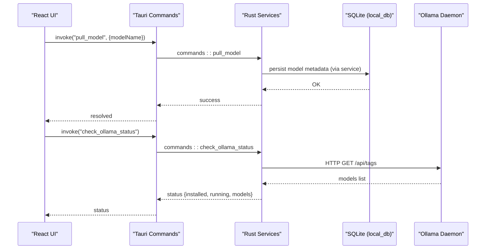
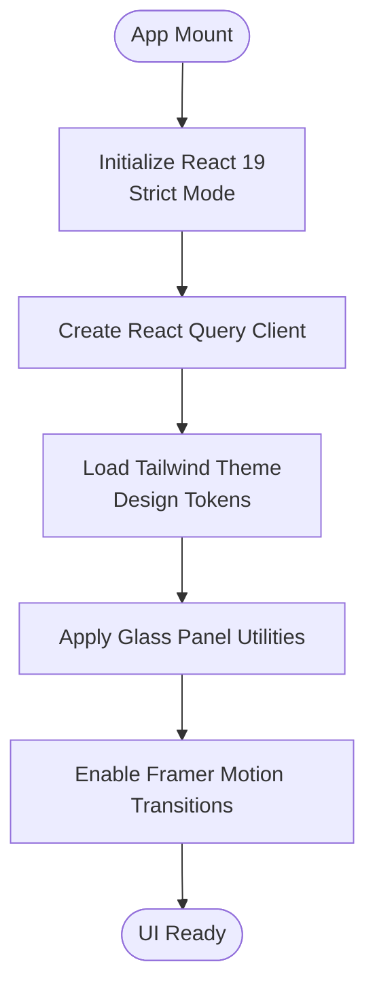
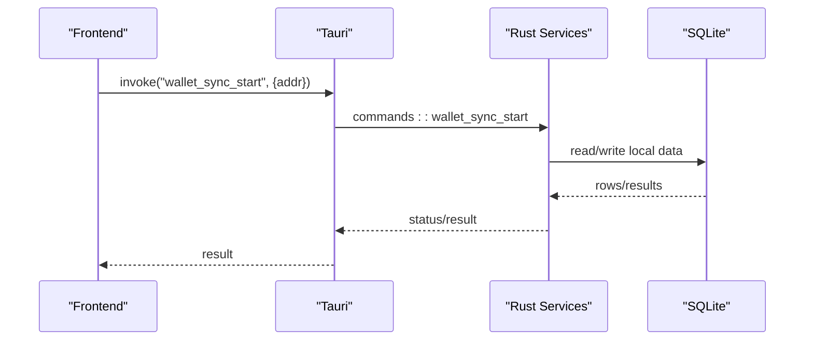
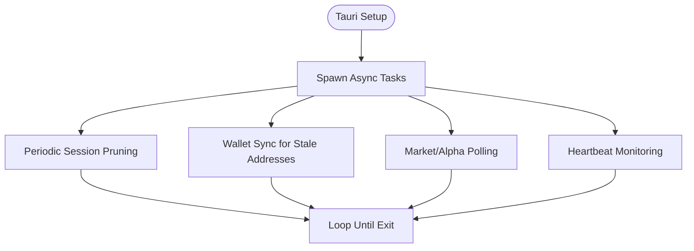
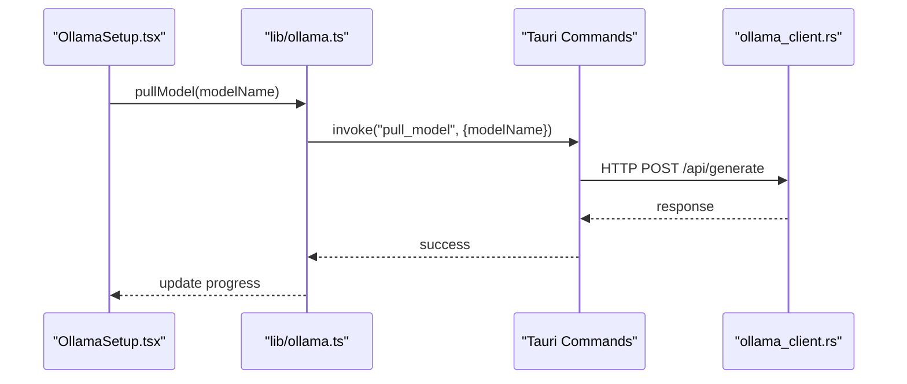
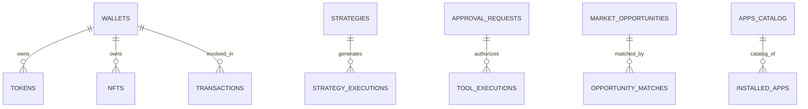
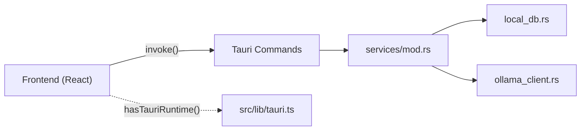

# Technology Stack & Architecture

<cite>
**Referenced Files in This Document**
- [package.json](file://package.json)
- [vite.config.ts](file://vite.config.ts)
- [src/main.tsx](file://src/main.tsx)
- [src/styles/globals.css](file://src/styles/globals.css)
- [src/lib/tauri.ts](file://src/lib/tauri.ts)
- [src/lib/ollama.ts](file://src/lib/ollama.ts)
- [src/components/OllamaSetup.tsx](file://src/components/OllamaSetup.tsx)
- [src-tauri/Cargo.toml](file://src-tauri/Cargo.toml)
- [src-tauri/src/main.rs](file://src-tauri/src/main.rs)
- [src-tauri/src/lib.rs](file://src-tauri/src/lib.rs)
- [src-tauri/src/services/mod.rs](file://src-tauri/src/services/mod.rs)
- [src-tauri/src/services/local_db.rs](file://src-tauri/src/services/local_db.rs)
- [src-tauri/src/services/ollama_client.rs](file://src-tauri/src/services/ollama_client.rs)
- [src-tauri/src/commands/mod.rs](file://src-tauri/src/commands/mod.rs)
</cite>

## Table of Contents
1. [Introduction](#introduction)
2. [Project Structure](#project-structure)
3. [Core Components](#core-components)
4. [Architecture Overview](#architecture-overview)
5. [Detailed Component Analysis](#detailed-component-analysis)
6. [Dependency Analysis](#dependency-analysis)
7. [Performance Considerations](#performance-considerations)
8. [Troubleshooting Guide](#troubleshooting-guide)
9. [Conclusion](#conclusion)

## Introduction
This document explains SHADOW Protocol’s technology stack and hybrid edge computing architecture. It covers the modern frontend built with React 19, Tailwind CSS 4, and Framer Motion, the Rust/Tauri 2.0 desktop runtime, the Tokio-powered multi-threaded service layer, local AI inference via Ollama, and SQLite-backed encrypted storage. It provides both conceptual overviews for newcomers and technical details for experienced developers, with practical examples of how these choices enhance security and performance.

## Project Structure
SHADOW Protocol follows a hybrid desktop architecture:
- Frontend: React 19 app bundled with Vite, styled with Tailwind CSS 4, and animated with Framer Motion.
- Desktop Runtime: Tauri 2.0 bridges the webview to native Rust services.
- Backend Services: Rust modules under src-tauri provide multi-threaded, asynchronous operations backed by SQLite and external APIs.
- Local AI: Ollama integration for privacy-first, on-device inference.

```mermaid
graph TB
subgraph "Frontend (Web)"
FE_Root["src/main.tsx"]
FE_App["React 19 App"]
FE_UI["Tailwind CSS 4<br/>Framer Motion"]
FE_Ollama["Ollama Client (Frontend)"]
end
subgraph "Desktop Runtime (Tauri 2.0)"
Tauri_Core["src-tauri/src/lib.rs<br/>src-tauri/src/main.rs"]
Tauri_Plugins["Plugins: opener, biometry"]
Tauri_Commands["Generated Commands"]
end
subgraph "Rust Services"
S_DB["local_db.rs<br/>SQLite Schema"]
S_Ollama["ollama_client.rs<br/>HTTP Client"]
S_Services["Other Services<br/>(market, strategy, wallet, etc.)"]
end
subgraph "Local AI"
Ollama["Ollama Daemon<br/>localhost:11434"]
end
FE_Root --> FE_App
FE_App --> FE_UI
FE_App --> FE_Ollama
FE_Ollama --> Tauri_Commands
FE_App <- --> Tauri_Core
Tauri_Core --> Tauri_Plugins
Tauri_Core --> Tauri_Commands
Tauri_Commands --> S_DB
Tauri_Commands --> S_Ollama
S_Ollama --> Ollama
```

**Diagram sources**
- [src/main.tsx:1-17](file://src/main.tsx#L1-L17)
- [src/styles/globals.css:1-144](file://src/styles/globals.css#L1-L144)
- [src/lib/ollama.ts:1-165](file://src/lib/ollama.ts#L1-L165)
- [src-tauri/src/main.rs:1-7](file://src-tauri/src/main.rs#L1-L7)
- [src-tauri/src/lib.rs:34-199](file://src-tauri/src/lib.rs#L34-L199)
- [src-tauri/src/services/local_db.rs:1-416](file://src-tauri/src/services/local_db.rs#L1-L416)
- [src-tauri/src/services/ollama_client.rs:1-106](file://src-tauri/src/services/ollama_client.rs#L1-L106)

**Section sources**
- [package.json:1-55](file://package.json#L1-L55)
- [vite.config.ts:1-53](file://vite.config.ts#L1-L53)
- [src/main.tsx:1-17](file://src/main.tsx#L1-L17)
- [src-tauri/src/main.rs:1-7](file://src-tauri/src/main.rs#L1-L7)
- [src-tauri/src/lib.rs:34-199](file://src-tauri/src/lib.rs#L34-L199)

## Core Components
- Frontend stack
  - React 19 with Strict Mode and React Query for caching and optimistic updates.
  - Tailwind CSS 4 with custom design tokens and glassmorphic utilities.
  - Framer Motion for micro-interactions and animations.
  - Vite dev server with HMR and Tauri-aware host/port configuration.
- Desktop runtime
  - Tauri 2.0 with devtools support and biometric plugin.
  - Generated command handlers bridge frontend invocations to Rust services.
- Rust/Tokio services
  - Multi-threaded runtime for concurrency (e.g., wallet sync, market polling).
  - SQLite local database with migrations and indices for performance.
  - Ollama client for privacy-first, local inference.
- Local AI
  - Ollama daemon on localhost with model management and chat/generate endpoints.
  - Frontend orchestrates setup, progress events, and model selection.

**Section sources**
- [package.json:18-37](file://package.json#L18-L37)
- [vite.config.ts:10-52](file://vite.config.ts#L10-L52)
- [src/main.tsx:3-8](file://src/main.tsx#L3-L8)
- [src/styles/globals.css:5-33](file://src/styles/globals.css#L5-L33)
- [src-tauri/Cargo.toml:20-44](file://src-tauri/Cargo.toml#L20-L44)
- [src-tauri/src/lib.rs:34-199](file://src-tauri/src/lib.rs#L34-L199)
- [src-tauri/src/services/local_db.rs:10-416](file://src-tauri/src/services/local_db.rs#L10-L416)
- [src-tauri/src/services/ollama_client.rs:1-106](file://src-tauri/src/services/ollama_client.rs#L1-L106)
- [src/lib/ollama.ts:1-165](file://src/lib/ollama.ts#L1-L165)

## Architecture Overview
SHADOW Protocol uses a hybrid edge computing model:
- The React 19 frontend runs inside a Tauri webview, enabling desktop-native capabilities while retaining web development ergonomics.
- Tauri exposes typed commands to the frontend, invoking Rust services for heavy lifting (networking, storage, AI).
- Tokio runtime powers asynchronous tasks such as periodic wallet sync, market data refresh, and session pruning.
- SQLite stores sensitive on-chain data locally, with indexes and migrations for robustness.
- Ollama provides privacy-first inference by keeping prompts and outputs on-device.



**Diagram sources**
- [src-tauri/src/lib.rs:90-190](file://src-tauri/src/lib.rs#L90-L190)
- [src-tauri/src/services/local_db.rs:438-516](file://src-tauri/src/services/local_db.rs#L438-L516)
- [src-tauri/src/services/ollama_client.rs:46-105](file://src-tauri/src/services/ollama_client.rs#L46-L105)
- [src/lib/ollama.ts:17-39](file://src/lib/ollama.ts#L17-L39)

## Detailed Component Analysis

### Frontend Stack: React 19, Tailwind CSS 4, Framer Motion, Glassmorphism
- React 19 initializes the app with React Query for caching and Strict Mode for early detection of unsafe patterns.
- Tailwind CSS 4 defines a theme with design tokens and adds glass-like panels and subtle textures for a modern, immersive UI.
- Framer Motion enables smooth transitions and micro-interactions, complementing the glass UI.
- Vite configuration sets a fixed port for Tauri development and disables screen clearing to surface Rust build errors.



**Diagram sources**
- [src/main.tsx:1-17](file://src/main.tsx#L1-L17)
- [src/styles/globals.css:5-33](file://src/styles/globals.css#L5-L33)
- [vite.config.ts:10-52](file://vite.config.ts#L10-L52)

**Section sources**
- [src/main.tsx:1-17](file://src/main.tsx#L1-L17)
- [src/styles/globals.css:1-144](file://src/styles/globals.css#L1-L144)
- [vite.config.ts:1-53](file://vite.config.ts#L1-L53)

### Desktop Runtime: Tauri 2.0 and Command Layer
- Tauri 2.0 initializes plugins (opener, biometry) and registers a comprehensive set of commands for wallet, market, strategy, apps, and Ollama operations.
- The builder sets up logging, database initialization, periodic tasks (e.g., session pruning), and background sync jobs.
- The Rust entrypoint delegates to a library crate that encapsulates all runtime logic.



**Diagram sources**
- [src-tauri/src/lib.rs:40-199](file://src-tauri/src/lib.rs#L40-L199)
- [src-tauri/src/main.rs:4-7](file://src-tauri/src/main.rs#L4-L7)

**Section sources**
- [src-tauri/src/lib.rs:34-199](file://src-tauri/src/lib.rs#L34-L199)
- [src-tauri/src/main.rs:1-7](file://src-tauri/src/main.rs#L1-L7)

### Multi-threaded Service Layer: Tokio Runtime and Concurrency
- Tokio features include multi-threaded runtime, async tasks, timers, and process spawning.
- Background tasks include:
  - Periodic session pruning.
  - Wallet sync for stale addresses.
  - Market and alpha service polling.
  - Heartbeat monitoring.
- These tasks run concurrently, minimizing UI blocking and improving responsiveness.



**Diagram sources**
- [src-tauri/src/lib.rs:50-87](file://src-tauri/src/lib.rs#L50-L87)
- [src-tauri/Cargo.toml:35-35](file://src-tauri/Cargo.toml#L35-L35)

**Section sources**
- [src-tauri/src/lib.rs:50-87](file://src-tauri/src/lib.rs#L50-L87)
- [src-tauri/Cargo.toml:35-35](file://src-tauri/Cargo.toml#L35-L35)

### Local AI Integration: Ollama for Privacy-First Inference
- The frontend orchestrates Ollama setup: checking installation, starting the service, pulling models, and listening to progress events.
- The Rust service layer includes an Ollama HTTP client that communicates with the daemon on localhost, respecting bearer tokens from settings.
- This architecture keeps sensitive prompts and outputs on-device, reducing exposure and latency.



**Diagram sources**
- [src/components/OllamaSetup.tsx:55-137](file://src/components/OllamaSetup.tsx#L55-L137)
- [src/lib/ollama.ts:29-44](file://src/lib/ollama.ts#L29-L44)
- [src-tauri/src/services/ollama_client.rs:67-105](file://src-tauri/src/services/ollama_client.rs#L67-L105)

**Section sources**
- [src/components/OllamaSetup.tsx:1-308](file://src/components/OllamaSetup.tsx#L1-L308)
- [src/lib/ollama.ts:1-165](file://src/lib/ollama.ts#L1-L165)
- [src-tauri/src/services/ollama_client.rs:1-106](file://src-tauri/src/services/ollama_client.rs#L1-L106)

### SQLite Database Management and Encrypted Storage Concepts
- SQLite schema includes tables for wallets, tokens, NFTs, transactions, strategies, approvals, tool executions, audits, market opportunities, apps, tasks, and autonomous agent data.
- Indexes are defined for performance (e.g., timestamps, status, created_at).
- Migration helpers ensure schema evolution without breaking existing data.
- Encrypted storage concepts: While the codebase demonstrates secure key management primitives (e.g., OS Keychain integration references), concrete encryption logic is not present in the analyzed files. The architecture supports integrating Fully Homomorphic Encryption concepts at the data ingestion or analytics layer, preserving privacy during computation.



**Diagram sources**
- [src-tauri/src/services/local_db.rs:10-416](file://src-tauri/src/services/local_db.rs#L10-L416)

**Section sources**
- [src-tauri/src/services/local_db.rs:1-416](file://src-tauri/src/services/local_db.rs#L1-L416)

### OS Keychain Integration and Security Controls
- The Rust dependencies include OS keychain integrations (e.g., keyring) and cryptographic primitives (e.g., zeroize, bip39), indicating a foundation for secure secret handling.
- Tauri plugins include biometric authentication, enabling secure unlocking flows.
- Practical example: Use OS Keychain to store Ollama API keys and wallet secrets, then read them in Rust services to avoid exposing credentials in logs or memory.

**Section sources**
- [src-tauri/Cargo.toml:27-32](file://src-tauri/Cargo.toml#L27-L32)
- [src-tauri/src/lib.rs:40-43](file://src-tauri/src/lib.rs#L40-L43)

## Dependency Analysis
- Frontend-to-Rust boundary
  - The frontend checks for Tauri runtime availability and invokes commands via @tauri-apps/api.
  - Vite ignores src-tauri to prevent bundling Rust code into the web bundle.
- Rust service modules
  - services/mod.rs aggregates modules for apps, market, strategy, wallet, and Ollama.
  - commands/mod.rs re-exports command handlers for registration in the Tauri builder.



**Diagram sources**
- [src/lib/tauri.ts:1-4](file://src/lib/tauri.ts#L1-L4)
- [src-tauri/src/services/mod.rs:1-36](file://src-tauri/src/services/mod.rs#L1-L36)
- [src-tauri/src/commands/mod.rs:1-27](file://src-tauri/src/commands/mod.rs#L1-L27)

**Section sources**
- [src/lib/tauri.ts:1-4](file://src/lib/tauri.ts#L1-L4)
- [vite.config.ts:47-50](file://vite.config.ts#L47-L50)
- [src-tauri/src/services/mod.rs:1-36](file://src-tauri/src/services/mod.rs#L1-L36)
- [src-tauri/src/commands/mod.rs:1-27](file://src-tauri/src/commands/mod.rs#L1-L27)

## Performance Considerations
- Tokio multi-threading
  - Use tokio::spawn for concurrent wallet sync and market polling to avoid blocking the main thread.
  - Employ tokio::time::interval for periodic tasks to reduce CPU spin loops.
- SQLite indexing
  - Leverage created indexes on timestamps, status, and foreign keys to speed up queries.
  - Batch writes and migrations to minimize I/O overhead.
- Frontend responsiveness
  - React Query caching reduces repeated network requests.
  - Tailwind utilities and Framer Motion transitions should be scoped to avoid unnecessary reflows.
- Local AI throughput
  - Choose appropriate model sizes based on system resources to balance latency and accuracy.
  - Stream progress events to keep the UI responsive during model pulls.

[No sources needed since this section provides general guidance]

## Troubleshooting Guide
- Ollama connectivity
  - Verify the daemon is reachable at localhost:11434 and models are pulled.
  - Use frontend helpers to detect unreachable or “model not found” errors and surface actionable messages.
- Tauri command failures
  - Inspect the command registration in the Tauri builder and ensure the frontend invokes the correct command names.
  - Check the Rust service logs initialized in setup.
- SQLite initialization
  - Confirm the app data directory is writable and the database path is initialized before use.
  - Review migration helpers for schema evolution issues.

**Section sources**
- [src/lib/ollama.ts:153-165](file://src/lib/ollama.ts#L153-L165)
- [src-tauri/src/lib.rs:40-89](file://src-tauri/src/lib.rs#L40-L89)
- [src-tauri/src/services/local_db.rs:438-448](file://src-tauri/src/services/local_db.rs#L438-L448)

## Conclusion
SHADOW Protocol’s hybrid architecture combines the developer productivity of React 19 and Vite with the security and performance benefits of Tauri 2.0 and Rust. The Tokio-driven service layer scales with concurrent tasks, SQLite ensures fast, local persistence, and Ollama enables privacy-first AI inference. Together, these technologies deliver a modern, secure, and responsive platform for decentralized finance automation.