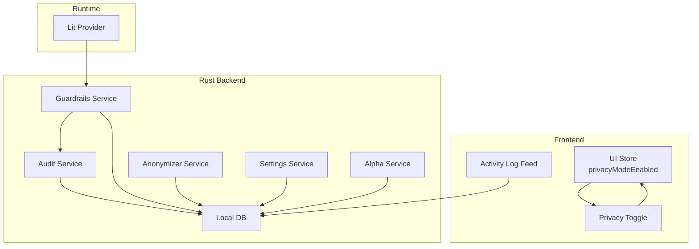
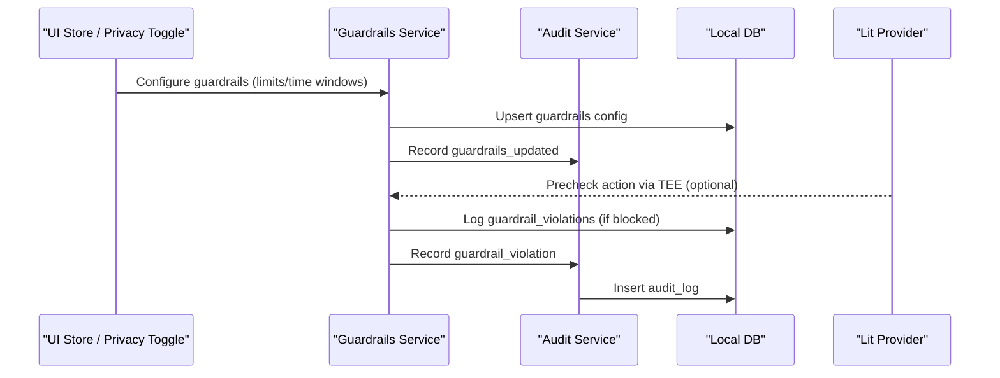
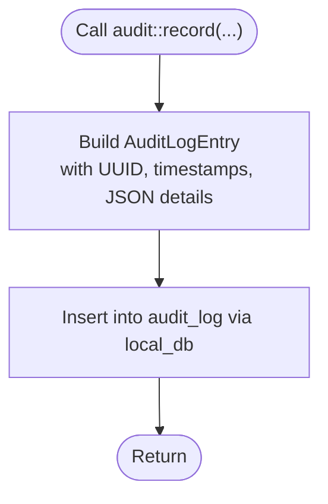
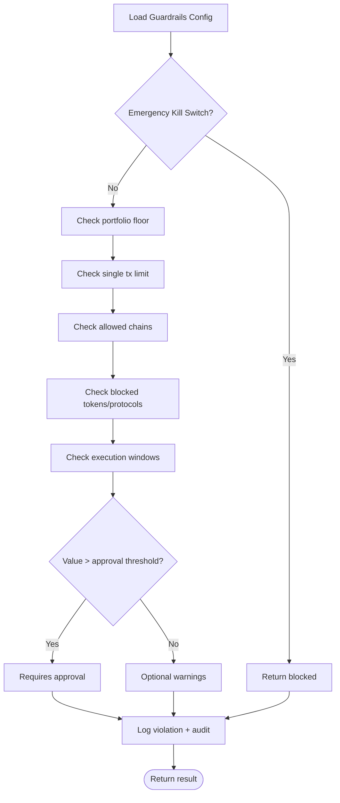
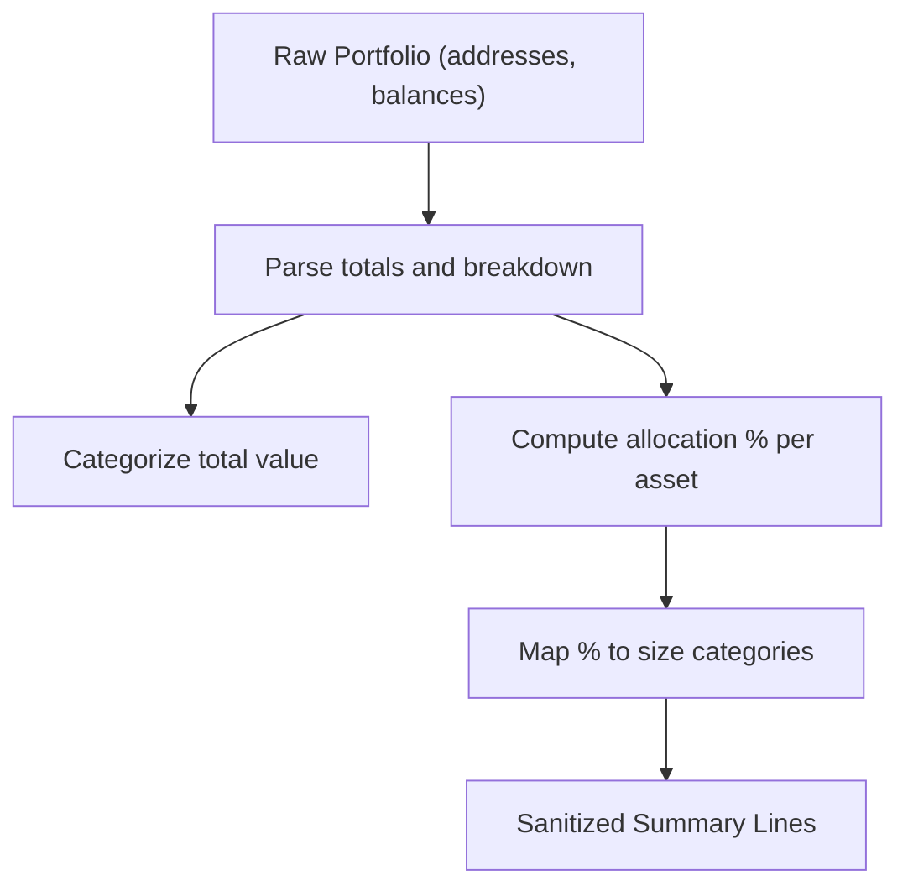
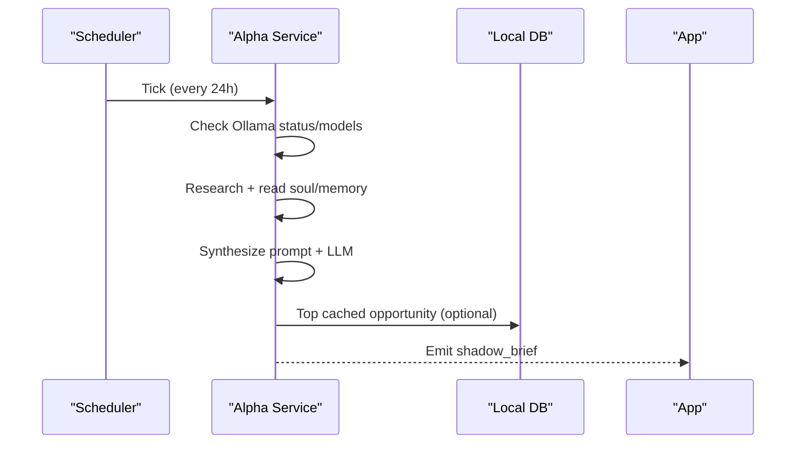
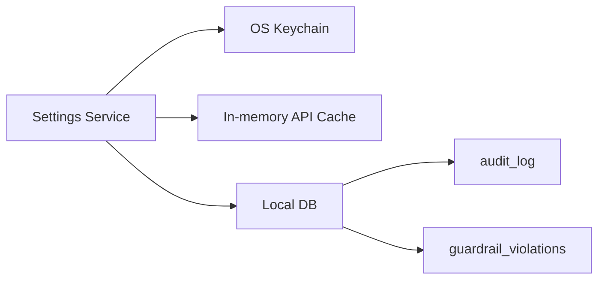
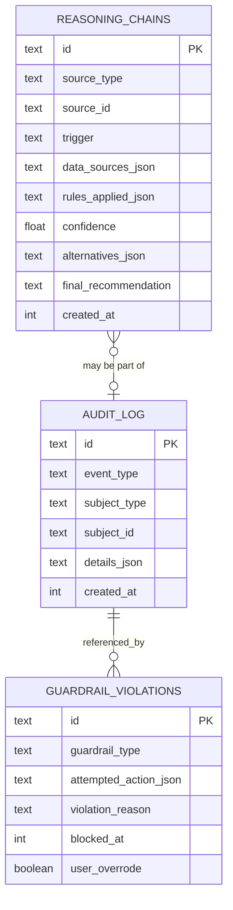
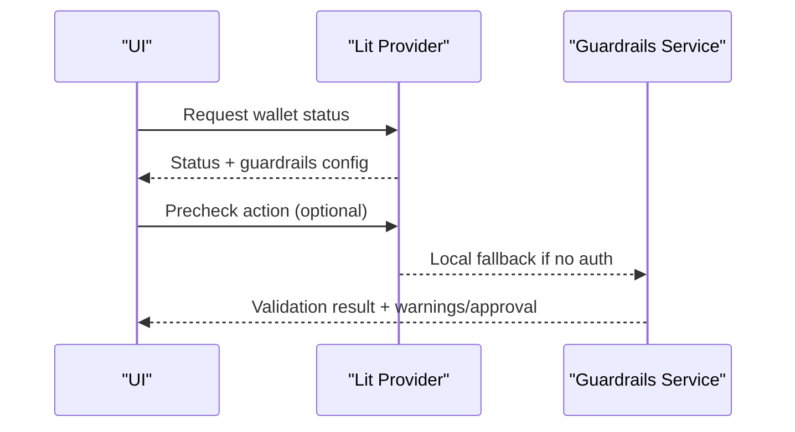
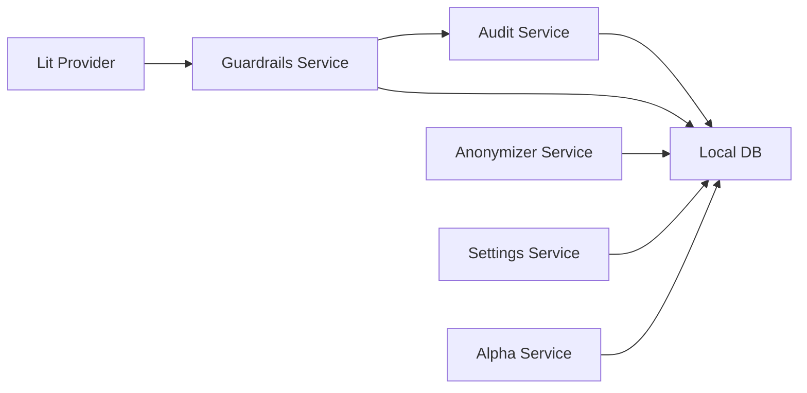

# Audit & Compliance Systems

<cite>
**Referenced Files in This Document**
- [audit.rs](file://src-tauri/src/services/audit.rs)
- [anonymizer.rs](file://src-tauri/src/services/anonymizer.rs)
- [local_db.rs](file://src-tauri/src/services/local_db.rs)
- [guardrails.rs](file://src-tauri/src/services/guardrails.rs)
- [alpha_service.rs](file://src-tauri/src/services/alpha_service.rs)
- [logger.ts](file://src/lib/logger.ts)
- [PrivacyToggle.tsx](file://src/components/shared/PrivacyToggle.tsx)
- [useUiStore.ts](file://src/store/useUiStore.ts)
- [ActivityLog.tsx](file://src/components/automation/ActivityLog.tsx)
- [settings.rs](file://src-tauri/src/services/settings.rs)
- [lit.ts](file://apps-runtime/src/providers/lit.ts)
- [main.rs](file://src-tauri/src/main.rs)
</cite>

## Table of Contents
1. [Introduction](#introduction)
2. [Project Structure](#project-structure)
3. [Core Components](#core-components)
4. [Architecture Overview](#architecture-overview)
5. [Detailed Component Analysis](#detailed-component-analysis)
6. [Dependency Analysis](#dependency-analysis)
7. [Performance Considerations](#performance-considerations)
8. [Troubleshooting Guide](#troubleshooting-guide)
9. [Conclusion](#conclusion)
10. [Appendices](#appendices)

## Introduction
This document describes SHADOW Protocol’s audit and compliance systems with a focus on:
- Comprehensive audit trail: transaction logging, user activity tracking, and system event recording
- Privacy-preserving anonymization of audit data
- Alpha service compliance features: regulatory reporting capability and privacy-by-design
- Data retention, secure storage, and access controls for audit information
- Supported compliance frameworks: GDPR, KYC/AML, and financial regulations
- Automated compliance checks, policy enforcement, and violation detection
- Audit log integrity, tamper-evidence, and forensic analysis
- Guidance for configuring compliance settings, generating compliance reports, and maintaining audit readiness

## Project Structure
The audit and compliance functionality spans Rust backend services, frontend UI stores and toggles, and supporting runtime integrations:
- Backend services: audit logging, anonymization, guardrails, alpha synthesis, settings, and local database
- Frontend: privacy toggle and UI store for privacy mode
- Runtime integration: Lit Protocol enforcement for guardrails

**Diagram sources**
- [audit.rs:1-25](file://src-tauri/src/services/audit.rs#L1-L25)
- [guardrails.rs:1-620](file://src-tauri/src/services/guardrails.rs#L1-L620)
- [anonymizer.rs:1-56](file://src-tauri/src/services/anonymizer.rs#L1-L56)
- [local_db.rs:1-2735](file://src-tauri/src/services/local_db.rs#L1-L2735)
- [settings.rs:1-243](file://src-tauri/src/services/settings.rs#L1-L243)
- [alpha_service.rs:1-143](file://src-tauri/src/services/alpha_service.rs#L1-L143)
- [PrivacyToggle.tsx:1-32](file://src/components/shared/PrivacyToggle.tsx#L1-L32)
- [useUiStore.ts:1-162](file://src/store/useUiStore.ts#L1-L162)
- [ActivityLog.tsx:119-151](file://src/components/automation/ActivityLog.tsx#L119-L151)
- [lit.ts:160-258](file://apps-runtime/src/providers/lit.ts#L160-L258)

**Section sources**
- [audit.rs:1-25](file://src-tauri/src/services/audit.rs#L1-L25)
- [local_db.rs:169-176](file://src-tauri/src/services/local_db.rs#L169-L176)
- [guardrails.rs:1-620](file://src-tauri/src/services/guardrails.rs#L1-L620)
- [anonymizer.rs:1-56](file://src-tauri/src/services/anonymizer.rs#L1-L56)
- [alpha_service.rs:1-143](file://src-tauri/src/services/alpha_service.rs#L1-L143)
- [PrivacyToggle.tsx:1-32](file://src/components/shared/PrivacyToggle.tsx#L1-L32)
- [useUiStore.ts:1-162](file://src/store/useUiStore.ts#L1-L162)
- [ActivityLog.tsx:119-151](file://src/components/automation/ActivityLog.tsx#L119-L151)
- [settings.rs:1-243](file://src-tauri/src/services/settings.rs#L1-L243)
- [lit.ts:160-258](file://apps-runtime/src/providers/lit.ts#L160-L258)

## Core Components
- Audit Service: records structured events with timestamps, subjects, and serialized details into a dedicated audit_log table.
- Guardrails Service: enforces configurable constraints (limits, time windows, approvals) and logs violations and overrides.
- Anonymizer Service: transforms portfolio data into category-based summaries for privacy-preserving sharing.
- Local Database: central schema with audit_log, guardrail_violations, reasoning_chains, and other compliance-relevant tables.
- Alpha Service: periodic synthesis with optional regulatory reporting hooks and privacy-aware data handling.
- Settings Service: secure keychain-backed storage for API keys and secrets; supports deletion of all app data.
- Privacy UI: toggle and store for privacy mode to influence data collection and presentation.

**Section sources**
- [audit.rs:1-25](file://src-tauri/src/services/audit.rs#L1-L25)
- [local_db.rs:169-176](file://src-tauri/src/services/local_db.rs#L169-L176)
- [guardrails.rs:1-620](file://src-tauri/src/services/guardrails.rs#L1-L620)
- [anonymizer.rs:1-56](file://src-tauri/src/services/anonymizer.rs#L1-L56)
- [alpha_service.rs:1-143](file://src-tauri/src/services/alpha_service.rs#L1-L143)
- [settings.rs:1-243](file://src-tauri/src/services/settings.rs#L1-L243)
- [PrivacyToggle.tsx:1-32](file://src/components/shared/PrivacyToggle.tsx#L1-L32)
- [useUiStore.ts:1-162](file://src/store/useUiStore.ts#L1-L162)

## Architecture Overview
The system integrates frontend privacy controls with backend audit and guardrails, backed by a local SQLite database. Runtime integrations (e.g., Lit) support decentralized enforcement.

**Diagram sources**
- [guardrails.rs:206-230](file://src-tauri/src/services/guardrails.rs#L206-L230)
- [guardrails.rs:509-518](file://src-tauri/src/services/guardrails.rs#L509-L518)
- [audit.rs:1-25](file://src-tauri/src/services/audit.rs#L1-L25)
- [local_db.rs:169-176](file://src-tauri/src/services/local_db.rs#L169-L176)
- [lit.ts:180-246](file://apps-runtime/src/providers/lit.ts#L180-L246)

## Detailed Component Analysis

### Audit Trail and Logging
- Event model: Each audit entry captures event_type, subject_type, optional subject_id, serialized details, and created_at timestamp.
- Storage: Insertion into the audit_log table via local_db::insert_audit_log.
- Usage: Guardrails service records updates and violations; app backup and alpha service also emit audit events.

**Diagram sources**
- [audit.rs:5-24](file://src-tauri/src/services/audit.rs#L5-L24)
- [local_db.rs:1257-1271](file://src-tauri/src/services/local_db.rs#L1257-L1271)

**Section sources**
- [audit.rs:1-25](file://src-tauri/src/services/audit.rs#L1-L25)
- [local_db.rs:169-176](file://src-tauri/src/services/local_db.rs#L169-L176)
- [local_db.rs:1257-1271](file://src-tauri/src/services/local_db.rs#L1257-L1271)
- [guardrails.rs:219-228](file://src-tauri/src/services/guardrails.rs#L219-L228)
- [guardrails.rs:509-518](file://src-tauri/src/services/guardrails.rs#L509-L518)
- [apps/filecoin.rs:88-94](file://src-tauri/src/services/apps/filecoin.rs#L88-L94)

### Guardrails and Policy Enforcement
- Configuration: JSON-based guardrails with limits (single tx, daily/weekly), allowed/block lists, time windows, slippage, and kill switch.
- Validation: Centralized validate_action checks all constraints and produces allowed/warnings/requires_approval results.
- Violations: Blocked actions are logged to guardrail_violations and audit trails; overrides are recorded via audit.
- Kill Switch: Global atomic flag to disable autonomous actions; persisted in config and reflected in audit logs.

**Diagram sources**
- [guardrails.rs:277-426](file://src-tauri/src/services/guardrails.rs#L277-L426)
- [guardrails.rs:484-518](file://src-tauri/src/services/guardrails.rs#L484-L518)

**Section sources**
- [guardrails.rs:1-620](file://src-tauri/src/services/guardrails.rs#L1-L620)
- [local_db.rs:372-382](file://src-tauri/src/services/local_db.rs#L372-L382)

### Privacy-Preserving Data Handling and Anonymization
- Portfolio sanitization: Converts exact balances into categories and percentages, removing sensitive identifiers.
- Privacy UI: A privacy toggle and store enable/disable privacy mode, influencing data handling and presentation.

**Diagram sources**
- [anonymizer.rs:7-28](file://src-tauri/src/services/anonymizer.rs#L7-L28)
- [PrivacyToggle.tsx:1-32](file://src/components/shared/PrivacyToggle.tsx#L1-L32)
- [useUiStore.ts:1-162](file://src/store/useUiStore.ts#L1-L162)

**Section sources**
- [anonymizer.rs:1-56](file://src-tauri/src/services/anonymizer.rs#L1-L56)
- [PrivacyToggle.tsx:1-32](file://src/components/shared/PrivacyToggle.tsx#L1-L32)
- [useUiStore.ts:1-162](file://src/store/useUiStore.ts#L1-L162)

### Alpha Service Compliance Features
- Periodic synthesis: Runs a scheduled cycle to generate a “Daily Alpha Brief,” emitting events and optionally attaching opportunities.
- Privacy-aware processing: Uses local LLM and user context; does not transmit raw PII beyond sanitized summaries.
- Regulatory reporting hooks: The emitted brief can include structured opportunity data suitable for compliance dashboards.

**Diagram sources**
- [alpha_service.rs:27-56](file://src-tauri/src/services/alpha_service.rs#L27-L56)
- [alpha_service.rs:71-129](file://src-tauri/src/services/alpha_service.rs#L71-L129)

**Section sources**
- [alpha_service.rs:1-143](file://src-tauri/src/services/alpha_service.rs#L1-L143)

### Secure Storage and Access Controls
- Local SQLite: Centralized schema with indexed audit_log and guardrail_violations tables.
- Secrets management: API keys stored in OS keychain with in-memory caching; supports bulk deletion of all app data.
- Data deletion: Supports clearing DB, keychain entries, biometric data, and local files.

**Diagram sources**
- [settings.rs:1-243](file://src-tauri/src/services/settings.rs#L1-L243)
- [local_db.rs:169-176](file://src-tauri/src/services/local_db.rs#L169-L176)
- [local_db.rs:372-382](file://src-tauri/src/services/local_db.rs#L372-L382)

**Section sources**
- [settings.rs:1-243](file://src-tauri/src/services/settings.rs#L1-L243)
- [local_db.rs:1-2735](file://src-tauri/src/services/local_db.rs#L1-L2735)

### Compliance Frameworks and Automated Checks
- GDPR alignment: Privacy toggle and anonymization reduce data minimization risk; keychain storage reduces exposure; deletion APIs support data erasure.
- KYC/AML: Guardrails enforce transaction limits, blocked lists, and time windows; violations recorded for audit.
- Financial regulations: Structured audit trails and guardrail logs support policy adherence and forensic analysis.

**Section sources**
- [PrivacyToggle.tsx:1-32](file://src/components/shared/PrivacyToggle.tsx#L1-L32)
- [anonymizer.rs:1-56](file://src-tauri/src/services/anonymizer.rs#L1-L56)
- [guardrails.rs:1-620](file://src-tauri/src/services/guardrails.rs#L1-L620)
- [local_db.rs:169-176](file://src-tauri/src/services/local_db.rs#L169-L176)

### Audit Log Integrity and Forensic Analysis
- Tamper-evidence: Each audit entry includes a UUID and timestamp; guardrail violations include attempted action context and reasons.
- Forensics: Indexes on created_at and foreign keys enable timeline queries; reasoning_chains capture agent decision traces.

**Diagram sources**
- [local_db.rs:169-176](file://src-tauri/src/services/local_db.rs#L169-L176)
- [local_db.rs:372-382](file://src-tauri/src/services/local_db.rs#L372-L382)
- [local_db.rs:401-413](file://src-tauri/src/services/local_db.rs#L401-L413)

**Section sources**
- [audit.rs:1-25](file://src-tauri/src/services/audit.rs#L1-L25)
- [guardrails.rs:484-518](file://src-tauri/src/services/guardrails.rs#L484-L518)
- [local_db.rs:169-176](file://src-tauri/src/services/local_db.rs#L169-L176)
- [local_db.rs:372-382](file://src-tauri/src/services/local_db.rs#L372-L382)
- [local_db.rs:401-413](file://src-tauri/src/services/local_db.rs#L401-L413)

### Decentralized Enforcement and Privacy-by-Design
- Lit integration: Wallet status and precheck leverage distributed Trusted Execution Environments; fallback to local enforcement when needed.
- Privacy-by-design: Anonymization and privacy toggle minimize data exposure; keychain storage protects secrets.

**Diagram sources**
- [lit.ts:160-258](file://apps-runtime/src/providers/lit.ts#L160-L258)
- [guardrails.rs:277-426](file://src-tauri/src/services/guardrails.rs#L277-L426)

**Section sources**
- [lit.ts:160-258](file://apps-runtime/src/providers/lit.ts#L160-L258)
- [guardrails.rs:1-620](file://src-tauri/src/services/guardrails.rs#L1-L620)

## Dependency Analysis
- Audit Service depends on Local DB for persistence and is invoked by Guardrails and App Backup services.
- Guardrails Service depends on Local DB for configuration and violation logging, and emits audit events.
- Anonymizer Service is used for privacy-preserving portfolio summaries.
- Settings Service manages secrets and deletion flows impacting audit data.
- Alpha Service emits synthetic events suitable for compliance dashboards.

**Diagram sources**
- [audit.rs:1-25](file://src-tauri/src/services/audit.rs#L1-L25)
- [guardrails.rs:1-620](file://src-tauri/src/services/guardrails.rs#L1-L620)
- [anonymizer.rs:1-56](file://src-tauri/src/services/anonymizer.rs#L1-L56)
- [local_db.rs:1-2735](file://src-tauri/src/services/local_db.rs#L1-L2735)
- [settings.rs:1-243](file://src-tauri/src/services/settings.rs#L1-L243)
- [alpha_service.rs:1-143](file://src-tauri/src/services/alpha_service.rs#L1-L143)
- [lit.ts:160-258](file://apps-runtime/src/providers/lit.ts#L160-L258)

**Section sources**
- [audit.rs:1-25](file://src-tauri/src/services/audit.rs#L1-L25)
- [guardrails.rs:1-620](file://src-tauri/src/services/guardrails.rs#L1-L620)
- [anonymizer.rs:1-56](file://src-tauri/src/services/anonymizer.rs#L1-L56)
- [local_db.rs:1-2735](file://src-tauri/src/services/local_db.rs#L1-L2735)
- [settings.rs:1-243](file://src-tauri/src/services/settings.rs#L1-L243)
- [alpha_service.rs:1-143](file://src-tauri/src/services/alpha_service.rs#L1-L143)
- [lit.ts:160-258](file://apps-runtime/src/providers/lit.ts#L160-L258)

## Performance Considerations
- Indexed audit_log and guardrail_violations tables improve query performance for time-series views.
- In-memory API cache reduces repeated keychain reads for secrets.
- Scheduled alpha cycles run at fixed intervals to avoid excessive resource usage.
- Anonymization operates on small summaries to minimize CPU overhead.

[No sources needed since this section provides general guidance]

## Troubleshooting Guide
- Audit logs not appearing:
  - Verify audit::record calls and confirm insert_audit_log succeeds.
  - Check created_at indexing and query limits.
- Guardrail violations missing:
  - Confirm guardrails config is saved and loaded; check guardrail_violations inserts.
  - Review validate_action logic for blocking conditions.
- Privacy toggle ineffective:
  - Ensure privacyModeEnabled is toggled and persisted in UI store.
  - Confirm anonymization pipeline is invoked for portfolio data.
- Secret retrieval failures:
  - Check keychain entries and in-memory cache initialization.
  - Use settings delete_all_app_data to reset state if necessary.
- Logger usage:
  - Use the frontend logger for development errors; backend uses tracing for service logs.

**Section sources**
- [audit.rs:1-25](file://src-tauri/src/services/audit.rs#L1-L25)
- [local_db.rs:1257-1271](file://src-tauri/src/services/local_db.rs#L1257-L1271)
- [guardrails.rs:182-230](file://src-tauri/src/services/guardrails.rs#L182-L230)
- [local_db.rs:372-382](file://src-tauri/src/services/local_db.rs#L372-L382)
- [PrivacyToggle.tsx:1-32](file://src/components/shared/PrivacyToggle.tsx#L1-L32)
- [useUiStore.ts:1-162](file://src/store/useUiStore.ts#L1-L162)
- [settings.rs:203-242](file://src-tauri/src/services/settings.rs#L203-L242)
- [logger.ts:1-6](file://src/lib/logger.ts#L1-L6)

## Conclusion
SHADOW Protocol’s audit and compliance systems combine robust event logging, configurable guardrails, privacy-preserving anonymization, and secure storage to meet GDPR, KYC/AML, and financial regulation requirements. The modular design enables automated compliance checks, tamper-evident audit trails, and forensic-ready data, while privacy-by-design features protect user data.

[No sources needed since this section summarizes without analyzing specific files]

## Appendices

### Compliance Configuration Checklist
- Enable privacy mode and anonymization for portfolio exports.
- Configure guardrails: limits, blocked lists, time windows, approval thresholds.
- Activate/deactivate kill switch as needed and audit changes.
- Schedule alpha synthesis and review emitted briefs for compliance insights.
- Manage secrets via keychain and periodically review access controls.

**Section sources**
- [PrivacyToggle.tsx:1-32](file://src/components/shared/PrivacyToggle.tsx#L1-L32)
- [useUiStore.ts:1-162](file://src/store/useUiStore.ts#L1-L162)
- [guardrails.rs:182-230](file://src-tauri/src/services/guardrails.rs#L182-L230)
- [alpha_service.rs:27-56](file://src-tauri/src/services/alpha_service.rs#L27-L56)
- [settings.rs:1-243](file://src-tauri/src/services/settings.rs#L1-L243)

### Audit Readiness Guidance
- Maintain audit_log and guardrail_violations indexes for fast queries.
- Implement regular backups of Local DB and encrypted archives.
- Use reasoning_chains for agent decision transparency.
- Establish procedures for incident response and forensic analysis using timestamps and subject references.

**Section sources**
- [local_db.rs:169-176](file://src-tauri/src/services/local_db.rs#L169-L176)
- [local_db.rs:372-382](file://src-tauri/src/services/local_db.rs#L372-L382)
- [local_db.rs:401-413](file://src-tauri/src/services/local_db.rs#L401-L413)