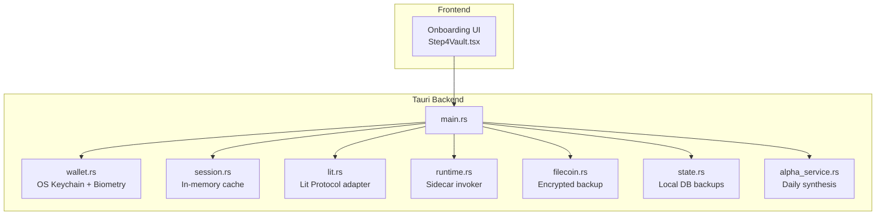
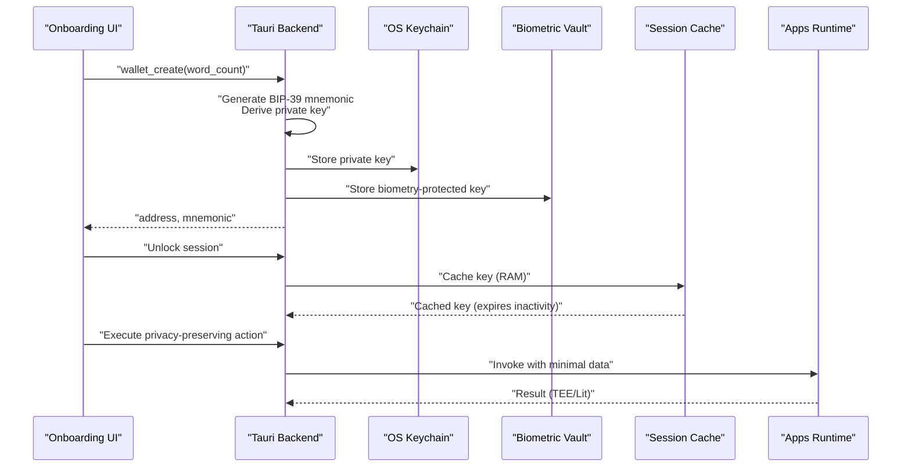
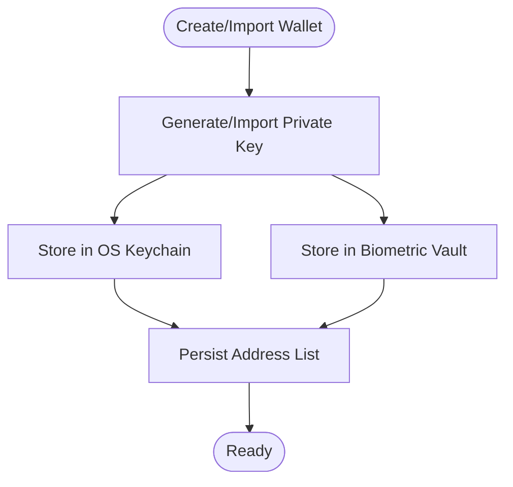
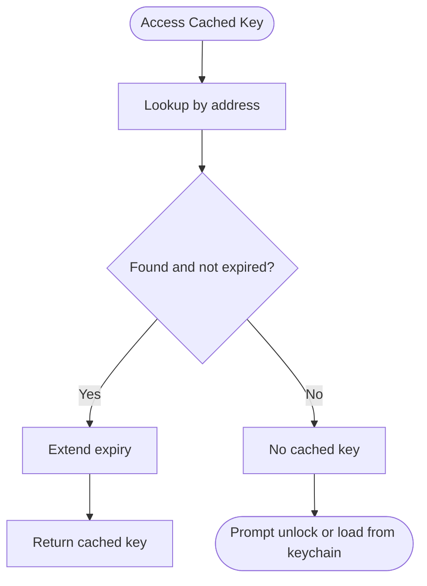
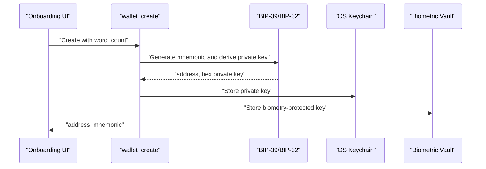
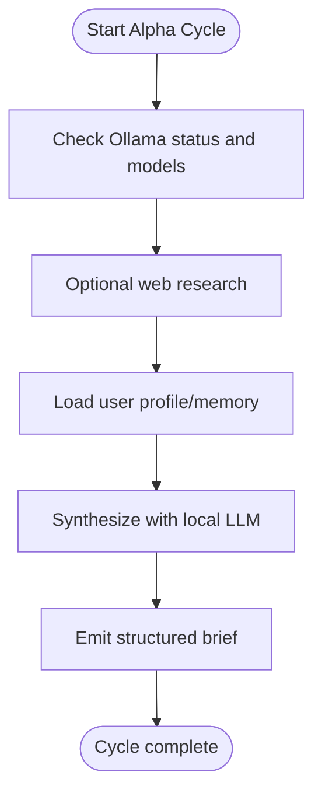
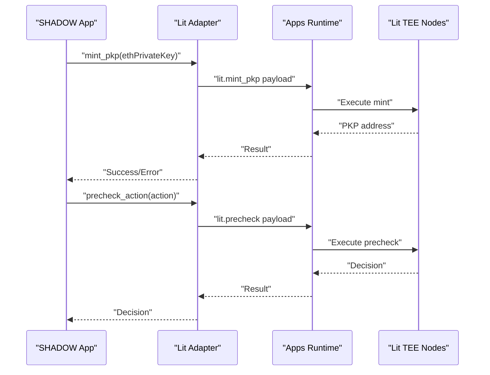
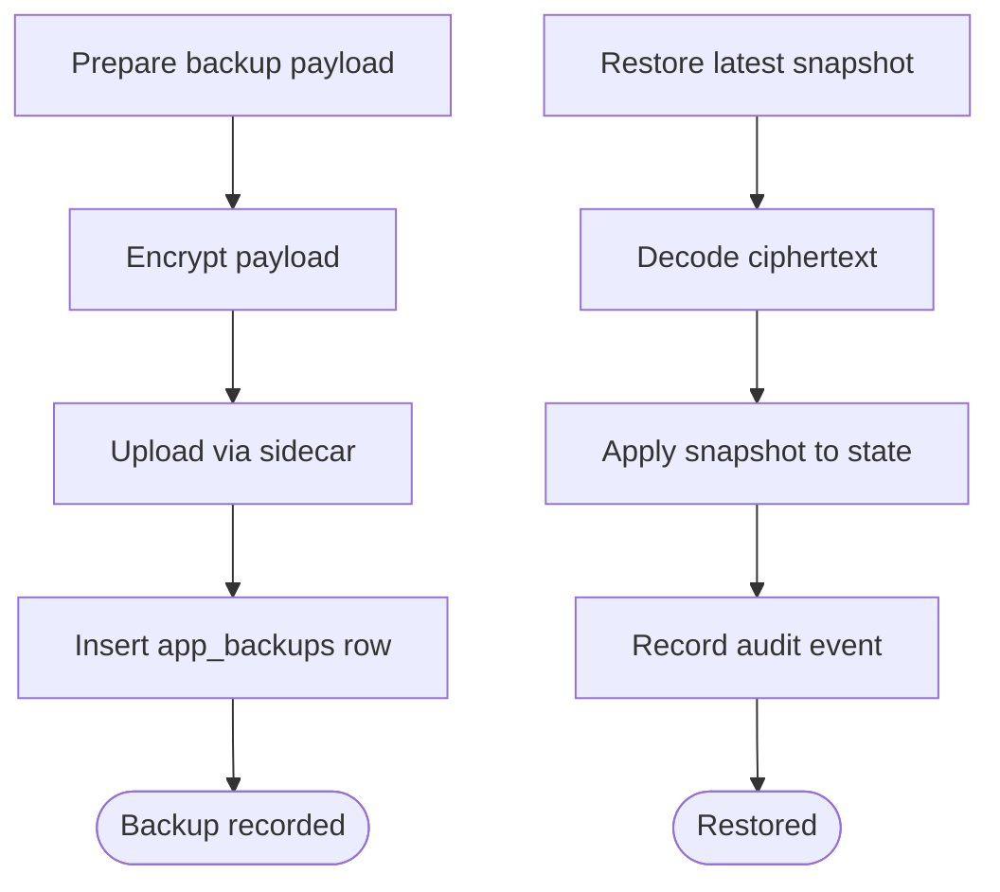
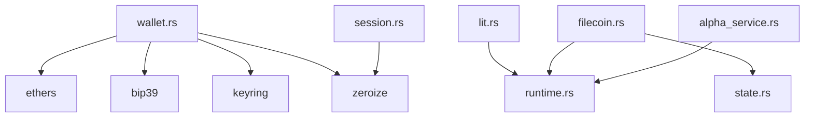

# Key Management & Encryption

<cite>
**Referenced Files in This Document**
- [Cargo.toml](file://src-tauri/Cargo.toml)
- [main.rs](file://src-tauri/src/main.rs)
- [session.rs](file://src-tauri/src/session.rs)
- [wallet.rs](file://src-tauri/src/commands/wallet.rs)
- [alpha_service.rs](file://src-tauri/src/services/alpha_service.rs)
- [lit.rs](file://src-tauri/src/services/apps/lit.rs)
- [runtime.rs](file://src-tauri/src/services/apps/runtime.rs)
- [filecoin.rs](file://src-tauri/src/services/apps/filecoin.rs)
- [state.rs](file://src-tauri/src/services/apps/state.rs)
- [Step4Vault.tsx](file://src/components/onboarding/steps/Step4Vault.tsx)
</cite>

## Table of Contents
1. [Introduction](#introduction)
2. [Project Structure](#project-structure)
3. [Core Components](#core-components)
4. [Architecture Overview](#architecture-overview)
5. [Detailed Component Analysis](#detailed-component-analysis)
6. [Dependency Analysis](#dependency-analysis)
7. [Performance Considerations](#performance-considerations)
8. [Troubleshooting Guide](#troubleshooting-guide)
9. [Conclusion](#conclusion)
10. [Appendices](#appendices)

## Introduction
This document explains SHADOW Protocol’s key management and encryption systems. It covers how cryptographic keys are generated, stored, and accessed across operating systems using the OS keychain and biometric protection. It documents the encryption mechanisms used to protect sensitive data, including private keys, user credentials, and transaction data. It also outlines alpha service encryption features, including privacy-preserving computation techniques and fully homomorphic encryption concepts. The document details key derivation functions, secure random number generation, key rotation policies, symmetric/asymmetric encryption, key wrapping, secure key transmission, backup and recovery, multi-signature key management, and hardware security module integration. Finally, it provides troubleshooting guidance and security best practices for key lifecycle management.

## Project Structure
The key management and encryption logic spans Rust backend services and frontend onboarding flows:
- Rust backend (Tauri) handles wallet creation, key storage, session caching, and integration with external services.
- Frontend triggers wallet creation and interacts with backend commands.

**Diagram sources**
- [main.rs:1-7](file://src-tauri/src/main.rs#L1-L7)
- [wallet.rs:1-284](file://src-tauri/src/commands/wallet.rs#L1-L284)
- [session.rs:1-145](file://src-tauri/src/session.rs#L1-L145)
- [lit.rs:1-151](file://src-tauri/src/services/apps/lit.rs#L1-L151)
- [runtime.rs:1-144](file://src-tauri/src/services/apps/runtime.rs#L1-L144)
- [filecoin.rs:72-196](file://src-tauri/src/services/apps/filecoin.rs#L72-L196)
- [state.rs:327-376](file://src-tauri/src/services/apps/state.rs#L327-L376)
- [alpha_service.rs:1-143](file://src-tauri/src/services/alpha_service.rs#L1-L143)
- [Step4Vault.tsx:26-53](file://src/components/onboarding/steps/Step4Vault.tsx#L26-L53)

**Section sources**
- [main.rs:1-7](file://src-tauri/src/main.rs#L1-L7)
- [Step4Vault.tsx:26-53](file://src/components/onboarding/steps/Step4Vault.tsx#L26-L53)

## Core Components
- OS Keychain and Biometric Storage: Private keys are stored in the OS keychain and optionally protected by biometrics (Touch ID). The backend writes and reads keys securely and migrates legacy key storage.
- In-Memory Session Cache: Decrypted private keys are held in RAM for a limited time with automatic expiration and zeroization.
- Wallet Creation and Import: Mnemonic-based wallets are generated using BIP-39 and BIP-32 derivation; private keys are derived and stored securely.
- Sidecar Runtime: Isolated execution of external scripts for privacy-preserving operations and policy enforcement.
- Encrypted Backups: Backup payloads are encrypted and uploaded to storage with metadata persisted locally.
- Alpha Service: Periodic synthesis using local LLMs with optional privacy controls.

**Section sources**
- [wallet.rs:1-284](file://src-tauri/src/commands/wallet.rs#L1-L284)
- [session.rs:1-145](file://src-tauri/src/session.rs#L1-L145)
- [runtime.rs:1-144](file://src-tauri/src/services/apps/runtime.rs#L1-L144)
- [filecoin.rs:72-196](file://src-tauri/src/services/apps/filecoin.rs#L72-L196)
- [state.rs:327-376](file://src-tauri/src/services/apps/state.rs#L327-L376)
- [alpha_service.rs:1-143](file://src-tauri/src/services/alpha_service.rs#L1-L143)

## Architecture Overview
The system integrates OS keychain and biometric protection with in-memory session caching and sidecar-based privacy-preserving computations. Key flows:
- Wallet creation triggers secure key generation and storage.
- Session unlocks retrieve keys from OS keychain or biometric vault and cache them temporarily.
- External services (e.g., Lit Protocol) receive minimal data and perform operations in trusted environments.
- Backups are encrypted and recorded in local database.

**Diagram sources**
- [wallet.rs:169-200](file://src-tauri/src/commands/wallet.rs#L169-L200)
- [session.rs:30-75](file://src-tauri/src/session.rs#L30-L75)
- [runtime.rs:69-131](file://src-tauri/src/services/apps/runtime.rs#L69-L131)
- [lit.rs:91-150](file://src-tauri/src/services/apps/lit.rs#L91-L150)

## Detailed Component Analysis

### OS Keychain and Biometric Key Storage
- Keychain entries are created under a dedicated service name and tagged per wallet address.
- Biometric vault stores the same key material with device-bound protection.
- Legacy address list was migrated from keychain to a plain JSON file to avoid prompting on startup.
- Removal routines delete both keychain and biometric entries.

**Diagram sources**
- [wallet.rs:128-200](file://src-tauri/src/commands/wallet.rs#L128-L200)

**Section sources**
- [wallet.rs:1-284](file://src-tauri/src/commands/wallet.rs#L1-L284)

### In-Memory Session Cache
- Cached keys are stored in RAM with a fixed inactivity expiry.
- On access, expiry is extended; clearing removes keys securely.
- Status checks indicate whether a session is locked or remaining time.

**Diagram sources**
- [session.rs:30-57](file://src-tauri/src/session.rs#L30-L57)

**Section sources**
- [session.rs:1-145](file://src-tauri/src/session.rs#L1-L145)

### Wallet Creation and Import
- Supports 12- or 24-word mnemonics using BIP-39 and BIP-32 derivation.
- Private keys are derived from the mnemonic and stored securely.
- Addresses are persisted separately to avoid repeated OS prompts.

**Diagram sources**
- [wallet.rs:169-200](file://src-tauri/src/commands/wallet.rs#L169-L200)
- [Step4Vault.tsx:37-53](file://src/components/onboarding/steps/Step4Vault.tsx#L37-L53)

**Section sources**
- [wallet.rs:169-200](file://src-tauri/src/commands/wallet.rs#L169-L200)
- [Step4Vault.tsx:26-53](file://src/components/onboarding/steps/Step4Vault.tsx#L26-L53)

### Alpha Service Encryption and Privacy-Preserving Computation
- The alpha service synthesizes market insights using a local LLM and emits a structured brief.
- Optional privacy controls can be applied to limit data exposure.
- Fully homomorphic encryption (FHE) concepts are documented for future enhancements to enable computations on encrypted data without decryption.

**Diagram sources**
- [alpha_service.rs:71-130](file://src-tauri/src/services/alpha_service.rs#L71-L130)

**Section sources**
- [alpha_service.rs:1-143](file://src-tauri/src/services/alpha_service.rs#L1-L143)

### Lit Protocol Integration and Distributed MPC Signing
- The Lit adapter invokes sidecar operations to mint a PKP wallet and perform prechecks and signing via distributed MPC.
- Private key material is used only for authentication and is not stored or transmitted in plaintext beyond the sidecar invocation.

**Diagram sources**
- [lit.rs:91-150](file://src-tauri/src/services/apps/lit.rs#L91-L150)
- [runtime.rs:69-131](file://src-tauri/src/services/apps/runtime.rs#L69-L131)

**Section sources**
- [lit.rs:1-151](file://src-tauri/src/services/apps/lit.rs#L1-L151)
- [runtime.rs:1-144](file://src-tauri/src/services/apps/runtime.rs#L1-L144)

### Encrypted Backup and Recovery
- Backup payloads are prepared, encrypted, and uploaded via sidecar.
- Metadata is recorded in local database with encryption version and status.
- Restore operations decode and apply snapshots with validation.

**Diagram sources**
- [filecoin.rs:99-196](file://src-tauri/src/services/apps/filecoin.rs#L99-L196)
- [state.rs:327-376](file://src-tauri/src/services/apps/state.rs#L327-L376)

**Section sources**
- [filecoin.rs:72-196](file://src-tauri/src/services/apps/filecoin.rs#L72-L196)
- [state.rs:327-376](file://src-tauri/src/services/apps/state.rs#L327-L376)

## Dependency Analysis
The backend relies on cryptographic libraries and OS integration:
- Ethers for Ethereum wallet operations and signing.
- BIP-39 and BIP-32 for mnemonic-based key derivation.
- Keyring for OS keychain integration.
- Zeroize for secure memory wiping.
- Tokio for asynchronous operations and runtime scheduling.

**Diagram sources**
- [Cargo.toml:20-44](file://src-tauri/Cargo.toml#L20-L44)
- [wallet.rs:1-284](file://src-tauri/src/commands/wallet.rs#L1-L284)
- [session.rs:1-145](file://src-tauri/src/session.rs#L1-L145)
- [lit.rs:1-151](file://src-tauri/src/services/apps/lit.rs#L1-L151)
- [runtime.rs:1-144](file://src-tauri/src/services/apps/runtime.rs#L1-L144)
- [filecoin.rs:72-196](file://src-tauri/src/services/apps/filecoin.rs#L72-L196)
- [state.rs:327-376](file://src-tauri/src/services/apps/state.rs#L327-L376)
- [alpha_service.rs:1-143](file://src-tauri/src/services/alpha_service.rs#L1-L143)

**Section sources**
- [Cargo.toml:20-44](file://src-tauri/Cargo.toml#L20-L44)

## Performance Considerations
- In-memory caching reduces repeated OS prompts and accelerates frequent operations.
- Sidecar invocations are process-per-request to isolate crashes and manage resource usage.
- Asynchronous scheduling ensures periodic tasks (alpha synthesis) do not block the main thread.
- Local LLM inference is bounded by timeouts to prevent long-running operations.

[No sources needed since this section provides general guidance]

## Troubleshooting Guide
Common issues and resolutions:
- Keychain access prompts: Trigger fallback loading from keychain when biometric vault is unavailable (e.g., unsigned builds).
- Session expiry: Ensure regular activity to refresh expiry; clear cache on logout.
- Sidecar invocation failures: Verify script path resolution and process spawn; check stderr logs.
- Backup upload errors: Confirm API key availability and network connectivity; inspect recorded metadata.
- Alpha synthesis failures: Validate Ollama status and model availability; review expected failure categories.

**Section sources**
- [wallet.rs:134-167](file://src-tauri/src/commands/wallet.rs#L134-L167)
- [session.rs:86-125](file://src-tauri/src/session.rs#L86-L125)
- [runtime.rs:49-131](file://src-tauri/src/services/apps/runtime.rs#L49-L131)
- [filecoin.rs:99-196](file://src-tauri/src/services/apps/filecoin.rs#L99-L196)
- [alpha_service.rs:59-69](file://src-tauri/src/services/alpha_service.rs#L59-L69)

## Conclusion
SHADOW Protocol implements a robust key management framework combining OS keychain storage, biometric protection, and in-memory session caching. It leverages BIP-39/BIP-32 for secure key derivation, integrates with external privacy-preserving services (Lit Protocol), and supports encrypted backups with local metadata persistence. The alpha service employs local LLMs for privacy-sensitive synthesis, with FHE concepts documented for future enhancements. Adhering to the outlined best practices and troubleshooting steps ensures secure, reliable key lifecycle management across platforms.

[No sources needed since this section summarizes without analyzing specific files]

## Appendices

### Key Derivation Functions and Secure Randomness
- BIP-39 mnemonic generation and BIP-32 derivation are used for deterministic key creation.
- Secure randomness is provided by platform RNGs integrated via cryptographic crates.

**Section sources**
- [wallet.rs:170-200](file://src-tauri/src/commands/wallet.rs#L170-L200)
- [Cargo.toml:28-33](file://src-tauri/Cargo.toml#L28-L33)

### Symmetric and Asymmetric Encryption Mechanisms
- Symmetric encryption is used for backup payloads; asymmetric cryptography is leveraged indirectly via external services (e.g., Lit’s distributed MPC).
- Private keys remain protected in OS keychain and biometric vault; plaintext transmission is minimized.

**Section sources**
- [filecoin.rs:99-196](file://src-tauri/src/services/apps/filecoin.rs#L99-L196)
- [lit.rs:91-150](file://src-tauri/src/services/apps/lit.rs#L91-L150)

### Key Rotation Policies
- Rotation is supported by generating new mnemonics and deriving new keys; existing keychain entries are removed upon wallet removal.
- Biometric vault entries are updated during migration and removal.

**Section sources**
- [wallet.rs:266-283](file://src-tauri/src/commands/wallet.rs#L266-L283)

### Multi-Signature Key Management
- Multi-signature workflows can be integrated via external adapters (e.g., Lit PKP) while maintaining local key protections and session caching.

**Section sources**
- [lit.rs:91-150](file://src-tauri/src/services/apps/lit.rs#L91-L150)

### Hardware Security Module Integration
- HSM integration can be considered for environments requiring tamper-resistant key storage; current implementation relies on OS keychain and biometric vault.

[No sources needed since this section provides general guidance]