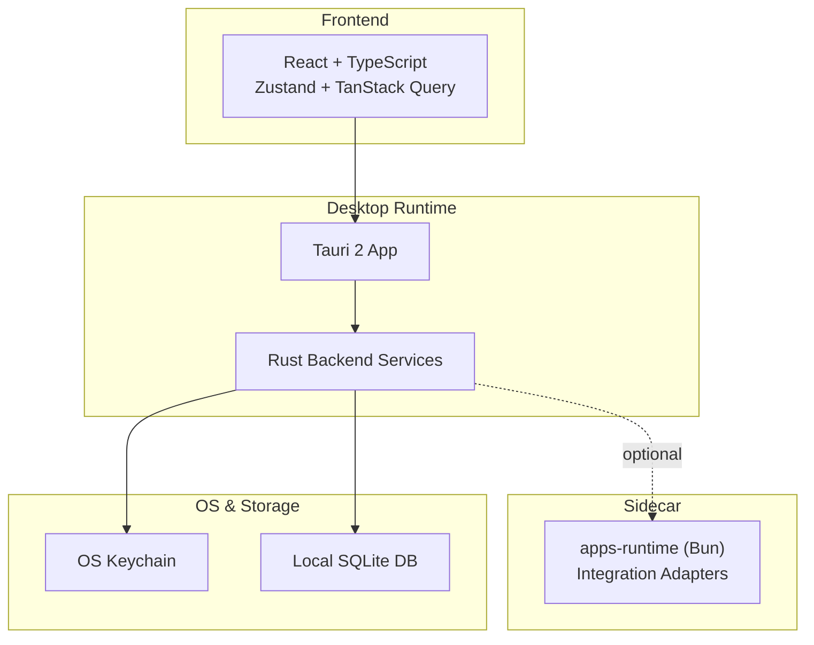
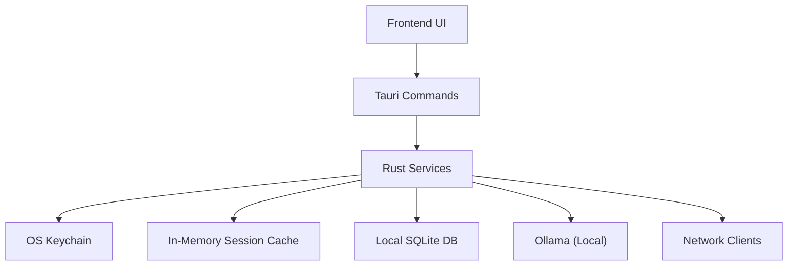
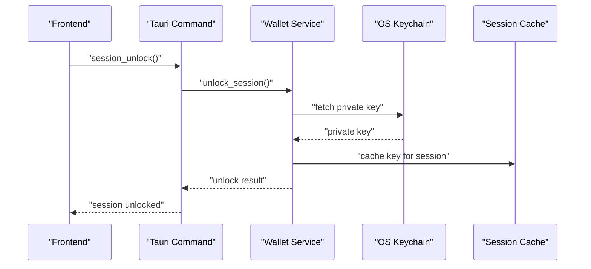
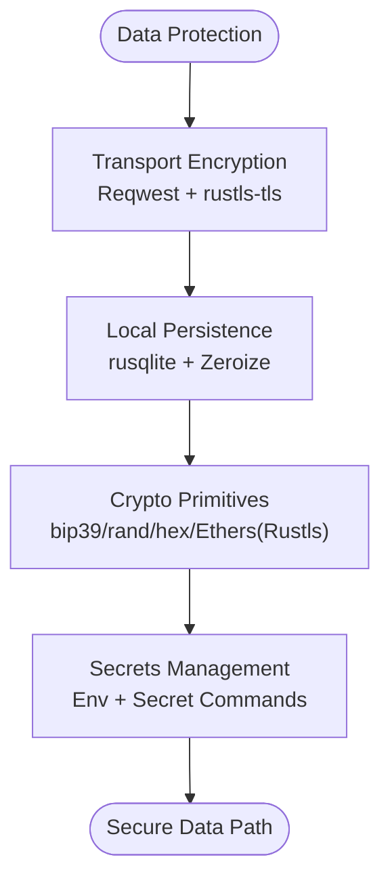
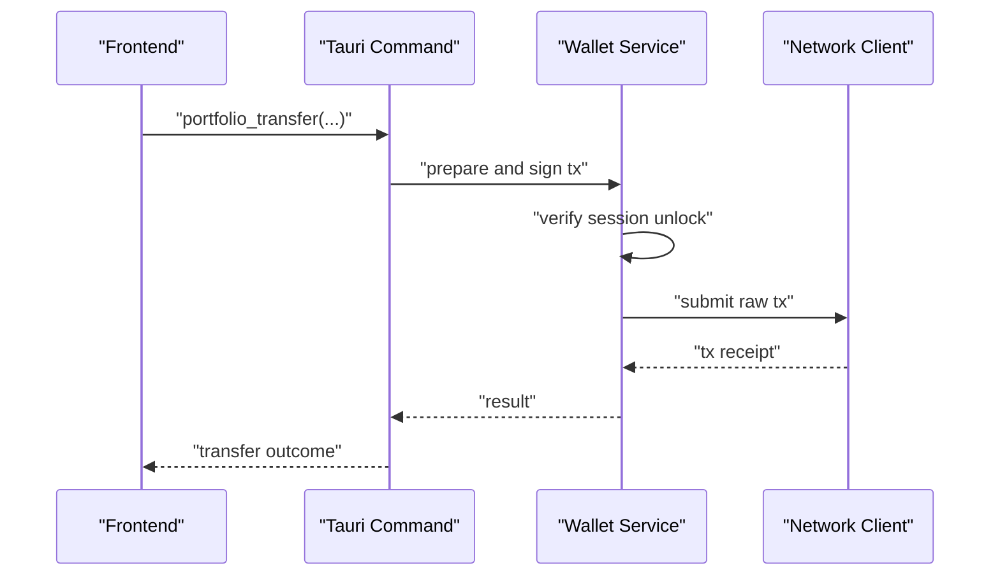
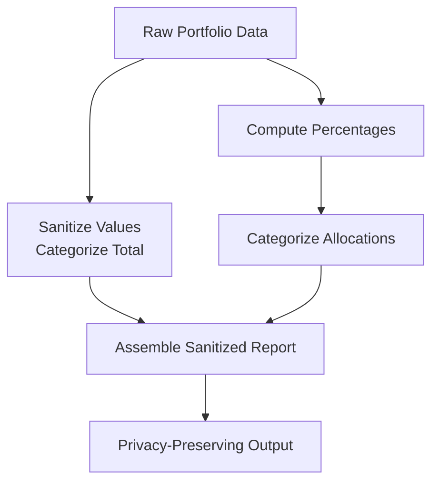
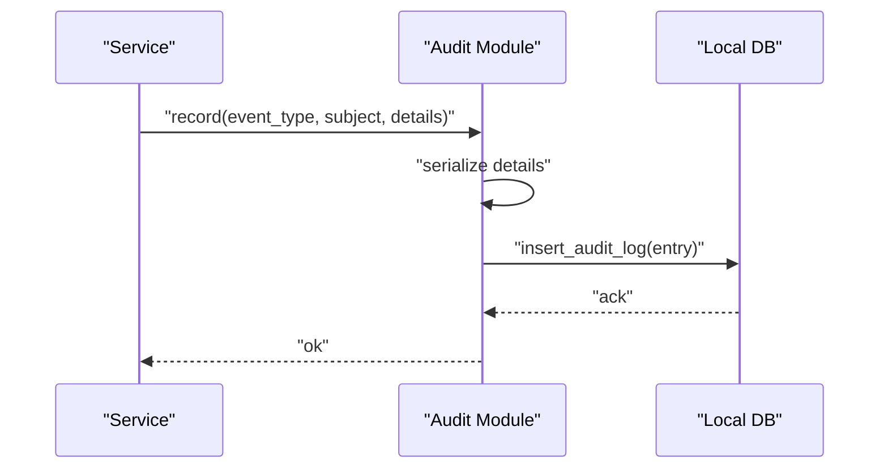
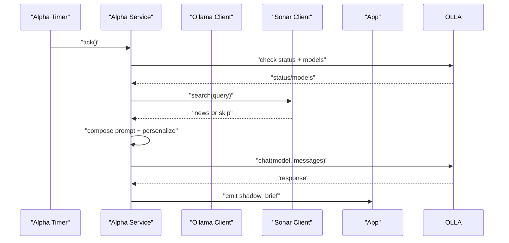
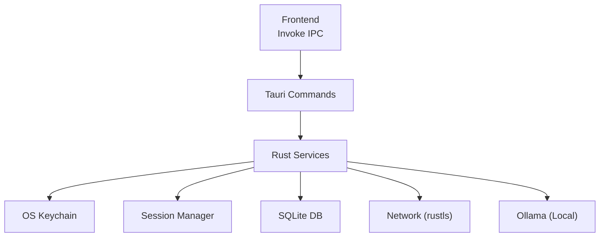
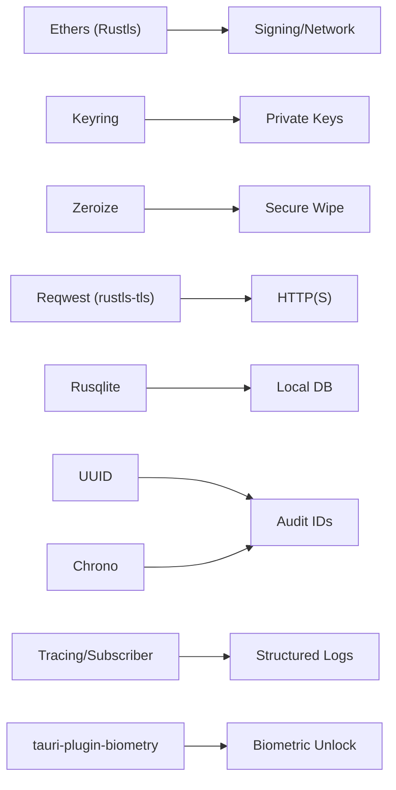

# Security Framework

<cite>
**Referenced Files in This Document**
- [README.md](file://README.md)
- [Cargo.toml](file://src-tauri/Cargo.toml)
- [lib.rs](file://src-tauri/src/lib.rs)
- [main.rs](file://src-tauri/src/main.rs)
- [anonymizer.rs](file://src-tauri/src/services/anonymizer.rs)
- [audit.rs](file://src-tauri/src/services/audit.rs)
- [alpha_service.rs](file://src-tauri/src/services/alpha_service.rs)
- [wallet.rs](file://src-tauri/src/commands/wallet.rs)
- [session.rs](file://src-tauri/src/session.rs)
- [guardrails.rs](file://src-tauri/src/services/guardrails.rs)
- [health_monitor.rs](file://src-tauri/src/services/health_monitor.rs)
</cite>

## Table of Contents
1. [Introduction](#introduction)
2. [Project Structure](#project-structure)
3. [Core Components](#core-components)
4. [Architecture Overview](#architecture-overview)
5. [Detailed Component Analysis](#detailed-component-analysis)
6. [Dependency Analysis](#dependency-analysis)
7. [Performance Considerations](#performance-considerations)
8. [Troubleshooting Guide](#troubleshooting-guide)
9. [Conclusion](#conclusion)
10. [Appendices](#appendices)

## Introduction
This document describes SHADOW Protocol’s security framework with a focus on privacy-first design and threat mitigation. The platform is a Tauri 2 desktop application with a React + TypeScript frontend and a Rust backend. Security is embedded across layers: OS keychain-backed private key storage, explicit approvals for sensitive actions, bounded session windows, local-first AI workflows, and modular services for portfolio, market, strategy, and integrations. The document explains OS keychain integration, encryption and data protection mechanisms, transaction security, anonymization systems, audit trail capabilities, compliance features, alpha service security, and privacy-preserving computation techniques. It also covers common DeFi threats, mitigation strategies, incident response, testing methodologies, vulnerability assessments, monitoring, best practices, and production hardening.

## Project Structure
The repository follows a layered architecture:
- Frontend: React 19, TypeScript, Vite, Tailwind, Zustand, TanStack Query, shadcn/ui
- Backend: Rust/Tauri 2, Tokio, Reqwest, Rusqlite, Ethers, Keyring, Zeroize, tauri-plugin-biometry
- Sidecar: apps-runtime with Bun for integration adapters (Lit, Flow, Filecoin)
- Documentation: Product and UI/UX docs

**Diagram sources**
- [lib.rs:40-190](file://src-tauri/src/lib.rs#L40-L190)
- [Cargo.toml:20-44](file://src-tauri/Cargo.toml#L20-L44)

**Section sources**
- [README.md:135-171](file://README.md#L135-L171)
- [lib.rs:40-190](file://src-tauri/src/lib.rs#L40-L190)
- [Cargo.toml:20-44](file://src-tauri/Cargo.toml#L20-L44)

## Core Components
- OS keychain integration for secure key storage and biometric-backed unlock
- In-memory session caching with bounded lifetime and clear-on-exit behavior
- Explicit approval checkpoints for sensitive actions
- Local-first AI workflows via Ollama to avoid sending sensitive data to external LLM providers
- Modular Rust services for portfolio, market, strategy, apps, and health monitoring
- Audit logging for compliance and forensics
- Anonymization pipeline for privacy-preserving portfolio sharing
- Alpha service for periodic, controlled market synthesis and brief emission

Key security-relevant crates and features:
- Ethers (Rustls), Keyring, Zeroize, bip39, rand, hex
- Reqwest (rustls-tls), Tokio, Rusqlite, UUID, Chrono, Tracing/Subscriber
- tauri-plugin-biometry, tauri-plugin-opener

**Section sources**
- [README.md:98-132](file://README.md#L98-L132)
- [README.md:173-188](file://README.md#L173-L188)
- [Cargo.toml:27-44](file://src-tauri/Cargo.toml#L27-L44)

## Architecture Overview
The security architecture is centered on local-first principles:
- Sensitive state remains on the local machine; signing and session logic are Rust-owned
- Unlock is handled in Rust, not the React layer
- Private keys are stored in OS-backed secure storage; addresses are stored separately as non-secret
- Unlocked keys are cached in memory only for a limited session window
- Explicit approvals gate sensitive operations
- Local AI posture keeps sensitive context off hosted LLM APIs by default

**Diagram sources**
- [lib.rs:40-190](file://src-tauri/src/lib.rs#L40-L190)
- [README.md:173-188](file://README.md#L173-L188)

## Detailed Component Analysis

### OS Keychain Integration and Secure Key Storage
- Private keys are stored in OS-backed secure storage via the keyring crate.
- Wallet addresses are stored separately as a non-secret list.
- Unlock is performed in Rust, not the React layer, ensuring sensitive operations remain backend-side.
- Unlocked keys are cached in memory only during the session window and cleared on exit.

**Diagram sources**
- [lib.rs:90-190](file://src-tauri/src/lib.rs#L90-L190)
- [wallet.rs](file://src-tauri/src/commands/wallet.rs)
- [session.rs](file://src-tauri/src/session.rs)

**Section sources**
- [README.md:98-104](file://README.md#L98-L104)
- [Cargo.toml:27-33](file://src-tauri/Cargo.toml#L27-L33)

### Encryption Mechanisms and Data Protection
- Transport encryption: Reqwest with rustls-tls for secure network requests.
- Local encryption: Zeroize for secure memory wiping; rusqlite with bundled SQLite for local persistence.
- Cryptographic primitives: Ethers (Rustls), bip39, rand, hex for mnemonic and key operations.
- Secrets management: Environment-based configuration and secret commands for API keys.

**Diagram sources**
- [Cargo.toml:34-40](file://src-tauri/Cargo.toml#L34-L40)
- [lib.rs:40-190](file://src-tauri/src/lib.rs#L40-L190)

**Section sources**
- [Cargo.toml:27-40](file://src-tauri/Cargo.toml#L27-L40)

### Transaction Security Measures
- Real EVM transfer flow is implemented.
- Explicit approvals are enforced before sensitive actions.
- Session-based unlock gates signing operations.
- Network clients use rustls for transport security.

**Diagram sources**
- [lib.rs:130-132](file://src-tauri/src/lib.rs#L130-L132)
- [wallet.rs](file://src-tauri/src/commands/wallet.rs)

**Section sources**
- [README.md:77-77](file://README.md#L77-L77)

### Anonymization Systems
- Portfolio sanitization converts exact balances to relative categories and percentages.
- Removes identifying addresses and emits sanitized summaries for remote AI processing.

**Diagram sources**
- [anonymizer.rs:7-28](file://src-tauri/src/services/anonymizer.rs#L7-L28)

**Section sources**
- [anonymizer.rs:1-56](file://src-tauri/src/services/anonymizer.rs#L1-L56)

### Audit Trail Capabilities
- Structured audit log entries with event type, subject, identifiers, serialized details, and timestamps.
- Stored in local database for compliance and forensics.

**Diagram sources**
- [audit.rs:5-24](file://src-tauri/src/services/audit.rs#L5-L24)

**Section sources**
- [audit.rs:1-25](file://src-tauri/src/services/audit.rs#L1-L25)

### Compliance Features
- Explicit approvals and audit logs support regulatory and internal compliance needs.
- Local-first AI posture reduces data residency risks.
- Bounded session windows and clear-on-exit behavior minimize exposure windows.

**Section sources**
- [README.md:173-188](file://README.md#L173-L188)
- [audit.rs:1-25](file://src-tauri/src/services/audit.rs#L1-L25)

### Alpha Service Security
- Periodic background synthesis using local Ollama models.
- Graceful handling of missing models or API keys; emits warnings instead of errors for expected conditions.
- Emits a “shadow_brief” event with optional opportunity metadata.

**Diagram sources**
- [alpha_service.rs:27-130](file://src-tauri/src/services/alpha_service.rs#L27-L130)

**Section sources**
- [alpha_service.rs:1-143](file://src-tauri/src/services/alpha_service.rs#L1-L143)

### Privacy-Preserving Computation Techniques
- Local AI workflows via Ollama keep sensitive context off external LLM providers.
- Anonymization transforms exact values into categories and percentages.
- Explicit approvals and bounded sessions reduce risk of unintended exposure.

**Section sources**
- [README.md:173-188](file://README.md#L173-L188)
- [anonymizer.rs:1-56](file://src-tauri/src/services/anonymizer.rs#L1-L56)

### Security Architecture Across Layers
- Frontend security: Tauri invoke-based IPC, no direct network calls, minimal state in memory, explicit approval UIs.
- Backend security: Rust-owned sensitive operations, OS keychain, Zeroize, bounded session windows, strict command handlers.
- Data protection: rustls transport, rusqlite persistence, secret commands, environment-based configuration.

**Diagram sources**
- [lib.rs:40-190](file://src-tauri/src/lib.rs#L40-L190)
- [Cargo.toml:27-40](file://src-tauri/Cargo.toml#L27-L40)

**Section sources**
- [lib.rs:40-190](file://src-tauri/src/lib.rs#L40-L190)
- [Cargo.toml:27-40](file://src-tauri/Cargo.toml#L27-L40)

## Dependency Analysis
Security-related dependencies and their roles:
- Ethers (Rustls): cryptographic operations and secure transport
- Keyring: OS-backed secure storage for private keys
- Zeroize: secure memory wiping
- Reqwest (rustls-tls): secure HTTP client
- Rusqlite: local database with bundled SQLite
- UUID, Chrono: identifiers and timestamps for audit logs
- Tracing/Subscriber: structured logging for observability
- tauri-plugin-biometry: biometric unlock capability

**Diagram sources**
- [Cargo.toml:27-44](file://src-tauri/Cargo.toml#L27-L44)

**Section sources**
- [Cargo.toml:27-44](file://src-tauri/Cargo.toml#L27-L44)

## Performance Considerations
- Use bounded concurrency for async tasks and timers to avoid resource exhaustion.
- Batch and throttle network calls (e.g., alpha service interval) to balance responsiveness and cost.
- Prefer local AI inference to reduce latency and external dependencies.
- Minimize memory retention by leveraging Zeroize and bounded session windows.

## Troubleshooting Guide
Common issues and mitigations:
- Ollama not running or no models installed: The alpha service gracefully skips synthesis and logs warnings; ensure Ollama is installed and models are pulled.
- Missing API keys: The alpha service treats missing keys as expected failures; configure keys via secret commands.
- Session expiration: The session manager prunes expired sessions periodically; ensure unlock is performed before sensitive operations.
- Network connectivity: Use rustls-enabled clients; verify TLS handshakes and timeouts.

Operational references:
- Alpha service error handling and expected failure classification
- Session pruning on interval
- Audit logging for forensics

**Section sources**
- [alpha_service.rs:59-69](file://src-tauri/src/services/alpha_service.rs#L59-L69)
- [lib.rs:50-63](file://src-tauri/src/lib.rs#L50-L63)
- [audit.rs:1-25](file://src-tauri/src/services/audit.rs#L1-L25)

## Conclusion
SHADOW Protocol’s security framework emphasizes local-first design, OS-backed key storage, explicit approvals, and privacy-preserving computation. The Rust backend enforces sensitive operations, while the frontend remains thin and secure. The anonymization pipeline, audit trails, and alpha service demonstrate practical privacy and compliance features. By combining robust cryptography, bounded sessions, and local AI, the platform mitigates common DeFi threats and supports secure production operations.

## Appendices

### Common DeFi Threats and Mitigations
- Private key theft: Use OS keychain storage and biometric unlock; avoid storing keys in browser or plain files.
- Man-in-the-middle attacks: Enforce rustls for all network clients; validate certificates.
- Re-entrancy and front-running: Gate sensitive actions behind explicit approvals; use bounded session windows.
- Data leakage: Keep sensitive context local via Ollama; sanitize data before sharing.
- Supply chain attacks: Pin dependencies and use staticlibs; monitor crates and CI.

### Incident Response Procedures
- Detect anomalies via structured logs and audit entries.
- Immediately lock sessions and revoke ephemeral tokens.
- Rotate secrets and re-key where applicable.
- Notify stakeholders and document timeline per audit records.
- Conduct post-mortem and update guardrails.

### Security Testing Methodologies
- Static analysis: Clippy strictness and cargo clippy with deny(warnings).
- Dynamic analysis: Unit and integration tests for Rust services.
- Penetration testing: Controlled environment with mock networks and databases.
- Fuzzing: Inputs for anonymization and parsing logic.

### Vulnerability Assessment Processes
- Dependency review: Audit Cargo.lock and update promptly.
- Secret scanning: Scan for exposed keys in code and configs.
- Access reviews: Limit who can access OS keychain and local DB.

### Security Monitoring Systems
- Structured logging with Tracing/Subscriber.
- Health monitor service for runtime checks.
- Guardrails service to enforce policy boundaries.

**Section sources**
- [health_monitor.rs](file://src-tauri/src/services/health_monitor.rs)
- [guardrails.rs](file://src-tauri/src/services/guardrails.rs)