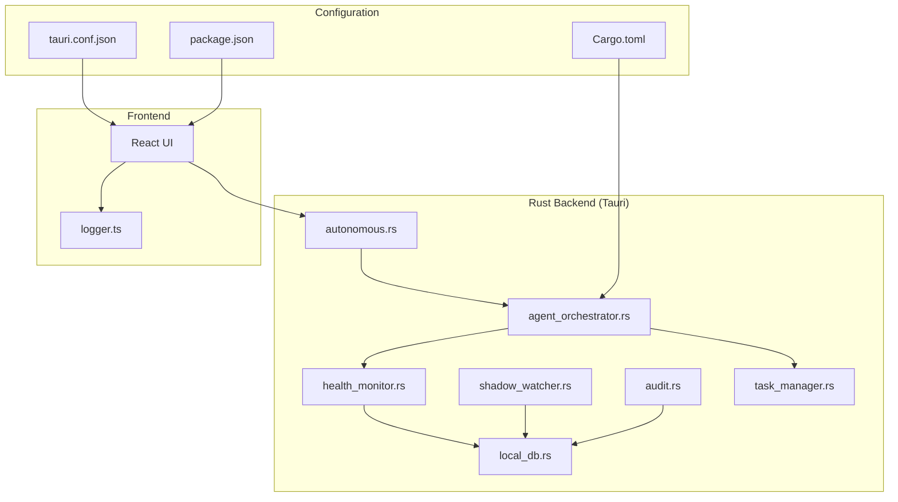
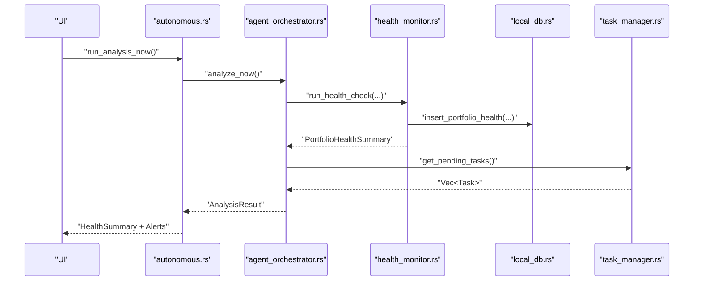
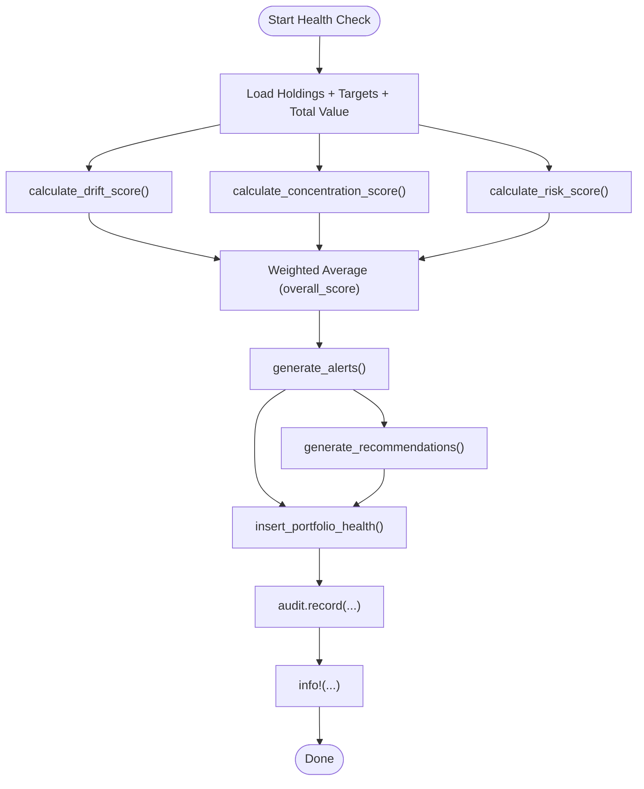
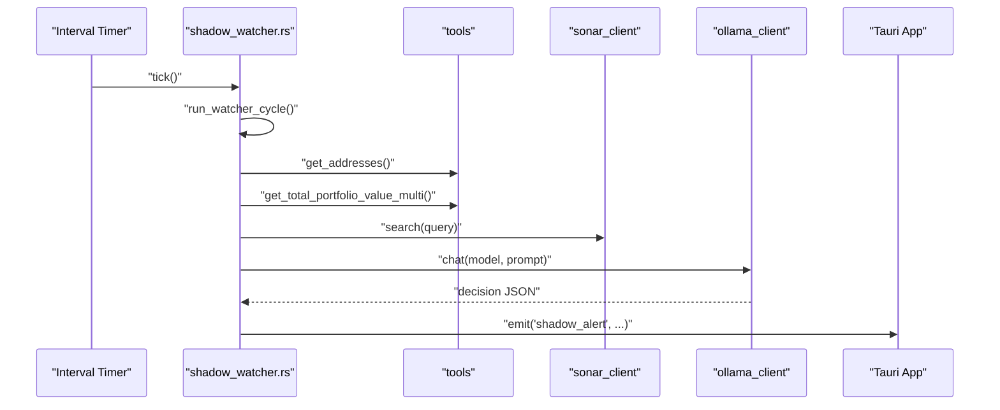
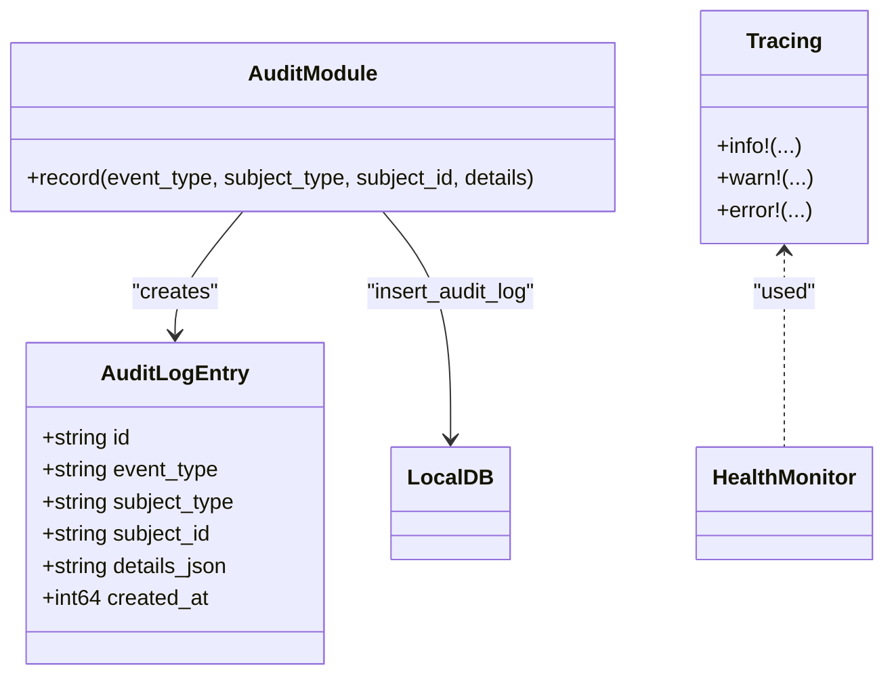
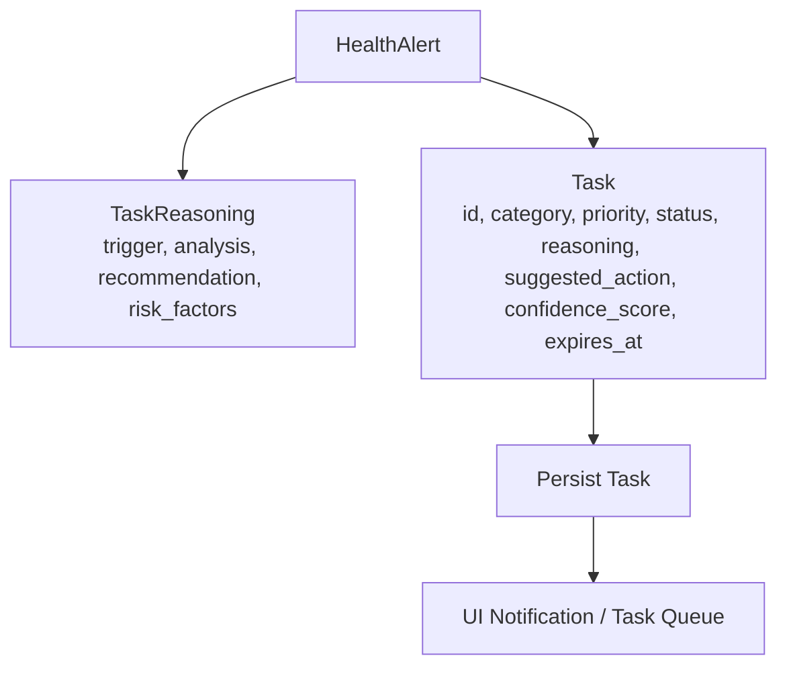
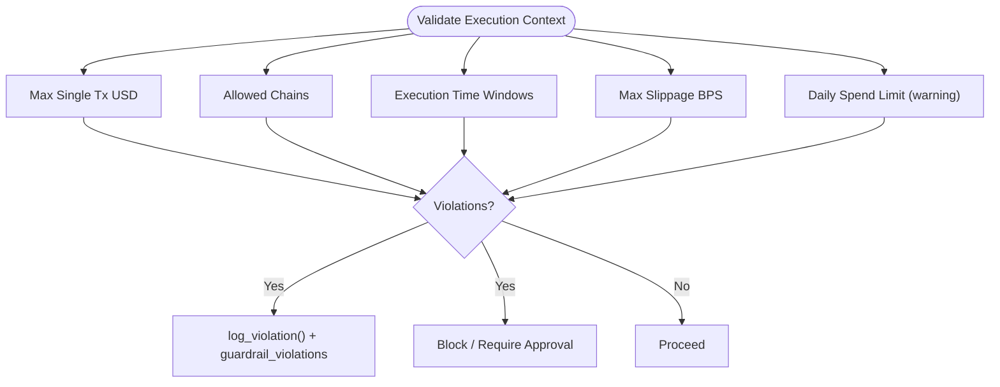
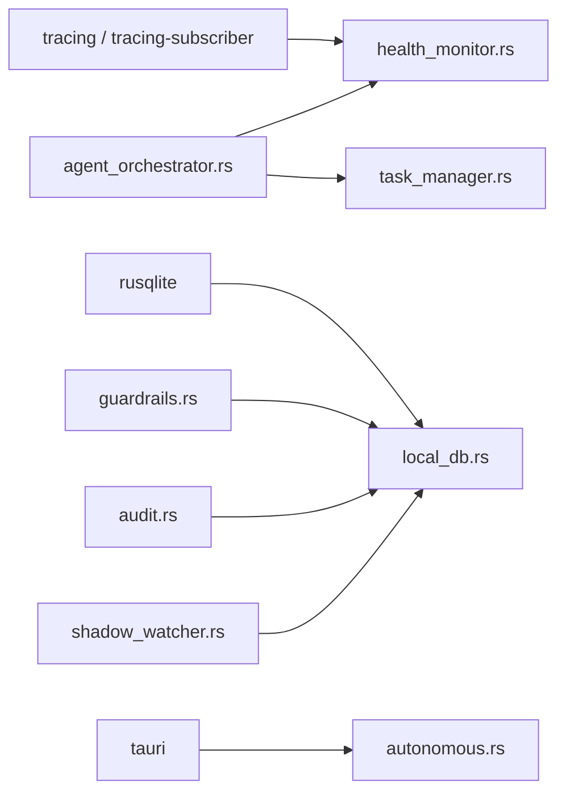

# Security Testing & Monitoring

<cite>
**Referenced Files in This Document**
- [health_monitor.rs](file://src-tauri/src/services/health_monitor.rs)
- [shadow_watcher.rs](file://src-tauri/src/services/shadow_watcher.rs)
- [audit.rs](file://src-tauri/src/services/audit.rs)
- [local_db.rs](file://src-tauri/src/services/local_db.rs)
- [task_manager.rs](file://src-tauri/src/services/task_manager.rs)
- [agent_orchestrator.rs](file://src-tauri/src/services/agent_orchestrator.rs)
- [autonomous.rs](file://src-tauri/src/commands/autonomous.rs)
- [logger.ts](file://src/lib/logger.ts)
- [Cargo.toml](file://src-tauri/Cargo.toml)
- [tauri.conf.json](file://src-tauri/tauri.conf.json)
- [package.json](file://package.json)
</cite>

## Table of Contents
1. [Introduction](#introduction)
2. [Project Structure](#project-structure)
3. [Core Components](#core-components)
4. [Architecture Overview](#architecture-overview)
5. [Detailed Component Analysis](#detailed-component-analysis)
6. [Dependency Analysis](#dependency-analysis)
7. [Performance Considerations](#performance-considerations)
8. [Troubleshooting Guide](#troubleshooting-guide)
9. [Conclusion](#conclusion)
10. [Appendices](#appendices)

## Introduction
This document describes SHADOW Protocol’s security testing and monitoring infrastructure as evidenced by the repository. It covers:
- Security testing methodologies grounded in the codebase: health monitoring, anomaly detection via watchers, guardrails, and validation.
- Continuous security monitoring: real-time threat detection, system health monitoring, and security event correlation.
- Logging and monitoring infrastructure: structured logging, audit trails, and local persistence.
- Health monitoring services: anomaly detection, performance degradation indicators, and security incident triggers.
- Automated security testing integration: guardrails and validation integrated into strategy execution and orchestration.
- Incident response and alerting: alert generation, task creation, and user notifications.
- Metrics and dashboards: health summaries, alert counts, and recommendations surfaced to the UI.
- Guidance for setup, interpretation, and response.

## Project Structure
Security-relevant components are primarily located in the Rust backend (Tauri) under src-tauri/src/services and src-tauri/src/commands, with UI exposure via Tauri commands. Logging and persistence are handled locally via tracing and SQLite.

**Diagram sources**
- [health_monitor.rs:106-221](file://src-tauri/src/services/health_monitor.rs#L106-L221)
- [shadow_watcher.rs:29-61](file://src-tauri/src/services/shadow_watcher.rs#L29-L61)
- [audit.rs:5-24](file://src-tauri/src/services/audit.rs#L5-L24)
- [local_db.rs:10-416](file://src-tauri/src/services/local_db.rs#L10-L416)
- [task_manager.rs:264-303](file://src-tauri/src/services/task_manager.rs#L264-L303)
- [agent_orchestrator.rs:493-532](file://src-tauri/src/services/agent_orchestrator.rs#L493-L532)
- [autonomous.rs:372-478](file://src-tauri/src/commands/autonomous.rs#L372-L478)
- [logger.ts:1-6](file://src/lib/logger.ts#L1-L6)
- [tauri.conf.json:32-34](file://src-tauri/tauri.conf.json#L32-L34)
- [package.json:6-17](file://package.json#L6-L17)
- [Cargo.toml:20-44](file://src-tauri/Cargo.toml#L20-L44)

**Section sources**
- [health_monitor.rs:106-221](file://src-tauri/src/services/health_monitor.rs#L106-L221)
- [shadow_watcher.rs:29-61](file://src-tauri/src/services/shadow_watcher.rs#L29-L61)
- [audit.rs:5-24](file://src-tauri/src/services/audit.rs#L5-L24)
- [local_db.rs:10-416](file://src-tauri/src/services/local_db.rs#L10-L416)
- [task_manager.rs:264-303](file://src-tauri/src/services/task_manager.rs#L264-L303)
- [agent_orchestrator.rs:493-532](file://src-tauri/src/services/agent_orchestrator.rs#L493-L532)
- [autonomous.rs:372-478](file://src-tauri/src/commands/autonomous.rs#L372-L478)
- [logger.ts:1-6](file://src/lib/logger.ts#L1-L6)
- [tauri.conf.json:32-34](file://src-tauri/tauri.conf.json#L32-L34)
- [package.json:6-17](file://package.json#L6-L17)
- [Cargo.toml:20-44](file://src-tauri/Cargo.toml#L20-L44)

## Core Components
- Health Monitor: Computes portfolio health scores, generates alerts, and persists records.
- Shadow Watcher: Periodic background monitoring that evaluates news and risks using local LLMs and emits alerts.
- Audit Trail: Centralized logging of events with structured details.
- Local Database: Structured persistence for health, tasks, strategies, and audit logs.
- Task Manager: Converts alerts into actionable tasks with confidence and expiration.
- Agent Orchestrator: Coordinates health checks, opportunity scans, and task retrieval.
- Commands: Exposes health summaries and orchestration controls to the UI.
- Logging: Frontend error logging helper and backend tracing stack.

**Section sources**
- [health_monitor.rs:106-221](file://src-tauri/src/services/health_monitor.rs#L106-L221)
- [shadow_watcher.rs:29-61](file://src-tauri/src/services/shadow_watcher.rs#L29-L61)
- [audit.rs:5-24](file://src-tauri/src/services/audit.rs#L5-L24)
- [local_db.rs:10-416](file://src-tauri/src/services/local_db.rs#L10-L416)
- [task_manager.rs:264-303](file://src-tauri/src/services/task_manager.rs#L264-L303)
- [agent_orchestrator.rs:493-532](file://src-tauri/src/services/agent_orchestrator.rs#L493-L532)
- [autonomous.rs:372-478](file://src-tauri/src/commands/autonomous.rs#L372-L478)
- [logger.ts:1-6](file://src/lib/logger.ts#L1-L6)

## Architecture Overview
The system integrates health monitoring, risk watching, guardrails, and tasking into a cohesive pipeline. The UI invokes Tauri commands to trigger analysis and receive health summaries. Results are persisted and correlated to drive alerts and tasks.

**Diagram sources**
- [autonomous.rs:663-678](file://src-tauri/src/commands/autonomous.rs#L663-L678)
- [agent_orchestrator.rs:493-532](file://src-tauri/src/services/agent_orchestrator.rs#L493-L532)
- [health_monitor.rs:106-221](file://src-tauri/src/services/health_monitor.rs#L106-L221)
- [local_db.rs:10-416](file://src-tauri/src/services/local_db.rs#L10-L416)
- [task_manager.rs:264-303](file://src-tauri/src/services/task_manager.rs#L264-L303)

## Detailed Component Analysis

### Health Monitoring Pipeline
The health monitor computes drift, concentration, performance, and risk scores, produces alerts, and persists results. It also records audit events and logs outcomes.

**Diagram sources**
- [health_monitor.rs:106-221](file://src-tauri/src/services/health_monitor.rs#L106-L221)
- [audit.rs:5-24](file://src-tauri/src/services/audit.rs#L5-L24)

**Section sources**
- [health_monitor.rs:106-221](file://src-tauri/src/services/health_monitor.rs#L106-L221)
- [audit.rs:5-24](file://src-tauri/src/services/audit.rs#L5-L24)
- [local_db.rs:348-362](file://src-tauri/src/services/local_db.rs#L348-L362)

### Shadow Watcher (Proactive Risk Monitoring)
The watcher periodically queries top assets, anonymizes portfolio context, searches for recent news, evaluates risk via a local LLM, and emits alerts when warranted.

**Diagram sources**
- [shadow_watcher.rs:29-61](file://src-tauri/src/services/shadow_watcher.rs#L29-L61)
- [shadow_watcher.rs:77-160](file://src-tauri/src/services/shadow_watcher.rs#L77-L160)

**Section sources**
- [shadow_watcher.rs:29-61](file://src-tauri/src/services/shadow_watcher.rs#L29-L61)
- [shadow_watcher.rs:77-160](file://src-tauri/src/services/shadow_watcher.rs#L77-L160)

### Audit Trail and Logging
Audit entries capture structured event details and are persisted to the local database. The backend uses tracing for structured logging.

**Diagram sources**
- [audit.rs:5-24](file://src-tauri/src/services/audit.rs#L5-L24)
- [local_db.rs:169-176](file://src-tauri/src/services/local_db.rs#L169-L176)
- [health_monitor.rs:208-218](file://src-tauri/src/services/health_monitor.rs#L208-L218)
- [Cargo.toml:41-42](file://src-tauri/Cargo.toml#L41-L42)

**Section sources**
- [audit.rs:5-24](file://src-tauri/src/services/audit.rs#L5-L24)
- [local_db.rs:169-176](file://src-tauri/src/services/local_db.rs#L169-L176)
- [health_monitor.rs:208-218](file://src-tauri/src/services/health_monitor.rs#L208-L218)
- [Cargo.toml:41-42](file://src-tauri/Cargo.toml#L41-L42)

### Task Generation from Alerts
Alerts are transformed into tasks with confidence, reasoning, and expiration. This enables automated triage and follow-up.

**Diagram sources**
- [task_manager.rs:264-303](file://src-tauri/src/services/task_manager.rs#L264-L303)

**Section sources**
- [task_manager.rs:264-303](file://src-tauri/src/services/task_manager.rs#L264-L303)

### Guardrails and Validation
Guardrails enforce constraints on execution (value caps, chains, time windows, slippage, approvals). Violations are recorded and can block or require approval.

**Diagram sources**
- [guardrails.rs:311-426](file://src-tauri/src/services/guardrails.rs#L311-L426)
- [local_db.rs:372-382](file://src-tauri/src/services/local_db.rs#L372-L382)

**Section sources**
- [guardrails.rs:311-426](file://src-tauri/src/services/guardrails.rs#L311-L426)
- [local_db.rs:372-382](file://src-tauri/src/services/local_db.rs#L372-L382)

### Security Testing Methodologies
- Penetration Testing: The repository does not include dedicated penetration testing scripts or scanners. Security posture relies on guardrails, CSP, and local auditing.
- Vulnerability Scanning: No embedded scanner is present. Risk evaluation leverages external APIs (Sonar) and local LLM evaluation.
- Security Code Review: Guardrails and validation logic act as automated gatekeepers during strategy execution and compilation.

**Section sources**
- [tauri.conf.json:32-34](file://src-tauri/tauri.conf.json#L32-L34)
- [shadow_watcher.rs:104-143](file://src-tauri/src/services/shadow_watcher.rs#L104-L143)
- [guardrails.rs:311-426](file://src-tauri/src/services/guardrails.rs#L311-L426)

### Continuous Security Monitoring
- Real-time Threat Detection: Shadow Watcher periodically evaluates news and LLM decisions to emit alerts.
- System Health Monitoring: Health Monitor computes scores and generates recommendations; Orchestrator surfaces these to the UI.
- Security Event Correlation: Audit logs and health records are persisted; tasks correlate alerts to remediation actions.

**Section sources**
- [shadow_watcher.rs:29-61](file://src-tauri/src/services/shadow_watcher.rs#L29-L61)
- [health_monitor.rs:106-221](file://src-tauri/src/services/health_monitor.rs#L106-L221)
- [audit.rs:5-24](file://src-tauri/src/services/audit.rs#L5-L24)
- [task_manager.rs:264-303](file://src-tauri/src/services/task_manager.rs#L264-L303)

### Logging and Monitoring Infrastructure
- Structured Logging: Tracing is enabled; health checks and watcher cycles log at info/warn/error levels.
- SIEM: No SIEM integration is present in the repository. Audit logs and health records are stored locally.
- Distributed Tracing: No distributed tracing library is imported; local tracing suffices for the current scope.

**Section sources**
- [Cargo.toml:41-42](file://src-tauri/Cargo.toml#L41-L42)
- [health_monitor.rs:208-218](file://src-tauri/src/services/health_monitor.rs#L208-L218)
- [shadow_watcher.rs:46-58](file://src-tauri/src/services/shadow_watcher.rs#L46-L58)

### Health Monitoring Services
- Anomaly Detection: Drift and concentration thresholds trigger alerts; risk thresholds flag high-risk portfolios.
- Performance Degradation: Placeholder performance score; recommendations incorporate drift magnitude.
- Security Incidents: Watcher alerts surface critical news impacting positions.

**Section sources**
- [health_monitor.rs:349-427](file://src-tauri/src/services/health_monitor.rs#L349-L427)
- [shadow_watcher.rs:104-157](file://src-tauri/src/services/shadow_watcher.rs#L104-L157)

### Automated Security Testing Integration
- CI/CD Pipelines: No CI/CD configuration files are present in the repository.
- Security Regression Testing: Guardrails and validation are invoked during strategy execution and compilation.
- Compliance Validation: Guardrails include explicit checks for positive limits and allowed chains; violations are recorded.

**Section sources**
- [guardrails.rs:294-340](file://src-tauri/src/services/guardrails.rs#L294-L340)
- [local_db.rs:372-382](file://src-tauri/src/services/local_db.rs#L372-L382)

### Incident Response Procedures
- Alerting: Watcher emits structured alerts; Health Monitor persists records and audit events.
- Forensic Investigation: Audit logs and reasoning chains provide context for decisions.
- Remediation: Tasks are generated with confidence and expiration; UI can surface recommendations.

**Section sources**
- [shadow_watcher.rs:146-156](file://src-tauri/src/services/shadow_watcher.rs#L146-L156)
- [health_monitor.rs:186-220](file://src-tauri/src/services/health_monitor.rs#L186-L220)
- [audit.rs:5-24](file://src-tauri/src/services/audit.rs#L5-L24)
- [task_manager.rs:264-303](file://src-tauri/src/services/task_manager.rs#L264-L303)

### Security Metrics Collection and Dashboards
- Metrics: HealthSummary exposes overall and component scores, alert counts, and recommendations.
- Dashboard: UI receives HealthSummary and displays scores, alerts, and recommendations.

**Section sources**
- [autonomous.rs:372-478](file://src-tauri/src/commands/autonomous.rs#L372-L478)
- [agent_orchestrator.rs:493-532](file://src-tauri/src/services/agent_orchestrator.rs#L493-L532)

## Dependency Analysis
The backend depends on tracing for logging, SQLite for persistence, and Tauri for UI integration. Guardrails and validation depend on configuration and context.

**Diagram sources**
- [Cargo.toml:41-42](file://src-tauri/Cargo.toml#L41-L42)
- [local_db.rs:10-416](file://src-tauri/src/services/local_db.rs#L10-L416)
- [tauri.conf.json:32-34](file://src-tauri/tauri.conf.json#L32-L34)
- [guardrails.rs:311-426](file://src-tauri/src/services/guardrails.rs#L311-L426)
- [audit.rs:5-24](file://src-tauri/src/services/audit.rs#L5-L24)
- [agent_orchestrator.rs:493-532](file://src-tauri/src/services/agent_orchestrator.rs#L493-L532)
- [task_manager.rs:264-303](file://src-tauri/src/services/task_manager.rs#L264-L303)
- [shadow_watcher.rs:29-61](file://src-tauri/src/services/shadow_watcher.rs#L29-L61)

**Section sources**
- [Cargo.toml:41-42](file://src-tauri/Cargo.toml#L41-L42)
- [local_db.rs:10-416](file://src-tauri/src/services/local_db.rs#L10-L416)
- [tauri.conf.json:32-34](file://src-tauri/tauri.conf.json#L32-L34)
- [guardrails.rs:311-426](file://src-tauri/src/services/guardrails.rs#L311-L426)
- [audit.rs:5-24](file://src-tauri/src/services/audit.rs#L5-L24)
- [agent_orchestrator.rs:493-532](file://src-tauri/src/services/agent_orchestrator.rs#L493-L532)
- [task_manager.rs:264-303](file://src-tauri/src/services/task_manager.rs#L264-L303)
- [shadow_watcher.rs:29-61](file://src-tauri/src/services/shadow_watcher.rs#L29-L61)

## Performance Considerations
- Watcher intervals: The watcher runs every 30 minutes; adjust interval based on risk appetite and resource constraints.
- LLM evaluations: Local LLM calls are asynchronous; ensure timeouts and retries are configured externally.
- Database writes: Health and audit writes occur on each cycle; batching could reduce contention if needed.
- Tracing overhead: Enable appropriate filters in production to minimize logging overhead.

[No sources needed since this section provides general guidance]

## Troubleshooting Guide
- Watcher skips cycles: Expected failures (missing services, empty data) are logged at warn level; unexpected errors are logged at error level.
- Health check failures: Errors are captured in AnalysisResult; inspect latest health record and audit logs.
- Guardrail violations: Review guardrail_violations and reasoning chains for blocked actions.
- Frontend logging: Use the frontend logger helper in development to capture errors.

**Section sources**
- [shadow_watcher.rs:46-58](file://src-tauri/src/services/shadow_watcher.rs#L46-L58)
- [agent_orchestrator.rs:521-532](file://src-tauri/src/services/agent_orchestrator.rs#L521-L532)
- [local_db.rs:372-382](file://src-tauri/src/services/local_db.rs#L372-L382)
- [logger.ts:1-6](file://src/lib/logger.ts#L1-L6)

## Conclusion
SHADOW Protocol’s security monitoring is centered on local health assessment, proactive risk watching, guardrails, and persistent audit trails. While the repository lacks CI/CD security scanning and SIEM integration, it provides robust guardrails, structured logging, and task-driven remediation. The UI receives health summaries and recommendations, enabling informed decision-making and incident response.

[No sources needed since this section summarizes without analyzing specific files]

## Appendices

### Setup Guidance
- Build and run the Tauri app using the provided scripts.
- Ensure local LLM (Ollama) and external services (Sonar) are reachable for watcher functionality.
- Configure CSP in tauri.conf.json to restrict origins as needed.
- Use tracing filters to control log verbosity in production.

**Section sources**
- [package.json:6-17](file://package.json#L6-L17)
- [tauri.conf.json:32-34](file://src-tauri/tauri.conf.json#L32-L34)
- [Cargo.toml:41-42](file://src-tauri/Cargo.toml#L41-L42)

### Interpreting Security Metrics
- Overall score: Composite health indicator; lower scores indicate higher risk.
- Component scores: Drift, concentration, performance, and risk weights.
- Alerts: Severity levels and affected assets; use recommendations to remediate.
- Task queue: Confidence and expiration help prioritize actions.

**Section sources**
- [autonomous.rs:372-478](file://src-tauri/src/commands/autonomous.rs#L372-L478)
- [health_monitor.rs:174-184](file://src-tauri/src/services/health_monitor.rs#L174-L184)
- [task_manager.rs:264-303](file://src-tauri/src/services/task_manager.rs#L264-L303)

### Responding to Security Incidents
- Review shadow alerts and health summaries.
- Inspect guardrail violations and reasoning chains.
- Generate tasks from alerts and track resolution.
- Audit logs provide context for forensics.

**Section sources**
- [shadow_watcher.rs:146-156](file://src-tauri/src/services/shadow_watcher.rs#L146-L156)
- [audit.rs:5-24](file://src-tauri/src/services/audit.rs#L5-L24)
- [guardrails.rs:405-426](file://src-tauri/src/services/guardrails.rs#L405-L426)