# Threat Protection & Anonymization

<cite>
**Referenced Files in This Document**
- [README.md](file://README.md)
- [AGENTS.md](file://AGENTS.md)
- [src-tauri/src/services/anonymizer.rs](file://src-tauri/src/services/anonymizer.rs)
- [src-tauri/src/services/guardrails.rs](file://src-tauri/src/services/guardrails.rs)
- [src-tauri/src/services/health_monitor.rs](file://src-tauri/src/services/health_monitor.rs)
- [src-tauri/src/services/alpha_service.rs](file://src-tauri/src/services/alpha_service.rs)
- [src-tauri/src/services/sonar_client.rs](file://src-tauri/src/services/sonar_client.rs)
- [src-tauri/src/services/ollama_client.rs](file://src-tauri/src/services/ollama_client.rs)
- [src-tauri/src/services/audit.rs](file://src-tauri/src/services/audit.rs)
- [src-tauri/src/services/local_db.rs](file://src-tauri/src/services/local_db.rs)
- [src-tauri/src/services/task_manager.rs](file://src-tauri/src/services/task_manager.rs)
- [src-tauri/src/services/agent_orchestrator.rs](file://src-tauri/src/services/agent_orchestrator.rs)
- [src-tauri/src/services/shadow_watcher.rs](file://src-tauri/src/services/shadow_watcher.rs)
- [src-tauri/src/commands/autonomous.rs](file://src-tauri/src/commands/autonomous.rs)
- [src/components/autonomous/HealthDashboard.tsx](file://src/components/autonomous/HealthDashboard.tsx)
- [src/constants/personaArchetypes.ts](file://src/constants/personaArchetypes.ts)
- [src/components/onboarding/steps/Step1HowItWorks.tsx](file://src/components/onboarding/steps/Step1HowItWorks.tsx)
- [src/components/onboarding/steps/Step2Architecture.tsx](file://src/components/onboarding/steps/Step2Architecture.tsx)
</cite>

## Table of Contents
1. [Introduction](#introduction)
2. [Project Structure](#project-structure)
3. [Core Components](#core-components)
4. [Architecture Overview](#architecture-overview)
5. [Detailed Component Analysis](#detailed-component-analysis)
6. [Dependency Analysis](#dependency-analysis)
7. [Performance Considerations](#performance-considerations)
8. [Troubleshooting Guide](#troubleshooting-guide)
9. [Conclusion](#conclusion)
10. [Appendices](#appendices)

## Introduction
This document explains SHADOW Protocol’s threat protection and anonymization systems. It covers:
- Privacy-preserving data sanitization for remote AI processing
- Guardrails that prevent unauthorized or risky actions
- Behavioral and portfolio health monitoring for anomaly detection
- Real-time threat detection and automated response pathways
- Guidance for configuring protections, interpreting alerts, and extending security controls

The project emphasizes local-first, privacy-first design with Rust-based security-critical services and on-device AI processing.

**Section sources**
- [README.md:1-48](file://README.md#L1-L48)
- [AGENTS.md:1-27](file://AGENTS.md#L1-L27)

## Project Structure
At a high level, the desktop application consists of:
- Frontend (React 19 + TypeScript) for user interfaces and onboarding
- Backend (Tauri 2 + Rust) for security-sensitive operations, guardrails, anonymization, and monitoring
- Local SQLite for persistence and audit trails
- Optional external integrations for market intelligence and local LLM orchestration

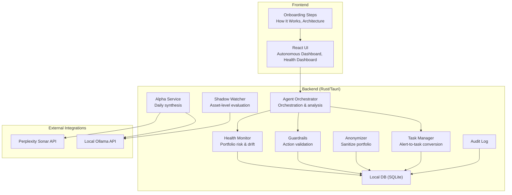

**Diagram sources**
- [src-tauri/src/services/alpha_service.rs:1-143](file://src-tauri/src/services/alpha_service.rs#L1-L143)
- [src-tauri/src/services/health_monitor.rs:1-573](file://src-tauri/src/services/health_monitor.rs#L1-L573)
- [src-tauri/src/services/shadow_watcher.rs:145-178](file://src-tauri/src/services/shadow_watcher.rs#L145-L178)
- [src-tauri/src/services/guardrails.rs:1-620](file://src-tauri/src/services/guardrails.rs#L1-L620)
- [src-tauri/src/services/anonymizer.rs:1-56](file://src-tauri/src/services/anonymizer.rs#L1-L56)
- [src-tauri/src/services/task_manager.rs:53-303](file://src-tauri/src/services/task_manager.rs#L53-L303)
- [src-tauri/src/services/agent_orchestrator.rs:474-570](file://src-tauri/src/services/agent_orchestrator.rs#L474-L570)
- [src-tauri/src/services/audit.rs:1-25](file://src-tauri/src/services/audit.rs#L1-L25)
- [src-tauri/src/services/local_db.rs:1-200](file://src-tauri/src/services/local_db.rs#L1-L200)
- [src-tauri/src/services/sonar_client.rs:1-78](file://src-tauri/src/services/sonar_client.rs#L1-L78)
- [src-tauri/src/services/ollama_client.rs:1-106](file://src-tauri/src/services/ollama_client.rs#L1-L106)

**Section sources**
- [README.md:1-48](file://README.md#L1-L48)
- [src/components/onboarding/steps/Step1HowItWorks.tsx:1-39](file://src/components/onboarding/steps/Step1HowItWorks.tsx#L1-L39)
- [src/components/onboarding/steps/Step2Architecture.tsx:1-49](file://src/components/onboarding/steps/Step2Architecture.tsx#L1-L49)

## Core Components
- Anonymizer: Converts precise portfolio values into relative categories to minimize leakage when sharing data with remote AI.
- Guardrails: Enforce user-defined constraints on autonomous actions (e.g., slippage, token/protocol blocks, time windows, kill switch).
- Health Monitor: Computes portfolio health scores, drift, concentration, and risk to surface anomalies and misalignments.
- Alpha Service: Periodic synthesis of market insights using local LLMs and external research APIs.
- Shadow Watcher: Asset-level evaluation and alert emission using local LLMs.
- Task Manager: Translates health alerts into actionable tasks with confidence and expiration.
- Agent Orchestrator: Coordinates health checks, opportunity scans, and task retrieval for on-demand analysis.
- Audit & Local DB: Persistent records of guardrail violations, health summaries, tasks, and audit logs.

**Section sources**
- [src-tauri/src/services/anonymizer.rs:1-56](file://src-tauri/src/services/anonymizer.rs#L1-L56)
- [src-tauri/src/services/guardrails.rs:1-620](file://src-tauri/src/services/guardrails.rs#L1-L620)
- [src-tauri/src/services/health_monitor.rs:1-573](file://src-tauri/src/services/health_monitor.rs#L1-L573)
- [src-tauri/src/services/alpha_service.rs:1-143](file://src-tauri/src/services/alpha_service.rs#L1-L143)
- [src-tauri/src/services/shadow_watcher.rs:145-178](file://src-tauri/src/services/shadow_watcher.rs#L145-L178)
- [src-tauri/src/services/task_manager.rs:53-303](file://src-tauri/src/services/task_manager.rs#L53-L303)
- [src-tauri/src/services/agent_orchestrator.rs:474-570](file://src-tauri/src/services/agent_orchestrator.rs#L474-L570)
- [src-tauri/src/services/audit.rs:1-25](file://src-tauri/src/services/audit.rs#L1-L25)
- [src-tauri/src/services/local_db.rs:1-200](file://src-tauri/src/services/local_db.rs#L1-L200)

## Architecture Overview
The system integrates external research and local LLMs to produce synthetic insights and health assessments, while enforcing guardrails and maintaining auditability.

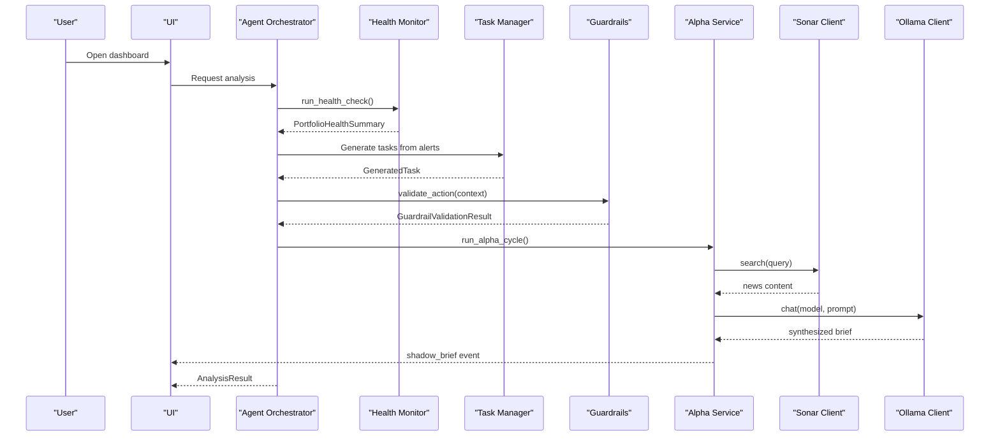

**Diagram sources**
- [src-tauri/src/services/agent_orchestrator.rs:474-570](file://src-tauri/src/services/agent_orchestrator.rs#L474-L570)
- [src-tauri/src/services/health_monitor.rs:107-221](file://src-tauri/src/services/health_monitor.rs#L107-L221)
- [src-tauri/src/services/task_manager.rs:264-303](file://src-tauri/src/services/task_manager.rs#L264-L303)
- [src-tauri/src/services/guardrails.rs:277-426](file://src-tauri/src/services/guardrails.rs#L277-L426)
- [src-tauri/src/services/alpha_service.rs:71-130](file://src-tauri/src/services/alpha_service.rs#L71-L130)
- [src-tauri/src/services/sonar_client.rs:33-77](file://src-tauri/src/services/sonar_client.rs#L33-L77)
- [src-tauri/src/services/ollama_client.rs:46-105](file://src-tauri/src/services/ollama_client.rs#L46-L105)

## Detailed Component Analysis

### Anonymization Algorithms
The anonymizer transforms precise portfolio data into relative categories to minimize leakage:
- Removes exact addresses and balances
- Converts absolute values into categorical buckets (e.g., portfolio size tiers)
- Converts exact token balances into percentage ranges and labels

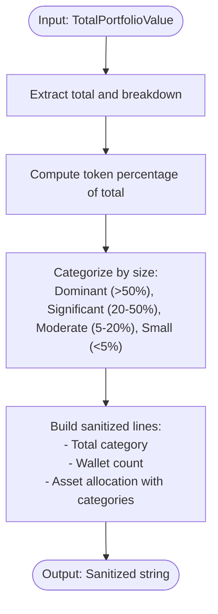

**Diagram sources**
- [src-tauri/src/services/anonymizer.rs:7-28](file://src-tauri/src/services/anonymizer.rs#L7-L28)
- [src-tauri/src/services/anonymizer.rs:30-55](file://src-tauri/src/services/anonymizer.rs#L30-L55)

**Section sources**
- [src-tauri/src/services/anonymizer.rs:1-56](file://src-tauri/src/services/anonymizer.rs#L1-L56)

### Guardrails System
Guardrails enforce user-configurable constraints before autonomous actions:
- Kill switch blocks all autonomous actions
- Portfolio floor, single-transaction cap, and slippage limits
- Allowed/Blocked chains, tokens, and protocols
- Execution windows and approval thresholds
- Violations are recorded in audit logs and persisted locally

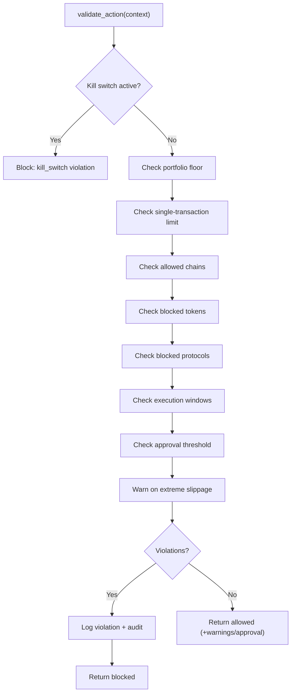

**Diagram sources**
- [src-tauri/src/services/guardrails.rs:277-426](file://src-tauri/src/services/guardrails.rs#L277-L426)
- [src-tauri/src/services/guardrails.rs:484-519](file://src-tauri/src/services/guardrails.rs#L484-L519)
- [src-tauri/src/services/local_db.rs:2436-2515](file://src-tauri/src/services/local_db.rs#L2436-L2515)
- [src-tauri/src/services/audit.rs:1-25](file://src-tauri/src/services/audit.rs#L1-L25)

**Section sources**
- [src-tauri/src/services/guardrails.rs:1-620](file://src-tauri/src/services/guardrails.rs#L1-L620)
- [src-tauri/src/services/local_db.rs:2436-2515](file://src-tauri/src/services/local_db.rs#L2436-L2515)
- [src-tauri/src/services/audit.rs:1-25](file://src-tauri/src/services/audit.rs#L1-L25)

### Behavioral and Portfolio Health Monitoring
Health Monitor computes:
- Drift score vs. target allocations
- Concentration risk via Herfindahl-Hirschman Index and penalties for large holdings
- Risk score considering stablecoin exposure and chain concentration
- Generates alerts and recommendations

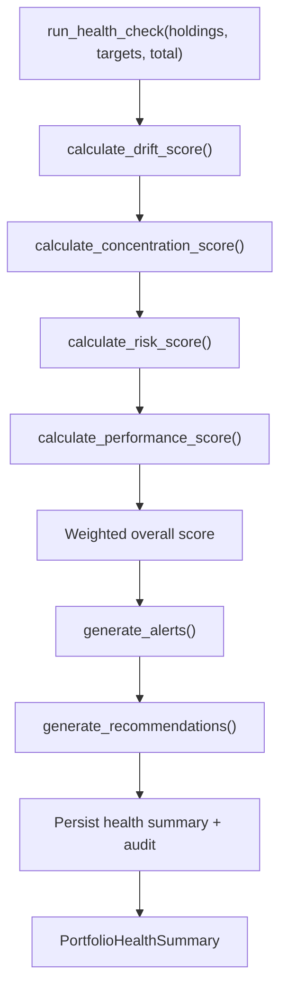

**Diagram sources**
- [src-tauri/src/services/health_monitor.rs:107-221](file://src-tauri/src/services/health_monitor.rs#L107-L221)
- [src-tauri/src/services/health_monitor.rs:223-347](file://src-tauri/src/services/health_monitor.rs#L223-L347)
- [src-tauri/src/services/health_monitor.rs:349-427](file://src-tauri/src/services/health_monitor.rs#L349-L427)
- [src-tauri/src/services/health_monitor.rs:479-507](file://src-tauri/src/services/health_monitor.rs#L479-L507)

**Section sources**
- [src-tauri/src/services/health_monitor.rs:1-573](file://src-tauri/src/services/health_monitor.rs#L1-L573)

### Alpha Service Threat Intelligence and Synthesis
The Alpha Service periodically synthesizes market insights:
- Validates local LLM availability
- Queries external research API for market news
- Reads user “soul” and memory for personalization
- Uses local LLM to synthesize a concise daily brief and optionally attach a top opportunity
- Emits a UI event for display

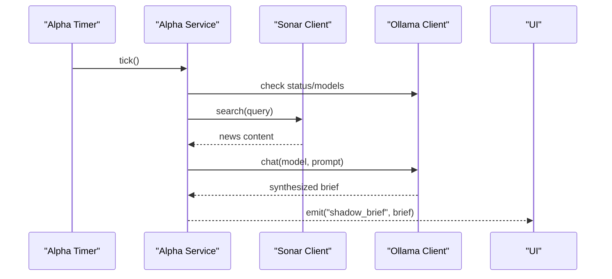

**Diagram sources**
- [src-tauri/src/services/alpha_service.rs:27-57](file://src-tauri/src/services/alpha_service.rs#L27-L57)
- [src-tauri/src/services/alpha_service.rs:71-130](file://src-tauri/src/services/alpha_service.rs#L71-L130)
- [src-tauri/src/services/sonar_client.rs:33-77](file://src-tauri/src/services/sonar_client.rs#L33-L77)
- [src-tauri/src/services/ollama_client.rs:46-105](file://src-tauri/src/services/ollama_client.rs#L46-L105)

**Section sources**
- [src-tauri/src/services/alpha_service.rs:1-143](file://src-tauri/src/services/alpha_service.rs#L1-L143)
- [src-tauri/src/services/sonar_client.rs:1-78](file://src-tauri/src/services/sonar_client.rs#L1-L78)
- [src-tauri/src/services/ollama_client.rs:1-106](file://src-tauri/src/services/ollama_client.rs#L1-L106)

### Shadow Watcher and Asset-Level Evaluation
Shadow Watcher evaluates individual assets using local LLMs and emits structured alerts with severity and suggestions.

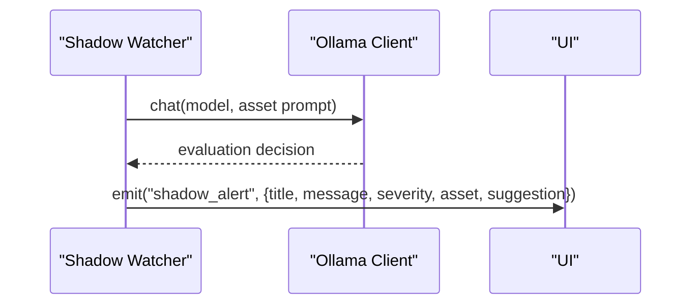

**Diagram sources**
- [src-tauri/src/services/shadow_watcher.rs:145-178](file://src-tauri/src/services/shadow_watcher.rs#L145-L178)
- [src-tauri/src/services/ollama_client.rs:46-105](file://src-tauri/src/services/ollama_client.rs#L46-L105)

**Section sources**
- [src-tauri/src/services/shadow_watcher.rs:145-178](file://src-tauri/src/services/shadow_watcher.rs#L145-L178)

### Task Manager and Automated Responses
Health alerts are transformed into tasks with confidence and expiration. Tasks capture reasoning, risk factors, and suggested actions.

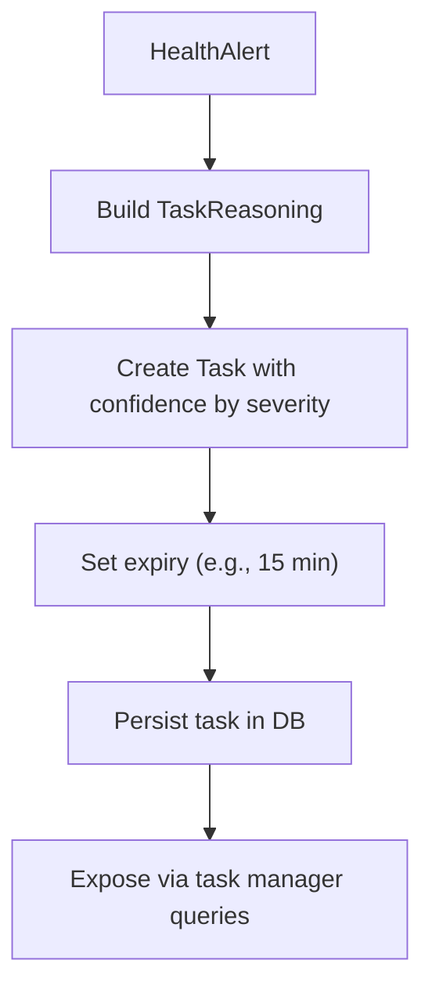

**Diagram sources**
- [src-tauri/src/services/task_manager.rs:264-303](file://src-tauri/src/services/task_manager.rs#L264-L303)

**Section sources**
- [src-tauri/src/services/task_manager.rs:53-303](file://src-tauri/src/services/task_manager.rs#L53-L303)

### Agent Orchestrator and On-Demand Analysis
The orchestrator coordinates health checks, opportunity scans, and task retrieval, aggregating results into a unified analysis.

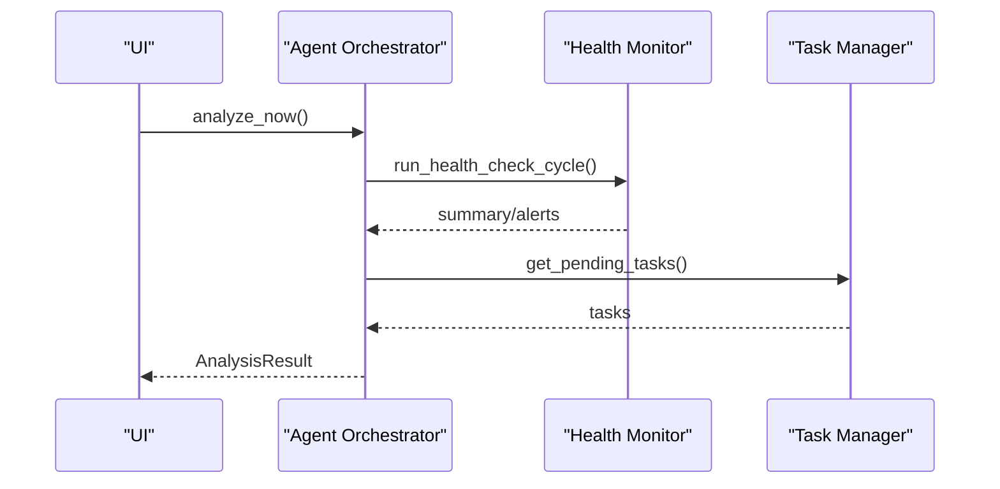

**Diagram sources**
- [src-tauri/src/services/agent_orchestrator.rs:493-532](file://src-tauri/src/services/agent_orchestrator.rs#L493-L532)
- [src-tauri/src/services/task_manager.rs:2045-2106](file://src-tauri/src/services/task_manager.rs#L2045-L2106)

**Section sources**
- [src-tauri/src/services/agent_orchestrator.rs:474-570](file://src-tauri/src/services/agent_orchestrator.rs#L474-L570)

### Security Monitoring and Auditability
All guardrail violations, health events, and strategy executions are audited and persisted locally for compliance and forensics.

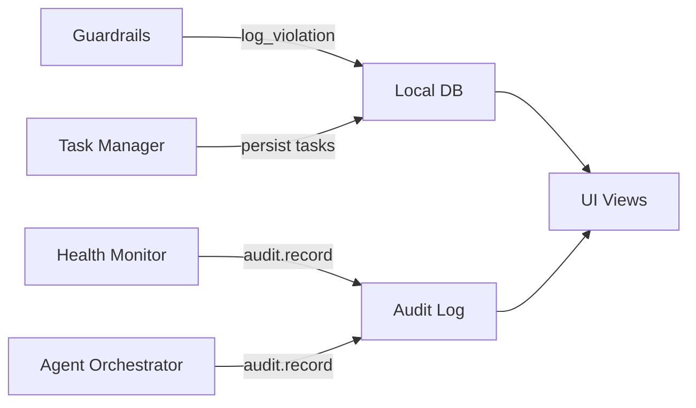

**Diagram sources**
- [src-tauri/src/services/guardrails.rs:484-519](file://src-tauri/src/services/guardrails.rs#L484-L519)
- [src-tauri/src/services/health_monitor.rs:207-218](file://src-tauri/src/services/health_monitor.rs#L207-L218)
- [src-tauri/src/services/audit.rs:1-25](file://src-tauri/src/services/audit.rs#L1-L25)
- [src-tauri/src/services/local_db.rs:169-178](file://src-tauri/src/services/local_db.rs#L169-L178)

**Section sources**
- [src-tauri/src/services/audit.rs:1-25](file://src-tauri/src/services/audit.rs#L1-L25)
- [src-tauri/src/services/local_db.rs:169-178](file://src-tauri/src/services/local_db.rs#L169-L178)

## Dependency Analysis
- External dependencies:
  - Perplexity Sonar API for market intelligence
  - Local Ollama API for on-device LLM chat
- Internal dependencies:
  - Alpha Service depends on Sonar and Ollama clients
  - Agent Orchestrator depends on Health Monitor, Task Manager, and Guardrails
  - Guardrails depend on Local DB and Audit services
  - Health Monitor persists to Local DB and emits audit entries

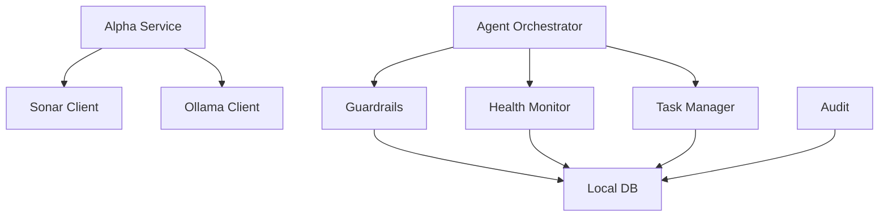

**Diagram sources**
- [src-tauri/src/services/alpha_service.rs:10-12](file://src-tauri/src/services/alpha_service.rs#L10-L12)
- [src-tauri/src/services/sonar_client.rs:1-78](file://src-tauri/src/services/sonar_client.rs#L1-L78)
- [src-tauri/src/services/ollama_client.rs:1-106](file://src-tauri/src/services/ollama_client.rs#L1-L106)
- [src-tauri/src/services/agent_orchestrator.rs:474-570](file://src-tauri/src/services/agent_orchestrator.rs#L474-L570)
- [src-tauri/src/services/guardrails.rs:1-620](file://src-tauri/src/services/guardrails.rs#L1-L620)
- [src-tauri/src/services/health_monitor.rs:1-573](file://src-tauri/src/services/health_monitor.rs#L1-L573)
- [src-tauri/src/services/task_manager.rs:53-303](file://src-tauri/src/services/task_manager.rs#L53-L303)
- [src-tauri/src/services/audit.rs:1-25](file://src-tauri/src/services/audit.rs#L1-L25)
- [src-tauri/src/services/local_db.rs:1-200](file://src-tauri/src/services/local_db.rs#L1-L200)

**Section sources**
- [src-tauri/src/services/alpha_service.rs:1-143](file://src-tauri/src/services/alpha_service.rs#L1-L143)
- [src-tauri/src/services/agent_orchestrator.rs:474-570](file://src-tauri/src/services/agent_orchestrator.rs#L474-L570)
- [src-tauri/src/services/guardrails.rs:1-620](file://src-tauri/src/services/guardrails.rs#L1-L620)
- [src-tauri/src/services/health_monitor.rs:1-573](file://src-tauri/src/services/health_monitor.rs#L1-L573)
- [src-tauri/src/services/task_manager.rs:53-303](file://src-tauri/src/services/task_manager.rs#L53-L303)
- [src-tauri/src/services/audit.rs:1-25](file://src-tauri/src/services/audit.rs#L1-L25)
- [src-tauri/src/services/local_db.rs:1-200](file://src-tauri/src/services/local_db.rs#L1-L200)

## Performance Considerations
- Keep guardrail checks lightweight and short-circuit on kill switch
- Cache health computations and invalidate on significant portfolio changes
- Limit external API calls to essential intervals (e.g., daily alpha cycles)
- Use local LLMs to avoid network latency and reduce data transmission
- Persist audit and health summaries to SQLite to minimize repeated computation overhead

[No sources needed since this section provides general guidance]

## Troubleshooting Guide
Common issues and resolutions:
- Alpha Service skips cycles due to missing local LLM or API keys
  - Verify Ollama availability and model installation
  - Ensure external API keys are configured in settings
- Guardrail violations
  - Review stored violations and adjust configuration
  - Use the kill switch to temporarily halt autonomous actions
- Health dashboard shows no data
  - Confirm health runs and persists to Local DB
  - Check audit logs for errors
- Task queue not updating
  - Inspect task queries and expiration logic
  - Validate alert-to-task generation

**Section sources**
- [src-tauri/src/services/alpha_service.rs:59-69](file://src-tauri/src/services/alpha_service.rs#L59-L69)
- [src-tauri/src/services/guardrails.rs:182-230](file://src-tauri/src/services/guardrails.rs#L182-L230)
- [src-tauri/src/services/health_monitor.rs:207-218](file://src-tauri/src/services/health_monitor.rs#L207-L218)
- [src-tauri/src/services/task_manager.rs:2045-2106](file://src-tauri/src/services/task_manager.rs#L2045-L2106)

## Conclusion
SHADOW Protocol’s threat protection stack combines privacy-preserving data sanitization, robust guardrails, continuous health monitoring, and automated response pathways. By keeping sensitive operations local, enforcing strict constraints, and maintaining comprehensive auditability, the system reduces risk exposure while enabling powerful DeFi automation.

[No sources needed since this section summarizes without analyzing specific files]

## Appendices

### DeFi-Specific Threats and Mitigations
- Front-running and sandwich attacks
  - Use slippage caps enforced by guardrails
  - Prefer atomic swaps and DEX aggregators with anti-front-running features
- MEV protection
  - Avoid submitting transactions during known MEV windows
  - Use execution windows to limit risky periods
- Flash loan exploits
  - Monitor risk score and chain concentration thresholds
  - Apply portfolio floor and approval thresholds for large moves
- Unauthorized access and malicious activities
  - Enforce kill switch and execution windows
  - Audit all guardrail violations and strategy executions

[No sources needed since this section provides general guidance]

### Configuring Threat Protection Settings
- Guardrails configuration fields
  - Portfolio floor, single-transaction cap, slippage tolerance
  - Allowed/Blocked chains, tokens, and protocols
  - Execution windows and approval thresholds
  - Emergency kill switch
- Where to configure
  - Guardrails service loads and saves configuration to Local DB
  - Use the UI panels to set guardrails and review violations

**Section sources**
- [src-tauri/src/services/guardrails.rs:42-84](file://src-tauri/src/services/guardrails.rs#L42-L84)
- [src-tauri/src/services/guardrails.rs:182-230](file://src-tauri/src/services/guardrails.rs#L182-L230)
- [src-tauri/src/services/local_db.rs:2436-2494](file://src-tauri/src/services/local_db.rs#L2436-L2494)

### Interpreting Security Alerts and Tasks
- Health alerts severity and titles indicate risk level and focus area
- Tasks include reasoning, risk factors, and suggested actions
- Use the Health Dashboard to triage active alerts and tasks

**Section sources**
- [src-tauri/src/services/health_monitor.rs:35-85](file://src-tauri/src/services/health_monitor.rs#L35-L85)
- [src-tauri/src/services/task_manager.rs:53-98](file://src-tauri/src/services/task_manager.rs#L53-L98)
- [src/components/autonomous/HealthDashboard.tsx:145-165](file://src/components/autonomous/HealthDashboard.tsx#L145-L165)

### Additional Security Measures Based on Threat Intelligence
- Personalized agent personas emphasize privacy and security
- Onboarding highlights local intelligence and OS-level vault
- Enforce strict input validation and Tauri IPC security rules

**Section sources**
- [src/constants/personaArchetypes.ts:40-66](file://src/constants/personaArchetypes.ts#L40-L66)
- [src/components/onboarding/steps/Step1HowItWorks.tsx:17-27](file://src/components/onboarding/steps/Step1HowItWorks.tsx#L17-L27)
- [src/components/onboarding/steps/Step2Architecture.tsx:8-23](file://src/components/onboarding/steps/Step2Architecture.tsx#L8-L23)
- [AGENTS.md:9-27](file://AGENTS.md#L9-L27)