# Transaction Security & Privacy

<cite>
**Referenced Files in This Document**
- [README.md](file://README.md)
- [AGENTS.md](file://AGENTS.md)
- [docs/shadow-protocol.md](file://docs/shadow-protocol.md)
- [src-tauri/src/services/anonymizer.rs](file://src-tauri/src/services/anonymizer.rs)
- [src-tauri/src/services/alpha_service.rs](file://src-tauri/src/services/alpha_service.rs)
- [src-tauri/src/services/sonar_client.rs](file://src-tauri/src/services/sonar_client.rs)
- [src-tauri/src/services/ollama_client.rs](file://src-tauri/src/services/ollama_client.rs)
- [src-tauri/src/services/wallet_sync.rs](file://src-tauri/src/services/wallet_sync.rs)
- [src-tauri/src/services/guardrails.rs](file://src-tauri/src/services/guardrails.rs)
- [src-tauri/src/services/health_monitor.rs](file://src-tauri/src/services/health_monitor.rs)
- [src-tauri/src/services/audit.rs](file://src-tauri/src/services/audit.rs)
- [src-tauri/src/services/local_db.rs](file://src-tauri/src/services/local_db.rs)
- [src-tauri/src/services/strategy_types.rs](file://src-tauri/src/services/strategy_types.rs)
- [src-tauri/src/commands/transfer.rs](file://src-tauri/src/commands/transfer.rs)
- [src-tauri/src/session.rs](file://src-tauri/src/session.rs)
- [apps-runtime/src/providers/lit.ts](file://apps-runtime/src/providers/lit.ts)
- [src-tauri/src/services/apps/lit.rs](file://src-tauri/src/services/apps/lit.rs)
- [src/constants/personaArchetypes.ts](file://src/constants/personaArchetypes.ts)
</cite>

## Table of Contents
1. [Introduction](#introduction)
2. [Project Structure](#project-structure)
3. [Core Components](#core-components)
4. [Architecture Overview](#architecture-overview)
5. [Detailed Component Analysis](#detailed-component-analysis)
6. [Dependency Analysis](#dependency-analysis)
7. [Performance Considerations](#performance-considerations)
8. [Troubleshooting Guide](#troubleshooting-guide)
9. [Conclusion](#conclusion)
10. [Appendices](#appendices)

## Introduction
This document explains SHADOW Protocol’s transaction security and privacy mechanisms across signing, multi-signature and policy enforcement, broadcasting, privacy-preserving structures, execution preferences, alpha service privacy features, replay attack prevention, nonce management, signature verification, smart contract security, gas optimizations, monitoring, anomaly detection, and compliance guidance. It synthesizes the Rust backend services, Tauri IPC, and frontend components to provide a practical, layered understanding of how sensitive operations are protected and how users maintain control over their privacy and execution parameters.

## Project Structure
The SHADOW desktop application follows a clear separation of concerns:
- Frontend (React 19 + TypeScript) handles UI, user onboarding, and strategy building.
- Rust/Tauri backend performs sensitive operations (signing, session caching, guardrails, health checks, alpha synthesis).
- Optional apps runtime (Bun) hosts integrations (e.g., Lit Protocol) in isolated sidecars.
- Local SQLite persists state, logs, and audit trails.

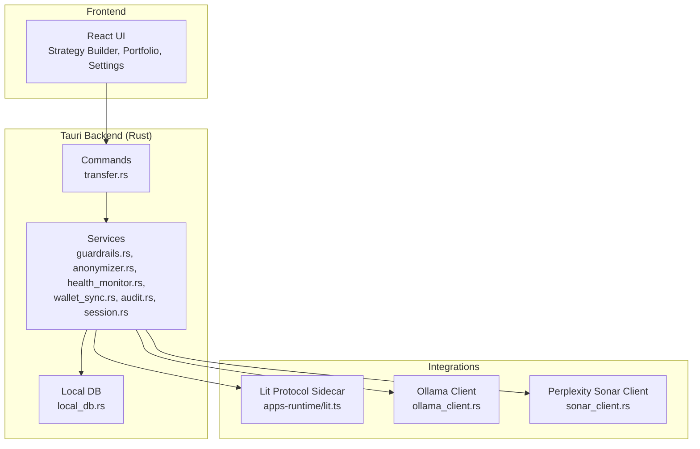

**Diagram sources**
- [README.md:135-190](file://README.md#L135-L190)
- [src-tauri/src/services/anonymizer.rs:1-56](file://src-tauri/src/services/anonymizer.rs#L1-L56)
- [src-tauri/src/services/alpha_service.rs:1-143](file://src-tauri/src/services/alpha_service.rs#L1-L143)
- [src-tauri/src/services/sonar_client.rs:1-78](file://src-tauri/src/services/sonar_client.rs#L1-L78)
- [src-tauri/src/services/ollama_client.rs:1-106](file://src-tauri/src/services/ollama_client.rs#L1-L106)
- [src-tauri/src/services/wallet_sync.rs:1-453](file://src-tauri/src/services/wallet_sync.rs#L1-L453)
- [src-tauri/src/services/guardrails.rs:1-620](file://src-tauri/src/services/guardrails.rs#L1-L620)
- [src-tauri/src/services/health_monitor.rs:1-573](file://src-tauri/src/services/health_monitor.rs#L1-L573)
- [src-tauri/src/services/audit.rs:1-25](file://src-tauri/src/services/audit.rs#L1-L25)
- [src-tauri/src/services/local_db.rs:1-800](file://src-tauri/src/services/local_db.rs#L1-L800)
- [src-tauri/src/commands/transfer.rs:1-280](file://src-tauri/src/commands/transfer.rs#L1-L280)
- [src-tauri/src/session.rs:1-145](file://src-tauri/src/session.rs#L1-L145)
- [apps-runtime/src/providers/lit.ts:46-234](file://apps-runtime/src/providers/lit.ts#L46-L234)

**Section sources**
- [README.md:135-190](file://README.md#L135-L190)
- [docs/shadow-protocol.md:1-48](file://docs/shadow-protocol.md#L1-L48)

## Core Components
- Transaction Signing and Broadcasting: EVM-compatible transfers with session-cached keys, provider-based signing, and background confirmation polling.
- Multi-signature and Policy Enforcement: Distributed MPC via Lit Protocol with session signatures and pre-execution policy enforcement in trusted execution environments.
- Privacy-Preserving Structures: Portfolio sanitization to relative categories and weights; optional off-chain AI synthesis with local LLMs.
- Execution Preferences: Strategy execution modes, scheduling, and thresholds for approvals.
- Guardrails and Kill Switch: Configurable constraints, time windows, and emergency overrides with audit logging.
- Monitoring and Anomaly Detection: Portfolio health scoring, alerts, and persistent records.
- Alpha Service Privacy Features: Local-first synthesis with optional external research; configurable API keys and timeouts.
- Replay Attack Prevention and Nonce Management: Session-based key caching and inactivity expiry; integration with nonce-aware providers.
- Signature Verification and Security: Secure in-memory key caching, zeroization, and strict input validation.

**Section sources**
- [src-tauri/src/commands/transfer.rs:1-280](file://src-tauri/src/commands/transfer.rs#L1-L280)
- [src-tauri/src/services/apps/lit.rs:91-150](file://src-tauri/src/services/apps/lit.rs#L91-L150)
- [apps-runtime/src/providers/lit.ts:46-234](file://apps-runtime/src/providers/lit.ts#L46-L234)
- [src-tauri/src/services/anonymizer.rs:1-56](file://src-tauri/src/services/anonymizer.rs#L1-L56)
- [src-tauri/src/services/alpha_service.rs:1-143](file://src-tauri/src/services/alpha_service.rs#L1-L143)
- [src-tauri/src/services/execution_preferences.rs:1-159](file://src-tauri/src/services/execution_preferences.rs#L1-L159)
- [src-tauri/src/services/guardrails.rs:1-620](file://src-tauri/src/services/guardrails.rs#L1-L620)
- [src-tauri/src/services/health_monitor.rs:1-573](file://src-tauri/src/services/health_monitor.rs#L1-L573)
- [src-tauri/src/services/audit.rs:1-25](file://src-tauri/src/services/audit.rs#L1-L25)
- [src-tauri/src/session.rs:1-145](file://src-tauri/src/session.rs#L1-L145)

## Architecture Overview
The system enforces privacy and security by keeping sensitive logic in Rust/Tauri while enabling user control and transparency. External integrations (e.g., Perplexity Sonar, Ollama) are optional and can run locally.

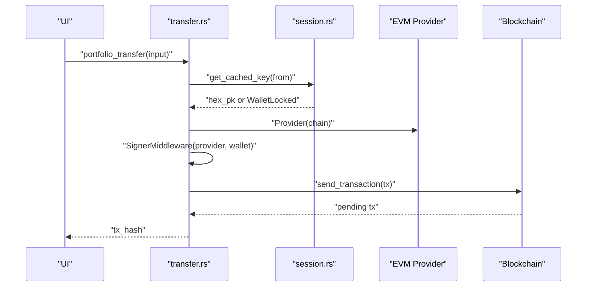

**Diagram sources**
- [src-tauri/src/commands/transfer.rs:78-160](file://src-tauri/src/commands/transfer.rs#L78-L160)
- [src-tauri/src/session.rs:31-57](file://src-tauri/src/session.rs#L31-L57)

## Detailed Component Analysis

### Transaction Signing and Broadcasting
- Input validation ensures addresses and amounts are well-formed and finite.
- Session-cached keys are refreshed on use; provider chain ID is applied for correct signing.
- ERC-20 transfers encode calldata with a selector; native ETH transfers set value.
- Background confirmation polls receipts and emits status updates.

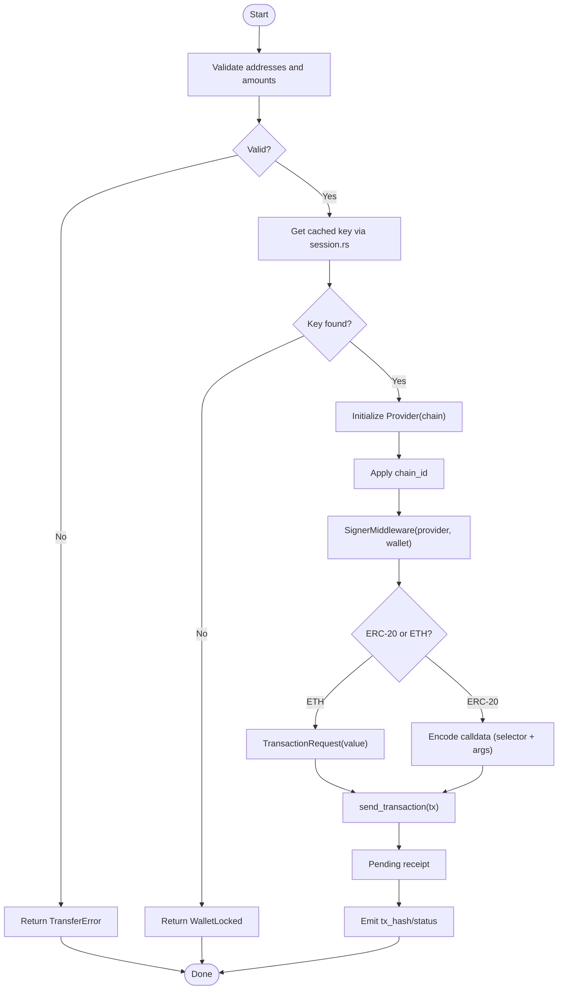

**Diagram sources**
- [src-tauri/src/commands/transfer.rs:18-160](file://src-tauri/src/commands/transfer.rs#L18-L160)
- [src-tauri/src/session.rs:31-57](file://src-tauri/src/session.rs#L31-L57)

**Section sources**
- [src-tauri/src/commands/transfer.rs:1-280](file://src-tauri/src/commands/transfer.rs#L1-L280)
- [src-tauri/src/session.rs:1-145](file://src-tauri/src/session.rs#L1-L145)

### Multi-signature and Policy Enforcement (Lit Protocol)
- PKP minting and signing are delegated to Lit’s distributed MPC network via a sidecar.
- Session signatures are generated with nonce-aware SIWE messages and TEE-based policy enforcement.
- The Lit Action enforces guardrails (limits, whitelists) before execution.

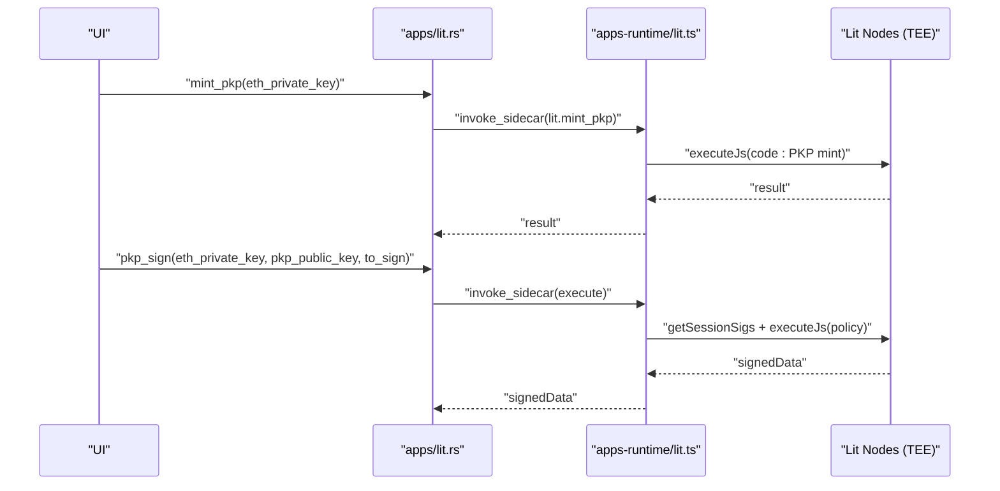

**Diagram sources**
- [src-tauri/src/services/apps/lit.rs:91-150](file://src-tauri/src/services/apps/lit.rs#L91-L150)
- [apps-runtime/src/providers/lit.ts:195-234](file://apps-runtime/src/providers/lit.ts#L195-L234)

**Section sources**
- [src-tauri/src/services/apps/lit.rs:91-150](file://src-tauri/src/services/apps/lit.rs#L91-L150)
- [apps-runtime/src/providers/lit.ts:46-234](file://apps-runtime/src/providers/lit.ts#L46-L234)

### Privacy-Preserving Transaction Structures and Portfolio Sanitization
- Portfolio sanitization converts exact balances to categorical buckets and percentages, removing precise identifiers.
- This supports privacy-preserving AI processing by sharing only relative allocations.

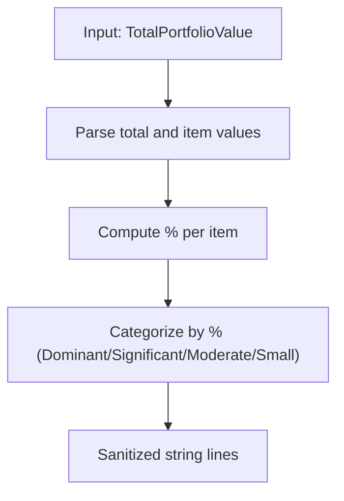

**Diagram sources**
- [src-tauri/src/services/anonymizer.rs:7-28](file://src-tauri/src/services/anonymizer.rs#L7-L28)

**Section sources**
- [src-tauri/src/services/anonymizer.rs:1-56](file://src-tauri/src/services/anonymizer.rs#L1-L56)

### Execution Preferences System (Strategy Automation)
- Execution preferences control continuous/background evaluation, foreground-only, or scheduled windows.
- Approval thresholds determine whether actions require auto-execution, strategy-level approval, or explicit user approval.

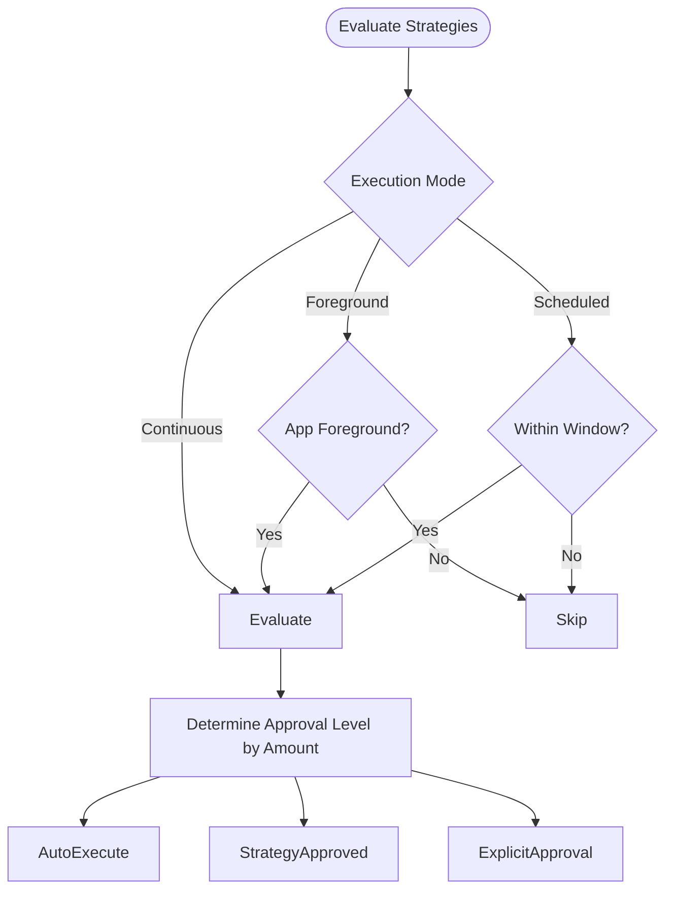

**Diagram sources**
- [src-tauri/src/services/execution_preferences.rs:34-52](file://src-tauri/src/services/execution_preferences.rs#L34-L52)
- [src-tauri/src/services/execution_preferences.rs:96-105](file://src-tauri/src/services/execution_preferences.rs#L96-L105)

**Section sources**
- [src-tauri/src/services/execution_preferences.rs:1-159](file://src-tauri/src/services/execution_preferences.rs#L1-L159)
- [src-tauri/src/services/strategy_types.rs:167-243](file://src-tauri/src/services/strategy_types.rs#L167-L243)

### Alpha Service Privacy Features
- Daily synthesis runs using local Ollama models; optional external research via Perplexity Sonar.
- First-run delays and expected failure handling avoid noisy errors.
- Parsing and emission of structured “Daily Alpha Brief” with optional opportunity.

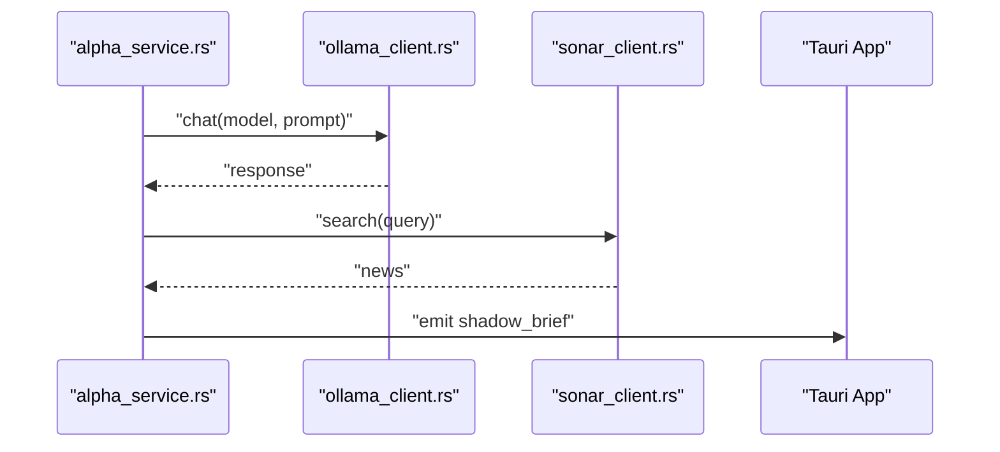

**Diagram sources**
- [src-tauri/src/services/alpha_service.rs:71-130](file://src-tauri/src/services/alpha_service.rs#L71-L130)
- [src-tauri/src/services/ollama_client.rs:46-105](file://src-tauri/src/services/ollama_client.rs#L46-L105)
- [src-tauri/src/services/sonar_client.rs:33-77](file://src-tauri/src/services/sonar_client.rs#L33-L77)

**Section sources**
- [src-tauri/src/services/alpha_service.rs:1-143](file://src-tauri/src/services/alpha_service.rs#L1-L143)
- [src-tauri/src/services/sonar_client.rs:1-78](file://src-tauri/src/services/sonar_client.rs#L1-L78)
- [src-tauri/src/services/ollama_client.rs:1-106](file://src-tauri/src/services/ollama_client.rs#L1-L106)

### Guardrails, Kill Switch, and Audit Logging
- Guardrails enforce constraints (limits, chains, tokens, protocols, time windows, slippage) and produce violations and warnings.
- Emergency kill switch blocks all autonomous actions and is audited.
- Violations and overrides are recorded in local DB and audit log.

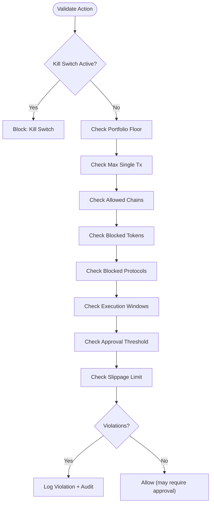

**Diagram sources**
- [src-tauri/src/services/guardrails.rs:277-426](file://src-tauri/src/services/guardrails.rs#L277-L426)
- [src-tauri/src/services/audit.rs:5-24](file://src-tauri/src/services/audit.rs#L5-L24)

**Section sources**
- [src-tauri/src/services/guardrails.rs:1-620](file://src-tauri/src/services/guardrails.rs#L1-L620)
- [src-tauri/src/services/audit.rs:1-25](file://src-tauri/src/services/audit.rs#L1-L25)

### Portfolio Health Monitoring and Anomaly Detection
- Health scoring aggregates drift, concentration, performance, and risk.
- Alerts and recommendations are persisted and emitted for visibility.
- Audit records accompany health summaries.

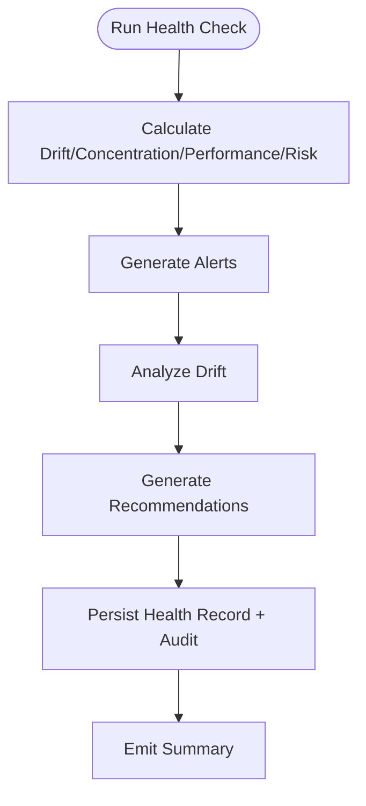

**Diagram sources**
- [src-tauri/src/services/health_monitor.rs:107-221](file://src-tauri/src/services/health_monitor.rs#L107-L221)

**Section sources**
- [src-tauri/src/services/health_monitor.rs:1-573](file://src-tauri/src/services/health_monitor.rs#L1-L573)
- [src-tauri/src/services/audit.rs:1-25](file://src-tauri/src/services/audit.rs#L1-L25)

### Wallet Sync and Data Privacy
- Multi-chain token/NFT/transaction sync with pagination and snapshotting.
- Local DB indexing and snapshotting support efficient queries and historical tracking.

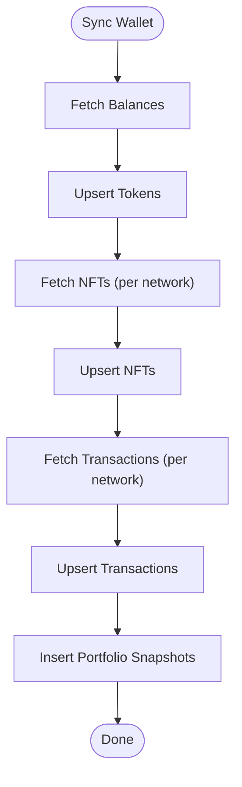

**Diagram sources**
- [src-tauri/src/services/wallet_sync.rs:260-452](file://src-tauri/src/services/wallet_sync.rs#L260-L452)

**Section sources**
- [src-tauri/src/services/wallet_sync.rs:1-453](file://src-tauri/src/services/wallet_sync.rs#L1-L453)
- [src-tauri/src/services/local_db.rs:10-800](file://src-tauri/src/services/local_db.rs#L10-L800)

### Replay Attack Prevention, Nonce Management, and Signature Verification
- Session cache holds decrypted keys in-memory with inactivity expiry; keys are zeroized after use.
- Integration with provider nonce retrieval (e.g., blockhash) for session signatures.
- Signature verification occurs on-chain via provider receipts and emitted statuses.

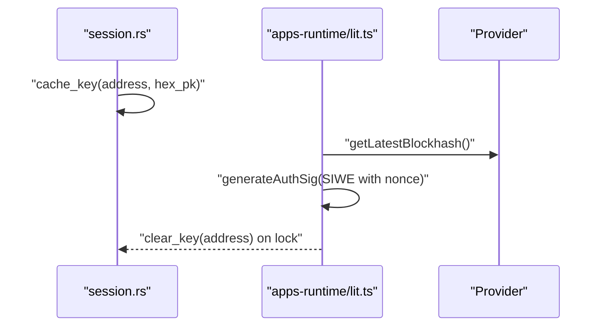

**Diagram sources**
- [src-tauri/src/session.rs:31-93](file://src-tauri/src/session.rs#L31-L93)
- [apps-runtime/src/providers/lit.ts:211-223](file://apps-runtime/src/providers/lit.ts#L211-L223)

**Section sources**
- [src-tauri/src/session.rs:1-145](file://src-tauri/src/session.rs#L1-L145)
- [apps-runtime/src/providers/lit.ts:195-234](file://apps-runtime/src/providers/lit.ts#L195-L234)

### Smart Contract Security Measures, Gas Optimization, and Compliance Guidance
- Gas and slippage constraints are enforced via guardrails and strategy conditions.
- Strategy templates and compiled plans define triggers, conditions, and actions with normalized guardrails.
- Compliance guidance emphasizes:
  - Private key handling: OS keychain, zeroize, no plaintext storage.
  - Input validation: addresses, amounts, chain IDs sanitized.
  - Tauri IPC: strict permissions, CSP, and argument validation.

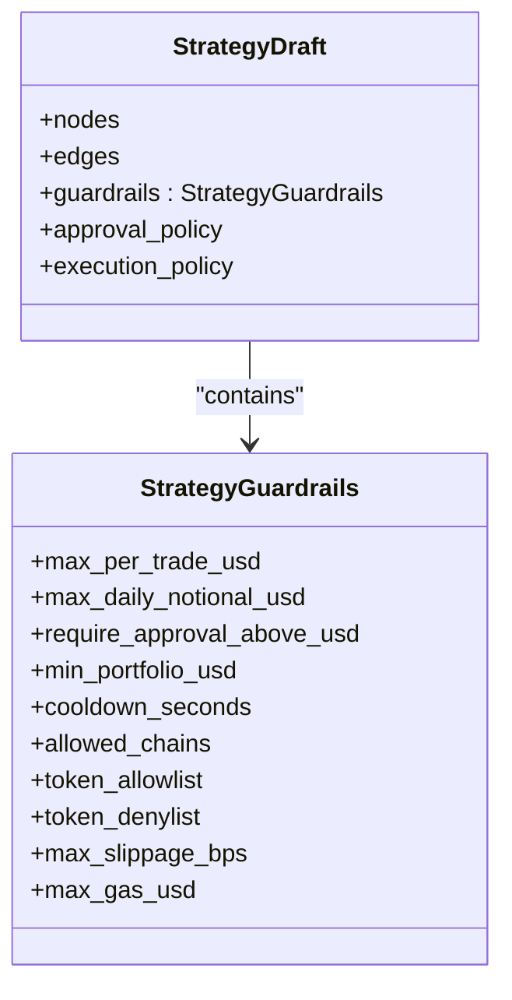

**Diagram sources**
- [src-tauri/src/services/strategy_types.rs:167-243](file://src-tauri/src/services/strategy_types.rs#L167-L243)

**Section sources**
- [src-tauri/src/services/strategy_types.rs:1-417](file://src-tauri/src/services/strategy_types.rs#L1-L417)
- [AGENTS.md:9-27](file://AGENTS.md#L9-L27)

## Dependency Analysis
- Rust backend services depend on local DB for persistence, guardrails for policy, and audit for compliance.
- Commands depend on session cache and provider libraries for signing.
- Integrations (Lit, Ollama, Sonar) are optional and accessed via typed clients.

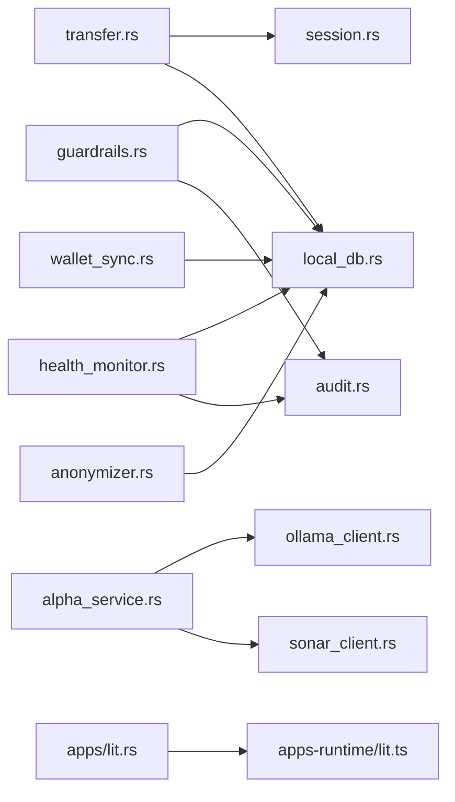

**Diagram sources**
- [src-tauri/src/commands/transfer.rs:1-280](file://src-tauri/src/commands/transfer.rs#L1-L280)
- [src-tauri/src/session.rs:1-145](file://src-tauri/src/session.rs#L1-L145)
- [src-tauri/src/services/local_db.rs:1-800](file://src-tauri/src/services/local_db.rs#L1-L800)
- [src-tauri/src/services/guardrails.rs:1-620](file://src-tauri/src/services/guardrails.rs#L1-L620)
- [src-tauri/src/services/audit.rs:1-25](file://src-tauri/src/services/audit.rs#L1-L25)
- [src-tauri/src/services/health_monitor.rs:1-573](file://src-tauri/src/services/health_monitor.rs#L1-L573)
- [src-tauri/src/services/wallet_sync.rs:1-453](file://src-tauri/src/services/wallet_sync.rs#L1-L453)
- [src-tauri/src/services/anonymizer.rs:1-56](file://src-tauri/src/services/anonymizer.rs#L1-L56)
- [src-tauri/src/services/alpha_service.rs:1-143](file://src-tauri/src/services/alpha_service.rs#L1-L143)
- [src-tauri/src/services/ollama_client.rs:1-106](file://src-tauri/src/services/ollama_client.rs#L1-L106)
- [src-tauri/src/services/sonar_client.rs:1-78](file://src-tauri/src/services/sonar_client.rs#L1-L78)
- [src-tauri/src/services/apps/lit.rs:91-150](file://src-tauri/src/services/apps/lit.rs#L91-L150)
- [apps-runtime/src/providers/lit.ts:46-234](file://apps-runtime/src/providers/lit.ts#L46-L234)

**Section sources**
- [src-tauri/src/services/local_db.rs:1-800](file://src-tauri/src/services/local_db.rs#L1-L800)

## Performance Considerations
- Prefer session-cached keys to minimize repeated decryption and provider calls.
- Use indexed DB queries for frequent reads (tokens, NFTs, transactions).
- Batch upserts per chain/network to reduce round-trips.
- Tune guardrail thresholds to reduce unnecessary rejections and retries.
- Limit external API calls to essential windows (e.g., alpha synthesis cadence).

## Troubleshooting Guide
- Missing API keys: Ensure ALCHEMY_API_KEY, Perplexity, and Ollama credentials are configured.
- Wallet locked: Unlock via session cache; confirm key expiry and refresh.
- Transaction dropped: Check background confirmation polling and emitted status.
- Guardrail violations: Review logs and adjust thresholds or whitelists.
- Health alerts: Inspect drift, concentration, and risk scores; rebalance as recommended.

**Section sources**
- [src-tauri/src/commands/transfer.rs:78-160](file://src-tauri/src/commands/transfer.rs#L78-L160)
- [src-tauri/src/services/guardrails.rs:484-519](file://src-tauri/src/services/guardrails.rs#L484-L519)
- [src-tauri/src/services/health_monitor.rs:509-520](file://src-tauri/src/services/health_monitor.rs#L509-L520)

## Conclusion
SHADOW Protocol’s design prioritizes privacy and security by keeping sensitive operations in Rust/Tauri, enforcing guardrails and kill switches, leveraging trusted execution environments for multi-signature workflows, and maintaining transparent audit trails. Users retain control over execution preferences, privacy parameters, and compliance through configurable policies and local-first AI synthesis.

## Appendices
- Privacy personas emphasize discretion and minimal data exposure.
- Security rules mandate OS keychain usage, zeroize semantics, and strict IPC validation.

**Section sources**
- [src/constants/personaArchetypes.ts:66-120](file://src/constants/personaArchetypes.ts#L66-L120)
- [AGENTS.md:9-27](file://AGENTS.md#L9-L27)