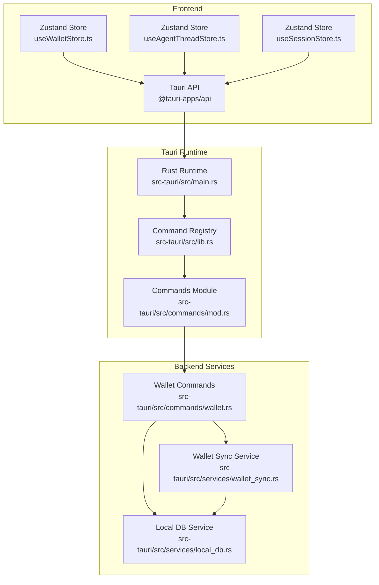
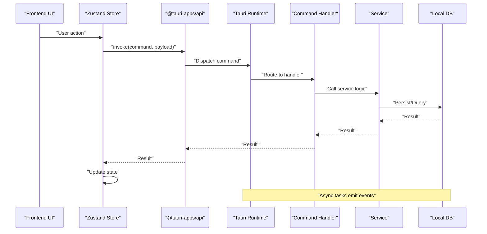
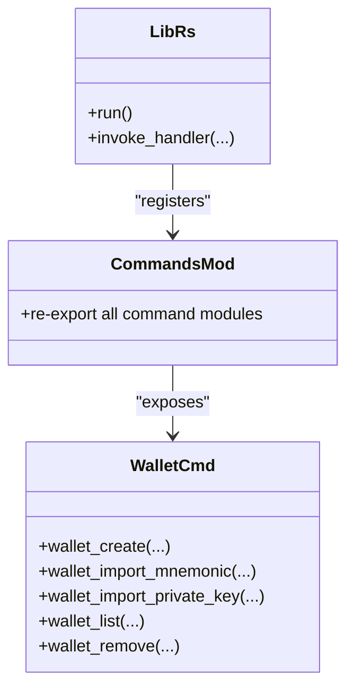
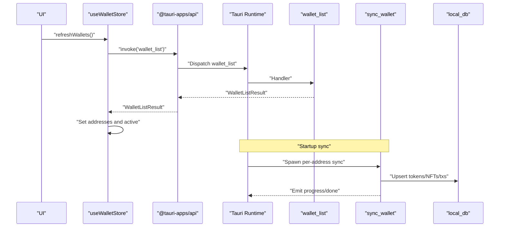
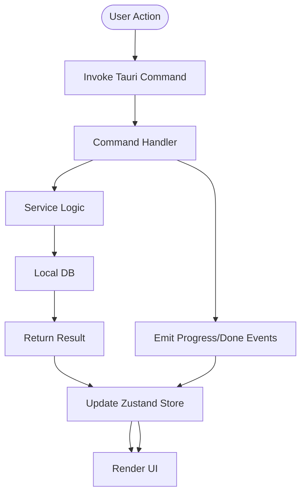
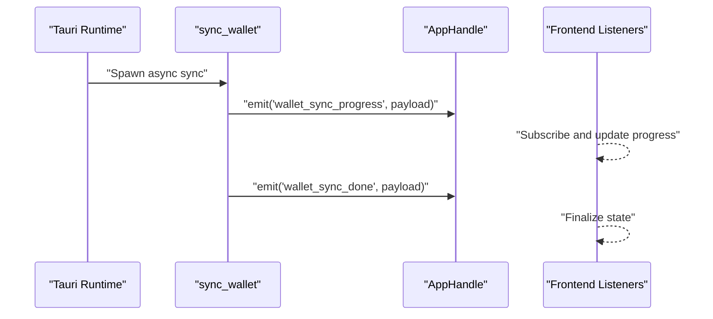
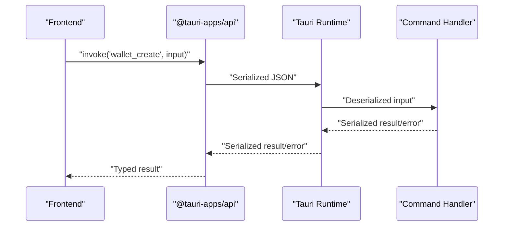
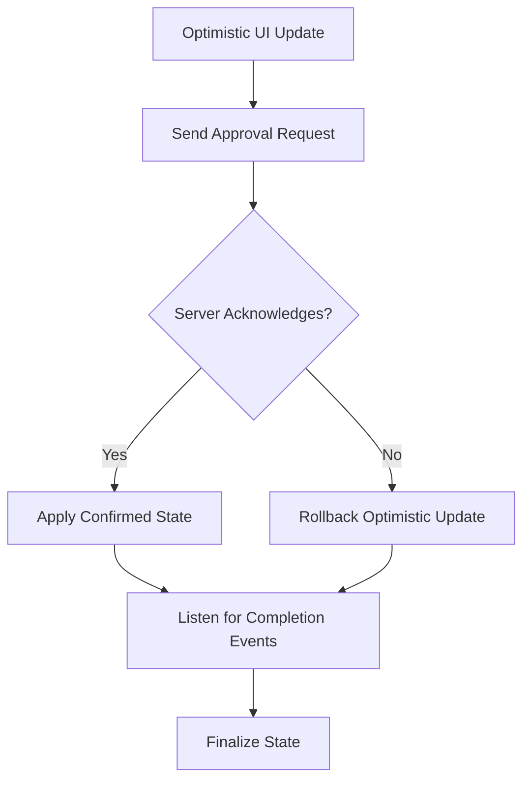
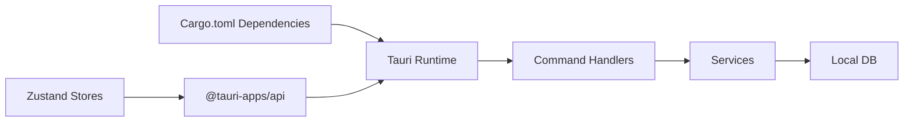

# Backend State Integration

<cite>
**Referenced Files in This Document**
- [src-tauri/src/main.rs](file://src-tauri/src/main.rs)
- [src-tauri/src/lib.rs](file://src-tauri/src/lib.rs)
- [src-tauri/src/commands/mod.rs](file://src-tauri/src/commands/mod.rs)
- [src-tauri/src/commands/wallet.rs](file://src-tauri/src/commands/wallet.rs)
- [src-tauri/src/services/wallet_sync.rs](file://src-tauri/src/services/wallet_sync.rs)
- [src-tauri/src/services/local_db.rs](file://src-tauri/src/services/local_db.rs)
- [src/lib/tauri.ts](file://src/lib/tauri.ts)
- [src/lib/agent.ts](file://src/lib/agent.ts)
- [src/store/useWalletStore.ts](file://src/store/useWalletStore.ts)
- [src/store/useAgentThreadStore.ts](file://src/store/useAgentThreadStore.ts)
- [src/store/useSessionStore.ts](file://src/store/useSessionStore.ts)
- [src-tauri/Cargo.toml](file://src-tauri/Cargo.toml)
</cite>

## Table of Contents
1. [Introduction](#introduction)
2. [Project Structure](#project-structure)
3. [Core Components](#core-components)
4. [Architecture Overview](#architecture-overview)
5. [Detailed Component Analysis](#detailed-component-analysis)
6. [Dependency Analysis](#dependency-analysis)
7. [Performance Considerations](#performance-considerations)
8. [Troubleshooting Guide](#troubleshooting-guide)
9. [Conclusion](#conclusion)
10. [Appendices](#appendices)

## Introduction
This document explains how the frontend integrates with backend services through Tauri commands to synchronize state. It covers the command pattern, serialization between frontend and backend, async state updates, error propagation, and the integration between Zustand stores and backend services. It also documents optimistic updates, conflict resolution, state reconciliation, security considerations, retry and offline strategies, and guidance for extending backend integration with new command handlers.

## Project Structure
The integration spans three layers:
- Frontend (React + Zustand stores) invokes Tauri commands via @tauri-apps/api.
- Tauri runtime exposes Rust command handlers registered in the Tauri builder.
- Rust services orchestrate backend workloads (async tasks, HTTP requests, local DB), emitting events and updating persistent state.

**Diagram sources**
- [src-tauri/src/main.rs:4-6](file://src-tauri/src/main.rs#L4-L6)
- [src-tauri/src/lib.rs:34-198](file://src-tauri/src/lib.rs#L34-L198)
- [src-tauri/src/commands/mod.rs:1-27](file://src-tauri/src/commands/mod.rs#L1-L27)
- [src-tauri/src/commands/wallet.rs:169-284](file://src-tauri/src/commands/wallet.rs#L169-L284)
- [src-tauri/src/services/wallet_sync.rs:260-452](file://src-tauri/src/services/wallet_sync.rs#L260-L452)
- [src-tauri/src/services/local_db.rs:438-537](file://src-tauri/src/services/local_db.rs#L438-L537)

**Section sources**
- [src-tauri/src/main.rs:1-7](file://src-tauri/src/main.rs#L1-L7)
- [src-tauri/src/lib.rs:34-198](file://src-tauri/src/lib.rs#L34-L198)
- [src-tauri/src/commands/mod.rs:1-27](file://src-tauri/src/commands/mod.rs#L1-L27)

## Core Components
- Tauri command handlers: Exposed via #[tauri::command] and registered in the Tauri Builder’s invoke handler.
- Frontend command wrappers: Typed wrappers around @tauri-apps/api invoke to call backend commands.
- Zustand stores: Manage frontend state and coordinate with backend via commands and emitted events.
- Async services: Wallet sync, market refresh, and other background tasks emit progress and completion events.
- Local persistence: SQLite-backed local DB for tokens, NFTs, transactions, snapshots, and operational logs.

**Section sources**
- [src-tauri/src/lib.rs:8-12](file://src-tauri/src/lib.rs#L8-L12)
- [src/lib/agent.ts:14-86](file://src/lib/agent.ts#L14-L86)
- [src/store/useWalletStore.ts:16-47](file://src/store/useWalletStore.ts#L16-L47)
- [src-tauri/src/services/wallet_sync.rs:50-56](file://src-tauri/src/services/wallet_sync.rs#L50-L56)
- [src-tauri/src/services/local_db.rs:438-537](file://src-tauri/src/services/local_db.rs#L438-L537)

## Architecture Overview
The system follows a command-driven architecture:
- Frontend triggers commands via typed wrappers.
- Tauri routes commands to Rust handlers.
- Handlers validate inputs, call services, and either return results or spawn async tasks.
- Services persist data to local DB and emit events for real-time updates.
- Frontend stores subscribe to events and reconcile state.

**Diagram sources**
- [src/lib/agent.ts:14-27](file://src/lib/agent.ts#L14-L27)
- [src-tauri/src/lib.rs:90-190](file://src-tauri/src/lib.rs#L90-L190)
- [src-tauri/src/commands/wallet.rs:169-284](file://src-tauri/src/commands/wallet.rs#L169-L284)
- [src-tauri/src/services/wallet_sync.rs:260-452](file://src-tauri/src/services/wallet_sync.rs#L260-L452)
- [src-tauri/src/services/local_db.rs:505-537](file://src-tauri/src/services/local_db.rs#L505-L537)

## Detailed Component Analysis

### Tauri Command Pattern and Registration
- Command handlers are declared with #[tauri::command] and exported via re-exports in the commands module.
- The Tauri Builder registers all commands in generate_handler!, enabling frontend invocation.
- The runtime initializes plugins, async tasks, and background workers during setup.

**Diagram sources**
- [src-tauri/src/lib.rs:90-190](file://src-tauri/src/lib.rs#L90-L190)
- [src-tauri/src/commands/mod.rs:1-27](file://src-tauri/src/commands/mod.rs#L1-L27)
- [src-tauri/src/commands/wallet.rs:169-284](file://src-tauri/src/commands/wallet.rs#L169-L284)

**Section sources**
- [src-tauri/src/lib.rs:8-12](file://src-tauri/src/lib.rs#L8-L12)
- [src-tauri/src/lib.rs:90-190](file://src-tauri/src/lib.rs#L90-L190)
- [src-tauri/src/commands/mod.rs:1-27](file://src-tauri/src/commands/mod.rs#L1-L27)

### Wallet Commands and State Synchronization
- Wallet commands manage creation, import, listing, and removal of EVM wallets.
- Private keys are stored securely in OS keychain and optionally in biometric keychain.
- Addresses are persisted in a JSON file for quick access without prompting.
- Wallet sync is triggered at startup and periodically to fetch tokens, NFTs, and transactions, storing results in local DB and emitting progress/done events.

**Diagram sources**
- [src/store/useWalletStore.ts:23-37](file://src/store/useWalletStore.ts#L23-L37)
- [src-tauri/src/commands/wallet.rs:261-264](file://src-tauri/src/commands/wallet.rs#L261-L264)
- [src-tauri/src/services/wallet_sync.rs:260-452](file://src-tauri/src/services/wallet_sync.rs#L260-L452)
- [src-tauri/src/services/local_db.rs:518-537](file://src-tauri/src/services/local_db.rs#L518-L537)

**Section sources**
- [src-tauri/src/commands/wallet.rs:169-284](file://src-tauri/src/commands/wallet.rs#L169-L284)
- [src-tauri/src/services/wallet_sync.rs:260-452](file://src-tauri/src/services/wallet_sync.rs#L260-L452)
- [src-tauri/src/services/local_db.rs:518-537](file://src-tauri/src/services/local_db.rs#L518-L537)

### Frontend State Stores and Command Integration
- useWalletStore: Invokes wallet_list and reconciles addresses and active address.
- useAgentThreadStore: Manages agent chat state, constructs messages, and coordinates approvals; integrates with Ollama and wallet store.
- useSessionStore: Tracks session lock state and expiry.

**Diagram sources**
- [src/store/useWalletStore.ts:23-37](file://src/store/useWalletStore.ts#L23-L37)
- [src/store/useAgentThreadStore.ts:198-532](file://src/store/useAgentThreadStore.ts#L198-L532)
- [src/lib/agent.ts:14-27](file://src/lib/agent.ts#L14-L27)

**Section sources**
- [src/store/useWalletStore.ts:16-47](file://src/store/useWalletStore.ts#L16-L47)
- [src/store/useAgentThreadStore.ts:198-532](file://src/store/useAgentThreadStore.ts#L198-L532)
- [src/store/useSessionStore.ts:16-27](file://src/store/useSessionStore.ts#L16-L27)

### Async State Updates and Event Emission
- Wallet sync emits progress and completion payloads to notify frontend of ongoing work.
- The runtime spawns periodic tasks to prune sessions and trigger syncs.

**Diagram sources**
- [src-tauri/src/services/wallet_sync.rs:50-56](file://src-tauri/src/services/wallet_sync.rs#L50-L56)
- [src-tauri/src/lib.rs:57-87](file://src-tauri/src/lib.rs#L57-L87)

**Section sources**
- [src-tauri/src/services/wallet_sync.rs:50-56](file://src-tauri/src/services/wallet_sync.rs#L50-L56)
- [src-tauri/src/lib.rs:57-87](file://src-tauri/src/lib.rs#L57-L87)

### Data Serialization Between Frontend and Backend
- Frontend wrappers pass typed payloads to invoke(command, payload).
- Backend handlers accept strongly-typed inputs and return serialized results.
- Errors are serialized via serde and returned as Result types.

**Diagram sources**
- [src/lib/agent.ts:14-27](file://src/lib/agent.ts#L14-L27)
- [src-tauri/src/commands/wallet.rs:169-200](file://src-tauri/src/commands/wallet.rs#L169-L200)

**Section sources**
- [src/lib/agent.ts:14-27](file://src/lib/agent.ts#L14-L27)
- [src-tauri/src/commands/wallet.rs:30-37](file://src-tauri/src/commands/wallet.rs#L30-L37)

### Optimistic Updates, Conflict Resolution, and Reconciliation
- Optimistic updates: Frontend immediately reflects likely outcomes (e.g., adding a message while awaiting backend response).
- Conflict resolution: Handlers include expectedVersion fields in approval payloads to detect and prevent stale updates.
- Reconciliation: After approval or rejection, the frontend reconciles state based on server responses and emitted events.

**Diagram sources**
- [src/store/useAgentThreadStore.ts:145-192](file://src/store/useAgentThreadStore.ts#L145-L192)
- [src/lib/agent.ts:29-51](file://src/lib/agent.ts#L29-L51)

**Section sources**
- [src/store/useAgentThreadStore.ts:145-192](file://src/store/useAgentThreadStore.ts#L145-L192)
- [src/lib/agent.ts:29-51](file://src/lib/agent.ts#L29-L51)

### Security Considerations for State Transmission
- Private key storage: Keys are stored in OS keychain and optionally in biometric keychain; never exposed to frontend.
- Address list: Stored in a plain JSON file to avoid repeated OS prompts.
- Validation: Handlers validate inputs (mnemonic length, private key format) and return structured errors.
- Access control: Commands are registered centrally; ensure only intended commands are exposed.

**Section sources**
- [src-tauri/src/commands/wallet.rs:134-148](file://src-tauri/src/commands/wallet.rs#L134-L148)
- [src-tauri/src/commands/wallet.rs:169-200](file://src-tauri/src/commands/wallet.rs#L169-L200)
- [src-tauri/src/lib.rs:90-190](file://src-tauri/src/lib.rs#L90-L190)

### Retry Mechanisms, Offline Handling, and Graceful Degradation
- Retry: Wallet sync checks for missing API keys and emits a done event with an error; frontend can poll or listen for completion to retry.
- Offline handling: Local DB persists state; UI can render cached data while background sync completes.
- Graceful degradation: If external APIs fail, sync stops at current step and emits progress; user can retry after correcting credentials.

**Section sources**
- [src-tauri/src/services/wallet_sync.rs:261-274](file://src-tauri/src/services/wallet_sync.rs#L261-L274)
- [src-tauri/src/services/local_db.rs:518-537](file://src-tauri/src/services/local_db.rs#L518-L537)

### Extending Backend Integration and Adding New Command Handlers
- Add a new command module under src-tauri/src/commands/ with #[tauri::command] functions.
- Export the module in src-tauri/src/commands/mod.rs.
- Register the command in the Tauri Builder generate_handler! list in src-tauri/src/lib.rs.
- Create a frontend wrapper in src/lib/ with typed input/output and invoke(command, payload).
- Update Zustand stores to integrate with the new command and handle events if applicable.

**Section sources**
- [src-tauri/src/commands/mod.rs:1-27](file://src-tauri/src/commands/mod.rs#L1-L27)
- [src-tauri/src/lib.rs:90-190](file://src-tauri/src/lib.rs#L90-L190)
- [src/lib/tauri.ts:1-4](file://src/lib/tauri.ts#L1-L4)

## Dependency Analysis
- Tauri runtime depends on Rust crates for async runtime, HTTP, serialization, and platform-specific plugins.
- Command handlers depend on services for business logic and local DB for persistence.
- Frontend depends on @tauri-apps/api for invoking commands and on Zustand stores for state.

**Diagram sources**
- [src-tauri/Cargo.toml:20-44](file://src-tauri/Cargo.toml#L20-L44)
- [src-tauri/src/lib.rs:40-89](file://src-tauri/src/lib.rs#L40-L89)
- [src-tauri/src/services/local_db.rs:438-448](file://src-tauri/src/services/local_db.rs#L438-L448)

**Section sources**
- [src-tauri/Cargo.toml:20-44](file://src-tauri/Cargo.toml#L20-L44)
- [src-tauri/src/lib.rs:40-89](file://src-tauri/src/lib.rs#L40-L89)

## Performance Considerations
- Asynchronous background sync prevents UI blocking; progress events keep users informed.
- Local DB operations use batched upserts and indexing to optimize reads/writes.
- Network calls are bounded by timeouts; failures are handled gracefully with structured errors.

[No sources needed since this section provides general guidance]

## Troubleshooting Guide
- Missing API keys: Wallet sync emits a done event with an error indicating missing keys; set keys in settings and retry.
- Keychain errors: Private key retrieval may require OS prompts; ensure biometric/keychain access is configured.
- Command registration: Ensure new commands are exported and registered in the Tauri Builder.

**Section sources**
- [src-tauri/src/services/wallet_sync.rs:261-274](file://src-tauri/src/services/wallet_sync.rs#L261-L274)
- [src-tauri/src/commands/wallet.rs:164-167](file://src-tauri/src/commands/wallet.rs#L164-L167)
- [src-tauri/src/lib.rs:90-190](file://src-tauri/src/lib.rs#L90-L190)

## Conclusion
The system integrates frontend state with backend services through a robust Tauri command pattern. Commands are strongly typed, validated, and serialized across the bridge. Zustand stores orchestrate state transitions, including optimistic updates and reconciliation. Async services emit real-time progress and completion events, enabling responsive UIs. Security is enforced via secure key storage and centralized command registration. Extensibility is straightforward: add a command module, register it, create a frontend wrapper, and wire it into stores.

[No sources needed since this section summarizes without analyzing specific files]

## Appendices

### Example Command Responses and State Mutations
- Wallet list response: Addresses array; frontend sets addresses and active address.
- Sync progress response: Step, progress percentage, and wallet indices; frontend updates progress bars.
- Sync done response: Success flag and optional error; frontend finalizes state or retries.

**Section sources**
- [src-tauri/src/commands/wallet.rs:67-69](file://src-tauri/src/commands/wallet.rs#L67-L69)
- [src-tauri/src/services/wallet_sync.rs:32-48](file://src-tauri/src/services/wallet_sync.rs#L32-L48)
- [src-tauri/src/services/wallet_sync.rs:44-48](file://src-tauri/src/services/wallet_sync.rs#L44-L48)