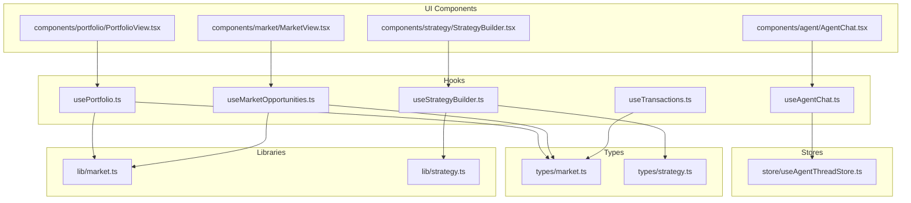
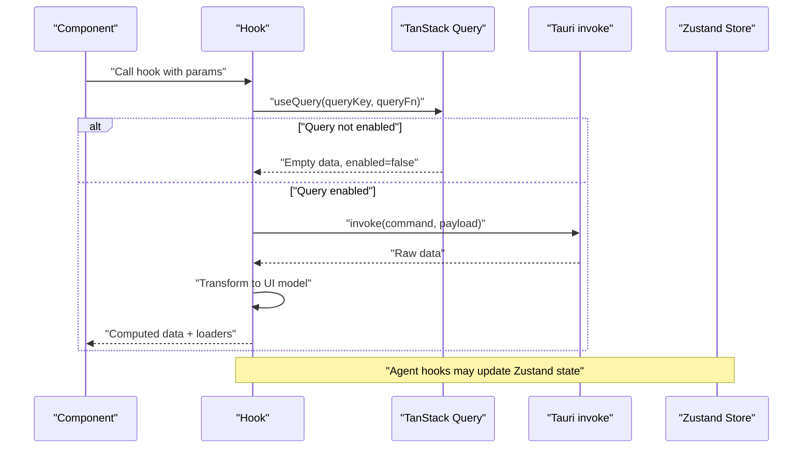
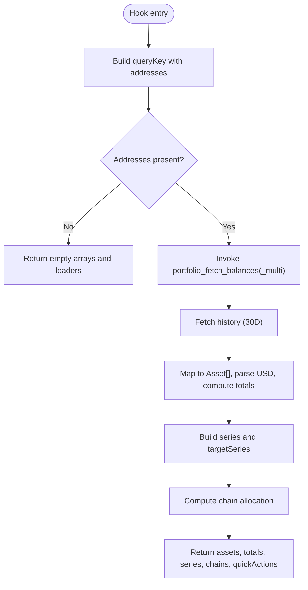
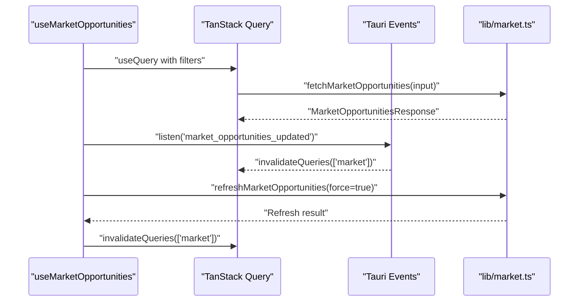
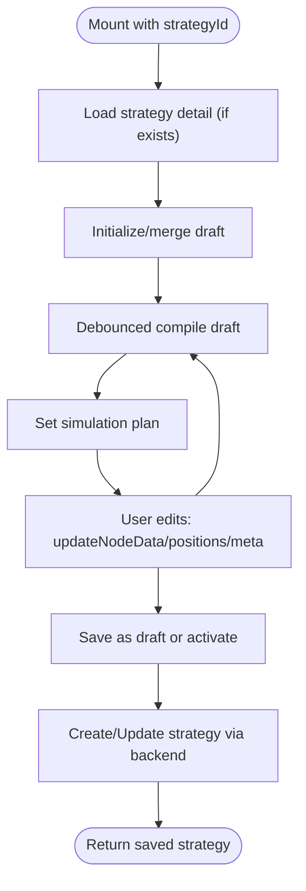
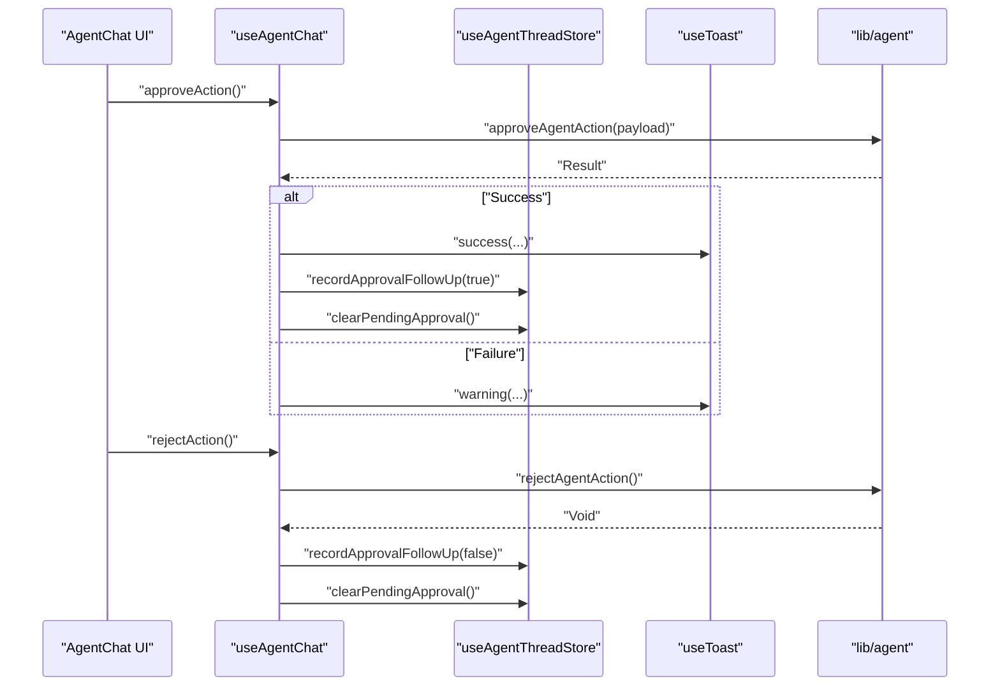
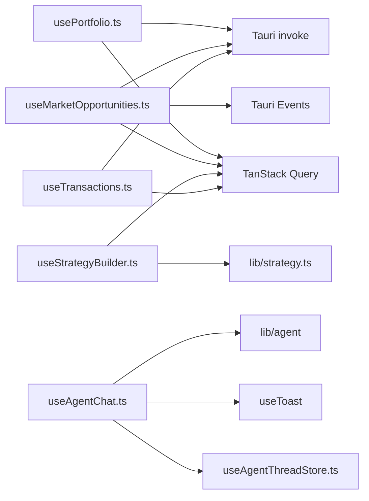

# Custom Hooks and Data Access Patterns

<cite>
**Referenced Files in This Document**
- [usePortfolio.ts](file://src/hooks/usePortfolio.ts)
- [useMarketOpportunities.ts](file://src/hooks/useMarketOpportunities.ts)
- [useStrategyBuilder.ts](file://src/hooks/useStrategyBuilder.ts)
- [useAgentChat.ts](file://src/hooks/useAgentChat.ts)
- [useTransactions.ts](file://src/hooks/useTransactions.ts)
- [market.ts](file://src/lib/market.ts)
- [strategy.ts](file://src/lib/strategy.ts)
- [useAgentThreadStore.ts](file://src/store/useAgentThreadStore.ts)
- [mock.ts](file://src/data/mock.ts)
- [market.ts (types)](file://src/types/market.ts)
- [strategy.ts (types)](file://src/types/strategy.ts)
- [PortfolioView.tsx](file://src/components/portfolio/PortfolioView.tsx)
- [MarketView.tsx](file://src/components/market/MarketView.tsx)
- [StrategyBuilder.tsx](file://src/components/strategy/StrategyBuilder.tsx)
- [AgentChat.tsx](file://src/components/agent/AgentChat.tsx)
</cite>

## Table of Contents
1. [Introduction](#introduction)
2. [Project Structure](#project-structure)
3. [Core Components](#core-components)
4. [Architecture Overview](#architecture-overview)
5. [Detailed Component Analysis](#detailed-component-analysis)
6. [Dependency Analysis](#dependency-analysis)
7. [Performance Considerations](#performance-considerations)
8. [Troubleshooting Guide](#troubleshooting-guide)
9. [Conclusion](#conclusion)
10. [Appendices](#appendices)

## Introduction
This document explains the custom React hooks and data access patterns used across the application, focusing on:
- usePortfolio for portfolio data access and derived analytics
- useMarketOpportunities for market data fetching and live updates
- useStrategyBuilder for strategy creation, editing, and compilation
- useAgentChat for agent-driven conversations and approval flows
- useTransactions for transaction history retrieval

It documents hook composition patterns, data transformation logic, integration with Tauri and TanStack Query, caching and stale-time strategies, optimistic updates, error handling, loading states, memoization, performance optimizations, and testing strategies.

## Project Structure
The hooks live under src/hooks and integrate with:
- Tauri backend via @tauri-apps/api/core invoke
- TanStack Query for caching and refetching
- Zustand stores for agent state and UI state
- Type-safe libraries for typed IPC calls and domain models

**Diagram sources**
- [usePortfolio.ts:1-184](file://src/hooks/usePortfolio.ts#L1-L184)
- [useMarketOpportunities.ts:1-131](file://src/hooks/useMarketOpportunities.ts#L1-L131)
- [useStrategyBuilder.ts:1-248](file://src/hooks/useStrategyBuilder.ts#L1-L248)
- [useAgentChat.ts:1-97](file://src/hooks/useAgentChat.ts#L1-L97)
- [useTransactions.ts:1-48](file://src/hooks/useTransactions.ts#L1-L48)
- [market.ts:1-135](file://src/lib/market.ts#L1-L135)
- [strategy.ts:1-218](file://src/lib/strategy.ts#L1-L218)
- [useAgentThreadStore.ts:1-642](file://src/store/useAgentThreadStore.ts#L1-L642)
- [market.ts (types):1-134](file://src/types/market.ts#L1-L134)
- [strategy.ts (types):1-258](file://src/types/strategy.ts#L1-L258)

**Section sources**
- [usePortfolio.ts:1-184](file://src/hooks/usePortfolio.ts#L1-L184)
- [useMarketOpportunities.ts:1-131](file://src/hooks/useMarketOpportunities.ts#L1-L131)
- [useStrategyBuilder.ts:1-248](file://src/hooks/useStrategyBuilder.ts#L1-L248)
- [useAgentChat.ts:1-97](file://src/hooks/useAgentChat.ts#L1-L97)
- [useTransactions.ts:1-48](file://src/hooks/useTransactions.ts#L1-L48)

## Core Components
- usePortfolio: Fetches balances and portfolio history, computes totals, chains breakdown, and time series; exposes loading/error/refetch.
- useMarketOpportunities: Fetches market opportunities, listens for live updates, supports manual refresh, and normalizes wallet filters.
- useStrategyBuilder: Manages strategy drafts, compiles plans, persists to backend, and tracks status/failure counts.
- useAgentChat: Drives agent messaging, handles approvals, integrates with UI store for pending approvals, and streams agent responses.
- useTransactions: Retrieves recent transactions for one or multiple addresses with caching and refetch.

**Section sources**
- [usePortfolio.ts:32-183](file://src/hooks/usePortfolio.ts#L32-L183)
- [useMarketOpportunities.ts:27-129](file://src/hooks/useMarketOpportunities.ts#L27-L129)
- [useStrategyBuilder.ts:37-246](file://src/hooks/useStrategyBuilder.ts#L37-L246)
- [useAgentChat.ts:13-95](file://src/hooks/useAgentChat.ts#L13-L95)
- [useTransactions.ts:23-46](file://src/hooks/useTransactions.ts#L23-L46)

## Architecture Overview
The hooks orchestrate data flows between UI, Tauri IPC, TanStack Query cache, and Zustand stores. They transform raw backend data into UI-ready shapes, manage loading and error states, and expose compositional APIs for components.

**Diagram sources**
- [usePortfolio.ts:44-60](file://src/hooks/usePortfolio.ts#L44-L60)
- [useMarketOpportunities.ts:39-62](file://src/hooks/useMarketOpportunities.ts#L39-L62)
- [useStrategyBuilder.ts:99-112](file://src/hooks/useStrategyBuilder.ts#L99-L112)
- [useAgentChat.ts:14-37](file://src/hooks/useAgentChat.ts#L14-L37)
- [market.ts:16-28](file://src/lib/market.ts#L16-L28)
- [strategy.ts:174-205](file://src/lib/strategy.ts#L174-L205)

## Detailed Component Analysis

### usePortfolio
Purpose:
- Fetch balances for one or multiple addresses
- Fetch portfolio history and compute derived analytics (total value, chain allocation, series)
- Expose loading, refetch, and error handling

Key behaviors:
- Uses invoke to call portfolio_fetch_balances or portfolio_fetch_balances_multi
- Computes total value by parsing USD strings and summing
- Builds chain allocation from history or computed totals
- Builds series and targetSeries from history points
- Provides quick actions and performance summary

**Diagram sources**
- [usePortfolio.ts:32-183](file://src/hooks/usePortfolio.ts#L32-L183)

**Section sources**
- [usePortfolio.ts:32-183](file://src/hooks/usePortfolio.ts#L32-L183)
- [mock.ts:114-127](file://src/data/mock.ts#L114-L127)

### useMarketOpportunities
Purpose:
- Fetch market opportunities with category/chain filters and wallet context
- Listen for live updates via Tauri events and invalidate queries
- Support manual refresh with forced recompute

Key behaviors:
- Normalizes wallet addresses and trims/filtering
- Uses queryKey with filters and normalized wallets
- Listens for market_opportunities_updated and market_opportunities_refresh_failed
- Provides refresh() that forces recomputation and invalidates cache

**Diagram sources**
- [useMarketOpportunities.ts:27-129](file://src/hooks/useMarketOpportunities.ts#L27-L129)
- [market.ts:16-40](file://src/lib/market.ts#L16-L40)

**Section sources**
- [useMarketOpportunities.ts:27-129](file://src/hooks/useMarketOpportunities.ts#L27-L129)
- [market.ts:16-40](file://src/lib/market.ts#L16-L40)
- [market.ts (types):69-76](file://src/types/market.ts#L69-L76)

### useStrategyBuilder
Purpose:
- Manage strategy drafts, selection, templates, and guardrails
- Compile drafts to preview plans and track validity
- Save drafts or activate strategies via backend

Key behaviors:
- Loads persisted strategy detail on mount and hydrates draft
- Debounced compilation using a timer to avoid excessive invokes
- Updates nodes, positions, and meta; adds/removes condition nodes
- Saves via create/update strategy from draft; tracks status and failure count

**Diagram sources**
- [useStrategyBuilder.ts:37-246](file://src/hooks/useStrategyBuilder.ts#L37-L246)
- [strategy.ts:13-172](file://src/lib/strategy.ts#L13-L172)
- [strategy.ts:174-205](file://src/lib/strategy.ts#L174-L205)
- [strategy.ts (types):110-121](file://src/types/strategy.ts#L110-L121)

**Section sources**
- [useStrategyBuilder.ts:37-246](file://src/hooks/useStrategyBuilder.ts#L37-L246)
- [strategy.ts:13-205](file://src/lib/strategy.ts#L13-L205)
- [strategy.ts (types):110-213](file://src/types/strategy.ts#L110-L213)

### useAgentChat
Purpose:
- Drive agent chat UI state and lifecycle
- Approve or reject pending agent actions
- Integrate with agent thread store and toast notifications

Key behaviors:
- Selects active thread and pending agent action
- Sends messages via store; approves/rejects actions via backend
- Records follow-up messages and clears pending approvals
- Exposes streaming state and suggestions

**Diagram sources**
- [useAgentChat.ts:13-95](file://src/hooks/useAgentChat.ts#L13-L95)
- [useAgentThreadStore.ts:621-642](file://src/store/useAgentThreadStore.ts#L621-L642)

**Section sources**
- [useAgentChat.ts:13-95](file://src/hooks/useAgentChat.ts#L13-L95)
- [useAgentThreadStore.ts:621-642](file://src/store/useAgentThreadStore.ts#L621-L642)

### useTransactions
Purpose:
- Retrieve recent transactions for one or multiple addresses
- Provide loading and refetch capabilities

Key behaviors:
- Builds queryKey from addresses and limit
- Invokes portfolio_fetch_transactions with array of addresses
- Returns normalized transaction rows

**Section sources**
- [useTransactions.ts:23-46](file://src/hooks/useTransactions.ts#L23-L46)
- [mock.ts:4-15](file://src/data/mock.ts#L4-L15)

## Dependency Analysis
- usePortfolio depends on:
  - TanStack Query for caching and refetch
  - Tauri invoke for balances and history
  - Types for portfolio and market models
- useMarketOpportunities depends on:
  - TanStack Query for caching
  - Tauri invoke via lib/market.ts
  - Event listeners for live updates
- useStrategyBuilder depends on:
  - Tauri invoke via lib/strategy.ts
  - Memoized computations for draft updates
- useAgentChat depends on:
  - useAgentThreadStore for state
  - useToast for feedback
  - lib/agent for approval/rejection
- useTransactions depends on:
  - TanStack Query and Tauri invoke

**Diagram sources**
- [usePortfolio.ts:1-184](file://src/hooks/usePortfolio.ts#L1-L184)
- [useMarketOpportunities.ts:1-131](file://src/hooks/useMarketOpportunities.ts#L1-L131)
- [useStrategyBuilder.ts:1-248](file://src/hooks/useStrategyBuilder.ts#L1-L248)
- [useAgentChat.ts:1-97](file://src/hooks/useAgentChat.ts#L1-L97)
- [useTransactions.ts:1-48](file://src/hooks/useTransactions.ts#L1-L48)
- [market.ts:1-135](file://src/lib/market.ts#L1-L135)
- [strategy.ts:1-218](file://src/lib/strategy.ts#L1-L218)
- [useAgentThreadStore.ts:1-642](file://src/store/useAgentThreadStore.ts#L1-L642)

**Section sources**
- [usePortfolio.ts:1-184](file://src/hooks/usePortfolio.ts#L1-L184)
- [useMarketOpportunities.ts:1-131](file://src/hooks/useMarketOpportunities.ts#L1-L131)
- [useStrategyBuilder.ts:1-248](file://src/hooks/useStrategyBuilder.ts#L1-L248)
- [useAgentChat.ts:1-97](file://src/hooks/useAgentChat.ts#L1-L97)
- [useTransactions.ts:1-48](file://src/hooks/useTransactions.ts#L1-L48)

## Performance Considerations
- Caching and stale-time:
  - usePortfolio and useTransactions set staleTime to 60 seconds
  - useMarketOpportunities sets staleTime to 60 seconds and disables refetch on window focus
- Memoization:
  - usePortfolio uses useMemo for totalValue, chains, series, and targetSeries to avoid recalculations
  - useStrategyBuilder uses useMemo for selectedNode and debounced compilation
- Debouncing:
  - useStrategyBuilder compiles after a 350ms delay to reduce backend calls during rapid edits
- Conditional enabling:
  - usePortfolio enables only when addressesToFetch is non-empty
  - useMarketOpportunities enables only in Tauri runtime
- Optimistic updates:
  - useAgentChat optimistically records approval follow-ups and clears pending state upon user action
- Avoid unnecessary renders:
  - useAgentChat wraps send/approve/reject with useCallback to prevent prop churn

**Section sources**
- [usePortfolio.ts:58-60](file://src/hooks/usePortfolio.ts#L58-L60)
- [useTransactions.ts:43-44](file://src/hooks/useTransactions.ts#L43-L44)
- [useMarketOpportunities.ts:61-62](file://src/hooks/useMarketOpportunities.ts#L61-L62)
- [usePortfolio.ts:76-155](file://src/hooks/usePortfolio.ts#L76-L155)
- [useStrategyBuilder.ts:99-112](file://src/hooks/useStrategyBuilder.ts#L99-L112)
- [useAgentChat.ts:31-78](file://src/hooks/useAgentChat.ts#L31-L78)

## Troubleshooting Guide
Common issues and patterns:
- Portfolio errors:
  - Hook maps error to a readable message and exposes balanceError; components should render a fallback when balanceError is truthy
- Market opportunities:
  - If Tauri runtime is unavailable, hook returns an empty response; ensure platform checks are respected
  - Manual refresh sets isRefreshing; handle spinner states in UI
- Strategy builder:
  - Compilation failures are reflected in simulation validity; UI should guide repair
  - Saving toggles isSaving; show progress and handle errors
- Agent chat:
  - Approve/reject actions may fail; toast warnings inform users and keep pending approvals visible for retry
  - Pending approvals are cleared after follow-up messages

**Section sources**
- [usePortfolio.ts:175-182](file://src/hooks/usePortfolio.ts#L175-L182)
- [useMarketOpportunities.ts:94-109](file://src/hooks/useMarketOpportunities.ts#L94-L109)
- [useStrategyBuilder.ts:205-223](file://src/hooks/useStrategyBuilder.ts#L205-L223)
- [useAgentChat.ts:39-78](file://src/hooks/useAgentChat.ts#L39-L78)

## Conclusion
These hooks form a cohesive data access layer:
- TanStack Query manages caching and refetching
- Tauri IPC bridges frontend to backend services
- Zustand stores encapsulate agent state and UI concerns
- Memoization and debouncing optimize performance
- Clear separation of concerns enables composable, testable components

## Appendices

### Hook Usage Examples in Components
- PortfolioView uses usePortfolio to render assets, charts, and quick actions
- MarketView uses useMarketOpportunities to render opportunities and refresh controls
- StrategyBuilder uses useStrategyBuilder to edit, simulate, and save strategies
- AgentChat uses useAgentChat to drive messaging, approvals, and follow-ups

**Section sources**
- [PortfolioView.tsx:1-200](file://src/components/portfolio/PortfolioView.tsx#L1-L200)
- [MarketView.tsx:1-200](file://src/components/market/MarketView.tsx#L1-L200)
- [StrategyBuilder.tsx:1-200](file://src/components/strategy/StrategyBuilder.tsx#L1-L200)
- [AgentChat.tsx:1-200](file://src/components/agent/AgentChat.tsx#L1-L200)

### Testing Strategies
- usePortfolio:
  - Mock invoke responses for balances and history
  - Test derived analytics with various USD strings and zero/negative values
- useMarketOpportunities:
  - Mock Tauri runtime presence and event listeners
  - Simulate refresh and invalidation flows
- useStrategyBuilder:
  - Snapshot draft mutations and compilation outcomes
  - Test save/create flows and status transitions
- useAgentChat:
  - Mock approval results and side effects
  - Verify pending approval clearing and follow-up messages
- useTransactions:
  - Mock invoke for transactions and test pagination via limit

[No sources needed since this section provides general guidance]