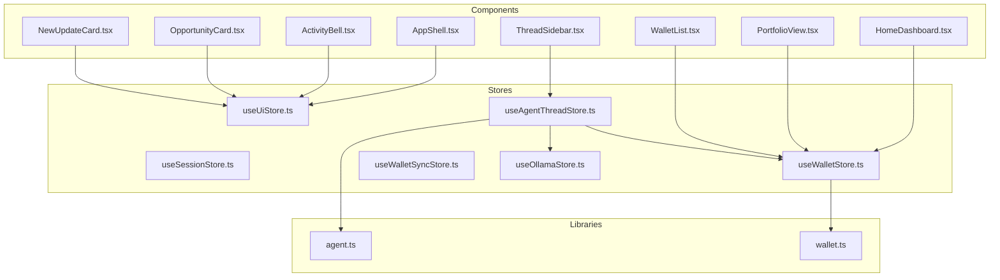
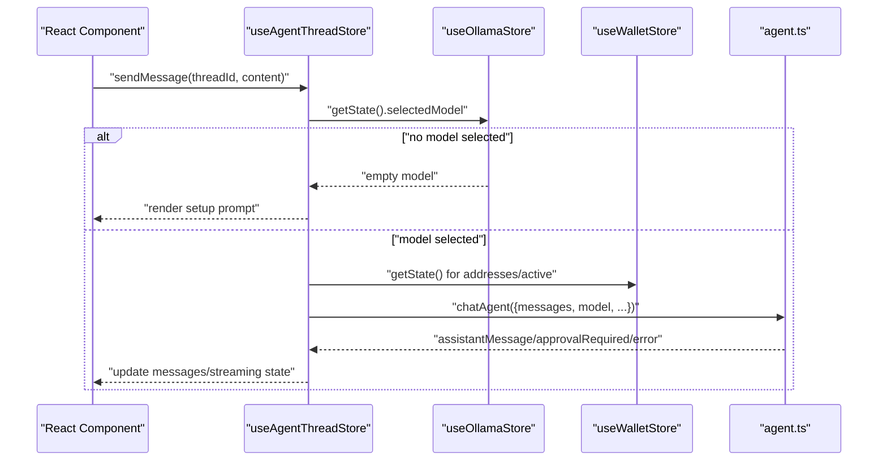
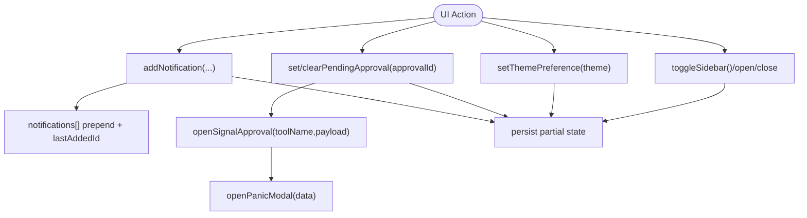
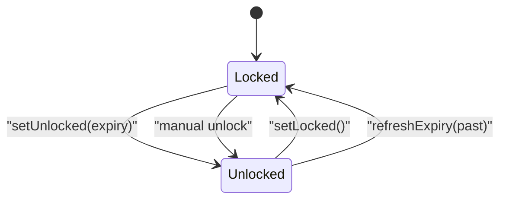
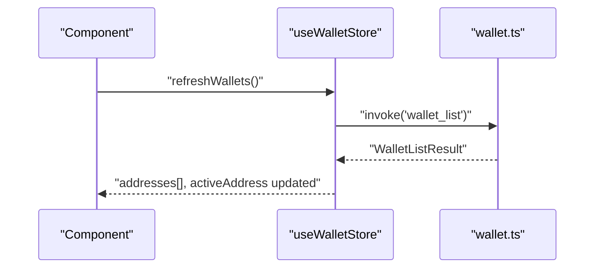
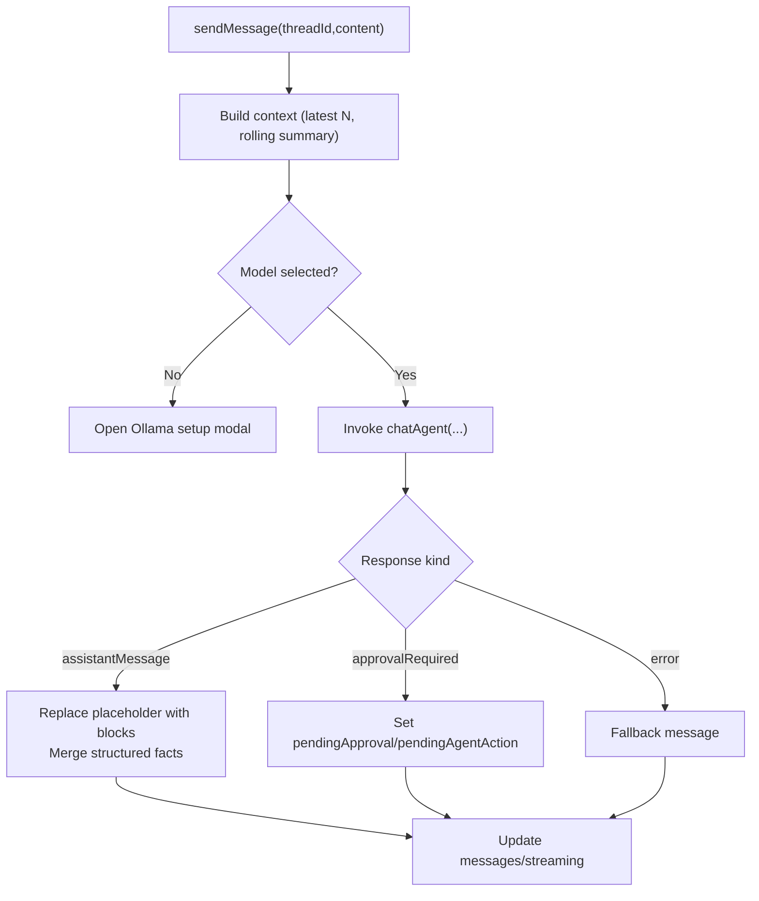
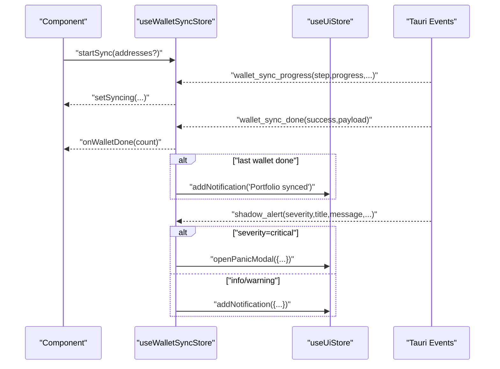
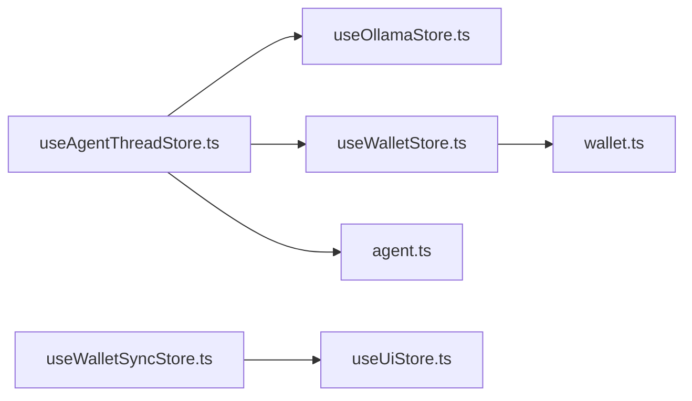

# Frontend State Stores

<cite>
**Referenced Files in This Document**
- [useUiStore.ts](file://src/store/useUiStore.ts)
- [useSessionStore.ts](file://src/store/useSessionStore.ts)
- [useWalletStore.ts](file://src/store/useWalletStore.ts)
- [useAgentThreadStore.ts](file://src/store/useAgentThreadStore.ts)
- [useWalletSyncStore.ts](file://src/store/useWalletSyncStore.ts)
- [useOllamaStore.ts](file://src/store/useOllamaStore.ts)
- [agent.ts](file://src/lib/agent.ts)
- [wallet.ts](file://src/types/wallet.ts)
- [useUiStore.test.ts](file://src/store/useUiStore.test.ts)
- [useAgentThreadStore.test.ts](file://src/store/useAgentThreadStore.test.ts)
- [ThreadSidebar.tsx](file://src/components/agent/ThreadSidebar.tsx)
- [AppShell.tsx](file://src/components/layout/AppShell.tsx)
- [ActivityBell.tsx](file://src/components/layout/ActivityBell.tsx)
- [HomeDashboard.tsx](file://src/components/home/HomeDashboard.tsx)
- [PortfolioView.tsx](file://src/components/portfolio/PortfolioView.tsx)
- [WalletList.tsx](file://src/components/wallet/WalletList.tsx)
- [OpportunityCard.tsx](file://src/components/agent/OpportunityCard.tsx)
- [NewUpdateCard.tsx](file://src/components/layout/NewUpdateCard.tsx)
</cite>

## Table of Contents
1. [Introduction](#introduction)
2. [Project Structure](#project-structure)
3. [Core Components](#core-components)
4. [Architecture Overview](#architecture-overview)
5. [Detailed Component Analysis](#detailed-component-analysis)
6. [Dependency Analysis](#dependency-analysis)
7. [Performance Considerations](#performance-considerations)
8. [Troubleshooting Guide](#troubleshooting-guide)
9. [Conclusion](#conclusion)
10. [Appendices](#appendices)

## Introduction
This document explains the frontend state stores architecture using Zustand across the application. It focuses on five primary stores:
- useUiStore: UI state and notifications
- useSessionStore: authentication/session lifecycle
- useWalletStore: wallet discovery and selection
- useAgentThreadStore: agent conversation threads and streaming
- useWalletSyncStore: wallet synchronization progress and events

Each store follows consistent patterns: explicit state shape definitions, action creators, optional persistence via Zustand middleware, and React integration via selector-based subscriptions. Cross-store communication is achieved through direct store reads and event-driven listeners.

## Project Structure
The state stores live under src/store and are consumed by React components across the UI. Persistence is applied selectively to reduce serialized payload sizes and improve performance.

**Diagram sources**
- [useUiStore.ts:1-162](file://src/store/useUiStore.ts#L1-L162)
- [useSessionStore.ts:1-28](file://src/store/useSessionStore.ts#L1-L28)
- [useWalletStore.ts:1-48](file://src/store/useWalletStore.ts#L1-L48)
- [useAgentThreadStore.ts:1-642](file://src/store/useAgentThreadStore.ts#L1-L642)
- [useWalletSyncStore.ts:1-199](file://src/store/useWalletSyncStore.ts#L1-L199)
- [useOllamaStore.ts:1-82](file://src/store/useOllamaStore.ts#L1-L82)
- [agent.ts:1-86](file://src/lib/agent.ts#L1-L86)
- [wallet.ts:1-59](file://src/types/wallet.ts#L1-L59)
- [AppShell.tsx](file://src/components/layout/AppShell.tsx)
- [ActivityBell.tsx](file://src/components/layout/ActivityBell.tsx)
- [HomeDashboard.tsx](file://src/components/home/HomeDashboard.tsx)
- [PortfolioView.tsx](file://src/components/portfolio/PortfolioView.tsx)
- [WalletList.tsx](file://src/components/wallet/WalletList.tsx)
- [ThreadSidebar.tsx](file://src/components/agent/ThreadSidebar.tsx)
- [OpportunityCard.tsx](file://src/components/agent/OpportunityCard.tsx)
- [NewUpdateCard.tsx](file://src/components/layout/NewUpdateCard.tsx)

**Section sources**
- [useUiStore.ts:1-162](file://src/store/useUiStore.ts#L1-L162)
- [useSessionStore.ts:1-28](file://src/store/useSessionStore.ts#L1-L28)
- [useWalletStore.ts:1-48](file://src/store/useWalletStore.ts#L1-L48)
- [useAgentThreadStore.ts:1-642](file://src/store/useAgentThreadStore.ts#L1-L642)
- [useWalletSyncStore.ts:1-199](file://src/store/useWalletSyncStore.ts#L1-L199)
- [useOllamaStore.ts:1-82](file://src/store/useOllamaStore.ts#L1-L82)
- [agent.ts:1-86](file://src/lib/agent.ts#L1-L86)
- [wallet.ts:1-59](file://src/types/wallet.ts#L1-L59)

## Core Components
- useUiStore: Manages theme, sidebar, command palette, portfolio actions, notifications, and panic modal state. Uses persistence to keep preferences and notifications across sessions.
- useSessionStore: Tracks lock state, expiry, active address, and unlock dialog visibility.
- useWalletStore: Holds discovered wallet addresses, active address, and named wallets; exposes refresh and naming actions; persists only selective fields.
- useAgentThreadStore: Maintains agent threads, streaming state, rolling summaries, structured facts, and approval flows; persists threads and active thread id with migration support.
- useWalletSyncStore: Coordinates wallet sync progress, completion, and integrates with Tauri event channels for progress, completion, and alerts.

**Section sources**
- [useUiStore.ts:28-162](file://src/store/useUiStore.ts#L28-L162)
- [useSessionStore.ts:3-28](file://src/store/useSessionStore.ts#L3-L28)
- [useWalletStore.ts:7-48](file://src/store/useWalletStore.ts#L7-L48)
- [useAgentThreadStore.ts:71-120](file://src/store/useAgentThreadStore.ts#L71-L120)
- [useWalletSyncStore.ts:10-74](file://src/store/useWalletSyncStore.ts#L10-L74)

## Architecture Overview
Zustand stores are thin, focused units of state with minimal coupling. They expose actions that mutate internal state and optionally persist subsets of state. Components subscribe to slices of state via selector functions to optimize re-renders. Some stores integrate with Tauri events for real-time updates.

**Diagram sources**
- [useAgentThreadStore.ts:198-533](file://src/store/useAgentThreadStore.ts#L198-L533)
- [useOllamaStore.ts:39-80](file://src/store/useOllamaStore.ts#L39-L80)
- [useWalletStore.ts:16-47](file://src/store/useWalletStore.ts#L16-L47)
- [agent.ts:14-27](file://src/lib/agent.ts#L14-L27)

## Detailed Component Analysis

### useUiStore: UI state and notifications
- State shape: privacy mode, developer mode, sidebar, command palette, pending approval, theme preference, portfolio action, skipped approval strategy ids, notifications, last added notification id, active signal payload/tool, panic modal state.
- Actions: toggles, open/close helpers, portfolio action handlers, skip approval toggler, notification CRUD, signal approval, panic modal controls.
- Persistence: partializes privacy, developer mode, theme, skipped approvals, and notifications.
- Selector usage examples:
  - AppShell.tsx subscribes to pending approval, active signal payload, and theme preference.
  - ActivityBell.tsx subscribes to notifications and read/archive actions.
  - OpportunityCard.tsx subscribes to pending approval and skipped strategy ids.
  - NewUpdateCard.tsx subscribes to last added notification id and notifications list.

**Diagram sources**
- [useUiStore.ts:87-159](file://src/store/useUiStore.ts#L87-L159)

**Section sources**
- [useUiStore.ts:28-162](file://src/store/useUiStore.ts#L28-L162)
- [AppShell.tsx](file://src/components/layout/AppShell.tsx)
- [ActivityBell.tsx](file://src/components/layout/ActivityBell.tsx)
- [OpportunityCard.tsx](file://src/components/agent/OpportunityCard.tsx)
- [NewUpdateCard.tsx](file://src/components/layout/NewUpdateCard.tsx)

### useSessionStore: Authentication and session lifecycle
- State shape: locked, expiresAt, activeAddress, showUnlockDialog.
- Actions: setLocked, setUnlocked(expiresAt), refreshExpiry(expiresAt), setActiveAddress(address), open/closeUnlockDialog.
- Typical usage: components can read activeAddress and locked state to gate UI or trigger unlock dialogs.

**Diagram sources**
- [useSessionStore.ts:16-27](file://src/store/useSessionStore.ts#L16-L27)

**Section sources**
- [useSessionStore.ts:3-28](file://src/store/useSessionStore.ts#L3-L28)

### useWalletStore: Wallet discovery and selection
- State shape: addresses[], activeAddress, walletNames{}.
- Actions: refreshWallets (invokes backend), setActiveAddress, setWalletName.
- Persistence: persists walletNames only.
- Integration: components read addresses and activeAddress to render lists and selections; refreshWallets ensures state aligns with backend.

**Diagram sources**
- [useWalletStore.ts:23-37](file://src/store/useWalletStore.ts#L23-L37)
- [wallet.ts:12-14](file://src/types/wallet.ts#L12-L14)

**Section sources**
- [useWalletStore.ts:7-48](file://src/store/useWalletStore.ts#L7-L48)
- [wallet.ts:1-59](file://src/types/wallet.ts#L1-L59)
- [HomeDashboard.tsx](file://src/components/home/HomeDashboard.tsx)
- [PortfolioView.tsx](file://src/components/portfolio/PortfolioView.tsx)
- [WalletList.tsx](file://src/components/wallet/WalletList.tsx)

### useAgentThreadStore: Agent conversation state
- State shape: threads[], activeThreadId, plus derived fields per Thread (messages, rollingSummary, structuredFacts, isStreaming, suggestions, pendingApproval, pendingAgentAction).
- Actions: createThread, startThreadWithDraft, openMarketApprovalThread, setActiveThreadId, sendMessage, deleteThread, clearPendingApprovalForThread, recordApprovalFollowUp.
- Middleware: persist with partialize of threads and activeThreadId; migration adds missing fields.
- Streaming and context: sendMessage builds context, conditionally generates rolling summaries, merges structured facts, and invokes chatAgent. It handles assistantMessage, approvalRequired, and error cases.
- Cross-store usage: reads selected model from useOllamaStore and wallet info from useWalletStore.

**Diagram sources**
- [useAgentThreadStore.ts:198-533](file://src/store/useAgentThreadStore.ts#L198-L533)
- [useOllamaStore.ts:39-80](file://src/store/useOllamaStore.ts#L39-L80)
- [useWalletStore.ts:16-47](file://src/store/useWalletStore.ts#L16-L47)
- [agent.ts:14-27](file://src/lib/agent.ts#L14-L27)

**Section sources**
- [useAgentThreadStore.ts:71-621](file://src/store/useAgentThreadStore.ts#L71-L621)
- [useAgentThreadStore.test.ts:1-72](file://src/store/useAgentThreadStore.test.ts#L1-L72)

### useWalletSyncStore: Wallet synchronization
- State shape: syncStatus, progress, currentStep, walletCount, walletIndex, doneCount.
- Actions: setSyncing, onWalletDone, setIdle, startSync.
- Event listeners: listens to Tauri events for progress, completion, and alerts; dispatches UI notifications and panic modal for critical alerts.
- Integration: components can read progress and status to render sync UI; listeners auto-update state and notify users.

**Diagram sources**
- [useWalletSyncStore.ts:64-151](file://src/store/useWalletSyncStore.ts#L64-L151)
- [useWalletSyncStore.ts:163-199](file://src/store/useWalletSyncStore.ts#L163-L199)

**Section sources**
- [useWalletSyncStore.ts:10-199](file://src/store/useWalletSyncStore.ts#L10-L199)

## Dependency Analysis
- Cross-store dependencies:
  - useAgentThreadStore depends on useOllamaStore for model selection and useWalletStore for wallet context.
  - useWalletSyncStore depends on useUiStore for notifications and panic modal.
- Backend integration:
  - useWalletStore uses Tauri invoke to list wallets.
  - useAgentThreadStore uses Tauri invoke to chat with the agent.
- Event-driven updates:
  - useWalletSyncStore listens to Tauri events for progress, completion, and alerts.

**Diagram sources**
- [useAgentThreadStore.ts:19-21](file://src/store/useAgentThreadStore.ts#L19-L21)
- [useWalletSyncStore.ts:6](file://src/store/useWalletSyncStore.ts#L6)
- [agent.ts:1-27](file://src/lib/agent.ts#L1-L27)
- [wallet.ts:12-14](file://src/types/wallet.ts#L12-L14)

**Section sources**
- [useAgentThreadStore.ts:19-21](file://src/store/useAgentThreadStore.ts#L19-L21)
- [useWalletSyncStore.ts:6](file://src/store/useWalletSyncStore.ts#L6)
- [agent.ts:1-86](file://src/lib/agent.ts#L1-L86)
- [wallet.ts:1-59](file://src/types/wallet.ts#L1-L59)

## Performance Considerations
- Selective persistence: Only persist essential fields (e.g., theme, notifications, wallet names) to minimize storage footprint and speed up hydration.
- Partial state updates: Subscribe to small slices of state in components to avoid unnecessary re-renders.
- Asynchronous actions: Wallet refresh and agent chat are async; ensure UI reflects loading/streaming states to prevent redundant requests.
- Migration safety: useAgentThreadStore includes a migration to normalize persisted state, preventing crashes on schema changes.
- Avoid deep equality checks: Keep state flat or normalized where possible; the stores maintain simple shapes to ease updates.

[No sources needed since this section provides general guidance]

## Troubleshooting Guide
- Notifications not appearing:
  - Verify useUiStore persistence and selector usage in ActivityBell.tsx and NewUpdateCard.tsx.
  - Confirm that addNotification is called with required fields and that lastAddedNotificationId is cleared appropriately.
- Wallet list empty or stale:
  - Call useWalletStore.refreshWallets and ensure invoke resolves to WalletListResult with addresses.
  - Check that activeAddress is reset if removed from the list.
- Agent not responding:
  - Ensure a model is selected in useOllamaStore; otherwise, the store opens the setup modal.
  - Confirm chatAgent invocation succeeds and that messages are built with sufficient context.
- Sync progress not updating:
  - Ensure Tauri events are available and listeners are registered via useWalletSyncListeners.
  - Verify startSync is invoked and that progress/done counts are updated correctly.

**Section sources**
- [useUiStore.ts:112-146](file://src/store/useUiStore.ts#L112-L146)
- [useWalletStore.ts:23-37](file://src/store/useWalletStore.ts#L23-L37)
- [useAgentThreadStore.ts:243-274](file://src/store/useAgentThreadStore.ts#L243-L274)
- [useWalletSyncStore.ts:111-151](file://src/store/useWalletSyncStore.ts#L111-L151)

## Conclusion
The Zustand-based stores provide a clean separation of concerns: UI, session, wallet, agent threads, and wallet sync. They leverage persistence for user preferences and conversation continuity, integrate with backend services via Tauri, and communicate across stores through direct state reads and event listeners. Following the established patterns enables safe extension and maintenance of state logic.

[No sources needed since this section summarizes without analyzing specific files]

## Appendices

### Store initialization and defaults
- useUiStore exports uiStoreDefaults for test resets and initial hydration.
- useAgentThreadStore initializes with a single empty thread and sets it as active.

**Section sources**
- [useUiStore.ts:161-162](file://src/store/useUiStore.ts#L161-L162)
- [useAgentThreadStore.ts:101-117](file://src/store/useAgentThreadStore.ts#L101-L117)

### State selectors and component usage patterns
- Components subscribe to specific fields via selector functions to minimize re-renders.
- Examples:
  - AppShell.tsx: pending approval, active signal payload, theme preference, command palette.
  - ActivityBell.tsx: notifications list and CRUD actions.
  - ThreadSidebar.tsx: threads, activeThreadId, and thread management actions.
  - Wallet-related components: addresses, activeAddress, refreshWallets.

**Section sources**
- [AppShell.tsx](file://src/components/layout/AppShell.tsx)
- [ActivityBell.tsx](file://src/components/layout/ActivityBell.tsx)
- [ThreadSidebar.tsx](file://src/components/agent/ThreadSidebar.tsx)
- [HomeDashboard.tsx](file://src/components/home/HomeDashboard.tsx)
- [PortfolioView.tsx](file://src/components/portfolio/PortfolioView.tsx)
- [WalletList.tsx](file://src/components/wallet/WalletList.tsx)

### Testing patterns
- useUiStore.test.ts resets localStorage and verifies toggles, pending approval, and theme preference.
- useAgentThreadStore.test.ts mocks chatAgent and asserts context building across multiple messages.

**Section sources**
- [useUiStore.test.ts:1-41](file://src/store/useUiStore.test.ts#L1-L41)
- [useAgentThreadStore.test.ts:1-72](file://src/store/useAgentThreadStore.test.ts#L1-L72)