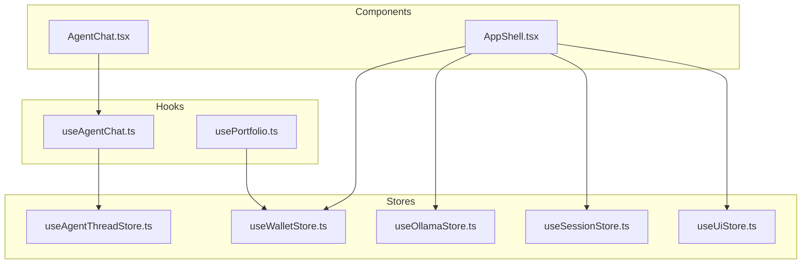
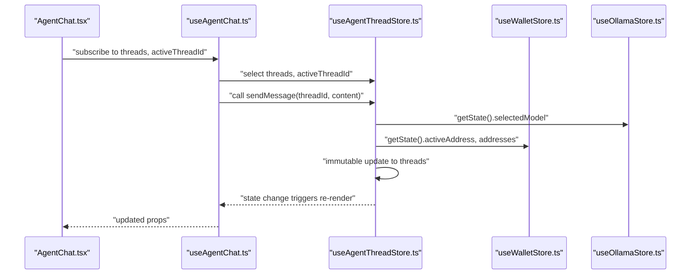
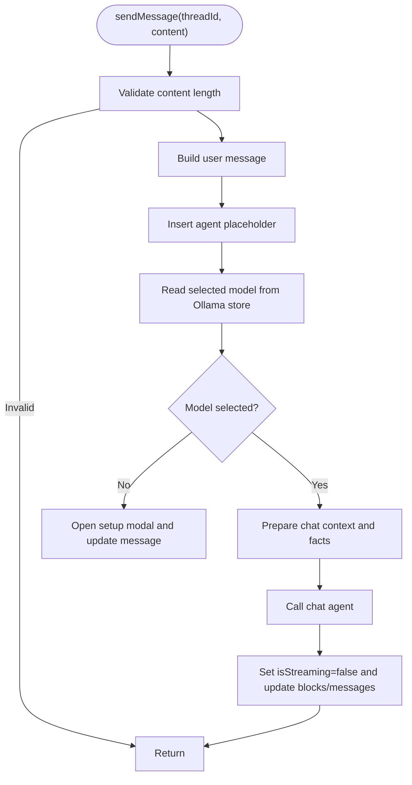
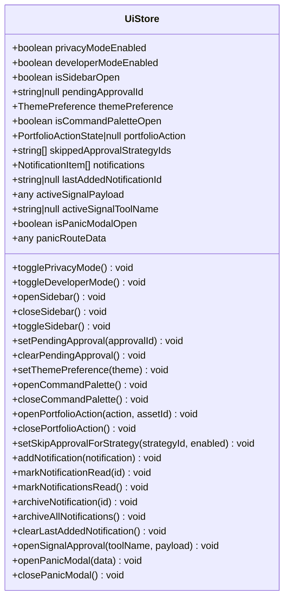
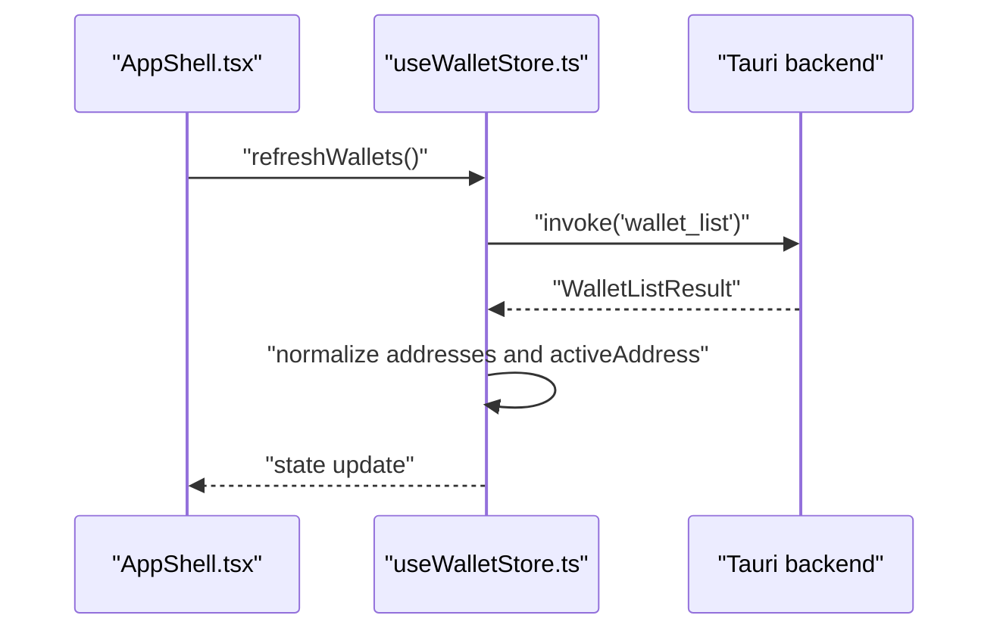
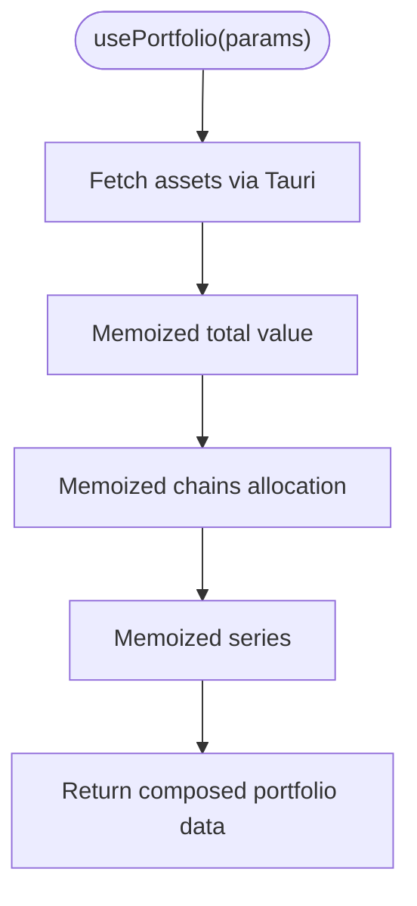
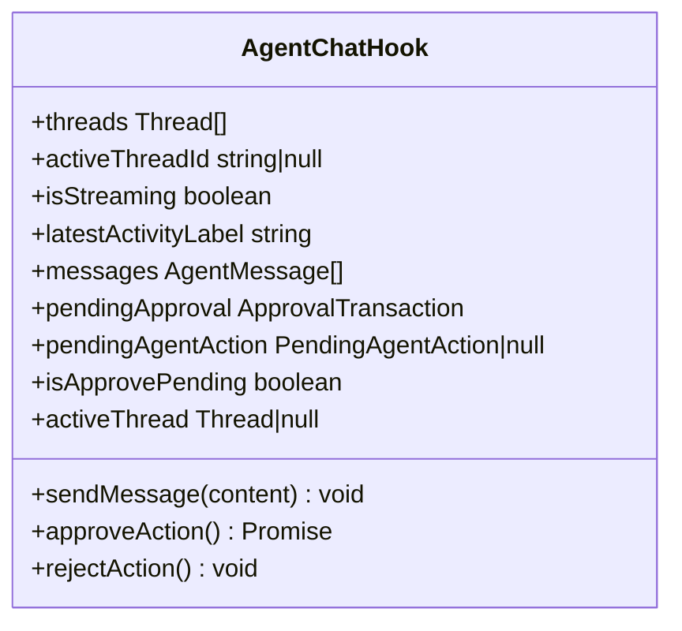
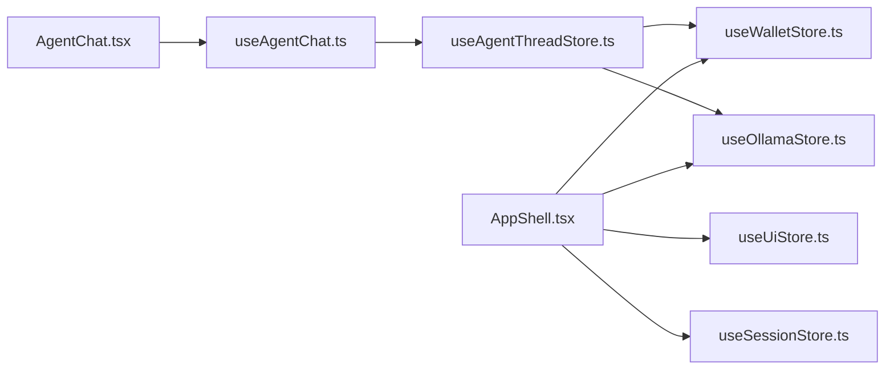

# Performance Optimization and Best Practices

<cite>
**Referenced Files in This Document**
- [useAgentThreadStore.ts](file://src/store/useAgentThreadStore.ts)
- [useUiStore.ts](file://src/store/useUiStore.ts)
- [useWalletStore.ts](file://src/store/useWalletStore.ts)
- [useSessionStore.ts](file://src/store/useSessionStore.ts)
- [useOllamaStore.ts](file://src/store/useOllamaStore.ts)
- [useAgentThreadStore.test.ts](file://src/store/useAgentThreadStore.test.ts)
- [useUiStore.test.ts](file://src/store/useUiStore.test.ts)
- [useAgentChat.ts](file://src/hooks/useAgentChat.ts)
- [usePortfolio.ts](file://src/hooks/usePortfolio.ts)
- [AgentChat.tsx](file://src/components/agent/AgentChat.tsx)
- [AppShell.tsx](file://src/components/layout/AppShell.tsx)
</cite>

## Table of Contents
1. [Introduction](#introduction)
2. [Project Structure](#project-structure)
3. [Core Components](#core-components)
4. [Architecture Overview](#architecture-overview)
5. [Detailed Component Analysis](#detailed-component-analysis)
6. [Dependency Analysis](#dependency-analysis)
7. [Performance Considerations](#performance-considerations)
8. [Troubleshooting Guide](#troubleshooting-guide)
9. [Conclusion](#conclusion)
10. [Appendices](#appendices)

## Introduction
This document focuses on state management performance optimization and best practices within the codebase. It explains how stores are structured, how components subscribe to state, and how to optimize rendering, selectors, equality checks, normalization, batching, and debouncing. It also covers performance monitoring, state size management, memory leak prevention, and debugging techniques for state-related bottlenecks.

## Project Structure
The state management layer is primarily implemented with Zustand stores under the src/store directory. Stores encapsulate domain-specific state and actions, and are consumed via React hooks. UI components subscribe selectively to minimize re-renders. Some data is fetched via Tauri invocations and cached via React Query in hooks.

**Diagram sources**
- [useAgentThreadStore.ts:121-621](file://src/store/useAgentThreadStore.ts#L121-L621)
- [useUiStore.ts:87-159](file://src/store/useUiStore.ts#L87-L159)
- [useWalletStore.ts:16-47](file://src/store/useWalletStore.ts#L16-L47)
- [useSessionStore.ts:16-27](file://src/store/useSessionStore.ts#L16-L27)
- [useOllamaStore.ts:39-80](file://src/store/useOllamaStore.ts#L39-L80)
- [useAgentChat.ts:13-96](file://src/hooks/useAgentChat.ts#L13-L96)
- [usePortfolio.ts:32-183](file://src/hooks/usePortfolio.ts#L32-L183)
- [AgentChat.tsx:10-123](file://src/components/agent/AgentChat.tsx#L10-L123)
- [AppShell.tsx:31-276](file://src/components/layout/AppShell.tsx#L31-L276)

**Section sources**
- [useAgentThreadStore.ts:121-621](file://src/store/useAgentThreadStore.ts#L121-L621)
- [useUiStore.ts:87-159](file://src/store/useUiStore.ts#L87-L159)
- [useWalletStore.ts:16-47](file://src/store/useWalletStore.ts#L16-L47)
- [useSessionStore.ts:16-27](file://src/store/useSessionStore.ts#L16-L27)
- [useOllamaStore.ts:39-80](file://src/store/useOllamaStore.ts#L39-L80)
- [useAgentChat.ts:13-96](file://src/hooks/useAgentChat.ts#L13-L96)
- [usePortfolio.ts:32-183](file://src/hooks/usePortfolio.ts#L32-L183)
- [AgentChat.tsx:10-123](file://src/components/agent/AgentChat.tsx#L10-L123)
- [AppShell.tsx:31-276](file://src/components/layout/AppShell.tsx#L31-L276)

## Core Components
- Agent thread state: Manages chat threads, streaming state, rolling summaries, structured facts, and approval flows. Optimized with targeted updates and immutable-like transformations.
- UI state: Tracks theme, sidebar, command palette, notifications, and pending approvals. Persisted partially to reduce storage footprint.
- Wallet state: Holds addresses, active address, and wallet names. Refreshes asynchronously and normalizes wallet names.
- Session state: Encapsulates lock/unlock state, expiry, and unlock dialog visibility.
- Ollama state: Tracks model selection, setup progress, and modal visibility. Persisted to maintain user choices.

Key performance patterns:
- Selective subscription: Components subscribe to narrow slices of state to avoid unnecessary re-renders.
- Immutable transformations: Updates clone only affected branches of state.
- Persistence boundaries: Partial persistence limits serialized state size.
- Memoization: Hooks compute derived data efficiently using useMemo.

**Section sources**
- [useAgentThreadStore.ts:71-117](file://src/store/useAgentThreadStore.ts#L71-L117)
- [useUiStore.ts:28-85](file://src/store/useUiStore.ts#L28-L85)
- [useWalletStore.ts:7-14](file://src/store/useWalletStore.ts#L7-L14)
- [useSessionStore.ts:3-14](file://src/store/useSessionStore.ts#L3-L14)
- [useOllamaStore.ts:20-37](file://src/store/useOllamaStore.ts#L20-L37)

## Architecture Overview
The system uses a layered approach:
- Stores: Define state and actions with Zustand, optionally persisted.
- Hooks: Expose typed selectors and convenience functions to components.
- Components: Subscribe to minimal state slices and render efficiently.

**Diagram sources**
- [AgentChat.tsx:10-123](file://src/components/agent/AgentChat.tsx#L10-L123)
- [useAgentChat.ts:13-96](file://src/hooks/useAgentChat.ts#L13-L96)
- [useAgentThreadStore.ts:198-533](file://src/store/useAgentThreadStore.ts#L198-L533)
- [useWalletStore.ts:310-317](file://src/store/useWalletStore.ts#L310-L317)
- [useOllamaStore.ts:244-246](file://src/store/useOllamaStore.ts#L244-L246)

## Detailed Component Analysis

### Agent Thread Store: Selective Updates and Memoization
- Selective subscription: Components use narrow selectors to subscribe to only the fields they need.
- Immutable updates: Each state update clones only the affected thread and message arrays, avoiding full re-allocations.
- Derived computations: Title derivation and structured facts merging occur outside the store to keep state flat and serializable.
- Streaming UX: isStreaming toggles and placeholder messages are inserted to improve perceived responsiveness.

**Diagram sources**
- [useAgentThreadStore.ts:198-533](file://src/store/useAgentThreadStore.ts#L198-L533)
- [useOllamaStore.ts:244-246](file://src/store/useOllamaStore.ts#L244-L246)
- [useWalletStore.ts:310-317](file://src/store/useWalletStore.ts#L310-L317)

**Section sources**
- [useAgentThreadStore.ts:198-533](file://src/store/useAgentThreadStore.ts#L198-L533)
- [useAgentThreadStore.test.ts:31-71](file://src/store/useAgentThreadStore.test.ts#L31-L71)

### UI Store: Persisted Partial State and Equality Checks
- Partial persistence: Only selected fields are persisted, reducing storage overhead and migration complexity.
- Equality checks: Using shallow equality for primitive fields avoids deep comparisons in selectors.
- Batched UI toggles: Functions like open/close helpers update single booleans, minimizing churn.

**Diagram sources**
- [useUiStore.ts:28-159](file://src/store/useUiStore.ts#L28-L159)

**Section sources**
- [useUiStore.ts:87-159](file://src/store/useUiStore.ts#L87-L159)
- [useUiStore.test.ts:15-40](file://src/store/useUiStore.test.ts#L15-L40)

### Wallet Store: Asynchronous Refresh and Normalization
- Asynchronous refresh: Uses Tauri invoke to fetch wallet lists and reconcile active address.
- Normalized names: Wallet names are normalized and stored per address to avoid repeated parsing.

**Diagram sources**
- [useWalletStore.ts:23-37](file://src/store/useWalletStore.ts#L23-L37)
- [AppShell.tsx:70-72](file://src/components/layout/AppShell.tsx#L70-L72)

**Section sources**
- [useWalletStore.ts:16-47](file://src/store/useWalletStore.ts#L16-L47)
- [AppShell.tsx:70-72](file://src/components/layout/AppShell.tsx#L70-L72)

### Portfolio Hook: Memoization and Derived Data
- Memoized derivations: Total value, chain breakdown, and series are computed with useMemo to avoid recalculating on every render.
- Efficient aggregation: Uses maps and reduces to compute totals and allocations.
- Query caching: React Query caches balances and history with sensible stale times.

**Diagram sources**
- [usePortfolio.ts:32-183](file://src/hooks/usePortfolio.ts#L32-L183)

**Section sources**
- [usePortfolio.ts:32-183](file://src/hooks/usePortfolio.ts#L32-L183)

### Agent Chat Hook: Selective Subscription and Stable Callbacks
- Narrow selectors: Subscribes only to threads, activeThreadId, and sendMessage.
- Stable callbacks: Uses useCallback to prevent re-renders caused by function identity changes.
- Derived pending action: Computes pendingAgentAction from activeThread.

**Diagram sources**
- [useAgentChat.ts:13-96](file://src/hooks/useAgentChat.ts#L13-L96)

**Section sources**
- [useAgentChat.ts:13-96](file://src/hooks/useAgentChat.ts#L13-L96)

## Dependency Analysis
- Component-to-hook-to-store coupling is loose: components depend on hooks, which depend on stores. This improves testability and modularity.
- Cross-store reads: The agent thread store reads from wallet and Ollama stores during message processing. This is acceptable for small, infrequent operations but should be monitored for hot paths.
- Persistence boundaries: Stores define partialize and migrations to manage state evolution and size.

**Diagram sources**
- [AgentChat.tsx:10-123](file://src/components/agent/AgentChat.tsx#L10-L123)
- [useAgentChat.ts:13-96](file://src/hooks/useAgentChat.ts#L13-L96)
- [useAgentThreadStore.ts:198-533](file://src/store/useAgentThreadStore.ts#L198-L533)
- [useWalletStore.ts:310-317](file://src/store/useWalletStore.ts#L310-L317)
- [useOllamaStore.ts:244-246](file://src/store/useOllamaStore.ts#L244-L246)
- [AppShell.tsx:31-276](file://src/components/layout/AppShell.tsx#L31-L276)

**Section sources**
- [AgentChat.tsx:10-123](file://src/components/agent/AgentChat.tsx#L10-L123)
- [useAgentChat.ts:13-96](file://src/hooks/useAgentChat.ts#L13-L96)
- [useAgentThreadStore.ts:198-533](file://src/store/useAgentThreadStore.ts#L198-L533)
- [useWalletStore.ts:310-317](file://src/store/useWalletStore.ts#L310-L317)
- [useOllamaStore.ts:244-246](file://src/store/useOllamaStore.ts#L244-L246)
- [AppShell.tsx:31-276](file://src/components/layout/AppShell.tsx#L31-L276)

## Performance Considerations

### Selective State Updates and Rendering Optimization
- Prefer narrow selectors to subscribe to only the fields needed by a component. This minimizes re-renders when unrelated parts of state change.
- Use stable callback wrappers (useCallback) around handlers passed down to child components to avoid prop drift and unnecessary re-renders.
- Keep state flat and serializable to enable shallow equality checks and efficient re-renders.

### Memoization Strategies
- Use useMemo for derived computations that depend on expensive operations or large arrays. Examples include total value calculations, chain allocations, and series generation.
- Memoize computed UI props in hooks to prevent recomputation across renders.

### Shallow vs Deep Equality Checks
- Zustand’s default equality is shallow. Favor primitives and immutable-like updates to leverage shallow equality and avoid deep comparisons.
- Avoid storing large nested objects in state; normalize data and store references instead.

### Selector Optimization
- Use typed selectors in hooks to ensure only required fields are subscribed.
- Avoid anonymous functions inside render; define selectors and callbacks outside render to preserve referential stability.

### State Normalization Techniques
- Normalize related entities (e.g., wallet names keyed by address) to reduce duplication and simplify updates.
- Keep rolling summaries and structured facts as lightweight strings or compact JSON to minimize serialization cost.

### State Size Management
- Use partial persistence to exclude rarely-changing or transient fields.
- Implement migrations to evolve state shape without bloating persisted data.

### Memory Leak Prevention
- Avoid retaining references to removed DOM nodes or long-lived listeners. Use cleanup in effects and remove event listeners when components unmount.
- Limit the number of subscriptions in hot components; prefer scoped hooks that subscribe to minimal state.

### Performance Monitoring Approaches
- Measure render counts and update frequency using React DevTools Profiler.
- Track store update logs for hot paths (e.g., agent messaging) to detect excessive churn.
- Monitor bundle size and hydration time; ensure heavy libraries are lazy-loaded.

### Optimized State Access Patterns
- Batch related updates using a single set call when possible to reduce re-renders.
- Debounce frequent user inputs (e.g., search filters) before updating state to avoid thrashing.

### Batch Updates and Debounced Changes
- For rapid-fire updates, coalesce changes into a single state update or schedule updates with setTimeout or requestAnimationFrame.
- Debounce UI-driven state changes (e.g., filter toggles) to stabilize rendering.

### Data Transformation Efficiency
- Prefer streaming transforms and incremental updates for large datasets.
- Cache transformed results keyed by inputs to avoid recomputation.

### Debugging Tools and Techniques
- Use React DevTools to inspect component trees, highlights, and subscription boundaries.
- Add logging around store updates for hot paths to identify redundant writes.
- Validate selector correctness with unit tests that assert minimal re-rendering.

**Section sources**
- [useAgentThreadStore.ts:198-533](file://src/store/useAgentThreadStore.ts#L198-L533)
- [usePortfolio.ts:76-155](file://src/hooks/usePortfolio.ts#L76-L155)
- [useAgentChat.ts:31-78](file://src/hooks/useAgentChat.ts#L31-L78)
- [useAgentThreadStore.test.ts:31-71](file://src/store/useAgentThreadStore.test.ts#L31-L71)
- [useUiStore.test.ts:15-40](file://src/store/useUiStore.test.ts#L15-L40)

## Troubleshooting Guide
Common issues and remedies:
- Excessive re-renders: Verify narrow selectors and stable callbacks. Confirm that derived values are memoized.
- Large persisted state: Review partialize functions and migrations to exclude unnecessary fields.
- Cross-store read thrashing: Limit reads to hot paths and cache results locally within hooks.
- Stale UI after async updates: Ensure proper sequencing of state updates and confirm that downstream components subscribe to the correct fields.

**Section sources**
- [useAgentThreadStore.ts:198-533](file://src/store/useAgentThreadStore.ts#L198-L533)
- [usePortfolio.ts:32-183](file://src/hooks/usePortfolio.ts#L32-L183)
- [useAgentChat.ts:13-96](file://src/hooks/useAgentChat.ts#L13-L96)

## Conclusion
By combining selective subscriptions, immutable-like updates, memoization, shallow equality, and partial persistence, the codebase achieves responsive UIs with predictable performance. Extending these patterns—normalizing state, batching updates, debouncing inputs, and monitoring hot paths—will further improve scalability and user experience.

## Appendices
- Testing patterns: Unit tests demonstrate mocking external services and asserting minimal state changes, which supports confidence in performance-sensitive updates.

**Section sources**
- [useAgentThreadStore.test.ts:18-71](file://src/store/useAgentThreadStore.test.ts#L18-L71)
- [useUiStore.test.ts:5-40](file://src/store/useUiStore.test.ts#L5-L40)