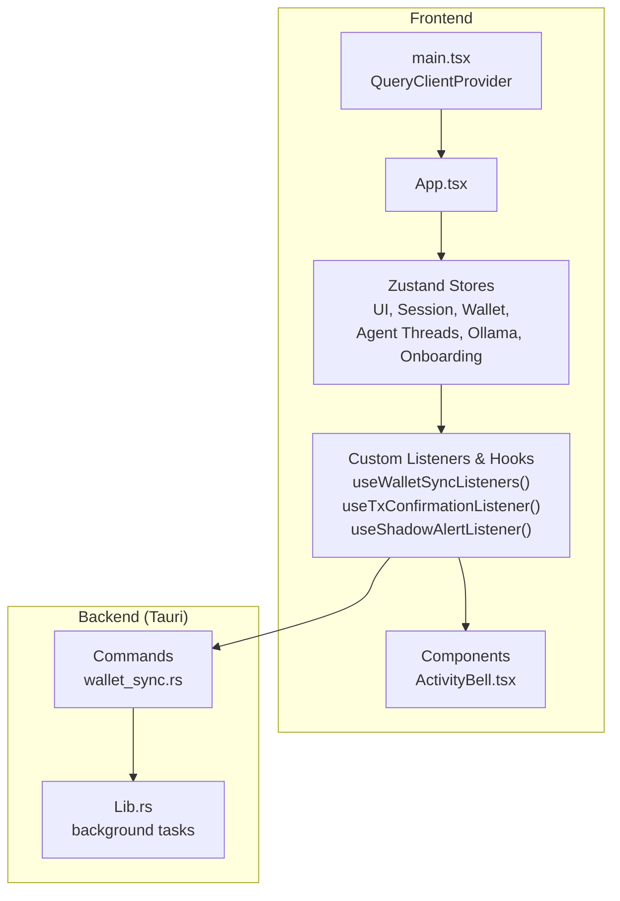
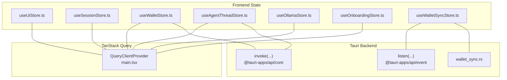
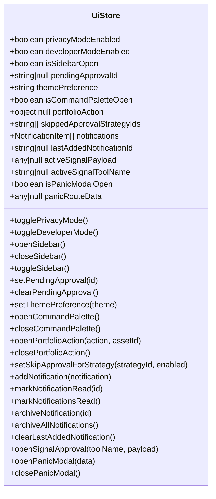
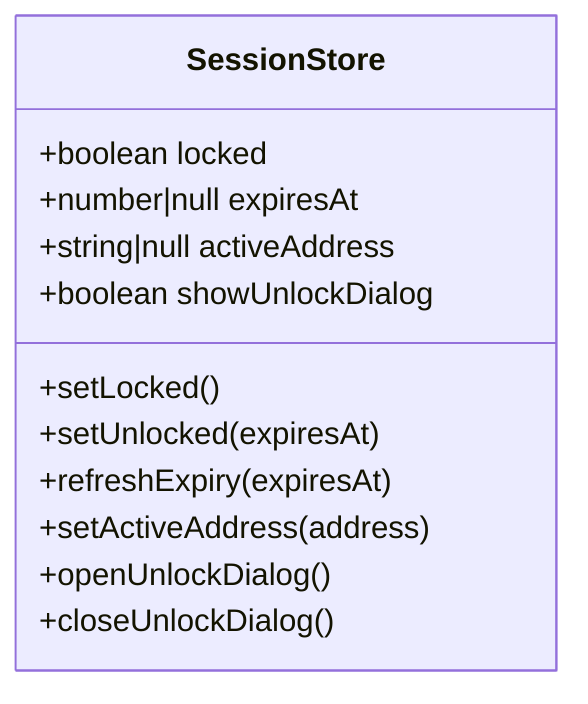
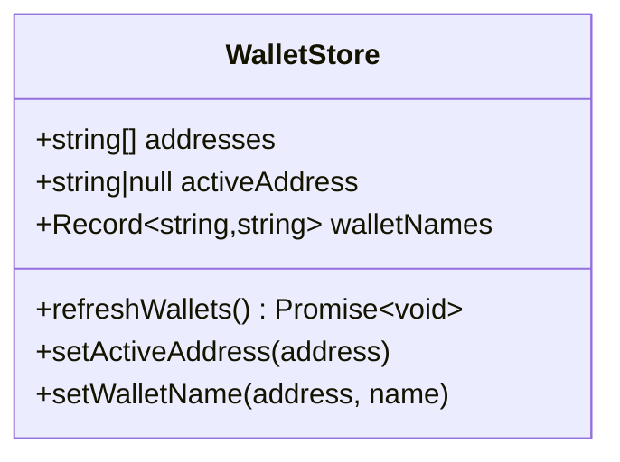
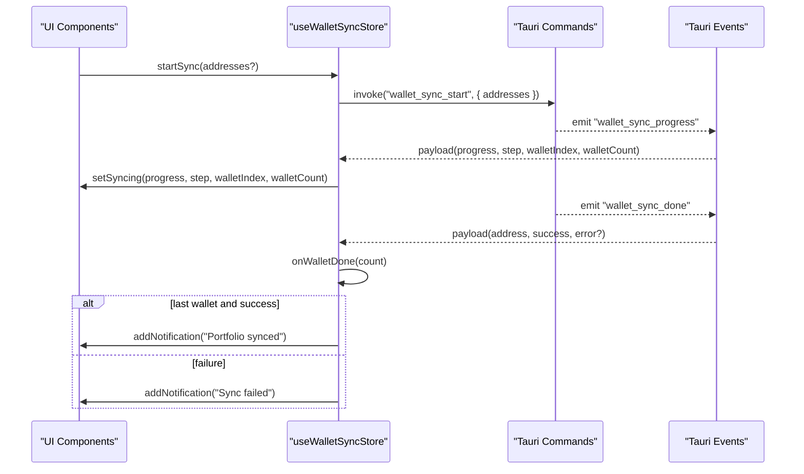
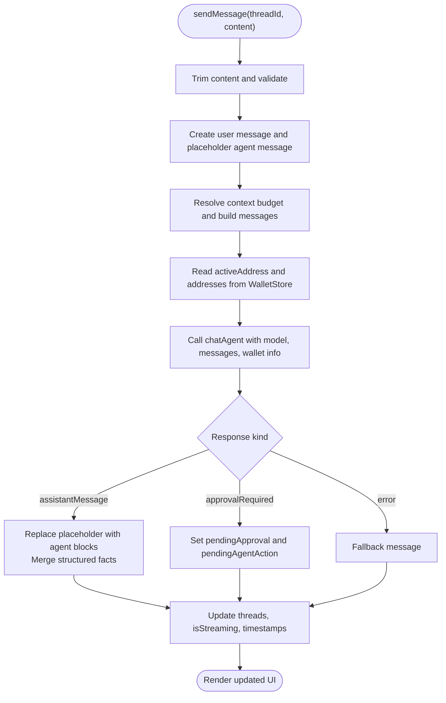
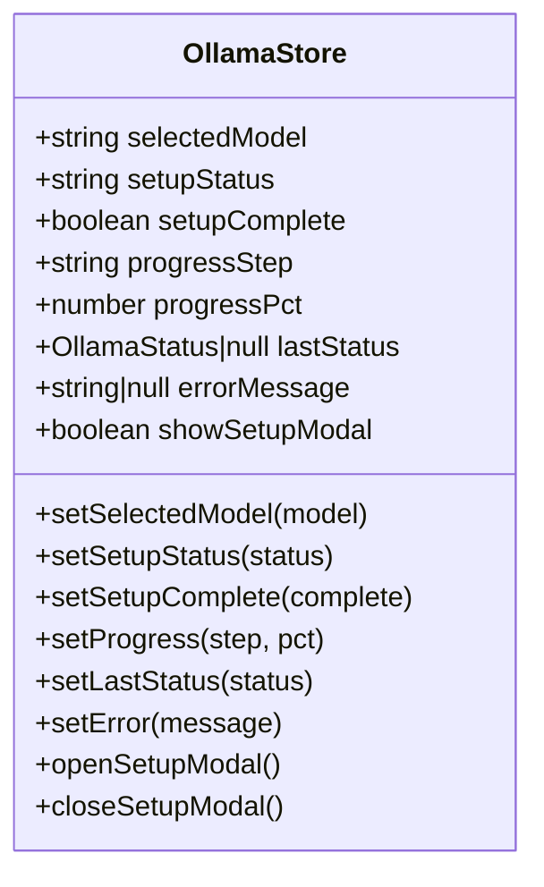
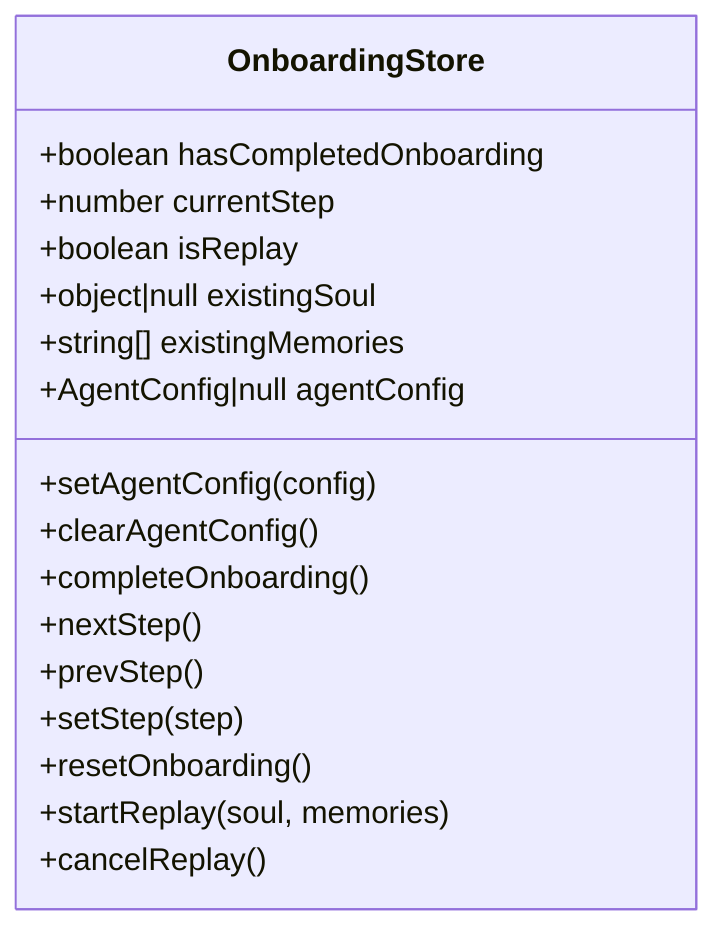
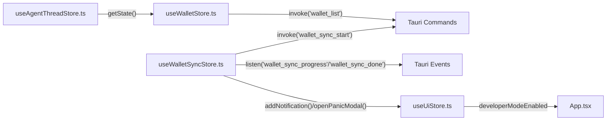

# State Management

<cite>
**Referenced Files in This Document**
- [useUiStore.ts](file://src/store/useUiStore.ts)
- [useSessionStore.ts](file://src/store/useSessionStore.ts)
- [useWalletStore.ts](file://src/store/useWalletStore.ts)
- [useWalletSyncStore.ts](file://src/store/useWalletSyncStore.ts)
- [useAgentThreadStore.ts](file://src/store/useAgentThreadStore.ts)
- [useOllamaStore.ts](file://src/store/useOllamaStore.ts)
- [useOnboardingStore.ts](file://src/store/useOnboardingStore.ts)
- [main.tsx](file://src/main.tsx)
- [tauri.ts](file://src/lib/tauri.ts)
- [App.tsx](file://src/App.tsx)
- [ActivityBell.tsx](file://src/components/layout/ActivityBell.tsx)
- [wallet_sync.rs](file://src-tauri/src/commands/wallet_sync.rs)
- [lib.rs](file://src-tauri/src/lib.rs)
- [AGENTS.md](file://AGENTS.md)
- [shadow-protocol.md](file://docs/shadow-protocol.md)
</cite>

## Table of Contents
1. [Introduction](#introduction)
2. [Project Structure](#project-structure)
3. [Core Components](#core-components)
4. [Architecture Overview](#architecture-overview)
5. [Detailed Component Analysis](#detailed-component-analysis)
6. [Dependency Analysis](#dependency-analysis)
7. [Performance Considerations](#performance-considerations)
8. [Troubleshooting Guide](#troubleshooting-guide)
9. [Conclusion](#conclusion)
10. [Appendices](#appendices)

## Introduction
This document explains the state management architecture for the frontend, focusing on:
- Zustand stores for UI state, session state, wallet state, agent threads, Ollama setup, and onboarding
- TanStack Query for server state management
- Custom hooks and listeners for data access, state synchronization, and reactive updates
- Persistence strategies, hydration, and integration with Tauri commands
- Cross-store relationships, real-time updates, and conflict resolution patterns
- Guidance for extending state management and maintaining consistency across complex interactions

## Project Structure
The frontend initializes a TanStack Query client at the root and wraps the application with QueryClientProvider. Stores are defined as Zustand slices with optional persistence. Tauri commands and events bridge the frontend to the Rust backend for sensitive or async operations.

**Diagram sources**
- [main.tsx:1-16](file://src/main.tsx#L1-L16)
- [App.tsx:1-49](file://src/App.tsx#L1-L49)
- [useWalletSyncStore.ts:111-151](file://src/store/useWalletSyncStore.ts#L111-L151)
- [wallet_sync.rs:34-89](file://src-tauri/src/commands/wallet_sync.rs#L34-L89)
- [lib.rs:65-89](file://src-tauri/src/lib.rs#L65-L89)

**Section sources**
- [main.tsx:1-16](file://src/main.tsx#L1-L16)
- [App.tsx:1-49](file://src/App.tsx#L1-L49)
- [AGENTS.md:73-82](file://AGENTS.md#L73-L82)

## Core Components
- UI Store: Manages theme, sidebar, command palette, portfolio actions, notifications, and panic modal state. Persisted partially to localStorage.
- Session Store: Tracks lock state, expiry, active address, and unlock dialog visibility.
- Wallet Store: Holds addresses, active address, and wallet names; refreshes from Tauri commands and persists names.
- Wallet Sync Store: Coordinates wallet sync progress, completion, and integrates Tauri events for progress and completion.
- Agent Thread Store: Maintains agent chat threads, streaming state, rolling summaries, structured facts, and pending approvals; persisted with migration support.
- Ollama Store: Manages AI model selection and setup flow state; persisted.
- Onboarding Store: Collects agent configuration and replay mode state; persisted.

**Section sources**
- [useUiStore.ts:1-162](file://src/store/useUiStore.ts#L1-L162)
- [useSessionStore.ts:1-28](file://src/store/useSessionStore.ts#L1-L28)
- [useWalletStore.ts:1-48](file://src/store/useWalletStore.ts#L1-L48)
- [useWalletSyncStore.ts:1-199](file://src/store/useWalletSyncStore.ts#L1-L199)
- [useAgentThreadStore.ts:1-642](file://src/store/useAgentThreadStore.ts#L1-L642)
- [useOllamaStore.ts:1-82](file://src/store/useOllamaStore.ts#L1-L82)
- [useOnboardingStore.ts:1-106](file://src/store/useOnboardingStore.ts#L1-L106)

## Architecture Overview
The system separates concerns:
- UI-only state in Zustand stores (persisted where safe)
- Server/async state via TanStack Query with appropriate caching and stale times
- Sensitive or backend-owned state in Rust; frontend triggers via Tauri invoke and listens for events
- Real-time updates delivered via Tauri event channels

**Diagram sources**
- [main.tsx:1-16](file://src/main.tsx#L1-L16)
- [useWalletSyncStore.ts:111-151](file://src/store/useWalletSyncStore.ts#L111-L151)
- [wallet_sync.rs:34-89](file://src-tauri/src/commands/wallet_sync.rs#L34-L89)

**Section sources**
- [AGENTS.md:73-82](file://AGENTS.md#L73-L82)
- [shadow-protocol.md:149-205](file://docs/shadow-protocol.md#L149-L205)

## Detailed Component Analysis

### UI Store (useUiStore)
Purpose:
- Centralizes UI-only state: theme, sidebar, command palette, portfolio actions, notifications, and panic modal.
- Provides actions to update state reactively and persist selected fields.

Key behaviors:
- Partial persistence to localStorage with selective fields.
- Notification lifecycle: add, mark read/unread, archive, and clear last-added indicator.
- Signal and panic flows integrate with notifications and approval gating.

**Diagram sources**
- [useUiStore.ts:28-65](file://src/store/useUiStore.ts#L28-L65)

**Section sources**
- [useUiStore.ts:1-162](file://src/store/useUiStore.ts#L1-L162)

### Session Store (useSessionStore)
Purpose:
- Tracks session lock state, expiry, active address, and unlock dialog visibility.
- Integrates with Tauri commands for unlocking and refreshing expiry.

**Diagram sources**
- [useSessionStore.ts:3-14](file://src/store/useSessionStore.ts#L3-L14)

**Section sources**
- [useSessionStore.ts:1-28](file://src/store/useSessionStore.ts#L1-L28)

### Wallet Store (useWalletStore)
Purpose:
- Holds wallet addresses, active address, and wallet names.
- Refreshes wallet list via Tauri invoke and reconciles active address.
- Persists wallet names locally.

**Diagram sources**
- [useWalletStore.ts:7-14](file://src/store/useWalletStore.ts#L7-L14)

**Section sources**
- [useWalletStore.ts:1-48](file://src/store/useWalletStore.ts#L1-L48)

### Wallet Sync Store (useWalletSyncStore)
Purpose:
- Coordinates wallet sync progress and completion.
- Subscribes to Tauri events for progress updates and completion notifications.
- Integrates with UI notifications and panic modal for user feedback.

**Diagram sources**
- [useWalletSyncStore.ts:64-73](file://src/store/useWalletSyncStore.ts#L64-L73)
- [useWalletSyncStore.ts:120-145](file://src/store/useWalletSyncStore.ts#L120-L145)
- [wallet_sync.rs:60-89](file://src-tauri/src/commands/wallet_sync.rs#L60-L89)

**Section sources**
- [useWalletSyncStore.ts:1-199](file://src/store/useWalletSyncStore.ts#L1-L199)
- [wallet_sync.rs:1-89](file://src-tauri/src/commands/wallet_sync.rs#L1-L89)

### Agent Thread Store (useAgentThreadStore)
Purpose:
- Manages agent chat threads, streaming state, rolling summaries, structured facts, and pending approvals.
- Integrates with Ollama and Wallet stores for context and wallet data.
- Persists threads and active thread ID with migration support.

**Diagram sources**
- [useAgentThreadStore.ts:198-533](file://src/store/useAgentThreadStore.ts#L198-L533)

**Section sources**
- [useAgentThreadStore.ts:1-642](file://src/store/useAgentThreadStore.ts#L1-L642)

### Ollama Store (useOllamaStore)
Purpose:
- Manages AI model selection and setup flow state.
- Persists selected model and completion flag.

**Diagram sources**
- [useOllamaStore.ts:20-37](file://src/store/useOllamaStore.ts#L20-L37)

**Section sources**
- [useOllamaStore.ts:1-82](file://src/store/useOllamaStore.ts#L1-L82)

### Onboarding Store (useOnboardingStore)
Purpose:
- Collects agent configuration and replay mode state.
- Persists onboarding progress and agent config.

**Diagram sources**
- [useOnboardingStore.ts:19-52](file://src/store/useOnboardingStore.ts#L19-L52)

**Section sources**
- [useOnboardingStore.ts:1-106](file://src/store/useOnboardingStore.ts#L1-L106)

## Dependency Analysis
- Stores depend on each other implicitly via reads:
  - Agent Thread Store reads Wallet Store for active address and addresses.
  - Wallet Sync Store depends on UI Store for notifications and panic modal.
  - UI Store is consumed by UI components and App.tsx for developer mode context menu.
- Tauri integration:
  - Wallet Store uses invoke to refresh wallet list.
  - Wallet Sync Store uses invoke to start sync and listen to progress/done events.
  - Backend commands and services coordinate background sync tasks.

**Diagram sources**
- [useWalletStore.ts:23-37](file://src/store/useWalletStore.ts#L23-L37)
- [useWalletSyncStore.ts:64-73](file://src/store/useWalletSyncStore.ts#L64-L73)
- [useWalletSyncStore.ts:120-145](file://src/store/useWalletSyncStore.ts#L120-L145)
- [useAgentThreadStore.ts:310-317](file://src/store/useAgentThreadStore.ts#L310-L317)
- [App.tsx:13-32](file://src/App.tsx#L13-L32)

**Section sources**
- [useWalletStore.ts:1-48](file://src/store/useWalletStore.ts#L1-L48)
- [useWalletSyncStore.ts:1-199](file://src/store/useWalletSyncStore.ts#L1-L199)
- [useAgentThreadStore.ts:1-642](file://src/store/useAgentThreadStore.ts#L1-L642)
- [App.tsx:1-49](file://src/App.tsx#L1-L49)

## Performance Considerations
- Prefer granular selectors and minimal re-renders by subscribing only to required slices of stores.
- Use partial persistence to reduce serialized payload sizes and improve hydration speed.
- For server state, configure TanStack Query cache times and invalidation policies to balance freshness and performance.
- Debounce or throttle frequent UI updates (e.g., progress bars) to avoid excessive renders.
- Avoid storing sensitive data in Zustand; rely on Tauri commands and events for backend-driven updates.

[No sources needed since this section provides general guidance]

## Troubleshooting Guide
Common issues and resolutions:
- Notifications not appearing:
  - Verify UI Store notification actions and that the listener is registered.
  - Confirm Tauri event registration and payload correctness.
- Wallet sync progress not updating:
  - Ensure invoke("wallet_sync_start") is called and events "wallet_sync_progress" and "wallet_sync_done" are listened to.
  - Check backend command filtering of addresses and spawn of background tasks.
- Agent thread stuck in streaming:
  - Validate model selection in Ollama Store and that chatAgent returns expected kinds.
  - Inspect context budget and structured facts merging logic.
- Developer context menu not opening:
  - Confirm hasTauriRuntime() and developerModeEnabled conditions in App.tsx.

**Section sources**
- [useWalletSyncStore.ts:75-109](file://src/store/useWalletSyncStore.ts#L75-L109)
- [useWalletSyncStore.ts:111-151](file://src/store/useWalletSyncStore.ts#L111-L151)
- [wallet_sync.rs:60-89](file://src-tauri/src/commands/wallet_sync.rs#L60-L89)
- [useAgentThreadStore.ts:243-533](file://src/store/useAgentThreadStore.ts#L243-L533)
- [App.tsx:13-32](file://src/App.tsx#L13-L32)

## Conclusion
The state management system cleanly separates UI-only state (Zustand), server state (TanStack Query), and backend-owned state (Tauri). Stores are modular, persisted where appropriate, and integrated with Tauri commands and events for real-time updates. Following the documented patterns ensures consistency, scalability, and maintainability across complex user interactions.

[No sources needed since this section summarizes without analyzing specific files]

## Appendices

### State Hydration and Persistence
- Partial persistence:
  - UI Store persists theme, approvals, and notifications.
  - Wallet Store persists wallet names.
  - Agent Thread Store persists threads and active thread ID with migration.
  - Ollama Store persists selected model and completion flag.
  - Onboarding Store persists onboarding state.
- Hydration:
  - TanStack Query client is initialized at the root; server state hydration occurs automatically via QueryClient.
  - UI and domain stores hydrate from localStorage on mount.

**Section sources**
- [useUiStore.ts:148-158](file://src/store/useUiStore.ts#L148-L158)
- [useWalletStore.ts:16-46](file://src/store/useWalletStore.ts#L16-L46)
- [useAgentThreadStore.ts:598-621](file://src/store/useAgentThreadStore.ts#L598-L621)
- [useOllamaStore.ts:39-80](file://src/store/useOllamaStore.ts#L39-L80)
- [useOnboardingStore.ts:54-105](file://src/store/useOnboardingStore.ts#L54-L105)
- [main.tsx:1-16](file://src/main.tsx#L1-L16)

### Extending State Management
Guidelines:
- Create a new Zustand store under src/store with a descriptive name and clearly define state shape and actions.
- Use persist middleware only for UI-only or non-sensitive data; prefer Tauri commands for sensitive state.
- For server state, use TanStack Query with appropriate query keys, stale times, and refetch policies.
- Integrate with Tauri by adding a command in Rust and a listener in a custom hook when asynchronous updates are needed.
- Keep cross-store dependencies explicit and avoid circular dependencies; read from other stores via getState() when necessary.
- Add tests for store actions and persistence behavior.

**Section sources**
- [AGENTS.md:73-82](file://AGENTS.md#L73-L82)
- [shadow-protocol.md:149-205](file://docs/shadow-protocol.md#L149-L205)