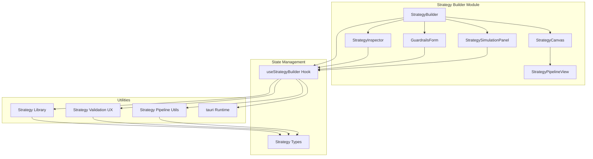
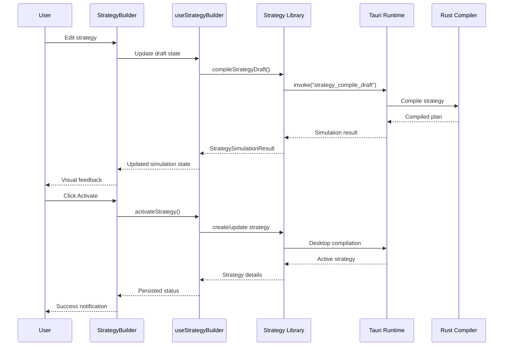
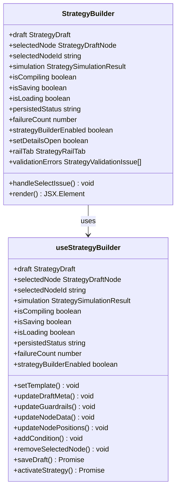
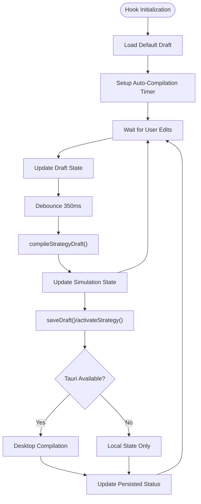
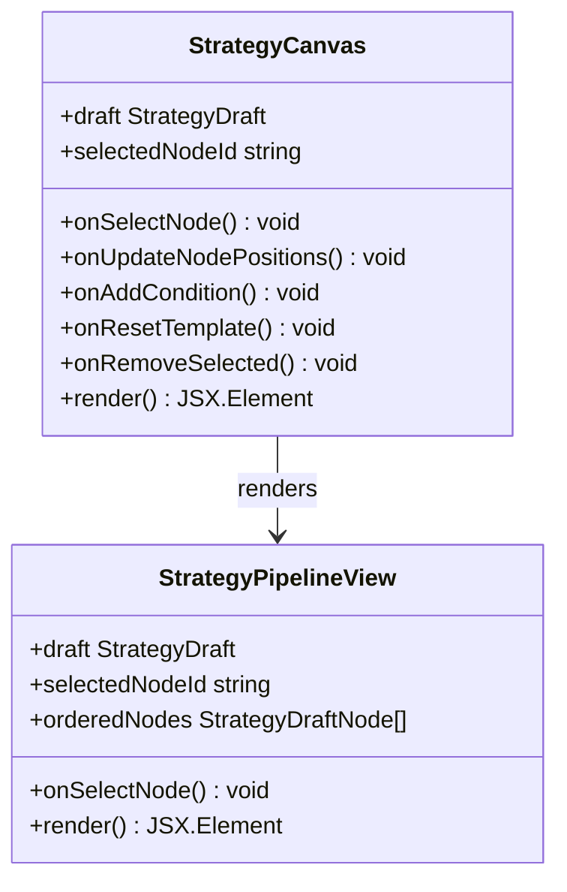
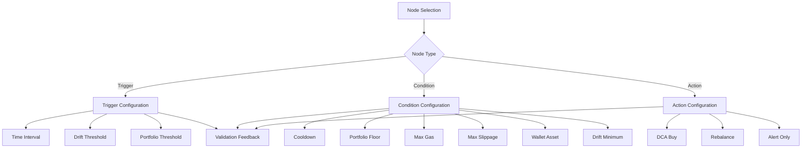
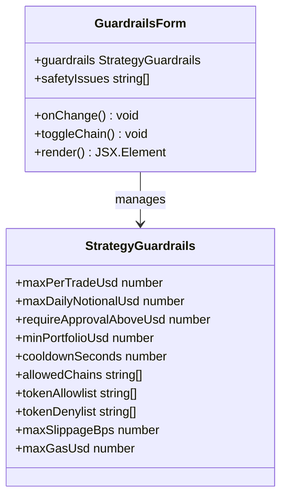
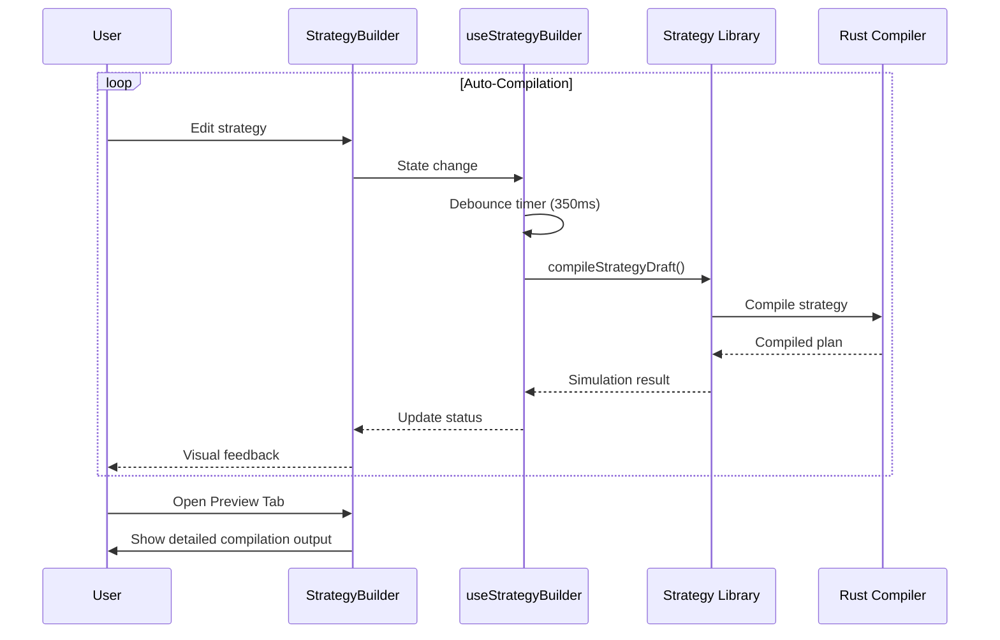
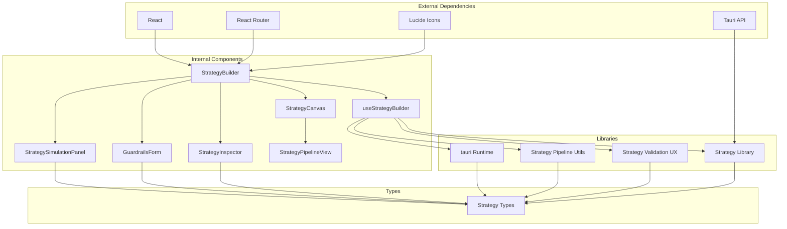

# Strategy Builder Interface

<cite>
**Referenced Files in This Document**
- [StrategyBuilder.tsx](file://src/components/strategy/StrategyBuilder.tsx)
- [useStrategyBuilder.ts](file://src/hooks/useStrategyBuilder.ts)
- [StrategyCanvas.tsx](file://src/components/strategy/StrategyCanvas.tsx)
- [StrategyPipelineView.tsx](file://src/components/strategy/StrategyPipelineView.tsx)
- [StrategyInspector.tsx](file://src/components/strategy/StrategyInspector.tsx)
- [GuardrailsForm.tsx](file://src/components/strategy/GuardrailsForm.tsx)
- [StrategySimulationPanel.tsx](file://src/components/strategy/StrategySimulationPanel.tsx)
- [strategy.ts](file://src/lib/strategy.ts)
- [strategyValidationUx.ts](file://src/lib/strategyValidationUx.ts)
- [strategyPipeline.ts](file://src/lib/strategyPipeline.ts)
- [routes.tsx](file://src/routes.tsx)
- [strategy.ts](file://src/types/strategy.ts)
- [tauri.ts](file://src/lib/tauri.ts)
</cite>

## Table of Contents
1. [Introduction](#introduction)
2. [Project Structure](#project-structure)
3. [Core Components](#core-components)
4. [Architecture Overview](#architecture-overview)
5. [Detailed Component Analysis](#detailed-component-analysis)
6. [Dependency Analysis](#dependency-analysis)
7. [Performance Considerations](#performance-considerations)
8. [Troubleshooting Guide](#troubleshooting-guide)
9. [Conclusion](#conclusion)

## Introduction
The Strategy Builder is a sophisticated visual editor for designing automated trading strategies. It provides a comprehensive interface for creating, editing, validating, and activating strategies with desktop-only compilation capabilities. The system combines a drag-and-drop canvas, real-time validation feedback, and a tabbed inspector for fine-grained control over strategy components.

The builder supports three distinct strategy templates (Dollar-Cost Averaging, Rebalancing, and Alert systems) and offers extensive guardrail configurations for risk management. It integrates tightly with the Tauri desktop runtime for secure compilation and deployment of strategies.

## Project Structure
The Strategy Builder interface follows a modular component architecture with clear separation of concerns:

**Diagram sources**
- [StrategyBuilder.tsx:1-287](file://src/components/strategy/StrategyBuilder.tsx#L1-L287)
- [useStrategyBuilder.ts:1-248](file://src/hooks/useStrategyBuilder.ts#L1-L248)

**Section sources**
- [routes.tsx:14-32](file://src/routes.tsx#L14-L32)
- [StrategyBuilder.tsx:25-287](file://src/components/strategy/StrategyBuilder.tsx#L25-L287)

## Core Components
The Strategy Builder consists of several interconnected components that work together to provide a seamless editing experience:

### Main Builder Layout
The primary layout features a glass-morphism design with collapsible panels and responsive grid system. The interface is divided into four main areas:

1. **Header Controls**: Contains strategy metadata, status indicators, and action buttons
2. **Strategy Details Panel**: Collapsible section for editing strategy-wide properties
3. **Canvas Area**: Central workspace for visual strategy construction
4. **Inspector Sidebar**: Tabbed interface for detailed editing and validation

### Tabbed Interface System
The inspector uses a three-tab system for focused editing:
- **Step Tab**: Node-specific configuration and validation
- **Safety Tab**: Guardrail and risk management settings
- **Preview Tab**: Compilation output and execution simulation

### Strategy Status Indicators
The system provides real-time status feedback through color-coded badges:
- **Compile Status**: Gray during compilation, amber for review, green for valid
- **Error States**: Red indicators for validation errors
- **Success States**: Emerald indicators for successful compilation

**Section sources**
- [StrategyBuilder.tsx:76-284](file://src/components/strategy/StrategyBuilder.tsx#L76-L284)
- [StrategySimulationPanel.tsx:12-59](file://src/components/strategy/StrategySimulationPanel.tsx#L12-L59)

## Architecture Overview
The Strategy Builder employs a unidirectional data flow pattern with centralized state management:

**Diagram sources**
- [StrategyBuilder.tsx:28-49](file://src/components/strategy/StrategyBuilder.tsx#L28-L49)
- [useStrategyBuilder.ts:205-223](file://src/hooks/useStrategyBuilder.ts#L205-L223)
- [strategy.ts:174-205](file://src/lib/strategy.ts#L174-L205)

## Detailed Component Analysis

### StrategyBuilder Component
The main container component orchestrates the entire builder interface and manages global state coordination:

**Diagram sources**
- [StrategyBuilder.tsx:25-49](file://src/components/strategy/StrategyBuilder.tsx#L25-L49)
- [useStrategyBuilder.ts:37-246](file://src/hooks/useStrategyBuilder.ts#L37-L246)

The StrategyBuilder component implements several key features:

#### Header Controls and Status Management
- **Strategy Metadata**: Name, mode, summary editing with real-time validation
- **Status Indicators**: Color-coded badges showing compile/validation status
- **Action Buttons**: Save draft and Activate strategy with appropriate state management
- **Desktop Runtime Detection**: Graceful degradation when Tauri is unavailable

#### Strategy Details Panel
- **Collapsible Section**: Minimizes screen real estate when not needed
- **Mode Selection**: Monitor-only, approval-required, pre-authorized modes
- **Template Integration**: Automatic population of strategy metadata based on template

#### Canvas Area and Pipeline Visualization
- **Drag-and-Drop Interface**: Visual construction of strategy flow
- **Node Selection**: Click-to-select mechanism with visual highlighting
- **Template Reset**: One-click restoration of default strategy structure

#### Inspector Sidebar and Tabbed Interface
- **Step Tab**: Node-specific configuration based on type (trigger, condition, action)
- **Safety Tab**: Comprehensive guardrail configuration for risk management
- **Preview Tab**: Detailed compilation output and execution simulation

**Section sources**
- [StrategyBuilder.tsx:25-287](file://src/components/strategy/StrategyBuilder.tsx#L25-L287)

### useStrategyBuilder Hook
The state management hook provides centralized control over strategy editing:

**Diagram sources**
- [useStrategyBuilder.ts:37-112](file://src/hooks/useStrategyBuilder.ts#L37-L112)
- [useStrategyBuilder.ts:205-223](file://src/hooks/useStrategyBuilder.ts#L205-L223)

Key responsibilities include:
- **Draft Management**: Creating, updating, and persisting strategy drafts
- **Auto-Compilation**: Intelligent debounced compilation on edits
- **Template System**: Loading predefined strategy structures
- **Node Operations**: Adding, removing, and positioning strategy nodes
- **Guardrail Configuration**: Managing risk management parameters
- **Desktop Integration**: Coordinating with Tauri for compilation and activation

**Section sources**
- [useStrategyBuilder.ts:37-246](file://src/hooks/useStrategyBuilder.ts#L37-L246)

### StrategyCanvas Component
The canvas provides the primary visual editing interface:

**Diagram sources**
- [StrategyCanvas.tsx:7-26](file://src/components/strategy/StrategyCanvas.tsx#L7-L26)
- [StrategyPipelineView.tsx:32-42](file://src/components/strategy/StrategyPipelineView.tsx#L32-L42)

Features include:
- **Toolbar Controls**: Add condition, remove step, template selection
- **Visual Pipeline**: Horizontal flow representation of strategy steps
- **Node Highlighting**: Clear visual indication of selected nodes
- **Template System**: Predefined strategy structures for quick start

**Section sources**
- [StrategyCanvas.tsx:19-108](file://src/components/strategy/StrategyCanvas.tsx#L19-L108)

### StrategyInspector Component
Provides detailed configuration for individual strategy nodes:

**Diagram sources**
- [StrategyInspector.tsx:41-458](file://src/components/strategy/StrategyInspector.tsx#L41-L458)

The inspector supports three node types with specialized configuration:
- **Trigger Nodes**: Define when strategies execute (time intervals, drift thresholds, portfolio thresholds)
- **Condition Nodes**: Add safety checks and filters (cooldowns, gas limits, slippage controls)
- **Action Nodes**: Define execution behavior (DCA purchases, rebalancing, alerts)

**Section sources**
- [StrategyInspector.tsx:41-458](file://src/components/strategy/StrategyInspector.tsx#L41-L458)

### GuardrailsForm Component
Manages comprehensive risk management configurations:

**Diagram sources**
- [GuardrailsForm.tsx:15-20](file://src/components/strategy/GuardrailsForm.tsx#L15-L20)
- [strategy.ts:86-97](file://src/types/strategy.ts#L86-L97)

Guardrails cover critical risk management areas:
- **Transaction Limits**: Per-trade and daily notional caps
- **Approval Thresholds**: Automatic approval requirements
- **Portfolio Protection**: Minimum portfolio value safeguards
- **Execution Controls**: Cooldown periods and gas/slippage limits
- **Chain Restrictions**: Supported blockchain networks
- **Asset Lists**: Allow/deny lists for tokens

**Section sources**
- [GuardrailsForm.tsx:22-188](file://src/components/strategy/GuardrailsForm.tsx#L22-L188)

### StrategySimulationPanel Component
Provides real-time compilation feedback and execution preview:

**Diagram sources**
- [StrategySimulationPanel.tsx:12-59](file://src/components/strategy/StrategySimulationPanel.tsx#L12-L59)
- [useStrategyBuilder.ts:99-112](file://src/hooks/useStrategyBuilder.ts#L99-L112)

The simulation panel displays:
- **Compilation Status**: Real-time feedback during auto-compilation
- **Validation Results**: Error and warning messages with navigation
- **Execution Preview**: Simulated execution mode and action summaries
- **Condition Evaluation**: Preview of condition pass/fail states

**Section sources**
- [StrategySimulationPanel.tsx:67-159](file://src/components/strategy/StrategySimulationPanel.tsx#L67-L159)

## Dependency Analysis
The Strategy Builder has a well-defined dependency structure with clear boundaries:

**Diagram sources**
- [StrategyBuilder.tsx:1-18](file://src/components/strategy/StrategyBuilder.tsx#L1-L18)
- [useStrategyBuilder.ts:1-18](file://src/hooks/useStrategyBuilder.ts#L1-L18)

Key dependency relationships:
- **State Management**: useStrategyBuilder provides centralized state for all components
- **Desktop Integration**: Tauri runtime enables compilation and activation
- **Type Safety**: Strong typing ensures consistency across components
- **Utility Functions**: Shared utilities for validation and pipeline operations

**Section sources**
- [strategy.ts:1-11](file://src/lib/strategy.ts#L1-L11)
- [strategyValidationUx.ts:1-3](file://src/lib/strategyValidationUx.ts#L1-L3)

## Performance Considerations
The Strategy Builder implements several performance optimizations:

### Auto-Compilation Debouncing
- **350ms Delay**: Prevents excessive compilation during rapid edits
- **Conditional Execution**: Only compiles when Tauri runtime is available
- **Cancellation**: Proper cleanup of pending compilations

### Memory Management
- **Selective Updates**: Only re-renders affected components
- **Memoization**: Uses useMemo for expensive calculations
- **Cleanup Functions**: Proper cleanup of timers and subscriptions

### Rendering Optimizations
- **Skeleton Loading**: Provides immediate feedback during loading states
- **Conditional Rendering**: Hides complex components until needed
- **Efficient State Updates**: Batched updates to minimize re-renders

## Troubleshooting Guide

### Desktop Compilation Issues
**Problem**: Strategies fail to compile or activate
**Solution**: 
1. Ensure Tauri desktop app is installed and running
2. Verify Rust toolchain is available
3. Check console for Tauri-specific error messages
4. Restart the desktop application if compilation fails

**Common Symptoms**:
- Save/Activate buttons disabled
- "Compile and save require the Tauri desktop app" message
- No compilation feedback in Preview tab

### Validation Errors
**Problem**: Strategy shows red error indicators
**Solution**:
1. Click on error messages in Preview tab to navigate to affected nodes
2. Review validation messages in Step tab for specific field issues
3. Fix configuration according to validation guidance
4. Use the navigation system to jump directly to problematic areas

**Validation Categories**:
- **Guardrail Violations**: Risk management parameter conflicts
- **Node Configuration**: Missing or invalid node properties
- **Template Constraints**: Incompatible node combinations

### Performance Issues
**Problem**: Slow response during editing
**Solution**:
1. Reduce complexity by removing unnecessary conditions
2. Simplify guardrail configurations
3. Close unused browser tabs to free memory
4. Consider breaking large strategies into smaller components

### Template Reset Issues
**Problem**: Template reset doesn't work as expected
**Solution**:
1. Verify current template selection matches intended strategy type
2. Check that strategy has a valid trigger node
3. Ensure action node is properly positioned at the end
4. Review console for template loading errors

**Section sources**
- [StrategyBuilder.tsx:150-154](file://src/components/strategy/StrategyBuilder.tsx#L150-L154)
- [strategyValidationUx.ts:29-39](file://src/lib/strategyValidationUx.ts#L29-L39)

## Conclusion
The Strategy Builder interface provides a comprehensive solution for designing automated trading strategies with professional-grade features. Its modular architecture, real-time validation, and desktop-only compilation capabilities make it suitable for complex strategy development while maintaining usability for less experienced users.

Key strengths include:
- **Intuitive Visual Design**: Glass-morphism interface with clear visual hierarchy
- **Real-Time Feedback**: Immediate compilation and validation results
- **Comprehensive Validation**: Multi-layered error detection and navigation
- **Professional Features**: Advanced guardrails, execution policies, and approval workflows
- **Desktop Integration**: Secure compilation and activation through Tauri

The system balances power and simplicity, enabling both novice and expert users to create sophisticated trading strategies while maintaining safety through comprehensive validation and risk management controls.