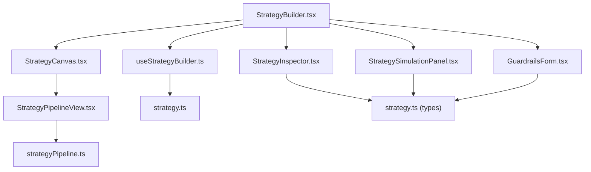
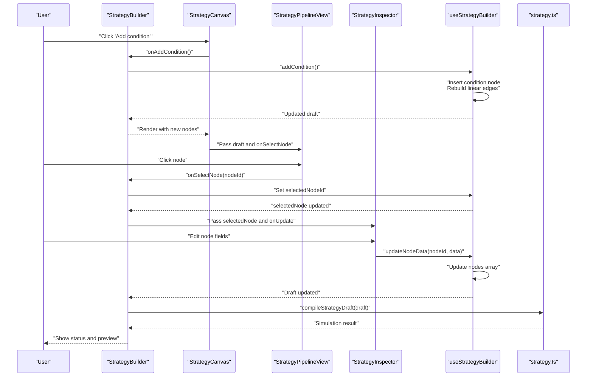
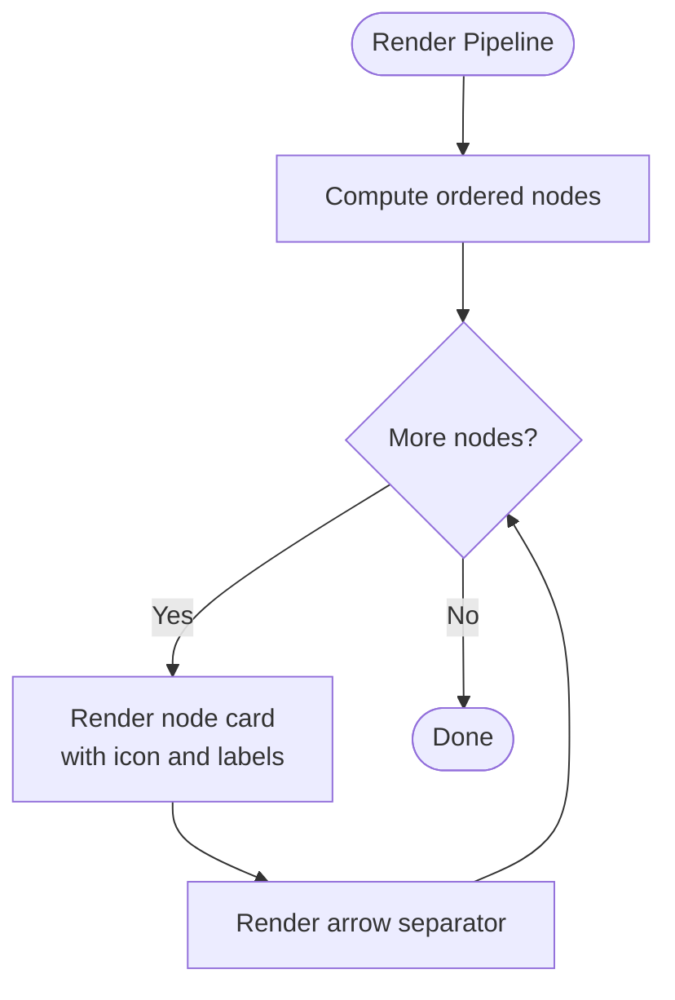
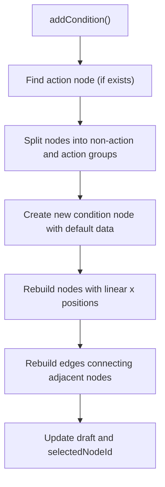
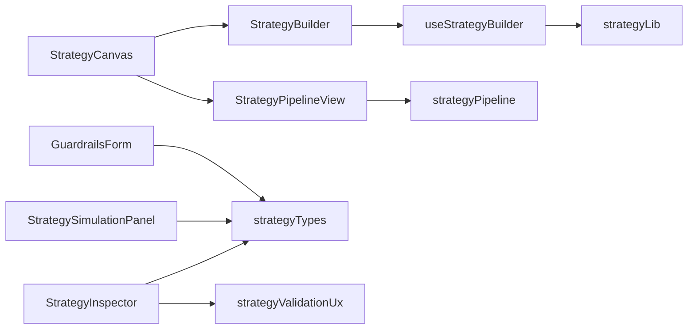

# Strategy Canvas Editor

<cite>
**Referenced Files in This Document**
- [StrategyCanvas.tsx](file://src/components/strategy/StrategyCanvas.tsx)
- [StrategyPipelineView.tsx](file://src/components/strategy/StrategyPipelineView.tsx)
- [StrategyInspector.tsx](file://src/components/strategy/StrategyInspector.tsx)
- [StrategyBuilder.tsx](file://src/components/strategy/StrategyBuilder.tsx)
- [useStrategyBuilder.ts](file://src/hooks/useStrategyBuilder.ts)
- [strategy.ts](file://src/lib/strategy.ts)
- [strategyPipeline.ts](file://src/lib/strategyPipeline.ts)
- [StrategySimulationPanel.tsx](file://src/components/strategy/StrategySimulationPanel.tsx)
- [GuardrailsForm.tsx](file://src/components/strategy/GuardrailsForm.tsx)
- [strategyValidationUx.ts](file://src/lib/strategyValidationUx.ts)
- [strategy.ts (types)](file://src/types/strategy.ts)
</cite>

## Table of Contents
1. [Introduction](#introduction)
2. [Project Structure](#project-structure)
3. [Core Components](#core-components)
4. [Architecture Overview](#architecture-overview)
5. [Detailed Component Analysis](#detailed-component-analysis)
6. [Dependency Analysis](#dependency-analysis)
7. [Performance Considerations](#performance-considerations)
8. [Troubleshooting Guide](#troubleshooting-guide)
9. [Conclusion](#conclusion)
10. [Appendices](#appendices)

## Introduction
This document explains the Strategy Canvas editor, a drag-and-drop, node-based strategy composition system. It covers node types (trigger, condition, action), canvas interaction patterns (selection, positioning, connections, deletion), visual representation of strategy flows, node states, and connection routing. It also documents the node positioning system, how layouts are maintained during editing, integration with the inspector panel for node configuration, template reset functionality, canvas-wide operations, and the compilation/simulation feedback loop. Guidance is included for organizing complex strategies and resolving common issues.

## Project Structure
The Strategy Canvas editor is implemented as a cohesive set of components and hooks:
- StrategyBuilder orchestrates state, simulation, and UI layout.
- StrategyCanvas hosts the toolbar and renders the pipeline view.
- StrategyPipelineView renders nodes in order and handles selection.
- StrategyInspector edits node-specific configuration.
- useStrategyBuilder manages draft state, adds/removes nodes, resets templates, and triggers recompilation.
- strategy.ts provides default templates and backend integration via Tauri.
- strategyPipeline.ts computes linear ordering of nodes for rendering.
- StrategySimulationPanel displays compile status and preview details.
- GuardrailsForm configures safety constraints applied at runtime.
- strategyValidationUx maps backend validation paths to UI navigation.

**Diagram sources**
- [StrategyBuilder.tsx:25-286](file://src/components/strategy/StrategyBuilder.tsx#L25-L286)
- [StrategyCanvas.tsx:19-108](file://src/components/strategy/StrategyCanvas.tsx#L19-L108)
- [StrategyPipelineView.tsx:38-106](file://src/components/strategy/StrategyPipelineView.tsx#L38-L106)
- [StrategyInspector.tsx:41-458](file://src/components/strategy/StrategyInspector.tsx#L41-L458)
- [StrategySimulationPanel.tsx:13-159](file://src/components/strategy/StrategySimulationPanel.tsx#L13-L159)
- [GuardrailsForm.tsx:22-188](file://src/components/strategy/GuardrailsForm.tsx#L22-L188)
- [strategyPipeline.ts:8-39](file://src/lib/strategyPipeline.ts#L8-L39)
- [useStrategyBuilder.ts:37-247](file://src/hooks/useStrategyBuilder.ts#L37-L247)
- [strategy.ts:13-172](file://src/lib/strategy.ts#L13-L172)
- [strategy.ts (types):110-121](file://src/types/strategy.ts#L110-L121)

**Section sources**
- [StrategyBuilder.tsx:25-286](file://src/components/strategy/StrategyBuilder.tsx#L25-L286)
- [StrategyCanvas.tsx:19-108](file://src/components/strategy/StrategyCanvas.tsx#L19-L108)
- [StrategyPipelineView.tsx:38-106](file://src/components/strategy/StrategyPipelineView.tsx#L38-L106)
- [StrategyInspector.tsx:41-458](file://src/components/strategy/StrategyInspector.tsx#L41-L458)
- [StrategySimulationPanel.tsx:13-159](file://src/components/strategy/StrategySimulationPanel.tsx#L13-L159)
- [GuardrailsForm.tsx:22-188](file://src/components/strategy/GuardrailsForm.tsx#L22-L188)
- [strategyPipeline.ts:8-39](file://src/lib/strategyPipeline.ts#L8-L39)
- [useStrategyBuilder.ts:37-247](file://src/hooks/useStrategyBuilder.ts#L37-L247)
- [strategy.ts:13-172](file://src/lib/strategy.ts#L13-L172)
- [strategy.ts (types):110-121](file://src/types/strategy.ts#L110-L121)

## Core Components
- StrategyCanvas: Hosts toolbar actions (add condition, remove step, template selector/reset), and renders the pipeline view when nodes exist.
- StrategyPipelineView: Renders nodes in a horizontal pipeline with directional arrows, selection highlighting, and type-specific styling.
- StrategyInspector: Edits node data depending on node type and selected subtype, with validation highlights.
- StrategyBuilder: Central orchestrator wiring state, simulation, and UI panels.
- useStrategyBuilder: Manages draft lifecycle, node manipulation, template reset, and triggers compilation.
- strategy.ts: Provides default templates and Tauri-backed persistence/compilation.
- strategyPipeline.ts: Computes linear ordering of nodes for rendering.
- StrategySimulationPanel: Shows compile status and preview details.
- GuardrailsForm: Configures safety constraints applied at runtime.
- strategyValidationUx: Maps backend validation paths to UI navigation.

**Section sources**
- [StrategyCanvas.tsx:19-108](file://src/components/strategy/StrategyCanvas.tsx#L19-L108)
- [StrategyPipelineView.tsx:38-106](file://src/components/strategy/StrategyPipelineView.tsx#L38-L106)
- [StrategyInspector.tsx:41-458](file://src/components/strategy/StrategyInspector.tsx#L41-L458)
- [StrategyBuilder.tsx:25-286](file://src/components/strategy/StrategyBuilder.tsx#L25-L286)
- [useStrategyBuilder.ts:37-247](file://src/hooks/useStrategyBuilder.ts#L37-L247)
- [strategy.ts:13-172](file://src/lib/strategy.ts#L13-L172)
- [strategyPipeline.ts:8-39](file://src/lib/strategyPipeline.ts#L8-L39)
- [StrategySimulationPanel.tsx:13-159](file://src/components/strategy/StrategySimulationPanel.tsx#L13-L159)
- [GuardrailsForm.tsx:22-188](file://src/components/strategy/GuardrailsForm.tsx#L22-L188)
- [strategyValidationUx.ts:8-66](file://src/lib/strategyValidationUx.ts#L8-L66)

## Architecture Overview
The Strategy Canvas editor follows a unidirectional data flow:
- StrategyBuilder holds the draft and exposes callbacks to manipulate it.
- StrategyCanvas delegates node selection and template reset to StrategyBuilder.
- StrategyPipelineView reads the ordered nodes and renders them as selectable cards.
- StrategyInspector receives the selected node and updates node data via StrategyBuilder.
- useStrategyBuilder updates the draft, rebuilds edges, and schedules a delayed compile.
- strategy.ts integrates with Tauri to compile drafts and persist strategies.
- StrategySimulationPanel reflects compile status and preview details.
- GuardrailsForm updates global safety constraints.
- strategyValidationUx maps backend validation paths to UI navigation.

**Diagram sources**
- [StrategyCanvas.tsx:32-48](file://src/components/strategy/StrategyCanvas.tsx#L32-L48)
- [StrategyBuilder.tsx:48-49](file://src/components/strategy/StrategyBuilder.tsx#L48-L49)
- [StrategyPipelineView.tsx:60-69](file://src/components/strategy/StrategyPipelineView.tsx#L60-L69)
- [StrategyInspector.tsx:257-260](file://src/components/strategy/StrategyInspector.tsx#L257-L260)
- [useStrategyBuilder.ts:163-183](file://src/hooks/useStrategyBuilder.ts#L163-L183)
- [useStrategyBuilder.ts:142-149](file://src/hooks/useStrategyBuilder.ts#L142-L149)
- [strategy.ts:174-178](file://src/lib/strategy.ts#L174-L178)

## Detailed Component Analysis

### StrategyCanvas
- Purpose: Top-level container for toolbar actions and pipeline rendering.
- Key interactions:
  - Add condition: inserts a new condition node and rebuilds edges.
  - Remove step: deletes the selected node (disallow removing the trigger).
  - Template selector: switches to a predefined template while preserving metadata.
  - Reset template: reloads the current template’s default nodes.
- Rendering: Delegates to StrategyPipelineView when nodes exist; otherwise shows an empty-state prompt with a reset action.

**Section sources**
- [StrategyCanvas.tsx:19-108](file://src/components/strategy/StrategyCanvas.tsx#L19-L108)

### StrategyPipelineView
- Purpose: Renders nodes in a horizontal pipeline with directional chevrons.
- Node rendering:
  - Uses type-specific styling and icons.
  - Displays title/subtitle derived from node data.
  - Selection highlight via ring around the node card.
- Ordering: Computes a linear order using strategyPipeline.getOrderedPipelineNodes.

**Diagram sources**
- [StrategyPipelineView.tsx:43-103](file://src/components/strategy/StrategyPipelineView.tsx#L43-L103)
- [strategyPipeline.ts:8-39](file://src/lib/strategyPipeline.ts#L8-L39)

**Section sources**
- [StrategyPipelineView.tsx:38-106](file://src/components/strategy/StrategyPipelineView.tsx#L38-L106)
- [strategyPipeline.ts:8-39](file://src/lib/strategyPipeline.ts#L8-L39)

### StrategyInspector
- Purpose: Edits node-specific configuration based on node type and subtype.
- Behavior:
  - Trigger types: time_interval, drift_threshold, threshold.
  - Condition types: cooldown, portfolio_floor, max_gas, max_slippage, wallet_asset_available, drift_minimum.
  - Action types: dca_buy, rebalance_to_target, alert_only.
- Validation integration: Displays validation issues relevant to the selected node or the graph structure.

**Section sources**
- [StrategyInspector.tsx:41-458](file://src/components/strategy/StrategyInspector.tsx#L41-L458)
- [strategyValidationUx.ts:42-66](file://src/lib/strategyValidationUx.ts#L42-L66)

### StrategyBuilder
- Purpose: Wires UI, state, and backend integration.
- Responsibilities:
  - Loads existing strategies (when id is present) and initializes simulation.
  - Schedules delayed compilation on draft changes.
  - Exposes callbacks for canvas operations and inspector updates.
  - Manages tabs and validation navigation.

**Section sources**
- [StrategyBuilder.tsx:25-286](file://src/components/strategy/StrategyBuilder.tsx#L25-L286)

### useStrategyBuilder
- Purpose: Implements the core state machine for the strategy draft.
- Key operations:
  - setTemplate: Resets to a template while preserving name/summary.
  - updateDraftMeta/updateGuardrails/updateNodeData: Mutate draft immutably.
  - updateNodePositions: Updates node positions.
  - addCondition: Inserts a condition node and rebuilds edges.
  - removeSelectedNode: Removes a node (not the trigger), then repositions remaining nodes and rebuilds edges.
  - saveDraft/activateStrategy: Persist and activate via Tauri.

**Diagram sources**
- [useStrategyBuilder.ts:163-183](file://src/hooks/useStrategyBuilder.ts#L163-L183)
- [useStrategyBuilder.ts:29-35](file://src/hooks/useStrategyBuilder.ts#L29-L35)

**Section sources**
- [useStrategyBuilder.ts:37-247](file://src/hooks/useStrategyBuilder.ts#L37-L247)

### strategy.ts (templates and backend)
- Purpose: Provides default templates and Tauri-backed operations.
- Templates:
  - dca_buy: trigger=time_interval, condition=cooldown, action=dca_buy.
  - rebalance_to_target: trigger=drift_threshold, condition=cooldown, action=rebalance_to_target.
  - alert_only: trigger=threshold, action=alert_only.
- Backend integration:
  - compileStrategyDraft(draft)
  - createStrategyFromDraft(draft, status)
  - updateStrategyFromDraft(id, draft, status)

**Section sources**
- [strategy.ts:13-172](file://src/lib/strategy.ts#L13-L172)
- [strategy.ts:174-205](file://src/lib/strategy.ts#L174-L205)

### strategyPipeline.ts
- Purpose: Computes a deterministic linear order of nodes for rendering.
- Algorithm:
  - Locate the trigger node.
  - Traverse outgoing edges to produce a linear sequence starting from the trigger.
  - Append any disconnected nodes at the end.

**Section sources**
- [strategyPipeline.ts:8-39](file://src/lib/strategyPipeline.ts#L8-L39)

### StrategySimulationPanel
- Purpose: Displays compile status and preview details.
- Features:
  - Status badges (Compiling, Valid, Errors).
  - Validation errors and warnings.
  - Condition preview results.
  - Navigation to preview tab.

**Section sources**
- [StrategySimulationPanel.tsx:13-159](file://src/components/strategy/StrategySimulationPanel.tsx#L13-L159)

### GuardrailsForm
- Purpose: Configures safety constraints applied at runtime.
- Fields: Max per trade, max daily notional, approval thresholds, portfolio floor, cooldown, slippage, gas, allowed chains.

**Section sources**
- [GuardrailsForm.tsx:22-188](file://src/components/strategy/GuardrailsForm.tsx#L22-L188)

### strategyValidationUx
- Purpose: Maps backend validation field paths to UI navigation and inspector filtering.
- Functions:
  - parseValidationFieldPath: Determines tab and optional node id.
  - applyIssueNavigation: Jumps to the appropriate tab/node.
  - validationIssuesForInspector: Filters issues for the inspector.

**Section sources**
- [strategyValidationUx.ts:8-66](file://src/lib/strategyValidationUx.ts#L8-L66)

## Dependency Analysis
- StrategyBuilder depends on useStrategyBuilder for state and callbacks.
- StrategyCanvas depends on StrategyBuilder for callbacks and passes selected node id to StrategyPipelineView.
- StrategyPipelineView depends on strategyPipeline.ts for ordering and on strategy.ts (types) for node data shapes.
- StrategyInspector depends on strategy.ts (types) and strategyValidationUx for validation UX.
- useStrategyBuilder depends on strategy.ts for templates and backend operations.
- StrategySimulationPanel depends on strategy.ts (types) for simulation results.
- GuardrailsForm depends on strategy.ts (types) for guardrails shape.

**Diagram sources**
- [StrategyBuilder.tsx:25-286](file://src/components/strategy/StrategyBuilder.tsx#L25-L286)
- [StrategyCanvas.tsx:19-108](file://src/components/strategy/StrategyCanvas.tsx#L19-L108)
- [StrategyPipelineView.tsx:38-106](file://src/components/strategy/StrategyPipelineView.tsx#L38-L106)
- [strategyPipeline.ts:8-39](file://src/lib/strategyPipeline.ts#L8-L39)
- [StrategyInspector.tsx:41-458](file://src/components/strategy/StrategyInspector.tsx#L41-L458)
- [strategyValidationUx.ts:8-66](file://src/lib/strategyValidationUx.ts#L8-L66)
- [useStrategyBuilder.ts:37-247](file://src/hooks/useStrategyBuilder.ts#L37-L247)
- [strategy.ts:13-172](file://src/lib/strategy.ts#L13-L172)
- [strategy.ts (types):110-121](file://src/types/strategy.ts#L110-L121)

**Section sources**
- [StrategyBuilder.tsx:25-286](file://src/components/strategy/StrategyBuilder.tsx#L25-L286)
- [StrategyCanvas.tsx:19-108](file://src/components/strategy/StrategyCanvas.tsx#L19-L108)
- [StrategyPipelineView.tsx:38-106](file://src/components/strategy/StrategyPipelineView.tsx#L38-L106)
- [StrategyInspector.tsx:41-458](file://src/components/strategy/StrategyInspector.tsx#L41-L458)
- [strategyValidationUx.ts:8-66](file://src/lib/strategyValidationUx.ts#L8-L66)
- [useStrategyBuilder.ts:37-247](file://src/hooks/useStrategyBuilder.ts#L37-L247)
- [strategy.ts:13-172](file://src/lib/strategy.ts#L13-L172)
- [strategy.ts (types):110-121](file://src/types/strategy.ts#L110-L121)

## Performance Considerations
- Rendering cost: StrategyPipelineView renders a horizontal list of nodes with minimal DOM overhead; keep node counts reasonable for long pipelines.
- Recompile debounce: useStrategyBuilder schedules a delayed compile after draft changes to avoid excessive recompilation.
- Memoization: StrategyPipelineView uses useMemo to compute ordered nodes once per draft change.
- Edge rebuilding: Linear edge reconstruction is O(n); adding/removing nodes scales linearly with node count.
- Backend calls: Tauri invocations are asynchronous; avoid triggering multiple concurrent compilations.

[No sources needed since this section provides general guidance]

## Troubleshooting Guide
- Node selection does nothing:
  - Ensure the node id is passed to StrategyPipelineView and onSelectNode is wired to StrategyBuilder.
  - Verify selectedNodeId is updated in useStrategyBuilder.
- Cannot remove a node:
  - Removing the trigger is disallowed by design; select a condition or action node.
- Adding conditions fails to connect:
  - Confirm edges are rebuilt after insert; check that the action node exists or that non-action nodes are properly reordered.
- Validation errors not visible:
  - Use StrategySimulationPanel to open the Preview tab and inspect validation errors/warnings.
  - Use strategyValidationUx to navigate to the correct tab/node when clicking an error.
- Simulation not updating:
  - Ensure Tauri runtime is available; compilation is gated behind strategyBuilderEnabled.
  - Wait for the delayed compile to finish after edits.

**Section sources**
- [StrategyPipelineView.tsx:60-69](file://src/components/strategy/StrategyPipelineView.tsx#L60-L69)
- [useStrategyBuilder.ts:185-203](file://src/hooks/useStrategyBuilder.ts#L185-L203)
- [StrategySimulationPanel.tsx:68-159](file://src/components/strategy/StrategySimulationPanel.tsx#L68-L159)
- [strategyValidationUx.ts:29-39](file://src/lib/strategyValidationUx.ts#L29-L39)
- [StrategyBuilder.tsx:46](file://src/components/strategy/StrategyBuilder.tsx#L46)

## Conclusion
The Strategy Canvas editor provides a streamlined, type-driven workflow for composing automation strategies. Its modular components enable clear separation of concerns: rendering, state management, validation UX, and backend integration. By leveraging templates, linear edge management, and real-time simulation feedback, users can iteratively refine strategies with confidence.

[No sources needed since this section summarizes without analyzing specific files]

## Appendices

### Node Types and Data Shapes
- Node types: trigger, condition, action.
- Node data variants:
  - Trigger: time_interval, drift_threshold, threshold.
  - Condition: cooldown, portfolio_floor, max_gas, max_slippage, wallet_asset_available, drift_minimum.
  - Action: dca_buy, rebalance_to_target, alert_only.

**Section sources**
- [strategy.ts (types):15, 23-69, 151-180:15-180](file://src/types/strategy.ts#L15-L180)

### Canvas Interaction Patterns
- Node selection: Click a node card to select it; selection is highlighted.
- Positioning: Nodes are laid out horizontally with fixed spacing; positions are updated when nodes are inserted or removed.
- Connections: Edges are linear and connect adjacent nodes; edges are rebuilt when nodes change.
- Deletion: Remove selected condition/action nodes; trigger cannot be removed.

**Section sources**
- [StrategyPipelineView.tsx:60-69](file://src/components/strategy/StrategyPipelineView.tsx#L60-L69)
- [useStrategyBuilder.ts:185-203](file://src/hooks/useStrategyBuilder.ts#L185-L203)
- [useStrategyBuilder.ts:29-35](file://src/hooks/useStrategyBuilder.ts#L29-L35)

### Visual Representation and States
- Node states:
  - Selected: ringed highlight.
  - Hover: subtle border and background changes.
- Icons and labels:
  - Icons and accent colors vary by node type.
  - Titles and subtitles reflect node data.

**Section sources**
- [StrategyPipelineView.tsx:64-91](file://src/components/strategy/StrategyPipelineView.tsx#L64-L91)
- [strategyPipeline.ts:41-115](file://src/lib/strategyPipeline.ts#L41-L115)

### Inspector Integration
- Editing:
  - Trigger/Condition/Action editors appear based on node type and subtype.
  - Updates are applied via updateNodeData.
- Validation:
  - Issues filtered for the inspector based on selected node or global fields.

**Section sources**
- [StrategyInspector.tsx:41-458](file://src/components/strategy/StrategyInspector.tsx#L41-L458)
- [strategyValidationUx.ts:42-66](file://src/lib/strategyValidationUx.ts#L42-L66)

### Template Reset and Canvas-Wide Operations
- Template reset:
  - Switches to a predefined template while preserving name/summary.
- Canvas-wide operations:
  - Add condition: inserts a new condition node and rebuilds edges.
  - Remove selected: deletes the selected node and reflows positions.

**Section sources**
- [StrategyCanvas.tsx:54-76](file://src/components/strategy/StrategyCanvas.tsx#L54-L76)
- [useStrategyBuilder.ts:119-129](file://src/hooks/useStrategyBuilder.ts#L119-L129)
- [useStrategyBuilder.ts:163-183](file://src/hooks/useStrategyBuilder.ts#L163-L183)
- [useStrategyBuilder.ts:185-203](file://src/hooks/useStrategyBuilder.ts#L185-L203)

### Zoom, Pan, and Responsive Behavior
- Zoom and pan: Not implemented in the current canvas rendering; scrolling is handled via overflow-x/auto on the grid container.
- Responsive behavior: Grid adapts to viewport width; nodes maintain minimum widths and wrap as needed.

**Section sources**
- [StrategyPipelineView.tsx:46-50](file://src/components/strategy/StrategyPipelineView.tsx#L46-L50)

### Examples and Best Practices
- Example: DCA buy strategy
  - Template: dca_buy with time_interval trigger, cooldown condition, and dca_buy action.
  - Best practice: Keep conditions simple and explicit; use guardrails to constrain risk.
- Example: Rebalance to target
  - Template: rebalance_to_target with drift_threshold trigger, cooldown condition, and rebalance_to_target action.
  - Best practice: Define clear target allocations; set thresholds to avoid frequent rebalances.
- Example: Alert only
  - Template: alert_only with threshold trigger and alert_only action.
  - Best practice: Use severity and message templates to drive downstream notifications.

**Section sources**
- [strategy.ts:13-172](file://src/lib/strategy.ts#L13-L172)