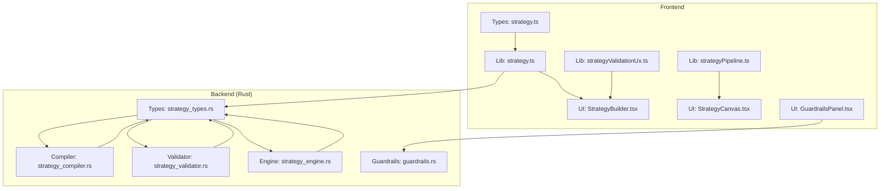
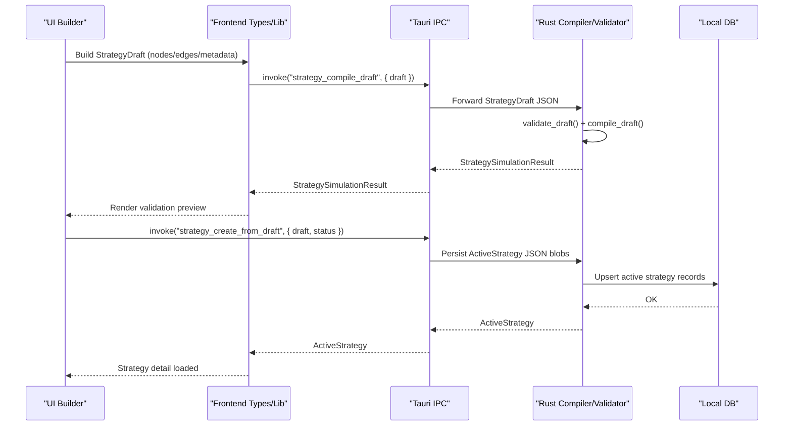
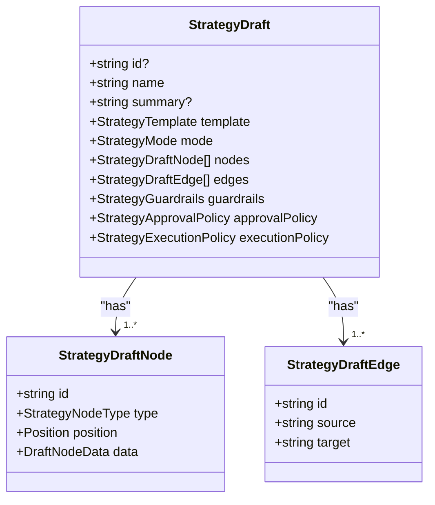
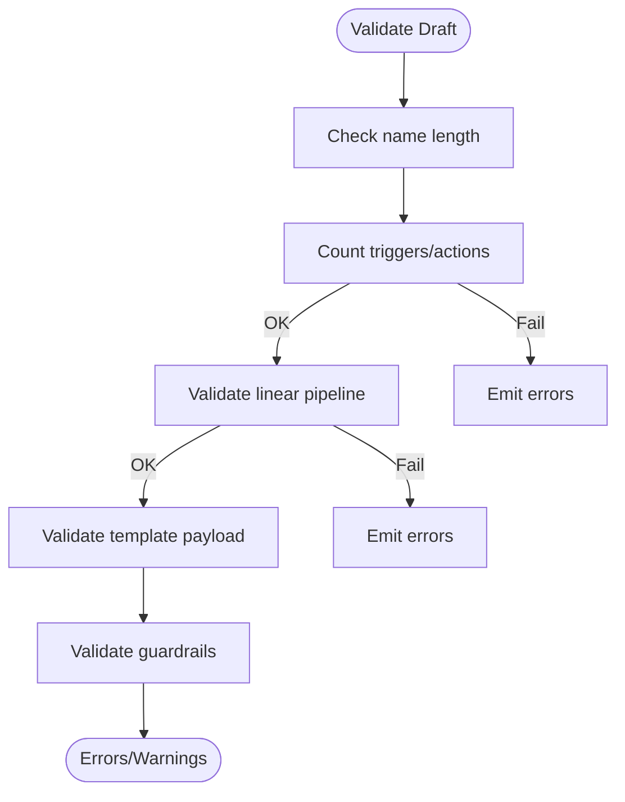
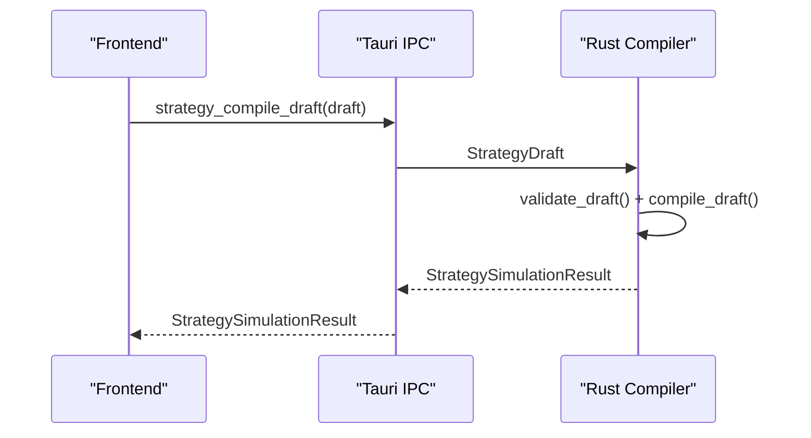
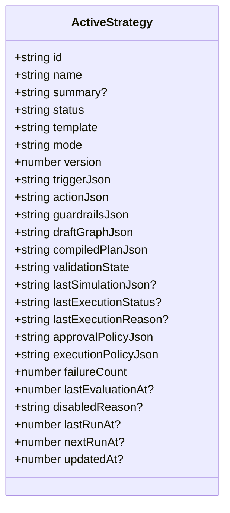
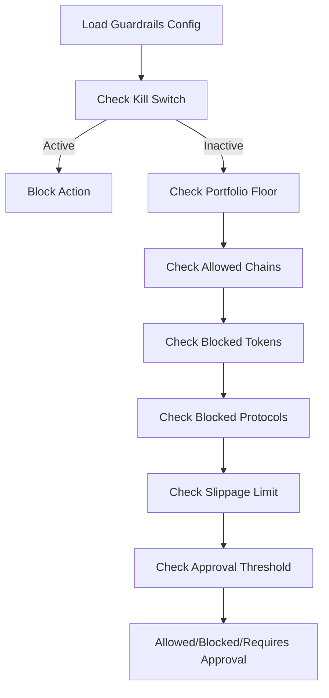
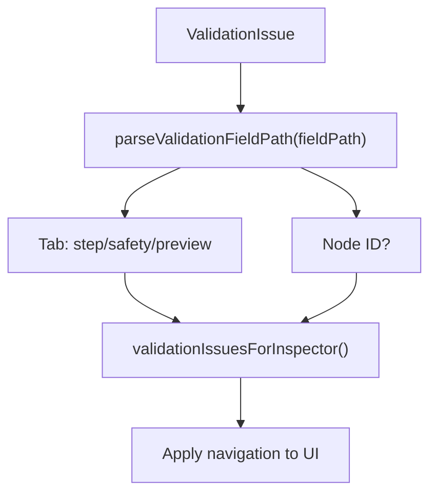
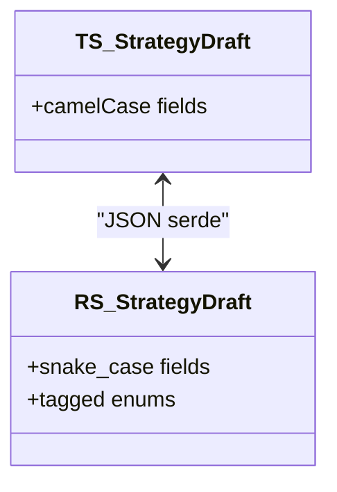
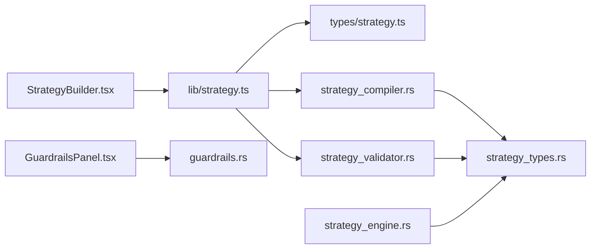

# Strategy Data Models and Types

<cite>
**Referenced Files in This Document**
- [strategy.ts](file://src/types/strategy.ts)
- [strategy.ts](file://src/lib/strategy.ts)
- [strategyPipeline.ts](file://src/lib/strategyPipeline.ts)
- [strategyValidationUx.ts](file://src/lib/strategyValidationUx.ts)
- [StrategyBuilder.tsx](file://src/components/strategy/StrategyBuilder.tsx)
- [StrategyCanvas.tsx](file://src/components/strategy/StrategyCanvas.tsx)
- [GuardrailsPanel.tsx](file://src/components/autonomous/GuardrailsPanel.tsx)
- [strategy_types.rs](file://src-tauri/src/services/strategy_types.rs)
- [strategy_compiler.rs](file://src-tauri/src/services/strategy_compiler.rs)
- [strategy_engine.rs](file://src-tauri/src/services/strategy_engine.rs)
- [strategy_validator.rs](file://src-tauri/src/services/strategy_validator.rs)
- [guardrails.rs](file://src-tauri/src/services/guardrails.rs)
</cite>

## Table of Contents
1. [Introduction](#introduction)
2. [Project Structure](#project-structure)
3. [Core Components](#core-components)
4. [Architecture Overview](#architecture-overview)
5. [Detailed Component Analysis](#detailed-component-analysis)
6. [Dependency Analysis](#dependency-analysis)
7. [Performance Considerations](#performance-considerations)
8. [Troubleshooting Guide](#troubleshooting-guide)
9. [Conclusion](#conclusion)
10. [Appendices](#appendices)

## Introduction
This document explains the strategy data models and type definitions used to define, validate, compile, and execute automated strategies. It covers:
- StrategyDraft for editable strategies (nodes, edges, metadata)
- ActiveStrategy for runtime execution (state, scheduling, and performance tracking)
- StrategyNode interface concepts and validation rules
- Guardrails configuration system and risk management parameters
- StrategyValidationIssue for error reporting
- StrategySimulationResult for testing outcomes
- Serialization/deserialization across the frontend and Rust backend
- Type safety mechanisms and migration/backward compatibility patterns

## Project Structure
The strategy system spans TypeScript frontend types and libraries, React UI components, and a Rust backend for compilation, validation, and execution.

**Diagram sources**
- [strategy.ts:1-258](file://src/types/strategy.ts#L1-L258)
- [strategy.ts:1-218](file://src/lib/strategy.ts#L1-L218)
- [strategyPipeline.ts:1-116](file://src/lib/strategyPipeline.ts#L1-L116)
- [strategyValidationUx.ts:1-67](file://src/lib/strategyValidationUx.ts#L1-L67)
- [StrategyBuilder.tsx:1-287](file://src/components/strategy/StrategyBuilder.tsx#L1-L287)
- [StrategyCanvas.tsx:1-109](file://src/components/strategy/StrategyCanvas.tsx#L1-L109)
- [GuardrailsPanel.tsx:1-327](file://src/components/autonomous/GuardrailsPanel.tsx#L1-L327)
- [strategy_types.rs:1-417](file://src-tauri/src/services/strategy_types.rs#L1-L417)
- [strategy_compiler.rs:1-369](file://src-tauri/src/services/strategy_compiler.rs#L1-L369)
- [strategy_engine.rs:1-726](file://src-tauri/src/services/strategy_engine.rs#L1-L726)
- [guardrails.rs:1-620](file://src-tauri/src/services/guardrails.rs#L1-L620)

**Section sources**
- [strategy.ts:1-258](file://src/types/strategy.ts#L1-L258)
- [strategy.ts:1-218](file://src/lib/strategy.ts#L1-L218)
- [strategyPipeline.ts:1-116](file://src/lib/strategyPipeline.ts#L1-L116)
- [strategyValidationUx.ts:1-67](file://src/lib/strategyValidationUx.ts#L1-L67)
- [StrategyBuilder.tsx:1-287](file://src/components/strategy/StrategyBuilder.tsx#L1-L287)
- [StrategyCanvas.tsx:1-109](file://src/components/strategy/StrategyCanvas.tsx#L1-L109)
- [GuardrailsPanel.tsx:1-327](file://src/components/autonomous/GuardrailsPanel.tsx#L1-L327)
- [strategy_types.rs:1-417](file://src-tauri/src/services/strategy_types.rs#L1-L417)
- [strategy_compiler.rs:1-369](file://src-tauri/src/services/strategy_compiler.rs#L1-L369)
- [strategy_engine.rs:1-726](file://src-tauri/src/services/strategy_engine.rs#L1-L726)
- [guardrails.rs:1-620](file://src-tauri/src/services/guardrails.rs#L1-L620)

## Core Components
- StrategyDraft: Editable strategy graph with typed nodes, edges, and metadata. Includes guardrails, approval, and execution policies.
- StrategyNode concepts: Trigger, condition, and action nodes with specific payload shapes.
- CompiledStrategyPlan: Runtime-ready plan derived from a StrategyDraft.
- ActiveStrategy: Persisted runtime representation with state, scheduling, and execution history.
- StrategyValidationIssue: Structured validation/warning messages with field paths.
- StrategySimulationResult: Preview of compilation outcome and evaluation preview.
- Guardrails: Risk controls for autonomous actions and strategy runtime.

**Section sources**
- [strategy.ts:110-121](file://src/types/strategy.ts#L110-L121)
- [strategy.ts:182-193](file://src/types/strategy.ts#L182-L193)
- [strategy.ts:195-200](file://src/types/strategy.ts#L195-L200)
- [strategy.ts:202-213](file://src/types/strategy.ts#L202-L213)
- [strategy.ts:215-241](file://src/types/strategy.ts#L215-L241)
- [strategy_types.rs:226-243](file://src-tauri/src/services/strategy_types.rs#L226-L243)
- [strategy_types.rs:342-355](file://src-tauri/src/services/strategy_types.rs#L342-L355)
- [strategy_types.rs:392-400](file://src-tauri/src/services/strategy_types.rs#L392-L400)
- [strategy_types.rs:402-417](file://src-tauri/src/services/strategy_types.rs#L402-L417)

## Architecture Overview
End-to-end flow from UI to backend and execution:

**Diagram sources**
- [strategy.ts:174-205](file://src/lib/strategy.ts#L174-L205)
- [strategy_types.rs:392-400](file://src-tauri/src/services/strategy_types.rs#L392-L400)
- [strategy_compiler.rs:185-292](file://src-tauri/src/services/strategy_compiler.rs#L185-L292)
- [strategy_validator.rs:13-106](file://src-tauri/src/services/strategy_validator.rs#L13-L106)
- [strategy_engine.rs:343-725](file://src-tauri/src/services/strategy_engine.rs#L343-L725)

## Detailed Component Analysis

### StrategyDraft: Editable Strategy Graph
- Purpose: Captures user-defined automation as a directed acyclic graph with typed nodes and edges.
- Nodes:
  - Trigger: time_interval, drift_threshold, threshold
  - Condition: portfolio_floor, max_gas, max_slippage, wallet_asset_available, cooldown, drift_minimum
  - Action: dca_buy, rebalance_to_target, alert_only
- Edges: Directed connections from trigger to action via zero or more conditions.
- Metadata: name, summary, template, mode, guardrails, approvalPolicy, executionPolicy.

**Diagram sources**
- [strategy.ts:110-121](file://src/types/strategy.ts#L110-L121)
- [strategy.ts:73-84](file://src/types/strategy.ts#L73-L84)
- [strategy_types.rs:226-243](file://src-tauri/src/services/strategy_types.rs#L226-L243)
- [strategy_types.rs:149-165](file://src-tauri/src/services/strategy_types.rs#L149-L165)

**Section sources**
- [strategy.ts:110-121](file://src/types/strategy.ts#L110-L121)
- [strategy.ts:73-84](file://src/types/strategy.ts#L73-L84)
- [strategy_types.rs:226-243](file://src-tauri/src/services/strategy_types.rs#L226-L243)
- [strategy_types.rs:149-165](file://src-tauri/src/services/strategy_types.rs#L149-L165)

### StrategyNode Interface Concepts and Validation
- Node types: trigger, condition, action.
- Payloads are discriminated unions keyed by type.
- Validation enforces:
  - Exactly one trigger and one action.
  - Linear chain with no cycles and full connectivity.
  - Template-specific payload compatibility.
  - Guardrails constraints for non-alert templates.

**Diagram sources**
- [strategy_validator.rs:13-106](file://src-tauri/src/services/strategy_validator.rs#L13-L106)
- [strategy_validator.rs:119-223](file://src-tauri/src/services/strategy_validator.rs#L119-L223)
- [strategy_validator.rs:225-292](file://src-tauri/src/services/strategy_validator.rs#L225-L292)
- [strategy_validator.rs:294-340](file://src-tauri/src/services/strategy_validator.rs#L294-L340)

**Section sources**
- [strategy_validator.rs:13-106](file://src-tauri/src/services/strategy_validator.rs#L13-L106)
- [strategy_validator.rs:119-223](file://src-tauri/src/services/strategy_validator.rs#L119-L223)
- [strategy_validator.rs:225-292](file://src-tauri/src/services/strategy_validator.rs#L225-L292)
- [strategy_validator.rs:294-340](file://src-tauri/src/services/strategy_validator.rs#L294-L340)

### CompiledStrategyPlan and StrategySimulationResult
- Compiled plan transforms StrategyDraft into a strongly-typed runtime plan with trigger, conditions, and action.
- Normalized guardrails are computed and included.
- Simulation result includes validity, plan, and evaluation preview (conditions, mode, expected action summary).

**Diagram sources**
- [strategy.ts:174-178](file://src/lib/strategy.ts#L174-L178)
- [strategy_types.rs:392-400](file://src-tauri/src/services/strategy_types.rs#L392-L400)
- [strategy_compiler.rs:185-292](file://src-tauri/src/services/strategy_compiler.rs#L185-L292)

**Section sources**
- [strategy_types.rs:342-355](file://src-tauri/src/services/strategy_types.rs#L342-L355)
- [strategy_types.rs:392-400](file://src-tauri/src/services/strategy_types.rs#L392-L400)
- [strategy_compiler.rs:185-292](file://src-tauri/src/services/strategy_compiler.rs#L185-L292)

### ActiveStrategy: Runtime Execution Model
- Persisted representation of an active strategy with:
  - Status, mode, version
  - Serialized JSON blobs for trigger/action/guardrails/draft/compiled plan
  - Validation state, last simulation, execution status/reason
  - Scheduling fields: failure count, last evaluation/run timestamps, next run
- Used by the engine to evaluate triggers, conditions, and decide execution or approval.

**Diagram sources**
- [strategy.ts:215-241](file://src/types/strategy.ts#L215-L241)
- [strategy_types.rs:402-417](file://src-tauri/src/services/strategy_types.rs#L402-L417)

**Section sources**
- [strategy.ts:215-241](file://src/types/strategy.ts#L215-L241)
- [strategy_engine.rs:64-77](file://src-tauri/src/services/strategy_engine.rs#L64-L77)

### Guardrails Configuration System
- Frontend UI exposes guardrails editing for autonomous actions.
- Backend validates actions against guardrails (kill switch, portfolio floor, chain allowlist, token/protocol denylist, slippage, approval thresholds).
- Guardrails are serialized to JSON and stored in local DB.

**Diagram sources**
- [guardrails.rs:277-426](file://src-tauri/src/services/guardrails.rs#L277-L426)
- [GuardrailsPanel.tsx:1-327](file://src/components/autonomous/GuardrailsPanel.tsx#L1-L327)

**Section sources**
- [guardrails.rs:1-620](file://src-tauri/src/services/guardrails.rs#L1-L620)
- [GuardrailsPanel.tsx:1-327](file://src/components/autonomous/GuardrailsPanel.tsx#L1-L327)

### StrategyValidationIssue and UX Navigation
- Validation issues carry code, severity, message, and optional fieldPath.
- UI navigation maps fieldPath to inspector tabs and selected node for targeted feedback.

**Diagram sources**
- [strategyValidationUx.ts:8-67](file://src/lib/strategyValidationUx.ts#L8-L67)
- [strategy.ts:195-200](file://src/types/strategy.ts#L195-L200)

**Section sources**
- [strategyValidationUx.ts:1-67](file://src/lib/strategyValidationUx.ts#L1-L67)
- [strategy.ts:195-200](file://src/types/strategy.ts#L195-L200)

### Serialization and Deserialization
- Frontend types mirror backend structures with camelCase serialization.
- Rust types use serde with tag/flatten renames to align with frontend shapes.
- IPC uses Tauri invoke to send StrategyDraft and receive StrategySimulationResult.

**Diagram sources**
- [strategy.ts:1-258](file://src/types/strategy.ts#L1-L258)
- [strategy_types.rs:1-417](file://src-tauri/src/services/strategy_types.rs#L1-L417)

**Section sources**
- [strategy.ts:1-258](file://src/types/strategy.ts#L1-L258)
- [strategy_types.rs:1-417](file://src-tauri/src/services/strategy_types.rs#L1-L417)

### Type Safety Mechanisms
- Discriminated unions for node data ensure only valid payloads per node type.
- Strict enums for modes/templates/nodes prevent invalid values.
- Optional fields with defaults and normalization ensure robust runtime plans.
- FieldPath in validation issues enables precise UI targeting.

**Section sources**
- [strategy.ts:22-69](file://src/types/strategy.ts#L22-L69)
- [strategy_types.rs:37-125](file://src-tauri/src/services/strategy_types.rs#L37-L125)
- [strategy_types.rs:27-33](file://src-tauri/src/services/strategy_types.rs#L27-L33)

### Examples of Strategy Data Structures
- Default DCA Buy draft: trigger=time_interval, condition=cooldown, action=dca_buy.
- Rebalance to Target draft: trigger=drift_threshold/time_interval, condition=cooldown, action=rebalance_to_target.
- Alert Only draft: trigger=threshold, action=alert_only.

These are constructed programmatically and rendered in the UI canvas and inspector.

**Section sources**
- [strategy.ts:13-172](file://src/lib/strategy.ts#L13-L172)
- [StrategyCanvas.tsx:1-109](file://src/components/strategy/StrategyCanvas.tsx#L1-L109)
- [StrategyBuilder.tsx:1-287](file://src/components/strategy/StrategyBuilder.tsx#L1-L287)

### Migration Patterns and Backward Compatibility
- Rust types use serde renames to maintain compatibility with frontend camelCase.
- Optional fields and defaults (e.g., StrategyExecutionPolicy) enable additive changes.
- Normalization of guardrails ensures older drafts still run safely.
- Validation emits warnings for deprecated or risky configurations.

**Section sources**
- [strategy_types.rs:167-224](file://src-tauri/src/services/strategy_types.rs#L167-L224)
- [strategy_compiler.rs:120-144](file://src-tauri/src/services/strategy_compiler.rs#L120-L144)
- [strategy_validator.rs:294-340](file://src-tauri/src/services/strategy_validator.rs#L294-L340)

## Dependency Analysis
Key dependencies and relationships:

**Diagram sources**
- [StrategyBuilder.tsx:1-287](file://src/components/strategy/StrategyBuilder.tsx#L1-L287)
- [strategy.ts:1-218](file://src/lib/strategy.ts#L1-L218)
- [strategy_types.rs:1-417](file://src-tauri/src/services/strategy_types.rs#L1-L417)
- [strategy_compiler.rs:1-369](file://src-tauri/src/services/strategy_compiler.rs#L1-L369)
- [strategy_validator.rs:1-457](file://src-tauri/src/services/strategy_validator.rs#L1-L457)
- [strategy_engine.rs:1-726](file://src-tauri/src/services/strategy_engine.rs#L1-L726)
- [guardrails.rs:1-620](file://src-tauri/src/services/guardrails.rs#L1-L620)

**Section sources**
- [strategy.ts:1-218](file://src/lib/strategy.ts#L1-L218)
- [strategy_types.rs:1-417](file://src-tauri/src/services/strategy_types.rs#L1-L417)
- [strategy_compiler.rs:1-369](file://src-tauri/src/services/strategy_compiler.rs#L1-L369)
- [strategy_validator.rs:1-457](file://src-tauri/src/services/strategy_validator.rs#L1-L457)
- [strategy_engine.rs:1-726](file://src-tauri/src/services/strategy_engine.rs#L1-L726)
- [guardrails.rs:1-620](file://src-tauri/src/services/guardrails.rs#L1-L620)

## Performance Considerations
- Keep condition chains short and linear to minimize evaluation overhead.
- Use appropriate evaluation intervals to avoid excessive polling.
- Guardrails checks are lightweight; place heavy checks (e.g., portfolio snapshots) judiciously.
- Normalize guardrails to avoid repeated computation in the engine.

## Troubleshooting Guide
- Compilation fails: Review StrategyValidationIssue entries and fix template/payload mismatches or pipeline issues.
- Runtime skipped: Inspect lastExecutionReason and condition previews to identify blocking conditions.
- Approval required: Adjust execution policy or approval thresholds in ActiveStrategy metadata.
- Guardrail violations: Update GuardrailsPanel settings or approve overrides.

**Section sources**
- [strategy_validationUx.ts:1-67](file://src/lib/strategyValidationUx.ts#L1-L67)
- [strategy_engine.rs:343-725](file://src-tauri/src/services/strategy_engine.rs#L343-L725)
- [guardrails.rs:277-426](file://src-tauri/src/services/guardrails.rs#L277-L426)

## Conclusion
The strategy system combines strong TypeScript types with Rust-backed compilation and validation to deliver safe, auditable automation. The frontend provides an intuitive builder and inspector, while the backend enforces structural and risk constraints, ensuring reliable execution and clear diagnostics.

## Appendices

### Strategy Node Display Labels
Utility to render human-friendly labels for each node type in the UI.

**Section sources**
- [strategyPipeline.ts:41-116](file://src/lib/strategyPipeline.ts#L41-L116)

### Strategy Order Derivation
Linear traversal from trigger to action for pipeline visualization and validation.

**Section sources**
- [strategyPipeline.ts:8-39](file://src/lib/strategyPipeline.ts#L8-L39)