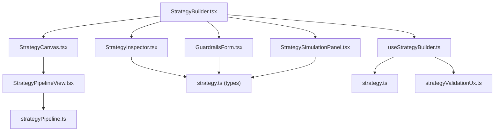
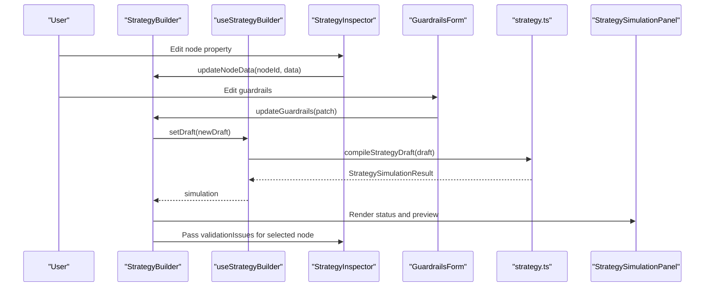
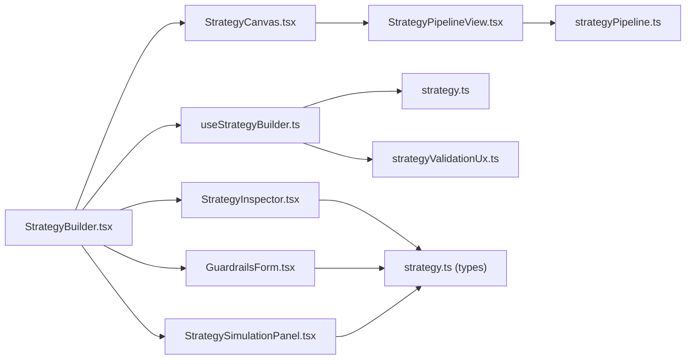
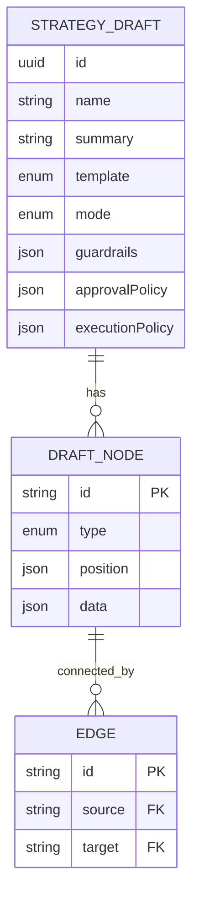

# Strategy Inspector Configuration

<cite>
**Referenced Files in This Document**
- [StrategyBuilder.tsx](file://src/components/strategy/StrategyBuilder.tsx)
- [StrategyCanvas.tsx](file://src/components/strategy/StrategyCanvas.tsx)
- [StrategyPipelineView.tsx](file://src/components/strategy/StrategyPipelineView.tsx)
- [StrategyInspector.tsx](file://src/components/strategy/StrategyInspector.tsx)
- [GuardrailsForm.tsx](file://src/components/strategy/GuardrailsForm.tsx)
- [StrategySimulationPanel.tsx](file://src/components/strategy/StrategySimulationPanel.tsx)
- [useStrategyBuilder.ts](file://src/hooks/useStrategyBuilder.ts)
- [strategy.ts](file://src/lib/strategy.ts)
- [strategyPipeline.ts](file://src/lib/strategyPipeline.ts)
- [strategyValidationUx.ts](file://src/lib/strategyValidationUx.ts)
- [strategy.ts (types)](file://src/types/strategy.ts)
</cite>

## Table of Contents
1. [Introduction](#introduction)
2. [Project Structure](#project-structure)
3. [Core Components](#core-components)
4. [Architecture Overview](#architecture-overview)
5. [Detailed Component Analysis](#detailed-component-analysis)
6. [Dependency Analysis](#dependency-analysis)
7. [Performance Considerations](#performance-considerations)
8. [Troubleshooting Guide](#troubleshooting-guide)
9. [Conclusion](#conclusion)
10. [Appendices](#appendices)

## Introduction
This document explains the Strategy Inspector configuration system used to define and tune automation strategies. It covers:
- How the node property editor works across trigger, condition, and action node types
- Validation and error presentation in the inspector and preview panels
- Risk management via the GuardrailsForm component
- Real-time validation feedback and propagation to strategy simulation
- Integration with the canvas selection system and node data updates
- Practical examples for configuring swaps, approvals, and conditional branches
- Debugging and optimization tips

## Project Structure
The Strategy Inspector lives within the Strategy Builder UI and integrates with:
- Canvas rendering and selection
- Real-time compilation and simulation
- Validation UX helpers for mapping errors to inspector tabs
- Guardrails configuration for safety thresholds

**Diagram sources**
- [StrategyBuilder.tsx:25-287](file://src/components/strategy/StrategyBuilder.tsx#L25-L287)
- [StrategyCanvas.tsx:19-109](file://src/components/strategy/StrategyCanvas.tsx#L19-L109)
- [StrategyPipelineView.tsx:38-107](file://src/components/strategy/StrategyPipelineView.tsx#L38-L107)
- [StrategyInspector.tsx:41-459](file://src/components/strategy/StrategyInspector.tsx#L41-L459)
- [GuardrailsForm.tsx:22-189](file://src/components/strategy/GuardrailsForm.tsx#L22-L189)
- [StrategySimulationPanel.tsx:13-160](file://src/components/strategy/StrategySimulationPanel.tsx#L13-L160)
- [useStrategyBuilder.ts:37-248](file://src/hooks/useStrategyBuilder.ts#L37-L248)
- [strategy.ts:13-218](file://src/lib/strategy.ts#L13-L218)
- [strategyValidationUx.ts:1-66](file://src/lib/strategyValidationUx.ts#L1-L66)
- [strategyPipeline.ts:8-116](file://src/lib/strategyPipeline.ts#L8-L116)
- [strategy.ts (types):22-258](file://src/types/strategy.ts#L22-L258)

**Section sources**
- [StrategyBuilder.tsx:25-287](file://src/components/strategy/StrategyBuilder.tsx#L25-L287)
- [StrategyCanvas.tsx:19-109](file://src/components/strategy/StrategyCanvas.tsx#L19-L109)
- [StrategyInspector.tsx:41-459](file://src/components/strategy/StrategyInspector.tsx#L41-L459)
- [GuardrailsForm.tsx:22-189](file://src/components/strategy/GuardrailsForm.tsx#L22-L189)
- [StrategySimulationPanel.tsx:13-160](file://src/components/strategy/StrategySimulationPanel.tsx#L13-L160)
- [useStrategyBuilder.ts:37-248](file://src/hooks/useStrategyBuilder.ts#L37-L248)
- [strategy.ts:13-218](file://src/lib/strategy.ts#L13-L218)
- [strategyValidationUx.ts:1-66](file://src/lib/strategyValidationUx.ts#L1-L66)
- [strategyPipeline.ts:8-116](file://src/lib/strategyPipeline.ts#L8-L116)
- [strategy.ts (types):22-258](file://src/types/strategy.ts#L22-L258)

## Core Components
- StrategyBuilder orchestrates the UI, state, and real-time compilation.
- StrategyCanvas renders the pipeline and handles selection and node removal.
- StrategyInspector edits node properties and displays validation issues for the selected node.
- GuardrailsForm configures safety thresholds and displays guardrail-specific validation messages.
- StrategySimulationPanel shows compile status, warnings, and condition previews.
- useStrategyBuilder manages draft lifecycle, compilation, saving, and node/guardrails updates.
- strategy.ts defines defaults, templates, and IPC invocations for compilation and persistence.
- strategyValidationUx maps backend validation field paths to inspector navigation.
- strategyPipeline.ts computes display labels and pipeline ordering.

**Section sources**
- [StrategyBuilder.tsx:25-287](file://src/components/strategy/StrategyBuilder.tsx#L25-L287)
- [StrategyCanvas.tsx:19-109](file://src/components/strategy/StrategyCanvas.tsx#L19-L109)
- [StrategyInspector.tsx:41-459](file://src/components/strategy/StrategyInspector.tsx#L41-L459)
- [GuardrailsForm.tsx:22-189](file://src/components/strategy/GuardrailsForm.tsx#L22-L189)
- [StrategySimulationPanel.tsx:13-160](file://src/components/strategy/StrategySimulationPanel.tsx#L13-L160)
- [useStrategyBuilder.ts:37-248](file://src/hooks/useStrategyBuilder.ts#L37-L248)
- [strategy.ts:13-218](file://src/lib/strategy.ts#L13-L218)
- [strategyValidationUx.ts:1-66](file://src/lib/strategyValidationUx.ts#L1-L66)
- [strategyPipeline.ts:8-116](file://src/lib/strategyPipeline.ts#L8-L116)

## Architecture Overview
The inspector is part of a real-time validation and simulation loop:
- Editing in the inspector or guardrails triggers a delayed compile.
- Compilation returns a SimulationResult with validation errors/warnings and condition previews.
- The SimulationStrip shows compile status; clicking “Full preview” opens the Preview tab.
- Validation UX maps backend field paths to the Step or Safety tabs and selects the affected node.

**Diagram sources**
- [StrategyBuilder.tsx:25-287](file://src/components/strategy/StrategyBuilder.tsx#L25-L287)
- [useStrategyBuilder.ts:99-112](file://src/hooks/useStrategyBuilder.ts#L99-L112)
- [strategy.ts:174-178](file://src/lib/strategy.ts#L174-L178)
- [StrategySimulationPanel.tsx:13-160](file://src/components/strategy/StrategySimulationPanel.tsx#L13-L160)
- [StrategyInspector.tsx:41-459](file://src/components/strategy/StrategyInspector.tsx#L41-L459)
- [GuardrailsForm.tsx:22-189](file://src/components/strategy/GuardrailsForm.tsx#L22-L189)

## Detailed Component Analysis

### StrategyInspector: Node Property Editor
- Purpose: Edit properties of the currently selected node (trigger, condition, or action).
- Behavior:
  - Displays a contextual form based on node.type and data.type.
  - Uses a generic handler to convert numeric inputs for USD, percentages, seconds, and token amounts.
  - Supports parsing comma-separated target allocation lists for drift and rebalance actions.
  - Shows validation issues scoped to the selected node.

Key editing patterns:
- Text inputs and numeric fields are handled generically; numeric fields are coerced when the field name suggests USD, percent, seconds, or token values.
- Allocation lists are parsed from a “symbol:percent” format and validated to ensure non-empty symbols and finite percentages.

Examples of node types exposed:
- Triggers:
  - time_interval: interval, timezone
  - drift_threshold: driftPct, evaluationIntervalSeconds, targetAllocations
  - threshold: operator, value
- Conditions:
  - cooldown: cooldownSeconds
  - portfolio_floor: minPortfolioUsd
  - max_gas: maxGasUsd
  - max_slippage: maxSlippageBps
  - wallet_asset_available: symbol, minAmount
  - drift_minimum: minDriftPct
- Actions:
  - dca_buy: chain, fromSymbol, toSymbol, amountUsd
  - rebalance_to_target: chain, thresholdPct, maxExecutionUsd, targetAllocations
  - alert_only: title, severity, messageTemplate

Validation display:
- Shows validation issues for the selected node only, derived from the global validation set.

**Section sources**
- [StrategyInspector.tsx:41-459](file://src/components/strategy/StrategyInspector.tsx#L41-L459)
- [strategy.ts (types):22-69](file://src/types/strategy.ts#L22-L69)

### GuardrailsForm: Risk Management Configuration
- Purpose: Configure safety thresholds and allowed chains.
- Fields:
  - Max per trade (USD), Max daily notional (USD), Require approval above (USD), Stop if portfolio below (USD)
  - Cooldown (seconds), Max slippage (bps), Max gas (USD)
  - Allowed chains toggled via chips
- Behavior:
  - Numeric fields are parsed to numbers on change.
  - Allowed chains are maintained as a sorted set.
  - Displays guardrail-specific validation messages when present.

Safety thresholds covered:
- Trade sizing caps
- Daily notional cap
- Approval gating thresholds
- Portfolio floor
- Execution cadence (cooldown)
- Route risk caps (slippage, gas)

**Section sources**
- [GuardrailsForm.tsx:22-189](file://src/components/strategy/GuardrailsForm.tsx#L22-L189)
- [strategy.ts (types):86-97](file://src/types/strategy.ts#L86-L97)

### StrategyCanvas and Pipeline Integration
- StrategyCanvas provides:
  - Toolbar to add/remove conditions and reset templates
  - Container for StrategyPipelineView
- StrategyPipelineView:
  - Renders nodes in order using getOrderedPipelineNodes
  - Highlights selected node and shows step type icons and labels
  - Delegates selection to StrategyBuilder

Selection flow:
- Clicking a step in the pipeline sets selectedNodeId in StrategyBuilder.
- The inspector receives the selected node and scoped validation issues.

**Section sources**
- [StrategyCanvas.tsx:19-109](file://src/components/strategy/StrategyCanvas.tsx#L19-L109)
- [StrategyPipelineView.tsx:38-107](file://src/components/strategy/StrategyPipelineView.tsx#L38-L107)
- [strategyPipeline.ts:8-39](file://src/lib/strategyPipeline.ts#L8-L39)

### Real-Time Validation Feedback and Simulation Propagation
- useStrategyBuilder compiles the draft with a debounce and updates simulation state.
- StrategySimulationStrip shows compile status and quick summary.
- StrategySimulationDetail shows:
  - Execution mode
  - Action summary
  - Validation errors and warnings
  - Condition preview results
- StrategyBuilder maps backend fieldPaths to inspector navigation:
  - parseValidationFieldPath determines whether to open Step, Safety, or Preview tabs and optionally select a node.
  - validationIssuesForInspector filters global validation issues to those relevant to the selected node.

**Section sources**
- [useStrategyBuilder.ts:99-112](file://src/hooks/useStrategyBuilder.ts#L99-L112)
- [StrategySimulationPanel.tsx:13-160](file://src/components/strategy/StrategySimulationPanel.tsx#L13-L160)
- [StrategyBuilder.tsx:59-74](file://src/components/strategy/StrategyBuilder.tsx#L59-L74)
- [strategyValidationUx.ts:8-66](file://src/lib/strategyValidationUx.ts#L8-L66)

### Example Configurations

- Swap action (DCA buy):
  - Configure chain, fromSymbol, toSymbol, and amountUsd.
  - Use the inspector’s numeric coercion for USD and token amounts.
  - Validate that fromSymbol and toSymbol are supported by the chosen chain.

- Approval gate (approval required):
  - Set requireApprovalAboveUsd in GuardrailsForm to enforce manual approval for larger trades.
  - Confirm that the strategy mode is “approval_required” in Strategy details.

- Conditional branch (cooldown):
  - Add a condition node to introduce a cooldownSeconds threshold.
  - Adjust the inspector to set the desired cooldown window.
  - Observe condition preview results in the Preview tab.

- Rebalancing to target:
  - Configure thresholdPct and targetAllocations.
  - Use the allocation list parser to enter “SYMBOL:PERCENT” entries.
  - Review validation errors for invalid allocations or unsupported chains.

- Alert-only action:
  - Set title, severity, and messageTemplate.
  - Ensure the strategy mode is “monitor_only” if you intend passive alerts.

**Section sources**
- [StrategyInspector.tsx:320-417](file://src/components/strategy/StrategyInspector.tsx#L320-L417)
- [GuardrailsForm.tsx:66-158](file://src/components/strategy/GuardrailsForm.tsx#L66-L158)
- [strategy.ts:13-172](file://src/lib/strategy.ts#L13-L172)

### Inspector Role in Strategy Debugging and Optimization
- Immediate feedback: As you edit, the system recompiles and shows validation errors/warnings.
- Scoped diagnostics: The inspector focuses on the selected node, reducing noise.
- Navigation: Clicking an error in the Preview tab jumps to the relevant Step or Safety tab and selects the affected node.
- Optimization insights: Condition previews help you understand pass/fail outcomes for guards, enabling fine-tuning of thresholds.

**Section sources**
- [StrategyBuilder.tsx:59-74](file://src/components/strategy/StrategyBuilder.tsx#L59-L74)
- [StrategySimulationPanel.tsx:67-160](file://src/components/strategy/StrategySimulationPanel.tsx#L67-L160)
- [strategyValidationUx.ts:29-66](file://src/lib/strategyValidationUx.ts#L29-L66)

## Dependency Analysis
- StrategyBuilder depends on:
  - useStrategyBuilder for state and IPC
  - StrategyInspector and GuardrailsForm for editing
  - StrategySimulationPanel for compile feedback
  - StrategyCanvas and StrategyPipelineView for selection and rendering
- useStrategyBuilder depends on:
  - strategy.ts for defaults, templates, and IPC
  - strategyValidationUx.ts for mapping validation to UI
  - strategyPipeline.ts for display labels and ordering
- Types define the contract between frontend and backend.

**Diagram sources**
- [StrategyBuilder.tsx:25-287](file://src/components/strategy/StrategyBuilder.tsx#L25-L287)
- [useStrategyBuilder.ts:37-248](file://src/hooks/useStrategyBuilder.ts#L37-L248)
- [strategy.ts:13-218](file://src/lib/strategy.ts#L13-L218)
- [strategyValidationUx.ts:1-66](file://src/lib/strategyValidationUx.ts#L1-L66)
- [strategyPipeline.ts:8-116](file://src/lib/strategyPipeline.ts#L8-L116)
- [strategy.ts (types):22-258](file://src/types/strategy.ts#L22-L258)

**Section sources**
- [StrategyBuilder.tsx:25-287](file://src/components/strategy/StrategyBuilder.tsx#L25-L287)
- [useStrategyBuilder.ts:37-248](file://src/hooks/useStrategyBuilder.ts#L37-L248)
- [strategy.ts:13-218](file://src/lib/strategy.ts#L13-L218)
- [strategyValidationUx.ts:1-66](file://src/lib/strategyValidationUx.ts#L1-L66)
- [strategyPipeline.ts:8-116](file://src/lib/strategyPipeline.ts#L8-L116)
- [strategy.ts (types):22-258](file://src/types/strategy.ts#L22-L258)

## Performance Considerations
- Debounced compilation: A short delay prevents excessive recompilation during rapid edits.
- Memoized selectors: Selected node and scoped validation issues are computed efficiently.
- Minimal re-renders: Only the inspector and preview depend on validation issues; the canvas remains stable.

[No sources needed since this section provides general guidance]

## Troubleshooting Guide
Common validation errors and how to address them:
- Node-level validation (Step tab):
  - Errors scoped to a specific node appear only when that node is selected.
  - Fix by adjusting the node’s parameters in the inspector (e.g., setting valid symbols, positive amounts, or valid intervals).

- Guardrail validation (Safety tab):
  - Errors related to guardrails appear in the Safety panel.
  - Adjust thresholds like maxPerTradeUsd, maxDailyNotionalUsd, requireApprovalAboveUsd, minPortfolioUsd, cooldownSeconds, maxSlippageBps, and maxGasUsd.

- Navigation from Preview:
  - Click an error in the Preview tab to jump to the Step or Safety tab and select the affected node.
  - Use the “Full preview” strip to open the Preview tab quickly.

- Real-time feedback:
  - If the status shows “Needs fixes,” resolve the validation errors listed in the Preview tab.
  - If warnings appear, review them for potential improvements.

**Section sources**
- [StrategyBuilder.tsx:59-74](file://src/components/strategy/StrategyBuilder.tsx#L59-L74)
- [StrategySimulationPanel.tsx:67-160](file://src/components/strategy/StrategySimulationPanel.tsx#L67-L160)
- [strategyValidationUx.ts:29-66](file://src/lib/strategyValidationUx.ts#L29-L66)

## Conclusion
The Strategy Inspector provides a focused, real-time editing experience for building robust automation strategies. By combining node-specific forms, guardrail configuration, and immediate validation feedback, it enables efficient debugging and optimization. The integration with the canvas and simulation panels ensures that changes propagate quickly to the compiled plan, helping you validate and activate strategies confidently.

[No sources needed since this section summarizes without analyzing specific files]

## Appendices

### Data Model Overview

**Diagram sources**
- [strategy.ts (types):110-121](file://src/types/strategy.ts#L110-L121)
- [strategy.ts (types):73-84](file://src/types/strategy.ts#L73-L84)
- [strategy.ts (types):80-84](file://src/types/strategy.ts#L80-L84)