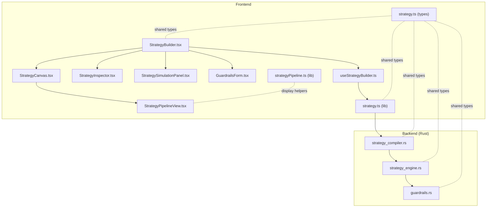
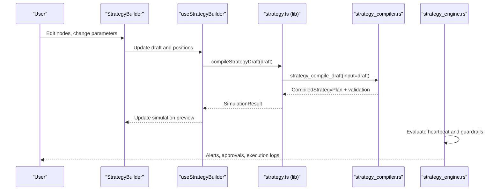
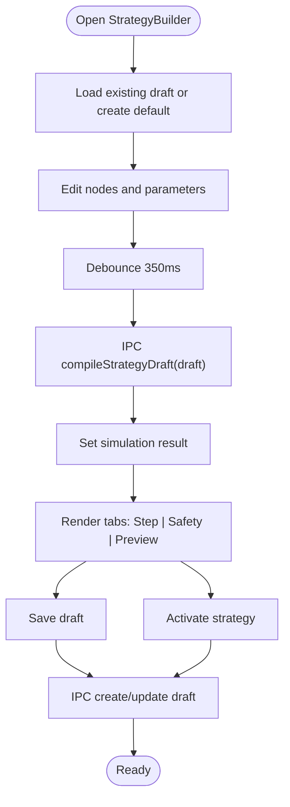
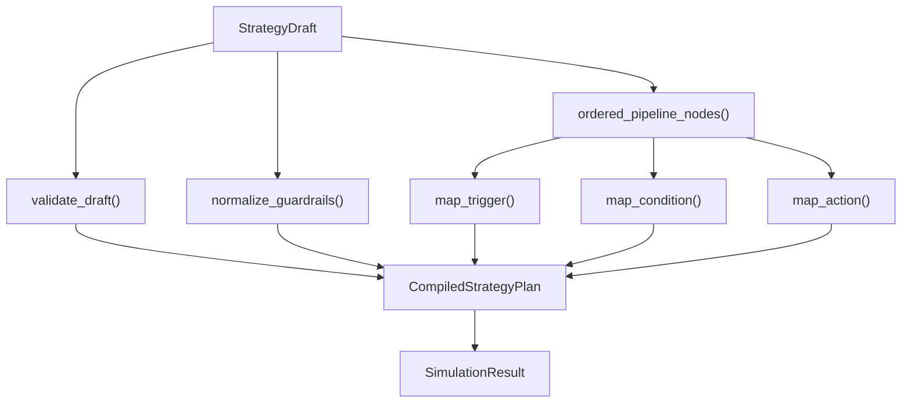
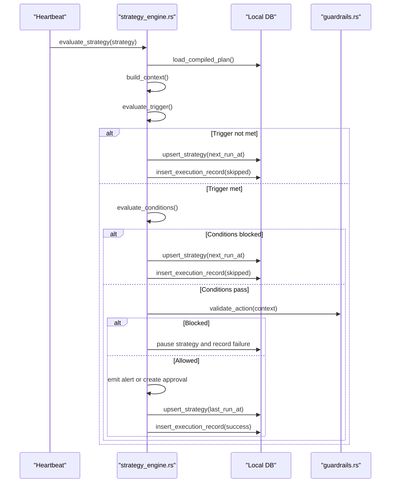
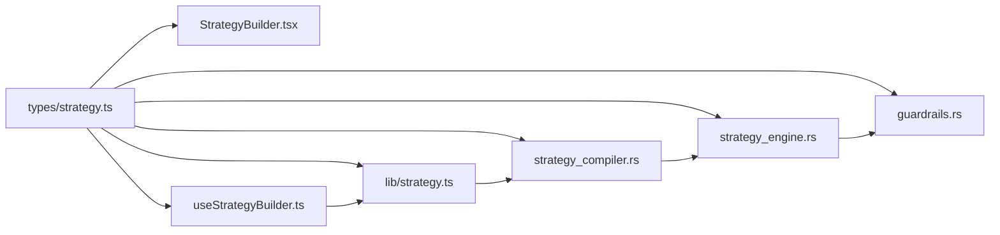

# Strategy Management

<cite>
**Referenced Files in This Document**
- [StrategyBuilder.tsx](file://src/components/strategy/StrategyBuilder.tsx)
- [StrategyCanvas.tsx](file://src/components/strategy/StrategyCanvas.tsx)
- [StrategyPipelineView.tsx](file://src/components/strategy/StrategyPipelineView.tsx)
- [StrategyInspector.tsx](file://src/components/strategy/StrategyInspector.tsx)
- [StrategySimulationPanel.tsx](file://src/components/strategy/StrategySimulationPanel.tsx)
- [GuardrailsForm.tsx](file://src/components/strategy/GuardrailsForm.tsx)
- [useStrategyBuilder.ts](file://src/hooks/useStrategyBuilder.ts)
- [strategy.ts](file://src/lib/strategy.ts)
- [strategyPipeline.ts](file://src/lib/strategyPipeline.ts)
- [strategy.ts](file://src/types/strategy.ts)
- [strategy_compiler.rs](file://src-tauri/src/services/strategy_compiler.rs)
- [strategy_engine.rs](file://src-tauri/src/services/strategy_engine.rs)
- [guardrails.rs](file://src-tauri/src/services/guardrails.rs)
</cite>

## Table of Contents
1. [Introduction](#introduction)
2. [Project Structure](#project-structure)
3. [Core Components](#core-components)
4. [Architecture Overview](#architecture-overview)
5. [Detailed Component Analysis](#detailed-component-analysis)
6. [Dependency Analysis](#dependency-analysis)
7. [Performance Considerations](#performance-considerations)
8. [Troubleshooting Guide](#troubleshooting-guide)
9. [Conclusion](#conclusion)
10. [Appendices](#appendices)

## Introduction
This document explains the Strategy Management system for visual strategy composition and execution. It covers the StrategyBuilder interface, drag-and-drop canvas, node-based strategy architecture, and the end-to-end flow from visual strategy to executable code. It documents the StrategyCanvas component for editing, StrategyInspector for parameter configuration, and StrategySimulationPanel for backtesting and validation previews. It also details the guardrails system for risk management, strategy templates and examples, the compilation process, and the relationship between strategy drafts, active strategies, and execution logs. Finally, it provides troubleshooting guidance and best practices for designing robust strategies.

## Project Structure
The Strategy Management system spans React components and TypeScript logic on the frontend and Rust services on the backend. The frontend provides a visual builder, inspector, and simulation panel. The backend compiles drafts into executable plans, evaluates them on heartbeat ticks, and enforces guardrails.

**Diagram sources**
- [StrategyBuilder.tsx:25-286](file://src/components/strategy/StrategyBuilder.tsx#L25-L286)
- [StrategyCanvas.tsx:19-108](file://src/components/strategy/StrategyCanvas.tsx#L19-L108)
- [StrategyPipelineView.tsx:38-106](file://src/components/strategy/StrategyPipelineView.tsx#L38-L106)
- [StrategyInspector.tsx:41-458](file://src/components/strategy/StrategyInspector.tsx#L41-L458)
- [StrategySimulationPanel.tsx:13-159](file://src/components/strategy/StrategySimulationPanel.tsx#L13-L159)
- [GuardrailsForm.tsx:22-188](file://src/components/strategy/GuardrailsForm.tsx#L22-L188)
- [useStrategyBuilder.ts:37-247](file://src/hooks/useStrategyBuilder.ts#L37-L247)
- [strategy.ts:13-217](file://src/lib/strategy.ts#L13-L217)
- [strategyPipeline.ts:8-115](file://src/lib/strategyPipeline.ts#L8-L115)
- [strategy_compiler.rs:185-292](file://src-tauri/src/services/strategy_compiler.rs#L185-L292)
- [strategy_engine.rs:343-725](file://src-tauri/src/services/strategy_engine.rs#L343-L725)
- [guardrails.rs:278-426](file://src-tauri/src/services/guardrails.rs#L278-L426)

**Section sources**
- [StrategyBuilder.tsx:25-286](file://src/components/strategy/StrategyBuilder.tsx#L25-L286)
- [StrategyCanvas.tsx:19-108](file://src/components/strategy/StrategyCanvas.tsx#L19-L108)
- [StrategyPipelineView.tsx:38-106](file://src/components/strategy/StrategyPipelineView.tsx#L38-L106)
- [StrategyInspector.tsx:41-458](file://src/components/strategy/StrategyInspector.tsx#L41-L458)
- [StrategySimulationPanel.tsx:13-159](file://src/components/strategy/StrategySimulationPanel.tsx#L13-L159)
- [GuardrailsForm.tsx:22-188](file://src/components/strategy/GuardrailsForm.tsx#L22-L188)
- [useStrategyBuilder.ts:37-247](file://src/hooks/useStrategyBuilder.ts#L37-L247)
- [strategy.ts:13-217](file://src/lib/strategy.ts#L13-L217)
- [strategyPipeline.ts:8-115](file://src/lib/strategyPipeline.ts#L8-L115)
- [strategy_compiler.rs:185-292](file://src-tauri/src/services/strategy_compiler.rs#L185-L292)
- [strategy_engine.rs:343-725](file://src-tauri/src/services/strategy_engine.rs#L343-L725)
- [guardrails.rs:278-426](file://src-tauri/src/services/guardrails.rs#L278-L426)

## Core Components
- StrategyBuilder: orchestrates the builder UI, manages draft state, triggers compilation, and handles activation.
- StrategyCanvas: renders the strategy pipeline and exposes controls for templates, adding/removing conditions, and resetting.
- StrategyPipelineView: displays the ordered pipeline visually with distinct visuals for trigger, condition, and action nodes.
- StrategyInspector: edits node parameters based on node type and shows validation issues for the selected step.
- StrategySimulationPanel: shows real-time compilation status and detailed simulation preview with warnings and condition results.
- GuardrailsForm: configures safety parameters applied at execution time.
- useStrategyBuilder: centralizes draft lifecycle, updates, and IPC calls to compile and persist strategies.
- strategy.ts (lib): default strategy creation, IPC wrappers for compile/create/update/get/history, and runtime availability checks.
- strategy.ts (types): shared TypeScript types for drafts, compiled plans, active strategies, and execution records.
- strategy_compiler.rs: validates and compiles StrategyDraft into CompiledStrategyPlan.
- strategy_engine.rs: evaluates CompiledStrategyPlan on heartbeat, computes conditions, enforces guardrails, and emits alerts/approvals.
- guardrails.rs: backend guardrails enforcement and configuration.

**Section sources**
- [StrategyBuilder.tsx:25-286](file://src/components/strategy/StrategyBuilder.tsx#L25-L286)
- [StrategyCanvas.tsx:19-108](file://src/components/strategy/StrategyCanvas.tsx#L19-L108)
- [StrategyPipelineView.tsx:38-106](file://src/components/strategy/StrategyPipelineView.tsx#L38-L106)
- [StrategyInspector.tsx:41-458](file://src/components/strategy/StrategyInspector.tsx#L41-L458)
- [StrategySimulationPanel.tsx:13-159](file://src/components/strategy/StrategySimulationPanel.tsx#L13-L159)
- [GuardrailsForm.tsx:22-188](file://src/components/strategy/GuardrailsForm.tsx#L22-L188)
- [useStrategyBuilder.ts:37-247](file://src/hooks/useStrategyBuilder.ts#L37-L247)
- [strategy.ts:13-217](file://src/lib/strategy.ts#L13-L217)
- [strategy.ts:110-257](file://src/types/strategy.ts#L110-L257)
- [strategy_compiler.rs:185-292](file://src-tauri/src/services/strategy_compiler.rs#L185-L292)
- [strategy_engine.rs:343-725](file://src-tauri/src/services/strategy_engine.rs#L343-L725)
- [guardrails.rs:278-426](file://src-tauri/src/services/guardrails.rs#L278-L426)

## Architecture Overview
The system follows a visual-first design: users compose strategies via drag-and-drop, inspect and configure nodes, and receive immediate feedback through simulation previews. Behind the scenes, the frontend compiles the draft to a plan, and the backend executes it on heartbeat ticks with guardrails enforcement.

**Diagram sources**
- [StrategyBuilder.tsx:25-286](file://src/components/strategy/StrategyBuilder.tsx#L25-L286)
- [useStrategyBuilder.ts:99-112](file://src/hooks/useStrategyBuilder.ts#L99-L112)
- [strategy.ts:174-178](file://src/lib/strategy.ts#L174-L178)
- [strategy_compiler.rs:185-292](file://src-tauri/src/services/strategy_compiler.rs#L185-L292)
- [strategy_engine.rs:343-725](file://src-tauri/src/services/strategy_engine.rs#L343-L725)

## Detailed Component Analysis

### StrategyBuilder
- Responsibilities:
  - Manage builder state (draft, selected node, simulation, saving/activation).
  - Render StrategyCanvas, StrategyInspector, and StrategySimulationPanel.
  - Provide tabs for Step, Safety, and Preview.
  - Trigger save and activation actions.
- Key behaviors:
  - Auto-compiles after a debounce when the builder is enabled.
  - Uses validation UX helpers to navigate issues and highlight safety concerns.
  - Integrates GuardrailsForm and StrategyInspector with update handlers.

**Diagram sources**
- [StrategyBuilder.tsx:25-286](file://src/components/strategy/StrategyBuilder.tsx#L25-L286)
- [useStrategyBuilder.ts:48-97](file://src/hooks/useStrategyBuilder.ts#L48-L97)
- [useStrategyBuilder.ts:99-112](file://src/hooks/useStrategyBuilder.ts#L99-L112)
- [strategy.ts:174-201](file://src/lib/strategy.ts#L174-L201)

**Section sources**
- [StrategyBuilder.tsx:25-286](file://src/components/strategy/StrategyBuilder.tsx#L25-L286)
- [useStrategyBuilder.ts:37-247](file://src/hooks/useStrategyBuilder.ts#L37-L247)
- [strategy.ts:174-201](file://src/lib/strategy.ts#L174-L201)

### StrategyCanvas
- Renders the strategy pipeline container and top toolbar.
- Exposes controls:
  - Add condition node.
  - Remove selected node (except the trigger).
  - Template selector (DCA, Rebalance, Alert).
  - Reset template.
- Delegates rendering to StrategyPipelineView when nodes exist.

**Section sources**
- [StrategyCanvas.tsx:19-108](file://src/components/strategy/StrategyCanvas.tsx#L19-L108)
- [StrategyPipelineView.tsx:38-106](file://src/components/strategy/StrategyPipelineView.tsx#L38-L106)

### StrategyPipelineView
- Displays nodes in order from trigger to action.
- Highlights node type with distinct icons and borders.
- Supports selection and passes events to parent.

**Section sources**
- [StrategyPipelineView.tsx:38-106](file://src/components/strategy/StrategyPipelineView.tsx#L38-L106)
- [strategyPipeline.ts:8-39](file://src/lib/strategyPipeline.ts#L8-L39)

### StrategyInspector
- Edits node parameters based on node type:
  - Triggers: time_interval, drift_threshold, threshold.
  - Conditions: cooldown, portfolio_floor, max_gas, max_slippage, wallet_asset_available, drift_minimum.
  - Actions: dca_buy, rebalance_to_target, alert_only.
- Parses and validates composite inputs (e.g., target allocations).
- Shows validation issues scoped to the selected node.

**Section sources**
- [StrategyInspector.tsx:41-458](file://src/components/strategy/StrategyInspector.tsx#L41-L458)
- [strategyPipeline.ts:41-115](file://src/lib/strategyPipeline.ts#L41-L115)

### StrategySimulationPanel
- Compact strip shows compile status and quick preview.
- Detailed preview tab shows:
  - Execution mode.
  - Action summary.
  - Validation errors and warnings.
  - Condition preview results with pass/fail indicators.

**Section sources**
- [StrategySimulationPanel.tsx:13-159](file://src/components/strategy/StrategySimulationPanel.tsx#L13-L159)

### GuardrailsForm
- Configures safety parameters:
  - Max per trade, max daily notional, approval thresholds.
  - Min portfolio, cooldown, max slippage, max gas.
  - Allowed chains toggled as a set.
- Inline safety issues from compilation appear as highlighted messages.

**Section sources**
- [GuardrailsForm.tsx:22-188](file://src/components/strategy/GuardrailsForm.tsx#L22-L188)

### Compilation and Validation
- Frontend compiles the draft via IPC to Rust.
- Rust compiler:
  - Validates draft structure and produces CompiledStrategyPlan.
  - Normalizes guardrails depending on template.
  - Extracts ordered pipeline from trigger to action.
  - Maps node data to typed triggers, conditions, and actions.
  - Aggregates validation errors and warnings.
- Frontend receives SimulationResult with plan and evaluation preview.

**Diagram sources**
- [strategy_compiler.rs:185-292](file://src-tauri/src/services/strategy_compiler.rs#L185-L292)

**Section sources**
- [strategy_compiler.rs:185-292](file://src-tauri/src/services/strategy_compiler.rs#L185-L292)
- [strategy.ts:174-178](file://src/lib/strategy.ts#L174-L178)
- [strategy.ts:182-213](file://src/types/strategy.ts#L182-L213)

### Execution and Guardrails
- Backend evaluates strategies on heartbeat:
  - Loads compiled plan and context (portfolio, tokens).
  - Evaluates trigger and conditions.
  - Enforces guardrails (limits, chains, portfolio floor).
  - Emits alerts or creates approvals depending on mode and action.
- Guardrails service:
  - Loads and saves user-configurable guardrails.
  - Validates actions against configured limits and restrictions.
  - Supports kill switch and execution windows.

**Diagram sources**
- [strategy_engine.rs:343-725](file://src-tauri/src/services/strategy_engine.rs#L343-L725)
- [guardrails.rs:278-426](file://src-tauri/src/services/guardrails.rs#L278-L426)

**Section sources**
- [strategy_engine.rs:343-725](file://src-tauri/src/services/strategy_engine.rs#L343-L725)
- [guardrails.rs:278-426](file://src-tauri/src/services/guardrails.rs#L278-L426)

### Strategy Templates and Examples
- Default templates initialize a valid pipeline:
  - DCA Buy: time_interval trigger → cooldown condition → dca_buy action.
  - Rebalance To Target: drift_threshold trigger → cooldown condition → rebalance_to_target action.
  - Alert Only: threshold trigger → alert_only action.
- Templates are applied when resetting the canvas.

**Section sources**
- [strategy.ts:13-172](file://src/lib/strategy.ts#L13-L172)
- [StrategyCanvas.tsx:62-65](file://src/components/strategy/StrategyCanvas.tsx#L62-L65)

### Strategy Drafts, Active Strategies, and Execution Logs
- Draft: editable visual graph with nodes, edges, and guardrails.
- Active Strategy: persisted strategy with compiled plan, policies, and execution metadata.
- Execution Records: per-run logs with status, reason, and timestamps.

**Section sources**
- [strategy.ts:110-121](file://src/types/strategy.ts#L110-L121)
- [strategy.ts:215-241](file://src/types/strategy.ts#L215-L241)
- [strategy.ts:249-257](file://src/types/strategy.ts#L249-L257)
- [strategy.ts:203-213](file://src/lib/strategy.ts#L203-L213)

## Dependency Analysis
- Frontend depends on shared types for consistent serialization across IPC.
- useStrategyBuilder coordinates UI state and IPC calls.
- strategy_compiler.rs depends on strategy_validator.rs (referenced) and maps typed nodes to compiled forms.
- strategy_engine.rs depends on scheduler, local DB, and guardrails service.
- Guardrails service persists and loads configuration, and validates actions.

**Diagram sources**
- [strategy.ts:110-257](file://src/types/strategy.ts#L110-L257)
- [StrategyBuilder.tsx:25-286](file://src/components/strategy/StrategyBuilder.tsx#L25-L286)
- [useStrategyBuilder.ts:37-247](file://src/hooks/useStrategyBuilder.ts#L37-L247)
- [strategy.ts:13-217](file://src/lib/strategy.ts#L13-L217)
- [strategy_compiler.rs:185-292](file://src-tauri/src/services/strategy_compiler.rs#L185-L292)
- [strategy_engine.rs:343-725](file://src-tauri/src/services/strategy_engine.rs#L343-L725)
- [guardrails.rs:278-426](file://src-tauri/src/services/guardrails.rs#L278-L426)

**Section sources**
- [strategy.ts:110-257](file://src/types/strategy.ts#L110-L257)
- [StrategyBuilder.tsx:25-286](file://src/components/strategy/StrategyBuilder.tsx#L25-L286)
- [useStrategyBuilder.ts:37-247](file://src/hooks/useStrategyBuilder.ts#L37-L247)
- [strategy.ts:13-217](file://src/lib/strategy.ts#L13-L217)
- [strategy_compiler.rs:185-292](file://src-tauri/src/services/strategy_compiler.rs#L185-L292)
- [strategy_engine.rs:343-725](file://src-tauri/src/services/strategy_engine.rs#L343-L725)
- [guardrails.rs:278-426](file://src-tauri/src/services/guardrails.rs#L278-L426)

## Performance Considerations
- Debounce compilation: a 350 ms debounce prevents excessive recompilation while editing.
- Lightweight frontend rendering: StrategyPipelineView orders nodes efficiently and avoids unnecessary re-renders.
- Backend evaluation:
  - Guardrail checks short-circuit expensive operations.
  - Snapshot freshness ensures drift thresholds are computed reliably.
- Recommendations:
  - Keep templates minimal to reduce compilation overhead.
  - Use appropriate intervals and evaluation windows to avoid frequent triggers.
  - Monitor execution logs to detect repeated failures and adjust guardrails.

[No sources needed since this section provides general guidance]

## Troubleshooting Guide
- Compilation fails or shows errors:
  - Review Validation errors in the Preview tab and address issues indicated by navigation links.
  - Ensure the pipeline is linear from a single trigger to a single action.
- Activation blocked:
  - Confirm the strategy is valid and warnings are resolved.
  - Verify guardrails (max per trade, min portfolio, allowed chains) meet current conditions.
- Execution skipped:
  - Check trigger conditions and whether portfolio snapshot is stale.
  - Review condition results in the simulation preview.
- Approvals required:
  - Adjust approval thresholds or mode; monitor approval requests.
- Guardrail violations:
  - Inspect guardrails configuration and adjust limits or allowed chains.
  - Use kill switch sparingly; restore configuration after resolving issues.

**Section sources**
- [StrategyBuilder.tsx:72-74](file://src/components/strategy/StrategyBuilder.tsx#L72-L74)
- [StrategySimulationPanel.tsx:94-125](file://src/components/strategy/StrategySimulationPanel.tsx#L94-L125)
- [strategy_engine.rs:351-401](file://src-tauri/src/services/strategy_engine.rs#L351-L401)
- [guardrails.rs:278-426](file://src-tauri/src/services/guardrails.rs#L278-L426)

## Conclusion
The Strategy Management system combines a powerful visual builder with robust backend compilation and execution. The node-based architecture supports common patterns like DCA, rebalancing, and alerts, while guardrails ensure safe execution. The real-time simulation preview and structured validation streamline strategy development, and the execution logs provide visibility into performance and outcomes.

[No sources needed since this section summarizes without analyzing specific files]

## Appendices

### Common Strategy Patterns
- Dollar-Cost Averaging (DCA):
  - Trigger: time_interval.
  - Condition: cooldown.
  - Action: dca_buy with chain, from/to symbols, and amount.
- Rebalancing:
  - Trigger: drift_threshold with target allocations.
  - Condition: drift_minimum and cooldown.
  - Action: rebalance_to_target with threshold and max execution notional.
- Alerts:
  - Trigger: threshold on portfolio value.
  - Action: alert_only with title, severity, and message template.

**Section sources**
- [StrategyInspector.tsx:320-417](file://src/components/strategy/StrategyInspector.tsx#L320-L417)
- [StrategyInspector.tsx:419-454](file://src/components/strategy/StrategyInspector.tsx#L419-L454)
- [strategy.ts:13-172](file://src/lib/strategy.ts#L13-L172)

### Best Practices
- Keep triggers specific and grounded in meaningful metrics.
- Use drift_minimum and drift_threshold to avoid noisy rebalances.
- Configure conservative max slippage and gas limits.
- Test with monitor_only mode before enabling execution.
- Use templates as starting points and iterate incrementally.
- Regularly review execution logs and adjust guardrails accordingly.

[No sources needed since this section provides general guidance]