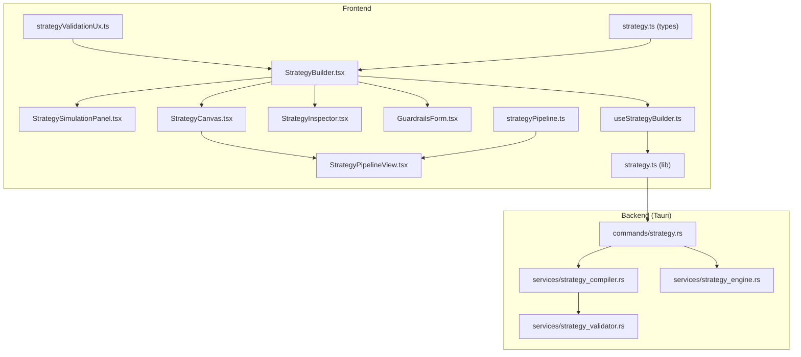
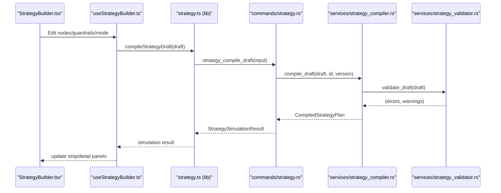
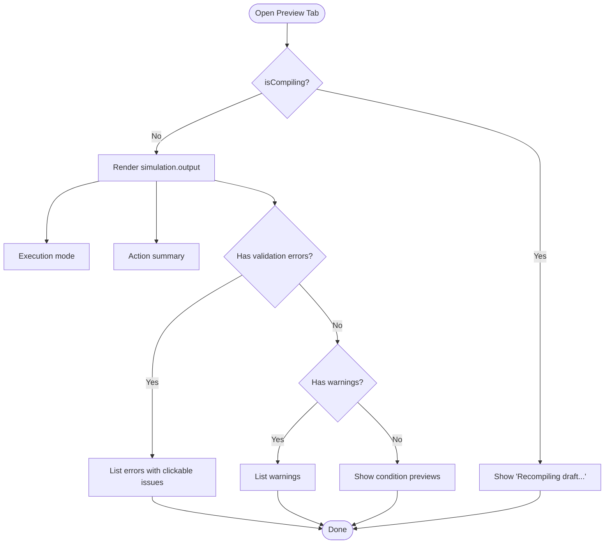
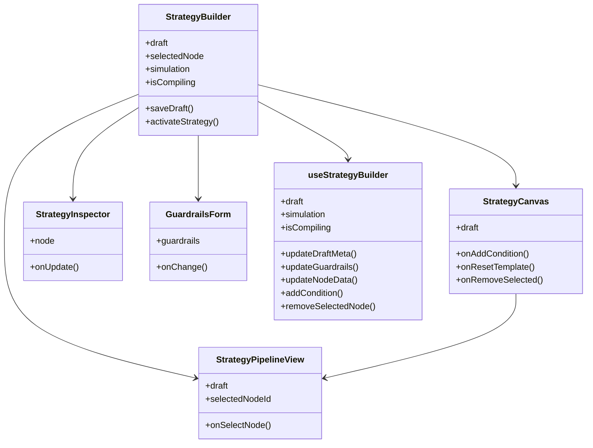
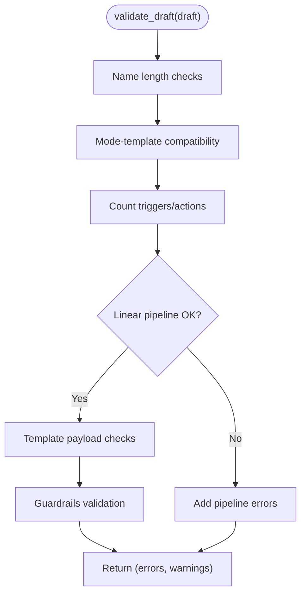
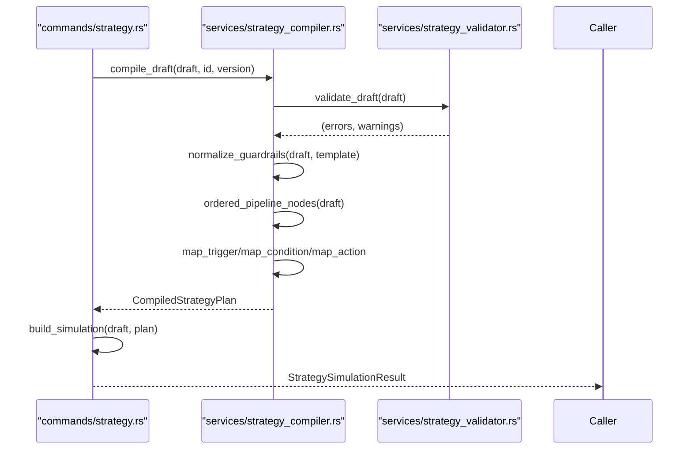
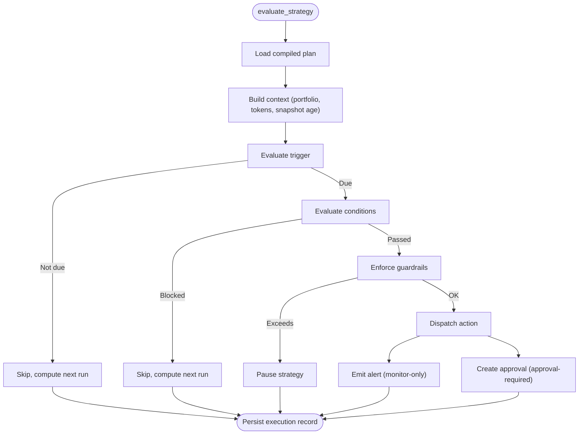
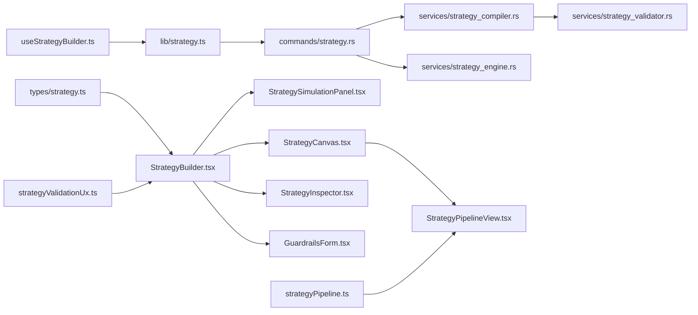

# Strategy Simulation and Testing

<cite>
**Referenced Files in This Document**
- [StrategySimulationPanel.tsx](file://src/components/strategy/StrategySimulationPanel.tsx)
- [StrategyBuilder.tsx](file://src/components/strategy/StrategyBuilder.tsx)
- [StrategyCanvas.tsx](file://src/components/strategy/StrategyCanvas.tsx)
- [StrategyPipelineView.tsx](file://src/components/strategy/StrategyPipelineView.tsx)
- [StrategyInspector.tsx](file://src/components/strategy/StrategyInspector.tsx)
- [GuardrailsForm.tsx](file://src/components/strategy/GuardrailsForm.tsx)
- [useStrategyBuilder.ts](file://src/hooks/useStrategyBuilder.ts)
- [strategy.ts](file://src/lib/strategy.ts)
- [strategyPipeline.ts](file://src/lib/strategyPipeline.ts)
- [strategyValidationUx.ts](file://src/lib/strategyValidationUx.ts)
- [strategy.ts](file://src/types/strategy.ts)
- [strategy_compiler.rs](file://src-tauri/src/services/strategy_compiler.rs)
- [strategy_engine.rs](file://src-tauri/src/services/strategy_engine.rs)
- [strategy_validator.rs](file://src-tauri/src/services/strategy_validator.rs)
- [strategy.rs](file://src-tauri/src/commands/strategy.rs)
</cite>

## Table of Contents
1. [Introduction](#introduction)
2. [Project Structure](#project-structure)
3. [Core Components](#core-components)
4. [Architecture Overview](#architecture-overview)
5. [Detailed Component Analysis](#detailed-component-analysis)
6. [Dependency Analysis](#dependency-analysis)
7. [Performance Considerations](#performance-considerations)
8. [Troubleshooting Guide](#troubleshooting-guide)
9. [Conclusion](#conclusion)
10. [Appendices](#appendices)

## Introduction
This document explains the Strategy Simulation and Testing system that powers visual strategy authoring, real-time compilation, validation, and execution preview. It covers:
- The simulation panel interface with compact strip view and detailed preview mode
- Backtesting-like evaluation via compile-time previews and runtime execution engine
- Validation system ensuring logical correctness, parameter feasibility, and guardrails compliance
- Compilation pipeline from visual strategies to executable plans
- Visualization of simulation outcomes and execution previews
- Preview of compiled strategy output and error reporting
- Relationship between simulation results and actual execution performance
- Practical testing scenarios and interpretation guidance
- Troubleshooting and performance optimization tips

## Project Structure
The system spans React frontend components and a Tauri backend service:
- Frontend strategy builder and inspectors
- Utilities for pipeline ordering, UX navigation, and types
- Backend Rust services for validation, compilation, and runtime evaluation
- IPC commands bridging frontend and backend

**Diagram sources**
- [StrategyBuilder.tsx:25-286](file://src/components/strategy/StrategyBuilder.tsx#L25-L286)
- [StrategySimulationPanel.tsx:1-160](file://src/components/strategy/StrategySimulationPanel.tsx#L1-L160)
- [StrategyCanvas.tsx:1-109](file://src/components/strategy/StrategyCanvas.tsx#L1-L109)
- [StrategyPipelineView.tsx:1-107](file://src/components/strategy/StrategyPipelineView.tsx#L1-L107)
- [StrategyInspector.tsx:1-459](file://src/components/strategy/StrategyInspector.tsx#L1-L459)
- [GuardrailsForm.tsx:1-189](file://src/components/strategy/GuardrailsForm.tsx#L1-L189)
- [useStrategyBuilder.ts:1-248](file://src/hooks/useStrategyBuilder.ts#L1-L248)
- [strategyValidationUx.ts:1-67](file://src/lib/strategyValidationUx.ts#L1-L67)
- [strategyPipeline.ts:1-116](file://src/lib/strategyPipeline.ts#L1-L116)
- [strategy.ts:1-218](file://src/lib/strategy.ts#L1-L218)
- [strategy.ts:1-258](file://src/types/strategy.ts#L1-L258)
- [strategy.rs:1-309](file://src-tauri/src/commands/strategy.rs#L1-L309)
- [strategy_validator.rs:1-457](file://src-tauri/src/services/strategy_validator.rs#L1-L457)
- [strategy_compiler.rs:1-369](file://src-tauri/src/services/strategy_compiler.rs#L1-L369)
- [strategy_engine.rs:1-726](file://src-tauri/src/services/strategy_engine.rs#L1-L726)

**Section sources**
- [StrategyBuilder.tsx:25-286](file://src/components/strategy/StrategyBuilder.tsx#L25-L286)
- [strategy.ts:1-218](file://src/lib/strategy.ts#L1-L218)
- [strategy.ts:1-258](file://src/types/strategy.ts#L1-L258)
- [strategy.rs:1-309](file://src-tauri/src/commands/strategy.rs#L1-L309)
- [strategy_compiler.rs:1-369](file://src-tauri/src/services/strategy_compiler.rs#L1-L369)
- [strategy_engine.rs:1-726](file://src-tauri/src/services/strategy_engine.rs#L1-L726)
- [strategy_validator.rs:1-457](file://src-tauri/src/services/strategy_validator.rs#L1-L457)

## Core Components
- StrategySimulationStrip: Compact status bar summarizing validation state and linking to full preview
- StrategySimulationDetail: Detailed compile output, execution mode, action summary, validation errors/warnings, and condition previews
- StrategyBuilder: Orchestrates editing, validation, saving, and activation; integrates with simulation panel
- StrategyCanvas + StrategyPipelineView: Visual pipeline rendering and selection
- StrategyInspector: Node editor for triggers, conditions, and actions
- GuardrailsForm: Safety controls applied at runtime
- useStrategyBuilder: Hook managing draft lifecycle, auto-compilation, and persistence
- strategy.ts (lib): Frontend IPC bindings to Rust backend
- strategy.ts (types): Shared TypeScript types mirroring Rust structures
- strategy_compiler.rs: Compiles StrategyDraft into CompiledStrategyPlan and normalizes guardrails
- strategy_validator.rs: Structural and semantic validation (graphs, templates, guardrails)
- strategy_engine.rs: Runtime evaluation of compiled plans against live portfolio and conditions
- strategy.rs (commands): IPC commands for compile, create/update, and history retrieval

**Section sources**
- [StrategySimulationPanel.tsx:1-160](file://src/components/strategy/StrategySimulationPanel.tsx#L1-L160)
- [StrategyBuilder.tsx:25-286](file://src/components/strategy/StrategyBuilder.tsx#L25-L286)
- [StrategyCanvas.tsx:1-109](file://src/components/strategy/StrategyCanvas.tsx#L1-L109)
- [StrategyPipelineView.tsx:1-107](file://src/components/strategy/StrategyPipelineView.tsx#L1-L107)
- [StrategyInspector.tsx:1-459](file://src/components/strategy/StrategyInspector.tsx#L1-L459)
- [GuardrailsForm.tsx:1-189](file://src/components/strategy/GuardrailsForm.tsx#L1-L189)
- [useStrategyBuilder.ts:1-248](file://src/hooks/useStrategyBuilder.ts#L1-L248)
- [strategy.ts:1-218](file://src/lib/strategy.ts#L1-L218)
- [strategy.ts:1-258](file://src/types/strategy.ts#L1-L258)
- [strategy_compiler.rs:1-369](file://src-tauri/src/services/strategy_compiler.rs#L1-L369)
- [strategy_validator.rs:1-457](file://src-tauri/src/services/strategy_validator.rs#L1-L457)
- [strategy_engine.rs:1-726](file://src-tauri/src/services/strategy_engine.rs#L1-L726)
- [strategy.rs:1-309](file://src-tauri/src/commands/strategy.rs#L1-L309)

## Architecture Overview
The system follows a front-to-back architecture:
- Frontend renders the strategy builder and inspectors
- Auto-compilation triggers on edits; results appear in the simulation panel
- Backend validates and compiles the strategy draft into a plan
- Runtime engine evaluates the plan periodically and emits events or approvals

**Diagram sources**
- [StrategyBuilder.tsx:25-286](file://src/components/strategy/StrategyBuilder.tsx#L25-L286)
- [useStrategyBuilder.ts:99-112](file://src/hooks/useStrategyBuilder.ts#L99-L112)
- [strategy.ts:174-178](file://src/lib/strategy.ts#L174-L178)
- [strategy.rs:216-227](file://src-tauri/src/commands/strategy.rs#L216-L227)
- [strategy_compiler.rs:185-292](file://src-tauri/src/services/strategy_compiler.rs#L185-L292)
- [strategy_validator.rs:13-106](file://src-tauri/src/services/strategy_validator.rs#L13-L106)

## Detailed Component Analysis

### Simulation Panel: Strip and Detail Views
- Strip view displays validation status, warnings count, and a quick link to full preview
- Detail view shows execution mode, action summary, validation errors/warnings, and condition previews
- Errors and warnings are mapped from backend validation issues; warnings are surfaced when present

**Diagram sources**
- [StrategySimulationPanel.tsx:67-159](file://src/components/strategy/StrategySimulationPanel.tsx#L67-L159)

**Section sources**
- [StrategySimulationPanel.tsx:1-160](file://src/components/strategy/StrategySimulationPanel.tsx#L1-L160)

### Strategy Builder and Canvas Pipeline
- StrategyBuilder orchestrates editing, validation, saving, and activation
- StrategyCanvas hosts the pipeline view and template controls
- StrategyPipelineView renders nodes in order and highlights selection
- StrategyInspector edits node-specific parameters and surfaces validation issues
- GuardrailsForm manages safety thresholds and chain allowlists

**Diagram sources**
- [StrategyBuilder.tsx:25-286](file://src/components/strategy/StrategyBuilder.tsx#L25-L286)
- [StrategyCanvas.tsx:1-109](file://src/components/strategy/StrategyCanvas.tsx#L1-L109)
- [StrategyPipelineView.tsx:1-107](file://src/components/strategy/StrategyPipelineView.tsx#L1-L107)
- [StrategyInspector.tsx:1-459](file://src/components/strategy/StrategyInspector.tsx#L1-L459)
- [GuardrailsForm.tsx:1-189](file://src/components/strategy/GuardrailsForm.tsx#L1-L189)
- [useStrategyBuilder.ts:37-247](file://src/hooks/useStrategyBuilder.ts#L37-L247)

**Section sources**
- [StrategyBuilder.tsx:25-286](file://src/components/strategy/StrategyBuilder.tsx#L25-L286)
- [StrategyCanvas.tsx:1-109](file://src/components/strategy/StrategyCanvas.tsx#L1-L109)
- [StrategyPipelineView.tsx:1-107](file://src/components/strategy/StrategyPipelineView.tsx#L1-L107)
- [StrategyInspector.tsx:1-459](file://src/components/strategy/StrategyInspector.tsx#L1-L459)
- [GuardrailsForm.tsx:1-189](file://src/components/strategy/GuardrailsForm.tsx#L1-L189)
- [useStrategyBuilder.ts:1-248](file://src/hooks/useStrategyBuilder.ts#L1-L248)

### Validation System
- Structural validation ensures exactly one trigger and one action, linear pipeline, no cycles, and correct edge fan-in/out
- Template-specific validation enforces correct trigger/action pairs per template
- Guardrails validation enforces positive caps and reasonable ranges
- Validation issues include machine-readable codes, severity, messages, and field paths for targeted UX navigation

**Diagram sources**
- [strategy_validator.rs:13-106](file://src-tauri/src/services/strategy_validator.rs#L13-L106)
- [strategy_validator.rs:119-223](file://src-tauri/src/services/strategy_validator.rs#L119-L223)
- [strategy_validator.rs:225-292](file://src-tauri/src/services/strategy_validator.rs#L225-L292)
- [strategy_validator.rs:294-340](file://src-tauri/src/services/strategy_validator.rs#L294-L340)

**Section sources**
- [strategy_validator.rs:1-457](file://src-tauri/src/services/strategy_validator.rs#L1-L457)

### Compilation Pipeline
- Draft normalization and guardrails defaults
- Linear pipeline extraction enforced
- Node mapping from DraftNodeData to CompiledStrategyTrigger/Condition/Action
- Plan assembly with validation errors and warnings
- Preview generation for UI display

**Diagram sources**
- [strategy.rs:98-117](file://src-tauri/src/commands/strategy.rs#L98-L117)
- [strategy_compiler.rs:185-292](file://src-tauri/src/services/strategy_compiler.rs#L185-L292)
- [strategy_validator.rs:13-106](file://src-tauri/src/services/strategy_validator.rs#L13-L106)

**Section sources**
- [strategy.rs:1-309](file://src-tauri/src/commands/strategy.rs#L1-L309)
- [strategy_compiler.rs:1-369](file://src-tauri/src/services/strategy_compiler.rs#L1-L369)

### Runtime Evaluation and Execution Preview
- Engine loads compiled plan and context (portfolio, tokens, snapshots)
- Trigger evaluation: time-based schedule or drift/threshold checks
- Condition evaluation: portfolio floor, gas, slippage, wallet availability, cooldown, drift minimum
- Guardrails enforcement: per-trade cap, allowed chains, min portfolio
- Action dispatch: alerts, DCA buys, rebalances; monitor-only mode emits notifications
- Approval creation for execution when required; otherwise emits alerts

**Diagram sources**
- [strategy_engine.rs:343-725](file://src-tauri/src/services/strategy_engine.rs#L343-L725)

**Section sources**
- [strategy_engine.rs:1-726](file://src-tauri/src/services/strategy_engine.rs#L1-L726)

### Preview System and Error Reporting
- Frontend builds a simulation result from the compiled plan, including execution mode and action summary
- Validation issues are mapped to UI tabs and node-specific contexts for quick navigation
- The preview tab surfaces condition previews with pass/fail indicators and messages

**Section sources**
- [strategy.rs:98-117](file://src-tauri/src/commands/strategy.rs#L98-L117)
- [strategyValidationUx.ts:1-67](file://src/lib/strategyValidationUx.ts#L1-L67)
- [StrategySimulationPanel.tsx:67-159](file://src/components/strategy/StrategySimulationPanel.tsx#L67-L159)

## Dependency Analysis
- Frontend depends on shared types and IPC bindings
- IPC commands depend on compiler and validator services
- Compiler depends on validator and normalization logic
- Engine depends on compiled plan and runtime context

**Diagram sources**
- [strategy.ts:1-258](file://src/types/strategy.ts#L1-L258)
- [strategy.ts:1-218](file://src/lib/strategy.ts#L1-L218)
- [strategy.rs:1-309](file://src-tauri/src/commands/strategy.rs#L1-L309)
- [strategy_compiler.rs:1-369](file://src-tauri/src/services/strategy_compiler.rs#L1-L369)
- [strategy_validator.rs:1-457](file://src-tauri/src/services/strategy_validator.rs#L1-L457)
- [strategy_engine.rs:1-726](file://src-tauri/src/services/strategy_engine.rs#L1-L726)
- [StrategyBuilder.tsx:1-286](file://src/components/strategy/StrategyBuilder.tsx#L1-L286)
- [StrategySimulationPanel.tsx:1-160](file://src/components/strategy/StrategySimulationPanel.tsx#L1-L160)
- [StrategyCanvas.tsx:1-109](file://src/components/strategy/StrategyCanvas.tsx#L1-L109)
- [StrategyPipelineView.tsx:1-107](file://src/components/strategy/StrategyPipelineView.tsx#L1-L107)
- [StrategyInspector.tsx:1-459](file://src/components/strategy/StrategyInspector.tsx#L1-L459)
- [GuardrailsForm.tsx:1-189](file://src/components/strategy/GuardrailsForm.tsx#L1-L189)
- [useStrategyBuilder.ts:1-248](file://src/hooks/useStrategyBuilder.ts#L1-L248)
- [strategyValidationUx.ts:1-67](file://src/lib/strategyValidationUx.ts#L1-L67)
- [strategyPipeline.ts:1-116](file://src/lib/strategyPipeline.ts#L1-L116)

**Section sources**
- [strategy.ts:1-218](file://src/lib/strategy.ts#L1-L218)
- [strategy.rs:1-309](file://src-tauri/src/commands/strategy.rs#L1-L309)
- [strategy_compiler.rs:1-369](file://src-tauri/src/services/strategy_compiler.rs#L1-L369)
- [strategy_engine.rs:1-726](file://src-tauri/src/services/strategy_engine.rs#L1-L726)

## Performance Considerations
- Auto-compilation debounce: edits trigger a delayed compile to avoid excessive re-renders
- Lightweight preview rendering: condition previews and summaries computed from compiled plan
- Runtime evaluation short-circuits on trigger miss and condition block
- Guardrails checks early-exit to prevent unnecessary downstream work
- Snapshot freshness checks reduce stale-data impact on drift evaluations

[No sources needed since this section provides general guidance]

## Troubleshooting Guide
Common issues and resolutions:
- Validation errors
  - Fix structural issues: ensure exactly one trigger and one action, linear chain with no cycles
  - Correct template mismatch: align trigger and action types per template
  - Guardrail violations: adjust max per trade, daily notional, slippage, gas, or chain allowlist
- Warnings
  - Many conditions: simplify the chain for readability and maintainability
  - Alert-only with time trigger: consider portfolio-dependent thresholds for richer checks
- Simulation failures
  - Review validation errors and warnings in the preview tab
  - Use issue navigation to jump to affected nodes or safety settings
- Execution discrepancies
  - Confirm runtime guardrails and chain allowlists
  - Verify portfolio snapshot freshness and token balances
  - Check approval flow for approval-required strategies

**Section sources**
- [strategy_validator.rs:1-457](file://src-tauri/src/services/strategy_validator.rs#L1-L457)
- [StrategySimulationPanel.tsx:67-159](file://src/components/strategy/StrategySimulationPanel.tsx#L67-L159)
- [strategyEngine.rs:120-159](file://src-tauri/src/services/strategy_engine.rs#L120-L159)

## Conclusion
The Strategy Simulation and Testing system combines a powerful visual authoring experience with robust backend validation and compilation. The simulation panel provides immediate feedback, while runtime evaluation ensures safe and predictable execution aligned with guardrails. Together, they enable confident strategy development, testing, and deployment.

[No sources needed since this section summarizes without analyzing specific files]

## Appendices

### Example Strategy Testing Scenarios
- DCA Buy with drift threshold
  - Purpose: Buy a fixed amount weekly when drift exceeds threshold
  - Validate: Ensure time interval trigger and DCA action; confirm drift threshold and target allocations
  - Preview: Review execution mode, action summary, and condition previews
- Rebalance to target
  - Purpose: Rebalance when observed drift exceeds threshold
  - Validate: Confirm drift threshold trigger and rebalance action; ensure target allocations and max execution USD
  - Preview: Check condition previews and expected action summary
- Alert-only
  - Purpose: Notify when portfolio drops below a threshold
  - Validate: Ensure threshold trigger and alert-only action; consider adding drift checks for richer signals
  - Preview: Confirm execution mode and action summary

Interpretation of simulation results:
- Valid: Strategy compiles successfully; proceed to activation
- Needs fixes: Address validation errors; warnings indicate potential improvements
- Condition previews: Understand pass/fail outcomes for each guardrail and condition

**Section sources**
- [StrategyBuilder.tsx:25-286](file://src/components/strategy/StrategyBuilder.tsx#L25-L286)
- [StrategySimulationPanel.tsx:67-159](file://src/components/strategy/StrategySimulationPanel.tsx#L67-L159)
- [strategy_compiler.rs:185-292](file://src-tauri/src/services/strategy_compiler.rs#L185-L292)