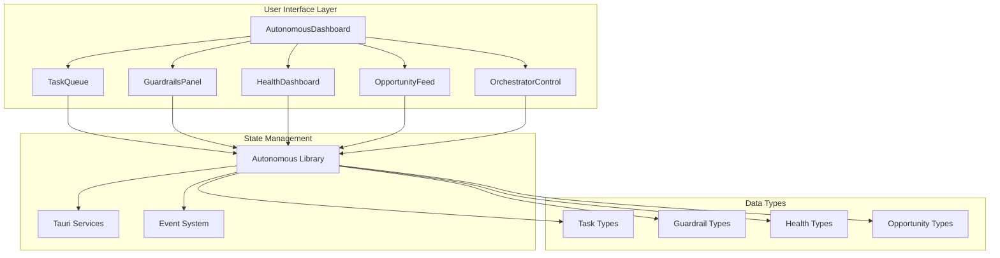
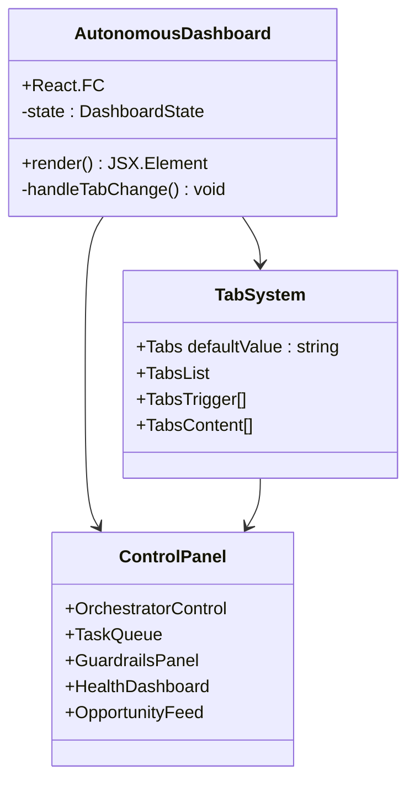
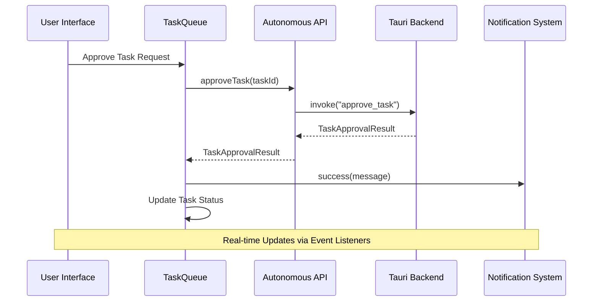
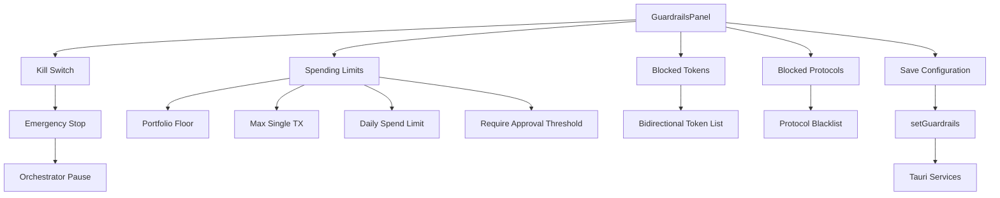
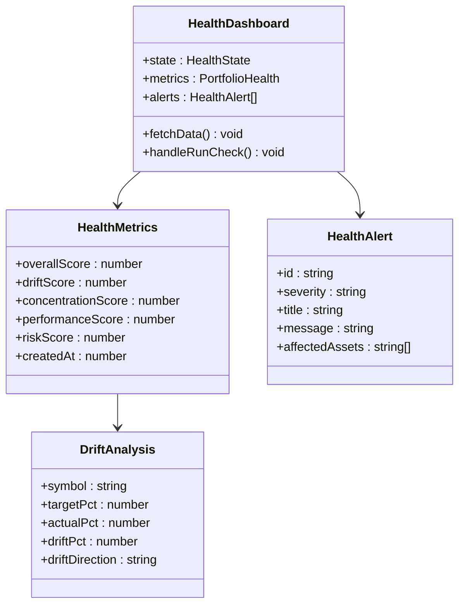
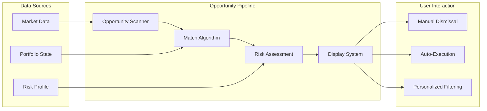
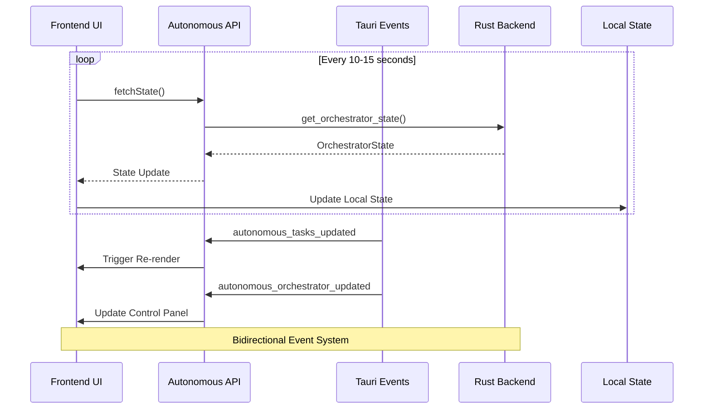
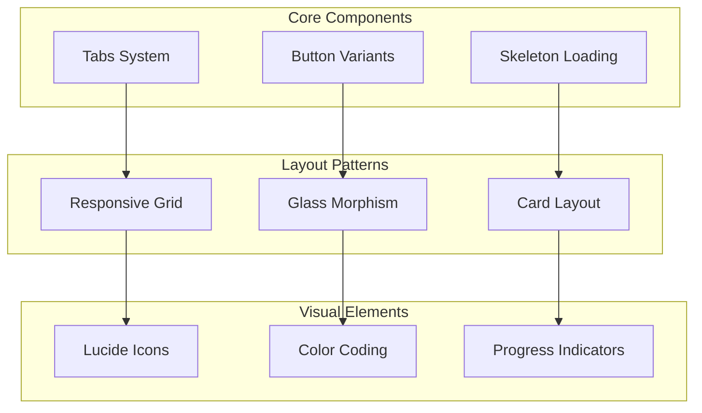
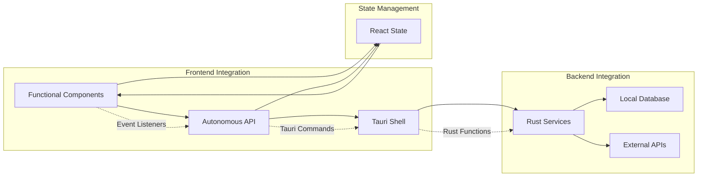

# Autonomous Orchestration UI Components

<cite>
**Referenced Files in This Document**
- [AutonomousDashboard.tsx](file://src/components/autonomous/AutonomousDashboard.tsx)
- [OrchestratorControl.tsx](file://src/components/autonomous/OrchestratorControl.tsx)
- [GuardrailsPanel.tsx](file://src/components/autonomous/GuardrailsPanel.tsx)
- [HealthDashboard.tsx](file://src/components/autonomous/HealthDashboard.tsx)
- [TaskQueue.tsx](file://src/components/autonomous/TaskQueue.tsx)
- [OpportunityFeed.tsx](file://src/components/autonomous/OpportunityFeed.tsx)
- [autonomous.ts](file://src/lib/autonomous.ts)
- [autonomous.ts](file://src/types/autonomous.ts)
- [routes.tsx](file://src/routes.tsx)
- [App.tsx](file://src/App.tsx)
- [tabs.tsx](file://src/components/ui/tabs.tsx)
- [button.tsx](file://src/components/ui/button.tsx)
- [Skeleton.tsx](file://src/components/shared/Skeleton.tsx)
</cite>

## Table of Contents
1. [Introduction](#introduction)
2. [System Architecture](#system-architecture)
3. [Core Dashboard Component](#core-dashboard-component)
4. [Task Management System](#task-management-system)
5. [Safety and Risk Controls](#safety-and-risk-controls)
6. [Health Monitoring](#health-monitoring)
7. [Opportunity Discovery](#opportunity-discovery)
8. [Real-time Communication Layer](#real-time-communication-layer)
9. [UI Design System](#ui-design-system)
10. [Integration Patterns](#integration-patterns)
11. [Performance Considerations](#performance-considerations)
12. [Troubleshooting Guide](#troubleshooting-guide)
13. [Conclusion](#conclusion)

## Introduction

The Shadow Protocol's Autonomous Orchestration UI Components represent a sophisticated system for managing AI-driven portfolio automation. This comprehensive dashboard enables users to monitor, control, and optimize their autonomous trading agents while maintaining strict safety controls and real-time oversight.

The system operates as a multi-tab interface that combines task management, safety controls, health monitoring, and opportunity discovery into a cohesive user experience. Built with React and TypeScript, it leverages Tauri for native system integration and provides both web and desktop deployment capabilities.

## System Architecture

The autonomous orchestration system follows a modular architecture pattern with clear separation of concerns:

**Diagram sources**
- [AutonomousDashboard.tsx:1-84](file://src/components/autonomous/AutonomousDashboard.tsx#L1-L84)
- [autonomous.ts:1-513](file://src/lib/autonomous.ts#L1-L513)

The architecture implements several key design patterns:

- **Observer Pattern**: Real-time event listeners for state updates
- **Command Pattern**: Orchestrator control operations
- **Strategy Pattern**: Configurable guardrail enforcement
- **Facade Pattern**: Unified API abstraction layer

**Section sources**
- [AutonomousDashboard.tsx:9-84](file://src/components/autonomous/AutonomousDashboard.tsx#L9-L84)
- [autonomous.ts:465-513](file://src/lib/autonomous.ts#L465-L513)

## Core Dashboard Component

The AutonomousDashboard serves as the central hub for all autonomous orchestration activities, implementing a sophisticated tabbed interface that organizes functionality into logical sections.

**Diagram sources**
- [AutonomousDashboard.tsx:9-84](file://src/components/autonomous/AutonomousDashboard.tsx#L9-L84)

The dashboard implements a responsive grid layout that adapts to different screen sizes, featuring:

- **Main Content Area**: Tabbed interface for different orchestration views
- **Sidebar Panel**: Persistent control panel for orchestrator management
- **Glass Morphism Design**: Modern UI aesthetic with transparency effects

**Section sources**
- [AutonomousDashboard.tsx:19-80](file://src/components/autonomous/AutonomousDashboard.tsx#L19-L80)

## Task Management System

The Task Management System provides comprehensive oversight of AI-generated actions through an intelligent queue interface that balances automation with human control.

**Diagram sources**
- [TaskQueue.tsx:75-92](file://src/components/autonomous/TaskQueue.tsx#L75-L92)
- [autonomous.ts:102-123](file://src/lib/autonomous.ts#L102-L123)

Key features include:

- **Priority-Based Sorting**: Tasks categorized as low, medium, high, or urgent
- **Approval Workflow**: Two-stage process for task execution
- **Real-time Updates**: WebSocket-like event system for live state synchronization
- **Expiry Management**: Automatic task expiration tracking

**Section sources**
- [TaskQueue.tsx:33-133](file://src/components/autonomous/TaskQueue.tsx#L33-L133)
- [autonomous.ts:79-146](file://src/lib/autonomous.ts#L79-L146)

## Safety and Risk Controls

The GuardrailsPanel implements comprehensive safety mechanisms that provide granular control over autonomous trading activities while maintaining flexibility for different risk profiles.

**Diagram sources**
- [GuardrailsPanel.tsx:19-327](file://src/components/autonomous/GuardrailsPanel.tsx#L19-L327)

The safety system implements multiple layers of protection:

- **Emergency Kill Switch**: Immediate pause of all automated actions
- **Spending Controls**: Configurable limits for portfolio exposure
- **Asset Restrictions**: Blacklist management for tokens and protocols
- **Approval Workflows**: Threshold-based authorization requirements

**Section sources**
- [GuardrailsPanel.tsx:19-327](file://src/components/autonomous/GuardrailsPanel.tsx#L19-L327)
- [autonomous.ts:165-253](file://src/lib/autonomous.ts#L165-L253)

## Health Monitoring

The HealthDashboard provides comprehensive portfolio health assessment through AI-powered analytics and real-time monitoring capabilities.

**Diagram sources**
- [HealthDashboard.tsx:26-199](file://src/components/autonomous/HealthDashboard.tsx#L26-L199)

The health monitoring system evaluates portfolio performance across multiple dimensions:

- **Composite Scoring**: Overall health assessment with color-coded indicators
- **Drift Analysis**: Allocation deviation tracking and recommendations
- **Risk Assessment**: Comprehensive risk scoring and mitigation suggestions
- **Alert System**: Real-time notifications for critical portfolio events

**Section sources**
- [HealthDashboard.tsx:26-199](file://src/components/autonomous/HealthDashboard.tsx#L26-L199)
- [autonomous.ts:255-349](file://src/lib/autonomous.ts#L255-L349)

## Opportunity Discovery

The OpportunityFeed component presents AI-generated trading opportunities with detailed analysis and risk assessment, enabling informed decision-making for automated actions.

**Diagram sources**
- [OpportunityFeed.tsx:39-160](file://src/components/autonomous/OpportunityFeed.tsx#L39-L160)

Key features include:

- **Multi-Factor Matching**: AI-powered opportunity correlation with portfolio state
- **Risk Classification**: Low, medium, high, critical risk level categorization
- **Deadline Tracking**: Time-sensitive opportunity management
- **Protocol Integration**: Support for various blockchain protocols and networks

**Section sources**
- [OpportunityFeed.tsx:39-160](file://src/components/autonomous/OpportunityFeed.tsx#L39-L160)
- [autonomous.ts:351-404](file://src/lib/autonomous.ts#L351-L404)

## Real-time Communication Layer

The autonomous system implements a robust real-time communication framework that maintains constant synchronization between the UI and backend services.

**Diagram sources**
- [autonomous.ts:471-510](file://src/lib/autonomous.ts#L471-L510)

The communication layer provides:

- **Event-Driven Architecture**: Real-time updates via Tauri event system
- **Automatic Reconnection**: Graceful handling of connection interruptions
- **State Synchronization**: Consistent UI state across all components
- **Error Resilience**: Comprehensive error handling and recovery mechanisms

**Section sources**
- [autonomous.ts:471-510](file://src/lib/autonomous.ts#L471-L510)

## UI Design System

The autonomous orchestration components leverage a comprehensive design system that ensures consistency and accessibility across all user interactions.

**Diagram sources**
- [tabs.tsx:1-90](file://src/components/ui/tabs.tsx#L1-L90)
- [button.tsx:1-65](file://src/components/ui/button.tsx#L1-L65)
- [Skeleton.tsx:1-15](file://src/components/shared/Skeleton.tsx#L1-L15)

Design system features include:

- **Consistent Typography**: Hierarchical text sizing and weight progression
- **Color Accessibility**: High contrast ratios and semantic color usage
- **Responsive Layouts**: Adaptive grid systems for all screen sizes
- **Interactive Feedback**: Subtle animations and state transitions

**Section sources**
- [tabs.tsx:1-90](file://src/components/ui/tabs.tsx#L1-L90)
- [button.tsx:1-65](file://src/components/ui/button.tsx#L1-L65)
- [Skeleton.tsx:1-15](file://src/components/shared/Skeleton.tsx#L1-L15)

## Integration Patterns

The autonomous orchestration system demonstrates sophisticated integration patterns that bridge frontend UI components with backend services through Tauri.

**Diagram sources**
- [App.tsx:1-49](file://src/App.tsx#L1-L49)
- [routes.tsx:14-32](file://src/routes.tsx#L14-L32)

Integration patterns include:

- **Command Pattern**: Structured API calls through Tauri invoke system
- **Event-Driven Updates**: Real-time state synchronization via event listeners
- **Type Safety**: Comprehensive TypeScript interfaces for all data exchanges
- **Error Boundaries**: Robust error handling across integration points

**Section sources**
- [App.tsx:9-46](file://src/App.tsx#L9-L46)
- [routes.tsx:14-32](file://src/routes.tsx#L14-L32)

## Performance Considerations

The autonomous orchestration system implements several performance optimization strategies to ensure responsive user experience even with complex data processing.

Key performance features include:

- **Efficient State Updates**: Targeted re-renders using React.memo patterns
- **Lazy Loading**: Component-level lazy loading for resource-intensive features
- **Optimized API Calls**: Batch requests and intelligent caching strategies
- **Memory Management**: Proper cleanup of event listeners and timers
- **Network Efficiency**: Debounced API calls and connection pooling

## Troubleshooting Guide

Common issues and their resolutions:

**Connection Issues**
- Verify Tauri runtime availability
- Check event listener registration
- Confirm backend service status

**Performance Problems**
- Monitor API call frequency
- Review component re-render cycles
- Check memory usage patterns

**UI Synchronization**
- Validate event listener cleanup
- Verify state update patterns
- Check for race conditions in async operations

**Data Integrity**
- Implement proper error boundaries
- Validate type safety across API boundaries
- Monitor for data corruption in state management

## Conclusion

The Shadow Protocol's Autonomous Orchestration UI Components represent a mature, production-ready system that successfully balances automation capabilities with user control and safety. The modular architecture, comprehensive safety controls, and real-time monitoring capabilities provide a robust foundation for AI-driven portfolio management.

The system's strength lies in its thoughtful integration of advanced features with intuitive user interfaces, creating a seamless experience for both novice and experienced users. The comprehensive type safety, real-time communication, and extensive customization options position it as a leading solution in the autonomous trading space.

Future enhancements could include expanded visualization capabilities, additional safety mechanisms, and integration with more external services, building upon the solid foundation established in the current implementation.