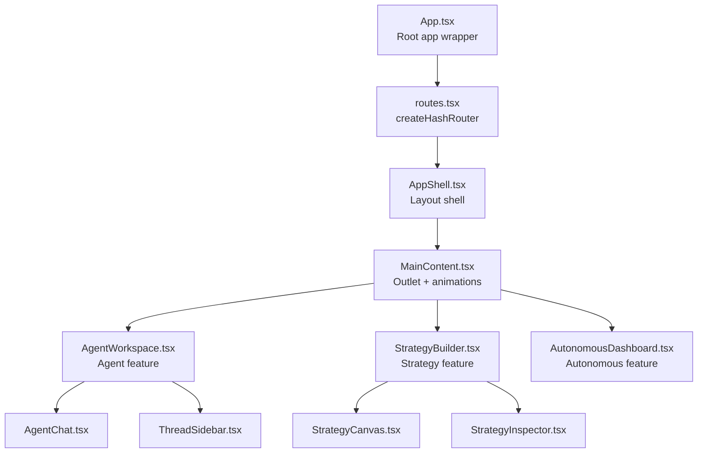
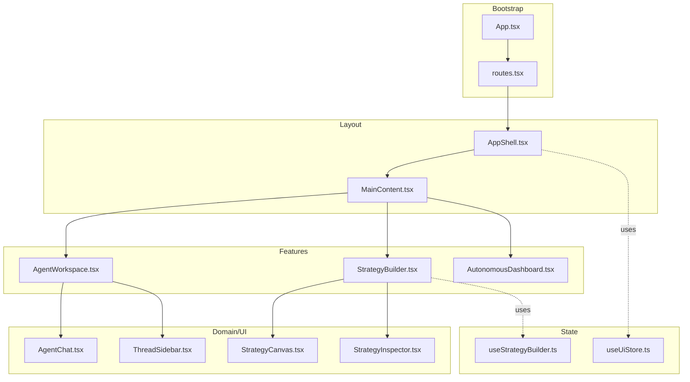
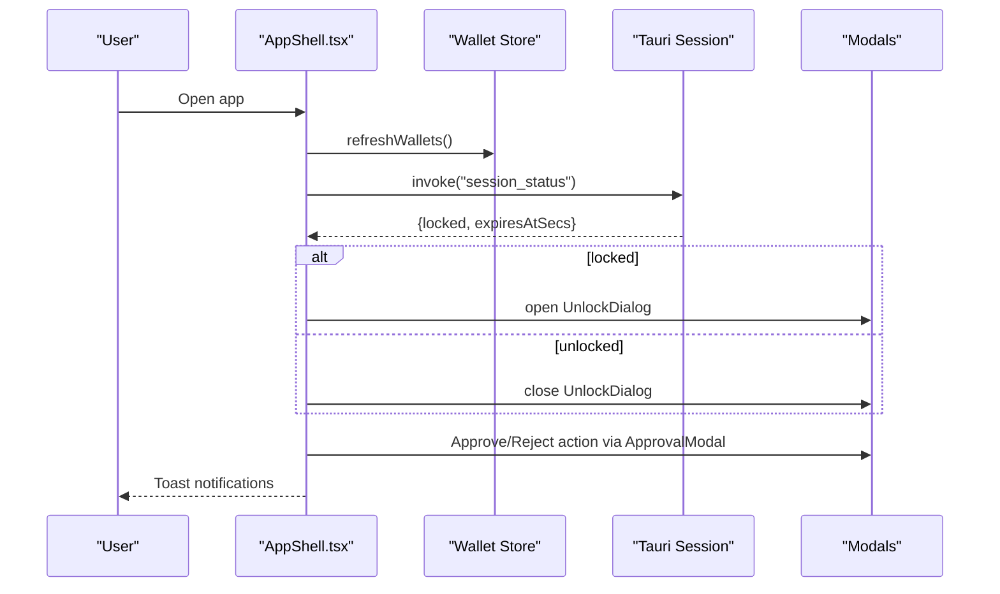
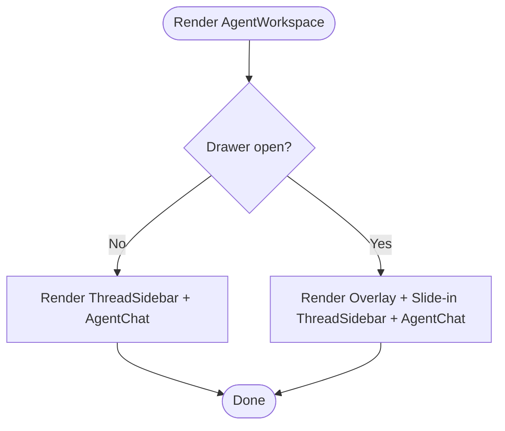
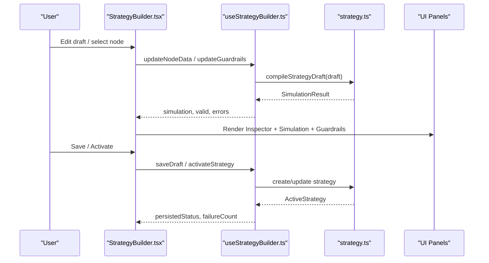
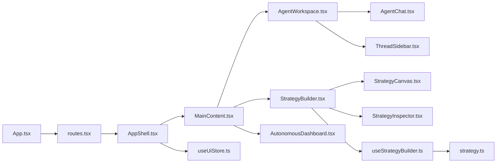

# Component Architecture

<cite>
**Referenced Files in This Document**
- [App.tsx](file://src/App.tsx)
- [routes.tsx](file://src/routes.tsx)
- [AppShell.tsx](file://src/components/layout/AppShell.tsx)
- [MainContent.tsx](file://src/components/layout/MainContent.tsx)
- [AgentWorkspace.tsx](file://src/components/agent/AgentWorkspace.tsx)
- [AgentChat.tsx](file://src/components/agent/AgentChat.tsx)
- [ThreadSidebar.tsx](file://src/components/agent/ThreadSidebar.tsx)
- [StrategyBuilder.tsx](file://src/components/strategy/StrategyBuilder.tsx)
- [StrategyCanvas.tsx](file://src/components/strategy/StrategyCanvas.tsx)
- [StrategyInspector.tsx](file://src/components/strategy/StrategyInspector.tsx)
- [AutonomousDashboard.tsx](file://src/components/autonomous/AutonomousDashboard.tsx)
- [useStrategyBuilder.ts](file://src/hooks/useStrategyBuilder.ts)
- [useUiStore.ts](file://src/store/useUiStore.ts)
- [strategy.ts](file://src/lib/strategy.ts)
- [strategy.ts (types)](file://src/types/strategy.ts)
- [EmptyState.tsx](file://src/components/shared/EmptyState.tsx)
- [button.tsx](file://src/components/ui/button.tsx)
</cite>

## Table of Contents
1. [Introduction](#introduction)
2. [Project Structure](#project-structure)
3. [Core Components](#core-components)
4. [Architecture Overview](#architecture-overview)
5. [Detailed Component Analysis](#detailed-component-analysis)
6. [Dependency Analysis](#dependency-analysis)
7. [Performance Considerations](#performance-considerations)
8. [Troubleshooting Guide](#troubleshooting-guide)
9. [Conclusion](#conclusion)
10. [Appendices](#appendices)

## Introduction
This document explains SHADOW Protocol’s component architecture and composition patterns. It traces the hierarchy from the top-level application shell down to specialized feature components such as AgentWorkspace, StrategyBuilder, and AutonomousDashboard. It documents container/presentational patterns, higher-order components, render props, prop drilling prevention via stores, and state management integration. It also covers lifecycle management, performance optimization, memoization strategies, reusable UI elements, form components, and data display components, along with naming conventions, file organization, and TypeScript interfaces. Finally, it provides practical guidance for extending components, creating wrappers, and enabling cross-component communication while maintaining isolation.

## Project Structure
The application is a React + Vite + Tauri project with a clear feature-based component organization under src/components organized by domain (agent, strategy, autonomous, etc.). Routing is handled via react-router with a hash router and nested routes inside AppShell. Stores use Zustand with persistence for UI state and agent thread state. Hooks encapsulate cross-cutting logic such as strategy building and agent chat.

**Diagram sources**
- [App.tsx:1-49](file://src/App.tsx#L1-L49)
- [routes.tsx:14-32](file://src/routes.tsx#L14-L32)
- [AppShell.tsx:31-277](file://src/components/layout/AppShell.tsx#L31-L277)
- [MainContent.tsx:6-33](file://src/components/layout/MainContent.tsx#L6-L33)
- [AgentWorkspace.tsx:10-65](file://src/components/agent/AgentWorkspace.tsx#L10-L65)
- [StrategyBuilder.tsx:25-287](file://src/components/strategy/StrategyBuilder.tsx#L25-L287)
- [AutonomousDashboard.tsx:9-84](file://src/components/autonomous/AutonomousDashboard.tsx#L9-L84)
- [AgentChat.tsx:10-124](file://src/components/agent/AgentChat.tsx#L10-L124)
- [ThreadSidebar.tsx:117-176](file://src/components/agent/ThreadSidebar.tsx#L117-L176)
- [StrategyCanvas.tsx:19-109](file://src/components/strategy/StrategyCanvas.tsx#L19-L109)
- [StrategyInspector.tsx:41-459](file://src/components/strategy/StrategyInspector.tsx#L41-L459)

**Section sources**
- [App.tsx:1-49](file://src/App.tsx#L1-L49)
- [routes.tsx:14-32](file://src/routes.tsx#L14-L32)

## Core Components
- App: Creates the router and attaches a developer context menu when applicable.
- AppShell: Central layout orchestrator managing theme, wallet/session listeners, command palette, approvals, unlock dialog, and global modals.
- MainContent: Handles page transitions with animation and outlet rendering.
- Feature shells:
  - AgentWorkspace: Hosts AgentChat and ThreadSidebar with responsive drawer behavior.
  - StrategyBuilder: Full-featured strategy authoring with canvas, inspector, and validation UX.
  - AutonomousDashboard: Multi-tab dashboard for tasks, health, opportunities, and guardrails.
- Shared and UI primitives:
  - EmptyState: Reusable empty-state pattern with action handler.
  - Button: Variants and sizes via class variance authority.

**Section sources**
- [App.tsx:9-48](file://src/App.tsx#L9-L48)
- [AppShell.tsx:31-277](file://src/components/layout/AppShell.tsx#L31-L277)
- [MainContent.tsx:6-33](file://src/components/layout/MainContent.tsx#L6-L33)
- [AgentWorkspace.tsx:10-65](file://src/components/agent/AgentWorkspace.tsx#L10-L65)
- [StrategyBuilder.tsx:25-287](file://src/components/strategy/StrategyBuilder.tsx#L25-L287)
- [AutonomousDashboard.tsx:9-84](file://src/components/autonomous/AutonomousDashboard.tsx#L9-L84)
- [EmptyState.tsx:13-36](file://src/components/shared/EmptyState.tsx#L13-L36)
- [button.tsx:41-64](file://src/components/ui/button.tsx#L41-L64)

## Architecture Overview
The architecture follows a layered composition:
- Application bootstrap (App) creates the router.
- AppShell composes global UI, modals, and listeners.
- Routes define nested pages under AppShell.
- Feature components are presentational containers composed of smaller UI and domain components.
- State is managed via small, focused Zustand stores and custom hooks.

**Diagram sources**
- [App.tsx:1-49](file://src/App.tsx#L1-L49)
- [routes.tsx:14-32](file://src/routes.tsx#L14-L32)
- [AppShell.tsx:31-277](file://src/components/layout/AppShell.tsx#L31-L277)
- [MainContent.tsx:6-33](file://src/components/layout/MainContent.tsx#L6-L33)
- [AgentWorkspace.tsx:10-65](file://src/components/agent/AgentWorkspace.tsx#L10-L65)
- [AgentChat.tsx:10-124](file://src/components/agent/AgentChat.tsx#L10-L124)
- [ThreadSidebar.tsx:117-176](file://src/components/agent/ThreadSidebar.tsx#L117-L176)
- [StrategyBuilder.tsx:25-287](file://src/components/strategy/StrategyBuilder.tsx#L25-L287)
- [StrategyCanvas.tsx:19-109](file://src/components/strategy/StrategyCanvas.tsx#L19-L109)
- [StrategyInspector.tsx:41-459](file://src/components/strategy/StrategyInspector.tsx#L41-L459)
- [useUiStore.ts:87-162](file://src/store/useUiStore.ts#L87-L162)
- [useStrategyBuilder.ts:37-247](file://src/hooks/useStrategyBuilder.ts#L37-L247)

## Detailed Component Analysis

### AppShell: Layout Orchestration and Global Modals
AppShell centralizes:
- Theme resolution and persistence.
- Wallet/session synchronization and unlock flow.
- Command palette keyboard shortcut.
- Approval flow and success feedback.
- Global modals: ApprovalModal, UnlockDialog, OllamaSetup, InitializationSequence, ShadowBriefSheet, NewUpdateCard, PanicModal.

Composition pattern highlights:
- Container/presentational: AppShell is a container orchestrating presentational components (modals, bars, dock).
- Higher-order behavior: Keyboard shortcuts, wallet listeners, heartbeat listeners.
- Prop drilling prevention: Uses multiple Zustand stores and hooks to avoid passing props deep.

Lifecycle and effects:
- Resolves theme once per preference change.
- Refreshes wallets on mount.
- Checks Ollama status and selects a model if available.
- Invokes Tauri commands to check session status and manage unlock state.
- Subscribes to wallet sync, transaction confirmation, and alert listeners.

**Diagram sources**
- [AppShell.tsx:70-146](file://src/components/layout/AppShell.tsx#L70-L146)
- [AppShell.tsx:178-198](file://src/components/layout/AppShell.tsx#L178-L198)

**Section sources**
- [AppShell.tsx:31-277](file://src/components/layout/AppShell.tsx#L31-L277)

### AgentWorkspace: Responsive Chat Composition
AgentWorkspace composes:
- ThreadSidebar (desktop) and a slide-in drawer (mobile).
- AgentChat for messaging and streaming.
- Drawer open/close with animated overlay and sidebar.

Composition pattern highlights:
- Conditional rendering and responsive breakpoints.
- Render props: Drawer overlay and sidebar pass onClose callback.
- Local state for drawer visibility.

**Diagram sources**
- [AgentWorkspace.tsx:15-64](file://src/components/agent/AgentWorkspace.tsx#L15-L64)

**Section sources**
- [AgentWorkspace.tsx:10-65](file://src/components/agent/AgentWorkspace.tsx#L10-L65)
- [AgentChat.tsx:10-124](file://src/components/agent/AgentChat.tsx#L10-L124)
- [ThreadSidebar.tsx:117-176](file://src/components/agent/ThreadSidebar.tsx#L117-L176)

### StrategyBuilder: Authoring Pipeline with Validation UX
StrategyBuilder orchestrates:
- useStrategyBuilder hook for draft, selection, simulation, and persistence.
- StrategyCanvas for drag-and-drop editing.
- StrategyInspector for node-specific editing.
- GuardrailsForm and StrategySimulationPanel for safety and preview.
- Tabs for step/safety/preview rails.

Composition pattern highlights:
- Container/presentational: StrategyBuilder is a container; StrategyCanvas, StrategyInspector, GuardrailsForm are presentational.
- Higher-order behavior: Debounced compilation, validation issues navigation, template resets.
- Memoization: useMemo for inspector issues and safety messages.

**Diagram sources**
- [StrategyBuilder.tsx:25-287](file://src/components/strategy/StrategyBuilder.tsx#L25-L287)
- [useStrategyBuilder.ts:37-247](file://src/hooks/useStrategyBuilder.ts#L37-L247)
- [strategy.ts:174-213](file://src/lib/strategy.ts#L174-L213)

**Section sources**
- [StrategyBuilder.tsx:25-287](file://src/components/strategy/StrategyBuilder.tsx#L25-L287)
- [StrategyCanvas.tsx:19-109](file://src/components/strategy/StrategyCanvas.tsx#L19-L109)
- [StrategyInspector.tsx:41-459](file://src/components/strategy/StrategyInspector.tsx#L41-L459)
- [useStrategyBuilder.ts:37-247](file://src/hooks/useStrategyBuilder.ts#L37-L247)
- [strategy.ts:13-218](file://src/lib/strategy.ts#L13-L218)
- [strategy.ts (types):110-258](file://src/types/strategy.ts#L110-L258)

### AutonomousDashboard: Modular Dashboard with Tabs
AutonomousDashboard organizes:
- TaskQueue, HealthDashboard, OpportunityFeed, GuardrailsPanel in a tabbed interface.
- Control sidebar with OrchestratorControl.

Composition pattern highlights:
- Presentational composition via Tabs and tab panels.
- No container hook here; relies on child components for state.

**Section sources**
- [AutonomousDashboard.tsx:9-84](file://src/components/autonomous/AutonomousDashboard.tsx#L9-L84)

### UI Primitives and Shared Components
- EmptyState: Accepts icon, title, description, optional action label and handler. Encourages reuse across empty states.
- Button: Variants and sizes via class variance authority; supports asChild for semantic composition.

**Section sources**
- [EmptyState.tsx:13-36](file://src/components/shared/EmptyState.tsx#L13-L36)
- [button.tsx:41-64](file://src/components/ui/button.tsx#L41-L64)

## Dependency Analysis
Key dependencies and relationships:
- App depends on routes.tsx to create the router.
- AppShell depends on multiple stores and hooks for session, UI, wallet, and agent chat.
- StrategyBuilder depends on useStrategyBuilder and strategy.ts for IPC to Tauri backend.
- AgentWorkspace composes AgentChat and ThreadSidebar; ThreadSidebar depends on useAgentThreadStore.
- UI components depend on shared primitives (EmptyState, Button).

**Diagram sources**
- [App.tsx:1-49](file://src/App.tsx#L1-L49)
- [routes.tsx:14-32](file://src/routes.tsx#L14-L32)
- [AppShell.tsx:31-277](file://src/components/layout/AppShell.tsx#L31-L277)
- [MainContent.tsx:6-33](file://src/components/layout/MainContent.tsx#L6-L33)
- [AgentWorkspace.tsx:10-65](file://src/components/agent/AgentWorkspace.tsx#L10-L65)
- [AgentChat.tsx:10-124](file://src/components/agent/AgentChat.tsx#L10-L124)
- [ThreadSidebar.tsx:117-176](file://src/components/agent/ThreadSidebar.tsx#L117-L176)
- [StrategyBuilder.tsx:25-287](file://src/components/strategy/StrategyBuilder.tsx#L25-L287)
- [StrategyCanvas.tsx:19-109](file://src/components/strategy/StrategyCanvas.tsx#L19-L109)
- [StrategyInspector.tsx:41-459](file://src/components/strategy/StrategyInspector.tsx#L41-L459)
- [useStrategyBuilder.ts:37-247](file://src/hooks/useStrategyBuilder.ts#L37-L247)
- [strategy.ts:174-213](file://src/lib/strategy.ts#L174-L213)
- [useUiStore.ts:87-162](file://src/store/useUiStore.ts#L87-L162)

**Section sources**
- [routes.tsx:14-32](file://src/routes.tsx#L14-L32)
- [useUiStore.ts:87-162](file://src/store/useUiStore.ts#L87-L162)
- [useStrategyBuilder.ts:37-247](file://src/hooks/useStrategyBuilder.ts#L37-L247)
- [strategy.ts:174-213](file://src/lib/strategy.ts#L174-L213)

## Performance Considerations
- Memoization:
  - AppShell resolves theme with useMemo to avoid unnecessary DOM updates.
  - StrategyBuilder computes inspector issues and safety messages with useMemo to prevent re-renders.
  - useStrategyBuilder computes selectedNode with useMemo to avoid recomputation on unrelated updates.
- Debounced compilation:
  - useStrategyBuilder delays compilation to reduce IPC churn during rapid edits.
- Animation boundaries:
  - MainContent wraps Outlet in AnimatePresence/motion to optimize page transitions.
- Rendering boundaries:
  - StrategyCanvas renders a pipeline view only when nodes exist; otherwise shows a concise empty state.
- Event cleanup:
  - App registers and unregisters contextmenu listener; AppShell cleans up wallet listeners and timers.

**Section sources**
- [AppShell.tsx:60-68](file://src/components/layout/AppShell.tsx#L60-L68)
- [StrategyBuilder.tsx:59-70](file://src/components/strategy/StrategyBuilder.tsx#L59-L70)
- [useStrategyBuilder.ts:114-117](file://src/hooks/useStrategyBuilder.ts#L114-L117)
- [MainContent.tsx:19-30](file://src/components/layout/MainContent.tsx#L19-L30)
- [StrategyCanvas.tsx:80-105](file://src/components/strategy/StrategyCanvas.tsx#L80-L105)
- [App.tsx:13-32](file://src/App.tsx#L13-L32)

## Troubleshooting Guide
- Approval flow:
  - AppShell handles both regular approvals and “signal-action” approvals. For signal-action, it clears pending approval and instructs the user to approve via Agent.
- Unlock dialog:
  - AppShell checks session status via Tauri and opens/closes the unlock dialog accordingly.
- Toast notifications:
  - AppShell uses Sonner toasts for approval outcomes and user guidance.
- Ollama setup:
  - AppShell checks Ollama status and opens setup modal if models are missing or outdated.
- Strategy validation:
  - StrategyBuilder displays validation errors and safety messages; clicking issues navigates to the relevant node/tab.

**Section sources**
- [AppShell.tsx:178-198](file://src/components/layout/AppShell.tsx#L178-L198)
- [AppShell.tsx:119-146](file://src/components/layout/AppShell.tsx#L119-L146)
- [AppShell.tsx:226-237](file://src/components/layout/AppShell.tsx#L226-L237)
- [AppShell.tsx:85-110](file://src/components/layout/AppShell.tsx#L85-L110)
- [StrategyBuilder.tsx:72-74](file://src/components/strategy/StrategyBuilder.tsx#L72-L74)

## Conclusion
SHADOW Protocol’s component architecture emphasizes:
- Clear separation of concerns with AppShell as a layout container and feature components as presentational containers.
- Minimal prop drilling through targeted Zustand stores and custom hooks.
- Strong TypeScript interfaces for strategy data and IPC contracts.
- Performance-conscious patterns: memoization, debounced computation, and optimized animations.
- Reusable UI primitives and shared components to maintain consistency and reduce duplication.

## Appendices

### Component Composition Patterns
- Container/presentational:
  - AppShell, StrategyBuilder, AgentWorkspace act as containers; AgentChat, ThreadSidebar, StrategyCanvas, StrategyInspector are presentational.
- Higher-order components:
  - useStrategyBuilder encapsulates strategy authoring logic; AppShell manages global behaviors (keyboard shortcuts, modals).
- Render props:
  - ThreadSidebar accepts onClose to control drawer behavior.

**Section sources**
- [AgentWorkspace.tsx:15-64](file://src/components/agent/AgentWorkspace.tsx#L15-L64)
- [ThreadSidebar.tsx:117-176](file://src/components/agent/ThreadSidebar.tsx#L117-L176)
- [StrategyBuilder.tsx:25-287](file://src/components/strategy/StrategyBuilder.tsx#L25-L287)
- [useStrategyBuilder.ts:37-247](file://src/hooks/useStrategyBuilder.ts#L37-L247)

### State Management Integration
- UI state:
  - useUiStore manages theme, sidebar, command palette, notifications, and pending approvals.
- Strategy authoring:
  - useStrategyBuilder manages draft, selection, simulation, and persistence; integrates with strategy.ts IPC.
- Wallet/session:
  - AppShell subscribes to wallet sync and session listeners; manages unlock flow.

**Section sources**
- [useUiStore.ts:87-162](file://src/store/useUiStore.ts#L87-L162)
- [useStrategyBuilder.ts:37-247](file://src/hooks/useStrategyBuilder.ts#L37-L247)
- [strategy.ts:174-213](file://src/lib/strategy.ts#L174-L213)
- [AppShell.tsx:76-79](file://src/components/layout/AppShell.tsx#L76-L79)

### Naming Conventions and File Organization
- Feature-based folders: agent/, strategy/, autonomous/, portfolio/, etc.
- Component files: PascalCase (e.g., AgentWorkspace.tsx).
- Hooks: useXxx naming (e.g., useStrategyBuilder.ts).
- Stores: useXxxStore.ts (e.g., useUiStore.ts).
- Types: src/types/xxx.ts for domain interfaces.

**Section sources**
- [routes.tsx:3-12](file://src/routes.tsx#L3-L12)

### Extending Components and Maintaining Isolation
- Extend StrategyInspector:
  - Add new node types by expanding the conditional branches and adding new renderField inputs.
- Create custom wrappers:
  - Wrap UI components with Button’s asChild to compose semantics without extra DOM.
- Cross-component communication:
  - Use useUiStore for global signals (e.g., openSignalApproval) and AppShell to orchestrate modals and flows.
  - For strategy-related flows, rely on useStrategyBuilder and strategy.ts IPC to keep UI isolated from backend logic.

**Section sources**
- [StrategyInspector.tsx:114-454](file://src/components/strategy/StrategyInspector.tsx#L114-L454)
- [button.tsx:41-64](file://src/components/ui/button.tsx#L41-L64)
- [useUiStore.ts:144-146](file://src/store/useUiStore.ts#L144-L146)
- [strategy.ts:174-213](file://src/lib/strategy.ts#L174-L213)