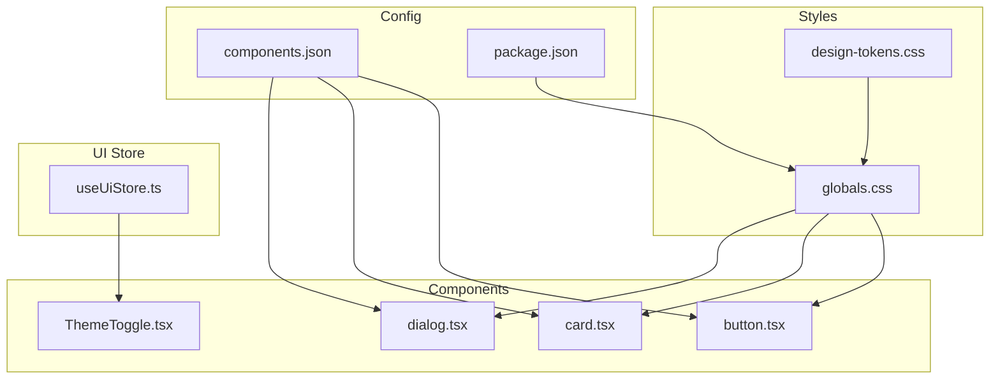
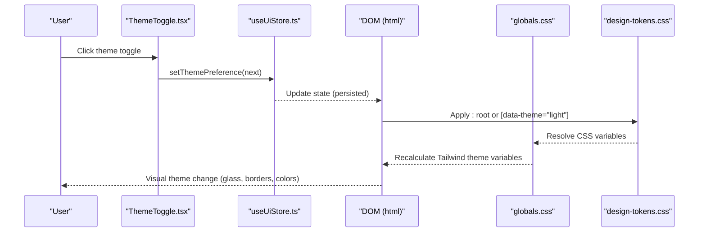
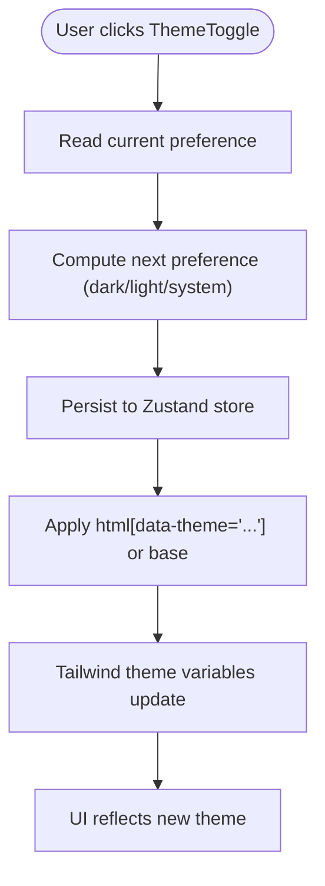
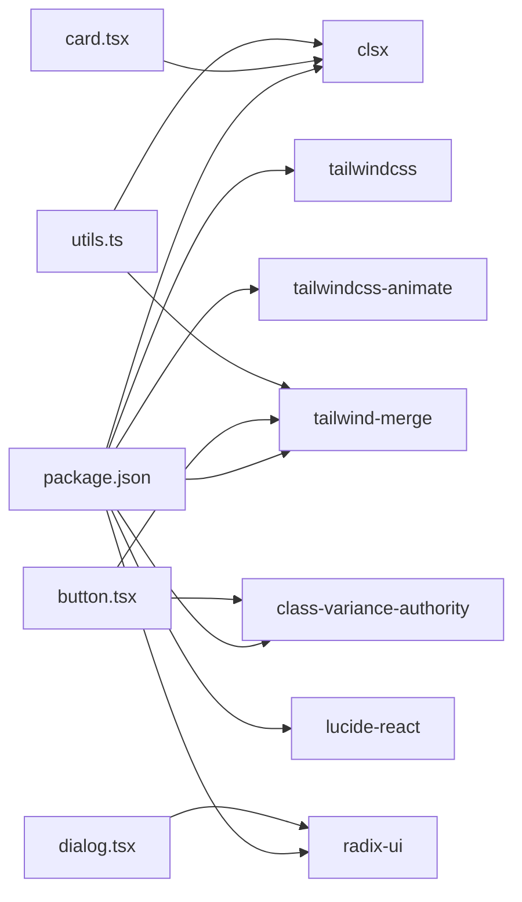

# Design System & Theming

<cite>
**Referenced Files in This Document**
- [design-tokens.css](file://src/styles/design-tokens.css)
- [globals.css](file://src/styles/globals.css)
- [ThemeToggle.tsx](file://src/components/shared/ThemeToggle.tsx)
- [useUiStore.ts](file://src/store/useUiStore.ts)
- [button.tsx](file://src/components/ui/button.tsx)
- [card.tsx](file://src/components/ui/card.tsx)
- [dialog.tsx](file://src/components/ui/dialog.tsx)
- [components.json](file://components.json)
- [package.json](file://package.json)
- [main.tsx](file://src/main.tsx)
- [App.tsx](file://src/App.tsx)
- [routes.tsx](file://src/routes.tsx)
- [utils.ts](file://src/lib/utils.ts)
- [SettingsPage.tsx](file://src/components/settings/SettingsPage.tsx)
</cite>

## Table of Contents
1. [Introduction](#introduction)
2. [Project Structure](#project-structure)
3. [Core Components](#core-components)
4. [Architecture Overview](#architecture-overview)
5. [Detailed Component Analysis](#detailed-component-analysis)
6. [Dependency Analysis](#dependency-analysis)
7. [Performance Considerations](#performance-considerations)
8. [Troubleshooting Guide](#troubleshooting-guide)
9. [Conclusion](#conclusion)
10. [Appendices](#appendices)

## Introduction
This document describes SHADOW Protocol’s design system and theming architecture. It focuses on the glassmorphic aesthetic with backdrop blur and transparent overlays, the design token system (colors, typography, spacing, radii), the dark/light/theme switching mechanism, persistence, and automatic system preference detection. It also documents the shadcn/ui integration, custom component extensions, and styling approach with Tailwind CSS 4, along with atomic design principles, component composition patterns, and design consistency guidelines. Practical examples are included for creating themed components, modifying tokens, and building custom themes, alongside accessibility, responsiveness, and cross-platform considerations.

## Project Structure
The design system is organized around:
- Design tokens and global CSS variables
- Tailwind CSS 4 theme customization and utility plugins
- Zustand-backed UI store for theme preference persistence
- Shadcn/ui-styled components with custom variants and utilities
- Utilities for class merging and component composition

**Diagram sources**
- [design-tokens.css:1-46](file://src/styles/design-tokens.css#L1-L46)
- [globals.css:1-144](file://src/styles/globals.css#L1-L144)
- [useUiStore.ts:1-162](file://src/store/useUiStore.ts#L1-L162)
- [button.tsx:1-65](file://src/components/ui/button.tsx#L1-L65)
- [card.tsx:1-93](file://src/components/ui/card.tsx#L1-L93)
- [dialog.tsx:1-157](file://src/components/ui/dialog.tsx#L1-L157)
- [ThemeToggle.tsx:1-44](file://src/components/shared/ThemeToggle.tsx#L1-L44)
- [components.json:1-22](file://components.json#L1-L22)
- [package.json:1-55](file://package.json#L1-L55)

**Section sources**
- [design-tokens.css:1-46](file://src/styles/design-tokens.css#L1-L46)
- [globals.css:1-144](file://src/styles/globals.css#L1-L144)
- [components.json:1-22](file://components.json#L1-L22)
- [package.json:1-55](file://package.json#L1-L55)

## Core Components
- Design tokens: CSS variables define color palettes, borders, radii, and typography families. Light/dark overrides are applied via a selector on the root element.
- Global CSS: Tailwind theme variables map tokens to Tailwind color/sizing scales; custom utilities include glass panels, noise overlay, subtle grid, and animated scanline/flicker effects.
- Theme store: Zustand manages themePreference with persistence and exposes setters for UI components.
- Theme toggle: A small interactive control cycles through theme preferences and updates the store.
- Shadcn/ui components: Buttons, cards, dialogs integrate with the design system via Tailwind utilities and CSS variables.

Key implementation references:
- Tokens and selectors: [design-tokens.css:1-46](file://src/styles/design-tokens.css#L1-L46)
- Tailwind theme mapping and utilities: [globals.css:5-33](file://src/styles/globals.css#L5-L33), [globals.css:90-144](file://src/styles/globals.css#L90-L144)
- Theme store and persistence: [useUiStore.ts:28-159](file://src/store/useUiStore.ts#L28-L159)
- Theme toggle component: [ThemeToggle.tsx:23-43](file://src/components/shared/ThemeToggle.tsx#L23-L43)
- Shadcn/ui components: [button.tsx:7-39](file://src/components/ui/button.tsx#L7-L39), [card.tsx:5-16](file://src/components/ui/card.tsx#L5-L16), [dialog.tsx:32-80](file://src/components/ui/dialog.tsx#L32-L80)

**Section sources**
- [design-tokens.css:1-46](file://src/styles/design-tokens.css#L1-L46)
- [globals.css:5-33](file://src/styles/globals.css#L5-L33)
- [globals.css:90-144](file://src/styles/globals.css#L90-L144)
- [useUiStore.ts:28-159](file://src/store/useUiStore.ts#L28-L159)
- [ThemeToggle.tsx:23-43](file://src/components/shared/ThemeToggle.tsx#L23-L43)
- [button.tsx:7-39](file://src/components/ui/button.tsx#L7-L39)
- [card.tsx:5-16](file://src/components/ui/card.tsx#L5-L16)
- [dialog.tsx:32-80](file://src/components/ui/dialog.tsx#L32-L80)

## Architecture Overview
The theming pipeline connects design tokens to UI components through Tailwind CSS 4 and a centralized theme store. Theme preference updates propagate to the DOM via CSS variables and Tailwind utilities, enabling immediate visual changes across the app.

**Diagram sources**
- [ThemeToggle.tsx:23-43](file://src/components/shared/ThemeToggle.tsx#L23-L43)
- [useUiStore.ts:100-100](file://src/store/useUiStore.ts#L100-L100)
- [design-tokens.css:26-45](file://src/styles/design-tokens.css#L26-L45)
- [globals.css:5-33](file://src/styles/globals.css#L5-L33)

## Detailed Component Analysis

### Glassmorphic Aesthetic and Utilities
Glass panels, backdrop blur, and transparent overlays are implemented as Tailwind utilities and CSS variables:
- Glass panel utility blends elevated backgrounds with a blurred backdrop and subtle borders.
- Noise overlay adds a low-opacity SVG texture for a subtle surface effect.
- Subtle grid utility provides a light background pattern for depth without distraction.
- Animated utilities (scanline, flicker, quantum caret) enhance motion design while respecting accessibility.

Implementation references:
- Glass panel utility: [globals.css:90-95](file://src/styles/globals.css#L90-L95)
- Noise overlay utility: [globals.css:97-100](file://src/styles/globals.css#L97-L100)
- Subtle grid utility: [globals.css:138-143](file://src/styles/globals.css#L138-L143)
- Animations: [globals.css:107-136](file://src/styles/globals.css#L107-L136)

Practical usage examples:
- Apply glass styling to panels and modals using the utility class.
- Combine noise overlay with glass panels for textured transparency.
- Use subtle grid for content areas requiring minimal visual weight.

**Section sources**
- [globals.css:90-144](file://src/styles/globals.css#L90-L144)

### Design Token System
Token categories and locations:
- Color palettes: primary, secondary, tertiary, accents (purple, blue, green, amber, red), text hues, privacy indicators.
- Borders and surfaces: panel borders, elevated backgrounds.
- Typography: sans and mono family variables.
- Radii: xl and 2xl radius values.
- Glow/shadow: global glow token for soft ambient effects.

Token definitions and overrides:
- Base tokens and dark theme overrides: [design-tokens.css:1-24](file://src/styles/design-tokens.css#L1-L24), [design-tokens.css:26-45](file://src/styles/design-tokens.css#L26-L45)
- Tailwind theme mapping: [globals.css:5-33](file://src/styles/globals.css#L5-L33)

Guidelines:
- Prefer CSS variables for themeable values.
- Keep overrides minimal and scoped to the html selector for light theme.
- Use Tailwind theme variables to align component libraries with tokens.

**Section sources**
- [design-tokens.css:1-46](file://src/styles/design-tokens.css#L1-L46)
- [globals.css:5-33](file://src/styles/globals.css#L5-L33)

### Dark/Light Theme Switching and Persistence
Mechanism overview:
- Theme preference stored in Zustand with persistence middleware.
- Theme toggle cycles among dark, light, and system.
- System preference respected via a selector on the root element.
- Tailwind theme variables react to CSS variable changes.

References:
- Theme store and defaults: [useUiStore.ts:28-85](file://src/store/useUiStore.ts#L28-L85), [useUiStore.ts:148-159](file://src/store/useUiStore.ts#L148-L159)
- Theme toggle logic: [ThemeToggle.tsx:6-28](file://src/components/shared/ThemeToggle.tsx#L6-L28)
- Root selector and light theme overrides: [design-tokens.css:26-45](file://src/styles/design-tokens.css#L26-L45)
- Tailwind theme variables: [globals.css:5-33](file://src/styles/globals.css#L5-L33)

**Diagram sources**
- [ThemeToggle.tsx:23-43](file://src/components/shared/ThemeToggle.tsx#L23-L43)
- [useUiStore.ts:100-100](file://src/store/useUiStore.ts#L100-L100)
- [design-tokens.css:26-45](file://src/styles/design-tokens.css#L26-L45)
- [globals.css:5-33](file://src/styles/globals.css#L5-L33)

**Section sources**
- [useUiStore.ts:28-159](file://src/store/useUiStore.ts#L28-L159)
- [ThemeToggle.tsx:23-43](file://src/components/shared/ThemeToggle.tsx#L23-L43)
- [design-tokens.css:26-45](file://src/styles/design-tokens.css#L26-L45)
- [globals.css:5-33](file://src/styles/globals.css#L5-L33)

### Shadcn/ui Integration and Custom Extensions
Integration approach:
- Components.json configures shadcn/ui for TSX, New York style, and CSS variables.
- Components import Tailwind utilities and CSS variables for consistent visuals.
- Custom variants and sizes extend base component APIs.

References:
- shadcn/ui config: [components.json:1-22](file://components.json#L1-L22)
- Button with variants and sizes: [button.tsx:7-39](file://src/components/ui/button.tsx#L7-L39)
- Card with slots and responsive layout: [card.tsx:5-82](file://src/components/ui/card.tsx#L5-L82)
- Dialog with overlay/content animations: [dialog.tsx:32-80](file://src/components/ui/dialog.tsx#L32-L80)
- Utility class merging: [utils.ts:4-6](file://src/lib/utils.ts#L4-L6)

Best practices:
- Use data-slot attributes for component introspection and styling hooks.
- Leverage CSS variables for theme-aware colors and borders.
- Extend variants thoughtfully to maintain design consistency.

**Section sources**
- [components.json:1-22](file://components.json#L1-L22)
- [button.tsx:7-39](file://src/components/ui/button.tsx#L7-L39)
- [card.tsx:5-82](file://src/components/ui/card.tsx#L5-L82)
- [dialog.tsx:32-80](file://src/components/ui/dialog.tsx#L32-L80)
- [utils.ts:4-6](file://src/lib/utils.ts#L4-L6)

### Atomic Design Principles and Composition Patterns
Atomic design alignment:
- Atoms: Buttons, inputs, labels, badges.
- Molecules: Cards, dialogs, forms.
- Organisms: Dashboards, workspaces, modals.
- Templates: Layout shells and page containers.
- Pages: Feature-specific views.

Composition patterns:
- Use data-slot attributes to target component parts consistently.
- Compose utilities (glass, noise, grid) for layered effects.
- Maintain consistent spacing and radii via CSS variables.

References:
- Button atom: [button.tsx:41-62](file://src/components/ui/button.tsx#L41-L62)
- Card molecule: [card.tsx:5-82](file://src/components/ui/card.tsx#L5-L82)
- Dialog organism: [dialog.tsx:48-80](file://src/components/ui/dialog.tsx#L48-L80)
- Utilities: [globals.css:90-144](file://src/styles/globals.css#L90-L144)

**Section sources**
- [button.tsx:41-62](file://src/components/ui/button.tsx#L41-L62)
- [card.tsx:5-82](file://src/components/ui/card.tsx#L5-L82)
- [dialog.tsx:48-80](file://src/components/ui/dialog.tsx#L48-L80)
- [globals.css:90-144](file://src/styles/globals.css#L90-L144)

### Creating New Themed Components
Steps:
1. Define or reuse design tokens in CSS variables.
2. Map tokens to Tailwind theme variables in the global stylesheet.
3. Build component with Tailwind utilities and CSS variables.
4. Add data-slot attributes for styling hooks.
5. Integrate with the theme store for dynamic behavior.

References:
- Token mapping: [globals.css:5-33](file://src/styles/globals.css#L5-L33)
- Component example: [button.tsx:7-39](file://src/components/ui/button.tsx#L7-L39)
- Utility merging: [utils.ts:4-6](file://src/lib/utils.ts#L4-L6)

**Section sources**
- [globals.css:5-33](file://src/styles/globals.css#L5-L33)
- [button.tsx:7-39](file://src/components/ui/button.tsx#L7-L39)
- [utils.ts:4-6](file://src/lib/utils.ts#L4-L6)

### Modifying Design Tokens
Approach:
- Update base or light theme values in the design tokens file.
- Verify Tailwind theme variables reflect changes.
- Test across components and utilities.

References:
- Base and light overrides: [design-tokens.css:1-46](file://src/styles/design-tokens.css#L1-L46)
- Tailwind mapping: [globals.css:5-33](file://src/styles/globals.css#L5-L33)

**Section sources**
- [design-tokens.css:1-46](file://src/styles/design-tokens.css#L1-L46)
- [globals.css:5-33](file://src/styles/globals.css#L5-L33)

### Implementing Custom Themes
Guidelines:
- Add a new theme preference option in the store and toggle.
- Provide CSS variable overrides for the new theme.
- Update Tailwind theme variables accordingly.
- Ensure accessibility and contrast ratios remain compliant.

References:
- Theme store: [useUiStore.ts:28-159](file://src/store/useUiStore.ts#L28-L159)
- Theme toggle: [ThemeToggle.tsx:6-28](file://src/components/shared/ThemeToggle.tsx#L6-L28)
- CSS variables: [design-tokens.css:1-46](file://src/styles/design-tokens.css#L1-L46)
- Tailwind variables: [globals.css:5-33](file://src/styles/globals.css#L5-L33)

**Section sources**
- [useUiStore.ts:28-159](file://src/store/useUiStore.ts#L28-L159)
- [ThemeToggle.tsx:6-28](file://src/components/shared/ThemeToggle.tsx#L6-L28)
- [design-tokens.css:1-46](file://src/styles/design-tokens.css#L1-L46)
- [globals.css:5-33](file://src/styles/globals.css#L5-L33)

## Dependency Analysis
External dependencies supporting the design system:
- Tailwind CSS 4 and plugin for animations.
- class-variance-authority and clsx/tailwind-merge for variant composition.
- radix-ui for accessible component primitives.
- lucide-react for icons.

References:
- Tailwind and plugins: [package.json:38-49](file://package.json#L38-L49)
- Component composition: [button.tsx:2-5](file://src/components/ui/button.tsx#L2-L5)
- Utilities: [utils.ts:1-7](file://src/lib/utils.ts#L1-L7)

**Diagram sources**
- [package.json:18-53](file://package.json#L18-L53)
- [button.tsx:2-5](file://src/components/ui/button.tsx#L2-L5)
- [card.tsx:3-3](file://src/components/ui/card.tsx#L3-L3)
- [dialog.tsx:2-6](file://src/components/ui/dialog.tsx#L2-L6)
- [utils.ts:1-7](file://src/lib/utils.ts#L1-L7)

**Section sources**
- [package.json:18-53](file://package.json#L18-L53)
- [button.tsx:2-5](file://src/components/ui/button.tsx#L2-L5)
- [card.tsx:3-3](file://src/components/ui/card.tsx#L3-L3)
- [dialog.tsx:2-6](file://src/components/ui/dialog.tsx#L2-L6)
- [utils.ts:1-7](file://src/lib/utils.ts#L1-L7)

## Performance Considerations
- CSS variables minimize cascade churn; keep overrides scoped to the html selector.
- Tailwind utilities compose efficiently; avoid generating excessive variants.
- Backdrop blur and noise overlays are visually rich but can impact performance on lower-end devices; use selectively.
- Prefer CSS transitions over heavy JavaScript animations for theme changes.

## Troubleshooting Guide
Common issues and resolutions:
- Theme not persisting: Verify Zustand persistence middleware is configured and the store key is correct.
  - Reference: [useUiStore.ts:148-159](file://src/store/useUiStore.ts#L148-L159)
- Light theme not applying: Ensure the html selector for light theme is present and CSS variables are overridden.
  - Reference: [design-tokens.css:26-45](file://src/styles/design-tokens.css#L26-L45)
- Components not reflecting theme: Confirm Tailwind theme variables are mapped to CSS variables.
  - Reference: [globals.css:5-33](file://src/styles/globals.css#L5-L33)
- Utilities missing: Ensure the global stylesheet is imported and Tailwind is initialized.
  - Reference: [main.tsx:6-6](file://src/main.tsx#L6-L6), [package.json:38-49](file://package.json#L38-L49)

**Section sources**
- [useUiStore.ts:148-159](file://src/store/useUiStore.ts#L148-L159)
- [design-tokens.css:26-45](file://src/styles/design-tokens.css#L26-L45)
- [globals.css:5-33](file://src/styles/globals.css#L5-L33)
- [main.tsx:6-6](file://src/main.tsx#L6-L6)
- [package.json:38-49](file://package.json#L38-L49)

## Conclusion
SHADOW Protocol’s design system centers on a robust token-driven theming architecture, seamless shadcn/ui integration, and a glassmorphic aesthetic powered by Tailwind CSS 4. The theme store ensures persistence and easy switching, while utilities and CSS variables enable consistent, scalable styling across components. Following the outlined patterns guarantees design consistency, accessibility, and cross-platform compatibility.

## Appendices

### Accessibility Compliance
- Contrast ratios: Maintain sufficient contrast for text and interactive elements against background tokens.
- Reduced motion: Respect system preferences; avoid heavy animations where possible.
- Focus states: Ensure visible focus rings and keyboard navigation support in components.
- Semantic markup: Use proper roles and labels for dialogs and controls.

### Responsive Design Patterns
- Use container queries and responsive utilities for adaptive layouts.
- Maintain readable line lengths and comfortable touch targets across breakpoints.
- Test typography scales and spacing at various viewport sizes.

### Cross-Platform Styling Considerations
- Respect OS-level dark mode preferences via the system theme option.
- Account for platform-specific UI behaviors (e.g., tabbed effects on Windows 11) when integrating with native shells.