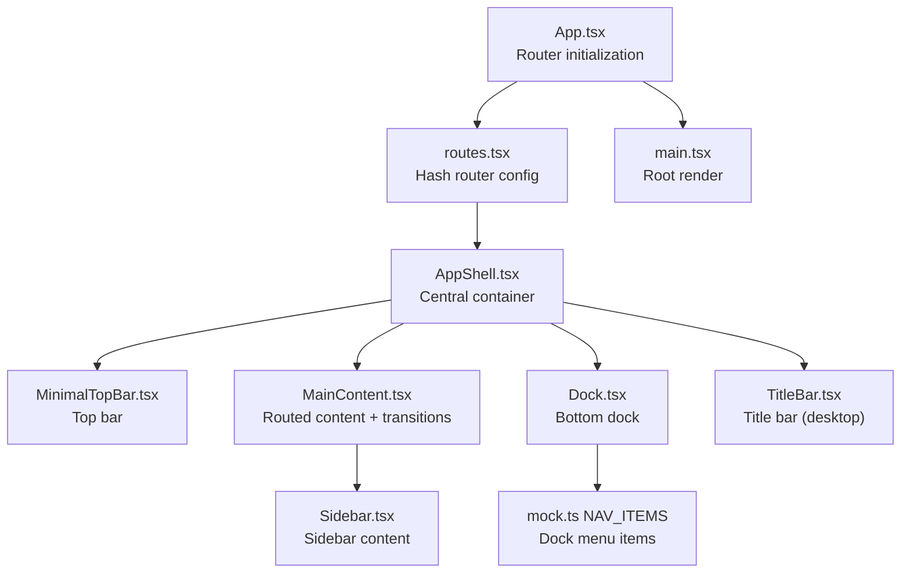
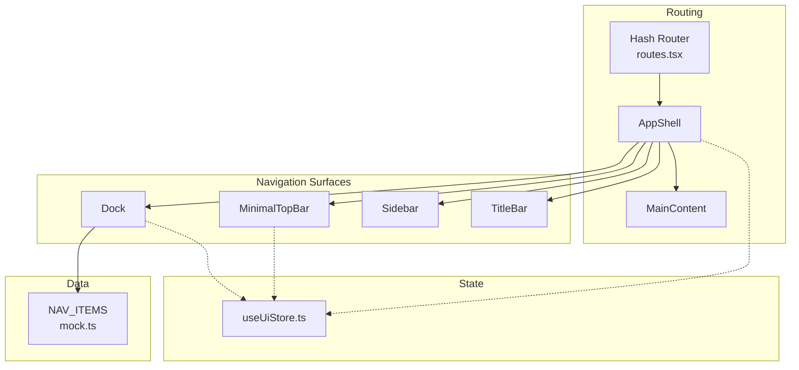
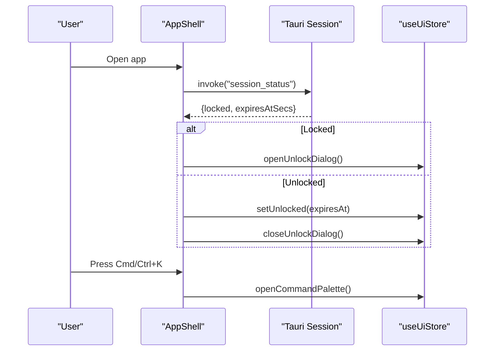
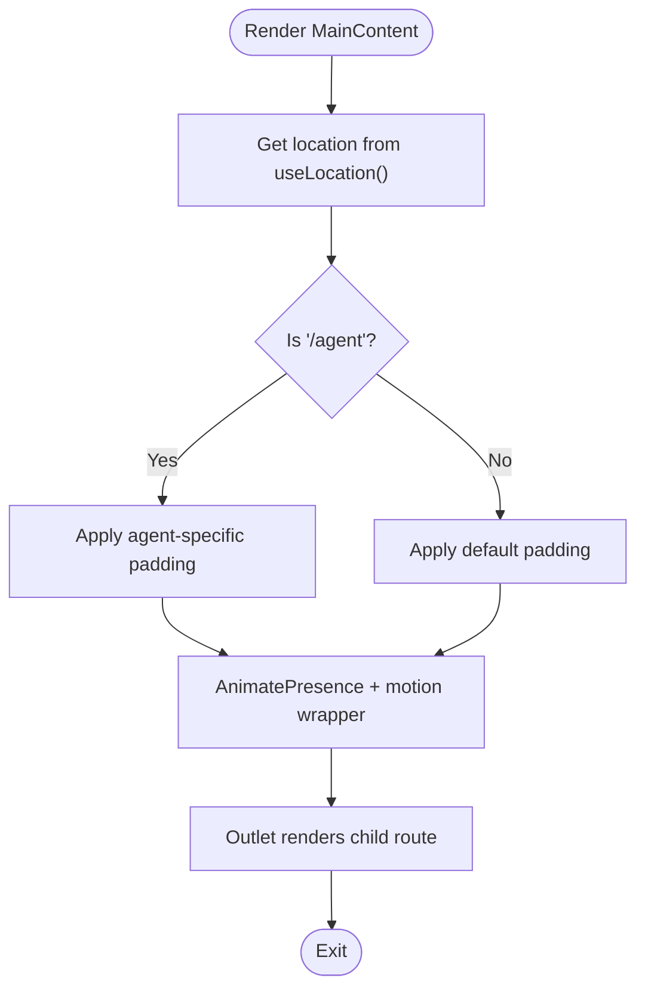
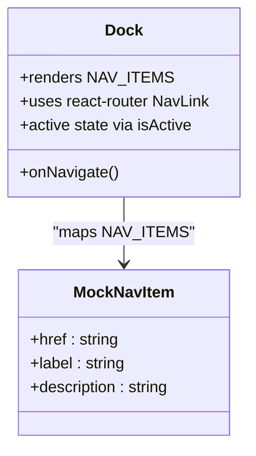
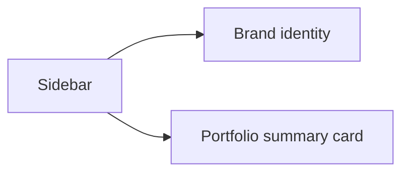
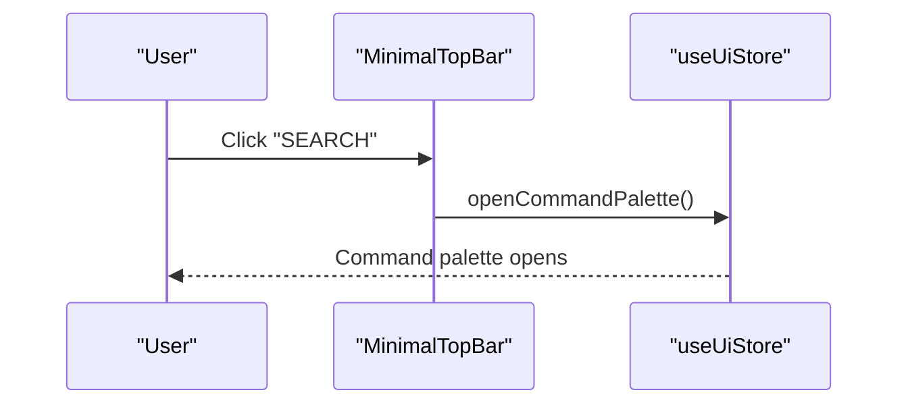
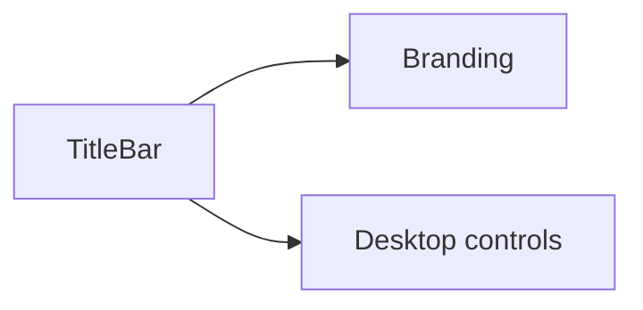
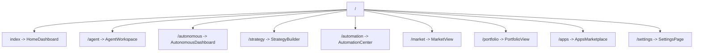
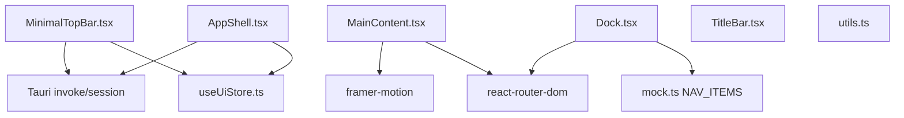

# Layout & Navigation System

<cite>
**Referenced Files in This Document**
- [AppShell.tsx](file://src/components/layout/AppShell.tsx)
- [MainContent.tsx](file://src/components/layout/MainContent.tsx)
- [Sidebar.tsx](file://src/components/layout/Sidebar.tsx)
- [MinimalTopBar.tsx](file://src/components/layout/MinimalTopBar.tsx)
- [TitleBar.tsx](file://src/components/layout/TitleBar.tsx)
- [Dock.tsx](file://src/components/layout/Dock.tsx)
- [routes.tsx](file://src/routes.tsx)
- [mock.ts](file://src/data/mock.ts)
- [useUiStore.ts](file://src/store/useUiStore.ts)
- [App.tsx](file://src/App.tsx)
- [main.tsx](file://src/main.tsx)
- [utils.ts](file://src/lib/utils.ts)
</cite>

## Table of Contents
1. [Introduction](#introduction)
2. [Project Structure](#project-structure)
3. [Core Components](#core-components)
4. [Architecture Overview](#architecture-overview)
5. [Detailed Component Analysis](#detailed-component-analysis)
6. [Dependency Analysis](#dependency-analysis)
7. [Performance Considerations](#performance-considerations)
8. [Troubleshooting Guide](#troubleshooting-guide)
9. [Conclusion](#conclusion)
10. [Appendices](#appendices)

## Introduction
This document explains SHADOW Protocol’s layout and navigation system. It focuses on the AppShell as the central container, the sidebar navigation structure, the main content routing with transitions, the top bar and title bar features, and the dock for quick access. It also covers responsive behavior, mobile navigation patterns, and accessibility considerations, along with practical examples for integrating new routes and customizing navigation behavior.

## Project Structure
The layout and navigation system is implemented primarily under the layout components folder and wired via a hash-based router. The App component initializes the router and mounts the application shell. The Dock and Sidebar provide primary navigation affordances, while the MainContent renders routed views with smooth transitions.

**Diagram sources**
- [App.tsx:1-49](file://src/App.tsx#L1-L49)
- [routes.tsx:14-32](file://src/routes.tsx#L14-L32)
- [AppShell.tsx:31-277](file://src/components/layout/AppShell.tsx#L31-L277)
- [MinimalTopBar.tsx:8-83](file://src/components/layout/MinimalTopBar.tsx#L8-L83)
- [MainContent.tsx:6-33](file://src/components/layout/MainContent.tsx#L6-L33)
- [Dock.tsx:33-67](file://src/components/layout/Dock.tsx#L33-L67)
- [TitleBar.tsx:6-43](file://src/components/layout/TitleBar.tsx#L6-L43)
- [Sidebar.tsx:11-53](file://src/components/layout/Sidebar.tsx#L11-L53)
- [mock.ts:149-159](file://src/data/mock.ts#L149-L159)
- [main.tsx:1-17](file://src/main.tsx#L1-L17)

**Section sources**
- [App.tsx:9-46](file://src/App.tsx#L9-L46)
- [routes.tsx:14-32](file://src/routes.tsx#L14-L32)
- [main.tsx:8-16](file://src/main.tsx#L8-L16)

## Core Components
- AppShell: Central container orchestrating top bar, main content, dock, activity bell, toasts, update cards, panics, brief sheet, command palette, unlock dialog, initialization sequence, and Ollama setup. It manages session state, theme resolution, and keyboard shortcuts.
- MainContent: Hash-router-backed outlet with page transitions using AnimatePresence and motion. It adapts padding based on the current route.
- Dock: Bottom dock with route-based icons mapped from NAV_ITEMS. Uses react-router NavLink for active state and click handlers.
- Sidebar: Static sidebar content with branding and portfolio summary; designed to be paired with a collapsible navigation component elsewhere in the app.
- MinimalTopBar: Draggable header bar with session indicator and command palette trigger; integrates with Tauri window dragging on desktop.
- TitleBar: Desktop-focused title bar with branding and action buttons; hidden on smaller screens.
- routes.tsx: Hash router configuration defining nested routes under AppShell.
- mock.ts: Provides NAV_ITEMS used by Dock and defines other mock data.
- useUiStore.ts: Global UI state including theme preference, command palette visibility, sidebar open state, notifications, and portfolio actions.

**Section sources**
- [AppShell.tsx:31-277](file://src/components/layout/AppShell.tsx#L31-L277)
- [MainContent.tsx:6-33](file://src/components/layout/MainContent.tsx#L6-L33)
- [Dock.tsx:33-67](file://src/components/layout/Dock.tsx#L33-L67)
- [Sidebar.tsx:11-53](file://src/components/layout/Sidebar.tsx#L11-L53)
- [MinimalTopBar.tsx:8-83](file://src/components/layout/MinimalTopBar.tsx#L8-L83)
- [TitleBar.tsx:6-43](file://src/components/layout/TitleBar.tsx#L6-L43)
- [routes.tsx:14-32](file://src/routes.tsx#L14-L32)
- [mock.ts:149-159](file://src/data/mock.ts#L149-L159)
- [useUiStore.ts:28-159](file://src/store/useUiStore.ts#L28-L159)

## Architecture Overview
The system uses a hash-based router to manage navigation without server dependencies. AppShell composes the top bar, main content area, and dock. Dock and Sidebar provide complementary navigation surfaces. MainContent handles route transitions with animation. The UI store coordinates global behaviors like theme, command palette, and notifications.

**Diagram sources**
- [routes.tsx:14-32](file://src/routes.tsx#L14-L32)
- [AppShell.tsx:31-277](file://src/components/layout/AppShell.tsx#L31-L277)
- [MainContent.tsx:6-33](file://src/components/layout/MainContent.tsx#L6-L33)
- [Dock.tsx:33-67](file://src/components/layout/Dock.tsx#L33-L67)
- [Sidebar.tsx:11-53](file://src/components/layout/Sidebar.tsx#L11-L53)
- [MinimalTopBar.tsx:8-83](file://src/components/layout/MinimalTopBar.tsx#L8-L83)
- [TitleBar.tsx:6-43](file://src/components/layout/TitleBar.tsx#L6-L43)
- [useUiStore.ts:28-159](file://src/store/useUiStore.ts#L28-L159)
- [mock.ts:149-159](file://src/data/mock.ts#L149-L159)

## Detailed Component Analysis

### AppShell: Central Container
AppShell orchestrates:
- Theme resolution and persistence
- Wallet/session lifecycle and unlock dialog
- Command palette keyboard shortcut (Cmd/Ctrl+K)
- Approval flow and notifications
- Toasts, update card, panic modal, and brief sheet
- Lazy-loading of initialization and Ollama setup components
- Dock and ActivityBell integration

Key behaviors:
- Resolves theme preference ("system", "light", "dark") and applies it to the document root.
- Listens for wallet sync and alert events and heartbeats.
- Checks Ollama status and opens setup if needed; selects a default model if none chosen.
- Manages unlock dialog lifecycle and session status via Tauri invoke.
- Renders a success banner after approvals with AnimatePresence.

**Diagram sources**
- [AppShell.tsx:119-146](file://src/components/layout/AppShell.tsx#L119-L146)
- [useUiStore.ts:50-52](file://src/store/useUiStore.ts#L50-L52)

**Section sources**
- [AppShell.tsx:31-277](file://src/components/layout/AppShell.tsx#L31-L277)
- [useUiStore.ts:28-159](file://src/store/useUiStore.ts#L28-L159)

### MainContent: Hash Router + Transitions
MainContent:
- Uses react-router-hash-link for navigation and Outlet for nested rendering.
- Applies AnimatePresence with a key based on pathname for smooth transitions.
- Adjusts padding for agent-specific pages to accommodate bottom dock and safe areas.
- Uses motion variants for fade and subtle slide-in effect.

Responsive and accessibility:
- Uses semantic main element and dynamic class composition for padding.
- Motion animations are disabled when exiting to avoid jank.

**Diagram sources**
- [MainContent.tsx:6-33](file://src/components/layout/MainContent.tsx#L6-L33)

**Section sources**
- [MainContent.tsx:6-33](file://src/components/layout/MainContent.tsx#L6-L33)
- [routes.tsx:14-32](file://src/routes.tsx#L14-L32)

### Dock: Bottom Navigation
Dock:
- Renders a row of NavLink items mapped from NAV_ITEMS.
- Icons are resolved via a lookup table keyed by route.
- Active state is handled by NavLink; inactive states receive hover styling.
- Accessibility: aria-label on links and spans; keyboard focus supported by NavLink.

Integration points:
- Uses useUiStore for command palette and other UI behaviors.
- Accepts an optional onNavigate callback to close mobile drawers after selection.

**Diagram sources**
- [Dock.tsx:33-67](file://src/components/layout/Dock.tsx#L33-L67)
- [mock.ts:149-159](file://src/data/mock.ts#L149-L159)

**Section sources**
- [Dock.tsx:33-67](file://src/components/layout/Dock.tsx#L33-L67)
- [mock.ts:149-159](file://src/data/mock.ts#L149-L159)

### Sidebar: Branding and Portfolio Summary
Sidebar:
- Displays brand identity and a portfolio summary card with animated values.
- Designed to complement a collapsible navigation component; currently static aside.
- Responsive sizing and rounded corners for glass panel styling.

**Diagram sources**
- [Sidebar.tsx:11-53](file://src/components/layout/Sidebar.tsx#L11-L53)

**Section sources**
- [Sidebar.tsx:11-53](file://src/components/layout/Sidebar.tsx#L11-L53)

### MinimalTopBar: Draggable Header + Command Palette
MinimalTopBar:
- Draggable header using Tauri window drag on desktop.
- Displays session indicator and a command palette trigger with platform-aware hint.
- Integrates with useUiStore for command palette visibility.

Accessibility:
- Keyboard-accessible button with proper aria labels.
- Drag gesture ignored when clicking interactive elements inside the header.

**Diagram sources**
- [MinimalTopBar.tsx:65-77](file://src/components/layout/MinimalTopBar.tsx#L65-L77)
- [useUiStore.ts:50-52](file://src/store/useUiStore.ts#L50-L52)

**Section sources**
- [MinimalTopBar.tsx:8-83](file://src/components/layout/MinimalTopBar.tsx#L8-L83)
- [useUiStore.ts:28-159](file://src/store/useUiStore.ts#L28-L159)

### TitleBar: Desktop Branding and Controls
TitleBar:
- Displays app branding and desktop controls (search hint, settings, notifications, theme toggle, avatar).
- Hidden on small screens; intended for desktop layouts.

**Diagram sources**
- [TitleBar.tsx:6-43](file://src/components/layout/TitleBar.tsx#L6-L43)

**Section sources**
- [TitleBar.tsx:6-43](file://src/components/layout/TitleBar.tsx#L6-L43)

### routes.tsx: Hash Router Configuration
routes.tsx:
- Creates a hash router with AppShell as the root layout.
- Defines nested routes for Home, Agent, Autonomous, Strategy, Automation, Market, Portfolio, Apps, and Settings.
- Ensures deterministic routing and outlet rendering under AppShell.

**Diagram sources**
- [routes.tsx:14-32](file://src/routes.tsx#L14-L32)

**Section sources**
- [routes.tsx:14-32](file://src/routes.tsx#L14-L32)

## Dependency Analysis
- AppShell depends on useUiStore for theme, command palette, notifications, and approval flows; it also invokes Tauri commands for session status.
- MainContent depends on react-router-dom for routing and framer-motion for transitions.
- Dock depends on NAV_ITEMS from mock.ts and react-router NavLink for active state.
- MinimalTopBar depends on useUiStore for command palette and Tauri window APIs for drag.
- TitleBar is presentational and does not depend on stores.
- Utility class merging is centralized in utils.ts.

**Diagram sources**
- [AppShell.tsx:31-277](file://src/components/layout/AppShell.tsx#L31-L277)
- [useUiStore.ts:28-159](file://src/store/useUiStore.ts#L28-L159)
- [MainContent.tsx:6-33](file://src/components/layout/MainContent.tsx#L6-L33)
- [Dock.tsx:33-67](file://src/components/layout/Dock.tsx#L33-L67)
- [mock.ts:149-159](file://src/data/mock.ts#L149-L159)
- [MinimalTopBar.tsx:8-83](file://src/components/layout/MinimalTopBar.tsx#L8-L83)
- [utils.ts:4-6](file://src/lib/utils.ts#L4-L6)

**Section sources**
- [AppShell.tsx:31-277](file://src/components/layout/AppShell.tsx#L31-L277)
- [MainContent.tsx:6-33](file://src/components/layout/MainContent.tsx#L6-L33)
- [Dock.tsx:33-67](file://src/components/layout/Dock.tsx#L33-L67)
- [MinimalTopBar.tsx:8-83](file://src/components/layout/MinimalTopBar.tsx#L8-L83)
- [useUiStore.ts:28-159](file://src/store/useUiStore.ts#L28-L159)
- [utils.ts:4-6](file://src/lib/utils.ts#L4-L6)

## Performance Considerations
- Hash routing avoids server round trips and is efficient for single-page navigation.
- AnimatePresence with a key based on pathname ensures clean transitions without unnecessary re-renders.
- Dock and Sidebar are lightweight; keep additional content minimal to preserve scroll performance.
- Theme resolution runs once per preference change; avoid frequent re-computation by memoizing derived values.
- Debounce or throttle keyboard shortcuts and listeners to prevent redundant work.

## Troubleshooting Guide
Common issues and resolutions:
- Dock icons not updating: Verify NAV_ITEMS and NAV_ICONS mapping match route hrefs.
- Command palette not opening: Ensure keyboard shortcut handler is attached and openCommandPalette is toggled via useUiStore.
- Session unlock dialog not closing: Confirm session status invoke resolves and setUnlocked/closeUnlockDialog are called accordingly.
- Transitions not animating: Check that AnimatePresence mode is "wait" and the key prop changes on route transitions.
- Theme not applying: Confirm resolved theme is set on the document root and themePreference is persisted in useUiStore.

**Section sources**
- [Dock.tsx:33-67](file://src/components/layout/Dock.tsx#L33-L67)
- [MinimalTopBar.tsx:154-176](file://src/components/layout/MinimalTopBar.tsx#L154-L176)
- [AppShell.tsx:119-146](file://src/components/layout/AppShell.tsx#L119-L146)
- [MainContent.tsx:19-30](file://src/components/layout/MainContent.tsx#L19-L30)
- [useUiStore.ts:50-52](file://src/store/useUiStore.ts#L50-L52)

## Conclusion
SHADOW Protocol’s layout and navigation system centers around AppShell, which composes a top bar, main content area with smooth transitions, and a dock for quick access. The hash router provides straightforward routing, while the UI store coordinates global behaviors like theme, command palette, and notifications. The design emphasizes responsiveness, accessibility, and a cohesive user experience across desktop and mobile contexts.

## Appendices

### Responsive Breakpoints and Mobile Patterns
- Glass panels and rounded corners adapt across screen sizes using Tailwind utilities.
- Dock is fixed at the bottom center and intended for touch-friendly interaction.
- MinimalTopBar and TitleBar split responsibilities: draggable header plus desktop controls.
- Safe-area insets are considered for bottom paddings in MainContent to avoid overlap with dock.

**Section sources**
- [MainContent.tsx:10-17](file://src/components/layout/MainContent.tsx#L10-L17)
- [Dock.tsx:33-67](file://src/components/layout/Dock.tsx#L33-L67)
- [MinimalTopBar.tsx:44-79](file://src/components/layout/MinimalTopBar.tsx#L44-L79)
- [TitleBar.tsx:8-41](file://src/components/layout/TitleBar.tsx#L8-L41)

### Accessibility Considerations
- Dock: NavLink provides built-in active state; aria-labels on links and icons include labels for assistive tech.
- MinimalTopBar: Button elements are keyboard accessible; drag gesture is disabled on interactive targets.
- TitleBar: Buttons use ghost variants with clear focus states.
- CommandPalette: Dialog roles and aria labels; input field has aria-label and placeholder text.
- ActivityBell: Properly structured lists and buttons with aria-expanded and aria-labels.

**Section sources**
- [Dock.tsx:43-61](file://src/components/layout/Dock.tsx#L43-L61)
- [MinimalTopBar.tsx:65-77](file://src/components/layout/MinimalTopBar.tsx#L65-L77)
- [TitleBar.tsx:23-40](file://src/components/layout/TitleBar.tsx#L23-L40)
- [CommandPalette.tsx:160-214](file://src/components/layout/CommandPalette.tsx#L160-L214)
- [ActivityBell.tsx:182-264](file://src/components/layout/ActivityBell.tsx#L182-L264)

### Implementation Examples

#### Adding a New Route
Steps:
1. Define the new route component (e.g., a new page under components/...).
2. Register the route in routes.tsx under the AppShell children array with the desired path and element.
3. Optionally add a Dock item by extending NAV_ITEMS in mock.ts with href, label, and description.
4. If the new route requires special padding or layout adjustments, update MainContent as needed.

Example references:
- [routes.tsx:19-30](file://src/routes.tsx#L19-L30)
- [mock.ts:149-159](file://src/data/mock.ts#L149-L159)

#### Customizing Dock Behavior
- To add a new dock item, extend NAV_ITEMS and ensure the href matches the route.
- To change active styling, adjust the className returned by the NavLink’s function in Dock.tsx.
- To close a mobile drawer after navigation, pass an onNavigate handler to Dock and call it from the route’s navigation logic.

Example references:
- [Dock.tsx:43-61](file://src/components/layout/Dock.tsx#L43-L61)
- [mock.ts:149-159](file://src/data/mock.ts#L149-L159)

#### Integrating with Session and Unlock Flow
- Use AppShell’s session checks and unlock dialog lifecycle to gate sensitive routes.
- For new authenticated routes, rely on the existing invoke("session_status") pattern and setUnlocked/closeUnlockDialog.

Example references:
- [AppShell.tsx:119-146](file://src/components/layout/AppShell.tsx#L119-L146)
- [useUiStore.ts:48-52](file://src/store/useUiStore.ts#L48-L52)