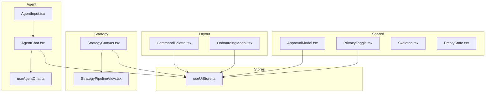
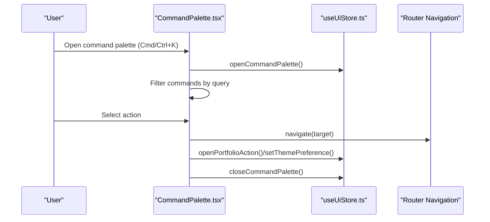
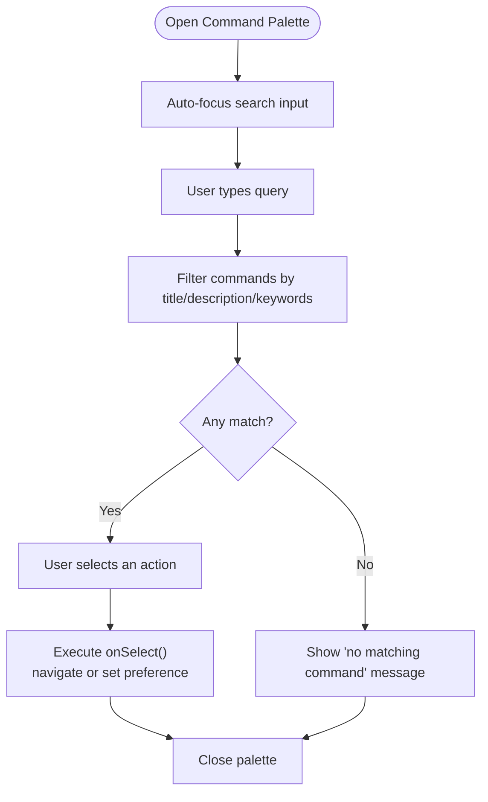
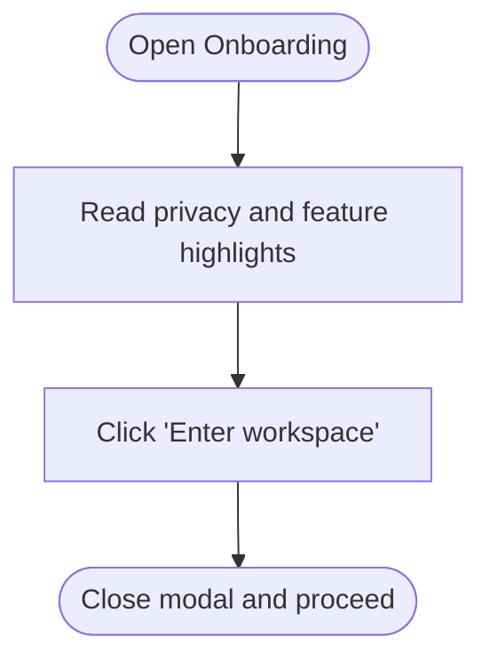
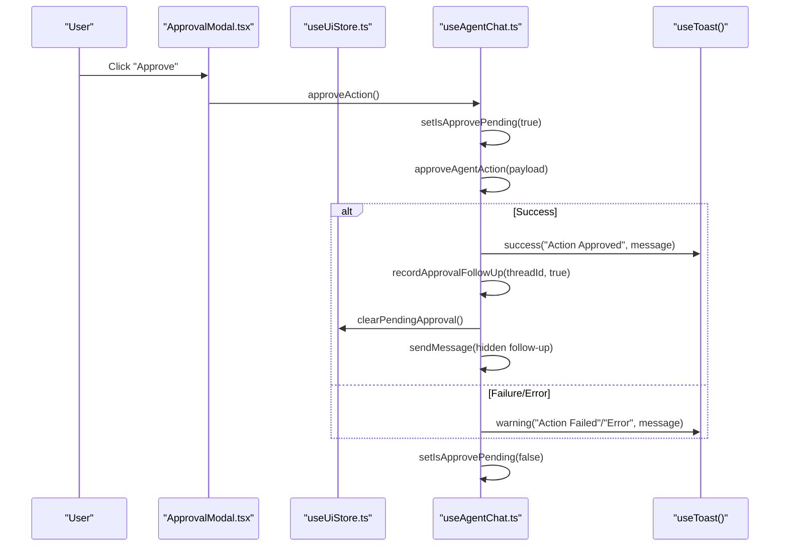
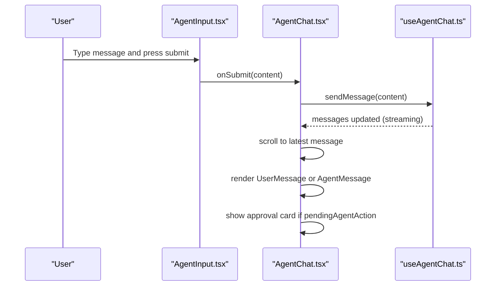
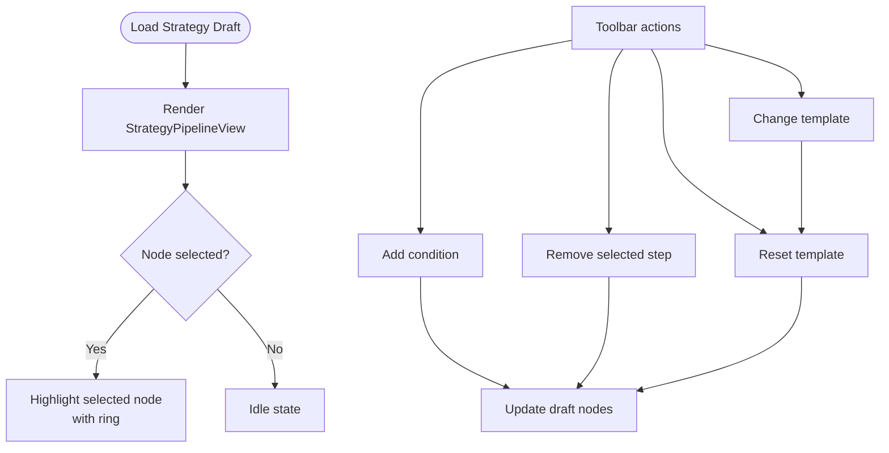
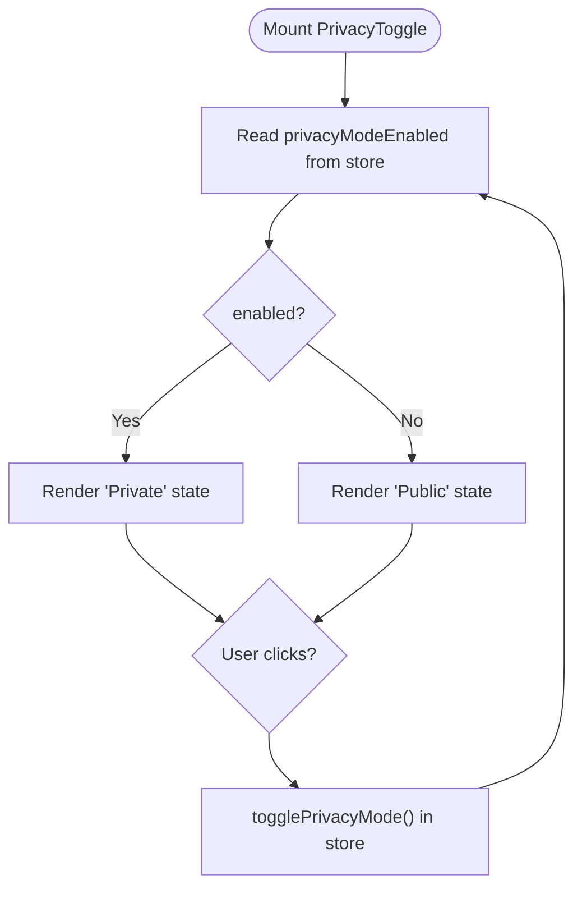
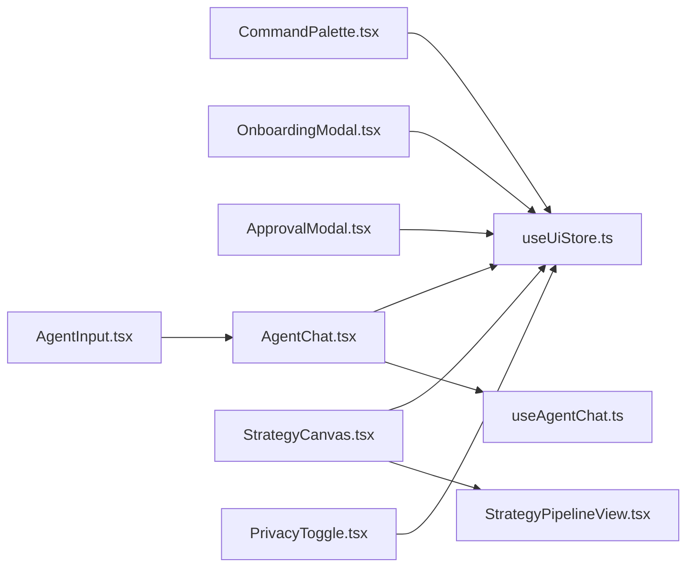

# User Interaction Patterns

<cite>
**Referenced Files in This Document**
- [CommandPalette.tsx](file://src/components/layout/CommandPalette.tsx)
- [OnboardingModal.tsx](file://src/components/layout/OnboardingModal.tsx)
- [ApprovalModal.tsx](file://src/components/shared/ApprovalModal.tsx)
- [AgentChat.tsx](file://src/components/agent/AgentChat.tsx)
- [AgentInput.tsx](file://src/components/agent/AgentInput.tsx)
- [useAgentChat.ts](file://src/hooks/useAgentChat.ts)
- [StrategyCanvas.tsx](file://src/components/strategy/StrategyCanvas.tsx)
- [StrategyPipelineView.tsx](file://src/components/strategy/StrategyPipelineView.tsx)
- [PrivacyToggle.tsx](file://src/components/shared/PrivacyToggle.tsx)
- [Skeleton.tsx](file://src/components/shared/Skeleton.tsx)
- [EmptyState.tsx](file://src/components/shared/EmptyState.tsx)
- [useUiStore.ts](file://src/store/useUiStore.ts)
</cite>

## Table of Contents
1. [Introduction](#introduction)
2. [Project Structure](#project-structure)
3. [Core Components](#core-components)
4. [Architecture Overview](#architecture-overview)
5. [Detailed Component Analysis](#detailed-component-analysis)
6. [Dependency Analysis](#dependency-analysis)
7. [Performance Considerations](#performance-considerations)
8. [Troubleshooting Guide](#troubleshooting-guide)
9. [Conclusion](#conclusion)
10. [Appendices](#appendices)

## Introduction
This document describes SHADOW Protocol’s user interaction patterns and UX design principles. It focuses on modal interaction systems (onboarding, approvals, contextual dialogs), keyboard-driven navigation via the command palette, privacy-centric interactions (toggles, confirmations, security prompts), agent chat input and approval workflows, strategy canvas interaction patterns (pipeline visualization and selection), accessibility patterns (keyboard, screen reader, focus), and micro-interactions, loading states, error handling, and feedback mechanisms. It also provides guidelines for implementing new interaction patterns consistently with existing UX.

## Project Structure
SHADOW’s UI is organized around reusable components and stores:
- Layout components handle global experiences like the command palette and onboarding.
- Shared components encapsulate privacy controls and feedback patterns.
- Agent and Strategy components implement specialized interaction flows.
- Zustand stores manage UI state, including modals, theme, and pending approvals.

**Diagram sources**
- [CommandPalette.tsx:1-215](file://src/components/layout/CommandPalette.tsx#L1-L215)
- [OnboardingModal.tsx:1-71](file://src/components/layout/OnboardingModal.tsx#L1-L71)
- [ApprovalModal.tsx:1-142](file://src/components/shared/ApprovalModal.tsx#L1-L142)
- [AgentChat.tsx:1-124](file://src/components/agent/AgentChat.tsx#L1-L124)
- [AgentInput.tsx:1-52](file://src/components/agent/AgentInput.tsx#L1-L52)
- [useAgentChat.ts:1-97](file://src/hooks/useAgentChat.ts#L1-L97)
- [StrategyCanvas.tsx:1-109](file://src/components/strategy/StrategyCanvas.tsx#L1-L109)
- [StrategyPipelineView.tsx:1-107](file://src/components/strategy/StrategyPipelineView.tsx#L1-L107)
- [useUiStore.ts:1-162](file://src/store/useUiStore.ts#L1-L162)

**Section sources**
- [CommandPalette.tsx:1-215](file://src/components/layout/CommandPalette.tsx#L1-L215)
- [OnboardingModal.tsx:1-71](file://src/components/layout/OnboardingModal.tsx#L1-L71)
- [useUiStore.ts:1-162](file://src/store/useUiStore.ts#L1-L162)

## Core Components
- Command Palette: Global keyboard-driven navigation and quick actions with fuzzy search and theme switching.
- Onboarding Modal: First-run orientation with privacy-first messaging and a single dismiss action.
- Approval Modal: Human-in-the-loop confirmation for transactions with privacy toggle, simulation preview, and “don’t ask again” option.
- Agent Chat: Streaming chat with message rendering, user input, and integrated approval cards.
- Strategy Canvas: Pipeline visualization with node selection, add/remove controls, and template reset.
- Privacy Toggle: Persistent privacy mode switch with accessible labeling and visual states.
- Feedback Utilities: Skeleton loader and empty-state components for loading and empty scenarios.

**Section sources**
- [CommandPalette.tsx:1-215](file://src/components/layout/CommandPalette.tsx#L1-L215)
- [OnboardingModal.tsx:1-71](file://src/components/layout/OnboardingModal.tsx#L1-L71)
- [ApprovalModal.tsx:1-142](file://src/components/shared/ApprovalModal.tsx#L1-L142)
- [AgentChat.tsx:1-124](file://src/components/agent/AgentChat.tsx#L1-L124)
- [StrategyCanvas.tsx:1-109](file://src/components/strategy/StrategyCanvas.tsx#L1-L109)
- [PrivacyToggle.tsx:1-32](file://src/components/shared/PrivacyToggle.tsx#L1-L32)
- [Skeleton.tsx:1-15](file://src/components/shared/Skeleton.tsx#L1-L15)
- [EmptyState.tsx:1-37](file://src/components/shared/EmptyState.tsx#L1-L37)

## Architecture Overview
The UI relies on a centralized store for state that drives modals, theme, and pending approvals. Agent interactions are coordinated via a hook that integrates with stores and toast notifications. Strategy components render a pipeline view and expose callbacks for node selection and updates.

**Diagram sources**
- [CommandPalette.tsx:31-132](file://src/components/layout/CommandPalette.tsx#L31-L132)
- [useUiStore.ts:98-106](file://src/store/useUiStore.ts#L98-L106)

## Detailed Component Analysis

### Command Palette
- Purpose: Keyboard-driven navigation and quick actions across routes, actions, and theme preferences.
- Interaction pattern:
  - Opens with a global shortcut and auto-focuses the search input.
  - Filters commands by title, description, and keywords.
  - Supports theme switching and direct portfolio action launch.
- Accessibility:
  - Uses a dialog with a hidden title and labeled input.
  - Keyboard navigation within the list via tab order.
- Feedback:
  - Clear empty-state messaging when no matches are found.

**Diagram sources**
- [CommandPalette.tsx:134-152](file://src/components/layout/CommandPalette.tsx#L134-L152)
- [CommandPalette.tsx:160-213](file://src/components/layout/CommandPalette.tsx#L160-L213)

**Section sources**
- [CommandPalette.tsx:1-215](file://src/components/layout/CommandPalette.tsx#L1-L215)
- [useUiStore.ts:98-106](file://src/store/useUiStore.ts#L98-L106)

### Onboarding Modal
- Purpose: First-run orientation emphasizing privacy-first defaults and quick entry to the workspace.
- Interaction pattern:
  - Non-cancellable modal with a single primary action to enter the workspace.
  - Highlights three pillars: privacy, agent guidance, and actionable flows.
- Accessibility:
  - Uses semantic dialog headers and labels appropriate for assistive tech.

**Diagram sources**
- [OnboardingModal.tsx:18-69](file://src/components/layout/OnboardingModal.tsx#L18-L69)

**Section sources**
- [OnboardingModal.tsx:1-71](file://src/components/layout/OnboardingModal.tsx#L1-L71)

### Approval Modal (Human-in-the-loop)
- Purpose: Security-conscious confirmation for transactions with transparency and privacy controls.
- Interaction pattern:
  - Displays action, amount, chain, slippage/gas, reason, and simulation preview.
  - Integrates Privacy Toggle and “don’t ask again” checkbox.
  - Approve/Reject actions update store state and trigger follow-up agent turns.
- Feedback:
  - Toast notifications indicate success/failure of approval actions.
  - Pending state during approval processing.

**Diagram sources**
- [ApprovalModal.tsx:25-140](file://src/components/shared/ApprovalModal.tsx#L25-L140)
- [useAgentChat.ts:39-78](file://src/hooks/useAgentChat.ts#L39-L78)
- [useUiStore.ts:98-99](file://src/store/useUiStore.ts#L98-L99)

**Section sources**
- [ApprovalModal.tsx:1-142](file://src/components/shared/ApprovalModal.tsx#L1-L142)
- [useAgentChat.ts:1-97](file://src/hooks/useAgentChat.ts#L1-L97)
- [useUiStore.ts:98-99](file://src/store/useUiStore.ts#L98-L99)

### Agent Chat and Input
- Purpose: Private DeFi assistant with streaming replies and integrated approval workflows.
- Interaction pattern:
  - AgentInput handles submission, disables on streaming, and clears input on submit.
  - AgentChat renders messages with animated entries, scrolling to the latest, and shows an empty state when no messages exist.
  - Approval cards appear when the agent requests human-in-the-loop actions.
- Accessibility:
  - Proper labeling of input and visual focus states.
  - Animated transitions for smooth UX without motion impairments.

**Diagram sources**
- [AgentInput.tsx:11-51](file://src/components/agent/AgentInput.tsx#L11-L51)
- [AgentChat.tsx:10-123](file://src/components/agent/AgentChat.tsx#L10-L123)
- [useAgentChat.ts:31-37](file://src/hooks/useAgentChat.ts#L31-L37)

**Section sources**
- [AgentChat.tsx:1-124](file://src/components/agent/AgentChat.tsx#L1-L124)
- [AgentInput.tsx:1-52](file://src/components/agent/AgentInput.tsx#L1-L52)
- [useAgentChat.ts:1-97](file://src/hooks/useAgentChat.ts#L1-L97)

### Strategy Canvas and Pipeline View
- Purpose: Visual builder for strategy steps with pipeline visualization and selection.
- Interaction pattern:
  - StrategyCanvas provides toolbar actions: add condition, remove selected step, template selector, and reset.
  - StrategyPipelineView renders ordered nodes with distinct accents per type (trigger, condition, action), supports selection, and shows chevrons between steps.
- Accessibility:
  - List and listitem roles for the pipeline grid.
  - Clear visual selection state and keyboard focus.

**Diagram sources**
- [StrategyCanvas.tsx:19-108](file://src/components/strategy/StrategyCanvas.tsx#L19-L108)
- [StrategyPipelineView.tsx:38-106](file://src/components/strategy/StrategyPipelineView.tsx#L38-L106)

**Section sources**
- [StrategyCanvas.tsx:1-109](file://src/components/strategy/StrategyCanvas.tsx#L1-L109)
- [StrategyPipelineView.tsx:1-107](file://src/components/strategy/StrategyPipelineView.tsx#L1-L107)

### Privacy Toggle and Privacy-Focused Patterns
- Purpose: Allow users to quickly switch between private and public modes with persistent state.
- Interaction pattern:
  - PrivacyToggle reads from the UI store and toggles state on click (when not externally controlled).
  - Used within ApprovalModal to emphasize privacy posture.
- Accessibility:
  - Proper aria-label reflecting current state.
  - Distinct visual states for active/inactive.

**Diagram sources**
- [PrivacyToggle.tsx:10-31](file://src/components/shared/PrivacyToggle.tsx#L10-L31)
- [useUiStore.ts:91-92](file://src/store/useUiStore.ts#L91-L92)

**Section sources**
- [PrivacyToggle.tsx:1-32](file://src/components/shared/PrivacyToggle.tsx#L1-L32)
- [useUiStore.ts:91-92](file://src/store/useUiStore.ts#L91-L92)

### Micro-interactions, Loading States, and Feedback
- Micro-interactions:
  - Smooth animations for message appearance in AgentChat.
  - Hover and active states for buttons and palette items.
- Loading states:
  - Skeleton component for pulse-based placeholders.
  - EmptyState component for user-triggered or system-initiated empty views.
- Feedback:
  - Toast notifications for approval outcomes.
  - Disabled states during processing to prevent double-submissions.

**Section sources**
- [AgentChat.tsx:61-74](file://src/components/agent/AgentChat.tsx#L61-L74)
- [Skeleton.tsx:1-15](file://src/components/shared/Skeleton.tsx#L1-L15)
- [EmptyState.tsx:1-37](file://src/components/shared/EmptyState.tsx#L1-L37)
- [useAgentChat.ts:24-24](file://src/hooks/useAgentChat.ts#L24-L24)

## Dependency Analysis
- CommandPalette depends on useUiStore for opening/closing and theme/portfolio actions.
- ApprovalModal depends on useUiStore for pending approval state and toggling “don’t ask again.”
- AgentChat and AgentInput depend on useAgentChat for message lifecycle and approval actions.
- StrategyCanvas and StrategyPipelineView depend on strategy utilities and draft data.
- PrivacyToggle depends on useUiStore for persistent privacy mode.

**Diagram sources**
- [CommandPalette.tsx:31-132](file://src/components/layout/CommandPalette.tsx#L31-L132)
- [useUiStore.ts:98-106](file://src/store/useUiStore.ts#L98-L106)
- [ApprovalModal.tsx:25-140](file://src/components/shared/ApprovalModal.tsx#L25-L140)
- [AgentChat.tsx:10-123](file://src/components/agent/AgentChat.tsx#L10-L123)
- [useAgentChat.ts:13-96](file://src/hooks/useAgentChat.ts#L13-L96)
- [StrategyCanvas.tsx:19-108](file://src/components/strategy/StrategyCanvas.tsx#L19-L108)
- [StrategyPipelineView.tsx:38-106](file://src/components/strategy/StrategyPipelineView.tsx#L38-L106)
- [PrivacyToggle.tsx:10-31](file://src/components/shared/PrivacyToggle.tsx#L10-L31)

**Section sources**
- [useUiStore.ts:1-162](file://src/store/useUiStore.ts#L1-L162)
- [useAgentChat.ts:1-97](file://src/hooks/useAgentChat.ts#L1-L97)

## Performance Considerations
- Memoization:
  - CommandPalette uses memoized command lists and filtering to avoid re-computation on keystrokes.
  - StrategyPipelineView computes ordered nodes once per draft change.
- Rendering:
  - AgentChat animates only the latest message entry to minimize layout thrash.
  - Strategy pipeline uses fragment keys and minimal re-renders by relying on ordered arrays.
- Store persistence:
  - UI store persists theme, privacy mode, and skipped approvals to reduce setup friction on reload.

[No sources needed since this section provides general guidance]

## Troubleshooting Guide
- Command Palette not responding:
  - Ensure the palette is opened via the global shortcut and that the store flag is set.
  - Verify that the input receives focus and that filtering logic runs on query changes.
- Approval modal not closing:
  - Confirm that the close handler invokes the store’s close method and that the parent component respects the open prop.
  - Check that “don’t ask again” updates the skipped approvals list in the store.
- Agent chat not scrolling:
  - Verify the effect runs when messages change and that the last message ref is attached to the latest item.
- Strategy canvas actions disabled:
  - Check selection state and whether the selected node is protected (e.g., the trigger node).
- Privacy toggle not changing state:
  - Confirm the component is not controlled externally and that the store toggle function is called.

**Section sources**
- [CommandPalette.tsx:154-158](file://src/components/layout/CommandPalette.tsx#L154-L158)
- [useUiStore.ts:98-111](file://src/store/useUiStore.ts#L98-L111)
- [AgentChat.tsx:25-30](file://src/components/agent/AgentChat.tsx#L25-L30)
- [StrategyCanvas.tsx:42-48](file://src/components/strategy/StrategyCanvas.tsx#L42-L48)
- [PrivacyToggle.tsx:18-19](file://src/components/shared/PrivacyToggle.tsx#L18-L19)

## Conclusion
SHADOW’s interaction patterns emphasize privacy-first design, human-in-the-loop controls, and efficient keyboard-driven workflows. Modals provide clear, contextual guidance; the command palette centralizes navigation; agent interactions integrate seamlessly with approval workflows; and the strategy canvas offers a visual, accessible pipeline. Consistent use of stores, memoization, and accessibility primitives ensures predictable, inclusive experiences.

[No sources needed since this section summarizes without analyzing specific files]

## Appendices

### Accessibility Guidelines
- Keyboard navigation:
  - Use Tab to move between interactive elements; Esc to close modals where applicable.
  - Ensure focus indicators are visible and persistent.
- Screen reader support:
  - Use aria-labels for unlabeled controls and dialogs.
  - Provide meaningful titles and descriptions for modals and lists.
- Focus management:
  - Auto-focus search inputs on open.
  - Restore focus after modals close.

[No sources needed since this section provides general guidance]

### Implementing New Interaction Patterns
- Reuse shared components:
  - Use the dialog system for modals, buttons for actions, and skeleton/empty-state for loading/empty states.
- Integrate with the UI store:
  - Centralize state for modals, theme, and pending approvals.
- Preserve privacy defaults:
  - Default to private mode and allow explicit toggling.
- Provide feedback:
  - Use toast notifications for outcomes; disabled states during processing.
- Keep accessibility in mind:
  - Label controls, manage focus, and test with assistive technologies.

[No sources needed since this section provides general guidance]