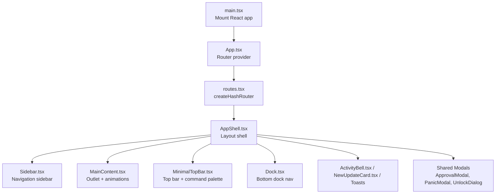
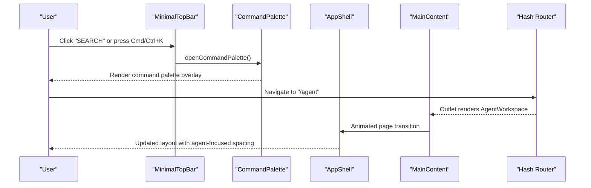
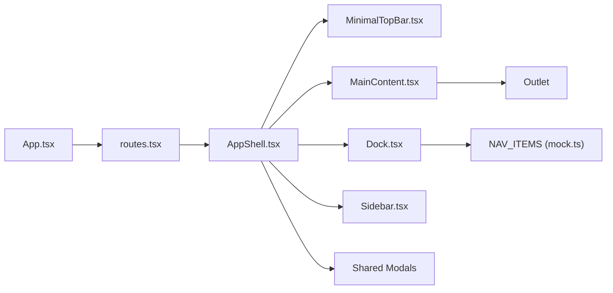

# User Interface & Navigation

<cite>
**Referenced Files in This Document**
- [src/App.tsx](file://src/App.tsx)
- [src/main.tsx](file://src/main.tsx)
- [src/routes.tsx](file://src/routes.tsx)
- [src/components/layout/AppShell.tsx](file://src/components/layout/AppShell.tsx)
- [src/components/layout/Sidebar.tsx](file://src/components/layout/Sidebar.tsx)
- [src/components/layout/MainContent.tsx](file://src/components/layout/MainContent.tsx)
- [src/components/layout/MinimalTopBar.tsx](file://src/components/layout/MinimalTopBar.tsx)
- [src/components/layout/Dock.tsx](file://src/components/layout/Dock.tsx)
- [src/components/layout/TitleBar.tsx](file://src/components/layout/TitleBar.tsx)
- [src/components/layout/CommandPalette.tsx](file://src/components/layout/CommandPalette.tsx)
- [src/components/layout/ActivityBell.tsx](file://src/components/layout/ActivityBell.tsx)
- [src/components/layout/NewUpdateCard.tsx](file://src/components/layout/NewUpdateCard.tsx)
- [src/components/layout/ShadowBriefSheet.tsx](file://src/components/layout/ShadowBriefSheet.tsx)
- [src/components/layout/OnboardingModal.tsx](file://src/components/layout/OnboardingModal.tsx)
- [src/components/shared/ThemeToggle.tsx](file://src/components/shared/ThemeToggle.tsx)
- [src/components/shared/PrivacyToggle.tsx](file://src/components/shared/PrivacyToggle.tsx)
- [src/components/shared/ApprovalModal.tsx](file://src/components/shared/ApprovalModal.tsx)
- [src/components/shared/PanicModal.tsx](file://src/components/shared/PanicModal.tsx)
- [src/components/shared/ChainPill.tsx](file://src/components/shared/ChainPill.tsx)
- [src/components/shared/EmptyState.tsx](file://src/components/shared/EmptyState.tsx)
- [src/components/shared/Skeleton.tsx](file://src/components/shared/Skeleton.tsx)
- [src/components/ui/button.tsx](file://src/components/ui/button.tsx)
- [src/components/ui/card.tsx](file://src/components/ui/card.tsx)
- [src/components/ui/badge.tsx](file://src/components/ui/badge.tsx)
- [src/components/ui/dialog.tsx](file://src/components/ui/dialog.tsx)
- [src/components/ui/dropdown-menu.tsx](file://src/components/ui/dropdown-menu.tsx)
- [src/components/ui/input.tsx](file://src/components/ui/input.tsx)
- [src/components/ui/label.tsx](file://src/components/ui/label.tsx)
- [src/components/ui/progress.tsx](file://src/components/ui/progress.tsx)
- [src/components/ui/tabs.tsx](file://src/components/ui/tabs.tsx)
- [src/components/agent/AgentWorkspace.tsx](file://src/components/agent/AgentWorkspace.tsx)
- [src/components/agent/AgentChat.tsx](file://src/components/agent/AgentChat.tsx)
- [src/components/agent/AgentInput.tsx](file://src/components/agent/AgentInput.tsx)
- [src/components/agent/AgentMessage.tsx](file://src/components/agent/AgentMessage.tsx)
- [src/components/agent/UserMessage.tsx](file://src/components/agent/UserMessage.tsx)
- [src/components/agent/ThreadSidebar.tsx](file://src/components/agent/ThreadSidebar.tsx)
- [src/components/agent/ThinkingLoader.tsx](file://src/components/agent/ThinkingLoader.tsx)
- [src/components/agent/DecisionCard.tsx](file://src/components/agent/DecisionCard.tsx)
- [src/components/agent/OpportunityCard.tsx](file://src/components/agent/OpportunityCard.tsx)
- [src/components/agent/StrategyProposalCard.tsx](file://src/components/agent/StrategyProposalCard.tsx)
- [src/components/agent/ToolResultCard.tsx](file://src/components/agent/ToolResultCard.tsx)
- [src/components/agent/ApprovalRequestCard.tsx](file://src/components/agent/ApprovalRequestCard.tsx)
- [src/components/agent/FormattedText.tsx](file://src/components/agent/FormattedText.tsx)
- [src/components/agent/ChatModelPicker.tsx](file://src/components/agent/ChatModelPicker.tsx)
- [src/components/strategy/StrategyBuilder.tsx](file://src/components/strategy/StrategyBuilder.tsx)
- [src/components/strategy/StrategyCanvas.tsx](file://src/components/strategy/StrategyCanvas.tsx)
- [src/components/strategy/StrategyInspector.tsx](file://src/components/strategy/StrategyInspector.tsx)
- [src/components/strategy/StrategyPipelineView.tsx](file://src/components/strategy/StrategyPipelineView.tsx)
- [src/components/strategy/StrategySimulationPanel.tsx](file://src/components/strategy/StrategySimulationPanel.tsx)
- [src/components/strategy/GuardrailsForm.tsx](file://src/components/strategy/GuardrailsForm.tsx)
- [src/components/autonomous/AutonomousDashboard.tsx](file://src/components/autonomous/AutonomousDashboard.tsx)
- [src/components/autonomous/HealthDashboard.tsx](file://src/components/autonomous/HealthDashboard.tsx)
- [src/components/autonomous/OpportunityFeed.tsx](file://src/components/autonomous/OpportunityFeed.tsx)
- [src/components/autonomous/TaskQueue.tsx](file://src/components/autonomous/TaskQueue.tsx)
- [src/components/autonomous/OrchestratorControl.tsx](file://src/components/autonomous/OrchestratorControl.tsx)
- [src/components/autonomous/GuardrailsPanel.tsx](file://src/components/autonomous/GuardrailsPanel.tsx)
- [src/components/automation/AutomationCenter.tsx](file://src/components/automation/AutomationCenter.tsx)
- [src/components/automation/ActivityLog.tsx](file://src/components/automation/ActivityLog.tsx)
- [src/components/automation/CreateStrategyButton.tsx](file://src/components/automation/CreateStrategyButton.tsx)
- [src/components/automation/StrategyCard.tsx](file://src/components/automation/StrategyCard.tsx)
- [src/components/apps/AppsMarketplace.tsx](file://src/components/apps/AppsMarketplace.tsx)
- [src/components/apps/AppCard.tsx](file://src/components/apps/AppCard.tsx)
- [src/components/apps/AppDetailModal.tsx](file://src/components/apps/AppDetailModal.tsx)
- [src/components/apps/AppSettingsPanel.tsx](file://src/components/apps/AppSettingsPanel.tsx)
- [src/components/home/HomeDashboard.tsx](file://src/components/home/HomeDashboard.tsx)
- [src/components/home/AgentStatusCard.tsx](file://src/components/home/AgentStatusCard.tsx)
- [src/components/home/PortfolioCard.tsx](file://src/components/home/PortfolioCard.tsx)
- [src/components/home/QuickActions.tsx](file://src/components/home/QuickActions.tsx)
- [src/components/market/MarketView.tsx](file://src/components/market/MarketView.tsx)
- [src/components/market/OpportunityDetailSheet.tsx](file://src/components/market/OpportunityDetailSheet.tsx)
- [src/components/portfolio/PortfolioView.tsx](file://src/components/portfolio/PortfolioView.tsx)
- [src/components/portfolio/AssetList.tsx](file://src/components/portfolio/AssetList.tsx)
- [src/components/portfolio/AssetRow.tsx](file://src/components/portfolio/AssetRow.tsx)
- [src/components/portfolio/NftGrid.tsx](file://src/components/portfolio/NftGrid.tsx)
- [src/components/portfolio/PortfolioFilters.tsx](file://src/components/portfolio/PortfolioFilters.tsx)
- [src/components/portfolio/PortfolioTabs.tsx](file://src/components/portfolio/PortfolioTabs.tsx)
- [src/components/portfolio/SuperWalletHero.tsx](file://src/components/portfolio/SuperWalletHero.tsx)
- [src/components/portfolio/BridgeModal.tsx](file://src/components/portfolio/BridgeModal.tsx)
- [src/components/portfolio/ReceiveModal.tsx](file://src/components/portfolio/ReceiveModal.tsx)
- [src/components/portfolio/SendModal.tsx](file://src/components/portfolio/SendModal.tsx)
- [src/components/portfolio/SwapModal.tsx](file://src/components/portfolio/SwapModal.tsx)
- [src/components/portfolio/TokenCard.tsx](file://src/components/portfolio/TokenCard.tsx)
- [src/components/portfolio/TransactionList.tsx](file://src/components/portfolio/TransactionList.tsx)
- [src/components/portfolio/WalletSelectorDropdown.tsx](file://src/components/portfolio/WalletSelectorDropdown.tsx)
- [src/components/settings/SettingsPage.tsx](file://src/components/settings/SettingsPage.tsx)
- [src/components/settings/AgentGovernance.tsx](file://src/components/settings/AgentGovernance.tsx)
- [src/components/wallet/SessionIndicator.tsx](file://src/components/wallet/SessionIndicator.tsx)
- [src/components/wallet/UnlockDialog.tsx](file://src/components/wallet/UnlockDialog.tsx)
- [src/components/wallet/CreateWalletModal.tsx](file://src/components/wallet/CreateWalletModal.tsx)
- [src/components/wallet/ImportWalletModal.tsx](file://src/components/wallet/ImportWalletModal.tsx)
- [src/components/wallet/WalletList.tsx](file://src/components/wallet/WalletList.tsx)
- [src/components/wallet/WalletTabs.tsx](file://src/components/wallet/WalletTabs.tsx)
- [src/components/wallet/WalletEmptyState.tsx](file://src/components/wallet/WalletEmptyState.tsx)
- [src/components/onboarding/InitializationSequence.tsx](file://src/components/onboarding/InitializationSequence.tsx)
- [src/components/onboarding/OnboardingModal.tsx](file://src/components/onboarding/OnboardingModal.tsx)
- [src/components/onboarding/steps/Step0Welcome.tsx](file://src/components/onboarding/steps/Step0Welcome.tsx)
- [src/components/onboarding/steps/Step1Handshake.tsx](file://src/components/onboarding/steps/Step1Handshake.tsx)
- [src/components/onboarding/steps/Step1HowItWorks.tsx](file://src/components/onboarding/steps/Step1HowItWorks.tsx)
- [src/components/onboarding/steps/Step2Architecture.tsx](file://src/components/onboarding/steps/Step2Architecture.tsx)
- [src/components/onboarding/steps/Step3Persona.tsx](file://src/components/onboarding/steps/Step3Persona.tsx)
- [src/components/onboarding/steps/Step3Uplink.tsx](file://src/components/onboarding/steps/Step3Uplink.tsx)
- [src/components/onboarding/steps/Step4RiskProfile.tsx](file://src/components/onboarding/steps/Step4RiskProfile.tsx)
- [src/components/onboarding/steps/Step4Vault.tsx](file://src/components/onboarding/steps/Step4Vault.tsx)
- [src/components/onboarding/steps/Step5Deployment.tsx](file://src/components/onboarding/steps/Step5Deployment.tsx)
- [src/components/onboarding/steps/Step5MemorySeeds.tsx](file://src/components/onboarding/steps/Step5MemorySeeds.tsx)
- [src/components/onboarding/steps/StepQuickSetup.tsx](file://src/components/onboarding/steps/StepQuickSetup.tsx)
- [src/components/onboarding/ui/GlitchText.tsx](file://src/components/onboarding/ui/GlitchText.tsx)
- [src/components/onboarding/ui/StatusIndicator.tsx](file://src/components/onboarding/ui/StatusIndicator.tsx)
- [src/components/system/TauriDevContextMenu.tsx](file://src/components/system/TauriDevContextMenu.tsx)
- [src/store/useUiStore.ts](file://src/store/useUiStore.ts)
- [src/hooks/useToast.ts](file://src/hooks/useToast.ts)
- [src/hooks/useAgentChat.ts](file://src/hooks/useAgentChat.ts)
- [src/hooks/usePortfolio.ts](file://src/hooks/usePortfolio.ts)
- [src/hooks/useCountUp.ts](file://src/hooks/useCountUp.ts)
- [src/lib/ollama.ts](file://src/lib/ollama.ts)
- [src/lib/tauri.ts](file://src/lib/tauri.ts)
- [src/data/mock.ts](file://src/data/mock.ts)
- [src/styles/globals.css](file://src/styles/globals.css)
- [src/styles/design-tokens.css](file://src/styles/design-tokens.css)
- [components.json](file://components.json)
</cite>

## Table of Contents
1. [Introduction](#introduction)
2. [Project Structure](#project-structure)
3. [Core Components](#core-components)
4. [Architecture Overview](#architecture-overview)
5. [Detailed Component Analysis](#detailed-component-analysis)
6. [Dependency Analysis](#dependency-analysis)
7. [Performance Considerations](#performance-considerations)
8. [Troubleshooting Guide](#troubleshooting-guide)
9. [Conclusion](#conclusion)
10. [Appendices](#appendices)

## Introduction
This document describes SHADOW Protocol’s user interface and navigation system. It covers the glassmorphic design aesthetic, the AppShell layout architecture (sidebar, main content, top bar), the routing system using a hash router, responsive design and theme switching, accessibility features, the design system built on shadcn/ui primitives and custom components, and the navigation flow across the home dashboard, agent workspace, strategy builder, autonomous operations, and portfolio management. It also outlines component composition patterns, state management integration via a Zustand store, and guidelines for extending the UI while maintaining design consistency.

## Project Structure
The UI is a React application bootstrapped with Vite and styled with Tailwind CSS 4. Routing is handled by react-router-dom with a hash router. The app initializes a TanStack Query client and mounts the root App component. The App component creates the application router and conditionally renders a developer context menu in Tauri environments.

**Diagram sources**
- [src/main.tsx:1-17](file://src/main.tsx#L1-L17)
- [src/App.tsx:1-49](file://src/App.tsx#L1-L49)
- [src/routes.tsx:1-33](file://src/routes.tsx#L1-L33)
- [src/components/layout/AppShell.tsx:1-277](file://src/components/layout/AppShell.tsx#L1-L277)
- [src/components/layout/Sidebar.tsx:1-54](file://src/components/layout/Sidebar.tsx#L1-L54)
- [src/components/layout/MainContent.tsx:1-34](file://src/components/layout/MainContent.tsx#L1-L34)
- [src/components/layout/MinimalTopBar.tsx:1-83](file://src/components/layout/MinimalTopBar.tsx#L1-L83)
- [src/components/layout/Dock.tsx:1-68](file://src/components/layout/Dock.tsx#L1-L68)

**Section sources**
- [src/main.tsx:1-17](file://src/main.tsx#L1-L17)
- [src/App.tsx:1-49](file://src/App.tsx#L1-L49)
- [src/routes.tsx:1-33](file://src/routes.tsx#L1-L33)

## Core Components
- AppShell: Central layout container that orchestrates theme application, global listeners, modals, toasts, and the overall glass panel aesthetic.
- Sidebar: Left navigation panel with branding, portfolio summary, and collapsible layout affordances.
- MainContent: Animated outlet area that renders routed views with page transitions.
- MinimalTopBar: Draggable header bar with session indicator and command palette trigger.
- Dock: Bottom navigation dock with icons mapped to routes.
- Shared UI: Modals, toggles, badges, and form controls built on shadcn/ui primitives.

Key design system elements:
- Glass panels and backdrop blur utilities for the glassmorphic effect.
- Design tokens for dark/light themes and accent colors.
- Tailwind utilities for subtle grid overlays, scanline effects, and noise textures.

**Section sources**
- [src/components/layout/AppShell.tsx:1-277](file://src/components/layout/AppShell.tsx#L1-L277)
- [src/components/layout/Sidebar.tsx:1-54](file://src/components/layout/Sidebar.tsx#L1-L54)
- [src/components/layout/MainContent.tsx:1-34](file://src/components/layout/MainContent.tsx#L1-L34)
- [src/components/layout/MinimalTopBar.tsx:1-83](file://src/components/layout/MinimalTopBar.tsx#L1-L83)
- [src/components/layout/Dock.tsx:1-68](file://src/components/layout/Dock.tsx#L1-L68)
- [src/styles/globals.css:90-144](file://src/styles/globals.css#L90-L144)
- [src/styles/design-tokens.css:1-46](file://src/styles/design-tokens.css#L1-L46)

## Architecture Overview
The application uses a hash router to manage navigation within the SPA. AppShell composes the top bar, sidebar, main content area, and dock. Global state is managed by a Zustand store that controls theme preference, sidebar visibility, command palette, notifications, and pending approvals. Animations are coordinated via Framer Motion for smooth transitions.

**Diagram sources**
- [src/components/layout/MinimalTopBar.tsx:1-83](file://src/components/layout/MinimalTopBar.tsx#L1-L83)
- [src/components/layout/CommandPalette.tsx](file://src/components/layout/CommandPalette.tsx)
- [src/components/layout/AppShell.tsx:1-277](file://src/components/layout/AppShell.tsx#L1-L277)
- [src/components/layout/MainContent.tsx:1-34](file://src/components/layout/MainContent.tsx#L1-L34)
- [src/routes.tsx:14-32](file://src/routes.tsx#L14-L32)

## Detailed Component Analysis

### Layout Shell: AppShell
Responsibilities:
- Applies theme preference to the document element.
- Initializes wallet/session listeners and handles unlock dialogs.
- Manages global modals (approval, panic, brief, onboarding).
- Integrates command palette, toasts, and update notifications.
- Coordinates Ollama setup and model selection.

Design and styling:
- Uses glass-panel utility and noise-overlay for atmospheric backdrop.
- Toaster configured with glass-panel styling and theme-aware colors.
- Animated success banner for approvals.

Accessibility:
- Keyboard shortcut for command palette (Cmd/Ctrl+K) with focus handling.
- Proper ARIA roles on navigation elements (dock, command palette).

State management:
- Reads and writes to useUiStore for theme, command palette, notifications, and pending approvals.
- Subscribes to wallet sync and alert events.

**Section sources**
- [src/components/layout/AppShell.tsx:1-277](file://src/components/layout/AppShell.tsx#L1-L277)
- [src/styles/globals.css:90-144](file://src/styles/globals.css#L90-L144)
- [src/store/useUiStore.ts:1-162](file://src/store/useUiStore.ts#L1-L162)

### Sidebar Navigation
Structure:
- Brand header with SHADOW identity.
- Portfolio summary card with animated total value and daily change.
- Scrollable content area for future sidebar items.

Glassmorphism:
- Rounded corners and translucent backgrounds with backdrop blur.
- Scrollbar and overflow handling for long lists.

Responsive behavior:
- Adjusts padding and corner radii across breakpoints.

**Section sources**
- [src/components/layout/Sidebar.tsx:1-54](file://src/components/layout/Sidebar.tsx#L1-L54)

### Main Content Area
Behavior:
- Uses location-based key for page transitions.
- Different bottom padding for agent workspace to accommodate chat input.
- Animated presence with fade and slide transitions.

Routing integration:
- Renders the current route via Outlet.
- Path-specific layout adjustments (e.g., agent page full height).

**Section sources**
- [src/components/layout/MainContent.tsx:1-34](file://src/components/layout/MainContent.tsx#L1-L34)

### Top Bar: MinimalTopBar
Features:
- Draggable window header for Tauri desktop.
- Session indicator for wallet lock/unlock status.
- Command palette trigger with keyboard shortcut hint.

Platform awareness:
- Detects macOS for appropriate shortcut labeling.

**Section sources**
- [src/components/layout/MinimalTopBar.tsx:1-83](file://src/components/layout/MinimalTopBar.tsx#L1-L83)

### Dock Navigation
Mapping:
- Icons mapped to routes via NAV_ITEMS.
- Active state styling with elevated background and border.

Interaction:
- Uses NavLink for declarative routing.
- Optional onNavigate callback to close mobile drawers.

**Section sources**
- [src/components/layout/Dock.tsx:1-68](file://src/components/layout/Dock.tsx#L1-L68)
- [src/data/mock.ts:149-159](file://src/data/mock.ts#L149-L159)

### Theme System and Dark/Light Toggle
Theme preference:
- Stored in useUiStore with values: dark, light, system.
- Resolved at render time and applied to html dataset.
- Tailwind CSS 4 design tokens switch between dark and light palettes.

Toggle component:
- Cycles through theme options with accessible labels.

**Section sources**
- [src/store/useUiStore.ts:1-162](file://src/store/useUiStore.ts#L1-L162)
- [src/styles/design-tokens.css:1-46](file://src/styles/design-tokens.css#L1-L46)
- [src/styles/globals.css:49-52](file://src/styles/globals.css#L49-L52)
- [src/components/shared/ThemeToggle.tsx:1-44](file://src/components/shared/ThemeToggle.tsx#L1-L44)

### Design System and Custom UI Elements
Shadcn/ui primitives:
- Button, Card, Badge, Dialog, Dropdown Menu, Input, Label, Progress, Tabs.
- Variants and sizes standardized via component factories.

Custom utilities:
- glass-panel, noise-overlay, subtle-grid, and animation utilities.
- Utility classes for scanline and flicker effects.

Tailwind 4:
- Uses @theme and @utility directives for design tokens and custom utilities.
- Color scheme controlled via html[data-theme="light"].

**Section sources**
- [src/components/ui/button.tsx:1-65](file://src/components/ui/button.tsx#L1-L65)
- [src/components/ui/card.tsx:1-93](file://src/components/ui/card.tsx#L1-L93)
- [src/styles/globals.css:1-144](file://src/styles/globals.css#L1-L144)
- [components.json](file://components.json)

### Navigation Flow Across Modules
The hash router defines the primary navigation structure. The flow below reflects the main pathways and representative components:

```mermaid
flowchart TD
Home["Home Dashboard"] --> Agent["Agent Workspace"]
Home --> AutoDash["Autonomous Dashboard"]
Home --> Strategy["Strategy Builder"]
Home --> Automation["Automation Center"]
Home --> Market["Market View"]
Home --> Portfolio["Portfolio View"]
Home --> Apps["Apps Marketplace"]
Home --> Settings["Settings Page"]
Agent --> AgentChat["Agent Chat + Messages"]
Agent --> ThreadSidebar["Thread Sidebar"]
AutoDash --> Health["Health Dashboard"]
AutoDash --> Opportunities["Opportunity Feed"]
AutoDash --> TaskQueue["Task Queue"]
Strategy --> Canvas["Strategy Canvas"]
Strategy --> Inspector["Strategy Inspector"]
Strategy --> Simulation["Simulation Panel"]
Strategy --> Guardrails["Guardrails Form"]
Automation --> ActivityLog["Activity Log"]
Automation --> CreateStrategy["Create Strategy Button"]
Market --> DetailSheet["Opportunity Detail Sheet"]
Portfolio --> AssetList["Asset List"]
Portfolio --> Filters["Portfolio Filters"]
Portfolio --> Tabs["Portfolio Tabs"]
Apps --> AppCards["App Cards"]
Settings --> AgentGov["Agent Governance"]
```

**Diagram sources**
- [src/routes.tsx:14-32](file://src/routes.tsx#L14-L32)
- [src/components/agent/AgentWorkspace.tsx](file://src/components/agent/AgentWorkspace.tsx)
- [src/components/agent/AgentChat.tsx](file://src/components/agent/AgentChat.tsx)
- [src/components/agent/ThreadSidebar.tsx](file://src/components/agent/ThreadSidebar.tsx)
- [src/components/autonomous/AutonomousDashboard.tsx](file://src/components/autonomous/AutonomousDashboard.tsx)
- [src/components/autonomous/HealthDashboard.tsx](file://src/components/autonomous/HealthDashboard.tsx)
- [src/components/autonomous/OpportunityFeed.tsx](file://src/components/autonomous/OpportunityFeed.tsx)
- [src/components/autonomous/TaskQueue.tsx](file://src/components/autonomous/TaskQueue.tsx)
- [src/components/strategy/StrategyBuilder.tsx](file://src/components/strategy/StrategyBuilder.tsx)
- [src/components/strategy/StrategyCanvas.tsx](file://src/components/strategy/StrategyCanvas.tsx)
- [src/components/strategy/StrategyInspector.tsx](file://src/components/strategy/StrategyInspector.tsx)
- [src/components/strategy/StrategySimulationPanel.tsx](file://src/components/strategy/StrategySimulationPanel.tsx)
- [src/components/strategy/GuardrailsForm.tsx](file://src/components/strategy/GuardrailsForm.tsx)
- [src/components/automation/AutomationCenter.tsx](file://src/components/automation/AutomationCenter.tsx)
- [src/components/automation/ActivityLog.tsx](file://src/components/automation/ActivityLog.tsx)
- [src/components/automation/CreateStrategyButton.tsx](file://src/components/automation/CreateStrategyButton.tsx)
- [src/components/market/MarketView.tsx](file://src/components/market/MarketView.tsx)
- [src/components/market/OpportunityDetailSheet.tsx](file://src/components/market/OpportunityDetailSheet.tsx)
- [src/components/portfolio/PortfolioView.tsx](file://src/components/portfolio/PortfolioView.tsx)
- [src/components/portfolio/AssetList.tsx](file://src/components/portfolio/AssetList.tsx)
- [src/components/portfolio/PortfolioFilters.tsx](file://src/components/portfolio/PortfolioFilters.tsx)
- [src/components/portfolio/PortfolioTabs.tsx](file://src/components/portfolio/PortfolioTabs.tsx)
- [src/components/apps/AppsMarketplace.tsx](file://src/components/apps/AppsMarketplace.tsx)
- [src/components/apps/AppCard.tsx](file://src/components/apps/AppCard.tsx)
- [src/components/settings/SettingsPage.tsx](file://src/components/settings/SettingsPage.tsx)
- [src/components/settings/AgentGovernance.tsx](file://src/components/settings/AgentGovernance.tsx)

### Component Composition Patterns
- Container/Presenter separation: AppShell composes many presentational components.
- Feature-based grouping: Agent, Strategy, Autonomous, Automation, Apps, Market, Portfolio, Settings each encapsulate related UI.
- Shared patterns: Modals, forms, cards, and lists reuse shadcn/ui primitives with consistent styling.
- Responsive composition: Breakpoint-specific paddings and typography scaling.

### State Management Integration
Primary stores:
- useUiStore: theme, sidebar, command palette, notifications, pending approvals, panic modal state.
- useWalletStore, useSessionStore: wallet addresses, active address, lock/unlock state.
- useOllamaStore: model selection and setup state.
- useToast: toast notifications integrated with Toaster.

Integration points:
- AppShell subscribes to stores and applies theme and modals.
- Hooks coordinate agent chat and strategy builders.
- Listeners for wallet sync and alerts keep UI synchronized with backend state.

**Section sources**
- [src/store/useUiStore.ts:1-162](file://src/store/useUiStore.ts#L1-L162)
- [src/components/layout/AppShell.tsx:1-277](file://src/components/layout/AppShell.tsx#L1-L277)
- [src/hooks/useToast.ts](file://src/hooks/useToast.ts)
- [src/hooks/useAgentChat.ts](file://src/hooks/useAgentChat.ts)

### Accessibility Features
- Keyboard navigation: Command palette trigger via Cmd/Ctrl+K.
- Focus management: Shadcn/ui components apply ring/outline focus styles.
- ARIA: Dock and command palette include aria-labels and roles.
- Theming: Color-scheme meta tag switches between light/dark for OS preference.

**Section sources**
- [src/components/layout/MinimalTopBar.tsx:155-176](file://src/components/layout/MinimalTopBar.tsx#L155-L176)
- [src/styles/globals.css:45-52](file://src/styles/globals.css#L45-L52)

### Responsive Design Principles
- Breakpoints adjust paddings, corner radii, and typography.
- Dock is fixed at the bottom center with responsive sizing.
- MainContent adapts bottom padding per route.
- Utilities like subtle-grid and noise-overlay scale with viewport.

**Section sources**
- [src/components/layout/Dock.tsx:33-67](file://src/components/layout/Dock.tsx#L33-L67)
- [src/components/layout/MainContent.tsx:6-33](file://src/components/layout/MainContent.tsx#L6-L33)
- [src/styles/globals.css:138-144](file://src/styles/globals.css#L138-L144)

### Developer Experience Enhancements
- Tauri developer context menu appears on right-click when developer mode is enabled.
- Initialization sequence and onboarding modals guide new users.
- Ollama setup modal integrates with backend model availability.

**Section sources**
- [src/App.tsx:9-46](file://src/App.tsx#L9-L46)
- [src/components/layout/OnboardingModal.tsx](file://src/components/layout/OnboardingModal.tsx)
- [src/components/layout/AppShell.tsx:80-117](file://src/components/layout/AppShell.tsx#L80-L117)

## Dependency Analysis
High-level dependencies among major layout components:

**Diagram sources**
- [src/App.tsx:1-49](file://src/App.tsx#L1-L49)
- [src/routes.tsx:14-32](file://src/routes.tsx#L14-L32)
- [src/components/layout/AppShell.tsx:1-277](file://src/components/layout/AppShell.tsx#L1-L277)
- [src/components/layout/MinimalTopBar.tsx:1-83](file://src/components/layout/MinimalTopBar.tsx#L1-L83)
- [src/components/layout/MainContent.tsx:1-34](file://src/components/layout/MainContent.tsx#L1-L34)
- [src/components/layout/Dock.tsx:1-68](file://src/components/layout/Dock.tsx#L1-L68)
- [src/components/layout/Sidebar.tsx:1-54](file://src/components/layout/Sidebar.tsx#L1-L54)
- [src/data/mock.ts:149-159](file://src/data/mock.ts#L149-L159)

**Section sources**
- [src/App.tsx:1-49](file://src/App.tsx#L1-L49)
- [src/routes.tsx:14-32](file://src/routes.tsx#L14-L32)
- [src/data/mock.ts:149-159](file://src/data/mock.ts#L149-L159)

## Performance Considerations
- Use of Framer Motion animations should be scoped to avoid unnecessary reflows; keep animations minimal in frequently rendered lists.
- Glass effects rely on backdrop-filter; test performance on lower-end devices and disable selectively if needed.
- Lazy-load heavy route components where feasible to reduce initial bundle size.
- Prefer memoization for computed totals and formatted values (already used in Sidebar and portfolio hooks).

## Troubleshooting Guide
Common issues and resolutions:
- Theme not applying: Verify useUiStore themePreference and html[data-theme] assignment in AppShell.
- Dock icons not matching routes: Confirm NAV_ITEMS mapping and Dock icon registry.
- Toasts not appearing: Ensure Toaster is mounted and theme prop matches resolved theme.
- Command palette not opening: Check keyboard handler in MinimalTopBar and useUiStore state.
- Approval modals not closing: Ensure clearPendingApproval is called after approve/reject actions.
- Ollama setup loop: Validate checkOllamaStatus and selected model logic in AppShell.

**Section sources**
- [src/components/layout/AppShell.tsx:60-117](file://src/components/layout/AppShell.tsx#L60-L117)
- [src/components/layout/Dock.tsx:17-27](file://src/components/layout/Dock.tsx#L17-L27)
- [src/components/layout/MinimalTopBar.tsx:155-176](file://src/components/layout/MinimalTopBar.tsx#L155-L176)
- [src/store/useUiStore.ts:98-99](file://src/store/useUiStore.ts#L98-L99)
- [src/lib/ollama.ts](file://src/lib/ollama.ts)

## Conclusion
SHADOW Protocol’s UI combines a cohesive glassmorphic aesthetic with a robust layout shell, a hash-based routing system, and a design system grounded in shadcn/ui primitives. The AppShell coordinates global state, modals, and toasts, while feature-specific components encapsulate domain logic. The system supports responsive design, theme switching, and accessibility, enabling scalable development and consistent user experiences across modules.

## Appendices

### Guidelines for Extending the UI
- Follow the existing component composition: presentational components with consistent styling, container components for orchestration.
- Use shadcn/ui primitives for common controls; extend via Tailwind utilities rather than raw CSS.
- Maintain design tokens and theme switching by updating design-tokens.css and ensuring useUiStore updates propagate to html[data-theme].
- Keep animations contained and performant; leverage Framer Motion sparingly and with proper exit/enter transitions.
- Add new routes in routes.tsx and map icons in Dock; ensure Dock accessibility attributes remain intact.
- Integrate new modals with useUiStore for centralized state and consistent UX.
- Respect responsive breakpoints and adjust paddings/corners as needed.

[No sources needed since this section provides general guidance]