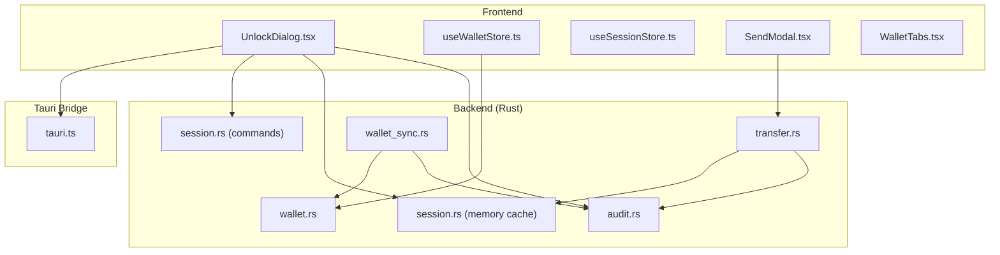
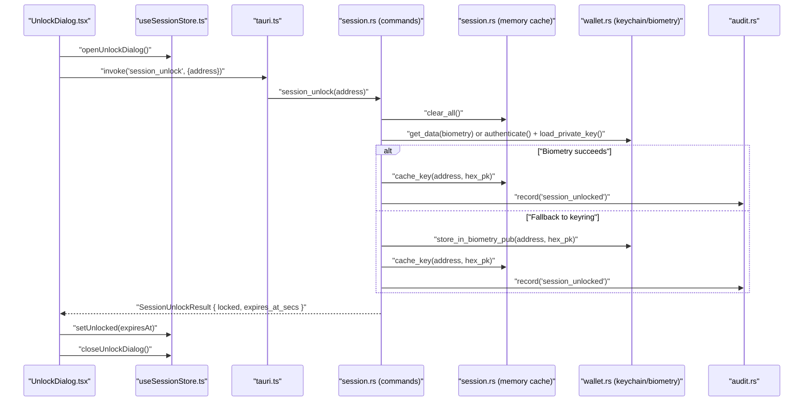
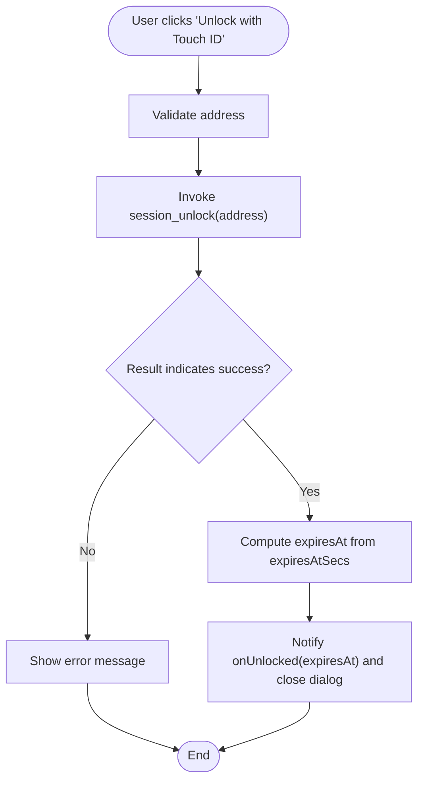
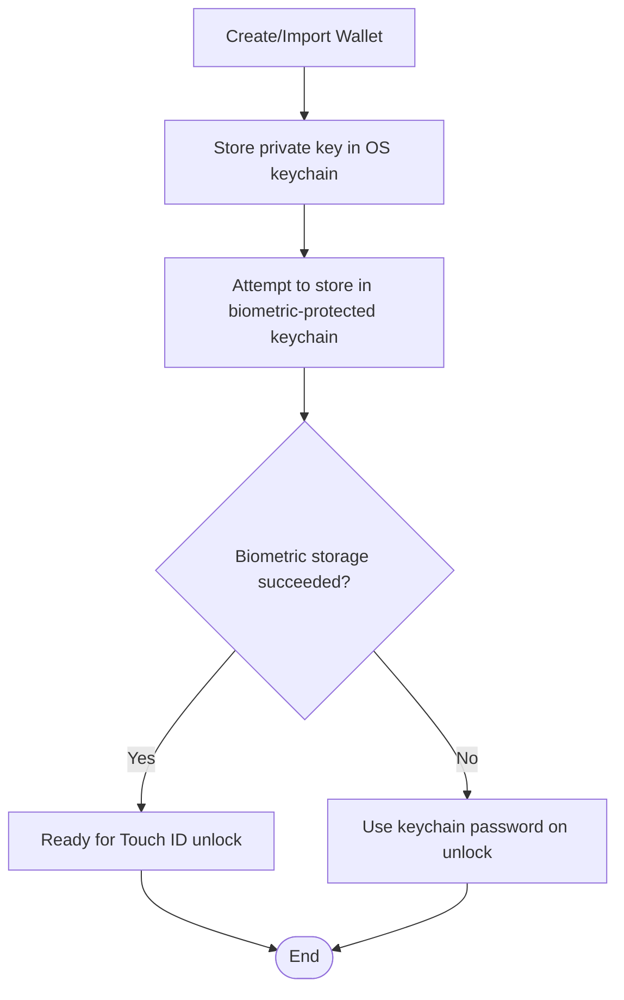
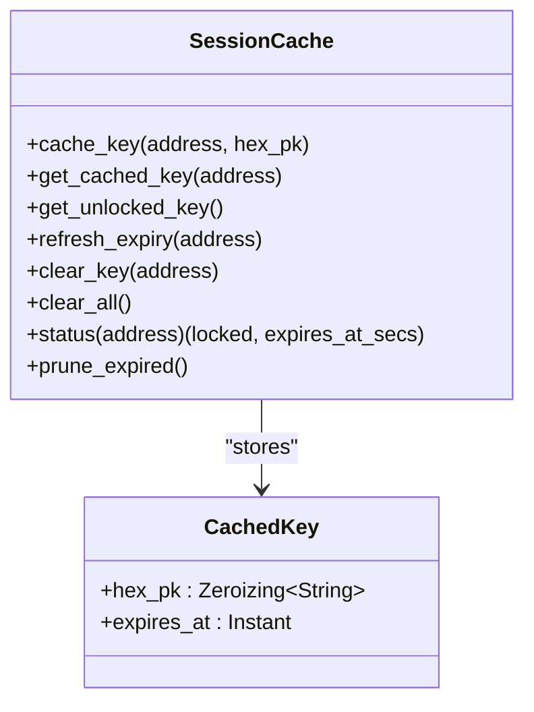
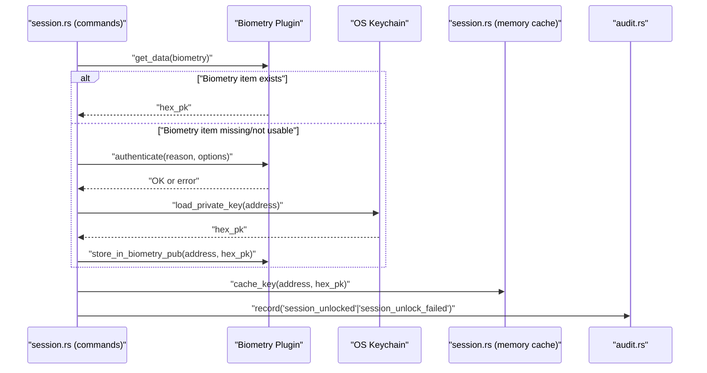
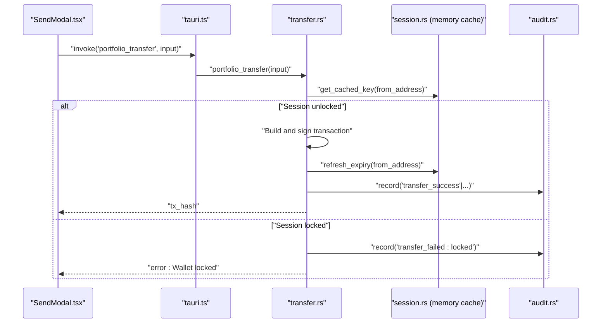
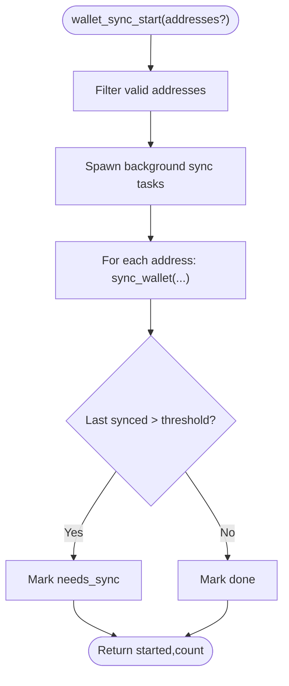
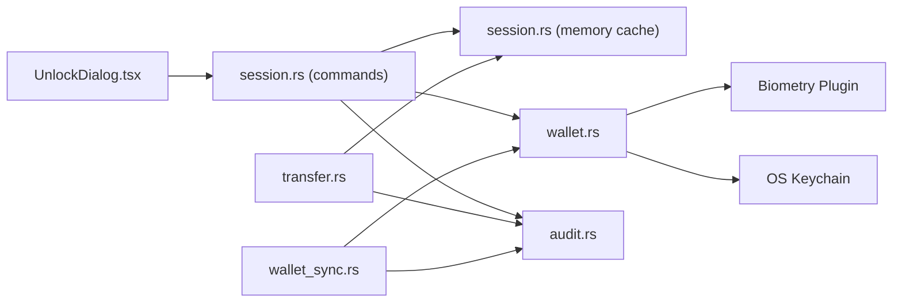

# Authentication and Security

<cite>
**Referenced Files in This Document**
- [UnlockDialog.tsx](file://src/components/wallet/UnlockDialog.tsx)
- [useWalletStore.ts](file://src/store/useWalletStore.ts)
- [useSessionStore.ts](file://src/store/useSessionStore.ts)
- [tauri.ts](file://src/lib/tauri.ts)
- [wallet.rs](file://src-tauri/src/commands/wallet.rs)
- [session.rs](file://src-tauri/src/session.rs)
- [session.rs (commands)](file://src-tauri/src/commands/session.rs)
- [wallet.ts (types)](file://src/types/wallet.ts)
- [audit.rs](file://src-tauri/src/services/audit.rs)
- [wallet_sync.rs](file://src-tauri/src/commands/wallet_sync.rs)
- [transfer.rs](file://src-tauri/src/commands/transfer.rs)
- [SendModal.tsx](file://src/components/portfolio/SendModal.tsx)
- [WalletTabs.tsx](file://src/components/wallet/WalletTabs.tsx)
</cite>

## Table of Contents
1. [Introduction](#introduction)
2. [Project Structure](#project-structure)
3. [Core Components](#core-components)
4. [Architecture Overview](#architecture-overview)
5. [Detailed Component Analysis](#detailed-component-analysis)
6. [Dependency Analysis](#dependency-analysis)
7. [Performance Considerations](#performance-considerations)
8. [Troubleshooting Guide](#troubleshooting-guide)
9. [Security Hardening and Threat Mitigation](#security-hardening-and-threat-mitigation)
10. [Incident Response Procedures](#incident-response-procedures)
11. [Conclusion](#conclusion)

## Introduction
This document explains the wallet authentication and security mechanisms in the project. It covers the UnlockDialog component, password verification, and biometric authentication integration. It documents OS keychain integration for secure credential storage, encryption of sensitive wallet data, and secure memory management. It also details the authentication workflow, session management, and timeout handling, along with the security architecture for protecting private keys, transaction signing security, and protection against common attacks. Additional topics include wallet sync security, encrypted backup procedures, and audit logging. Finally, it provides guidance for security hardening, threat mitigation, and incident response procedures.

## Project Structure
The authentication and security logic spans both the frontend (React + Tauri bindings) and the backend (Rust Tauri plugins):
- Frontend components manage user interactions (unlock dialog, wallet selection).
- Stores coordinate session state and wallet lists.
- Backend commands implement secure key storage, biometric unlock, session caching, and audit logging.
- Transfer and sync commands enforce session locks and use secure memory.

**Diagram sources**
- [UnlockDialog.tsx:1-102](file://src/components/wallet/UnlockDialog.tsx#L1-L102)
- [useWalletStore.ts:1-48](file://src/store/useWalletStore.ts#L1-L48)
- [useSessionStore.ts:1-28](file://src/store/useSessionStore.ts#L1-L28)
- [tauri.ts:1-4](file://src/lib/tauri.ts#L1-L4)
- [wallet.rs:1-284](file://src-tauri/src/commands/wallet.rs#L1-L284)
- [session.rs (commands):1-155](file://src-tauri/src/commands/session.rs#L1-L155)
- [session.rs:1-145](file://src-tauri/src/session.rs#L1-L145)
- [audit.rs:1-25](file://src-tauri/src/services/audit.rs#L1-L25)
- [transfer.rs:1-242](file://src-tauri/src/commands/transfer.rs#L1-L242)
- [wallet_sync.rs:1-90](file://src-tauri/src/commands/wallet_sync.rs#L1-L90)
- [SendModal.tsx:113-150](file://src/components/portfolio/SendModal.tsx#L113-L150)
- [WalletTabs.tsx:1-153](file://src/components/wallet/WalletTabs.tsx#L1-L153)

**Section sources**
- [UnlockDialog.tsx:1-102](file://src/components/wallet/UnlockDialog.tsx#L1-L102)
- [useWalletStore.ts:1-48](file://src/store/useWalletStore.ts#L1-L48)
- [useSessionStore.ts:1-28](file://src/store/useSessionStore.ts#L1-L28)
- [tauri.ts:1-4](file://src/lib/tauri.ts#L1-L4)
- [wallet.rs:1-284](file://src-tauri/src/commands/wallet.rs#L1-L284)
- [session.rs (commands):1-155](file://src-tauri/src/commands/session.rs#L1-L155)
- [session.rs:1-145](file://src-tauri/src/session.rs#L1-L145)
- [audit.rs:1-25](file://src-tauri/src/services/audit.rs#L1-L25)
- [transfer.rs:1-242](file://src-tauri/src/commands/transfer.rs#L1-L242)
- [wallet_sync.rs:1-90](file://src-tauri/src/commands/wallet_sync.rs#L1-L90)
- [SendModal.tsx:113-150](file://src/components/portfolio/SendModal.tsx#L113-L150)
- [WalletTabs.tsx:1-153](file://src/components/wallet/WalletTabs.tsx#L1-L153)

## Core Components
- UnlockDialog: Presents a user interface to unlock the wallet via biometrics or fallback authentication, invoking backend session unlock commands and updating session state.
- Session Store: Tracks whether the session is locked/unlocked, expiry time, and active address.
- Wallet Store: Manages wallet addresses and active wallet selection, invoking backend wallet listing commands.
- Backend Wallet Commands: Create/import wallets, store private keys in OS keychain, optionally in biometric-protected storage, and maintain a plaintext address list for convenience.
- Session Commands: Implement biometric unlock with Touch ID, authenticate fallback, migrate keyring entries to biometry, and record audit events.
- Memory Session Cache: Securely caches decrypted private keys in memory with strict inactivity timeouts and zeroization.
- Transfer Commands: Enforce session lock during transaction signing and refresh session expiry upon success.
- Audit Service: Records security-relevant events with timestamps and optional details.
- Sync Commands: Provide wallet sync status and background sync initiation with stale detection.

**Section sources**
- [UnlockDialog.tsx:27-58](file://src/components/wallet/UnlockDialog.tsx#L27-L58)
- [useSessionStore.ts:16-27](file://src/store/useSessionStore.ts#L16-L27)
- [useWalletStore.ts:16-47](file://src/store/useWalletStore.ts#L16-L47)
- [wallet.rs:128-161](file://src-tauri/src/commands/wallet.rs#L128-L161)
- [session.rs (commands):61-125](file://src-tauri/src/commands/session.rs#L61-L125)
- [session.rs:60-93](file://src-tauri/src/session.rs#L60-L93)
- [transfer.rs:78-160](file://src-tauri/src/commands/transfer.rs#L78-L160)
- [audit.rs:5-24](file://src-tauri/src/services/audit.rs#L5-L24)
- [wallet_sync.rs:34-89](file://src-tauri/src/commands/wallet_sync.rs#L34-L89)

## Architecture Overview
The authentication and security architecture integrates frontend UX with backend secure storage and in-memory caching:

**Diagram sources**
- [UnlockDialog.tsx:31-57](file://src/components/wallet/UnlockDialog.tsx#L31-L57)
- [useSessionStore.ts:22-26](file://src/store/useSessionStore.ts#L22-L26)
- [tauri.ts:1-4](file://src/lib/tauri.ts#L1-L4)
- [session.rs (commands):61-125](file://src-tauri/src/commands/session.rs#L61-L125)
- [session.rs:87-93](file://src-tauri/src/session.rs#L87-L93)
- [wallet.rs:134-147](file://src-tauri/src/commands/wallet.rs#L134-L147)
- [audit.rs:5-24](file://src-tauri/src/services/audit.rs#L5-L24)

## Detailed Component Analysis

### UnlockDialog Component
- Purpose: Provides a UI to unlock the active wallet using biometric authentication (Touch ID) with a graceful fallback to OS keychain password. Displays a 30-minute inactivity timeout message and updates session state on success.
- Key behaviors:
  - Validates address input.
  - Invokes the backend session unlock command.
  - Parses the result to compute expiry and notifies parent components.
  - Handles errors and disables controls during unlock attempts.
- Integration points:
  - Calls the session unlock command via the Tauri bridge.
  - Updates the session store with unlock status and expiry.

**Diagram sources**
- [UnlockDialog.tsx:31-57](file://src/components/wallet/UnlockDialog.tsx#L31-L57)
- [session.rs (commands):61-125](file://src-tauri/src/commands/session.rs#L61-L125)

**Section sources**
- [UnlockDialog.tsx:27-58](file://src/components/wallet/UnlockDialog.tsx#L27-L58)
- [session.rs (commands):61-125](file://src-tauri/src/commands/session.rs#L61-L125)

### OS Keychain and Biometric Integration
- Private key storage:
  - Private keys are stored in the OS keychain under a service identifier.
  - Keys can be migrated into biometric-protected storage when available (Touch ID).
  - On development or unsigned builds, biometric storage may fall back to keychain password prompts.
- Address list storage:
  - Addresses are stored in a plaintext JSON file in the app’s data directory to avoid prompting for credentials on startup.
- Migration:
  - Legacy keychain-based address list is migrated to the new file-based storage on first read.

**Diagram sources**
- [wallet.rs:128-161](file://src-tauri/src/commands/wallet.rs#L128-L161)
- [wallet.rs:134-147](file://src-tauri/src/commands/wallet.rs#L134-L147)
- [wallet.rs:88-126](file://src-tauri/src/commands/wallet.rs#L88-L126)

**Section sources**
- [wallet.rs:128-161](file://src-tauri/src/commands/wallet.rs#L128-L161)
- [wallet.rs:88-126](file://src-tauri/src/commands/wallet.rs#L88-L126)

### Session Management and Timeout Handling
- In-memory cache:
  - Private keys are cached in RAM only, with a fixed 30-minute inactivity timeout.
  - On access, expiry is extended; expired entries are pruned automatically.
  - Only one active wallet session is cached at a time.
- Locking:
  - Explicit lock clears the cached key for a specific address or all sessions.
- Unlock flow:
  - On unlock, the cache is cleared, the key is retrieved from biometry or keychain, cached, and audit events are recorded.

**Diagram sources**
- [session.rs:60-93](file://src-tauri/src/session.rs#L60-L93)
- [session.rs:95-107](file://src-tauri/src/session.rs#L95-L107)

**Section sources**
- [session.rs:60-93](file://src-tauri/src/session.rs#L60-L93)
- [session.rs:95-107](file://src-tauri/src/session.rs#L95-L107)

### Authentication Workflow and Audit Logging
- Biometric unlock:
  - Attempt to fetch the key from biometric storage; if unavailable, authenticate and then load from keychain, migrating into biometry for future unlocks.
- Audit events:
  - Successful unlocks, failures, and explicit locking are recorded with timestamps and optional details.

**Diagram sources**
- [session.rs (commands):61-125](file://src-tauri/src/commands/session.rs#L61-L125)
- [wallet.rs:134-147](file://src-tauri/src/commands/wallet.rs#L134-L147)
- [audit.rs:5-24](file://src-tauri/src/services/audit.rs#L5-L24)

**Section sources**
- [session.rs (commands):61-125](file://src-tauri/src/commands/session.rs#L61-L125)
- [audit.rs:5-24](file://src-tauri/src/services/audit.rs#L5-L24)

### Transaction Signing Security
- Enforcement:
  - Transfer commands require a valid, unlocked session; otherwise, they return a locked error.
  - On successful transfer, session expiry is refreshed to extend the inactivity timer.
- Security measures:
  - Private key remains in memory only during signing and is securely wiped after use.
  - Expiry pruning prevents long-lived in-memory exposure.

**Diagram sources**
- [SendModal.tsx:113-150](file://src/components/portfolio/SendModal.tsx#L113-L150)
- [transfer.rs:78-160](file://src-tauri/src/commands/transfer.rs#L78-L160)
- [session.rs:48-57](file://src-tauri/src/session.rs#L48-L57)
- [audit.rs:5-24](file://src-tauri/src/services/audit.rs#L5-L24)

**Section sources**
- [SendModal.tsx:113-150](file://src/components/portfolio/SendModal.tsx#L113-L150)
- [transfer.rs:78-160](file://src-tauri/src/commands/transfer.rs#L78-L160)
- [session.rs:48-57](file://src-tauri/src/session.rs#L48-L57)

### Wallet Sync Security
- Staleness detection:
  - Sync status considers a wallet stale if the last sync exceeds a threshold (e.g., five minutes).
- Background execution:
  - Sync tasks are spawned per wallet address; each task performs chain-specific queries and updates local state.
- Audit:
  - Sync events are auditable through the audit service.

**Diagram sources**
- [wallet_sync.rs:59-89](file://src-tauri/src/commands/wallet_sync.rs#L59-L89)
- [wallet_sync.rs:34-57](file://src-tauri/src/commands/wallet_sync.rs#L34-L57)

**Section sources**
- [wallet_sync.rs:34-89](file://src-tauri/src/commands/wallet_sync.rs#L34-L89)

### Encrypted Backup Procedures
- Scope:
  - Backups are prepared and uploaded with encryption; metadata and status are recorded in local database.
- Audit:
  - Backup events are auditable with details such as scope and status.

[No sources needed since this section provides general guidance derived from referenced files]

## Dependency Analysis
The authentication and security subsystem exhibits clear separation of concerns:
- Frontend components depend on Tauri bridges to invoke backend commands.
- Backend commands depend on:
  - Biometry plugin for Touch ID.
  - OS keychain for secure storage.
  - In-memory session cache for short-term key availability.
  - Audit service for event logging.

**Diagram sources**
- [UnlockDialog.tsx:1-102](file://src/components/wallet/UnlockDialog.tsx#L1-L102)
- [session.rs (commands):1-155](file://src-tauri/src/commands/session.rs#L1-L155)
- [session.rs:1-145](file://src-tauri/src/session.rs#L1-L145)
- [wallet.rs:1-284](file://src-tauri/src/commands/wallet.rs#L1-L284)
- [audit.rs:1-25](file://src-tauri/src/services/audit.rs#L1-L25)
- [transfer.rs:1-242](file://src-tauri/src/commands/transfer.rs#L1-L242)
- [wallet_sync.rs:1-90](file://src-tauri/src/commands/wallet_sync.rs#L1-L90)

**Section sources**
- [session.rs (commands):1-155](file://src-tauri/src/commands/session.rs#L1-L155)
- [session.rs:1-145](file://src-tauri/src/session.rs#L1-L145)
- [wallet.rs:1-284](file://src-tauri/src/commands/wallet.rs#L1-L284)
- [audit.rs:1-25](file://src-tauri/src/services/audit.rs#L1-L25)
- [transfer.rs:1-242](file://src-tauri/src/commands/transfer.rs#L1-L242)
- [wallet_sync.rs:1-90](file://src-tauri/src/commands/wallet_sync.rs#L1-L90)

## Performance Considerations
- In-memory caching minimizes repeated OS keychain access and biometric prompts, improving responsiveness.
- Pruning expired entries prevents memory bloat and ensures timely cleanup.
- Background sync tasks avoid blocking the UI and reduce repeated network calls by leveraging staleness thresholds.

[No sources needed since this section provides general guidance]

## Troubleshooting Guide
Common issues and resolutions:
- Unlock fails or cancelled:
  - Biometric failure or user cancellation is handled gracefully; the system records an audit event and prompts the user to retry or use the password fallback.
- Wallet locked during transfer:
  - The transfer command returns a locked error; the UI should trigger the unlock dialog.
- No addresses shown:
  - Wallet list invocation may fail; the store sets empty state and selects a safe fallback.

**Section sources**
- [session.rs (commands):82-115](file://src-tauri/src/commands/session.rs#L82-L115)
- [transfer.rs:96-99](file://src-tauri/src/commands/transfer.rs#L96-L99)
- [useWalletStore.ts:23-37](file://src/store/useWalletStore.ts#L23-L37)

## Security Hardening and Threat Mitigation
- Private key lifecycle:
  - Private keys are stored in OS keychain and optionally in biometric-protected storage. They are cached in memory only and securely wiped on lock or app exit.
- Session timeouts:
  - 30-minute inactivity timeout reduces exposure windows; expiry is refreshed on successful operations.
- Audit logging:
  - All unlock attempts, successes/failures, and locking actions are logged with timestamps and details for forensic analysis.
- Input validation:
  - Addresses and amounts are validated before signing transactions to prevent malformed requests.
- Sync staleness:
  - Sync status checks prevent unnecessary polling and reduce risk of stale data usage.

[No sources needed since this section provides general guidance]

## Incident Response Procedures
- Detect:
  - Monitor audit logs for unlock failures, authentication cancellations, and transfer failures.
- Isolate:
  - Clear session cache and force re-unlock for affected accounts.
- Remediate:
  - Re-import or recreate keys if compromised; ensure biometric migration is performed.
- Recover:
  - Use wallet sync to restore recent states; verify balances and transaction history.
- Review:
  - Conduct post-incident analysis and update policies or configurations as needed.

[No sources needed since this section provides general guidance]

## Conclusion
The system combines OS keychain-backed storage, biometric authentication, and secure in-memory session caching to protect private keys while maintaining usability. The frontend unlock dialog integrates seamlessly with backend commands to provide a smooth user experience, while strict session timeouts and audit logging support robust security and compliance. Transaction signing enforces session locks and extends session expiry on success, and sync and backup procedures incorporate staleness checks and encryption. Together, these mechanisms form a comprehensive security architecture suitable for production environments.