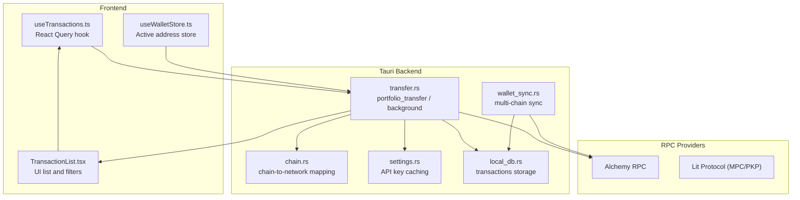
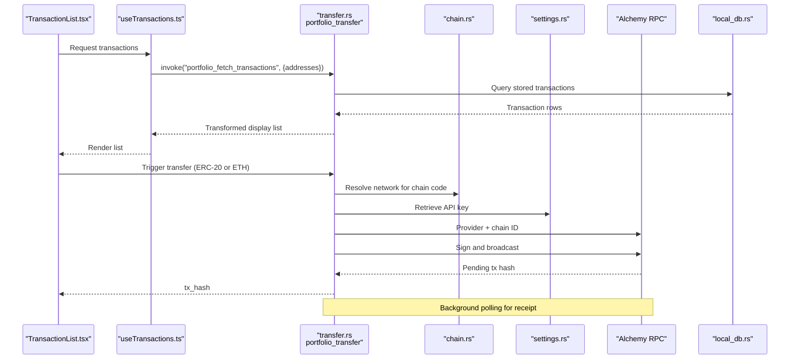
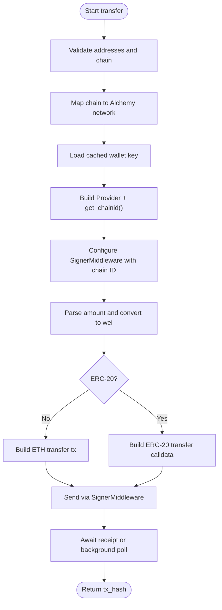
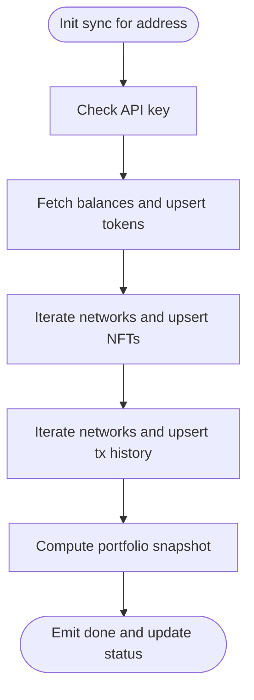
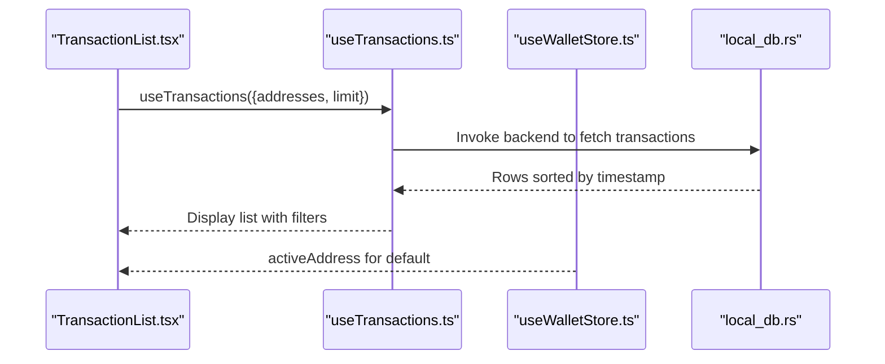
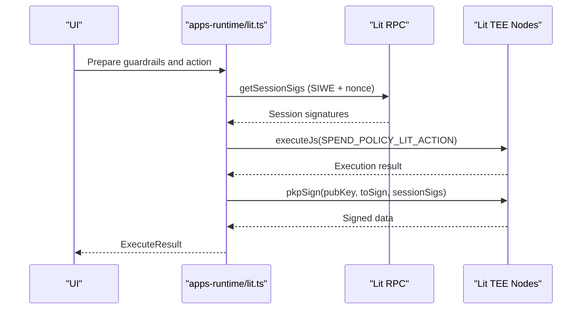
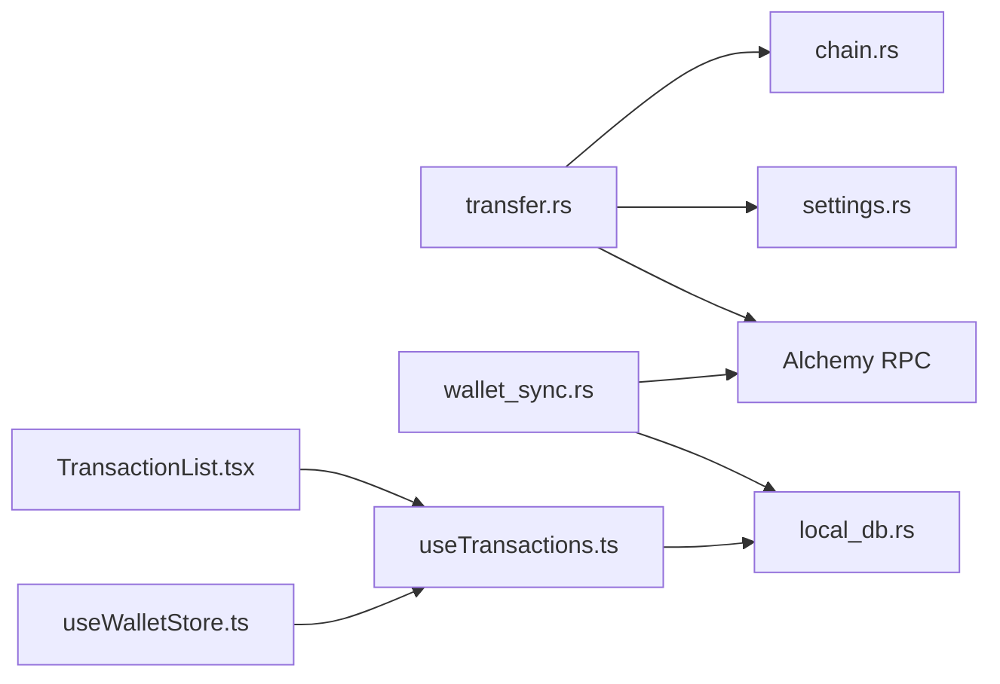

# Transaction Processing

<cite>
**Referenced Files in This Document**
- [transfer.rs](file://src-tauri/src/commands/transfer.rs)
- [wallet_sync.rs](file://src-tauri/src/services/wallet_sync.rs)
- [chain.rs](file://src-tauri/src/services/chain.rs)
- [settings.rs](file://src-tauri/src/services/settings.rs)
- [useTransactions.ts](file://src/hooks/useTransactions.ts)
- [useWalletStore.ts](file://src/store/useWalletStore.ts)
- [TransactionList.tsx](file://src/components/portfolio/TransactionList.tsx)
- [lit.ts](file://apps-runtime/src/providers/lit.ts)
- [local_db.rs](file://src-tauri/src/services/local_db.rs)
</cite>

## Table of Contents
1. [Introduction](#introduction)
2. [Project Structure](#project-structure)
3. [Core Components](#core-components)
4. [Architecture Overview](#architecture-overview)
5. [Detailed Component Analysis](#detailed-component-analysis)
6. [Dependency Analysis](#dependency-analysis)
7. [Performance Considerations](#performance-considerations)
8. [Troubleshooting Guide](#troubleshooting-guide)
9. [Conclusion](#conclusion)

## Introduction
This document explains the transaction processing and signing workflows across the application. It covers wallet integration with blockchain networks, transaction construction, signing and broadcasting, synchronization across multiple chains, balance and transaction monitoring, RPC provider integration, fee considerations, simulation and error handling, retry mechanisms, security considerations (including replay attack prevention and privacy), and practical examples and troubleshooting guidance.

## Project Structure
The transaction pipeline spans frontend React components, Tauri backend commands, and supporting services:
- Frontend hooks and UI components query and render transactions and manage wallet selection.
- Tauri commands orchestrate transaction construction, signing, and broadcasting via RPC providers.
- Services manage chain mapping, settings (API keys), wallet synchronization, and local storage of transactions.

**Diagram sources**
- [transfer.rs:1-280](file://src-tauri/src/commands/transfer.rs#L1-L280)
- [chain.rs:1-90](file://src-tauri/src/services/chain.rs#L1-L90)
- [settings.rs:1-243](file://src-tauri/src/services/settings.rs#L1-L243)
- [wallet_sync.rs:1-453](file://src-tauri/src/services/wallet_sync.rs#L1-L453)
- [useTransactions.ts:1-48](file://src/hooks/useTransactions.ts#L1-L48)
- [useWalletStore.ts:1-48](file://src/store/useWalletStore.ts#L1-L48)
- [TransactionList.tsx:1-170](file://src/components/portfolio/TransactionList.tsx#L1-L170)
- [local_db.rs:1599-1642](file://src-tauri/src/services/local_db.rs#L1599-L1642)

**Section sources**
- [transfer.rs:1-280](file://src-tauri/src/commands/transfer.rs#L1-L280)
- [chain.rs:1-90](file://src-tauri/src/services/chain.rs#L1-L90)
- [settings.rs:1-243](file://src-tauri/src/services/settings.rs#L1-L243)
- [wallet_sync.rs:1-453](file://src-tauri/src/services/wallet_sync.rs#L1-L453)
- [useTransactions.ts:1-48](file://src/hooks/useTransactions.ts#L1-L48)
- [useWalletStore.ts:1-48](file://src/store/useWalletStore.ts#L1-L48)
- [TransactionList.tsx:1-170](file://src/components/portfolio/TransactionList.tsx#L1-L170)
- [local_db.rs:1599-1642](file://src-tauri/src/services/local_db.rs#L1599-L1642)

## Core Components
- Transaction construction and signing:
  - Native EVM transfers (ETH and ERC-20) via Alchemy RPC and local wallet keys.
  - Background confirmation polling and event emission.
- Multi-chain synchronization:
  - Fetch tokens, NFTs, and transaction history across supported networks.
  - Snapshot and portfolio tracking.
- Frontend monitoring:
  - Query and filter transactions, show block explorer links.
- Security integrations:
  - Optional MPC/PKP signing via Lit Protocol for guarded transactions.

**Section sources**
- [transfer.rs:78-160](file://src-tauri/src/commands/transfer.rs#L78-L160)
- [transfer.rs:162-279](file://src-tauri/src/commands/transfer.rs#L162-L279)
- [wallet_sync.rs:260-452](file://src-tauri/src/services/wallet_sync.rs#L260-L452)
- [useTransactions.ts:23-47](file://src/hooks/useTransactions.ts#L23-L47)
- [TransactionList.tsx:39-169](file://src/components/portfolio/TransactionList.tsx#L39-L169)
- [lit.ts:195-353](file://apps-runtime/src/providers/lit.ts#L195-L353)

## Architecture Overview
End-to-end transaction flow from UI to blockchain and back:

**Diagram sources**
- [transfer.rs:78-160](file://src-tauri/src/commands/transfer.rs#L78-L160)
- [transfer.rs:162-279](file://src-tauri/src/commands/transfer.rs#L162-L279)
- [chain.rs:9-23](file://src-tauri/src/services/chain.rs#L9-L23)
- [settings.rs:197-200](file://src-tauri/src/services/settings.rs#L197-L200)
- [local_db.rs:1599-1642](file://src-tauri/src/services/local_db.rs#L1599-L1642)
- [TransactionList.tsx:125-159](file://src/components/portfolio/TransactionList.tsx#L125-L159)

## Detailed Component Analysis

### Transaction Construction and Signing (EVM)
- Input validation and chain mapping:
  - Validates addresses and chain identifiers, resolves Alchemy network names.
- RPC provider and chain ID:
  - Builds HTTP provider from Alchemy endpoint and fetches chain ID to configure signer.
- Amount conversion:
  - Converts human-readable amounts to wei using token decimals.
- Transaction types:
  - ETH transfers: native value transfer.
  - ERC-20 transfers: ABI-encoded transfer calldata with selector.
- Signing and broadcasting:
  - Uses a local wallet configured with chain ID and sends via middleware.
- Receipt and confirmation:
  - Waits for transaction receipt; background variant polls and emits confirmation events.

**Diagram sources**
- [transfer.rs:78-160](file://src-tauri/src/commands/transfer.rs#L78-L160)
- [transfer.rs:162-279](file://src-tauri/src/commands/transfer.rs#L162-L279)

**Section sources**
- [transfer.rs:78-160](file://src-tauri/src/commands/transfer.rs#L78-L160)
- [transfer.rs:162-279](file://src-tauri/src/commands/transfer.rs#L162-L279)

### Multi-chain Wallet Synchronization
- Networks:
  - Base sets of mainnet/testnet networks plus optional Flow EVM when tool is ready.
- Steps:
  - Tokens: fetch balances and upsert into local DB; compute portfolio snapshots.
  - NFTs: iterate networks, fetch NFTs via Alchemy, upsert into local DB.
  - Transactions: iterate networks, call Alchemy’s asset transfers API, upsert into local DB.
- Progress and completion:
  - Emits progress and completion events; updates sync status timestamps.
- Post-sync:
  - Computes portfolio snapshots and refreshes opportunities.

**Diagram sources**
- [wallet_sync.rs:260-452](file://src-tauri/src/services/wallet_sync.rs#L260-L452)

**Section sources**
- [wallet_sync.rs:10-28](file://src-tauri/src/services/wallet_sync.rs#L10-L28)
- [wallet_sync.rs:260-452](file://src-tauri/src/services/wallet_sync.rs#L260-L452)

### Frontend Transaction Monitoring
- Query:
  - React Query hook invokes backend to fetch transactions for selected addresses.
- Display:
  - Filters by chain and category; renders block explorer links.
- Stores:
  - Active wallet address selection is managed in a persistent store.

**Diagram sources**
- [useTransactions.ts:23-47](file://src/hooks/useTransactions.ts#L23-L47)
- [useWalletStore.ts:23-43](file://src/store/useWalletStore.ts#L23-L43)
- [local_db.rs:1599-1642](file://src-tauri/src/services/local_db.rs#L1599-L1642)

**Section sources**
- [useTransactions.ts:23-47](file://src/hooks/useTransactions.ts#L23-L47)
- [useWalletStore.ts:23-43](file://src/store/useWalletStore.ts#L23-L43)
- [TransactionList.tsx:39-169](file://src/components/portfolio/TransactionList.tsx#L39-L169)
- [local_db.rs:1599-1642](file://src-tauri/src/services/local_db.rs#L1599-L1642)

### MPC and PKP Signing via Lit Protocol
- Guardrails review:
  - Enforces per-trade/daily limits, approval thresholds, protocol whitelists.
- Session signatures:
  - Generates session signatures with expiration and SIWE message for Lit Action execution.
- MPC signing:
  - Executes a Lit Action and performs PKP signature off-chain in trusted execution environments.

**Diagram sources**
- [lit.ts:195-353](file://apps-runtime/src/providers/lit.ts#L195-L353)

**Section sources**
- [lit.ts:195-353](file://apps-runtime/src/providers/lit.ts#L195-L353)

## Dependency Analysis
- Commands depend on:
  - Chain mapping service for network resolution.
  - Settings service for API key retrieval.
  - RPC provider for chain ID and signing/broadcasting.
- Synchronization depends on:
  - Alchemy endpoints for balances, NFTs, and asset transfers.
  - Local DB for persistence and snapshots.
- Frontend depends on:
  - Backend commands for transaction queries and UI stores for active address.

**Diagram sources**
- [transfer.rs:78-160](file://src-tauri/src/commands/transfer.rs#L78-L160)
- [transfer.rs:162-279](file://src-tauri/src/commands/transfer.rs#L162-L279)
- [chain.rs:9-23](file://src-tauri/src/services/chain.rs#L9-L23)
- [settings.rs:197-200](file://src-tauri/src/services/settings.rs#L197-L200)
- [wallet_sync.rs:260-452](file://src-tauri/src/services/wallet_sync.rs#L260-L452)
- [useTransactions.ts:23-47](file://src/hooks/useTransactions.ts#L23-L47)
- [TransactionList.tsx:39-169](file://src/components/portfolio/TransactionList.tsx#L39-L169)
- [useWalletStore.ts:23-43](file://src/store/useWalletStore.ts#L23-L43)
- [local_db.rs:1599-1642](file://src-tauri/src/services/local_db.rs#L1599-L1642)

**Section sources**
- [transfer.rs:78-160](file://src-tauri/src/commands/transfer.rs#L78-L160)
- [wallet_sync.rs:260-452](file://src-tauri/src/services/wallet_sync.rs#L260-L452)
- [useTransactions.ts:23-47](file://src/hooks/useTransactions.ts#L23-L47)
- [TransactionList.tsx:39-169](file://src/components/portfolio/TransactionList.tsx#L39-L169)
- [useWalletStore.ts:23-43](file://src/store/useWalletStore.ts#L23-L43)
- [local_db.rs:1599-1642](file://src-tauri/src/services/local_db.rs#L1599-L1642)

## Performance Considerations
- RPC batching and retries:
  - Use exponential backoff when polling receipts or fetching NFTs/transactions.
- Pagination:
  - Respect page sizes and counts for Alchemy endpoints to avoid timeouts.
- Local caching:
  - Persist transactions and snapshots to reduce repeated network calls.
- Concurrency:
  - Parallelize network requests across chains during sync, but bound concurrency to avoid rate limits.
- Gas optimization:
  - Prefer dynamic fees where supported; monitor base fee and priority fee trends.
  - Avoid unnecessary calldata size for ERC-20 transfers.

[No sources needed since this section provides general guidance]

## Troubleshooting Guide
Common issues and remedies:
- Missing API key:
  - Ensure Alchemy API key is set in settings; the app caches it per session.
- Invalid amount or decimals:
  - Verify numeric input and token decimals; amounts must be finite and positive.
- Unsupported chain:
  - Confirm chain code is supported; check mapping to network names.
- Wallet locked or missing key:
  - Unlock or restore session; ensure cached key exists for the address.
- Transaction dropped or timeout:
  - Background confirmation polls for up to a fixed number of seconds; consider increasing wait or adjusting polling interval.
- No transactions shown:
  - Trigger wallet sync to populate local DB; confirm address is active and synced.

**Section sources**
- [settings.rs:197-200](file://src-tauri/src/services/settings.rs#L197-L200)
- [transfer.rs:28-52](file://src-tauri/src/commands/transfer.rs#L28-L52)
- [transfer.rs:116-125](file://src-tauri/src/commands/transfer.rs#L116-L125)
- [transfer.rs:91-92](file://src-tauri/src/commands/transfer.rs#L91-L92)
- [transfer.rs:96-100](file://src-tauri/src/commands/transfer.rs#L96-L100)
- [transfer.rs:244-279](file://src-tauri/src/commands/transfer.rs#L244-L279)
- [wallet_sync.rs:261-274](file://src-tauri/src/services/wallet_sync.rs#L261-L274)

## Conclusion
The system integrates frontend monitoring with robust backend transaction processing, multi-chain synchronization, and optional MPC signing. By validating inputs, leveraging RPC providers, persisting data locally, and emitting progress and completion events, it provides a reliable foundation for transaction construction, signing, and monitoring across multiple chains. Security is strengthened through guardrails and MPC/PKP signing, while performance and reliability benefit from caching, pagination, and bounded concurrency.