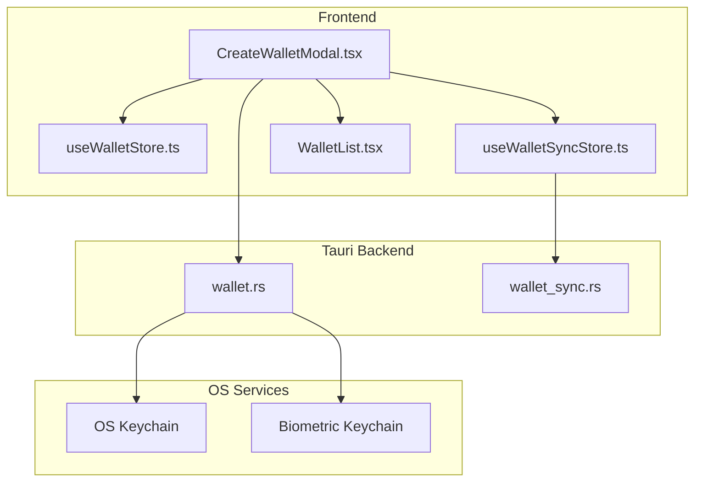
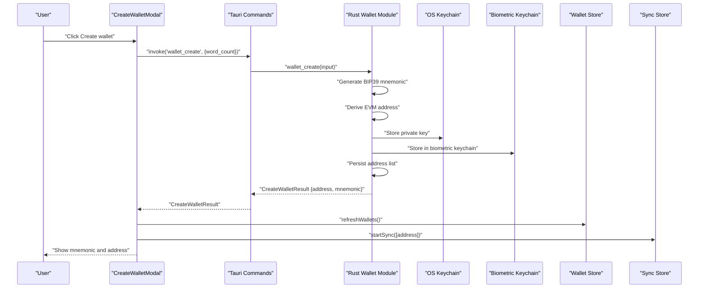
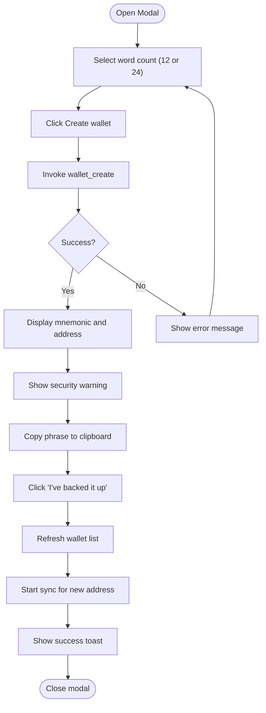
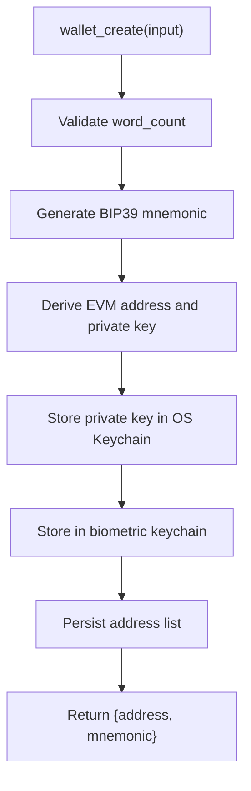
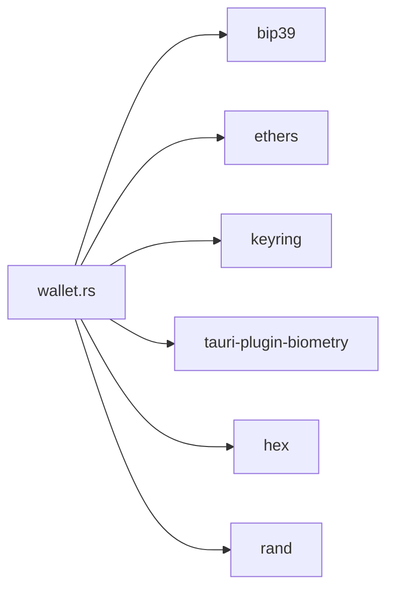

# New Wallet Generation

<cite>
**Referenced Files in This Document**
- [CreateWalletModal.tsx](file://src/components/wallet/CreateWalletModal.tsx)
- [wallet.rs](file://src-tauri/src/commands/wallet.rs)
- [Cargo.toml](file://src-tauri/Cargo.toml)
- [wallet.ts](file://src/types/wallet.ts)
- [useWalletStore.ts](file://src/store/useWalletStore.ts)
- [useWalletSyncStore.ts](file://src/store/useWalletSyncStore.ts)
- [WalletList.tsx](file://src/components/wallet/WalletList.tsx)
- [Step4Vault.tsx](file://src/components/onboarding/steps/Step4Vault.tsx)
- [wallet_sync.rs](file://src-tauri/src/commands/wallet_sync.rs)
</cite>

## Table of Contents
1. [Introduction](#introduction)
2. [Project Structure](#project-structure)
3. [Core Components](#core-components)
4. [Architecture Overview](#architecture-overview)
5. [Detailed Component Analysis](#detailed-component-analysis)
6. [Dependency Analysis](#dependency-analysis)
7. [Performance Considerations](#performance-considerations)
8. [Troubleshooting Guide](#troubleshooting-guide)
9. [Conclusion](#conclusion)

## Introduction
This document explains the new wallet generation process in the application, focusing on the CreateWalletModal interface, cryptographic generation of recovery phrases, BIP39 standard compliance, secure storage in the OS keychain, and the end-to-end user experience from generation to backup verification. It also covers error handling, security warnings, and integration with the wallet synchronization pipeline.

## Project Structure
The wallet generation feature spans React frontend components and Rust backend commands:
- Frontend: CreateWalletModal orchestrates user interaction and invokes backend commands via Tauri.
- Backend: wallet.rs implements wallet_create, wallet_import_mnemonic, wallet_import_private_key, and manages OS keychain storage and biometric protection.
- Stores: useWalletStore and useWalletSyncStore manage wallet lists and post-creation sync orchestration.
- Types: wallet.ts defines the contract between frontend and backend for wallet operations.

**Diagram sources**
- [CreateWalletModal.tsx:24-70](file://src/components/wallet/CreateWalletModal.tsx#L24-L70)
- [wallet.rs:169-200](file://src-tauri/src/commands/wallet.rs#L169-L200)
- [useWalletStore.ts:23-37](file://src/store/useWalletStore.ts#L23-L37)
- [useWalletSyncStore.ts:64-72](file://src/store/useWalletSyncStore.ts#L64-L72)
- [WalletList.tsx:18-35](file://src/components/wallet/WalletList.tsx#L18-L35)
- [wallet_sync.rs:59-89](file://src-tauri/src/commands/wallet_sync.rs#L59-L89)

**Section sources**
- [CreateWalletModal.tsx:1-169](file://src/components/wallet/CreateWalletModal.tsx#L1-L169)
- [wallet.rs:1-284](file://src-tauri/src/commands/wallet.rs#L1-L284)
- [wallet.ts:1-59](file://src/types/wallet.ts#L1-L59)
- [useWalletStore.ts:1-48](file://src/store/useWalletStore.ts#L1-L48)
- [useWalletSyncStore.ts:1-199](file://src/store/useWalletSyncStore.ts#L1-L199)
- [WalletList.tsx:1-76](file://src/components/wallet/WalletList.tsx#L1-L76)
- [wallet_sync.rs:1-89](file://src-tauri/src/commands/wallet_sync.rs#L1-L89)

## Core Components
- CreateWalletModal: Presents the generation UI, collects word count selection, invokes wallet_create, displays the generated mnemonic, and handles confirmation and post-creation sync.
- wallet.rs (wallet_create): Generates a BIP39 mnemonic, derives the EVM address, stores the private key in OS Keychain and biometric keychain, persists the address list, and returns the mnemonic and address.
- useWalletStore: Refreshes the wallet list after creation and maintains active wallet selection.
- useWalletSyncStore: Starts background sync for newly created wallets.
- WalletList: Lists created wallets and supports copy/remove actions.
- Types: Defines CreateWalletResult and related structures for cross-boundary communication.

**Section sources**
- [CreateWalletModal.tsx:24-70](file://src/components/wallet/CreateWalletModal.tsx#L24-L70)
- [wallet.rs:169-200](file://src-tauri/src/commands/wallet.rs#L169-L200)
- [useWalletStore.ts:23-37](file://src/store/useWalletStore.ts#L23-L37)
- [useWalletSyncStore.ts:64-72](file://src/store/useWalletSyncStore.ts#L64-L72)
- [WalletList.tsx:18-35](file://src/components/wallet/WalletList.tsx#L18-L35)
- [wallet.ts:3-6](file://src/types/wallet.ts#L3-L6)

## Architecture Overview
The wallet generation flow integrates frontend UX with secure backend operations:
- The modal triggers wallet_create with a selected word count (12 or 24).
- The backend generates a BIP39 mnemonic, derives the wallet, and securely stores the private key.
- The frontend updates the wallet list and starts background sync for the new address.

**Diagram sources**
- [CreateWalletModal.tsx:33-62](file://src/components/wallet/CreateWalletModal.tsx#L33-L62)
- [wallet.rs:169-200](file://src-tauri/src/commands/wallet.rs#L169-L200)
- [useWalletStore.ts:23-37](file://src/store/useWalletStore.ts#L23-L37)
- [useWalletSyncStore.ts:64-72](file://src/store/useWalletSyncStore.ts#L64-L72)

## Detailed Component Analysis

### CreateWalletModal: User Experience and Workflow
- State management: Tracks word count selection, loading state, errors, and the generation result.
- Generation flow: Invokes wallet_create with the chosen word count and sets the result upon success.
- Backup display: Shows the mnemonic phrase, a prominent security warning, copy-to-clipboard action, and the derived address.
- Confirmation: Refreshes wallet list, starts sync for the new address, shows a success toast, and closes the modal.

**Diagram sources**
- [CreateWalletModal.tsx:24-70](file://src/components/wallet/CreateWalletModal.tsx#L24-L70)

**Section sources**
- [CreateWalletModal.tsx:24-70](file://src/components/wallet/CreateWalletModal.tsx#L24-L70)

### Backend: wallet_create and Secure Storage
- BIP39 compliance: Uses bip39::Mnemonic with English language and validates word counts (12 or 24).
- EVM derivation: Builds a LocalWallet from the mnemonic and extracts the address and private key bytes.
- OS keychain storage: Stores the private key in the OS keychain under a service-specific entry.
- Biometric keychain: Optionally stores the key in a biometric-protected keychain domain for Touch ID support.
- Address persistence: Maintains a JSON file of addresses in the app’s data directory for quick access without prompting.

**Diagram sources**
- [wallet.rs:169-200](file://src-tauri/src/commands/wallet.rs#L169-L200)
- [wallet.rs:128-161](file://src-tauri/src/commands/wallet.rs#L128-L161)
- [wallet.rs:81-126](file://src-tauri/src/commands/wallet.rs#L81-L126)

**Section sources**
- [wallet.rs:169-200](file://src-tauri/src/commands/wallet.rs#L169-L200)
- [wallet.rs:128-161](file://src-tauri/src/commands/wallet.rs#L128-L161)
- [wallet.rs:81-126](file://src-tauri/src/commands/wallet.rs#L81-L126)

### Integration with OS Keychain and Biometric Protection
- OS Keychain: Private keys are stored in the OS keychain with a service identifier and per-address entries. Retrieval triggers OS prompts when needed.
- Biometric Keychain: On supported platforms, keys can be stored in a biometric-protected domain. On unsigned or development builds, fallback to OS keychain password may occur.
- Address list: Stored in a plain JSON file to avoid frequent OS prompts while still enabling fast wallet enumeration.

**Section sources**
- [wallet.rs:128-161](file://src-tauri/src/commands/wallet.rs#L128-L161)
- [wallet.rs:81-126](file://src-tauri/src/commands/wallet.rs#L81-L126)

### Post-Creation Sync and Wallet List Updates
- Wallet list refresh: After creation, the frontend calls wallet_list to update the UI and select the new wallet if needed.
- Background sync: The sync store initiates background sync for the new wallet address to populate portfolio data.
- Wallet list UI: Displays addresses with copy and remove actions.

**Section sources**
- [useWalletStore.ts:23-37](file://src/store/useWalletStore.ts#L23-L37)
- [useWalletSyncStore.ts:64-72](file://src/store/useWalletSyncStore.ts#L64-L72)
- [WalletList.tsx:18-35](file://src/components/wallet/WalletList.tsx#L18-L35)

### Backup Instructions and Validation
- Backup instructions: The modal emphasizes never sharing the mnemonic and shows a security warning prominently.
- Copy-to-clipboard: Provides a one-click copy action for the mnemonic.
- Onboarding comparison: The onboarding vault step demonstrates a similar backup workflow with acknowledgment and copy actions.

**Section sources**
- [CreateWalletModal.tsx:93-120](file://src/components/wallet/CreateWalletModal.tsx#L93-L120)
- [Step4Vault.tsx:212-232](file://src/components/onboarding/steps/Step4Vault.tsx#L212-L232)

### Error Handling and Security Warnings
- Frontend error handling: Catches exceptions from wallet_create and displays user-friendly messages.
- Backend error types: Invalid mnemonic/private key, keychain errors, and not-found conditions are surfaced to the frontend.
- Security warnings: The modal displays a prominent warning about never sharing the mnemonic.

**Section sources**
- [CreateWalletModal.tsx:33-46](file://src/components/wallet/CreateWalletModal.tsx#L33-L46)
- [wallet.rs:18-28](file://src-tauri/src/commands/wallet.rs#L18-L28)
- [CreateWalletModal.tsx:95-101](file://src/components/wallet/CreateWalletModal.tsx#L95-L101)

## Dependency Analysis
The wallet generation feature relies on external libraries and OS services:
- bip39: For BIP39 mnemonic generation and validation.
- ethers: For EVM wallet derivation and signing utilities.
- keyring: For OS keychain integration.
- tauri-plugin-biometry: For biometric keychain storage.
- rand and hex: For secure randomness and encoding.

**Diagram sources**
- [wallet.rs:5-11](file://src-tauri/src/commands/wallet.rs#L5-L11)
- [Cargo.toml:20-44](file://src-tauri/Cargo.toml#L20-L44)

**Section sources**
- [Cargo.toml:20-44](file://src-tauri/Cargo.toml#L20-L44)
- [wallet.rs:5-11](file://src-tauri/src/commands/wallet.rs#L5-L11)

## Performance Considerations
- Mnemonic generation: BIP39 generation is CPU-lightweight and deterministic; performance impact is negligible.
- Keychain operations: OS keychain writes/read operations are asynchronous and may prompt the user depending on platform policies.
- Sync initialization: Background sync is started asynchronously after creation to avoid blocking the UI.

## Troubleshooting Guide
Common issues and resolutions:
- Generation failure:
  - Symptom: Error message appears after clicking Create wallet.
  - Causes: Invalid word count, OS keychain unavailable, or internal errors.
  - Resolution: Verify word count selection (12 or 24), ensure OS keychain is accessible, and retry.
- OS keychain prompts:
  - Symptom: OS password prompt appears when accessing private keys.
  - Cause: Fallback to OS keychain password when biometric storage fails or is unavailable.
  - Resolution: Complete the OS prompt; consider enabling biometric keychain if supported.
- Sync not starting:
  - Symptom: No immediate portfolio data after creation.
  - Cause: Sync may be delayed or already running.
  - Resolution: Allow time for background sync; the sync store ignores repeated start attempts.
- Address not appearing:
  - Symptom: Newly created wallet does not appear in the list.
  - Cause: Address list not yet persisted or refresh failed.
  - Resolution: Trigger a manual refresh or restart the app; the store refreshes on demand.

**Section sources**
- [CreateWalletModal.tsx:33-46](file://src/components/wallet/CreateWalletModal.tsx#L33-L46)
- [wallet.rs:128-161](file://src-tauri/src/commands/wallet.rs#L128-L161)
- [useWalletSyncStore.ts:64-72](file://src/store/useWalletSyncStore.ts#L64-L72)
- [useWalletStore.ts:23-37](file://src/store/useWalletStore.ts#L23-L37)

## Conclusion
The new wallet generation process combines a user-friendly modal with robust cryptographic and secure storage practices. It adheres to BIP39 standards, stores private keys securely in the OS keychain and biometric keychain, and integrates seamlessly with the wallet list and background sync systems. The design emphasizes security warnings, backup instructions, and resilient error handling to ensure a safe and reliable user experience.