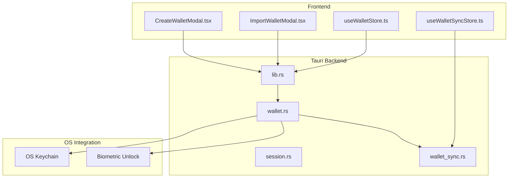
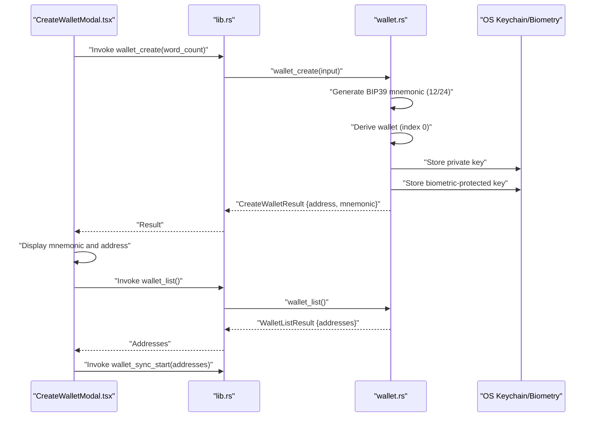
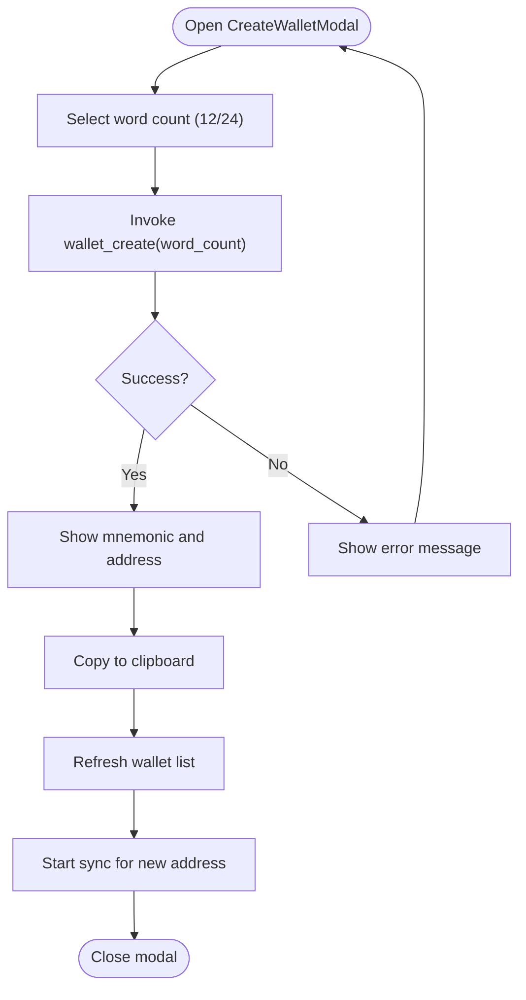
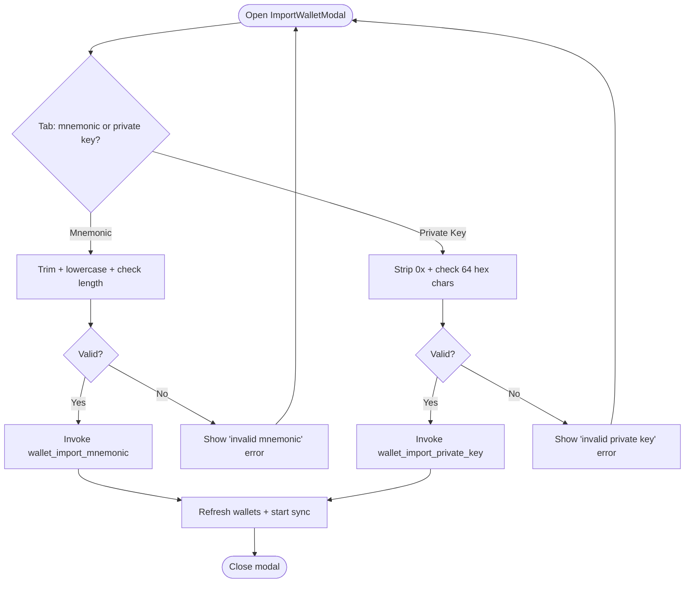
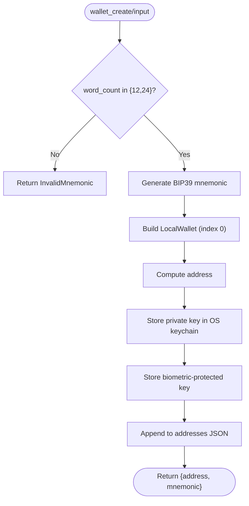
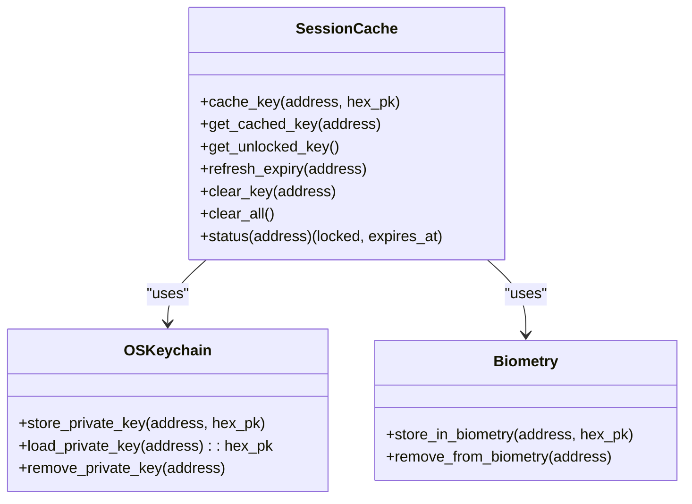
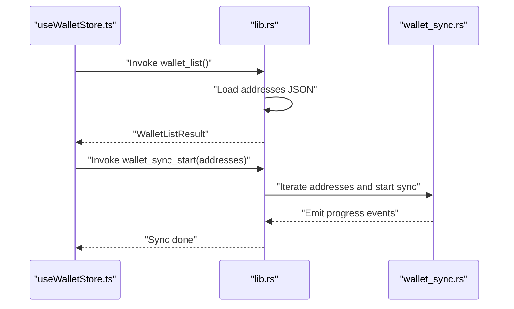
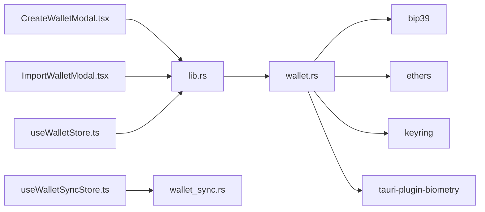

# Wallet Creation and Recovery

<cite>
**Referenced Files in This Document**
- [CreateWalletModal.tsx](file://src/components/wallet/CreateWalletModal.tsx)
- [ImportWalletModal.tsx](file://src/components/wallet/ImportWalletModal.tsx)
- [wallet.rs](file://src-tauri/src/commands/wallet.rs)
- [session.rs](file://src-tauri/src/session.rs)
- [wallet_sync.rs](file://src-tauri/src/services/wallet_sync.rs)
- [useWalletStore.ts](file://src/store/useWalletStore.ts)
- [useWalletSyncStore.ts](file://src/store/useWalletSyncStore.ts)
- [lib.rs](file://src-tauri/src/lib.rs)
- [wallet.ts](file://src/types/wallet.ts)
</cite>

## Table of Contents
1. [Introduction](#introduction)
2. [Project Structure](#project-structure)
3. [Core Components](#core-components)
4. [Architecture Overview](#architecture-overview)
5. [Detailed Component Analysis](#detailed-component-analysis)
6. [Dependency Analysis](#dependency-analysis)
7. [Performance Considerations](#performance-considerations)
8. [Troubleshooting Guide](#troubleshooting-guide)
9. [Conclusion](#conclusion)

## Introduction
This document explains the wallet creation and recovery workflows in the application. It covers how new wallets are generated with secure entropy, how recovery phrases and private keys are imported, and how the system integrates with the operating system keychain for secure storage. It also documents the post-creation sync process, error handling, and security best practices for both creation and recovery.

## Project Structure
The wallet functionality spans React UI components, a Tauri backend, and supporting stores and services:
- Frontend UI: Create and import modals invoke Tauri commands.
- Backend: Wallet commands implement seed generation, derivation, and secure storage.
- Stores: Persist and expose wallet lists and sync state.
- Services: Background synchronization of portfolio data.

**Diagram sources**
- [CreateWalletModal.tsx:24-168](file://src/components/wallet/CreateWalletModal.tsx#L24-L168)
- [ImportWalletModal.tsx:35-181](file://src/components/wallet/ImportWalletModal.tsx#L35-L181)
- [lib.rs:90-130](file://src-tauri/src/lib.rs#L90-L130)
- [wallet.rs:169-284](file://src-tauri/src/commands/wallet.rs#L169-L284)
- [session.rs:1-145](file://src-tauri/src/session.rs#L1-L145)
- [wallet_sync.rs:260-453](file://src-tauri/src/services/wallet_sync.rs#L260-L453)
- [useWalletStore.ts:16-47](file://src/store/useWalletStore.ts#L16-L47)
- [useWalletSyncStore.ts:45-73](file://src/store/useWalletSyncStore.ts#L45-L73)

**Section sources**
- [CreateWalletModal.tsx:1-169](file://src/components/wallet/CreateWalletModal.tsx#L1-L169)
- [ImportWalletModal.tsx:1-181](file://src/components/wallet/ImportWalletModal.tsx#L1-L181)
- [lib.rs:90-130](file://src-tauri/src/lib.rs#L90-L130)

## Core Components
- CreateWalletModal: Generates a new EVM wallet, displays the mnemonic, and triggers background sync.
- ImportWalletModal: Imports via 12-/24-word mnemonic or hex private key, validates inputs, and triggers sync.
- Wallet backend commands: Generate mnemonics, derive addresses, store keys securely, and list wallets.
- Session cache: Manages short-lived in-memory access to decrypted keys.
- Wallet sync service: Background sync of tokens, NFTs, and transactions.

**Section sources**
- [CreateWalletModal.tsx:24-168](file://src/components/wallet/CreateWalletModal.tsx#L24-L168)
- [ImportWalletModal.tsx:35-181](file://src/components/wallet/ImportWalletModal.tsx#L35-L181)
- [wallet.rs:169-284](file://src-tauri/src/commands/wallet.rs#L169-L284)
- [session.rs:1-145](file://src-tauri/src/session.rs#L1-L145)
- [wallet_sync.rs:260-453](file://src-tauri/src/services/wallet_sync.rs#L260-L453)

## Architecture Overview
End-to-end flow for creation and recovery:
- UI invokes Tauri commands.
- Backend generates/derives keys, persists address list, and stores private key in OS keychain.
- Optional biometric protection is applied where supported.
- Wallet list is refreshed and background sync is initiated.

**Diagram sources**
- [CreateWalletModal.tsx:33-62](file://src/components/wallet/CreateWalletModal.tsx#L33-L62)
- [lib.rs:99-100](file://src-tauri/src/lib.rs#L99-L100)
- [wallet.rs:169-200](file://src-tauri/src/commands/wallet.rs#L169-L200)
- [useWalletStore.ts:23-37](file://src/store/useWalletStore.ts#L23-L37)
- [wallet_sync.rs:260-289](file://src-tauri/src/services/wallet_sync.rs#L260-L289)

## Detailed Component Analysis

### CreateWalletModal
- Purpose: Generate a new EVM wallet with a configurable mnemonic length (12 or 24 words).
- Workflow:
  - User selects word count.
  - Calls the wallet_create Tauri command with selected word count.
  - Displays mnemonic and address.
  - Copies mnemonic to clipboard via toast notification.
  - Refreshes wallet list and starts background sync for the new address.
- Security considerations:
  - Mnemonic is shown once; user must back it up securely.
  - Address is displayed for confirmation.
- Error handling:
  - Catches invocation errors and surfaces messages to the user.

**Diagram sources**
- [CreateWalletModal.tsx:33-62](file://src/components/wallet/CreateWalletModal.tsx#L33-L62)
- [useWalletStore.ts:23-37](file://src/store/useWalletStore.ts#L23-L37)
- [wallet_sync.rs:260-289](file://src-tauri/src/services/wallet_sync.rs#L260-L289)

**Section sources**
- [CreateWalletModal.tsx:24-168](file://src/components/wallet/CreateWalletModal.tsx#L24-L168)
- [wallet.ts:3-6](file://src/types/wallet.ts#L3-L6)

### ImportWalletModal
- Purpose: Import an existing wallet either via a 12-/24-word mnemonic or a hex private key.
- Validation:
  - Mnemonic: trimmed, lowercased, validated for length (12 or 24 words).
  - Private key: stripped of optional 0x prefix, must be 64 hex characters.
- Workflow:
  - Validates input based on selected tab.
  - Invokes wallet_import_mnemonic or wallet_import_private_key.
  - Refreshes wallet list and starts sync for the imported address.
- Error handling:
  - Displays specific validation and import errors.

**Diagram sources**
- [ImportWalletModal.tsx:51-94](file://src/components/wallet/ImportWalletModal.tsx#L51-L94)
- [wallet.rs:202-258](file://src-tauri/src/commands/wallet.rs#L202-L258)
- [useWalletStore.ts:23-37](file://src/store/useWalletStore.ts#L23-L37)
- [wallet_sync.rs:260-289](file://src-tauri/src/services/wallet_sync.rs#L260-L289)

**Section sources**
- [ImportWalletModal.tsx:35-181](file://src/components/wallet/ImportWalletModal.tsx#L35-L181)
- [wallet.ts:8-10](file://src/types/wallet.ts#L8-L10)

### Backend Wallet Commands (seed generation, derivation, storage)
- Seed generation:
  - Uses BIP39 English dictionary with 12 or 24 words.
  - Derives an EVM wallet at index 0 using the mnemonic.
- Storage:
  - Private key stored in OS keychain under a service-specific entry.
  - Biometric-protected copy stored where supported; on unsigned builds, fallback to keychain password occurs.
- Address list:
  - Public list of addresses persisted to a JSON file in the app’s data directory.
- Error handling:
  - Specific errors for invalid mnemonic/private key and keychain failures.

**Diagram sources**
- [wallet.rs:169-200](file://src-tauri/src/commands/wallet.rs#L169-L200)

**Section sources**
- [wallet.rs:169-200](file://src-tauri/src/commands/wallet.rs#L169-L200)
- [wallet.rs:128-167](file://src-tauri/src/commands/wallet.rs#L128-L167)
- [wallet.rs:81-126](file://src-tauri/src/commands/wallet.rs#L81-L126)

### Session Cache and OS Keychain Integration
- Session cache:
  - Holds decrypted private keys in memory with a 30-minute inactivity expiry.
  - Only one unlocked wallet is cached at a time.
  - Provides helpers to refresh expiry and clear keys.
- OS keychain:
  - Private keys are stored in OS keychain entries per address.
  - Biometric protection is used when available; otherwise, password prompt is required.
- Registration:
  - Wallet commands are registered in the Tauri builder and exposed to the frontend.

**Diagram sources**
- [session.rs:1-145](file://src-tauri/src/session.rs#L1-L145)
- [wallet.rs:128-167](file://src-tauri/src/commands/wallet.rs#L128-L167)
- [lib.rs:90-130](file://src-tauri/src/lib.rs#L90-L130)

**Section sources**
- [session.rs:1-145](file://src-tauri/src/session.rs#L1-L145)
- [wallet.rs:128-167](file://src-tauri/src/commands/wallet.rs#L128-L167)
- [lib.rs:90-130](file://src-tauri/src/lib.rs#L90-L130)

### Wallet List and Sync Orchestration
- Wallet list:
  - Stored in a JSON file; loaded and refreshed via the wallet_list command.
- Sync orchestration:
  - After creation or import, the UI triggers wallet_sync_start.
  - The backend emits progress events and updates local DB snapshots.

**Diagram sources**
- [useWalletStore.ts:23-37](file://src/store/useWalletStore.ts#L23-L37)
- [useWalletSyncStore.ts:64-73](file://src/store/useWalletSyncStore.ts#L64-L73)
- [wallet_sync.rs:260-453](file://src-tauri/src/services/wallet_sync.rs#L260-L453)

**Section sources**
- [useWalletStore.ts:16-47](file://src/store/useWalletStore.ts#L16-L47)
- [useWalletSyncStore.ts:45-73](file://src/store/useWalletSyncStore.ts#L45-L73)
- [wallet_sync.rs:260-453](file://src-tauri/src/services/wallet_sync.rs#L260-L453)

## Dependency Analysis
- Frontend depends on Tauri commands for wallet operations.
- Backend depends on:
  - BIP39 for mnemonic generation.
  - Ethers for wallet derivation and signing.
  - Keyring for OS keychain access.
  - Biometry plugin for touch ID protection.
- Stores depend on Tauri invocations to keep state consistent.

**Diagram sources**
- [CreateWalletModal.tsx:1-169](file://src/components/wallet/CreateWalletModal.tsx#L1-L169)
- [ImportWalletModal.tsx:1-181](file://src/components/wallet/ImportWalletModal.tsx#L1-L181)
- [lib.rs:90-130](file://src-tauri/src/lib.rs#L90-L130)
- [wallet.rs:5-11](file://src-tauri/src/commands/wallet.rs#L5-L11)
- [useWalletStore.ts:1-48](file://src/store/useWalletStore.ts#L1-L48)
- [useWalletSyncStore.ts:1-199](file://src/store/useWalletSyncStore.ts#L1-L199)

**Section sources**
- [lib.rs:20-44](file://src-tauri/src/lib.rs#L20-L44)
- [wallet.rs:5-11](file://src-tauri/src/commands/wallet.rs#L5-L11)

## Performance Considerations
- Background sync is parallelized across networks and wallets, emitting progress updates.
- In-memory session cache avoids repeated OS prompts for the same active wallet.
- Address list persistence avoids frequent keychain reads during normal operation.

[No sources needed since this section provides general guidance]

## Troubleshooting Guide
Common creation errors:
- Invalid word count: Ensure 12 or 24 words are selected.
- Mnemonic generation failure: Indicates entropy or library error; retry after a moment.
- Keychain errors: OS keychain may require a password prompt; ensure biometric availability if using Touch ID.

Common recovery errors:
- Invalid mnemonic: Must be 12 or 24 words, space-separated, lowercase.
- Invalid private key: Must be 64 hex characters with optional 0x prefix.
- Import failures: Verify mnemonic correctness or private key validity.

Security best practices:
- Never share the mnemonic; store offline and encrypted.
- Enable biometric unlock when available.
- Clear clipboard after copying the mnemonic.
- Keep OS keychain unlocked only while actively transacting.

**Section sources**
- [CreateWalletModal.tsx:41-46](file://src/components/wallet/CreateWalletModal.tsx#L41-L46)
- [ImportWalletModal.tsx:54-72](file://src/components/wallet/ImportWalletModal.tsx#L54-L72)
- [wallet.rs:172-174](file://src-tauri/src/commands/wallet.rs#L172-L174)
- [wallet.rs:205-207](file://src-tauri/src/commands/wallet.rs#L205-L207)
- [wallet.rs:238-240](file://src-tauri/src/commands/wallet.rs#L238-L240)

## Conclusion
The wallet creation and recovery system combines secure on-device key generation, robust input validation, and OS-level key storage with optional biometric protection. The UI provides clear feedback and safe handling of sensitive data, while background sync ensures a complete portfolio view. Following the security practices and troubleshooting tips helps maintain safety and reliability.