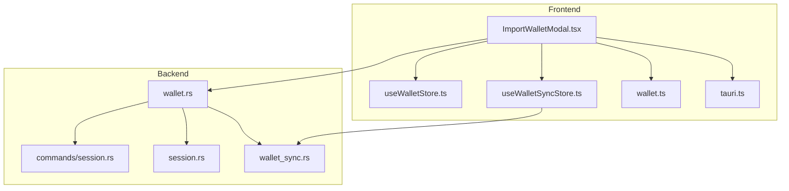
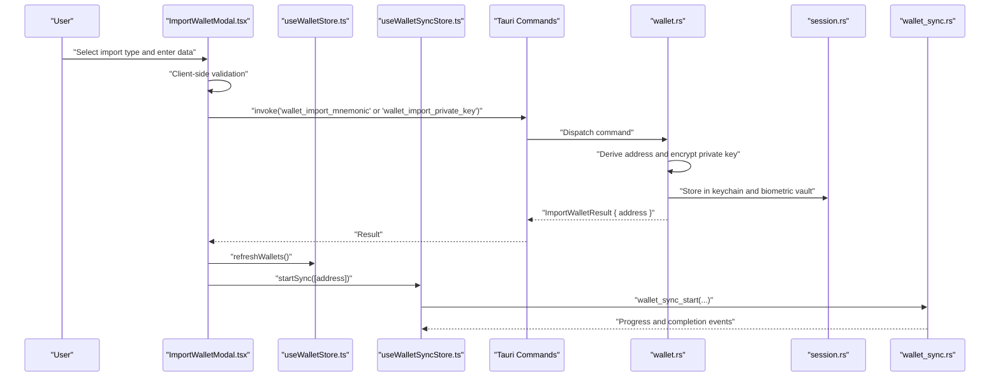
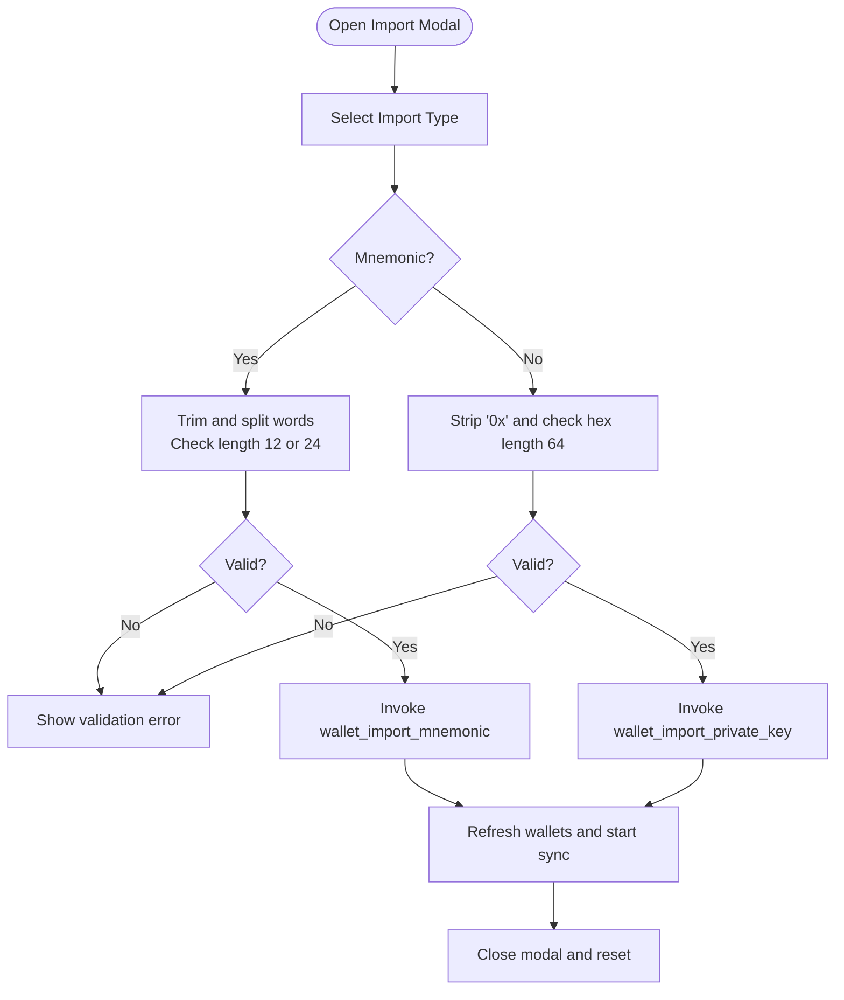
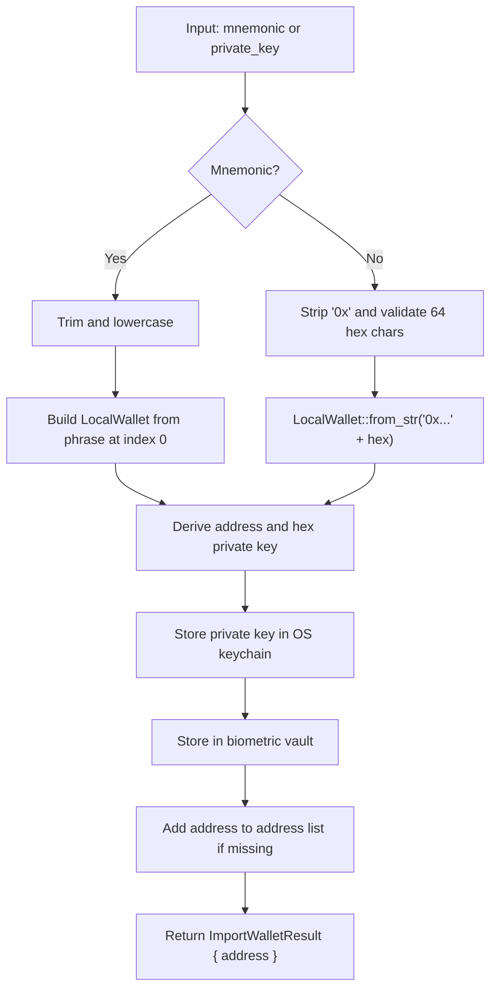
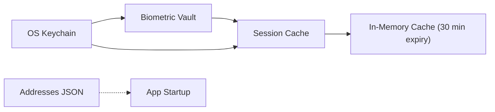
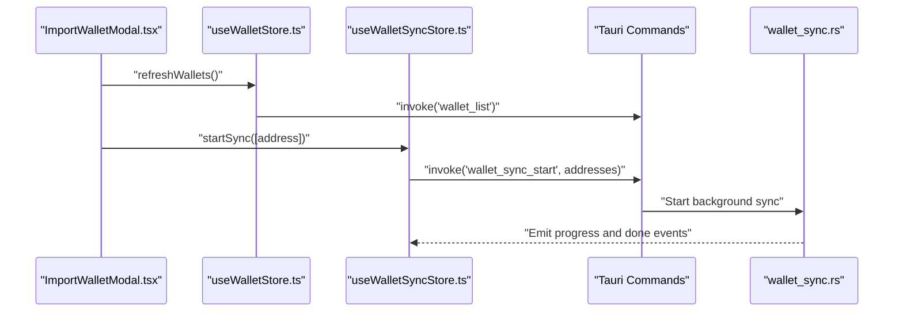
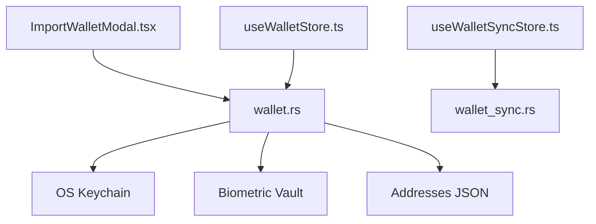

# Wallet Import and Recovery

<cite>
**Referenced Files in This Document**
- [ImportWalletModal.tsx](file://src/components/wallet/ImportWalletModal.tsx)
- [wallet.rs](file://src-tauri/src/commands/wallet.rs)
- [useWalletStore.ts](file://src/store/useWalletStore.ts)
- [useWalletSyncStore.ts](file://src/store/useWalletSyncStore.ts)
- [wallet.ts](file://src/types/wallet.ts)
- [tauri.ts](file://src/lib/tauri.ts)
- [WalletList.tsx](file://src/components/wallet/WalletList.tsx)
- [wallet_sync.rs](file://src-tauri/src/services/wallet_sync.rs)
- [session.rs](file://src-tauri/src/session.rs)
- [session.rs](file://src-tauri/src/commands/session.rs)
</cite>

## Table of Contents
1. [Introduction](#introduction)
2. [Project Structure](#project-structure)
3. [Core Components](#core-components)
4. [Architecture Overview](#architecture-overview)
5. [Detailed Component Analysis](#detailed-component-analysis)
6. [Dependency Analysis](#dependency-analysis)
7. [Performance Considerations](#performance-considerations)
8. [Troubleshooting Guide](#troubleshooting-guide)
9. [Conclusion](#conclusion)

## Introduction
This document explains the wallet import and recovery procedures implemented in the application. It focuses on the ImportWalletModal component, the validation and recovery workflows for mnemonic phrases and private keys, and the backend security mechanisms that protect imported wallets. It also covers the post-import synchronization process, safe storage integration, and common troubleshooting scenarios.

## Project Structure
The wallet import and recovery functionality spans frontend UI components, frontend stores, and backend Rust commands and services:
- Frontend: Import modal, wallet store, and sync listeners
- Backend: Wallet commands (create/import/list/remove), session management, and wallet sync service

**Diagram sources**
- [ImportWalletModal.tsx:35-94](file://src/components/wallet/ImportWalletModal.tsx#L35-L94)
- [useWalletStore.ts:16-47](file://src/store/useWalletStore.ts#L16-L47)
- [useWalletSyncStore.ts:45-73](file://src/store/useWalletSyncStore.ts#L45-L73)
- [wallet.rs:203-258](file://src-tauri/src/commands/wallet.rs#L203-L258)
- [session.rs:68-91](file://src-tauri/src/commands/session.rs#L68-L91)
- [session.rs:1-145](file://src-tauri/src/session.rs#L1-L145)
- [wallet_sync.rs:260-452](file://src-tauri/src/services/wallet_sync.rs#L260-L452)

**Section sources**
- [ImportWalletModal.tsx:1-181](file://src/components/wallet/ImportWalletModal.tsx#L1-L181)
- [wallet.rs:1-284](file://src-tauri/src/commands/wallet.rs#L1-L284)

## Core Components
- ImportWalletModal: Provides a tabbed interface to import via mnemonic phrase or private key, performs basic client-side validation, and invokes backend commands.
- Wallet commands: Implement creation, import, listing, and removal of wallets, and securely store private keys in OS keychain and biometric vault.
- Wallet store: Manages addresses, active address, and wallet names in persistent state.
- Wallet sync store: Starts and listens to wallet synchronization events.
- Session management: Handles in-memory caching of decrypted private keys with expiration and biometric unlock.

**Section sources**
- [ImportWalletModal.tsx:25-94](file://src/components/wallet/ImportWalletModal.tsx#L25-L94)
- [wallet.rs:169-283](file://src-tauri/src/commands/wallet.rs#L169-L283)
- [useWalletStore.ts:16-47](file://src/store/useWalletStore.ts#L16-L47)
- [useWalletSyncStore.ts:45-73](file://src/store/useWalletSyncStore.ts#L45-L73)
- [session.rs:1-145](file://src-tauri/src/session.rs#L1-L145)

## Architecture Overview
The import flow begins in the frontend modal, validates input, and calls backend commands. The backend derives the address, stores the private key securely, and updates the address list. The frontend then refreshes wallet lists and starts synchronization.

**Diagram sources**
- [ImportWalletModal.tsx:51-94](file://src/components/wallet/ImportWalletModal.tsx#L51-L94)
- [wallet.rs:203-258](file://src-tauri/src/commands/wallet.rs#L203-L258)
- [session.rs:1-145](file://src-tauri/src/session.rs#L1-L145)
- [useWalletStore.ts:23-37](file://src/store/useWalletStore.ts#L23-L37)
- [useWalletSyncStore.ts:64-72](file://src/store/useWalletSyncStore.ts#L64-L72)
- [wallet_sync.rs:260-452](file://src-tauri/src/services/wallet_sync.rs#L260-L452)

## Detailed Component Analysis

### ImportWalletModal: Validation and Import Workflow
- Tabs: Two import modes—mnemonic phrase and private key—each with dedicated input fields.
- Client-side validation:
  - Mnemonic: Checks for 12 or 24 words after trimming and lowercasing.
  - Private key: Removes optional 0x prefix and validates 64-character hexadecimal string.
- Backend invocation:
  - Mnemonic import: Calls wallet_import_mnemonic with trimmed phrase.
  - Private key import: Calls wallet_import_private_key with trimmed key.
- Post-import actions:
  - Refresh wallet list.
  - Start synchronization for the new address.
  - Show success toast with derived address.
  - Reset form and close modal.

**Diagram sources**
- [ImportWalletModal.tsx:25-94](file://src/components/wallet/ImportWalletModal.tsx#L25-L94)

**Section sources**
- [ImportWalletModal.tsx:25-94](file://src/components/wallet/ImportWalletModal.tsx#L25-L94)

### Backend Wallet Commands: Import and Storage
- wallet_import_mnemonic:
  - Trims and lowercases the phrase.
  - Builds a LocalWallet from the mnemonic at index 0.
  - Derives address and hex-encoded private key.
  - Stores private key in OS keychain and biometric vault.
  - Adds address to the address list if not present.
  - Returns ImportWalletResult with the derived address.
- wallet_import_private_key:
  - Strips optional 0x prefix and validates 64-character hex.
  - Constructs LocalWallet from the hex private key.
  - Derives address and hex-encoded private key.
  - Stores private key in OS keychain and biometric vault.
  - Adds address to the address list if not present.
  - Returns ImportWalletResult with the derived address.

**Diagram sources**
- [wallet.rs:203-258](file://src-tauri/src/commands/wallet.rs#L203-L258)

**Section sources**
- [wallet.rs:203-258](file://src-tauri/src/commands/wallet.rs#L203-L258)

### Safe Storage and Security
- Private key storage:
  - OS keychain: Secure storage with OS-level protection.
  - Biometric vault: Touch ID/Face ID protected keychain for seamless unlock.
- Address list storage:
  - Plain JSON file in app data directory to avoid prompting for passwords on startup.
- Session management:
  - In-memory cache of decrypted private keys with 30-minute inactivity expiry.
  - Zeroization on clear to prevent memory leaks.
  - Biometric unlock path triggers OS authentication; fallback uses keychain password prompt.

**Diagram sources**
- [wallet.rs:128-167](file://src-tauri/src/commands/wallet.rs#L128-L167)
- [session.rs:1-145](file://src-tauri/src/session.rs#L1-L145)
- [session.rs:68-91](file://src-tauri/src/commands/session.rs#L68-L91)

**Section sources**
- [wallet.rs:128-167](file://src-tauri/src/commands/wallet.rs#L128-L167)
- [session.rs:1-145](file://src-tauri/src/session.rs#L1-L145)
- [session.rs:68-91](file://src-tauri/src/commands/session.rs#L68-L91)

### Wallet List and Sync Integration
- Wallet store:
  - Maintains addresses, active address, and wallet names.
  - refreshWallets invokes wallet_list to update state.
- Wallet sync store:
  - startSync triggers wallet_sync_start with optional address list.
  - Listens to wallet_sync_progress and wallet_sync_done events to update UI and show notifications.

**Diagram sources**
- [useWalletStore.ts:23-37](file://src/store/useWalletStore.ts#L23-L37)
- [useWalletSyncStore.ts:64-72](file://src/store/useWalletSyncStore.ts#L64-L72)
- [wallet_sync.rs:260-452](file://src-tauri/src/services/wallet_sync.rs#L260-L452)

**Section sources**
- [useWalletStore.ts:16-47](file://src/store/useWalletStore.ts#L16-L47)
- [useWalletSyncStore.ts:45-73](file://src/store/useWalletSyncStore.ts#L45-L73)
- [WalletList.tsx:18-35](file://src/components/wallet/WalletList.tsx#L18-L35)

## Dependency Analysis
- Frontend-to-backend:
  - ImportWalletModal invokes wallet_import_mnemonic and wallet_import_private_key.
  - useWalletStore invokes wallet_list.
  - useWalletSyncStore invokes wallet_sync_start.
- Backend-to-storage:
  - Wallet commands store private keys in OS keychain and biometric vault.
  - Address list is persisted to a JSON file.
- Backend-to-sync:
  - wallet_sync.rs emits progress and completion events consumed by useWalletSyncStore.

**Diagram sources**
- [ImportWalletModal.tsx:51-94](file://src/components/wallet/ImportWalletModal.tsx#L51-L94)
- [wallet.rs:203-258](file://src-tauri/src/commands/wallet.rs#L203-L258)
- [useWalletStore.ts:23-37](file://src/store/useWalletStore.ts#L23-L37)
- [useWalletSyncStore.ts:64-72](file://src/store/useWalletSyncStore.ts#L64-L72)
- [wallet_sync.rs:260-452](file://src-tauri/src/services/wallet_sync.rs#L260-L452)

**Section sources**
- [wallet.rs:1-284](file://src-tauri/src/commands/wallet.rs#L1-L284)
- [useWalletSyncStore.ts:1-199](file://src/store/useWalletSyncStore.ts#L1-L199)

## Performance Considerations
- Client-side validation reduces unnecessary backend calls.
- In-memory session cache avoids frequent biometric prompts while keeping keys secure.
- Background sync is asynchronous and emits progress updates to keep UI responsive.
- Address list is stored in a simple JSON file to minimize startup overhead.

[No sources needed since this section provides general guidance]

## Troubleshooting Guide

### Common Import Errors and Fixes
- Invalid mnemonic:
  - Cause: Empty or incorrect word count (must be 12 or 24).
  - Fix: Enter a valid phrase with the correct number of words.
- Invalid private key:
  - Cause: Missing 0x prefix or wrong length/format.
  - Fix: Provide a 64-character hexadecimal string, optionally prefixed with 0x.
- Import command failures:
  - Cause: Backend validation errors or keychain/biometry issues.
  - Fix: Retry after ensuring biometric unlock succeeds; check OS keychain access.

### Recovery Troubleshooting
- Address not appearing after import:
  - Verify wallet_list was invoked and addresses updated.
  - Confirm address list JSON exists and is readable.
- Sync not starting:
  - Ensure wallet_sync_start was called with the correct address.
  - Check for missing ALCHEMY_API_KEY if sync fails early.
- Biometric unlock failures:
  - Authentication failures or lockouts require re-authentication.
  - Fallback to keychain password prompt if biometric item is missing.

### Validation Failure Scenarios
- Mnemonic validation:
  - Trimmed phrase is empty or invalid word count.
- Private key validation:
  - Hex length mismatch or non-hex characters.
- Backend errors:
  - Invalid mnemonic/private key errors raised by wallet commands.
  - Keychain or biometry plugin errors.

**Section sources**
- [ImportWalletModal.tsx:51-94](file://src/components/wallet/ImportWalletModal.tsx#L51-L94)
- [wallet.rs:203-258](file://src-tauri/src/commands/wallet.rs#L203-L258)
- [wallet_sync.rs:260-274](file://src-tauri/src/services/wallet_sync.rs#L260-L274)
- [session.rs:68-91](file://src-tauri/src/commands/session.rs#L68-L91)

## Conclusion
The wallet import and recovery system combines robust client-side validation with secure backend storage and biometric unlock. The ImportWalletModal provides a user-friendly interface for importing via mnemonic or private key, while the backend ensures private keys are encrypted and stored securely. Post-import synchronization keeps user portfolios up to date, and session management maintains a balance between usability and security.