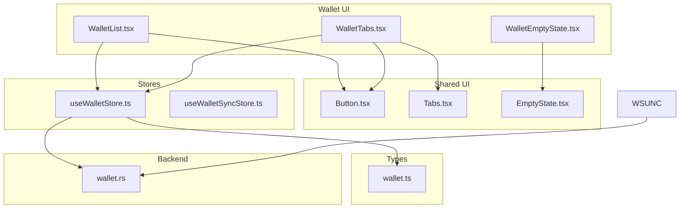
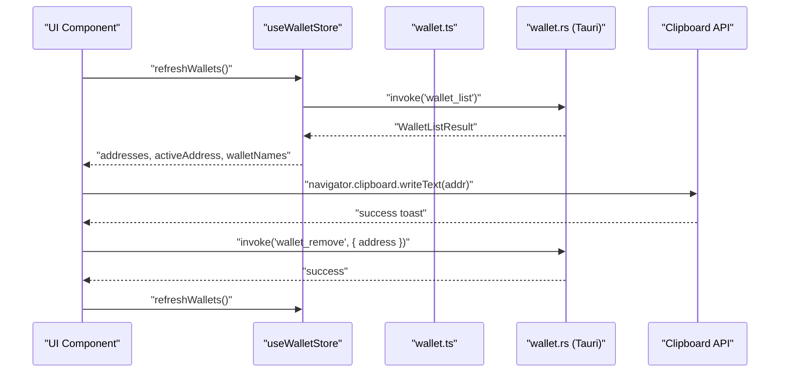
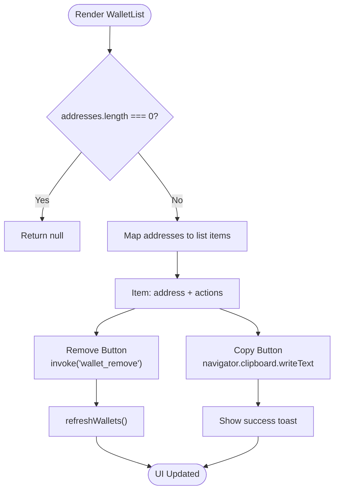
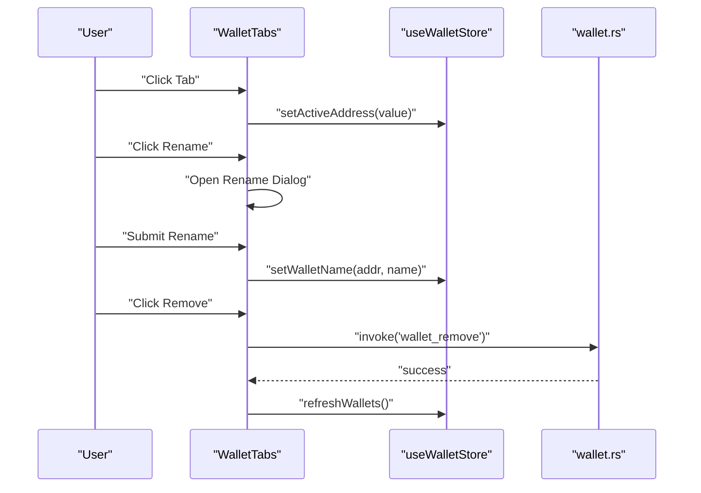
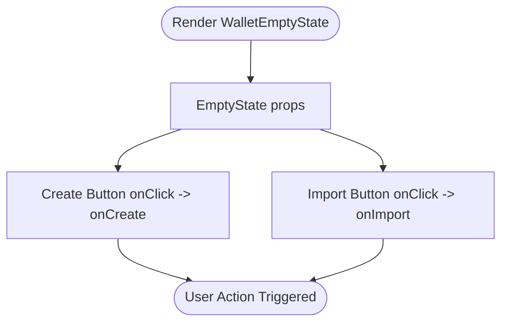
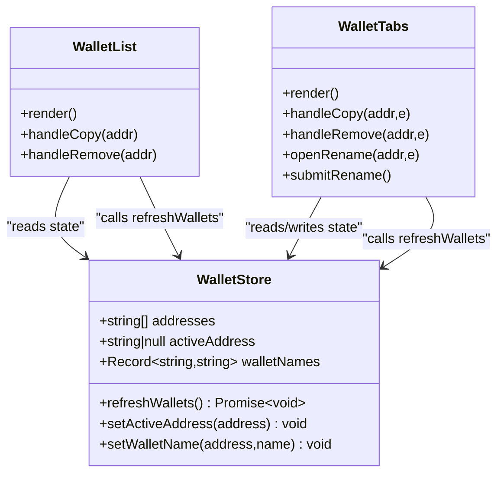
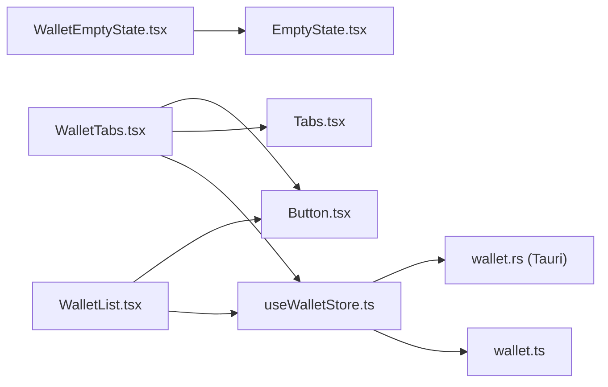

# Wallet Management Interface

<cite>
**Referenced Files in This Document**
- [WalletList.tsx](file://src/components/wallet/WalletList.tsx)
- [WalletTabs.tsx](file://src/components/wallet/WalletTabs.tsx)
- [WalletEmptyState.tsx](file://src/components/wallet/WalletEmptyState.tsx)
- [useWalletStore.ts](file://src/store/useWalletStore.ts)
- [wallet.ts](file://src/types/wallet.ts)
- [tabs.tsx](file://src/components/ui/tabs.tsx)
- [button.tsx](file://src/components/ui/button.tsx)
- [EmptyState.tsx](file://src/components/shared/EmptyState.tsx)
- [CreateWalletModal.tsx](file://src/components/wallet/CreateWalletModal.tsx)
- [ImportWalletModal.tsx](file://src/components/wallet/ImportWalletModal.tsx)
- [WalletSelectorDropdown.tsx](file://src/components/portfolio/WalletSelectorDropdown.tsx)
- [wallet.rs](file://src-tauri/src/commands/wallet.rs)
- [useWalletSyncStore.ts](file://src/store/useWalletSyncStore.ts)
- [routes.tsx](file://src/routes.tsx)
</cite>

## Table of Contents
1. [Introduction](#introduction)
2. [Project Structure](#project-structure)
3. [Core Components](#core-components)
4. [Architecture Overview](#architecture-overview)
5. [Detailed Component Analysis](#detailed-component-analysis)
6. [Dependency Analysis](#dependency-analysis)
7. [Performance Considerations](#performance-considerations)
8. [Accessibility and UX Guidelines](#accessibility-and-ux-guidelines)
9. [Troubleshooting Guide](#troubleshooting-guide)
10. [Conclusion](#conclusion)

## Introduction
This document provides comprehensive documentation for the wallet management interface components. It focuses on three primary UI components: WalletList for displaying and managing wallet addresses, WalletTabs for switching between wallet views and states, and WalletEmptyState for handling empty wallet scenarios. It also covers address formatting with checksum validation, clipboard integration, user interaction patterns, state management integration with the wallet store, and best practices for accessibility, responsive design, and user experience.

## Project Structure
The wallet management UI resides under the wallet directory and integrates with shared UI components and stores. The backend wallet commands are implemented in Tauri for secure key storage and address management.

**Diagram sources**
- [WalletList.tsx:1-76](file://src/components/wallet/WalletList.tsx#L1-L76)
- [WalletTabs.tsx:1-153](file://src/components/wallet/WalletTabs.tsx#L1-L153)
- [WalletEmptyState.tsx:1-41](file://src/components/wallet/WalletEmptyState.tsx#L1-L41)
- [useWalletStore.ts:1-48](file://src/store/useWalletStore.ts#L1-L48)
- [useWalletSyncStore.ts:1-199](file://src/store/useWalletSyncStore.ts#L1-L199)
- [wallet.ts:1-59](file://src/types/wallet.ts#L1-L59)
- [wallet.rs:1-284](file://src-tauri/src/commands/wallet.rs#L1-L284)

**Section sources**
- [routes.tsx:1-33](file://src/routes.tsx#L1-L33)

## Core Components
This section documents the three wallet management components and their responsibilities.

- WalletList: Renders a list of wallet addresses with copy and remove actions. Implements address truncation with checksum validation and integrates with the wallet store and toast notifications.
- WalletTabs: Provides a tabbed interface for switching between wallets, with per-wallet actions (copy, rename, remove) via a dropdown menu. Manages active wallet selection and displays optional wallet names.
- WalletEmptyState: Presents an empty state with call-to-action buttons to create or import wallets, leveraging a shared EmptyState component.

**Section sources**
- [WalletList.tsx:1-76](file://src/components/wallet/WalletList.tsx#L1-L76)
- [WalletTabs.tsx:1-153](file://src/components/wallet/WalletTabs.tsx#L1-L153)
- [WalletEmptyState.tsx:1-41](file://src/components/wallet/WalletEmptyState.tsx#L1-L41)

## Architecture Overview
The wallet management interface follows a unidirectional data flow:
- UI components subscribe to the wallet store for addresses, active address, and wallet names.
- Actions trigger Tauri commands for wallet creation, import, listing, and removal.
- Clipboard integration is handled via the browser API.
- Toast notifications confirm user actions.

**Diagram sources**
- [useWalletStore.ts:23-37](file://src/store/useWalletStore.ts#L23-L37)
- [wallet.ts:12-14](file://src/types/wallet.ts#L12-L14)
- [wallet.rs:260-264](file://src-tauri/src/commands/wallet.rs#L260-L264)
- [WalletList.tsx:22-35](file://src/components/wallet/WalletList.tsx#L22-L35)

## Detailed Component Analysis

### WalletList Component
WalletList renders a vertical list of wallet addresses with two actions per item:
- Copy address to clipboard with a success toast.
- Remove wallet with a backend invocation and subsequent store refresh.

Address formatting and validation:
- Uses checksummed addresses when valid; otherwise falls back to truncation.
- Truncation pattern: first six and last four characters separated by an ellipsis.

User interactions:
- Buttons use ghost styling and small sizes for minimal visual weight.
- Titles provide accessible tooltips for actions.

State management:
- Reads addresses and refreshWallets from the wallet store.
- Calls refreshWallets after successful removal to update the UI.

Clipboard integration:
- Uses navigator.clipboard.writeText for copying.
- Displays a success toast via the toast hook.

**Diagram sources**
- [WalletList.tsx:9-16](file://src/components/wallet/WalletList.tsx#L9-L16)
- [WalletList.tsx:18-76](file://src/components/wallet/WalletList.tsx#L18-L76)
- [useWalletStore.ts:23-37](file://src/store/useWalletStore.ts#L23-L37)

**Section sources**
- [WalletList.tsx:1-76](file://src/components/wallet/WalletList.tsx#L1-L76)

### WalletTabs Component
WalletTabs provides a horizontal tab list for wallet switching:
- Active wallet is highlighted.
- Each tab includes a dropdown menu with actions: copy address, rename, remove.
- Optional wallet names override truncated addresses in the tab labels.

State management:
- Uses addresses, activeAddress, walletNames, setActiveAddress, setWalletName, and refreshWallets from the wallet store.
- Maintains local state for renaming dialog.

Interaction patterns:
- Clicking a tab updates the active wallet.
- Dropdown actions stop propagation to prevent tab activation.
- Rename dialog supports Enter key submission and persistence via setWalletName.

Clipboard integration:
- Copy action writes the address to the clipboard and shows a success toast.

**Diagram sources**
- [WalletTabs.tsx:34-152](file://src/components/wallet/WalletTabs.tsx#L34-L152)
- [useWalletStore.ts:39-43](file://src/store/useWalletStore.ts#L39-L43)
- [wallet.rs:266-283](file://src-tauri/src/commands/wallet.rs#L266-L283)

**Section sources**
- [WalletTabs.tsx:1-153](file://src/components/wallet/WalletTabs.tsx#L1-L153)

### WalletEmptyState Component
WalletEmptyState presents an empty state with two primary actions:
- Create wallet: triggers onCreate callback.
- Import wallet: triggers onImport callback.

Integration:
- Uses a shared EmptyState component to render the icon, title, description, and action button.
- Provides sensible defaults for title and description.

**Diagram sources**
- [WalletEmptyState.tsx:13-40](file://src/components/wallet/WalletEmptyState.tsx#L13-L40)
- [EmptyState.tsx:13-36](file://src/components/shared/EmptyState.tsx#L13-L36)

**Section sources**
- [WalletEmptyState.tsx:1-41](file://src/components/wallet/WalletEmptyState.tsx#L1-L41)

### Address Formatting and Validation
Both WalletList and WalletTabs implement a shared truncation function:
- Attempts to compute a checksummed address using a library.
- On success, truncates to first six and last four characters.
- On failure, falls back to basic truncation if the input is long enough; otherwise returns the original input.

This ensures consistent presentation of addresses while preserving readability and validity checks.

**Section sources**
- [WalletList.tsx:9-16](file://src/components/wallet/WalletList.tsx#L9-L16)
- [WalletTabs.tsx:25-32](file://src/components/wallet/WalletTabs.tsx#L25-L32)
- [WalletSelectorDropdown.tsx:26-33](file://src/components/portfolio/WalletSelectorDropdown.tsx#L26-L33)

### Clipboard Integration
Clipboard operations are performed via the browser’s Clipboard API:
- Copy action writes the raw address to the clipboard.
- Success feedback is provided through a toast notification.
- No sensitive data is written to the clipboard during creation/import flows.

**Section sources**
- [WalletList.tsx:22-25](file://src/components/wallet/WalletList.tsx#L22-L25)
- [WalletTabs.tsx:41-45](file://src/components/wallet/WalletTabs.tsx#L41-L45)
- [WalletSelectorDropdown.tsx:42-46](file://src/components/portfolio/WalletSelectorDropdown.tsx#L42-L46)

### State Management Integration
The wallet store encapsulates:
- Addresses array, active address, and wallet names mapping.
- Methods to refresh addresses, set active address, and set wallet names.
- Persistence of wallet names across sessions.

Backend synchronization:
- refreshWallets invokes a Tauri command to fetch addresses and reconciles the active address if needed.
- Removal operations trigger refreshWallets to keep the UI in sync.

**Diagram sources**
- [useWalletStore.ts:7-47](file://src/store/useWalletStore.ts#L7-L47)
- [WalletList.tsx:18-35](file://src/components/wallet/WalletList.tsx#L18-L35)
- [WalletTabs.tsx:34-72](file://src/components/wallet/WalletTabs.tsx#L34-L72)

**Section sources**
- [useWalletStore.ts:1-48](file://src/store/useWalletStore.ts#L1-L48)

### Backend Integration (Tauri Commands)
The backend implements wallet operations:
- wallet_create: generates a new wallet and persists the private key securely.
- wallet_import_mnemonic/private_key: imports an existing wallet and stores keys securely.
- wallet_list: returns the persisted list of addresses.
- wallet_remove: removes an address and cleans up associated keys.

These commands are invoked from the frontend using the Tauri invoke API, ensuring secure key storage and predictable address lists.

**Section sources**
- [wallet.rs:169-283](file://src-tauri/src/commands/wallet.rs#L169-L283)

## Dependency Analysis
The wallet UI components depend on shared UI primitives and the wallet store. The store depends on Tauri commands for backend operations and exposes a simple API to the UI.

**Diagram sources**
- [WalletList.tsx:1-76](file://src/components/wallet/WalletList.tsx#L1-L76)
- [WalletTabs.tsx:1-153](file://src/components/wallet/WalletTabs.tsx#L1-L153)
- [WalletEmptyState.tsx:1-41](file://src/components/wallet/WalletEmptyState.tsx#L1-L41)
- [useWalletStore.ts:1-48](file://src/store/useWalletStore.ts#L1-L48)
- [wallet.ts:1-59](file://src/types/wallet.ts#L1-L59)
- [wallet.rs:1-284](file://src-tauri/src/commands/wallet.rs#L1-L284)
- [tabs.tsx:1-90](file://src/components/ui/tabs.tsx#L1-L90)
- [button.tsx:1-65](file://src/components/ui/button.tsx#L1-L65)

**Section sources**
- [WalletList.tsx:1-76](file://src/components/wallet/WalletList.tsx#L1-L76)
- [WalletTabs.tsx:1-153](file://src/components/wallet/WalletTabs.tsx#L1-L153)
- [WalletEmptyState.tsx:1-41](file://src/components/wallet/WalletEmptyState.tsx#L1-L41)
- [useWalletStore.ts:1-48](file://src/store/useWalletStore.ts#L1-L48)

## Performance Considerations
- Rendering optimization: WalletList and WalletTabs render only when addresses exist, avoiding unnecessary DOM nodes.
- Minimal re-renders: The wallet store updates only when addresses or active address change.
- Efficient truncation: Address truncation is O(1) string slicing with a checksum validation cost that scales with input length but is bounded.
- Clipboard operations: Asynchronous writeText calls are lightweight and do not block the UI thread.

## Accessibility and UX Guidelines
- Keyboard navigation: Tabs and buttons support keyboard activation and focus indicators via shared UI components.
- Screen reader support: Dropdown triggers include aria-labels and sr-only text for context.
- Visual hierarchy: Consistent use of monospace fonts for addresses improves scanning and reduces errors.
- Feedback: Toast notifications confirm copy and remove actions, improving perceived reliability.
- Responsive design: Components use flexible layouts and appropriate spacing to adapt across screen sizes.

## Troubleshooting Guide
Common issues and resolutions:
- Addresses not updating after removal: Ensure refreshWallets is called after invoking wallet_remove.
- Invalid address format: The truncation function gracefully handles invalid inputs; verify checksum validation is applied before truncation.
- Clipboard failures: Browser policies may restrict clipboard access; ensure the action is triggered by a user gesture.
- Empty state not visible: WalletEmptyState only renders when there are no addresses; verify the store’s addresses array is empty.

**Section sources**
- [WalletList.tsx:27-35](file://src/components/wallet/WalletList.tsx#L27-L35)
- [WalletTabs.tsx:47-56](file://src/components/wallet/WalletTabs.tsx#L47-L56)
- [WalletEmptyState.tsx:36-40](file://src/components/wallet/WalletEmptyState.tsx#L36-L40)

## Conclusion
The wallet management interface provides a cohesive, accessible, and efficient way to manage multiple EVM wallets. The components leverage checksum validation, clipboard integration, and a robust store-backend integration to deliver a reliable user experience. Following the documented patterns ensures consistent behavior across different views and states.