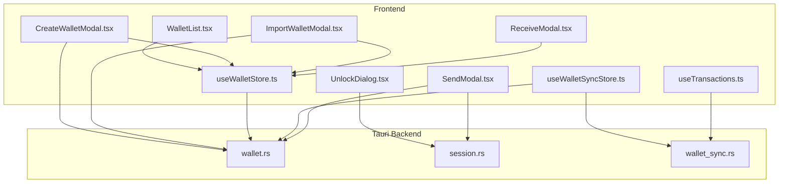
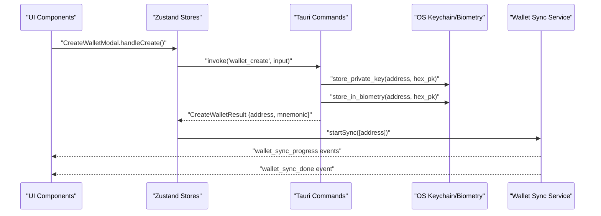
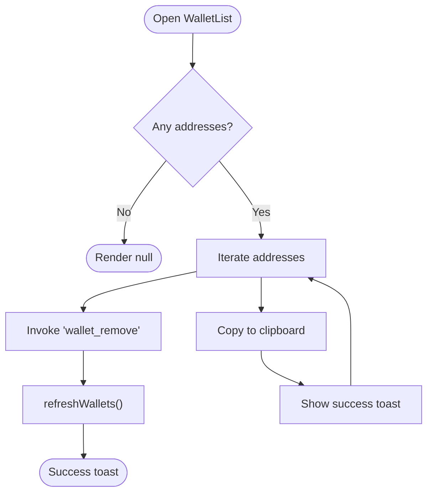
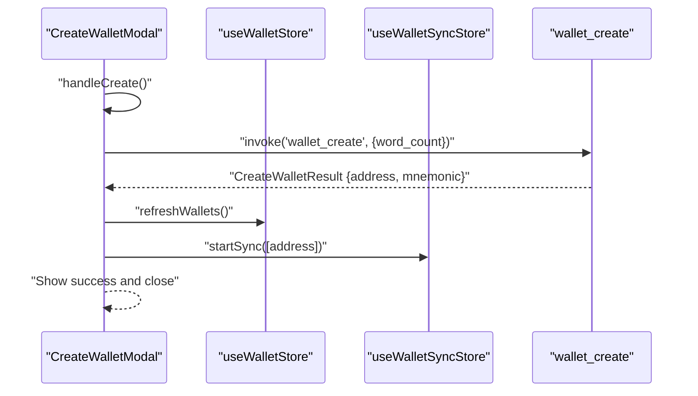
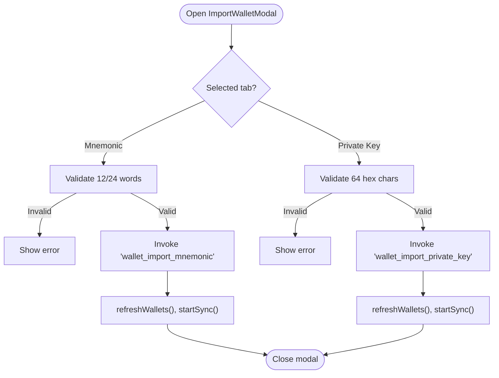
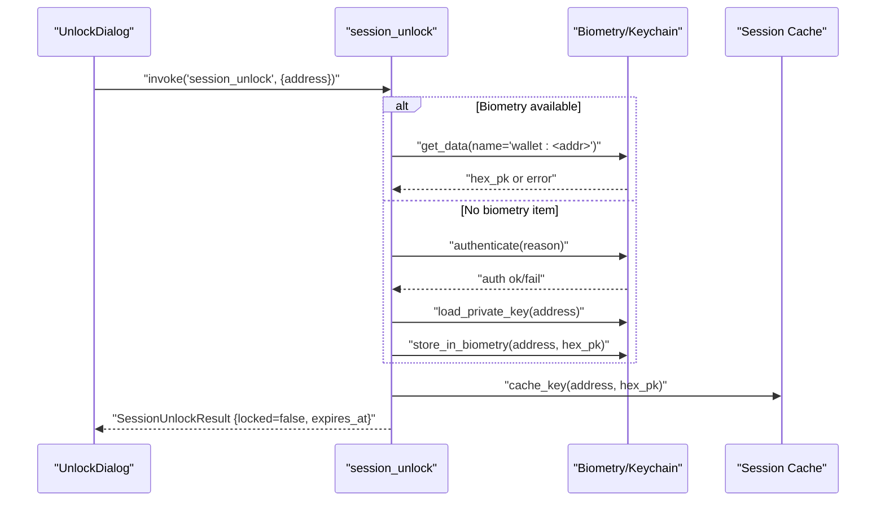
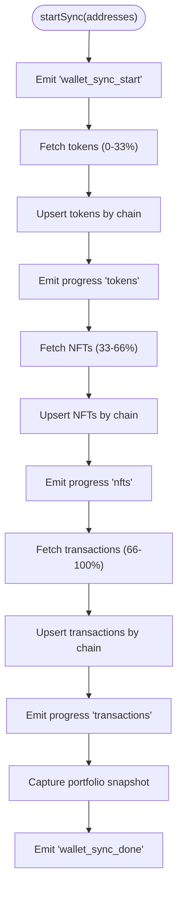
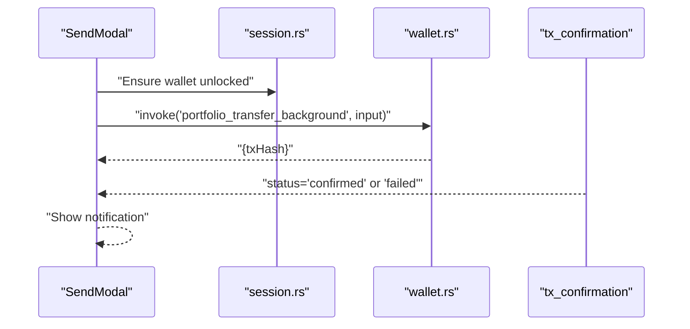
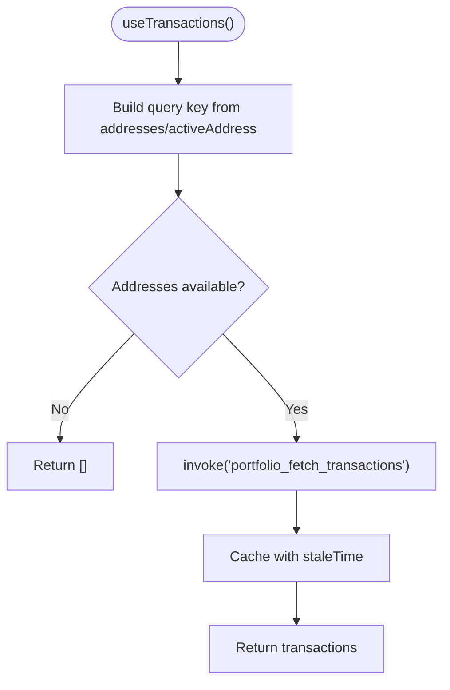
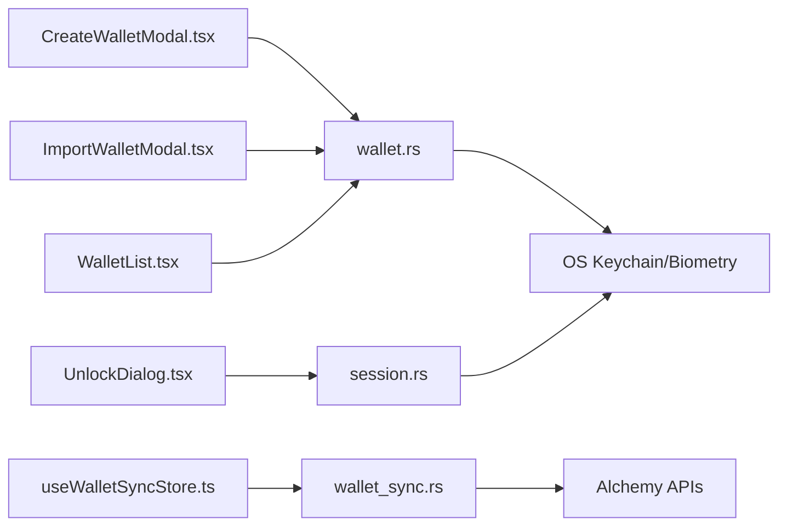

# Wallet Services

<cite>
**Referenced Files in This Document**
- [WalletList.tsx](file://src/components/wallet/WalletList.tsx)
- [CreateWalletModal.tsx](file://src/components/wallet/CreateWalletModal.tsx)
- [ImportWalletModal.tsx](file://src/components/wallet/ImportWalletModal.tsx)
- [UnlockDialog.tsx](file://src/components/wallet/UnlockDialog.tsx)
- [useWalletStore.ts](file://src/store/useWalletStore.ts)
- [useWalletSyncStore.ts](file://src/store/useWalletSyncStore.ts)
- [wallet.ts](file://src/types/wallet.ts)
- [wallet.rs](file://src-tauri/src/commands/wallet.rs)
- [session.rs](file://src-tauri/src/commands/session.rs)
- [wallet_sync.rs](file://src-tauri/src/services/wallet_sync.rs)
- [useTransactions.ts](file://src/hooks/useTransactions.ts)
- [SendModal.tsx](file://src/components/portfolio/SendModal.tsx)
- [ReceiveModal.tsx](file://src/components/portfolio/ReceiveModal.tsx)
</cite>

## Table of Contents
1. [Introduction](#introduction)
2. [Project Structure](#project-structure)
3. [Core Components](#core-components)
4. [Architecture Overview](#architecture-overview)
5. [Detailed Component Analysis](#detailed-component-analysis)
6. [Dependency Analysis](#dependency-analysis)
7. [Performance Considerations](#performance-considerations)
8. [Troubleshooting Guide](#troubleshooting-guide)
9. [Conclusion](#conclusion)
10. [Appendices](#appendices)

## Introduction
This document explains the wallet services system responsible for secure multi-wallet management and transaction processing. It covers the WalletList interface for listing and removing wallets, modal-based creation and import workflows, and UnlockDialog for authentication. It documents secure key storage integration with the OS keychain and biometric unlock, cross-chain wallet synchronization, transaction signing and broadcasting, encryption and backup/recovery procedures, and security best practices. Guidance is also provided for common operations such as balance checking, initiating transfers, and monitoring transactions, along with troubleshooting connectivity and security-related issues.

## Project Structure
The wallet services span React components for UI, Zustand stores for state, Tauri commands for backend operations, and Rust services for synchronization and security.

**Diagram sources**
- [WalletList.tsx:1-76](file://src/components/wallet/WalletList.tsx#L1-L76)
- [CreateWalletModal.tsx:1-169](file://src/components/wallet/CreateWalletModal.tsx#L1-L169)
- [ImportWalletModal.tsx:1-181](file://src/components/wallet/ImportWalletModal.tsx#L1-L181)
- [UnlockDialog.tsx:1-102](file://src/components/wallet/UnlockDialog.tsx#L1-L102)
- [useWalletStore.ts:1-48](file://src/store/useWalletStore.ts#L1-L48)
- [useWalletSyncStore.ts:1-199](file://src/store/useWalletSyncStore.ts#L1-L199)
- [wallet.rs:1-284](file://src-tauri/src/commands/wallet.rs#L1-L284)
- [session.rs:1-155](file://src-tauri/src/commands/session.rs#L1-L155)
- [wallet_sync.rs:1-453](file://src-tauri/src/services/wallet_sync.rs#L1-L453)
- [useTransactions.ts:1-48](file://src/hooks/useTransactions.ts#L1-L48)
- [SendModal.tsx:1-151](file://src/components/portfolio/SendModal.tsx#L1-L151)
- [ReceiveModal.tsx:1-97](file://src/components/portfolio/ReceiveModal.tsx#L1-L97)

**Section sources**
- [WalletList.tsx:1-76](file://src/components/wallet/WalletList.tsx#L1-L76)
- [CreateWalletModal.tsx:1-169](file://src/components/wallet/CreateWalletModal.tsx#L1-L169)
- [ImportWalletModal.tsx:1-181](file://src/components/wallet/ImportWalletModal.tsx#L1-L181)
- [UnlockDialog.tsx:1-102](file://src/components/wallet/UnlockDialog.tsx#L1-L102)
- [useWalletStore.ts:1-48](file://src/store/useWalletStore.ts#L1-L48)
- [useWalletSyncStore.ts:1-199](file://src/store/useWalletSyncStore.ts#L1-L199)
- [wallet.rs:1-284](file://src-tauri/src/commands/wallet.rs#L1-L284)
- [session.rs:1-155](file://src-tauri/src/commands/session.rs#L1-L155)
- [wallet_sync.rs:1-453](file://src-tauri/src/services/wallet_sync.rs#L1-L453)
- [useTransactions.ts:1-48](file://src/hooks/useTransactions.ts#L1-L48)
- [SendModal.tsx:1-151](file://src/components/portfolio/SendModal.tsx#L1-L151)
- [ReceiveModal.tsx:1-97](file://src/components/portfolio/ReceiveModal.tsx#L1-L97)

## Core Components
- WalletList: Displays saved wallet addresses, supports copy-to-clipboard and removal via backend invocation.
- CreateWalletModal: Generates a new EVM wallet, returns mnemonic and address, and starts synchronization.
- ImportWalletModal: Imports an existing wallet via mnemonic or private key, validates inputs, and starts synchronization.
- UnlockDialog: Initiates session unlock using biometric or fallback authentication; caches decrypted key for session duration.
- useWalletStore: Manages wallet addresses, active address, and wallet names; refreshes from backend.
- useWalletSyncStore: Orchestrates cross-chain synchronization, listens to progress and completion events, and surfaces notifications.
- Types: Define payloads for create/import/list/remove operations and portfolio data structures.
- Backend Commands: wallet.rs implements create/import/list/remove with OS keychain and optional biometric storage; session.rs handles unlock/lock/status with audit logging; wallet_sync.rs performs multi-chain sync and emits progress events.

**Section sources**
- [WalletList.tsx:18-76](file://src/components/wallet/WalletList.tsx#L18-L76)
- [CreateWalletModal.tsx:24-71](file://src/components/wallet/CreateWalletModal.tsx#L24-L71)
- [ImportWalletModal.tsx:35-99](file://src/components/wallet/ImportWalletModal.tsx#L35-L99)
- [UnlockDialog.tsx:27-58](file://src/components/wallet/UnlockDialog.tsx#L27-L58)
- [useWalletStore.ts:16-47](file://src/store/useWalletStore.ts#L16-L47)
- [useWalletSyncStore.ts:45-73](file://src/store/useWalletSyncStore.ts#L45-L73)
- [wallet.ts:1-59](file://src/types/wallet.ts#L1-L59)
- [wallet.rs:169-284](file://src-tauri/src/commands/wallet.rs#L169-L284)
- [session.rs:61-125](file://src-tauri/src/commands/session.rs#L61-L125)
- [wallet_sync.rs:260-452](file://src-tauri/src/services/wallet_sync.rs#L260-L452)

## Architecture Overview
The wallet system integrates frontend UI with Tauri commands and Rust services. Secure key material is stored in the OS keychain and optionally protected by biometric unlock. Cross-chain synchronization runs in the background and emits progress updates to the UI.

**Diagram sources**
- [CreateWalletModal.tsx:33-46](file://src/components/wallet/CreateWalletModal.tsx#L33-L46)
- [wallet.rs:169-200](file://src-tauri/src/commands/wallet.rs#L169-L200)
- [session.rs:137-143](file://src-tauri/src/commands/session.rs#L137-L143)
- [wallet_sync.rs:260-452](file://src-tauri/src/services/wallet_sync.rs#L260-L452)

## Detailed Component Analysis

### WalletList
- Purpose: Render a list of saved wallet addresses, enable quick copy, and remove wallets.
- Key behaviors:
  - Truncates addresses for readability using checksum formatting.
  - Copies address to clipboard and shows success toast.
  - Invokes backend to remove a wallet and refreshes the list.
- Security considerations:
  - Addresses are stored in a plain JSON file outside the keychain to avoid frequent OS prompts.
  - Removal deletes both keychain entries and biometric data.

**Diagram sources**
- [WalletList.tsx:18-76](file://src/components/wallet/WalletList.tsx#L18-L76)
- [wallet.rs:266-283](file://src-tauri/src/commands/wallet.rs#L266-L283)
- [useWalletStore.ts:23-37](file://src/store/useWalletStore.ts#L23-L37)

**Section sources**
- [WalletList.tsx:18-76](file://src/components/wallet/WalletList.tsx#L18-L76)
- [wallet.rs:88-126](file://src-tauri/src/commands/wallet.rs#L88-L126)
- [useWalletStore.ts:23-37](file://src/store/useWalletStore.ts#L23-L37)

### CreateWalletModal
- Purpose: Generate a new EVM wallet with configurable mnemonic length, display recovery phrase, and initiate synchronization.
- Key behaviors:
  - Validates word count (12 or 24).
  - Calls backend to create wallet, receives address and mnemonic.
  - Provides copy-to-clipboard for mnemonic.
  - Starts synchronization for the new address and shows success feedback.
- Security considerations:
  - Mnemonic and private key are stored in OS keychain and optionally biometric-protected.
  - Address list is persisted separately to avoid repeated keychain prompts.

**Diagram sources**
- [CreateWalletModal.tsx:33-62](file://src/components/wallet/CreateWalletModal.tsx#L33-L62)
- [wallet.rs:169-200](file://src-tauri/src/commands/wallet.rs#L169-L200)
- [useWalletStore.ts:23-37](file://src/store/useWalletStore.ts#L23-L37)
- [useWalletSyncStore.ts:64-72](file://src/store/useWalletSyncStore.ts#L64-L72)

**Section sources**
- [CreateWalletModal.tsx:24-71](file://src/components/wallet/CreateWalletModal.tsx#L24-L71)
- [wallet.rs:169-200](file://src-tauri/src/commands/wallet.rs#L169-L200)
- [useWalletSyncStore.ts:64-72](file://src/store/useWalletSyncStore.ts#L64-L72)

### ImportWalletModal
- Purpose: Import an existing wallet via mnemonic or private key.
- Key behaviors:
  - Tabs for mnemonic vs private key import.
  - Validates mnemonic length (12/24 words) and private key format (64 hex chars, optional 0x prefix).
  - Calls backend to import and persists address; starts synchronization.
- Security considerations:
  - Private key is immediately stored in keychain and migrated to biometric storage if available.

**Diagram sources**
- [ImportWalletModal.tsx:35-99](file://src/components/wallet/ImportWalletModal.tsx#L35-L99)
- [wallet.rs:202-258](file://src-tauri/src/commands/wallet.rs#L202-L258)
- [useWalletStore.ts:23-37](file://src/store/useWalletStore.ts#L23-L37)
- [useWalletSyncStore.ts:64-72](file://src/store/useWalletSyncStore.ts#L64-L72)

**Section sources**
- [ImportWalletModal.tsx:35-99](file://src/components/wallet/ImportWalletModal.tsx#L35-L99)
- [wallet.rs:202-258](file://src-tauri/src/commands/wallet.rs#L202-L258)
- [useWalletStore.ts:23-37](file://src/store/useWalletStore.ts#L23-L37)
- [useWalletSyncStore.ts:64-72](file://src/store/useWalletSyncStore.ts#L64-L72)

### UnlockDialog
- Purpose: Authenticate to unlock a wallet for signing operations.
- Key behaviors:
  - Calls backend session unlock command.
  - Handles biometric unlock; on failure, falls back to device credential and migrates key to biometry.
  - Sets expiration for cached key and notifies parent.
- Security considerations:
  - Uses OS biometric APIs with user-presence enforcement.
  - Audit logs failures for security review.

**Diagram sources**
- [UnlockDialog.tsx:27-58](file://src/components/wallet/UnlockDialog.tsx#L27-L58)
- [session.rs:61-125](file://src-tauri/src/commands/session.rs#L61-L125)
- [wallet.rs:128-148](file://src-tauri/src/commands/wallet.rs#L128-L148)

**Section sources**
- [UnlockDialog.tsx:27-58](file://src/components/wallet/UnlockDialog.tsx#L27-L58)
- [session.rs:61-125](file://src-tauri/src/commands/session.rs#L61-L125)
- [wallet.rs:128-148](file://src-tauri/src/commands/wallet.rs#L128-L148)

### Wallet Synchronization and Cross-Chain Portfolio
- Purpose: Fetch tokens, NFTs, and transaction history across configured networks and persist locally.
- Key behaviors:
  - Emits progress events per wallet and per step.
  - Upserts tokens grouped by chain; fetches NFTs and transactions per network.
  - On completion, captures portfolio snapshots and refreshes opportunities.
- Integration points:
  - Listens to wallet_sync_progress and wallet_sync_done events.
  - Requires ALCHEMY_API_KEY for RPC and NFT queries.

**Diagram sources**
- [useWalletSyncStore.ts:64-72](file://src/store/useWalletSyncStore.ts#L64-L72)
- [wallet_sync.rs:260-452](file://src-tauri/src/services/wallet_sync.rs#L260-L452)

**Section sources**
- [useWalletSyncStore.ts:45-73](file://src/store/useWalletSyncStore.ts#L45-L73)
- [useWalletSyncStore.ts:111-151](file://src/store/useWalletSyncStore.ts#L111-L151)
- [wallet_sync.rs:260-452](file://src-tauri/src/services/wallet_sync.rs#L260-L452)

### Transaction Signing and Broadcasting
- Purpose: Initiate transfers and monitor confirmations.
- Key behaviors:
  - SendModal validates inputs and invokes backend transfer command.
  - On success, shows informational toast and triggers UI updates.
  - Wallet must be unlocked; errors surface guidance to unlock.
- Monitoring:
  - Listens to tx_confirmation events and shows notifications for success or failure.

**Diagram sources**
- [SendModal.tsx:106-142](file://src/components/portfolio/SendModal.tsx#L106-L142)
- [session.rs:61-125](file://src-tauri/src/commands/session.rs#L61-L125)
- [useWalletSyncStore.ts:78-108](file://src/store/useWalletSyncStore.ts#L78-L108)

**Section sources**
- [SendModal.tsx:26-142](file://src/components/portfolio/SendModal.tsx#L26-L142)
- [useWalletSyncStore.ts:78-108](file://src/store/useWalletSyncStore.ts#L78-L108)

### Balance Checking and Transaction Monitoring
- Purpose: Retrieve recent transactions for selected wallet(s).
- Key behaviors:
  - useTransactions composes a query key from addresses and active address.
  - Invokes backend to fetch transactions with pagination support.
  - Exposes refetch to refresh data.

**Diagram sources**
- [useTransactions.ts:23-47](file://src/hooks/useTransactions.ts#L23-L47)

**Section sources**
- [useTransactions.ts:23-47](file://src/hooks/useTransactions.ts#L23-L47)

### Receive Modal
- Purpose: Display selectable wallet addresses for receiving assets.
- Key behaviors:
  - Renders named wallets from store.
  - Copies selected address to clipboard with feedback.

**Section sources**
- [ReceiveModal.tsx:19-96](file://src/components/portfolio/ReceiveModal.tsx#L19-L96)
- [useWalletStore.ts:16-47](file://src/store/useWalletStore.ts#L16-L47)

## Dependency Analysis
- Frontend components depend on Zustand stores for state and Tauri invocations for backend operations.
- Backend commands depend on OS keychain and biometry plugins for secure storage and authentication.
- Synchronization service depends on external APIs (Alchemy) and local database persistence.

**Diagram sources**
- [CreateWalletModal.tsx:17-46](file://src/components/wallet/CreateWalletModal.tsx#L17-L46)
- [ImportWalletModal.tsx:16-94](file://src/components/wallet/ImportWalletModal.tsx#L16-L94)
- [WalletList.tsx:7-35](file://src/components/wallet/WalletList.tsx#L7-L35)
- [UnlockDialog.tsx:3-58](file://src/components/wallet/UnlockDialog.tsx#L3-L58)
- [wallet.rs:1-284](file://src-tauri/src/commands/wallet.rs#L1-L284)
- [session.rs:1-155](file://src-tauri/src/commands/session.rs#L1-L155)
- [wallet_sync.rs:1-453](file://src-tauri/src/services/wallet_sync.rs#L1-L453)

**Section sources**
- [wallet.rs:1-284](file://src-tauri/src/commands/wallet.rs#L1-L284)
- [session.rs:1-155](file://src-tauri/src/commands/session.rs#L1-L155)
- [wallet_sync.rs:1-453](file://src-tauri/src/services/wallet_sync.rs#L1-L453)

## Performance Considerations
- Cross-chain sync is segmented into steps and emits progress updates to keep UI responsive.
- Token fetching groups assets by chain to minimize redundant writes.
- Transaction queries cache results with a short stale time to balance freshness and performance.
- Biometric unlock avoids repeated keychain prompts by caching keys during the session.

[No sources needed since this section provides general guidance]

## Troubleshooting Guide
- Missing ALCHEMY_API_KEY:
  - Symptom: Sync fails early with a missing key error.
  - Action: Configure the API key in settings and restart sync.
- Wallet locked during transfer:
  - Symptom: Transfer command reports wallet locked.
  - Action: Open UnlockDialog and authenticate; retry transfer.
- Biometric unlock failures:
  - Symptom: Authentication failed or lockout; fallback to device credential.
  - Action: Retry with device credential; ensure biometric enrollment is intact.
- Clipboard operations:
  - Symptom: Copy actions do not work.
  - Action: Verify browser permissions and try again.
- No wallets shown:
  - Symptom: Receive modal displays “No wallets found.”
  - Action: Create or import a wallet; ensure refreshWallets is invoked after operations.

**Section sources**
- [wallet_sync.rs:261-274](file://src-tauri/src/services/wallet_sync.rs#L261-L274)
- [SendModal.tsx:131-139](file://src/components/portfolio/SendModal.tsx#L131-L139)
- [session.rs:82-115](file://src-tauri/src/commands/session.rs#L82-L115)
- [ReceiveModal.tsx:77-81](file://src/components/portfolio/ReceiveModal.tsx#L77-L81)

## Conclusion
The wallet services system provides a secure, user-friendly foundation for managing multiple EVM wallets. It leverages OS keychain and biometric authentication for secure key storage, offers robust import and creation workflows, and delivers comprehensive cross-chain synchronization and transaction monitoring. By following the documented best practices and troubleshooting steps, users can maintain strong security while efficiently managing assets across chains.

[No sources needed since this section summarizes without analyzing specific files]

## Appendices

### Security Best Practices
- Always back up recovery phrases offline and never share them.
- Keep biometric enrollment current; rely on device credentials as a fallback.
- Limit exposure of private keys; avoid storing unencrypted copies.
- Regularly review synchronized networks and remove unused wallets.
- Monitor notifications for sync and alert events to detect anomalies.

[No sources needed since this section provides general guidance]

### Backup and Recovery Procedures
- Creation: Capture the mnemonic immediately after creation; confirm backup before closing the modal.
- Import: Validate mnemonic/private key format before importing; verify the derived address.
- Removal: Removing a wallet deletes keychain and biometric entries; ensure backups are retained externally.

**Section sources**
- [CreateWalletModal.tsx:93-119](file://src/components/wallet/CreateWalletModal.tsx#L93-L119)
- [ImportWalletModal.tsx:51-94](file://src/components/wallet/ImportWalletModal.tsx#L51-L94)
- [wallet.rs:266-283](file://src-tauri/src/commands/wallet.rs#L266-L283)

### Encryption and Key Storage
- Private keys are stored in the OS keychain and optionally protected by biometric unlock.
- Address lists are persisted in a plain JSON file to avoid repeated OS prompts.
- Session cache holds decrypted keys temporarily for signing operations.

**Section sources**
- [wallet.rs:128-148](file://src-tauri/src/commands/wallet.rs#L128-L148)
- [session.rs:61-125](file://src-tauri/src/commands/session.rs#L61-L125)
- [wallet.rs:82-126](file://src-tauri/src/commands/wallet.rs#L82-L126)

### Gas Optimization and Transaction Broadcasting
- The transfer process uses a background command that encapsulates gas estimation and submission; UI remains responsive.
- Users receive immediate feedback upon broadcast and subsequent notifications upon confirmation or failure.

**Section sources**
- [SendModal.tsx:115-124](file://src/components/portfolio/SendModal.tsx#L115-L124)
- [useWalletSyncStore.ts:78-108](file://src/store/useWalletSyncStore.ts#L78-L108)